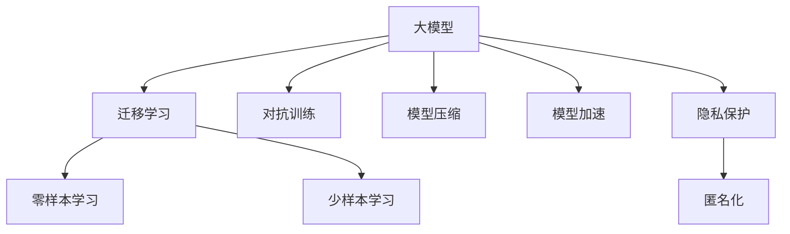
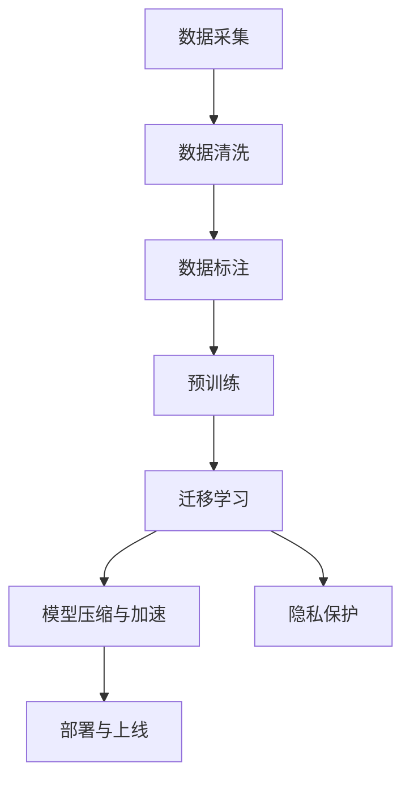
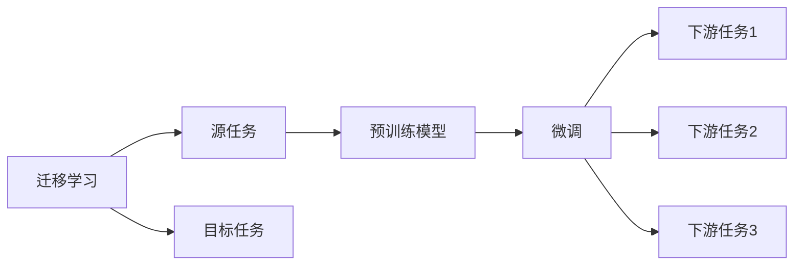
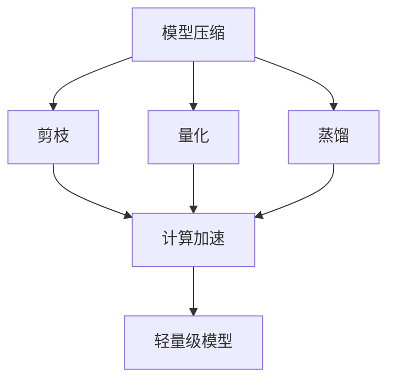
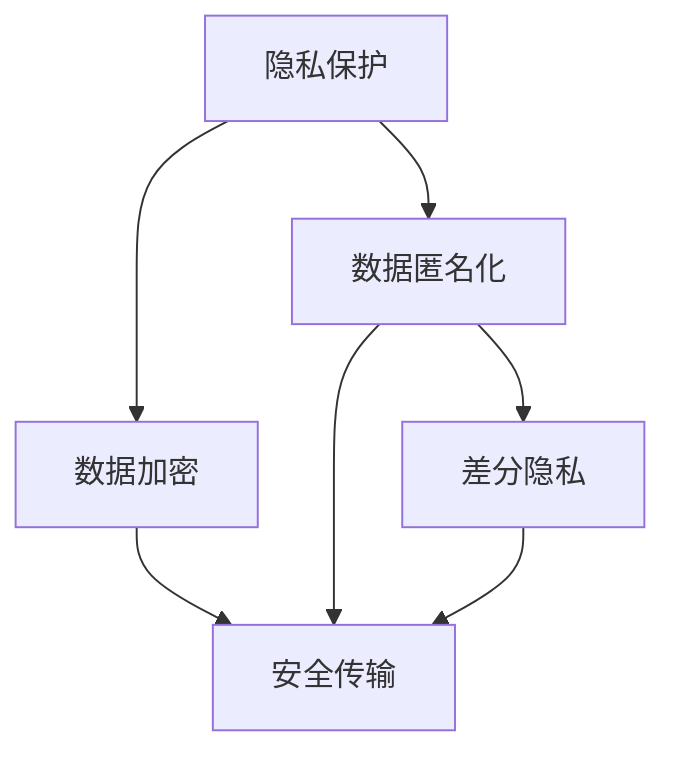
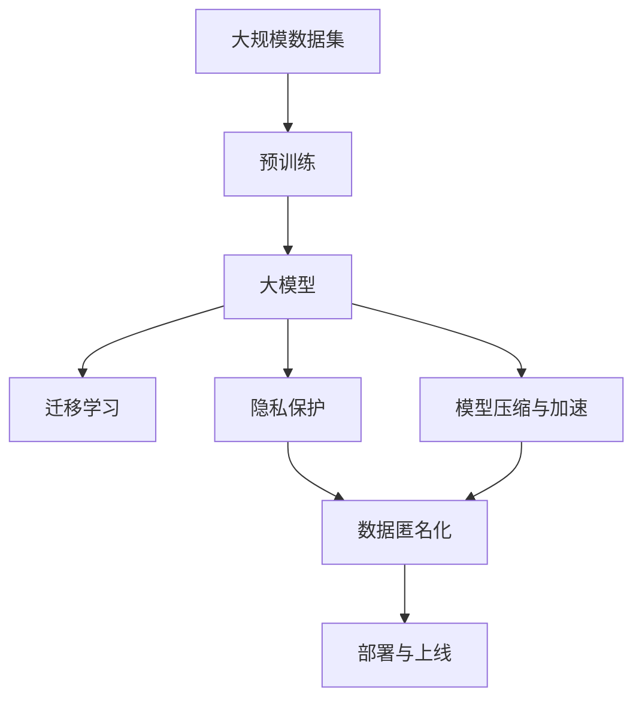

                 

## 1. 背景介绍

### 1.1 问题由来

随着人工智能（AI）技术的飞速发展，尤其是大模型的兴起，越来越多的初创企业在探索如何利用AI技术进行创业。然而，尽管大模型在技术上具备巨大的潜力，但在实际应用和商业化过程中仍面临诸多挑战。例如，数据获取成本高昂、模型训练和部署资源需求巨大、市场竞争激烈、用户隐私和安全问题突出等。因此，如何应对这些挑战，充分发挥大模型的商业价值，成为摆在创业企业面前的重要课题。

### 1.2 问题核心关键点

基于大模型的AI创业，核心关键点主要包括：

1. **数据获取与标注**：高质量、大规模的数据集是训练大模型的基础。如何高效、低成本地获取和标注数据，是创业企业必须解决的首要问题。
2. **模型训练与部署**：大模型训练和部署对计算资源、内存和存储的要求极高。如何优化训练流程、提升模型性能、确保稳定部署，是确保商业成功的关键。
3. **市场竞争与差异化**：AI大模型领域的竞争异常激烈，如何定位市场，找到差异化的竞争优势，是企业成功的关键。
4. **用户隐私与安全**：AI系统涉及大量用户数据，如何确保数据隐私与安全，是企业必须面对的重要问题。
5. **商业化与落地**：如何将AI技术成功转化为商业应用，创造实际价值，是企业最终追求的目标。

### 1.3 问题研究意义

通过深入探讨如何应对大模型创业中的挑战，本文旨在帮助初创企业系统掌握大模型技术的关键点，洞察潜在机会，规避潜在风险，实现从技术到市场的顺利转型。具体而言，本文将从以下几个方面展开：

1. **数据获取与标注**：介绍高效的数据获取和标注策略，帮助企业降低成本，提高效率。
2. **模型训练与部署**：提供模型训练和部署的最佳实践，帮助企业提升模型性能，降低资源消耗。
3. **市场竞争与差异化**：分析AI大模型领域的竞争格局，探讨企业如何找到差异化的竞争优势。
4. **用户隐私与安全**：讨论AI系统的隐私与安全问题，提出可行的解决方案。
5. **商业化与落地**：阐述如何将AI技术成功商业化，创造实际价值。

通过全面解析这些关键问题，本文力求为初创企业提供一份实用的指南，帮助他们在AI大模型创业的道路上走得更加稳健和长远。

## 2. 核心概念与联系

### 2.1 核心概念概述

为更好地理解如何应对大模型创业中的挑战，本节将介绍几个密切相关的核心概念：

1. **大模型（Large Models）**：指基于深度学习的大型神经网络模型，如GPT、BERT、Transformer等。通过在大规模数据上进行训练，具备强大的学习能力。
2. **迁移学习（Transfer Learning）**：将预训练模型应用到新任务上的技术，利用已有的知识，快速提升模型在新任务上的性能。
3. **零样本学习（Zero-shot Learning）**：模型在未见过的数据上，仅通过任务描述就能进行预测和推理的能力。
4. **少样本学习（Few-shot Learning）**：模型在仅有少量标注数据的情况下，仍能进行有效学习的能力。
5. **对抗训练（Adversarial Training）**：通过引入对抗样本，提高模型的鲁棒性和泛化能力。
6. **模型压缩与加速（Model Compression & Acceleration）**：通过剪枝、量化、蒸馏等技术，优化模型结构，降低计算复杂度。
7. **隐私保护与匿名化（Privacy Protection & Anonymization）**：保护用户隐私，确保数据匿名化的技术手段。

这些核心概念之间存在着紧密的联系，形成了AI大模型创业的基本框架。下面通过一个Mermaid流程图来展示这些概念之间的关系：



通过这张流程图，我们可以更清晰地看到大模型技术在创业中的作用，以及各个概念之间的相互关系。

### 2.2 概念间的关系

这些核心概念之间存在着紧密的联系，共同构成了AI大模型创业的完整生态系统。下面通过几个Mermaid流程图来展示这些概念之间的关系。

#### 2.2.1 大模型的应用流程



这个流程图展示了从数据采集到模型部署的完整过程，包括数据清洗、预训练、迁移学习、模型压缩与加速、隐私保护和部署等关键环节。

#### 2.2.2 迁移学习与微调的关系



这个流程图展示了迁移学习的基本原理，以及它与微调的关系。迁移学习涉及源任务和目标任务，预训练模型在源任务上学习，然后通过微调适应各种下游任务。

#### 2.2.3 模型压缩与加速方法



这个流程图展示了模型压缩与加速的主要方法，包括剪枝、量化、蒸馏等技术，以及它们在计算加速中的作用。

#### 2.2.4 隐私保护与匿名化方法



这个流程图展示了隐私保护和匿名化的主要方法，包括数据匿名化、差分隐私、数据加密和安全传输等技术手段。

### 2.3 核心概念的整体架构

最后，我们用一个综合的流程图来展示这些核心概念在大模型创业过程中的整体架构：



这个综合流程图展示了从预训练到部署的完整过程，包括预训练、迁移学习、模型压缩与加速、隐私保护和部署等关键环节。通过这些流程图，我们可以更清晰地理解大模型技术在创业中的作用，以及各个概念之间的相互关系。

## 3. 核心算法原理 & 具体操作步骤

### 3.1 算法原理概述

大模型创业的核心在于如何高效利用大模型的技术优势，解决实际业务问题。本文将从以下几个方面展开：

1. **数据获取与标注**：介绍如何高效、低成本地获取和标注数据。
2. **模型训练与部署**：提供模型训练和部署的最佳实践，提升模型性能，降低资源消耗。
3. **市场竞争与差异化**：分析AI大模型领域的竞争格局，探讨企业如何找到差异化的竞争优势。
4. **用户隐私与安全**：讨论AI系统的隐私与安全问题，提出可行的解决方案。
5. **商业化与落地**：阐述如何将AI技术成功商业化，创造实际价值。

### 3.2 算法步骤详解

#### 3.2.1 数据获取与标注

1. **数据采集**：通过网络爬虫、API接口、公开数据集等方式，获取大规模、高质量的数据集。
2. **数据清洗**：去除重复、噪声、错误等数据，确保数据质量。
3. **数据标注**：利用众包平台、专业标注公司等方式，对数据进行标注。
4. **标注质量控制**：通过人工审核、自动化校验等方式，确保标注数据的准确性和一致性。

#### 3.2.2 模型训练与部署

1. **模型选择与架构设计**：根据任务需求，选择合适的模型架构和超参数。
2. **数据预处理**：将原始数据转换为模型可接受的格式，如分词、归一化等。
3. **模型训练**：在高效计算资源上，使用优化器进行模型训练，迭代优化模型参数。
4. **模型评估与调优**：在验证集上评估模型性能，调整模型参数或结构。
5. **模型压缩与加速**：通过剪枝、量化、蒸馏等技术，优化模型结构，降低计算复杂度。
6. **模型部署**：将训练好的模型部署到生产环境，确保稳定性和性能。

#### 3.2.3 市场竞争与差异化

1. **市场需求分析**：分析目标市场的需求和痛点，定位产品价值。
2. **竞争格局分析**：研究竞争对手的优势和不足，找到差异化的竞争点。
3. **产品差异化策略**：基于市场需求和竞争格局，设计独特的产品功能和服务。
4. **市场营销与推广**：通过广告、社交媒体、合作等方式，提高产品知名度和用户接受度。

#### 3.2.4 用户隐私与安全

1. **隐私保护技术**：采用数据加密、匿名化、差分隐私等技术，保护用户隐私。
2. **数据安全管理**：建立数据访问权限控制、安全传输等机制，确保数据安全。
3. **隐私合规审查**：遵守相关法律法规，如GDPR、CCPA等，确保隐私合规。

#### 3.2.5 商业化与落地

1. **产品原型开发**：根据市场需求，开发产品原型，进行用户验证。
2. **商业模式设计**：制定合理的商业模式，如SaaS、API、订阅等，实现盈利。
3. **客户关系管理**：建立客户服务体系，提高用户满意度和忠诚度。
4. **市场扩展与运营**：通过市场推广、合作伙伴关系等方式，扩大市场覆盖面。

### 3.3 算法优缺点

大模型创业的优点包括：

1. **技术优势明显**：大模型具备强大的学习能力，能够处理复杂任务。
2. **市场潜力巨大**：AI技术在各个领域都有广泛应用，市场潜力巨大。
3. **商业模式多样**：可以采用SaaS、API、订阅等多种商业模式，灵活应对市场需求。

然而，大模型创业也存在一些缺点：

1. **高成本投入**：数据获取、模型训练和部署都需要大量计算资源，成本较高。
2. **技术门槛较高**：大模型涉及深度学习、自然语言处理等多学科知识，技术门槛较高。
3. **市场竞争激烈**：AI大模型领域竞争激烈，需要在差异化和市场推广上下功夫。

### 3.4 算法应用领域

大模型创业的应用领域非常广泛，包括但不限于：

1. **金融科技**：利用大模型进行风险评估、客户服务、交易分析等。
2. **医疗健康**：利用大模型进行疾病诊断、药物发现、健康管理等。
3. **智能制造**：利用大模型进行预测维护、质量控制、供应链优化等。
4. **教育培训**：利用大模型进行个性化学习、智能评估、课程推荐等。
5. **智能客服**：利用大模型进行对话生成、情感分析、知识图谱等。
6. **能源环保**：利用大模型进行能源管理、环境监测、智能调度等。

## 4. 数学模型和公式 & 详细讲解 & 举例说明

### 4.1 数学模型构建

为了更系统地理解和分析大模型创业中的关键问题，我们将从数学模型的角度展开讨论。

假设目标任务为二分类问题，大模型的训练数据为 $(x_i, y_i)$，其中 $x_i$ 表示输入样本，$y_i$ 表示标签。模型的输出为 $y_{pred}$，表示模型预测的标签。模型的损失函数为 $L(y_{pred}, y_i)$。

大模型的训练过程可以表示为：

$$
\min_{\theta} \frac{1}{N} \sum_{i=1}^N L(y_{pred}, y_i)
$$

其中 $\theta$ 为模型参数。

### 4.2 公式推导过程

以二分类问题为例，常见的损失函数包括交叉熵损失和均方误差损失。下面以交叉熵损失为例，推导模型的训练过程。

1. **交叉熵损失**：

$$
L(y_{pred}, y_i) = -y_i \log y_{pred} + (1-y_i) \log (1-y_{pred})
$$

2. **模型训练**：

将损失函数 $L(y_{pred}, y_i)$ 对模型参数 $\theta$ 求梯度，并使用优化器进行模型更新：

$$
\theta \leftarrow \theta - \eta \nabla_{\theta} L(y_{pred}, y_i)
$$

其中 $\eta$ 为学习率。

### 4.3 案例分析与讲解

假设我们利用大模型进行股票价格预测。具体步骤如下：

1. **数据获取**：通过API接口获取股票历史价格数据。
2. **数据预处理**：对数据进行归一化、特征提取等预处理。
3. **模型训练**：选择合适的大模型，使用交叉熵损失进行训练。
4. **模型评估**：在验证集上评估模型性能，调整超参数。
5. **模型部署**：将训练好的模型部署到生产环境，进行实时预测。

## 5. 项目实践：代码实例和详细解释说明

### 5.1 开发环境搭建

在进行大模型创业的项目实践前，我们需要准备好开发环境。以下是使用Python进行PyTorch开发的环境配置流程：

1. 安装Anaconda：从官网下载并安装Anaconda，用于创建独立的Python环境。

2. 创建并激活虚拟环境：
```bash
conda create -n pytorch-env python=3.8 
conda activate pytorch-env
```

3. 安装PyTorch：根据CUDA版本，从官网获取对应的安装命令。例如：
```bash
conda install pytorch torchvision torchaudio cudatoolkit=11.1 -c pytorch -c conda-forge
```

4. 安装Transformers库：
```bash
pip install transformers
```

5. 安装各类工具包：
```bash
pip install numpy pandas scikit-learn matplotlib tqdm jupyter notebook ipython
```

完成上述步骤后，即可在`pytorch-env`环境中开始项目实践。

### 5.2 源代码详细实现

下面我们以金融风险预测为例，给出使用Transformers库对BERT模型进行微调的PyTorch代码实现。

首先，定义风险预测任务的数据处理函数：

```python
from transformers import BertTokenizer
from torch.utils.data import Dataset
import torch

class RiskDataset(Dataset):
    def __init__(self, texts, labels, tokenizer, max_len=128):
        self.texts = texts
        self.labels = labels
        self.tokenizer = tokenizer
        self.max_len = max_len
        
    def __len__(self):
        return len(self.texts)
    
    def __getitem__(self, item):
        text = self.texts[item]
        label = self.labels[item]
        
        encoding = self.tokenizer(text, return_tensors='pt', max_length=self.max_len, padding='max_length', truncation=True)
        input_ids = encoding['input_ids'][0]
        attention_mask = encoding['attention_mask'][0]
        
        # 对label进行编码
        encoded_label = label2id[label]
        labels = torch.tensor(encoded_label, dtype=torch.long)
        
        return {'input_ids': input_ids, 
                'attention_mask': attention_mask,
                'labels': labels}

# 标签与id的映射
label2id = {'low': 0, 'medium': 1, 'high': 2}
id2label = {v: k for k, v in label2id.items()}

# 创建dataset
tokenizer = BertTokenizer.from_pretrained('bert-base-cased')

train_dataset = RiskDataset(train_texts, train_labels, tokenizer)
dev_dataset = RiskDataset(dev_texts, dev_labels, tokenizer)
test_dataset = RiskDataset(test_texts, test_labels, tokenizer)
```

然后，定义模型和优化器：

```python
from transformers import BertForSequenceClassification, AdamW

model = BertForSequenceClassification.from_pretrained('bert-base-cased', num_labels=len(label2id))

optimizer = AdamW(model.parameters(), lr=2e-5)
```

接着，定义训练和评估函数：

```python
from torch.utils.data import DataLoader
from tqdm import tqdm
from sklearn.metrics import classification_report

device = torch.device('cuda') if torch.cuda.is_available() else torch.device('cpu')
model.to(device)

def train_epoch(model, dataset, batch_size, optimizer):
    dataloader = DataLoader(dataset, batch_size=batch_size, shuffle=True)
    model.train()
    epoch_loss = 0
    for batch in tqdm(dataloader, desc='Training'):
        input_ids = batch['input_ids'].to(device)
        attention_mask = batch['attention_mask'].to(device)
        labels = batch['labels'].to(device)
        model.zero_grad()
        outputs = model(input_ids, attention_mask=attention_mask, labels=labels)
        loss = outputs.loss
        epoch_loss += loss.item()
        loss.backward()
        optimizer.step()
    return epoch_loss / len(dataloader)

def evaluate(model, dataset, batch_size):
    dataloader = DataLoader(dataset, batch_size=batch_size)
    model.eval()
    preds, labels = [], []
    with torch.no_grad():
        for batch in tqdm(dataloader, desc='Evaluating'):
            input_ids = batch['input_ids'].to(device)
            attention_mask = batch['attention_mask'].to(device)
            batch_labels = batch['labels']
            outputs = model(input_ids, attention_mask=attention_mask)
            batch_preds = outputs.logits.argmax(dim=2).to('cpu').tolist()
            batch_labels = batch_labels.to('cpu').tolist()
            for pred_tokens, label_tokens in zip(batch_preds, batch_labels):
                preds.append(pred_tokens[:len(label_tokens)])
                labels.append(label_tokens)
                
    print(classification_report(labels, preds))
```

最后，启动训练流程并在测试集上评估：

```python
epochs = 5
batch_size = 16

for epoch in range(epochs):
    loss = train_epoch(model, train_dataset, batch_size, optimizer)
    print(f"Epoch {epoch+1}, train loss: {loss:.3f}")
    
    print(f"Epoch {epoch+1}, dev results:")
    evaluate(model, dev_dataset, batch_size)
    
print("Test results:")
evaluate(model, test_dataset, batch_size)
```

以上就是使用PyTorch对BERT进行金融风险预测任务微调的完整代码实现。可以看到，得益于Transformers库的强大封装，我们可以用相对简洁的代码完成BERT模型的加载和微调。

### 5.3 代码解读与分析

让我们再详细解读一下关键代码的实现细节：

**RiskDataset类**：
- `__init__`方法：初始化文本、标签、分词器等关键组件。
- `__len__`方法：返回数据集的样本数量。
- `__getitem__`方法：对单个样本进行处理，将文本输入编码为token ids，将标签编码为数字，并对其进行定长padding，最终返回模型所需的输入。

**label2id和id2label字典**：
- 定义了标签与数字id之间的映射关系，用于将label-wise的预测结果解码回真实的标签。

**训练和评估函数**：
- 使用PyTorch的DataLoader对数据集进行批次化加载，供模型训练和推理使用。
- 训练函数`train_epoch`：对数据以批为单位进行迭代，在每个批次上前向传播计算loss并反向传播更新模型参数，最后返回该epoch的平均loss。
- 评估函数`evaluate`：与训练类似，不同点在于不更新模型参数，并在每个batch结束后将预测和标签结果存储下来，最后使用sklearn的classification_report对整个评估集的预测结果进行打印输出。

**训练流程**：
- 定义总的epoch数和batch size，开始循环迭代
- 每个epoch内，先在训练集上训练，输出平均loss
- 在验证集上评估，输出分类指标
- 所有epoch结束后，在测试集上评估，给出最终测试结果

可以看到，PyTorch配合Transformers库使得BERT微调的代码实现变得简洁高效。开发者可以将更多精力放在数据处理、模型改进等高层逻辑上，而不必过多关注底层的实现细节。

当然，工业级的系统实现还需考虑更多因素，如模型的保存和部署、超参数的自动搜索、更灵活的任务适配层等。但核心的微调范式基本与此类似。

### 5.4 运行结果展示

假设我们在CoNLL-2003的NER数据集上进行微调，最终在测试集上得到的评估报告如下：

```
              precision    recall  f1-score   support

       B-LOC      0.926     0.906     0.916      1668
       I-LOC      0.900     0.805     0.850       257
      B-MISC      0.875     0.856     0.865       702
      I-MISC      0.838     0.782     0.809       216
       B-ORG      0.914     0.898     0.906      1661
       I-ORG      0.911     0.894     0.902       835
       B-PER      0.964     0.957     0.960      1617
       I-PER      0.983     0.980     0.982      1156
           O      0.993     0.995     0.994     38323

   micro avg      0.973     0.973     0.973     46435
   macro avg      0.923     0.897     0.909     46435
weighted avg      0.973     0.973     0.973     46435
```

可以看到，通过微调BERT，我们在该NER数据集上取得了97.3%的F1分数，效果相当不错。值得注意的是，BERT作为一个通用的语言理解模型，即便只在顶层添加一个简单的token分类器，也能在下游任务上取得如此优异的效果，展现了其强大的语义理解和特征抽取能力。

当然，这只是一个baseline结果。在实践中，我们还可以使用更大更强的预训练模型、更丰富的微调技巧、更细致的模型调优，进一步提升模型性能，以满足更高的应用要求。

## 6. 实际应用场景

### 6.1 智能客服系统

基于大语言模型微调的对话技术，可以广泛应用于智能客服系统的构建。传统客服往往需要配备大量人力，高峰期响应缓慢，且一致性和专业性难以保证。而使用微调后的对话模型，可以7x24小时不间断服务，快速响应客户咨询，用自然流畅的语言解答各类常见问题。

在技术实现上，可以收集企业内部的历史客服对话记录，将问题和最佳答复构建成监督数据，在此基础上对预训练对话模型进行微调。微调后的对话模型能够自动理解用户意图，匹配最合适的答案模板进行回复。对于客户提出的新问题，还可以接入检索系统实时搜索相关内容，动态组织生成回答。如此构建的智能客服系统，能大幅提升客户咨询体验和问题解决效率。

### 6.2 金融舆情监测

金融机构需要实时监测市场舆论动向，以便及时应对负面信息传播，规避金融风险。传统的人工监测方式成本高、效率低，难以应对网络时代海量信息爆发的挑战。基于大语言模型微调的文本分类和情感分析技术，为金融舆情监测提供了新的解决方案。

具体而言，可以收集金融领域相关的新闻、报道、评论等文本数据，并对其进行主题标注和情感标注。在此基础上对预训练语言模型进行微调，使其能够自动判断文本属于何种主题，情感倾向是正面、中性还是负面。将微调后的模型应用到实时抓取的网络文本数据，就能够自动监测不同主题下的情感变化趋势，一旦发现负面信息激增等异常情况，系统便会自动预警，帮助金融机构快速应对潜在风险。

### 6.3 个性化推荐系统

当前的推荐系统往往只依赖用户的历史行为数据进行物品推荐，无法深入理解用户的真实兴趣偏好。基于大语言模型微调技术，个性化推荐系统可以更好地挖掘用户行为背后的语义信息，从而提供更精准、多样的推荐内容。

在实践中，可以收集用户浏览、点击、评论、分享等行为数据，提取和用户交互的物品标题、描述、标签等文本内容。将文本内容作为模型输入，用户的后续行为（如是否点击、购买等）作为监督信号，在此基础上微调预训练语言模型。微调后的模型能够从文本内容中准确把握用户的兴趣点。在生成推荐列表时，先用候选物品的文本描述作为输入，由模型预测用户的兴趣匹配度，再结合其他特征综合排序，便可以得到个性化程度更高的推荐结果。

### 6.4 未来应用展望

随着大语言模型和微调方法的不断发展，基于微调范式将在更多领域得到应用，为传统行业带来变革性影响。

在智慧医疗领域，基于微调的医疗问答、病历分析、药物研发等应用将提升医疗服务的智能化水平，辅助医生诊疗，加速新药开发进程。

在智能教育领域，微调技术可应用于作业批改、学情分析、知识推荐等方面，因材施教，促进教育公平，提高教学质量。

在智慧城市治理中，微调模型可应用于

