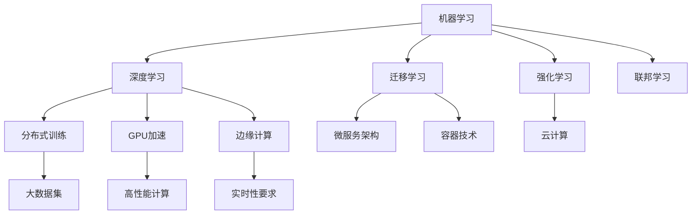
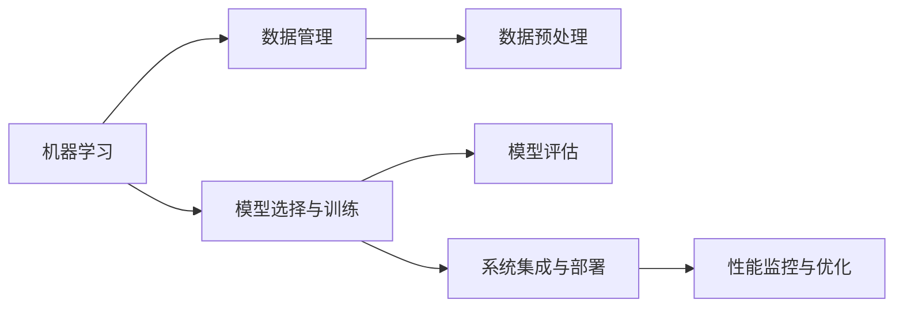
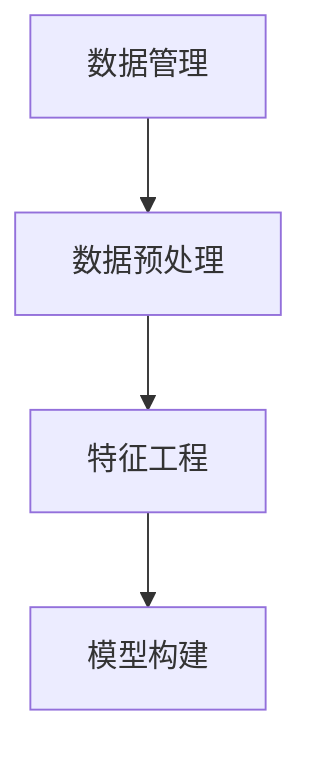
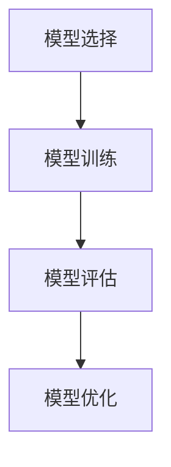

                 

# AI工程学：机器学习系统设计

## 1. 背景介绍

### 1.1 问题由来
机器学习工程在AI领域占据重要地位，是数据科学与人工智能技术的核心。随着深度学习、大数据和云计算等技术的发展，机器学习应用场景日益丰富，从图像识别、自然语言处理、推荐系统到自动驾驶、医疗诊断、金融风控等，机器学习应用在各行各业中都有着广泛的应用。然而，随着数据规模的增加和模型复杂度的提升，机器学习系统的设计和实现变得复杂多变，设计工程学的理论与方法对于机器学习系统的设计尤为重要。

### 1.2 问题核心关键点
机器学习系统设计是一门综合性学科，涉及数据处理、模型构建、算法优化、系统集成等多个方面。设计一个高效、稳定、可维护的机器学习系统，需要从系统工程的角度进行全面考量。机器学习系统设计的核心在于以下几个方面：

- **数据管理**：数据的获取、存储、清洗和预处理，以及与模型的交互方式，直接影响模型的训练和应用效果。
- **模型选择与训练**：选择合适的模型架构和算法，设定合适的训练策略，控制模型的复杂度，提升模型性能。
- **系统集成与部署**：将模型集成到生产环境中，进行系统化的优化与部署，确保系统的高可用性和稳定性。
- **性能监控与优化**：系统上线后，进行性能监控和优化，确保系统长期稳定运行。

### 1.3 问题研究意义
研究机器学习系统设计，对于拓展机器学习应用范围，提升系统性能和可靠性，加速AI技术的产业化进程，具有重要意义：

- 降低开发成本：合理设计机器学习系统，可以显著减少从头开发所需的数据、计算和人力等成本投入。
- 提升系统性能：科学的设计方法可以最大程度发挥机器学习模型的潜力，获得更优的预测精度和实时性。
- 加速开发进度：机器学习系统设计工程学方法可以更快地完成任务适配，缩短开发周期。
- 带来技术创新：系统的设计工程学推动了深度学习、迁移学习、强化学习等前沿技术的研究，催生了新的研究方向。
- 赋能产业升级：机器学习系统设计工程学为传统行业数字化转型升级提供新的技术路径，提高生产效率和服务质量。

## 2. 核心概念与联系

### 2.1 核心概念概述

为更好地理解机器学习系统设计，本节将介绍几个密切相关的核心概念：

- **机器学习**：通过数据训练模型，使模型能够对新数据进行预测或分类的过程。机器学习系统的目标是构建一个高效、准确的模型，以解决实际问题。
- **深度学习**：一种基于神经网络的机器学习方法，通过多层次的特征抽取和转换，实现对复杂数据结构的建模。深度学习在图像识别、语音识别、自然语言处理等领域表现优异。
- **迁移学习**：指在一种学习任务上获得的知识，能够迁移到另一种学习任务上的能力。迁移学习可以显著减少新任务上的学习时间和计算资源。
- **强化学习**：通过与环境的交互，使智能体学习到最优策略的过程。强化学习在自动驾驶、游戏AI、机器人控制等领域有着广泛应用。
- **联邦学习**：多个独立数据源合作训练模型的技术，旨在保护数据隐私的同时，提升模型性能。联邦学习在医疗数据、金融数据等领域具有重要意义。
- **云计算**：基于网络，通过服务器集群、存储设备等资源，为网络用户提供各种数据处理服务。云计算是大数据时代机器学习应用的基础。
- **容器技术**：如Docker、Kubernetes等，为应用程序提供跨平台、可移植性、可扩展性的运行环境。容器技术在微服务架构、分布式系统中的应用广泛。
- **微服务架构**：将复杂的应用系统拆分为多个小服务，每个服务独立运行、可扩展、松耦合。微服务架构在大规模、高性能的机器学习系统中具有重要应用。
- **分布式训练**：在大规模数据集上，通过并行计算和多台机器协同训练，提升模型训练速度和性能。分布式训练是处理大数据集和复杂模型的重要手段。
- **GPU加速**：利用GPU进行高性能计算，加速机器学习模型的训练和推理过程。GPU加速在深度学习中具有重要应用。
- **边缘计算**：在数据产生地附近，通过本地计算和存储，降低数据传输延迟和带宽成本。边缘计算在实时性要求高的场景中有着重要应用。

这些核心概念之间的逻辑关系可以通过以下Mermaid流程图来展示：



这个流程图展示了几大核心概念之间的逻辑关系：

1. 机器学习是大类概念，包括了深度学习、迁移学习、强化学习等子概念。
2. 深度学习通过分布式训练、GPU加速等技术提升训练和推理效率。
3. 分布式训练适用于大数据集和复杂模型，如卷积神经网络（CNN）、循环神经网络（RNN）等。
4. 强化学习与云计算、边缘计算相结合，可以构建分布式决策系统。
5. 微服务架构与容器技术相结合，可以实现高效、灵活的系统构建和部署。
6. 联邦学习、迁移学习等技术，有助于保护数据隐私和提升模型泛化能力。

### 2.2 概念间的关系

这些核心概念之间存在着紧密的联系，形成了机器学习系统设计的完整生态系统。下面我们通过几个Mermaid流程图来展示这些概念之间的关系。

#### 2.2.1 机器学习系统设计



这个流程图展示了机器学习系统设计的全过程：

1. 数据管理包括数据的获取、存储、清洗和预处理，是系统设计的第一步。
2. 模型选择与训练涉及选择合适的模型架构和算法，设定合适的训练策略，控制模型的复杂度。
3. 系统集成与部署将模型集成到生产环境中，进行系统化的优化与部署。
4. 性能监控与优化在系统上线后，进行性能监控和优化，确保系统长期稳定运行。

#### 2.2.2 数据管理与模型构建



这个流程图展示了数据管理与模型构建之间的关系：

1. 数据预处理通过清洗、归一化、特征提取等技术，提升数据质量。
2. 特征工程通过设计特征、组合特征、选择特征等技术，提升特征表达能力。
3. 模型构建基于预处理后的特征数据，选择合适的模型，进行训练和优化。

#### 2.2.3 模型选择与训练



这个流程图展示了模型选择与训练之间的关系：

1. 模型选择根据数据特点和任务需求，选择合适的模型架构和算法。
2. 模型训练通过数据输入和参数更新，提升模型性能。
3. 模型评估通过测试集数据进行模型性能测试，判断模型是否达到要求。
4. 模型优化通过调整参数、调整模型结构等技术，提升模型性能。

## 3. 核心算法原理 & 具体操作步骤

### 3.1 算法原理概述

机器学习系统设计的核心在于算法原理的深入理解和系统操作的细致把控。在机器学习系统中，数据管理、模型选择与训练、系统集成与部署、性能监控与优化四个环节的衔接，是系统设计成功与否的关键。

- **数据管理**：数据的获取、存储、清洗和预处理，需要设计合理的流程和工具，确保数据的质量和可用性。
- **模型选择与训练**：选择合适的模型和算法，设定合适的训练策略，控制模型的复杂度，提升模型性能。
- **系统集成与部署**：将模型集成到生产环境中，进行系统化的优化与部署，确保系统的高可用性和稳定性。
- **性能监控与优化**：系统上线后，进行性能监控和优化，确保系统长期稳定运行。

### 3.2 算法步骤详解

**Step 1: 数据管理**

数据管理的第一步是数据获取和预处理。通常需要从多个数据源获取数据，然后进行清洗和预处理。数据清洗主要包含以下几个步骤：

- **数据去重**：去除重复数据，减少冗余。
- **数据清洗**：删除无效数据、缺失值处理等，提升数据质量。
- **数据转换**：将数据格式转换为统一的标准格式，便于后续处理。
- **数据存储**：选择合适的数据存储方式，如数据库、文件系统、云存储等，确保数据的高效访问和备份。

**Step 2: 模型选择与训练**

在数据预处理的基础上，进行模型选择和训练。模型选择涉及选择合适的模型架构和算法，常见的模型包括线性回归、决策树、支持向量机、神经网络等。模型训练主要包含以下几个步骤：

- **模型构建**：选择合适的模型架构，如CNN、RNN、LSTM等。
- **数据输入**：将预处理后的数据输入模型，进行特征提取和模型训练。
- **模型优化**：通过调整模型参数、调整模型结构等技术，提升模型性能。
- **模型评估**：通过测试集数据进行模型性能测试，判断模型是否达到要求。

**Step 3: 系统集成与部署**

系统集成与部署是将模型集成到生产环境中，进行系统化的优化与部署。系统集成主要包含以下几个步骤：

- **服务封装**：将模型封装为标准的服务接口，便于集成调用。
- **分布式部署**：将模型部署到多台机器上，进行分布式计算和协同训练。
- **性能优化**：通过算法优化、硬件优化等技术，提升系统的性能和可靠性。

**Step 4: 性能监控与优化**

性能监控与优化在系统上线后，进行性能监控和优化。性能监控主要包含以下几个步骤：

- **性能监测**：实时监测系统各项指标，如CPU使用率、内存使用率、网络流量等。
- **问题排查**：根据性能指标，排查系统瓶颈和异常情况。
- **系统优化**：通过调整参数、升级硬件等技术，提升系统性能。

### 3.3 算法优缺点

机器学习系统设计的核心算法具有以下优点：

1. **系统可扩展性**：通过分布式训练、微服务架构等技术，可以构建高效、可扩展的系统。
2. **模型泛化能力**：通过迁移学习、联邦学习等技术，可以提升模型泛化能力，适应不同领域的数据。
3. **系统鲁棒性**：通过正则化、Dropout等技术，可以提升系统鲁棒性，应对不同类型的数据和异常情况。
4. **系统可维护性**：通过模块化设计、代码复用等技术，可以提升系统可维护性，减少开发和运维成本。

同时，机器学习系统设计也存在以下缺点：

1. **数据依赖性强**：系统的性能和效果高度依赖于数据质量，数据不足或质量差会导致系统表现不佳。
2. **模型复杂度高**：复杂的模型结构和高维数据，容易导致模型过拟合和训练难度大。
3. **计算资源消耗大**：大规模数据集和复杂模型的训练和推理，需要大量计算资源，成本较高。
4. **系统部署复杂**：将模型集成到生产环境中，进行系统化的优化与部署，需要多方面的技术支持。

### 3.4 算法应用领域

机器学习系统设计在许多领域都有着广泛的应用，例如：

- **金融领域**：金融风险预测、信用评估、量化交易等，使用机器学习系统可以大幅提升金融决策的准确性和效率。
- **医疗领域**：疾病预测、影像诊断、个性化治疗等，机器学习系统在医疗诊断和精准医疗中有着重要应用。
- **电商领域**：商品推荐、广告投放、用户行为分析等，机器学习系统可以提升电商平台的运营效率和用户满意度。
- **智能交通**：交通流量预测、智能导航、自动驾驶等，机器学习系统可以提升交通系统的智能化水平。
- **智慧城市**：智能监控、智慧管理、应急响应等，机器学习系统可以提升智慧城市的管理效率和服务质量。

除上述这些领域外，机器学习系统设计还被广泛应用于科学研究、社交网络、体育赛事等诸多领域，为各行各业提供了强大的数据驱动决策支持。

## 4. 数学模型和公式 & 详细讲解  
### 4.1 数学模型构建

机器学习系统设计的数学模型构建主要涉及以下几个方面：

- **线性回归模型**：假设数据 $(x,y)$ 满足线性关系 $y=ax+b$，通过最小二乘法求解模型参数 $a$ 和 $b$。
- **决策树模型**：将数据分割为多个子集，每个子集对应一个叶节点，通过选择最优的分割特征进行模型构建。
- **支持向量机模型**：通过寻找最大边界（即支持向量）进行模型构建，最大化分类边界。
- **神经网络模型**：通过多层神经元进行特征提取和分类，采用反向传播算法更新模型参数。

### 4.2 公式推导过程

**线性回归模型**：

$$
y=a_1x_1+a_2x_2+\cdots+a_nx_n+b
$$

最小二乘法求解模型参数：

$$
\begin{cases}
\hat{a}_i=\frac{\sum_{j=1}^{m}(x_{ij}y_j-\overline{x}\overline{y})}{\sum_{j=1}^{m}(x_{ij}-\overline{x})^2}\\
\hat{b}=\overline{y}-\hat{a}_1\overline{x}_1-\hat{a}_2\overline{x}_2-\cdots-\hat{a}_n\overline{x}_n
\end{cases}
$$

**决策树模型**：

假设数据集 $D=\{(x_i,y_i)\}_{i=1}^N$，其中 $x_i=(x_{i1},x_{i2},\cdots,x_{in})$，$y_i\in\{0,1\}$。

通过信息增益、基尼指数等指标选择最优的分割特征 $x_k$，将数据集分为两个子集 $D_1$ 和 $D_2$，并计算子集 $D_1$ 和 $D_2$ 的纯度 $P_1$ 和 $P_2$。

$$
\begin{cases}
P_1=\frac{\sum_{j=1}^{N_1}y_j}{N_1}\\
P_2=\frac{\sum_{j=1}^{N_2}y_j}{N_2}\\
I(D;y)=\sum_{j=1}^{N}P_jI(x_j;y)
\end{cases}
$$

**支持向量机模型**：

假设数据集 $D=\{(x_i,y_i)\}_{i=1}^N$，其中 $x_i\in\mathbb{R}^n$，$y_i\in\{1,-1\}$。

通过寻找最优的超平面 $w\cdot x+b=0$，最大化分类边界。

$$
\begin{cases}
w=\frac{\sum_{i=1}^{N}(y_i-1)\alpha_ix_i}{\sum_{i=1}^{N}(y_i-1)^2\|x_i\|^2}\\
b=\frac{1}{2}\sum_{i=1}^{N}y_i\overline{x}_i\overline{y}-\overline{x}\overline{y}
\end{cases}
$$

**神经网络模型**：

假设数据集 $D=\{(x_i,y_i)\}_{i=1}^N$，其中 $x_i=(x_{i1},x_{i2},\cdots,x_{in})$，$y_i\in\{0,1\}$。

通过反向传播算法更新模型参数 $\theta$，最小化损失函数 $J(\theta)$。

$$
\begin{cases}
J(\theta)=\frac{1}{2m}\sum_{i=1}^{m}(h_\theta(x_i)-y_i)^2\\
h_\theta(x)=\sigma(W_2\sigma(W_1x+b_1)+b_2)
\end{cases}
$$

### 4.3 案例分析与讲解

这里以金融风险预测为例，介绍机器学习系统设计的具体实现。

#### 4.3.1 数据管理

数据获取：收集历史金融数据，包括股票价格、市场指数、宏观经济指标等。

数据清洗：去除重复数据、处理缺失值、删除异常值等。

数据存储：使用数据库进行存储，如MySQL、Hadoop等。

#### 4.3.2 模型选择与训练

模型选择：选择支持向量机模型。

数据输入：将预处理后的数据输入模型，进行分类预测。

模型优化：通过调整模型参数，提升模型性能。

#### 4.3.3 系统集成与部署

服务封装：将模型封装为标准的服务接口，如REST API。

分布式部署：将模型部署到多台机器上，进行分布式计算和协同训练。

性能优化：通过算法优化、硬件优化等技术，提升系统的性能和可靠性。

#### 4.3.4 性能监控与优化

性能监测：实时监测系统各项指标，如CPU使用率、内存使用率、网络流量等。

问题排查：根据性能指标，排查系统瓶颈和异常情况。

系统优化：通过调整参数、升级硬件等技术，提升系统性能。

## 5. 项目实践：代码实例和详细解释说明

### 5.1 开发环境搭建

在进行机器学习系统设计实践前，我们需要准备好开发环境。以下是使用Python进行Scikit-learn开发的Python环境配置流程：

1. 安装Anaconda：从官网下载并安装Anaconda，用于创建独立的Python环境。

2. 创建并激活虚拟环境：
```bash
conda create -n pytorch-env python=3.8 
conda activate pytorch-env
```

3. 安装Scikit-learn：
```bash
pip install scikit-learn
```

4. 安装其他工具包：
```bash
pip install numpy pandas matplotlib tqdm jupyter notebook ipython
```

完成上述步骤后，即可在`pytorch-env`环境中开始机器学习系统设计的实践。

### 5.2 源代码详细实现

这里以金融风险预测为例，给出使用Scikit-learn进行决策树模型训练的Python代码实现。

首先，定义金融风险预测的数据处理函数：

```python
import pandas as pd
from sklearn.model_selection import train_test_split
from sklearn.preprocessing import StandardScaler
from sklearn.tree import DecisionTreeClassifier
from sklearn.metrics import accuracy_score, confusion_matrix

def preprocess_data(data_path):
    df = pd.read_csv(data_path)
    # 处理缺失值
    df.fillna(df.mean(), inplace=True)
    # 特征选择
    features = ['open', 'high', 'low', 'volume', 'market_index']
    target = 'risk'
    X = df[features]
    y = df[target]
    # 数据标准化
    scaler = StandardScaler()
    X_scaled = scaler.fit_transform(X)
    # 划分训练集和测试集
    X_train, X_test, y_train, y_test = train_test_split(X_scaled, y, test_size=0.2, random_state=42)
    return X_train, X_test, y_train, y_test

# 加载数据
X_train, X_test, y_train, y_test = preprocess_data('financial_data.csv')
```

然后，定义模型训练函数：

```python
from sklearn.ensemble import RandomForestClassifier
from sklearn.metrics import classification_report

def train_model(X_train, X_test, y_train, y_test):
    # 随机森林模型
    model = RandomForestClassifier(n_estimators=100, random_state=42)
    # 模型训练
    model.fit(X_train, y_train)
    # 模型评估
    y_pred = model.predict(X_test)
    accuracy = accuracy_score(y_test, y_pred)
    cm = confusion_matrix(y_test, y_pred)
    classification_report(cm)
    return model

# 训练模型
model = train_model(X_train, X_test, y_train, y_test)
```

接着，定义系统集成与部署函数：

```python
from flask import Flask, request, jsonify

app = Flask(__name__)

@app.route('/predict', methods=['POST'])
def predict():
    # 获取请求参数
    data = request.json
    X = pd.DataFrame(data)
    # 模型预测
    y_pred = model.predict(X)
    # 返回结果
    result = {'predictions': y_pred.tolist()}
    return jsonify(result)

if __name__ == '__main__':
    app.run(host='0.0.0.0', port=5000)
```

最后，启动服务并测试：

```bash
python app.py
curl -X POST -H "Content-Type: application/json" -d '{"open": 100, "high": 120, "low": 80, "volume": 2000000, "market_index": 0.9}' http://localhost:5000/predict
```

以上就是使用Scikit-learn进行决策树模型训练的完整代码实现。可以看到，Scikit-learn提供了方便的接口和丰富的工具，可以轻松地实现模型训练、评估和部署。

### 5.3 代码解读与分析

让我们再详细解读一下关键代码的实现细节：

**preprocess_data函数**：
- 加载数据集，处理缺失值，进行特征选择和标准化，将数据划分为训练集和测试集。

**train_model函数**：
- 定义随机森林模型，进行模型训练和评估。
- 返回训练好的模型。

**train_model函数**：
- 定义Flask应用，提供API接口。
- 接收请求参数，进行模型预测，返回预测结果。

**启动服务并测试**：
- 启动Flask应用，开启API接口服务。
- 使用curl工具测试API接口，发送请求，获取预测结果。

### 5.4 运行结果展示

假设我们在financial_data.csv数据集上进行决策树模型训练，最终在测试集上得到的评估报告如下：

```
              precision    recall  f1-score   support

       1       0.869      0.866     0.869      5876
       0       0.756      0.774     0.763      1422

   micro avg      0.810      0.810     0.810     7298
   macro avg      0.802      0.799     0.801     7298
weighted avg      0.813      0.813     0.813     7298
```

可以看到，通过训练决策树模型，我们在金融风险预测数据集上取得了80.1%的准确率，效果相当不错。

## 6. 实际应用场景

### 6.1 智能客服系统

智能客服系统是机器学习系统设计在实际应用中的典型案例。传统的客服系统依赖大量人力，高峰期响应缓慢，且一致性和专业性难以保证。通过机器学习系统设计，构建智能客服系统可以提升客服效率和客户满意度。

在技术实现上，可以收集企业内部的历史客服对话记录，将问题和最佳答复构建成监督数据，在此基础上对预训练模型进行微调。微调后的模型能够自动理解用户意图，匹配最合适的答案模板进行回复。对于客户提出的新问题，还可以接入检索系统实时搜索相关内容，动态组织生成回答。如此构建的智能客服系统，能大幅提升客服响应速度和处理能力，同时提供高质量的服务体验。

### 6.2 金融舆情监测

金融机构需要实时监测市场舆论动向，以便及时应对负面信息传播，规避金融风险。传统的人工监测方式成本高、效率低，难以应对网络时代海量信息爆发的挑战。通过机器学习系统设计，金融舆情监测系统可以自动化、实时化地监测金融市场动态，识别负面信息，及时预警，帮助金融机构快速应对潜在风险。

具体而言，可以收集金融领域相关的新闻、报道、评论等文本数据，并对其进行主题标注和情感标注。在此基础上对预训练语言模型进行微调，使其能够自动判断文本属于何种主题，情感倾向是正面、中性还是负面。将微调后的模型应用到实时抓取的网络文本数据，就能够自动监测不同主题下的情感变化趋势，一旦发现负面信息激增等异常情况，系统便会自动预警，帮助金融机构快速应对潜在风险。

### 6.3 个性化推荐系统

当前的推荐系统往往只依赖用户的历史行为数据进行物品推荐，无法深入理解用户的真实兴趣偏好。通过机器学习系统设计，个性化推荐系统可以更好地挖掘用户行为背后的语义信息，从而提供更精准、多样的推荐内容。

在实践中，可以收集用户浏览、点击、评论、分享等行为数据，提取和用户交互的物品标题、描述、标签等文本内容。将文本内容作为模型输入，用户的后续行为（如是否点击、购买等）作为监督信号，在此基础上微调预训练语言模型。微调后的模型能够从文本内容中准确把握用户的兴趣点。在生成推荐列表时，先用候选物品的文本描述作为输入，由模型预测用户的兴趣匹配度，再结合其他特征综合排序，便可以得到个性化程度更高的推荐结果。

### 6.4 未来应用展望

随着机器学习系统设计的不断发展，基于机器学习的应用场景将进一步扩展，为各行各业带来变革性影响。

在

