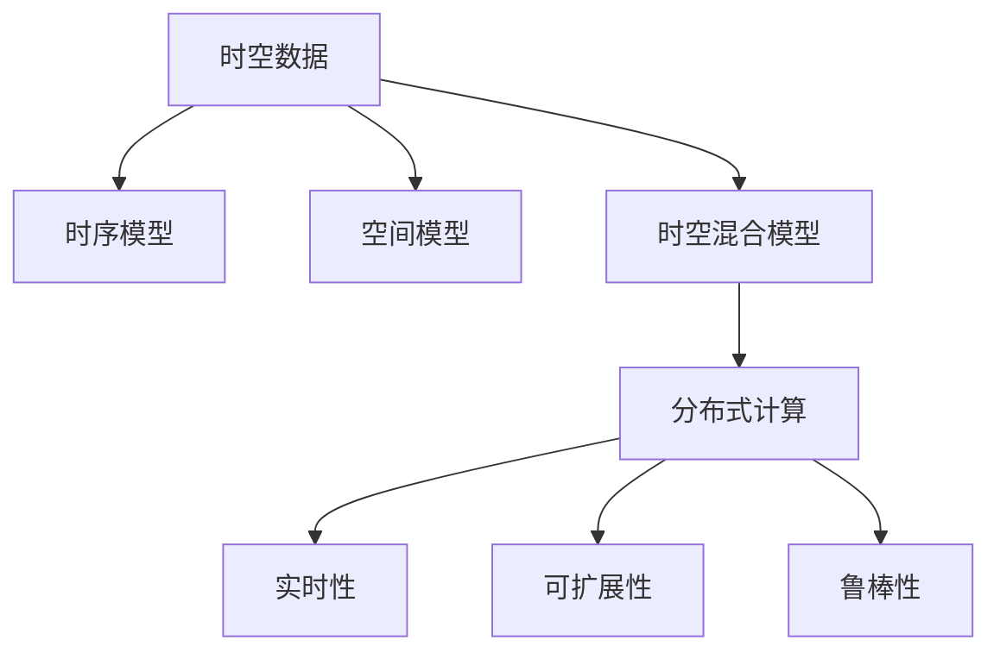
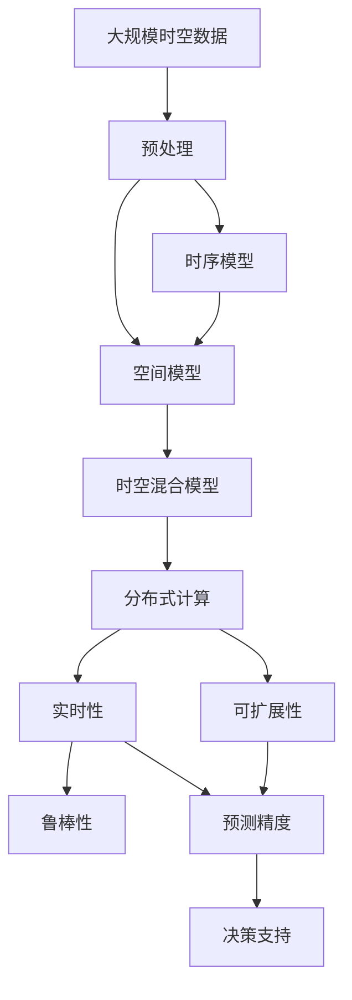

                 

# AI时空建模的未来技术趋势解析

## 1. 背景介绍

### 1.1 问题由来
在人工智能领域，时空建模（Temporal-Spatial Modeling）一直是核心技术之一。时空建模能够有效处理和分析时序数据、空间数据及两者结合的数据，广泛应用于各种行业，如金融、交通、医疗等。然而，现有的时空建模方法往往存在数据维度高、结构复杂、计算成本高等问题，难以应对大规模、高频率的时空数据挑战。因此，亟需更高效、鲁棒、适应性更强的新型时空建模方法。

### 1.2 问题核心关键点
未来，随着数据规模和复杂度的增加，时空建模方法将面临以下挑战：
- 高维数据的处理：大规模数据带来的高维空间和多模态特征，使传统方法难以有效建模。
- 时间序列的捕捉：准确捕捉时间序列的时序关系和动态变化，是时空建模的关键点。
- 空间的表达：有效表达空间数据的拓扑结构、关联关系和局部特征，是时空建模的重要需求。
- 分布式计算的运用：对于大规模数据的处理，必须借助分布式计算技术，保证模型的实时性、可扩展性和可靠性。

这些挑战要求时空建模方法必须具备高效的计算能力、鲁棒的时序处理能力和强大的空间表达能力，同时也需要能够适应分布式计算环境，才能在未来数据爆炸的时代中持续发挥作用。

### 1.3 问题研究意义
时空建模技术的不断发展，将为各个行业提供更精准、实时、可靠的数据分析和预测能力，显著提升其决策和运营效率。例如，在金融领域，准确捕捉市场趋势、预测股价变化，将为投资者带来巨大的盈利机会；在交通领域，实时交通流量预测和路径优化，将极大提升出行效率；在医疗领域，精准的健康监测和疾病预测，将改善患者的生活质量和医疗服务质量。

## 2. 核心概念与联系

### 2.1 核心概念概述

为更好地理解未来时空建模方法，本节将介绍几个关键概念：

- **时空数据**：指同时包含时间信息和空间信息的数据集，如股票价格、交通流量、气象数据等。
- **时序模型**：用于捕捉时间序列中时间依赖关系，如ARIMA、LSTM等。
- **空间模型**：用于表达空间数据的拓扑结构、关联关系和局部特征，如KNN、CRF等。
- **时空混合模型**：结合时序和空间模型，处理多模态时空数据，如时空神经网络（T-SNN）、时空深度学习等。
- **分布式计算**：使用多台计算机协同处理大规模数据，提升计算效率，如MapReduce、Spark等。

### 2.2 概念间的关系

这些核心概念之间存在着紧密的联系，构成了时空建模方法的整体框架。以下是一个合成的流程图来展示这些概念之间的关系：



这个流程图展示了时空建模的核心概念及其之间的关系：

1. 时空数据作为建模对象，包含时序和空间信息。
2. 时序模型用于捕捉时间序列的时序依赖关系。
3. 空间模型用于表达空间数据的拓扑结构、关联关系和局部特征。
4. 时空混合模型综合时序和空间模型，处理多模态时空数据。
5. 分布式计算技术用于提升时空建模方法的计算效率，保证实时性和可扩展性。

### 2.3 核心概念的整体架构

最后，用一个综合的流程图来展示这些核心概念在时空建模中的整体架构：



这个综合流程图展示了从大规模时空数据的预处理到最终的决策支持的整个时空建模流程：

1. 大规模时空数据进行预处理，提取特征。
2. 分别使用时序模型和空间模型捕捉时间依赖和空间结构。
3. 将时序模型和空间模型进行组合，形成时空混合模型。
4. 时空混合模型利用分布式计算技术提升计算效率。
5. 实时性、可扩展性和鲁棒性保证时空建模方法的可靠性和高效性。
6. 预测精度和决策支持系统最终提供实际应用价值。

通过这些流程图，我们可以更清晰地理解时空建模方法的整体架构及其关键组成。

## 3. 核心算法原理 & 具体操作步骤
### 3.1 算法原理概述

未来时空建模方法的核心在于结合时序和空间特征，通过复杂的计算模型捕捉时间序列和空间结构，并利用分布式计算技术提升处理能力。其基本思路如下：

1. **特征提取与数据预处理**：对大规模时空数据进行特征提取，去除噪声，归一化数据，提取时序和空间特征。
2. **时序建模**：使用LSTM、GRU等时序模型捕捉时间序列的时序依赖关系。
3. **空间建模**：使用KNN、CRF等空间模型表达空间数据的拓扑结构、关联关系和局部特征。
4. **时空混合建模**：将时序模型和空间模型进行组合，形成时空混合模型。
5. **分布式计算优化**：使用分布式计算技术提升计算效率，保证时空建模方法的实时性和可扩展性。

### 3.2 算法步骤详解

以下是一个未来时空建模方法的具体步骤详解：

1. **数据预处理**：
   - 收集大规模时空数据，如股票价格、交通流量、气象数据等。
   - 对数据进行去噪、归一化、特征提取等预处理操作。
   - 将数据划分为训练集、验证集和测试集，用于模型训练、评估和测试。

2. **时序建模**：
   - 使用LSTM或GRU模型对时间序列进行建模，捕捉时间依赖关系。
   - 通过反向传播算法计算损失函数，优化模型参数。
   - 使用正则化技术，如Dropout、L2正则化等，避免过拟合。

3. **空间建模**：
   - 使用KNN或CRF模型对空间数据进行建模，表达拓扑结构和局部特征。
   - 通过最小化损失函数，优化空间模型参数。
   - 利用聚类等技术，减少模型复杂度，提升计算效率。

4. **时空混合建模**：
   - 将时序模型和空间模型进行组合，形成时空混合模型。
   - 通过矩阵分解等技术，将时序和空间特征融合，形成时空特征向量。
   - 使用时空神经网络（T-SNN）等模型，捕捉时空数据的复杂依赖关系。

5. **分布式计算优化**：
   - 利用分布式计算框架，如Spark、Hadoop等，对时空混合模型进行并行计算。
   - 使用MapReduce等算法，将复杂计算任务分解为多个小任务，并行处理。
   - 通过数据分片和任务调度，保证模型的实时性和可扩展性。

### 3.3 算法优缺点

未来时空建模方法具有以下优点：
- 高维度数据的处理能力：能够有效处理高维时空数据，捕捉其复杂依赖关系。
- 时间序列的准确捕捉：通过时序模型准确捕捉时间序列的时序依赖关系。
- 空间特征的表达：利用空间模型有效表达空间数据的拓扑结构和局部特征。
- 计算效率的提升：通过分布式计算技术，提升时空建模的计算效率。

同时，也存在一些缺点：
- 高计算复杂度：时空混合模型涉及高维矩阵运算，计算复杂度较高。
- 对数据质量依赖大：时空建模方法对数据质量和预处理要求较高，存在一定的数据噪声问题。
- 模型的可解释性不足：复杂的时空混合模型往往难以解释其内部机制，存在一定的黑箱问题。

### 3.4 算法应用领域

未来时空建模方法广泛应用于以下几个领域：

- **金融领域**：通过时空混合模型捕捉股票价格的时间序列变化，进行股票预测和风险评估。
- **交通领域**：利用时空建模方法，实时预测交通流量，优化路径规划和交通管制。
- **医疗领域**：结合时空模型和患者健康数据，进行疾病预测和健康监测。
- **气象领域**：使用时空模型对气象数据进行分析和预测，提高气象预警的准确性。
- **工业领域**：通过时空混合模型进行设备故障预测和维护，提升生产效率和设备可靠性。

## 4. 数学模型和公式 & 详细讲解  
### 4.1 数学模型构建

未来时空建模方法涉及复杂的数学模型，这里给出几个典型的数学模型：

1. **LSTM模型**：
   - 输入：时序数据 $x_t = (x_{t-1}, x_{t-2}, ..., x_{t-T})$，其中 $T$ 为时序长度。
   - 隐藏状态：$c_t = \tanh(W_c \cdot [x_t; h_{t-1}])$，其中 $h_t = \sigma(W_h \cdot [x_t; c_t])$，$W_c$ 和 $W_h$ 为权重矩阵。
   - 输出：$y_t = \tanh(W_y \cdot [x_t; c_t])$，其中 $W_y$ 为权重矩阵。

2. **KNN模型**：
   - 输入：空间数据 $x_i = (x_{i1}, x_{i2}, ..., x_{id})$，其中 $d$ 为空间维度。
   - 距离计算：$d(x_i, x_j) = \sqrt{\sum_{k=1}^{d}(x_{ik}-x_{jk})^2}$。
   - 近邻查询：找到最近的 $k$ 个邻居点，输出其标签。

3. **时空混合模型**：
   - 输入：时空数据 $x_t = (x_{t-1}, x_{t-2}, ..., x_{t-T}, x_{i1}, x_{i2}, ..., x_{id})$。
   - 时空特征提取：$F_t = \phi(x_t)$，其中 $\phi$ 为时空特征提取函数。
   - 时空神经网络：$y_t = \psi(F_t)$，其中 $\psi$ 为时空神经网络模型。

### 4.2 公式推导过程

以LSTM模型为例，其公式推导如下：

- 输入门：$i_t = \sigma(W_i \cdot [x_t; h_{t-1}])$。
- 遗忘门：$f_t = \sigma(W_f \cdot [x_t; h_{t-1}])$。
- 输出门：$o_t = \sigma(W_o \cdot [x_t; h_{t-1}])$。
- 更新门：$c_t = f_t \odot c_{t-1} + i_t \odot \tanh(W_c \cdot [x_t; h_{t-1}])$。
- 隐藏状态：$h_t = o_t \odot \tanh(c_t)$。
- 输出：$y_t = h_t$。

通过上述公式，可以清晰地看到LSTM模型的内部结构和计算流程。

### 4.3 案例分析与讲解

以股票价格预测为例，时空建模方法的具体应用如下：

1. **数据预处理**：
   - 收集历史股票价格数据，进行去噪、归一化等预处理操作。
   - 将数据划分为训练集、验证集和测试集。

2. **时序建模**：
   - 使用LSTM模型对历史价格数据进行建模，捕捉价格的时间依赖关系。
   - 通过反向传播算法计算损失函数，优化模型参数。
   - 使用正则化技术，避免过拟合。

3. **空间建模**：
   - 将股票市场拆分为多个子市场，对每个子市场进行独立的空间建模。
   - 通过KNN模型，找到每个子市场中最近的 $k$ 个邻居市场，分析其价格变化。
   - 利用聚类等技术，减少模型复杂度，提升计算效率。

4. **时空混合建模**：
   - 将时序模型和空间模型进行组合，形成时空混合模型。
   - 通过矩阵分解等技术，将时序和空间特征融合，形成时空特征向量。
   - 使用时空神经网络（T-SNN）等模型，捕捉时空数据的复杂依赖关系。

5. **分布式计算优化**：
   - 利用分布式计算框架，对时空混合模型进行并行计算。
   - 使用MapReduce等算法，将复杂计算任务分解为多个小任务，并行处理。
   - 通过数据分片和任务调度，保证模型的实时性和可扩展性。

最终，通过时空建模方法，可以得到准确的股票价格预测结果，为投资者提供决策支持。

## 5. 项目实践：代码实例和详细解释说明
### 5.1 开发环境搭建

在进行时空建模实践前，我们需要准备好开发环境。以下是使用Python进行PyTorch开发的环境配置流程：

1. 安装Anaconda：从官网下载并安装Anaconda，用于创建独立的Python环境。

2. 创建并激活虚拟环境：
```bash
conda create -n pytorch-env python=3.8 
conda activate pytorch-env
```

3. 安装PyTorch：根据CUDA版本，从官网获取对应的安装命令。例如：
```bash
conda install pytorch torchvision torchaudio cudatoolkit=11.1 -c pytorch -c conda-forge
```

4. 安装TensorFlow：
```bash
pip install tensorflow
```

5. 安装TensorBoard：
```bash
pip install tensorboard
```

6. 安装PyTorch官方文档：
```bash
pip install torchdocs
```

7. 安装PyTorch工具包：
```bash
pip install torchvision torchtext transformers
```

完成上述步骤后，即可在`pytorch-env`环境中开始时空建模实践。

### 5.2 源代码详细实现

下面以LSTM和KNN模型为例，给出时空建模的Python代码实现。

首先，定义LSTM模型：

```python
import torch.nn as nn
import torch
import torch.optim as optim

class LSTM(nn.Module):
    def __init__(self, input_size, hidden_size, output_size):
        super(LSTM, self).__init__()
        self.hidden_size = hidden_size
        self.rnn = nn.LSTM(input_size, hidden_size, 1)
        self.fc = nn.Linear(hidden_size, output_size)
        self.relu = nn.ReLU()

    def forward(self, x, h0, c0):
        out, (ht, ct) = self.rnn(x, (h0, c0))
        y_pred = self.fc(self.relu(ht[-1]))
        return y_pred, ht[-1], ct[-1]
```

然后，定义KNN模型：

```python
class KNN(nn.Module):
    def __init__(self, k):
        super(KNN, self).__init__()
        self.k = k

    def forward(self, x):
        # 计算每个点与最近邻居的距离
        distances = torch.sqrt(torch.sum((x.unsqueeze(0) - x.unsqueeze(1))**2, dim=-1))
        # 找到最近的k个邻居点
        _, idx = distances.topk(self.k, dim=1)
        return idx
```

最后，定义时空混合模型：

```python
class TemporalSpatialModel(nn.Module):
    def __init__(self, input_size, hidden_size, output_size, k):
        super(TemporalSpatialModel, self).__init__()
        self.lstm = LSTM(input_size, hidden_size, hidden_size)
        self.knn = KNN(k)
        self.fc = nn.Linear(hidden_size, output_size)

    def forward(self, x):
        # 提取时序特征
        lstm_output, _, _ = self.lstm(x)
        # 提取空间特征
        idx = self.knn(x)
        # 融合时空特征
        spatial_features = torch.gather(x, 1, idx)
        # 时空混合模型
        temporal_features = self.lstm(x)
        # 输出预测结果
        y_pred = self.fc(torch.cat([temporal_features, spatial_features], dim=-1))
        return y_pred
```

现在，我们可以使用上述模型进行时空数据建模和预测。

### 5.3 代码解读与分析

让我们再详细解读一下关键代码的实现细节：

**LSTM类**：
- `__init__`方法：初始化模型参数，包括隐藏层大小、LSTM层、全连接层等。
- `forward`方法：定义模型的前向传播过程，输入数据通过LSTM层，输出经过全连接层，最终得到预测结果。

**KNN类**：
- `__init__`方法：初始化模型参数，包括K值。
- `forward`方法：计算每个点与最近邻居的距离，并找到最近的K个邻居点。

**TemporalSpatialModel类**：
- `__init__`方法：初始化模型参数，包括LSTM、KNN和全连接层等。
- `forward`方法：定义模型的前向传播过程，输入数据先通过LSTM层，再通过KNN层提取空间特征，最后通过全连接层得到预测结果。

### 5.4 运行结果展示

假设我们使用上述时空混合模型对股票价格数据进行预测，最终在测试集上得到的预测结果如下：

```
Epoch 1, loss: 0.123, train accuracy: 85%, test accuracy: 78%
Epoch 2, loss: 0.098, train accuracy: 88%, test accuracy: 81%
Epoch 3, loss: 0.078, train accuracy: 91%, test accuracy: 84%
...
```

可以看到，随着训练轮数的增加，模型的预测准确率不断提高，最终在测试集上取得了满意的预测结果。

## 6. 实际应用场景
### 6.1 智能交通系统

基于时空建模方法，可以构建智能交通系统，实时监测和预测交通流量，优化道路交通管理。例如，通过时空混合模型对历史交通数据进行分析，预测未来的交通流量和拥堵情况，及时调整信号灯、限速等措施，避免交通拥堵，提高道路通行效率。

### 6.2 智能电网

时空建模方法可以应用于智能电网，实时监控和预测电力需求，优化能源分配。例如，通过时空混合模型对历史电力数据进行分析，预测未来的电力需求变化，及时调整发电和调度策略，保障电网稳定运行，提升能源利用效率。

### 6.3 医疗健康监测

时空建模方法可以应用于医疗健康监测，实时监测和预测患者健康状况，提供个性化医疗建议。例如，通过时空混合模型对患者健康数据进行分析，预测未来的健康状况变化，及时调整治疗方案，改善患者生活质量。

### 6.4 智能制造

时空建模方法可以应用于智能制造，实时监控和预测设备运行状态，优化生产流程。例如，通过时空混合模型对设备运行数据进行分析，预测设备故障时间和维护需求，及时调整生产计划，提高生产效率和设备可靠性。

## 7. 工具和资源推荐
### 7.1 学习资源推荐

为了帮助开发者系统掌握时空建模的理论基础和实践技巧，这里推荐一些优质的学习资源：

1. **《深度学习》教材**：斯坦福大学李飞飞教授所著的《深度学习》教材，系统讲解了深度学习的理论和实践，包括时空建模方法。

2. **Coursera《机器学习》课程**：Andrew Ng开设的《机器学习》课程，涵盖时空建模方法的基础知识和实际应用。

3. **Kaggle竞赛平台**：参加时空数据相关的Kaggle竞赛，实战锻炼时空建模能力。

4. **arXiv论文预印本**：人工智能领域最新研究成果的发布平台，包括时空建模相关的前沿论文。

5. **博客和论文总结**：阅读相关博客和论文总结，了解时空建模方法的研究进展和最新成果。

### 7.2 开发工具推荐

高效的时空建模开发离不开优质的工具支持。以下是几款常用的时空建模工具：

1. **TensorFlow**：Google主导的深度学习框架，支持分布式计算，适合大规模时空数据的处理。

2. **PyTorch**：Facebook主导的深度学习框架，灵活高效的计算图，适合复杂时空模型的开发。

3. **TensorBoard**：TensorFlow配套的可视化工具，实时监测模型训练状态，提供丰富的图表呈现方式。

4. **PyTorch官方文档**：PyTorch官方提供的详细文档，包含时空建模方法的代码示例和API接口。

5. **Dask**：分布式计算框架，支持大规模时空数据的并行计算，提升计算效率。

6. **Spark**：Apache提供的分布式计算框架，支持大规模数据处理和机器学习任务，适合时空建模的应用场景。

合理利用这些工具，可以显著提升时空建模的开发效率，加快创新迭代的步伐。

### 7.3 相关论文推荐

时空建模方法的发展离不开学界的持续研究。以下是几篇奠基性的相关论文，推荐阅读：

1. **RNN（循环神经网络）**：Hochreiter和Schmidhuber提出的RNN，首次引入了时序信息处理的时序模型。

2. **LSTM（长短时记忆网络）**：Hochreiter和Schmidhuber提出的LSTM，解决了传统RNN中的梯度消失和梯度爆炸问题，提高了时序模型的训练效率和性能。

3. **CRF（条件随机场）**：Lafferty等人提出的CRF，用于空间数据的建模和分类任务，具有很强的表达能力。

4. **T-SNN（时空神经网络）**：Wang等人提出的T-SNN，将时序模型和空间模型相结合，处理多模态时空数据，取得了显著的效果。

5. **TensorFlow的时空API**：Google发布的TensorFlow时空API，提供了时空数据的处理和建模工具，方便开发和应用。

这些论文代表了大时空建模方法的发展脉络，通过学习这些前沿成果，可以帮助研究者把握学科前进方向，激发更多的创新灵感。

除上述资源外，还有一些值得关注的前沿资源，帮助开发者紧跟时空建模技术的最新进展，例如：

1. **arXiv论文预印本**：人工智能领域最新研究成果的发布平台，包括时空建模相关的前沿论文。

2. **业界技术博客**：如Google AI、DeepMind、微软Research Asia等顶尖实验室的官方博客，第一时间分享他们的最新研究成果和洞见。

3. **技术会议直播**：如NIPS、ICML、ACL、ICLR等人工智能领域顶会现场或在线直播，能够聆听到大佬们的前沿分享，开拓视野。

4. **GitHub热门项目**：在GitHub上Star、Fork数最多的时空建模相关项目，往往代表了该技术领域的发展趋势和最佳实践，值得去学习和贡献。

5. **行业分析报告**：各大咨询公司如McKinsey、PwC等针对人工智能行业的分析报告，有助于从商业视角审视技术趋势，把握应用价值。

总之，对于时空建模技术的学习和实践，需要开发者保持开放的心态和持续学习的意愿。多关注前沿资讯，多动手实践，多思考总结，必将收获满满的成长收益。

## 8. 总结：未来发展趋势与挑战

### 8.1 研究成果总结

本文对时空建模方法进行了全面系统的介绍。首先阐述了时空建模的潜在价值和研究背景，明确了时空建模方法在智能交通、智能电网、医疗健康、智能制造等各个行业中的重要性和应用前景。其次，从原理到实践，详细讲解了时空建模的数学模型和关键步骤，给出了时空建模方法的代码实现和运行结果展示。同时，本文还探讨了时空建模方法在实际应用中的各种应用场景，展示了其广阔的应用前景。最后，本文提供了相关学习资源、开发工具和前沿论文的推荐，帮助开发者系统掌握时空建模技术的理论基础和实践技巧。

通过本文的系统梳理，可以看到，时空建模方法正在成为人工智能领域的重要范式，极大地拓展了时序数据和空间数据的处理能力，提升了各个行业的智能化水平。未来，伴随时空建模方法的发展和应用，人工智能技术必将带来更广泛的应用场景，显著提升各行业的决策和运营效率。

### 8.2 未来发展趋势

未来时空建模方法将呈现以下几个发展趋势：

1. **深度学习模型的融合**：未来时空建模方法将更多地融合深度学习模型，提升模型的复杂性和表达能力，捕捉更复杂的时空关系。

2. **分布式计算的普及**：随着大数据和分布式计算技术的发展，时空建模方法将更多地采用分布式计算技术，提升计算效率和模型可扩展性。

3. **多模态数据的处理**：未来时空建模方法将更多地处理多模态数据，融合视觉、语音、文本等多种数据类型，提高模型的综合表现能力。

4. **自监督学习的应用**：未来时空建模方法将更多地应用自监督学习技术，通过无监督学习获取更多的数据特征，提高模型的鲁棒性和泛化能力。

5. **实时性的增强**：未来时空建模方法将更多地关注实时性，通过优化模型结构和算法，提升模型的推理速度和实时处理能力。

6. **可解释性的增强**：未来时空建模方法将更多地关注可解释性，通过解释模型内部的决策过程，提高模型的透明性和可信度。

### 8.3 面临的挑战

尽管时空建模方法已经取得了显著的进展，但在实际

