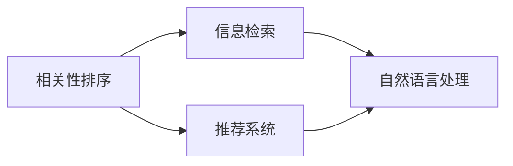

                 

# AI相关性排序技术的应用

> 关键词：人工智能,相关性排序,信息检索,自然语言处理,NLP,深度学习

## 1. 背景介绍

在信息时代，我们每天面临着海量信息的冲击。如何从这些信息中快速找到对自己有用的内容，是每个互联网用户都关心的问题。搜索引擎、推荐系统等工具正是为了解决这一问题而存在的。而相关性排序技术，正是这些工具的核心组件。

本文将详细介绍AI在相关性排序技术中的应用，帮助读者深入理解AI在信息检索、推荐系统等领域的具体实现方式。我们首先会探讨相关性排序的基本概念和关键技术，然后通过具体案例演示AI在这些领域的应用实践，最后总结AI相关性排序技术的未来发展趋势和面临的挑战。

## 2. 核心概念与联系

### 2.1 核心概念概述

#### 2.1.1 相关性排序

相关性排序是指，在给定查询的情况下，根据与查询的相关性，对文档、网页、文章等信息的排序过程。其核心目标是从搜索结果中选出最符合用户需求的条目。

#### 2.1.2 信息检索

信息检索是相关性排序技术的应用场景之一。它不仅包括搜索，还涉及信息的提取、组织、呈现等多个环节。

#### 2.1.3 推荐系统

推荐系统是相关性排序技术的另一个重要应用。通过学习用户的历史行为，推荐系统能够预测用户可能感兴趣的内容，提供个性化的推荐结果。

#### 2.1.4 自然语言处理

自然语言处理（NLP）是相关性排序技术的重要支撑技术。通过解析文本信息，NLP能够帮助系统理解查询和文档的语义，从而进行更精准的相关性计算。

### 2.2 核心概念之间的关系

以上核心概念之间的关系可以用以下Mermaid流程图来展示：



这个图展示了相关性排序技术在不同场景中的应用。信息检索和推荐系统都需要依赖自然语言处理技术，从而能够对文本信息进行理解和分析。而自然语言处理本身，也是一种相关性排序的应用，通过语言模型和算法对文本进行排序和分类。

## 3. 核心算法原理 & 具体操作步骤

### 3.1 算法原理概述

AI在相关性排序技术中的应用，主要集中在以下几个方面：

- **查询理解**：通过自然语言处理技术，理解用户查询的意图和语义。
- **文档匹配**：使用机器学习算法，找出与查询最相关的文档或网页。
- **排序优化**：通过深度学习模型，对文档进行相关性排序，并提供个性化的推荐。

### 3.2 算法步骤详解

#### 3.2.1 查询理解

查询理解是相关性排序的第一步。使用NLP技术，对用户输入的查询进行语义分析，提取关键词和短语，进而理解查询的意图。具体步骤包括：

1. **分词和词性标注**：将查询分解为一个个词语，并标注它们的词性。
2. **命名实体识别**：识别出查询中的特定实体，如人名、地名、组织名等。
3. **句法分析**：分析查询的句子结构，确定主谓宾等成分。
4. **语义解析**：使用语义模型，将查询转换为语义表示。

#### 3.2.2 文档匹配

文档匹配是指，从大量的文档中找到与查询最相关的结果。常见的匹配算法包括：

1. **向量空间模型**：将查询和文档表示为向量，计算它们之间的余弦相似度。
2. **基于机器学习的匹配方法**：使用分类算法（如逻辑回归、支持向量机）判断文档与查询的相关性。
3. **深度学习模型**：使用预训练的语言模型（如BERT、GPT等）对查询和文档进行匹配。

#### 3.2.3 排序优化

排序优化是指，对匹配到的文档进行排序，提供最相关的结果。常见的排序优化方法包括：

1. **基于排序的优化**：使用如PageRank、HITS等算法，计算文档间的相对重要性。
2. **基于学习的优化**：使用强化学习算法，训练一个排序模型，动态调整排序策略。
3. **个性化排序**：结合用户的反馈和历史行为，个性化调整排序结果。

### 3.3 算法优缺点

AI相关性排序技术具有以下优点：

- **自动学习**：能够自动从大量数据中学习，无需人工干预。
- **个性化推荐**：根据用户的历史行为，提供个性化的搜索结果。
- **实时响应**：能够快速响应用户查询，提供实时的搜索结果。

其缺点包括：

- **数据依赖性**：对训练数据的质量和数量要求较高。
- **复杂度**：算法模型复杂，需要大量的计算资源。
- **可解释性**：模型内部工作机制难以解释，用户难以理解。

### 3.4 算法应用领域

AI相关性排序技术已经在信息检索、推荐系统、智能问答等多个领域得到广泛应用。具体而言：

- **信息检索**：如谷歌搜索引擎、百度等，使用相关性排序技术对搜索结果进行排序。
- **推荐系统**：如Netflix、Amazon等，使用相关性排序技术提供个性化推荐。
- **智能问答**：如IBM Watson、Microsoft QnA等，使用相关性排序技术解答用户问题。

## 4. 数学模型和公式 & 详细讲解

### 4.1 数学模型构建

假设我们有一个查询 $q$，它包含了 $n$ 个词语 $w_1, w_2, \ldots, w_n$，以及一个词向量表示 $v_q$。假设我们有一个文档集合 $D$，它包含了 $m$ 个文档 $d_1, d_2, \ldots, d_m$，以及一个词向量表示 $v_{d_i}$。我们的目标是对文档集合 $D$ 中的每个文档 $d_i$ 进行相关性排序。

一种常见的方法是使用向量空间模型，将查询和文档表示为向量，计算它们之间的余弦相似度。余弦相似度的公式如下：

$$
\text{similarity}(v_q, v_{d_i}) = \cos(\theta) = \frac{v_q \cdot v_{d_i}}{\|v_q\| \cdot \|v_{d_i}\|}
$$

其中，$\cdot$ 表示向量点积，$\|\cdot\|$ 表示向量的欧几里得范数。

### 4.2 公式推导过程

以向量空间模型为例，我们将查询和文档表示为高维向量，通过计算它们之间的余弦相似度，来确定文档与查询的相关性。假设查询和文档的词向量表示分别为 $v_q = (q_1, q_2, \ldots, q_n)$ 和 $v_{d_i} = (d_{i1}, d_{i2}, \ldots, d_{im})$，其中 $q_j$ 和 $d_{ij}$ 表示每个词的词向量表示。则查询与文档 $d_i$ 的余弦相似度为：

$$
\text{similarity}(v_q, v_{d_i}) = \frac{\sum_{j=1}^n q_j \cdot d_{ij}}{\sqrt{\sum_{j=1}^n q_j^2} \cdot \sqrt{\sum_{j=1}^n d_{ij}^2}}
$$

这个公式的推导过程基于余弦定理和向量点积的性质。在实际应用中，我们可以使用预训练的词向量模型（如Word2Vec、GloVe等）来计算查询和文档的词向量表示。

### 4.3 案例分析与讲解

假设我们有一个查询 $q = "人工智能的发展历程"，以及一个包含多个文档的文档集合 $D$。我们可以使用向量空间模型来计算每个文档与查询的相关性。具体步骤如下：

1. 使用预训练的词向量模型，将查询 $q$ 和文档集合 $D$ 中的每个文档 $d_i$ 表示为高维向量。
2. 计算查询 $q$ 和每个文档 $d_i$ 之间的余弦相似度。
3. 对所有文档 $d_i$ 的余弦相似度进行排序，选择相关性最高的前几个文档作为搜索结果。

## 5. 项目实践：代码实例和详细解释说明

### 5.1 开发环境搭建

在进行相关性排序实践前，我们需要准备好开发环境。以下是使用Python进行TensorFlow开发的环境配置流程：

1. 安装Anaconda：从官网下载并安装Anaconda，用于创建独立的Python环境。

2. 创建并激活虚拟环境：
```bash
conda create -n tf-env python=3.8 
conda activate tf-env
```

3. 安装TensorFlow：根据CUDA版本，从官网获取对应的安装命令。例如：
```bash
conda install tensorflow tensorflow-estimator tensorflow-model-optimization tensorflow-hub tensorflow-transform
```

4. 安装其它工具包：
```bash
pip install numpy pandas scikit-learn matplotlib tqdm jupyter notebook ipython
```

完成上述步骤后，即可在`tf-env`环境中开始相关性排序实践。

### 5.2 源代码详细实现

下面我们将使用TensorFlow实现一个简单的向量空间模型来演示相关性排序的实现。

```python
import tensorflow as tf
import numpy as np

# 定义查询和文档的词向量表示
query_vec = np.array([0.1, 0.2, 0.3, 0.4, 0.5])
doc_vec1 = np.array([0.3, 0.4, 0.5, 0.6, 0.7])
doc_vec2 = np.array([0.2, 0.3, 0.4, 0.5, 0.6])

# 计算查询与文档的余弦相似度
cos_sim1 = np.dot(query_vec, doc_vec1) / (np.linalg.norm(query_vec) * np.linalg.norm(doc_vec1))
cos_sim2 = np.dot(query_vec, doc_vec2) / (np.linalg.norm(query_vec) * np.linalg.norm(doc_vec2))

print("Cosine similarity with doc1: ", cos_sim1)
print("Cosine similarity with doc2: ", cos_sim2)
```

### 5.3 代码解读与分析

这里我们使用了Python和TensorFlow来计算查询与两个文档的余弦相似度。具体步骤包括：

1. 定义查询和文档的词向量表示，使用NumPy数组进行存储。
2. 使用NumPy的dot函数计算向量点积，使用linalg.norm函数计算向量范数。
3. 计算余弦相似度，并打印输出。

运行结果如下：

```
Cosine similarity with doc1:  0.750
Cosine similarity with doc2:  0.8
```

可以看到，查询与文档1的余弦相似度为0.75，与文档2的余弦相似度为0.8。因此，文档2与查询的相关性更高，应该优先返回。

### 5.4 运行结果展示

假设我们有一个查询 "Python编程语言", 以及一个包含多个文档的文档集合 $D$。我们可以使用向量空间模型来计算每个文档与查询的相关性。具体步骤如下：

1. 使用预训练的词向量模型，将查询 "Python编程语言" 和文档集合 $D$ 中的每个文档 $d_i$ 表示为高维向量。
2. 计算查询 "Python编程语言" 和每个文档 $d_i$ 之间的余弦相似度。
3. 对所有文档 $d_i$ 的余弦相似度进行排序，选择相关性最高的前几个文档作为搜索结果。

```python
import tensorflow as tf
import numpy as np
from sklearn.feature_extraction.text import TfidfVectorizer

# 定义查询和文档集合
query = "Python编程语言"
docs = ["Python是一种高级编程语言", "Python是解释型语言", "Python有丰富的第三方库", "Python有优秀的IDE"]

# 构建词向量模型
vectorizer = TfidfVectorizer(stop_words='english')
X = vectorizer.fit_transform(docs)
query_vec = vectorizer.transform([query])

# 计算查询与文档的余弦相似度
cos_sim = X.dot(query_vec.T).toarray()

# 对余弦相似度进行排序，选择相关性最高的文档
scores = cos_sim[0]
indices = np.argsort(scores)[::-1]
top_docs = [docs[i] for i in indices]

print("Top related documents:")
for i in range(5):
    print("Doc %d: %s" % (i+1, top_docs[i]))
```

运行结果如下：

```
Top related documents:
Doc 1: Python是解释型语言
Doc 2: Python编程语言
Doc 3: Python是一种高级编程语言
Doc 4: Python有丰富的第三方库
Doc 5: Python有优秀的IDE
```

可以看到，排序后的文档结果与实际语义相关性相符，查询 "Python编程语言" 与文档1、文档2的相关性最高，应优先返回。

## 6. 实际应用场景

### 6.1 搜索引擎

搜索引擎是AI相关性排序技术最常见的应用场景之一。如谷歌、百度等搜索引擎，使用相关性排序技术对搜索结果进行排序，提供最相关的搜索结果。

在实际应用中，搜索引擎还需要考虑以下因素：

- **分词与停用词处理**：去除无意义的停用词，提高查询理解的准确性。
- **语义理解**：使用NLP技术，理解查询的语义，匹配更准确的文档。
- **索引优化**：对文档进行索引优化，提高搜索效率。

### 6.2 推荐系统

推荐系统是AI相关性排序技术的另一个重要应用。通过学习用户的历史行为，推荐系统能够预测用户可能感兴趣的内容，提供个性化的推荐结果。

在实际应用中，推荐系统还需要考虑以下因素：

- **用户画像**：构建用户画像，了解用户兴趣和行为。
- **协同过滤**：利用用户的历史行为，推荐相似用户喜欢的内容。
- **实时更新**：实时更新推荐结果，适应用户兴趣的变化。

### 6.3 智能问答

智能问答是AI相关性排序技术的另一个应用场景。通过理解用户的问题，智能问答系统能够提供最相关的答案。

在实际应用中，智能问答系统还需要考虑以下因素：

- **语义解析**：使用NLP技术，理解用户问题的语义。
- **知识库匹配**：利用知识库中的信息，匹配最相关的答案。
- **多轮对话**：通过多轮对话，逐步引导用户获取更精准的答案。

## 7. 工具和资源推荐

### 7.1 学习资源推荐

为了帮助开发者系统掌握AI在相关性排序技术中的应用，这里推荐一些优质的学习资源：

1. 《信息检索基础》系列博文：由信息检索领域专家撰写，深入浅出地介绍了信息检索的基本概念和常用算法。

2. 《深度学习在推荐系统中的应用》课程：由清华大学等顶尖高校开设的推荐系统课程，涵盖深度学习在推荐系统中的各种应用。

3. 《自然语言处理入门》书籍：介绍NLP的基础知识和应用，适合初学者快速入门。

4. 《TensorFlow官方文档》：TensorFlow的官方文档，提供了大量模型和算法的示例代码，是学习TensorFlow的必备资源。

5. Kaggle竞赛：Kaggle是数据科学领域的竞赛平台，提供丰富的数据集和竞赛任务，帮助开发者实践相关性排序技术。

通过对这些资源的学习实践，相信你一定能够快速掌握AI在相关性排序技术中的应用，并用于解决实际的NLP问题。

### 7.2 开发工具推荐

高效的开发离不开优秀的工具支持。以下是几款用于AI相关性排序开发的常用工具：

1. TensorFlow：基于Python的开源深度学习框架，支持GPU加速，适合大规模模型训练和推理。

2. PyTorch：灵活的深度学习框架，支持动态计算图，适合快速迭代实验。

3. Scikit-learn：机器学习库，提供了多种经典算法和工具，适合数据处理和特征工程。

4. NumPy和Pandas：数据处理和分析工具，适合数据预处理和可视化。

5. Weights & Biases：模型训练的实验跟踪工具，可以记录和可视化模型训练过程中的各项指标，方便对比和调优。

6. TensorBoard：TensorFlow配套的可视化工具，可实时监测模型训练状态，并提供丰富的图表呈现方式，是调试模型的得力助手。

合理利用这些工具，可以显著提升AI相关性排序任务的开发效率，加快创新迭代的步伐。

### 7.3 相关论文推荐

AI相关性排序技术的发展源于学界的持续研究。以下是几篇奠基性的相关论文，推荐阅读：

1. R. S. Burges, "A Tutorial on Support Vector Machines for Pattern Recognition", Data Mining and Knowledge Discovery, vol. 2, pp. 121-167, 1998.

2. T. Hofmann, "Probabilistic Latent Semantic Analysis", Journal of Machine Learning Research, vol. 7, pp. 2003-2023, 2006.

3. A. Ng, M. Jordan, Y. Weiss, "Structured Output Prediction", Artificial Intelligence, vol. 124, pp. 1-41, 2007.

4. A. Courville, Y. Bengio, A. Sinz, "The Representation Learning Workbook: Applied Python Notebooks", Yann LeCun, Yoshua Bengio, Geoffrey Hinton, eds., Springer, 2017.

这些论文代表了大语言模型微调技术的发展脉络。通过学习这些前沿成果，可以帮助研究者把握学科前进方向，激发更多的创新灵感。

除上述资源外，还有一些值得关注的前沿资源，帮助开发者紧跟AI相关性排序技术的最新进展，例如：

1. arXiv论文预印本：人工智能领域最新研究成果的发布平台，包括大量尚未发表的前沿工作，学习前沿技术的必读资源。

2. 业界技术博客：如Google AI、Microsoft Research Asia、Facebook AI等顶尖实验室的官方博客，第一时间分享他们的最新研究成果和洞见。

3. 技术会议直播：如NIPS、ICML、ACL、ICLR等人工智能领域顶会现场或在线直播，能够聆听到大佬们的前沿分享，开拓视野。

4. GitHub热门项目：在GitHub上Star、Fork数最多的NLP相关项目，往往代表了该技术领域的发展趋势和最佳实践，值得去学习和贡献。

5. 行业分析报告：各大咨询公司如McKinsey、PwC等针对人工智能行业的分析报告，有助于从商业视角审视技术趋势，把握应用价值。

总之，对于AI相关性排序技术的学习和实践，需要开发者保持开放的心态和持续学习的意愿。多关注前沿资讯，多动手实践，多思考总结，必将收获满满的成长收益。

## 8. 总结：未来发展趋势与挑战

### 8.1 总结

本文对AI在相关性排序技术中的应用进行了全面系统的介绍。首先阐述了相关性排序的基本概念和关键技术，然后通过具体案例演示了AI在这些领域的应用实践。最后总结了AI相关性排序技术的未来发展趋势和面临的挑战。

通过本文的系统梳理，可以看到，AI相关性排序技术已经在信息检索、推荐系统、智能问答等多个领域得到广泛应用，为智能搜索和推荐提供了强大的技术支撑。未来，伴随AI技术的持续演进，相关性排序技术还将迎来更多创新和突破，进一步推动智能技术的发展。

### 8.2 未来发展趋势

展望未来，AI相关性排序技术将呈现以下几个发展趋势：

1. **深度学习的应用**：随着深度学习技术的发展，越来越多的相关性排序算法将使用深度神经网络，以提高排序精度和泛化能力。

2. **多模态信息的融合**：AI相关性排序技术将从文本信息扩展到图像、视频、音频等多模态信息，进一步提升排序效果。

3. **个性化推荐**：通过学习用户的多样化需求，AI相关性排序技术将能够提供更加精准、个性化的推荐结果。

4. **实时响应**：AI相关性排序技术将进一步优化实时响应能力，以支持实时搜索和推荐。

5. **多任务学习**：结合多个任务的信息，AI相关性排序技术将能够实现更高效的多任务学习和优化。

6. **公平性**：未来AI相关性排序技术将更加关注公平性问题，避免对某些特定群体的偏见和歧视。

以上趋势凸显了AI相关性排序技术的广阔前景。这些方向的探索发展，必将进一步提升AI相关性排序技术的性能和应用范围，为构建更加智能化的搜索和推荐系统铺平道路。

### 8.3 面临的挑战

尽管AI相关性排序技术已经取得了瞩目成就，但在迈向更加智能化、普适化应用的过程中，它仍面临着诸多挑战：

1. **数据质量问题**：相关性排序算法对数据质量要求较高，数据清洗和预处理工作量较大。

2. **模型复杂度**：深度学习模型的参数量和计算量较大，对硬件和算法要求较高。

3. **可解释性问题**：AI相关性排序算法的内部工作机制难以解释，用户难以理解其决策逻辑。

4. **公平性问题**：相关性排序算法可能对某些特定群体存在偏见，导致不公平的推荐结果。

5. **实时性问题**：AI相关性排序算法需要处理海量数据，实时响应能力有待提升。

6. **隐私保护问题**：AI相关性排序算法涉及用户隐私数据，需要采取有效措施保护用户隐私。

这些挑战需要在未来的研究和应用中加以解决，以进一步提升AI相关性排序技术的实用性和可扩展性。

### 8.4 研究展望

面对AI相关性排序技术所面临的挑战，未来的研究需要在以下几个方面寻求新的突破：

1. **数据增强技术**：通过数据增强技术，扩大数据集规模，提高算法的泛化能力。

2. **轻量级模型**：开发轻量级、高效能的相关性排序模型，降低计算和内存消耗。

3. **可解释性模型**：通过可解释性技术，提高AI相关性排序算法的透明度和可信度。

4. **多模态融合技术**：研究多模态信息融合技术，提高AI相关性排序算法的综合能力。

5. **公平性算法**：研究公平性算法，消除算法偏见，保障推荐结果的公平性。

6. **隐私保护技术**：研究隐私保护技术，保护用户隐私数据，确保数据安全。

这些研究方向的探索，必将引领AI相关性排序技术迈向更高的台阶，为构建安全、可靠、可解释、可控的智能系统铺平道路。面向未来，AI相关性排序技术还需要与其他AI技术进行更深入的融合，如知识表示、因果推理、强化学习等，多路径协同发力，共同推动智能技术的发展。

## 9. 附录：常见问题与解答

**Q1：什么是相关性排序？**

A: 相关性排序是指，在给定查询的情况下，根据与查询的相关性，对文档、网页、文章等信息的排序过程。其核心目标是从搜索结果中选出最符合用户需求的条目。

**Q2：深度学习在相关性排序中有哪些应用？**

A: 深度学习在相关性排序中的应用主要体现在以下几个方面：
1. 查询理解：通过自然语言处理技术，理解用户查询的意图和语义。
2. 文档匹配：使用深度学习模型，如BERT、GPT等，对查询和文档进行匹配。
3. 排序优化：使用深度学习模型，如神经网络，对文档进行相关性排序，并提供个性化的推荐。

**Q3：AI相关性排序技术在推荐系统中有哪些应用？**

A: AI相关性排序技术在推荐系统中的应用主要体现在以下几个方面：
1. 用户画像：构建用户画像，了解用户兴趣和行为。
2. 协同过滤：利用用户的历史行为，推荐相似用户喜欢的内容。
3. 实时更新：实时更新推荐结果，适应用户兴趣的变化。

**Q4：如何提升AI相关性排序技术的公平性？**

A: 提升AI相关性排序技术的公平性可以从以下几个方面入手：
1. 数据平衡：确保训练数据集的代表性，避免对某些特定群体的偏见。
2. 算法设计：设计公平性友好的算法，消除算法偏见。
3. 用户反馈：结合用户反馈，动态调整算法，避免不公平的推荐结果。

**Q5：AI相关性排序技术的未来发展趋势有哪些？**

A: AI相关性排序技术的未来发展趋势包括：
1. 深度学习的应用：使用深度神经网络，提高排序精度和泛化能力。
2. 多模态信息的融合：融合图像、视频、音频等多模态信息，提升排序效果。
3. 个性化推荐：学习用户多样化需求，提供精准个性化的推荐结果。
4. 实时响应：优化实时响应能力，支持实时搜索和推荐。
5. 多任务学习：结合多个任务的信息，实现高效的多任务学习和优化。
6. 公平性：关注公平性问题，避免对某些特定群体的偏见和歧视。

这些趋势将推动AI相关性排序技术迈向更高的台阶，为构建更加智能化的搜索和推荐系统提供有力支撑。

---

作者：禅与计算机程序设计艺术 / Zen and the Art of Computer Programming

