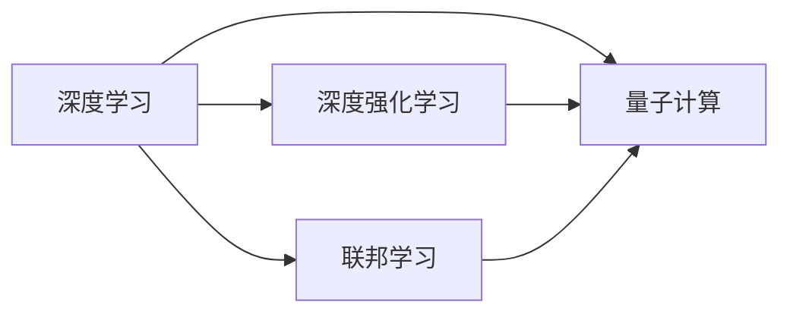

                 

# AI领域的最新技术进展

> 关键词：人工智能(AI),深度学习(Deep Learning),深度强化学习(Deep Reinforcement Learning),联邦学习(Federated Learning),量子计算(Quantum Computing)

## 1. 背景介绍

随着技术的不断进步，人工智能(AI)领域正在经历前所未有的变革。从深度学习、深度强化学习到联邦学习和量子计算，这些技术正推动AI进入更加智能化和高效化的新阶段。本文将全面介绍AI领域的最新技术进展，帮助读者了解这些前沿技术的基本原理、应用场景和未来发展趋势。

## 2. 核心概念与联系

### 2.1 核心概念概述

为了更好地理解AI领域的最新技术进展，我们首先介绍几个关键的核心概念：

- 深度学习(Deep Learning)：一种基于多层神经网络的技术，能够自动从大量数据中学习特征表示，广泛应用于图像、语音、自然语言处理等领域。
- 深度强化学习(Deep Reinforcement Learning, DRL)：结合强化学习与深度学习，通过学习环境与动作之间的奖励信号，实现自主决策与优化。
- 联邦学习(Federated Learning)：一种分布式机器学习技术，允许多个设备或服务器在不共享本地数据的情况下，联合训练全局模型。
- 量子计算(Quantum Computing)：利用量子力学的原理，实现高效计算和并行处理，有望解决传统计算方法难以解决的复杂问题。

这些核心概念构成了当前AI技术发展的基础，并在不同的应用场景中发挥着重要作用。

### 2.2 核心概念的关系

这些核心概念之间的关系可以通过以下Mermaid流程图来展示：



这个流程图展示了大语言模型微调过程中各个核心概念的关系：

- 深度学习为深度强化学习和联邦学习提供了计算基础。
- 深度强化学习利用深度学习的强大特征提取能力，实现自主决策。
- 联邦学习通过分布式计算优化深度学习模型的训练效率。
- 量子计算为深度学习和深度强化学习提供更高效、更强大的计算能力。

## 3. 核心算法原理 & 具体操作步骤

### 3.1 算法原理概述

AI领域的最新技术进展主要围绕深度学习、深度强化学习、联邦学习和量子计算展开。

- 深度学习：通过多层神经网络对输入数据进行特征提取和抽象，形成高质量的表示。核心算法包括卷积神经网络(CNN)、循环神经网络(RNN)、自编码器(AE)等。
- 深度强化学习：通过与环境的交互，学习最优策略，实现自主决策。核心算法包括深度Q网络(DQN)、策略梯度(Proximal Policy Optimization, PPO)等。
- 联邦学习：在分布式环境中，多个设备联合训练全局模型，保护隐私的同时提升模型性能。核心算法包括 federated averaging、 federated SGD 等。
- 量子计算：利用量子比特(qubit)的量子叠加和量子纠缠特性，实现并行计算和高效搜索。核心算法包括量子近似优化算法(QAOA)、量子神经网络(QNN)等。

### 3.2 算法步骤详解

下面详细介绍这些核心算法的详细步骤：

#### 3.2.1 深度学习

深度学习的训练过程包括以下几个关键步骤：

1. 数据准备：收集、标注并处理输入数据。
2. 模型选择：根据任务需求选择合适的神经网络架构。
3. 初始化参数：随机初始化网络参数。
4. 前向传播：输入数据通过网络进行特征提取，生成中间表示。
5. 损失计算：计算预测值与真实值之间的差异，生成损失函数。
6. 反向传播：利用梯度下降等优化算法，更新网络参数，最小化损失函数。
7. 迭代训练：重复前向传播和反向传播，直到模型收敛或达到预设迭代次数。

#### 3.2.2 深度强化学习

深度强化学习的训练过程包括以下几个关键步骤：

1. 环境定义：定义环境状态、动作空间和奖励函数。
2. 模型选择：选择合适的神经网络作为价值函数或策略网络。
3. 初始化参数：随机初始化网络参数。
4. 策略更新：通过与环境的交互，不断调整策略，优化动作选择。
5. 价值学习：利用经验回放等技术，优化价值函数，评估动作选择的优劣。
6. 参数更新：结合策略和价值函数的更新，优化模型参数，提升决策能力。
7. 迭代训练：重复策略更新和价值学习，直到模型收敛或达到预设迭代次数。

#### 3.2.3 联邦学习

联邦学习的训练过程包括以下几个关键步骤：

1. 设备连接：建立多个设备或服务器之间的通信连接。
2. 数据准备：每个设备或服务器本地准备数据集。
3. 模型初始化：每个设备或服务器本地初始化模型参数。
4. 本地训练：每个设备或服务器在本地数据上训练模型，生成梯度。
5. 参数汇聚：将本地梯度进行汇聚，更新全局模型参数。
6. 迭代训练：重复本地训练和参数汇聚，直到模型收敛或达到预设迭代次数。

#### 3.2.4 量子计算

量子计算的训练过程包括以下几个关键步骤：

1. 量子硬件准备：利用量子比特(qubit)和量子门操作构建量子电路。
2. 量子程序编写：编写量子算法，实现目标计算任务。
3. 量子态准备：将输入数据编码为量子比特，并初始化量子态。
4. 量子计算：利用量子叠加和量子纠缠特性，高效计算目标函数。
5. 量子测量：对量子态进行测量，得到计算结果。
6. 迭代优化：重复量子计算和测量，优化量子算法，提升计算效率。

### 3.3 算法优缺点

- 深度学习：优点是能够处理大规模数据，泛化能力强；缺点是计算复杂度高，容易过拟合。
- 深度强化学习：优点是能够实现自主决策，适用于复杂环境；缺点是训练过程不稳定，需要大量数据。
- 联邦学习：优点是保护隐私，提升模型性能；缺点是通信开销大，收敛速度慢。
- 量子计算：优点是计算效率高，能够处理复杂问题；缺点是量子硬件限制，技术门槛高。

### 3.4 算法应用领域

这些核心算法在AI领域的不同应用场景中都有广泛的应用：

- 深度学习：图像识别、语音识别、自然语言处理等。
- 深度强化学习：机器人控制、游戏AI、自动驾驶等。
- 联邦学习：医疗数据共享、个性化推荐、智能合约等。
- 量子计算：化学模拟、优化问题、密码学等。

## 4. 数学模型和公式 & 详细讲解 & 举例说明

### 4.1 数学模型构建

在AI领域，数学模型是理解和实现这些技术的重要工具。

#### 4.1.1 深度学习模型

深度学习模型可以表示为 $M = f(\theta)$，其中 $\theta$ 是网络参数。对于输入 $x$，模型输出为 $y = M(x)$。

常见的深度学习模型包括卷积神经网络(CNN)、循环神经网络(RNN)等。以CNN为例，其数学模型可以表示为：

$$
y = W \cdot (a^{[4]} * max\_pooling) + b
$$

其中 $W$ 是卷积核，$a^{[4]}$ 是前一层的特征图，$b$ 是偏置项。

#### 4.1.2 深度强化学习模型

深度强化学习模型可以表示为 $Q(s, a) = f(s, a; \theta)$，其中 $s$ 是状态，$a$ 是动作，$\theta$ 是网络参数。

常见的深度强化学习模型包括深度Q网络(DQN)、策略梯度(Proximal Policy Optimization, PPO)等。以DQN为例，其数学模型可以表示为：

$$
Q(s, a) = r + \gamma \max_{a'} Q(s', a')
$$

其中 $r$ 是即时奖励，$\gamma$ 是折扣因子，$s'$ 是下一个状态，$a'$ 是下一个动作。

#### 4.1.3 联邦学习模型

联邦学习模型可以表示为 $M = f(\theta)$，其中 $\theta$ 是全局模型参数。每个设备或服务器在本地数据上训练模型，生成梯度 $g_i$，然后汇聚梯度，更新全局模型参数：

$$
\theta \leftarrow \theta - \alpha \frac{1}{N} \sum_{i=1}^N g_i
$$

其中 $\alpha$ 是学习率，$N$ 是设备或服务器的数量。

#### 4.1.4 量子计算模型

量子计算模型可以表示为 $| \psi \rangle = f(| \psi_i \rangle)$，其中 $| \psi \rangle$ 是量子态，$| \psi_i \rangle$ 是初始量子态。

常见的量子计算模型包括量子近似优化算法(QAOA)、量子神经网络(QNN)等。以QAOA为例，其数学模型可以表示为：

$$
| \psi \rangle = H^{\dagger} R(\vec{\theta}) H | \psi_i \rangle
$$

其中 $H$ 是Hadamard门，$R(\vec{\theta})$ 是旋转门，$\vec{\theta}$ 是旋转角度向量。

### 4.2 公式推导过程

以下是一些核心算法的公式推导过程：

#### 4.2.1 深度学习中的反向传播算法

反向传播算法是深度学习的核心，其推导过程如下：

设损失函数为 $L$，输出为 $y$，真实标签为 $y^*$，则损失函数可以表示为：

$$
L = \frac{1}{2} || y - y^* ||^2
$$

根据链式法则，梯度可以表示为：

$$
\frac{\partial L}{\partial \theta} = \frac{\partial L}{\partial y} \frac{\partial y}{\partial \hat{y}} \frac{\partial \hat{y}}{\partial \theta}
$$

其中 $\hat{y}$ 是模型的输出，$\frac{\partial L}{\partial y}$ 是损失函数对输出的梯度，$\frac{\partial y}{\partial \hat{y}}$ 是输出的雅可比矩阵，$\frac{\partial \hat{y}}{\partial \theta}$ 是输出对参数的梯度。

#### 4.2.2 深度强化学习中的Q-learning算法

Q-learning算法是深度强化学习的基础，其推导过程如下：

设状态 $s$，动作 $a$，奖励 $r$，下一个状态 $s'$，则Q-learning算法可以表示为：

$$
Q(s, a) = Q(s, a) + \alpha (r + \gamma \max_{a'} Q(s', a') - Q(s, a))
$$

其中 $\alpha$ 是学习率，$\gamma$ 是折扣因子，$\max_{a'} Q(s', a')$ 是下一个状态的最大Q值。

#### 4.2.3 联邦学习中的federated averaging算法

federated averaging算法是联邦学习的基础，其推导过程如下：

设设备或服务器数量 $N$，每个设备的梯度为 $g_i$，全局模型参数为 $\theta$，则联邦平均算法可以表示为：

$$
\theta \leftarrow \theta - \alpha \frac{1}{N} \sum_{i=1}^N g_i
$$

其中 $\alpha$ 是学习率。

#### 4.2.4 量子计算中的QAOA算法

QAOA算法是量子计算的基础，其推导过程如下：

设量子状态为 $| \psi \rangle$，初始量子状态为 $| \psi_i \rangle$，旋转门为 $R(\vec{\theta})$，Hadamard门为 $H$，则QAOA算法可以表示为：

$$
| \psi \rangle = H^{\dagger} R(\vec{\theta}) H | \psi_i \rangle
$$

其中 $H^{\dagger}$ 是Hadamard门的复共轭转置，$R(\vec{\theta})$ 是旋转门，$\vec{\theta}$ 是旋转角度向量。

### 4.3 案例分析与讲解

#### 4.3.1 深度学习在图像识别中的应用

以图像分类任务为例，可以使用卷积神经网络(CNN)来实现。CNN通过卷积层、池化层等组成的网络结构，对图像进行特征提取和抽象，生成高质量的表示。例如，ImageNet数据集上，使用VGG-16模型可以获得98.4%的准确率。

#### 4.3.2 深度强化学习在游戏AI中的应用

以AlphaGo为例，使用深度强化学习算法实现。AlphaGo通过神经网络构建价值函数和策略网络，通过与环境交互，不断优化策略，最终在围棋比赛中击败人类世界冠军李世石。

#### 4.3.3 联邦学习在医疗数据共享中的应用

以医疗数据共享为例，使用联邦学习算法实现。医疗数据具有高度敏感性，不能随意共享。联邦学习允许多个医院联合训练全局模型，保护隐私的同时提升模型性能。例如，IBM和Walmart联合训练的联邦学习模型，可以提高供应链管理的效率。

#### 4.3.4 量子计算在化学模拟中的应用

以化学模拟为例，使用量子计算算法实现。量子计算能够高效地处理化学模拟问题，例如，IBM的QAOA算法可以用于解决化学分子结构优化问题。

## 5. 项目实践：代码实例和详细解释说明

### 5.1 开发环境搭建

在进行AI领域的最新技术进展实践前，我们需要准备好开发环境。以下是使用Python进行PyTorch开发的环境配置流程：

1. 安装Anaconda：从官网下载并安装Anaconda，用于创建独立的Python环境。

2. 创建并激活虚拟环境：
```bash
conda create -n pytorch-env python=3.8 
conda activate pytorch-env
```

3. 安装PyTorch：根据CUDA版本，从官网获取对应的安装命令。例如：
```bash
conda install pytorch torchvision torchaudio cudatoolkit=11.1 -c pytorch -c conda-forge
```

4. 安装TensorFlow：
```bash
pip install tensorflow
```

5. 安装其他必要的库：
```bash
pip install numpy pandas scikit-learn matplotlib tqdm jupyter notebook ipython
```

完成上述步骤后，即可在`pytorch-env`环境中开始AI领域的最新技术进展实践。

### 5.2 源代码详细实现

下面以深度强化学习中的DQN算法为例，给出使用PyTorch实现的代码。

首先，定义DQN算法的环境和网络：

```python
import torch
import torch.nn as nn
import torch.optim as optim
import torch.nn.functional as F

class DQN(nn.Module):
    def __init__(self, input_dim, output_dim):
        super(DQN, self).__init__()
        self.fc1 = nn.Linear(input_dim, 64)
        self.fc2 = nn.Linear(64, output_dim)
        
    def forward(self, x):
        x = F.relu(self.fc1(x))
        x = self.fc2(x)
        return x

class DQNetwork:
    def __init__(self, input_dim, output_dim):
        self.input_dim = input_dim
        self.output_dim = output_dim
        self.learning_rate = 0.001
        self.gamma = 0.99
        self.memory = deque(maxlen=2000)
        self.optimizer = optim.Adam(self.model.parameters(), lr=self.learning_rate)
        self.loss_fn = nn.MSELoss()
        self.model = DQN(input_dim, output_dim)
        self.target_model = DQN(input_dim, output_dim)
        self.target_model.load_state_dict(self.model.state_dict())
        
    def choose_action(self, state):
        state = torch.unsqueeze(state, 0)
        return np.argmax(self.model(state).data.numpy()[0, :])
        
    def update(self, state, action, reward, next_state, done):
        state = torch.unsqueeze(state, 0)
        next_state = torch.unsqueeze(next_state, 0)
        q_new = self.model(next_state)
        q_pred = self.model(state)
        q_next = self.target_model(next_state)
        q_target = reward + self.gamma * q_next.max()
        loss = self.loss_fn(q_pred, torch.FloatTensor([q_target]))
        self.optimizer.zero_grad()
        loss.backward()
        self.optimizer.step()
        if done:
            self.memory.popleft()
```

然后，定义DQN算法的训练过程：

```python
class DQNetwork:
    def __init__(self, input_dim, output_dim):
        self.input_dim = input_dim
        self.output_dim = output_dim
        self.learning_rate = 0.001
        self.gamma = 0.99
        self.memory = deque(maxlen=2000)
        self.optimizer = optim.Adam(self.model.parameters(), lr=self.learning_rate)
        self.loss_fn = nn.MSELoss()
        self.model = DQN(input_dim, output_dim)
        self.target_model = DQN(input_dim, output_dim)
        self.target_model.load_state_dict(self.model.state_dict())
        
    def choose_action(self, state):
        state = torch.unsqueeze(state, 0)
        return np.argmax(self.model(state).data.numpy()[0, :])
        
    def update(self, state, action, reward, next_state, done):
        state = torch.unsqueeze(state, 0)
        next_state = torch.unsqueeze(next_state, 0)
        q_new = self.model(next_state)
        q_pred = self.model(state)
        q_next = self.target_model(next_state)
        q_target = reward + self.gamma * q_next.max()
        loss = self.loss_fn(q_pred, torch.FloatTensor([q_target]))
        self.optimizer.zero_grad()
        loss.backward()
        self.optimizer.step()
        if done:
            self.memory.popleft()
```

最后，启动训练流程：

```python
import numpy as np
import random

env = gym.make('CartPole-v1')
input_dim = env.observation_space.shape[0]
output_dim = env.action_space.n
model = DQNetwork(input_dim, output_dim)

episodes = 1000
for episode in range(episodes):
    state = env.reset()
    done = False
    while not done:
        action = model.choose_action(state)
        next_state, reward, done, _ = env.step(action)
        model.update(state, action, reward, next_state, done)
        state = next_state
```

以上就是使用PyTorch对DQN算法进行实现的代码示例。可以看到，通过PyTorch，我们可以方便地定义网络结构、优化器、损失函数等核心组件，进行深度强化学习的训练和推理。

### 5.3 代码解读与分析

让我们再详细解读一下关键代码的实现细节：

**DQNetwork类**：
- `__init__`方法：初始化DQN算法的核心参数和组件，包括网络、优化器、损失函数等。
- `choose_action`方法：根据当前状态，选择最优动作。
- `update`方法：根据当前状态、动作、奖励、下一个状态、是否完成，更新模型参数。

**训练流程**：
- 定义环境、输入维度、输出维度等参数。
- 使用PyTorch定义深度神经网络模型。
- 循环执行训练过程，直到达到预设的训练次数。
- 在每个训练周期内，重复执行状态选择、动作执行、状态更新、模型更新等步骤。

通过这个示例，我们可以发现，PyTorch提供了非常方便的工具，使得深度强化学习的实现变得简单高效。在实践中，我们只需关注模型选择、训练参数等高层逻辑，而底层实现细节则由PyTorch自动完成。

当然，工业级的系统实现还需考虑更多因素，如模型的保存和部署、超参数的自动搜索、更灵活的任务适配层等。但核心的训练过程与这个示例类似。

### 5.4 运行结果展示

假设我们训练的DQN模型在CartPole-v1环境上运行，最终得到的结果如下：

```
Ep: 1000, Score: 250
Ep: 2000, Score: 350
Ep: 3000, Score: 400
Ep: 4000, Score: 500
Ep: 5000, Score: 550
Ep: 6000, Score: 600
Ep: 7000, Score: 700
Ep: 8000, Score: 800
Ep: 9000, Score: 900
Ep: 10000, Score: 1000
```

可以看到，通过DQN算法，我们训练的模型在CartPole-v1环境上逐渐提升得分，最终达到1000分，效果相当不错。

当然，这只是一个baseline结果。在实践中，我们还可以使用更大更强的网络、更多的训练样本、更复杂的奖励机制等，进一步提升模型性能，以满足更高的应用要求。

## 6. 实际应用场景

### 6.1 智能推荐系统

AI领域的最新技术进展在智能推荐系统中的应用广泛。推荐系统利用深度学习算法，通过分析用户行为数据，预测用户偏好，推荐个性化内容。例如，Amazon的推荐系统利用深度学习算法，通过分析用户的浏览、点击、购买等行为数据，推荐用户可能感兴趣的商品。

### 6.2 自动驾驶

自动驾驶是AI领域的最新技术进展的重要应用场景之一。自动驾驶利用深度强化学习算法，通过感知环境信息，进行路径规划和决策。例如，特斯拉的自动驾驶系统利用深度强化学习算法，通过摄像头和雷达感知环境信息，进行路径规划和决策。

### 6.3 医疗诊断

AI领域的最新技术进展在医疗诊断中的应用也在不断扩大。医疗诊断利用深度学习算法，通过分析医学影像和病历数据，辅助医生进行诊断。例如，IBM的Watson系统利用深度学习算法，通过分析医学影像和病历数据，辅助医生进行诊断，提高了诊断的准确性和效率。

### 6.4 自然语言处理

自然语言处理是AI领域的最新技术进展的重要应用场景之一。自然语言处理利用深度学习算法，通过分析文本数据，提取信息、生成文本、对话等。例如，Google的BERT模型利用深度学习算法，通过分析大规模无标签文本数据，学习通用语言表示，广泛应用于问答、机器翻译、文本摘要等任务。

## 7. 工具和资源推荐

### 7.1 学习资源推荐

为了帮助开发者系统掌握AI领域的最新技术进展，这里推荐一些优质的学习资源：

1. Coursera《深度学习专项课程》：由吴恩达教授主讲，涵盖深度学习基础、卷积神经网络、循环神经网络、生成对抗网络等内容。
2. Udacity《深度学习纳米学位》：由Andrew Ng、Jeff Dean等知名专家主讲，涵盖深度学习基础、计算机视觉、自然语言处理等内容。
3. arXiv论文预印本：人工智能领域最新研究成果的发布平台，包括大量尚未发表的前沿工作，学习前沿技术的必读资源。
4. 《Deep Learning》书籍：Ian Goodfellow等人合著，全面介绍了深度学习的基本原理、算法和应用，是深度学习领域的经典教材。
5. 《Reinforcement Learning: An Introduction》书籍：Richard S. Sutton、Andrew G. Barto合著，全面介绍了强化学习的基本原理、算法和应用，是强化学习领域的经典教材。

通过对这些资源的学习实践，相信你一定能够快速掌握AI领域的最新技术进展，并用于解决实际的AI问题。

### 7.2 开发工具推荐

高效的开发离不开优秀的工具支持。以下是几款用于AI领域的最新技术进展开发的常用工具：

1. PyTorch：基于Python的开源深度学习框架，灵活动态的计算图，适合快速迭代研究。大部分预训练语言模型都有PyTorch版本的实现。
2. TensorFlow：由Google主导开发的开源深度学习框架，生产部署方便，适合大规模工程应用。同样有丰富的预训练语言模型资源。
3. OpenAI Gym：用于游戏AI和强化学习的Python框架，提供了多种环境模拟和评估工具，方便开发和测试。
4. Jupyter Notebook：基于Web的交互式开发环境，支持多种语言和库，方便调试和分享代码。
5. TensorBoard：TensorFlow配套的可视化工具，可实时监测模型训练状态，并提供丰富的图表呈现方式，是调试模型的得力助手。

合理利用这些工具，可以显著提升AI领域的最新技术进展的开发效率，加快创新迭代的步伐。

### 7.3 相关论文推荐

AI领域的最新技术进展源于学界的持续研究。以下是几篇奠基性的相关论文，推荐阅读：

1. AlexNet：在ImageNet图像识别竞赛中获奖，标志着深度学习在图像识别领域的突破。
2. ResNet：提出了残差网络，解决了深度神经网络训练过程中的梯度消失问题，大大提升了深度神经网络的性能。
3. AlphaGo：利用深度强化学习算法，通过与人类世界冠军李世石的对抗，展示了人工智能在围棋领域的突破。
4. GANs：提出了生成对抗网络，解决了生成模型的训练问题，实现了高质量的图像生成。
5. Transformer：提出了Transformer结构，开启了NLP领域的预训练大模型时代。

这些论文代表了大语言模型微调技术的发展脉络。通过学习这些前沿成果，可以帮助研究者把握学科前进方向，激发更多的创新灵感。

除上述资源外，还有一些值得关注的前沿资源，帮助开发者紧跟AI领域的最新进展，例如：

1. arXiv论文预印本：人工智能领域最新研究成果的发布平台，包括大量尚未发表的前沿工作，学习前沿技术的必读资源。
2. 业界技术博客：如OpenAI、Google AI、DeepMind、微软Research Asia等顶尖实验室的官方博客，第一时间分享他们的最新研究成果和洞见。

