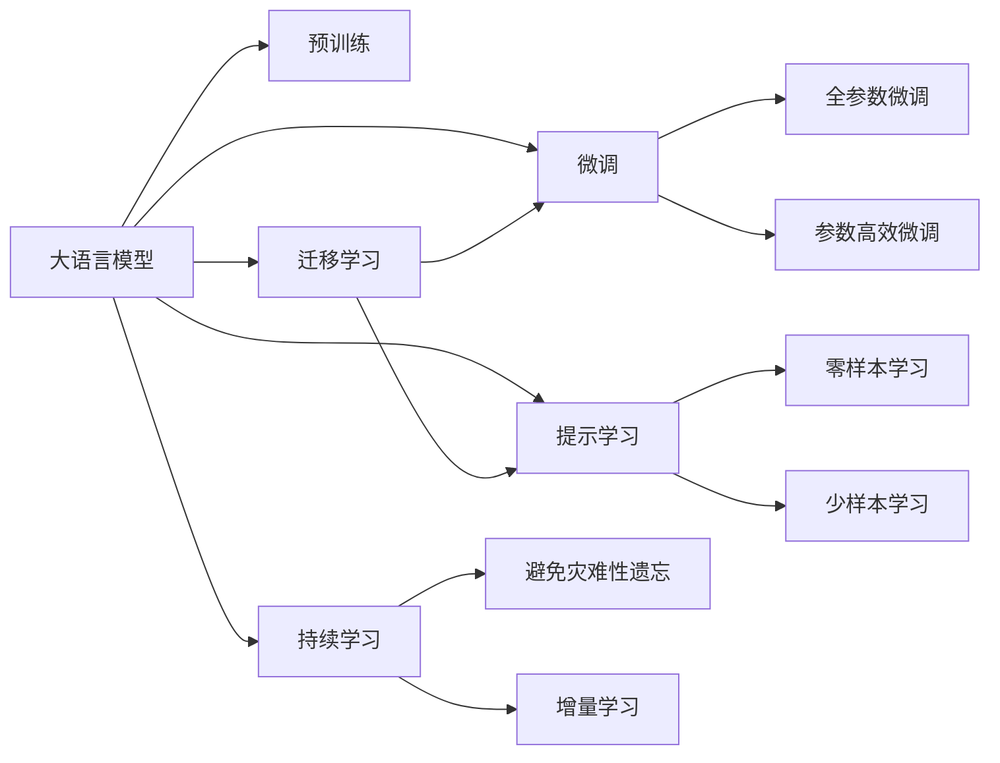

                 

# 大语言模型应用指南：向模型发起请求的参数

> 关键词：大语言模型,微调,Fine-tuning,参数高效微调,自然语言处理,NLP,深度学习,Transformer,BERT,模型训练,预训练,模型参数,神经网络,算法优化

## 1. 背景介绍

### 1.1 问题由来
近年来，深度学习技术的迅猛发展推动了大语言模型的广泛应用，特别是在自然语言处理(NLP)领域。以BERT、GPT-3等预训练模型为例，通过在巨量无标签文本数据上进行预训练，这些模型能够学习到丰富的语言知识，具备强大的语言理解和生成能力。然而，由于预训练模型的通用性较强，其性能在特定任务上可能并未达到最佳，需要通过微调进行优化。

微调是指在预训练模型的基础上，使用下游任务的少量标注数据，通过有监督学习优化模型在该任务上的性能。传统的全参数微调方法会更新所有模型参数，参数量较大，计算成本高。参数高效微调(PEFT)方法则只在微调过程中更新少部分参数，保留预训练模型的大部分权重不变，从而减少计算资源消耗。

本指南将深入探讨基于大语言模型的微调方法，特别是参数高效微调，以期为NLP开发者提供全面的指导，帮助他们利用大模型微调技术解决实际问题。

## 2. 核心概念与联系

### 2.1 核心概念概述
为了更好地理解基于大语言模型的微调方法，我们需要明确几个核心概念及其关系：

- **大语言模型 (Large Language Models, LLMs)**：如BERT、GPT等，通过在大量无标签文本数据上进行预训练，学习通用的语言表示，具备强大的语言理解和生成能力。
- **预训练 (Pre-training)**：指在无标签文本数据上，通过自监督学习任务训练通用语言模型的过程。常见的预训练任务包括言语建模、掩码语言模型等。
- **微调 (Fine-tuning)**：在预训练模型的基础上，使用下游任务的少量标注数据，通过有监督学习优化模型在该任务上的性能。
- **参数高效微调 (Parameter-Efficient Fine-Tuning, PEFT)**：只更新模型中少部分参数，保留大部分预训练权重不变，以减少计算成本。
- **自然语言处理 (NLP)**：涉及语言数据的处理、分析、理解、生成等任务，是大语言模型应用的典型场景。
- **深度学习 (Deep Learning)**：基于神经网络的机器学习方法，在大语言模型和微调中起到了关键作用。
- **Transformer**：一种高效的神经网络架构，适用于大规模语言模型的预训练和微调。
- **BERT (Bidirectional Encoder Representations from Transformers)**：一种使用Transformer结构的预训练语言模型，通过双向掩码语言模型训练，在多种NLP任务上取得了优异表现。

这些概念通过以下Mermaid流程图展示了它们之间的联系：



## 3. 核心算法原理 & 具体操作步骤

### 3.1 算法原理概述
基于大语言模型的微调方法主要分为两种：全参数微调和参数高效微调。全参数微调会更新模型中所有参数，而参数高效微调则只更新少部分参数。参数高效微调的优点在于减少计算成本，同时保留预训练模型中已经学到的知识。

微调的基本流程如下：

1. **准备数据**：收集下游任务的标注数据集，将其划分为训练集、验证集和测试集。
2. **选择模型**：选择预训练语言模型作为微调的起点。
3. **添加任务适配层**：在预训练模型的顶层添加任务特定的输出层和损失函数。
4. **设置超参数**：确定学习率、批量大小、迭代轮数等微调超参数。
5. **训练模型**：在训练集上训练模型，使用验证集监控性能。
6. **测试模型**：在测试集上评估模型性能。
7. **部署模型**：将微调后的模型部署到实际应用中。

### 3.2 算法步骤详解
以下是一个典型的微调步骤详解：

**Step 1: 准备数据**
- 收集下游任务的标注数据集，划分为训练集、验证集和测试集。
- 预处理数据，包括分词、去除停用词、标注实体等。

**Step 2: 选择模型**
- 选择合适的预训练语言模型，如BERT、GPT等。
- 加载模型，初始化模型参数。

**Step 3: 添加任务适配层**
- 根据任务类型，在预训练模型顶层设计合适的输出层和损失函数。
- 对于分类任务，通常添加线性分类器，使用交叉熵损失。
- 对于生成任务，使用语言模型解码器输出概率分布，使用负对数似然损失。

**Step 4: 设置超参数**
- 确定学习率、批量大小、迭代轮数等。
- 使用正则化技术，如L2正则、Dropout等。

**Step 5: 训练模型**
- 使用优化器，如AdamW，更新模型参数。
- 在训练集上迭代训练，周期性在验证集上评估性能。

**Step 6: 测试模型**
- 在测试集上评估模型性能，使用指标如精确率、召回率、F1分数等。
- 分析模型的错误类型，进行错误分析。

**Step 7: 部署模型**
- 将微调后的模型保存为文件，部署到实际应用中。
- 使用API或服务形式提供模型服务。

### 3.3 算法优缺点
**参数高效微调的优点**：
- 减少计算成本：仅更新少量参数，保留大部分预训练权重，减少资源消耗。
- 保留知识：保留预训练模型中已学到的语言知识，提高微调效果。
- 适应性高：可以用于多种下游任务，只需简单修改任务适配层。

**参数高效微调的缺点**：
- 初始化难度高：需要选择合适的适配器层，有时需要手动设计和调整。
- 性能提升有限：由于更新参数量有限，微调效果可能不如全参数微调。
- 可解释性差：部分参数不可解释，增加了模型调试难度。

### 3.4 算法应用领域
基于大语言模型的微调方法广泛应用于NLP领域的各种任务，如：

- 文本分类：如情感分析、主题分类、意图识别等。
- 命名实体识别：识别文本中的人名、地名、机构名等特定实体。
- 关系抽取：从文本中抽取实体之间的语义关系。
- 问答系统：对自然语言问题给出答案。
- 机器翻译：将源语言文本翻译成目标语言。
- 文本摘要：将长文本压缩成简短摘要。
- 对话系统：使机器能够与人自然对话。
- 信息检索：根据查询返回相关信息。

这些任务通过微调，可以使大语言模型在特定领域更好地发挥作用，提升性能。

## 4. 数学模型和公式 & 详细讲解 & 举例说明

### 4.1 数学模型构建
假设预训练语言模型为 $M_{\theta}$，其中 $\theta$ 为模型参数。下游任务为 $T$，训练集为 $D=\{(x_i, y_i)\}_{i=1}^N, x_i \in \mathcal{X}, y_i \in \mathcal{Y}$。定义模型在数据样本 $(x,y)$ 上的损失函数为 $\ell(M_{\theta}(x),y)$，则经验风险为：

$$
\mathcal{L}(\theta) = \frac{1}{N} \sum_{i=1}^N \ell(M_{\theta}(x_i),y_i)
$$

微调的优化目标是最小化经验风险，即找到最优参数：

$$
\theta^* = \mathop{\arg\min}_{\theta} \mathcal{L}(\theta)
$$

在实践中，我们通常使用基于梯度的优化算法，如SGD、Adam等，来近似求解上述最优化问题。设 $\eta$ 为学习率，$\lambda$ 为正则化系数，则参数的更新公式为：

$$
\theta \leftarrow \theta - \eta \nabla_{\theta}\mathcal{L}(\theta) - \eta\lambda\theta
$$

其中 $\nabla_{\theta}\mathcal{L}(\theta)$ 为损失函数对参数 $\theta$ 的梯度，可通过反向传播算法高效计算。

### 4.2 公式推导过程
以二分类任务为例，假设模型 $M_{\theta}$ 在输入 $x$ 上的输出为 $\hat{y}=M_{\theta}(x) \in [0,1]$，表示样本属于正类的概率。真实标签 $y \in \{0,1\}$。则二分类交叉熵损失函数定义为：

$$
\ell(M_{\theta}(x),y) = -[y\log \hat{y} + (1-y)\log (1-\hat{y})]
$$

将其代入经验风险公式，得：

$$
\mathcal{L}(\theta) = -\frac{1}{N}\sum_{i=1}^N [y_i\log M_{\theta}(x_i)+(1-y_i)\log(1-M_{\theta}(x_i))]
$$

根据链式法则，损失函数对参数 $\theta_k$ 的梯度为：

$$
\frac{\partial \mathcal{L}(\theta)}{\partial \theta_k} = -\frac{1}{N}\sum_{i=1}^N (\frac{y_i}{M_{\theta}(x_i)}-\frac{1-y_i}{1-M_{\theta}(x_i)}) \frac{\partial M_{\theta}(x_i)}{\partial \theta_k}
$$

其中 $\frac{\partial M_{\theta}(x_i)}{\partial \theta_k}$ 可进一步递归展开，利用自动微分技术完成计算。

### 4.3 案例分析与讲解
以命名实体识别(NER)任务为例，假设我们使用BERT模型进行微调。微调的基本步骤如下：

**Step 1: 准备数据**
- 收集命名实体识别的标注数据集。
- 将数据集划分为训练集、验证集和测试集。

**Step 2: 选择模型**
- 选择BERT模型作为微调的起点。

**Step 3: 添加任务适配层**
- 在BERT模型的顶层添加线性分类器，输出每个token属于BIO标签的概率。
- 使用交叉熵损失函数计算预测结果与真实标签之间的差异。

**Step 4: 设置超参数**
- 确定学习率为2e-5。
- 使用AdamW优化器。
- 设置批量大小为16。

**Step 5: 训练模型**
- 在训练集上迭代训练，每次更新参数。
- 在验证集上评估模型性能，避免过拟合。

**Step 6: 测试模型**
- 在测试集上评估模型性能，使用精确率、召回率、F1分数等指标。

**Step 7: 部署模型**
- 将微调后的BERT模型部署到实际应用中。

## 5. 项目实践：代码实例和详细解释说明

### 5.1 开发环境搭建
在进行微调实践前，我们需要准备好开发环境。以下是使用Python进行PyTorch开发的环境配置流程：

1. 安装Anaconda：从官网下载并安装Anaconda，用于创建独立的Python环境。

2. 创建并激活虚拟环境：
```bash
conda create -n pytorch-env python=3.8 
conda activate pytorch-env
```

3. 安装PyTorch：根据CUDA版本，从官网获取对应的安装命令。例如：
```bash
conda install pytorch torchvision torchaudio cudatoolkit=11.1 -c pytorch -c conda-forge
```

4. 安装Transformers库：
```bash
pip install transformers
```

5. 安装各类工具包：
```bash
pip install numpy pandas scikit-learn matplotlib tqdm jupyter notebook ipython
```

完成上述步骤后，即可在`pytorch-env`环境中开始微调实践。

### 5.2 源代码详细实现
以下是一个简单的BERT微调代码实现，用于命名实体识别(NER)任务：

```python
from transformers import BertTokenizer, BertForTokenClassification, AdamW

# 定义任务标签
tag2id = {'O': 0, 'B-PER': 1, 'I-PER': 2, 'B-ORG': 3, 'I-ORG': 4, 'B-LOC': 5, 'I-LOC': 6}

# 定义模型和优化器
model = BertForTokenClassification.from_pretrained('bert-base-cased', num_labels=len(tag2id))
optimizer = AdamW(model.parameters(), lr=2e-5)

# 加载训练数据
train_dataset = ...
dev_dataset = ...
test_dataset = ...

# 微调训练
for epoch in range(epochs):
    for batch in tqdm(train_dataset, desc='Training'):
        input_ids = batch['input_ids']
        attention_mask = batch['attention_mask']
        labels = batch['labels']
        model.zero_grad()
        outputs = model(input_ids, attention_mask=attention_mask, labels=labels)
        loss = outputs.loss
        loss.backward()
        optimizer.step()
    print(f'Epoch {epoch+1}, train loss: {loss:.3f}')
    evaluate(dev_dataset)

# 评估测试集
evaluate(test_dataset)
```

### 5.3 代码解读与分析
让我们再详细解读一下关键代码的实现细节：

**伯克利预训练模型加载和微调**：
- `BertTokenizer`：用于处理输入文本，将其转换为模型可以接受的形式。
- `BertForTokenClassification`：用于添加任务适配层，即将预训练BERT模型转换为用于NER任务的模型。
- `AdamW`：优化器，用于更新模型参数。

**训练集和测试集加载**：
- `train_dataset`、`dev_dataset`、`test_dataset`：分别代表训练集、验证集和测试集，用于微调模型的训练和评估。

**训练过程**：
- `for epoch in range(epochs)`：在每个epoch中迭代训练。
- `for batch in tqdm(train_dataset, desc='Training')`：在每个batch上进行训练。
- `model.zero_grad()`：在每个batch开始前清空梯度。
- `outputs = model(input_ids, attention_mask=attention_mask, labels=labels)`：前向传播计算模型输出。
- `loss = outputs.loss`：计算损失。
- `loss.backward()`：反向传播计算梯度。
- `optimizer.step()`：更新模型参数。

**评估过程**：
- `evaluate(dev_dataset)`：在验证集上评估模型性能。
- `evaluate(test_dataset)`：在测试集上评估模型性能。

**模型评估**：
- `evaluate`函数：用于评估模型性能，返回精确率、召回率、F1分数等指标。

## 6. 实际应用场景

### 6.1 智能客服系统
基于大语言模型微调的对话技术，可以广泛应用于智能客服系统的构建。传统客服往往需要配备大量人力，高峰期响应缓慢，且一致性和专业性难以保证。而使用微调后的对话模型，可以7x24小时不间断服务，快速响应客户咨询，用自然流畅的语言解答各类常见问题。

在技术实现上，可以收集企业内部的历史客服对话记录，将问题和最佳答复构建成监督数据，在此基础上对预训练对话模型进行微调。微调后的对话模型能够自动理解用户意图，匹配最合适的答案模板进行回复。对于客户提出的新问题，还可以接入检索系统实时搜索相关内容，动态组织生成回答。如此构建的智能客服系统，能大幅提升客户咨询体验和问题解决效率。

### 6.2 金融舆情监测
金融机构需要实时监测市场舆论动向，以便及时应对负面信息传播，规避金融风险。传统的人工监测方式成本高、效率低，难以应对网络时代海量信息爆发的挑战。基于大语言模型微调的文本分类和情感分析技术，为金融舆情监测提供了新的解决方案。

具体而言，可以收集金融领域相关的新闻、报道、评论等文本数据，并对其进行主题标注和情感标注。在此基础上对预训练语言模型进行微调，使其能够自动判断文本属于何种主题，情感倾向是正面、中性还是负面。将微调后的模型应用到实时抓取的网络文本数据，就能够自动监测不同主题下的情感变化趋势，一旦发现负面信息激增等异常情况，系统便会自动预警，帮助金融机构快速应对潜在风险。

### 6.3 个性化推荐系统
当前的推荐系统往往只依赖用户的历史行为数据进行物品推荐，无法深入理解用户的真实兴趣偏好。基于大语言模型微调技术，个性化推荐系统可以更好地挖掘用户行为背后的语义信息，从而提供更精准、多样的推荐内容。

在实践中，可以收集用户浏览、点击、评论、分享等行为数据，提取和用户交互的物品标题、描述、标签等文本内容。将文本内容作为模型输入，用户的后续行为（如是否点击、购买等）作为监督信号，在此基础上微调预训练语言模型。微调后的模型能够从文本内容中准确把握用户的兴趣点。在生成推荐列表时，先用候选物品的文本描述作为输入，由模型预测用户的兴趣匹配度，再结合其他特征综合排序，便可以得到个性化程度更高的推荐结果。

### 6.4 未来应用展望
随着大语言模型和微调方法的不断发展，基于微调范式将在更多领域得到应用，为传统行业带来变革性影响。

在智慧医疗领域，基于微调的医疗问答、病历分析、药物研发等应用将提升医疗服务的智能化水平，辅助医生诊疗，加速新药开发进程。

在智能教育领域，微调技术可应用于作业批改、学情分析、知识推荐等方面，因材施教，促进教育公平，提高教学质量。

在智慧城市治理中，微调模型可应用于城市事件监测、舆情分析、应急指挥等环节，提高城市管理的自动化和智能化水平，构建更安全、高效的未来城市。

此外，在企业生产、社会治理、文娱传媒等众多领域，基于大模型微调的人工智能应用也将不断涌现，为经济社会发展注入新的动力。相信随着技术的日益成熟，微调方法将成为人工智能落地应用的重要范式，推动人工智能技术在更广阔的应用领域发挥更大作用。

## 7. 工具和资源推荐

### 7.1 学习资源推荐

为了帮助开发者系统掌握大语言模型微调的理论基础和实践技巧，这里推荐一些优质的学习资源：

1. 《Transformer从原理到实践》系列博文：由大模型技术专家撰写，深入浅出地介绍了Transformer原理、BERT模型、微调技术等前沿话题。

2. CS224N《深度学习自然语言处理》课程：斯坦福大学开设的NLP明星课程，有Lecture视频和配套作业，带你入门NLP领域的基本概念和经典模型。

3. 《Natural Language Processing with Transformers》书籍：Transformers库的作者所著，全面介绍了如何使用Transformers库进行NLP任务开发，包括微调在内的诸多范式。

4. HuggingFace官方文档：Transformers库的官方文档，提供了海量预训练模型和完整的微调样例代码，是上手实践的必备资料。

5. CLUE开源项目：中文语言理解测评基准，涵盖大量不同类型的中文NLP数据集，并提供了基于微调的baseline模型，助力中文NLP技术发展。

通过对这些资源的学习实践，相信你一定能够快速掌握大语言模型微调的精髓，并用于解决实际的NLP问题。

### 7.2 开发工具推荐

高效的开发离不开优秀的工具支持。以下是几款用于大语言模型微调开发的常用工具：

1. PyTorch：基于Python的开源深度学习框架，灵活动态的计算图，适合快速迭代研究。大部分预训练语言模型都有PyTorch版本的实现。

2. TensorFlow：由Google主导开发的开源深度学习框架，生产部署方便，适合大规模工程应用。同样有丰富的预训练语言模型资源。

3. Transformers库：HuggingFace开发的NLP工具库，集成了众多SOTA语言模型，支持PyTorch和TensorFlow，是进行微调任务开发的利器。

4. Weights & Biases：模型训练的实验跟踪工具，可以记录和可视化模型训练过程中的各项指标，方便对比和调优。与主流深度学习框架无缝集成。

5. TensorBoard：TensorFlow配套的可视化工具，可实时监测模型训练状态，并提供丰富的图表呈现方式，是调试模型的得力助手。

6. Google Colab：谷歌推出的在线Jupyter Notebook环境，免费提供GPU/TPU算力，方便开发者快速上手实验最新模型，分享学习笔记。

合理利用这些工具，可以显著提升大语言模型微调任务的开发效率，加快创新迭代的步伐。

### 7.3 相关论文推荐

大语言模型和微调技术的发展源于学界的持续研究。以下是几篇奠基性的相关论文，推荐阅读：

1. Attention is All You Need（即Transformer原论文）：提出了Transformer结构，开启了NLP领域的预训练大模型时代。

2. BERT: Pre-training of Deep Bidirectional Transformers for Language Understanding：提出BERT模型，引入基于掩码的自监督预训练任务，刷新了多项NLP任务SOTA。

3. Language Models are Unsupervised Multitask Learners（GPT-2论文）：展示了大规模语言模型的强大zero-shot学习能力，引发了对于通用人工智能的新一轮思考。

4. Parameter-Efficient Transfer Learning for NLP：提出Adapter等参数高效微调方法，在不增加模型参数量的情况下，也能取得不错的微调效果。

5. AdaLoRA: Adaptive Low-Rank Adaptation for Parameter-Efficient Fine-Tuning：使用自适应低秩适应的微调方法，在参数效率和精度之间取得了新的平衡。

这些论文代表了大语言模型微调技术的发展脉络。通过学习这些前沿成果，可以帮助研究者把握学科前进方向，激发更多的创新灵感。

除上述资源外，还有一些值得关注的前沿资源，帮助开发者紧跟大语言模型微调技术的最新进展，例如：

1. arXiv论文预印本：人工智能领域最新研究成果的发布平台，包括大量尚未发表的前沿工作，学习前沿技术的必读资源。

2. 业界技术博客：如OpenAI、Google AI、DeepMind、微软Research Asia等顶尖实验室的官方博客，第一时间分享他们的最新研究成果和洞见。

3. 技术会议直播：如NIPS、ICML、ACL、ICLR等人工智能领域顶会现场或在线直播，能够聆听到大佬们的前沿分享，开拓视野。

4. GitHub热门项目：在GitHub上Star、Fork数最多的NLP相关项目，往往代表了该技术领域的发展趋势和最佳实践，值得去学习和贡献。

5. 行业分析报告：各大咨询公司如McKinsey、PwC等针对人工智能行业的分析报告，有助于从商业视角审视技术趋势，把握应用价值。

总之，对于大语言模型微调技术的学习和实践，需要开发者保持开放的心态和持续学习的意愿。多关注前沿资讯，多动手实践，多思考总结，必将收获满满的成长收益。

## 8. 总结：未来发展趋势与挑战

### 8.1 总结

本文对基于大语言模型的微调方法进行了全面系统的介绍。首先阐述了大语言模型和微调技术的研究背景和意义，明确了微调在拓展预训练模型应用、提升下游任务性能方面的独特价值。其次，从原理到实践，详细讲解了监督微调的数学原理和关键步骤，给出了微调任务开发的完整代码实例。同时，本文还广泛探讨了微调方法在智能客服、金融舆情、个性化推荐等多个行业领域的应用前景，展示了微调范式的巨大潜力。此外，本文精选了微调技术的各类学习资源，力求为读者提供全方位的技术指引。

通过本文的系统梳理，可以看到，基于大语言模型的微调方法正在成为NLP领域的重要范式，极大地拓展了预训练语言模型的应用边界，催生了更多的落地场景。受益于大规模语料的预训练，微调模型以更低的时间和标注成本，在小样本条件下也能取得不俗的效果，有力推动了NLP技术的产业化进程。未来，伴随预训练语言模型和微调方法的持续演进，相信NLP技术将在更广阔的应用领域大放异彩，深刻影响人类的生产生活方式。

### 8.2 未来发展趋势

展望未来，大语言模型微调技术将呈现以下几个发展趋势：

1. 模型规模持续增大。随着算力成本的下降和数据规模的扩张，预训练语言模型的参数量还将持续增长。超大规模语言模型蕴含的丰富语言知识，有望支撑更加复杂多变的下游任务微调。

2. 微调方法日趋多样。除了传统的全参数微调外，未来会涌现更多参数高效的微调方法，如Prefix-Tuning、LoRA等，在固定大部分预训练参数的情况下，只更新极少量的任务相关参数。

3. 持续学习成为常态。随着数据分布的不断变化，微调模型也需要持续学习新知识以保持性能。如何在不遗忘原有知识的同时，高效吸收新样本信息，将成为重要的研究课题。

4. 标注样本需求降低。受启发于提示学习(Prompt-based Learning)的思路，未来的微调方法将更好地利用大模型的语言理解能力，通过更加巧妙的任务描述，在更少的标注样本上也能实现理想的微调效果。

5. 多模

