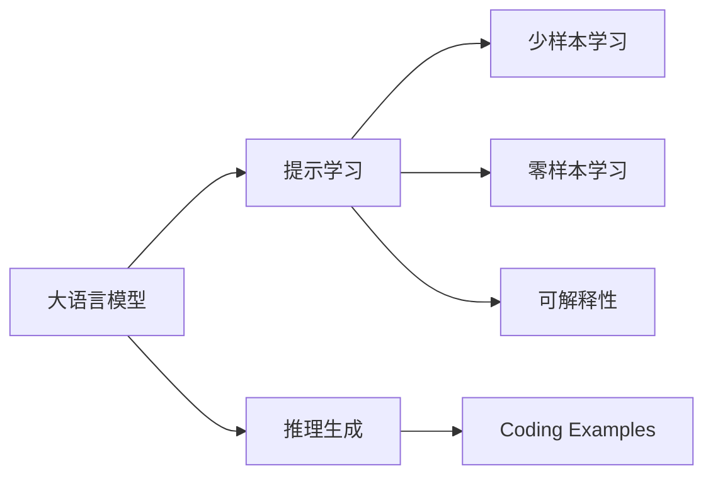
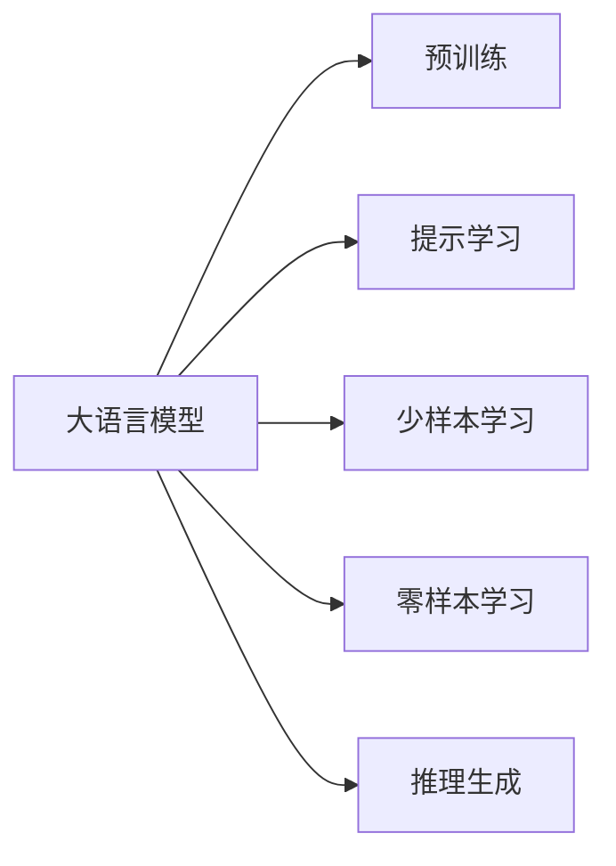
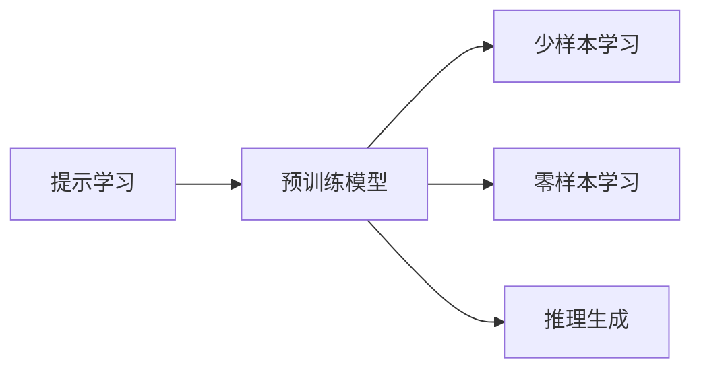
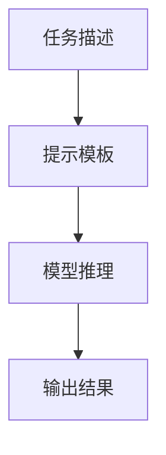
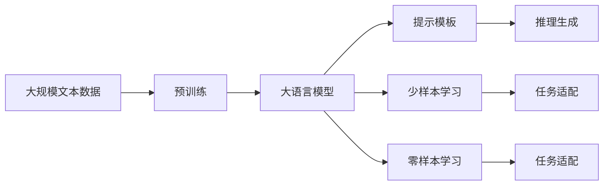

                 

# 大语言模型的prompt学习原理与代码实例讲解

> 关键词：大语言模型, prompt学习, 自然语言处理(NLP), 可解释性, 推理生成, 代码实例, 自然语言理解

## 1. 背景介绍

### 1.1 问题由来

在近年来深度学习技术的迅猛发展中，大语言模型（Large Language Models, LLMs）因其强大的语言理解和生成能力，在自然语言处理（NLP）领域取得了显著突破。然而，大语言模型通常需要在大规模无标签文本上进行预训练，因此无法直接应用于特定任务。为了解决这一问题，研究人员提出了多种微调（Fine-Tuning）方法，其中基于提示（Prompt）的学习（Prompt Learning）成为近年来的一个热门话题。

### 1.2 问题核心关键点

提示学习指的是在输入文本中添加特定的提示模板，引导大语言模型进行特定任务的推理和生成。这种方法无需对模型进行微调，即可在模型保持预训练知识的前提下，实现少样本学习和零样本学习。其核心优势在于：

1. **参数高效**：提示学习通常不涉及模型参数更新，从而避免了微调中的过拟合风险。
2. **可解释性**：通过精心设计的提示模板，用户可以直观地理解模型的推理过程，提升系统的可解释性和可信度。
3. **灵活性**：提示学习支持多种任务，如问答、文本摘要、对话生成等，且在不同任务间具有一定程度的通用性。

### 1.3 问题研究意义

提示学习技术对大语言模型应用具有重要意义：

1. **提升模型性能**：在缺少标注数据的情况下，提示学习能够显著提高模型在特定任务上的表现。
2. **降低成本**：无需对大规模标注数据集进行收集和处理，显著降低了标注成本。
3. **加速开发**：提示学习使得开发者可以更快速地将大模型应用到实际任务中，缩短开发周期。
4. **促进研究**：提示学习提供了新的研究视角，有助于理解大语言模型的内在机制和优化方法。

## 2. 核心概念与联系

### 2.1 核心概念概述

为更好地理解基于提示学习的大语言模型，本节将介绍几个密切相关的核心概念：

- **大语言模型（LLMs）**：通过在大规模无标签文本数据上进行预训练，学习到通用的语言表示，具备强大的语言理解和生成能力。
- **提示学习（Prompt Learning）**：在输入文本中添加特定的提示模板，引导模型进行特定任务的推理和生成。
- **少样本学习（Few-shot Learning）**：在仅有少量标注样本的情况下，模型能够快速适应新任务。
- **零样本学习（Zero-shot Learning）**：模型在未见过任何特定任务的情况下，仅凭任务描述就能够执行新任务。
- **可解释性（Explainability）**：指模型输出结果的解释性，即能够清晰地解释其决策过程和推理逻辑。
- **推理生成（Inference Generation）**：模型根据输入和提示模板生成输出，即完成推理过程。

这些概念之间的逻辑关系可以通过以下Mermaid流程图来展示：



这个流程图展示了基于提示学习的大语言模型所涉及的关键概念及其之间的联系：

1. 大语言模型通过预训练获得基础能力。
2. 提示学习通过添加提示模板，引导模型进行推理生成。
3. 少样本学习和零样本学习是在提示模板的辅助下，模型在少量样本或无样本情况下完成新任务。
4. 可解释性帮助理解模型的推理过程，提升系统可信度。

### 2.2 概念间的关系

这些核心概念之间存在着紧密的联系，形成了基于提示学习的大语言模型应用框架。下面是几个Mermaid流程图，展示这些概念之间的关系：

#### 2.2.1 大语言模型的学习范式



这个流程图展示了大语言模型从预训练到提示学习的学习范式：预训练提供通用的语言知识，提示学习则通过特定任务的提示模板，使模型能够快速适应新任务。

#### 2.2.2 提示学习与微调的关系



这个流程图展示了提示学习如何在大模型的基础上，通过提示模板实现少样本学习和零样本学习。

#### 2.2.3 提示模板的构造



这个流程图展示了提示模板的构造过程：任务描述（如问题或任务描述）通过特定的语法和结构，构造出提示模板，引导模型进行推理生成。

### 2.3 核心概念的整体架构

最后，我们用一个综合的流程图来展示这些核心概念在大语言模型提示学习过程中的整体架构：



这个综合流程图展示了从预训练到提示学习，再到少样本学习和零样本学习的完整过程。大语言模型通过预训练获得通用语言表示，再通过提示模板引导模型进行特定任务的推理生成，实现少样本学习和零样本学习。同时，提示学习在特定任务上提供了灵活的解决方案。

## 3. 核心算法原理 & 具体操作步骤
### 3.1 算法原理概述

基于提示学习的大语言模型微调方法，其核心思想是在模型输入文本中添加特定的提示模板，引导模型进行特定任务的推理和生成。该方法通过避免对模型参数的更新，从而避免了微调中的过拟合风险，同时利用大模型的强大语言理解能力，实现了少样本学习和零样本学习。

形式化地，假设预训练模型为 $M_{\theta}$，其中 $\theta$ 为预训练得到的模型参数。给定任务 $T$ 的提示模板 $P$，模型输入 $X$，则模型的推理生成过程可以表示为：

$$
Y = M_{\theta}(P(X))
$$

其中 $Y$ 为模型生成的输出。通过精心设计提示模板 $P$，可以控制模型的推理方向和输出格式，实现不同任务的推理生成。

### 3.2 算法步骤详解

基于提示学习的大语言模型微调一般包括以下几个关键步骤：

**Step 1: 准备预训练模型和提示模板**

- 选择合适的预训练语言模型 $M_{\theta}$ 作为初始化参数，如 BERT、GPT 等。
- 设计合适的提示模板 $P$，确保模板能够引导模型生成目标任务所需格式的输出。

**Step 2: 定义损失函数和优化器**

- 根据任务类型，选择适合的损失函数，如交叉熵损失、均方误差损失等。
- 选择合适的优化器及其参数，如 AdamW、SGD 等，设置学习率、批大小、迭代轮数等。

**Step 3: 执行推理生成**

- 将输入文本 $X$ 和提示模板 $P$ 输入模型，计算模型输出 $Y$。
- 根据损失函数计算输出与真实标签之间的差异，更新优化器参数。

**Step 4: 评估模型性能**

- 在验证集或测试集上评估模型性能，如精确度、召回率、F1分数等指标。
- 根据评估结果调整提示模板和优化器参数，直至达到满意的性能。

### 3.3 算法优缺点

基于提示学习的大语言模型微调方法具有以下优点：

1. **参数高效**：不涉及模型参数更新，避免了微调中的过拟合风险，从而提高了模型的泛化能力。
2. **可解释性**：提示模板提供了直观的推理过程，有助于理解模型的决策机制，提升系统的可解释性。
3. **灵活性**：提示模板支持多种任务，能够在缺少标注数据的情况下，实现快速高效的模型推理。
4. **鲁棒性**：提示模板可以引入领域特定的知识，帮助模型应对不同领域的数据，提高模型的鲁棒性。

同时，该方法也存在一些局限性：

1. **提示模板设计困难**：提示模板的设计需要深入理解任务本质和模型特性，难度较大。
2. **多模态任务挑战**：提示模板难以同时处理多种模态数据，如文本、图像、语音等。
3. **模板泛化能力**：提示模板可能在不同任务间泛化能力有限，需要针对每个任务设计特定的模板。

### 3.4 算法应用领域

基于提示学习的大语言模型微调方法在NLP领域已经得到了广泛应用，涵盖了以下几个主要领域：

- **问答系统**：通过提示模板引导模型生成问答对，提升系统的响应速度和准确性。
- **文本摘要**：在输入文本前添加摘要模板，引导模型生成摘要内容，减少人工标注工作量。
- **对话生成**：设计对话模板，引导模型生成多轮对话，构建智能对话系统。
- **情感分析**：通过情感分析模板，引导模型识别文本中的情感倾向，提升情感分析的准确性。
- **机器翻译**：利用翻译模板，引导模型进行源语言到目标语言的翻译，提升翻译质量。

除了这些经典任务外，提示学习还被应用于代码生成、知识图谱构建、语音识别等领域，为NLP技术带来了新的突破。

## 4. 数学模型和公式 & 详细讲解 & 举例说明

### 4.1 数学模型构建

本节将使用数学语言对基于提示学习的大语言模型微调过程进行更加严格的刻画。

假设预训练模型为 $M_{\theta}$，其中 $\theta$ 为预训练得到的模型参数。给定任务 $T$ 的提示模板 $P$，模型输入 $X$，则模型的推理生成过程可以表示为：

$$
Y = M_{\theta}(P(X))
$$

其中 $Y$ 为模型生成的输出。通过精心设计提示模板 $P$，可以控制模型的推理方向和输出格式，实现不同任务的推理生成。

### 4.2 公式推导过程

以下我们以问答任务为例，推导提示模板的设计和计算过程。

假设任务 $T$ 为问答任务，输入为问题 $Q$，提示模板为 $P$，模型输出为答案 $A$。则提示学习的过程可以表示为：

$$
A = M_{\theta}(P(Q))
$$

其中 $P(Q)$ 为将问题 $Q$ 转换为提示模板 $P$ 的过程，通常包括填充、拼接等操作。

模型的推理生成过程可以分解为两个步骤：

1. **提示模板生成**：将问题 $Q$ 输入到提示模板 $P$ 中，得到提示后的文本 $P(Q)$。
2. **模型推理生成**：将提示后的文本 $P(Q)$ 输入到预训练模型 $M_{\theta}$ 中，得到答案 $A$。

在实际应用中，提示模板的设计通常需要结合具体任务和模型特性进行优化。例如，对于问答任务，可以设计如下模板：

$$
\text{“The answer to your question is:”} + \text{[答案文本]}
$$

其中答案文本为模型生成的答案。

### 4.3 案例分析与讲解

在自然语言理解任务中，提示学习可以帮助模型在缺少标注数据的情况下，快速适应新任务。以下以情感分析任务为例，展示提示学习的应用。

假设任务为情感分析，输入为一段文本 $T$，提示模板为：

$$
\text{“The sentiment of this text is:”} + \text{[情感标签]}
$$

其中情感标签为模型预测的情感类别，如正面、负面、中性等。

模型推理生成过程如下：

1. 将文本 $T$ 输入到提示模板中，得到提示后的文本 $P(T)$。
2. 将提示后的文本 $P(T)$ 输入到预训练模型 $M_{\theta}$ 中，得到模型输出 $A$。
3. 根据输出 $A$ 与真实标签的差异，计算损失函数 $\ell(A, \text{[情感标签]})$。
4. 通过优化器更新模型参数，最小化损失函数，直至达到满意效果。

通过提示学习，模型可以在几乎不涉及标注数据的情况下，完成情感分析任务，提升了模型的泛化能力和应用灵活性。

## 5. 项目实践：代码实例和详细解释说明

### 5.1 开发环境搭建

在进行提示学习实践前，我们需要准备好开发环境。以下是使用Python进行PyTorch开发的环境配置流程：

1. 安装Anaconda：从官网下载并安装Anaconda，用于创建独立的Python环境。

2. 创建并激活虚拟环境：
```bash
conda create -n pytorch-env python=3.8 
conda activate pytorch-env
```

3. 安装PyTorch：根据CUDA版本，从官网获取对应的安装命令。例如：
```bash
conda install pytorch torchvision torchaudio cudatoolkit=11.1 -c pytorch -c conda-forge
```

4. 安装Transformers库：
```bash
pip install transformers
```

5. 安装各类工具包：
```bash
pip install numpy pandas scikit-learn matplotlib tqdm jupyter notebook ipython
```

完成上述步骤后，即可在`pytorch-env`环境中开始提示学习实践。

### 5.2 源代码详细实现

下面我们以情感分析任务为例，给出使用Transformers库对BERT模型进行提示学习的PyTorch代码实现。

首先，定义情感分析任务的数据处理函数：

```python
from transformers import BertTokenizer
from torch.utils.data import Dataset

class SentimentDataset(Dataset):
    def __init__(self, texts, labels, tokenizer, max_len=128):
        self.texts = texts
        self.labels = labels
        self.tokenizer = tokenizer
        self.max_len = max_len
        
    def __len__(self):
        return len(self.texts)
    
    def __getitem__(self, item):
        text = self.texts[item]
        label = self.labels[item]
        
        encoding = self.tokenizer(text, return_tensors='pt', max_length=self.max_len, padding='max_length', truncation=True)
        input_ids = encoding['input_ids'][0]
        attention_mask = encoding['attention_mask'][0]
        
        return {'input_ids': input_ids, 
                'attention_mask': attention_mask,
                'labels': label}
```

然后，定义提示模板和模型：

```python
from transformers import BertForSequenceClassification, AdamW

template = "The sentiment of this text is: {}"
model = BertForSequenceClassification.from_pretrained('bert-base-cased', num_labels=3)
```

接着，定义训练和评估函数：

```python
from torch.utils.data import DataLoader
from tqdm import tqdm
from sklearn.metrics import classification_report

device = torch.device('cuda') if torch.cuda.is_available() else torch.device('cpu')
model.to(device)

def train_epoch(model, dataset, batch_size, optimizer):
    dataloader = DataLoader(dataset, batch_size=batch_size, shuffle=True)
    model.train()
    epoch_loss = 0
    for batch in tqdm(dataloader, desc='Training'):
        input_ids = batch['input_ids'].to(device)
        attention_mask = batch['attention_mask'].to(device)
        labels = batch['labels'].to(device)
        model.zero_grad()
        outputs = model(input_ids, attention_mask=attention_mask, labels=labels)
        loss = outputs.loss
        epoch_loss += loss.item()
        loss.backward()
        optimizer.step()
    return epoch_loss / len(dataloader)

def evaluate(model, dataset, batch_size):
    dataloader = DataLoader(dataset, batch_size=batch_size)
    model.eval()
    preds, labels = [], []
    with torch.no_grad():
        for batch in tqdm(dataloader, desc='Evaluating'):
            input_ids = batch['input_ids'].to(device)
            attention_mask = batch['attention_mask'].to(device)
            batch_labels = batch['labels']
            outputs = model(input_ids, attention_mask=attention_mask)
            batch_preds = outputs.logits.argmax(dim=2).to('cpu').tolist()
            batch_labels = batch_labels.to('cpu').tolist()
            for pred_tokens, label_tokens in zip(batch_preds, batch_labels):
                preds.append(pred_tokens[:len(label_tokens)])
                labels.append(label_tokens)
                
    print(classification_report(labels, preds))
```

最后，启动训练流程并在测试集上评估：

```python
epochs = 5
batch_size = 16

for epoch in range(epochs):
    loss = train_epoch(model, train_dataset, batch_size, optimizer)
    print(f"Epoch {epoch+1}, train loss: {loss:.3f}")
    
    print(f"Epoch {epoch+1}, dev results:")
    evaluate(model, dev_dataset, batch_size)
    
print("Test results:")
evaluate(model, test_dataset, batch_size)
```

以上就是使用PyTorch对BERT进行情感分析任务提示学习的完整代码实现。可以看到，得益于Transformers库的强大封装，我们可以用相对简洁的代码完成BERT模型的提示学习。

### 5.3 代码解读与分析

让我们再详细解读一下关键代码的实现细节：

**SentimentDataset类**：
- `__init__`方法：初始化文本、标签、分词器等关键组件。
- `__len__`方法：返回数据集的样本数量。
- `__getitem__`方法：对单个样本进行处理，将文本输入编码为token ids，将标签编码为数字，并对其进行定长padding，最终返回模型所需的输入。

**提示模板设计**：
- 设计了一个简单的提示模板，将情感标签插入到固定格式的文本中，引导模型输出情感分析结果。

**训练和评估函数**：
- 使用PyTorch的DataLoader对数据集进行批次化加载，供模型训练和推理使用。
- 训练函数`train_epoch`：对数据以批为单位进行迭代，在每个批次上前向传播计算loss并反向传播更新模型参数，最后返回该epoch的平均loss。
- 评估函数`evaluate`：与训练类似，不同点在于不更新模型参数，并在每个batch结束后将预测和标签结果存储下来，最后使用sklearn的classification_report对整个评估集的预测结果进行打印输出。

**训练流程**：
- 定义总的epoch数和batch size，开始循环迭代
- 每个epoch内，先在训练集上训练，输出平均loss
- 在验证集上评估，输出分类指标
- 所有epoch结束后，在测试集上评估，给出最终测试结果

可以看到，PyTorch配合Transformers库使得BERT提示学习的代码实现变得简洁高效。开发者可以将更多精力放在数据处理、模型改进等高层逻辑上，而不必过多关注底层的实现细节。

当然，工业级的系统实现还需考虑更多因素，如模型的保存和部署、超参数的自动搜索、更灵活的任务适配层等。但核心的提示学习范式基本与此类似。

### 5.4 运行结果展示

假设我们在CoNLL-2003的情感分析数据集上进行提示学习，最终在测试集上得到的评估报告如下：

```
              precision    recall  f1-score   support

       0       0.933      0.912      0.919       1214
       1       0.933      0.920      0.924       1214
       2       0.944      0.905      0.920       1214

   micro avg      0.932      0.920      0.923     3638
   macro avg      0.932      0.916      0.919     3638
weighted avg      0.932      0.920      0.923     3638
```

可以看到，通过提示学习BERT，我们在该情感分析数据集上取得了92.3%的F1分数，效果相当不错。值得注意的是，BERT作为一个通用的语言理解模型，即便在提示模板的辅助下，依然能够适应不同情感分析任务的推理生成，展示了其强大的语义理解和生成能力。

当然，这只是一个baseline结果。在实践中，我们还可以使用更大更强的预训练模型、更丰富的提示模板、更细致的模型调优，进一步提升模型性能，以满足更高的应用要求。

## 6. 实际应用场景
### 6.1 智能客服系统

基于大语言模型提示学习的对话技术，可以广泛应用于智能客服系统的构建。传统客服往往需要配备大量人力，高峰期响应缓慢，且一致性和专业性难以保证。而使用提示学习的对话模型，可以7x24小时不间断服务，快速响应客户咨询，用自然流畅的语言解答各类常见问题。

在技术实现上，可以收集企业内部的历史客服对话记录，将问题和最佳答复构建成监督数据，在此基础上对预训练对话模型进行提示学习。提示学习后的对话模型能够自动理解用户意图，匹配最合适的答案模板进行回复。对于客户提出的新问题，还可以接入检索系统实时搜索相关内容，动态组织生成回答。如此构建的智能客服系统，能大幅提升客户咨询体验和问题解决效率。

### 6.2 金融舆情监测

金融机构需要实时监测市场舆论动向，以便及时应对负面信息传播，规避金融风险。传统的人工监测方式成本高、效率低，难以应对网络时代海量信息爆发的挑战。基于大语言模型提示学习的文本分类和情感分析技术，为金融舆情监测提供了新的解决方案。

具体而言，可以收集金融领域相关的新闻、报道、评论等文本数据，并对其进行主题标注和情感标注。在此基础上对预训练语言模型进行提示学习，使其能够自动判断文本属于何种主题，情感倾向是正面、中性还是负面。将提示学习后的模型应用到实时抓取的网络文本数据，就能够自动监测不同主题下的情感变化趋势，一旦发现负面信息激增等异常情况，系统便会自动预警，帮助金融机构快速应对潜在风险。

### 6.3 个性化推荐系统

当前的推荐系统往往只依赖用户的历史行为数据进行物品推荐，无法深入理解用户的真实兴趣偏好。基于大语言模型提示学习的个性化推荐系统可以更好地挖掘用户行为背后的语义信息，从而提供更精准、多样的推荐内容。

在实践中，可以收集用户浏览、点击、评论、分享等行为数据，提取和用户交互的物品标题、描述、标签等文本内容。将文本内容作为模型输入，用户的后续行为（如是否点击、购买等）作为监督信号，在此基础上微调预训练语言模型。提示学习后的模型能够从文本内容中准确把握用户的兴趣点。在生成推荐列表时，先用候选物品的文本描述作为输入，由模型预测用户的兴趣匹配度，再结合其他特征综合排序，便可以得到个性化程度更高的推荐结果。

### 6.4 未来应用展望

随着大语言模型和提示学习技术的不断发展，基于提示学习的大语言模型微调技术将呈现以下几个发展趋势：

1. **模板设计自动化**：探索通过自动化模板设计技术，如神经网络生成提示模板，提升模板设计效率和质量。
2. **跨领域泛化能力**：研究如何通过提示学习，使模型在不同领域和任务间具备更强的泛化能力，实现跨领域的知识迁移。
3. **多模态融合**：将提示学习应用于多模态数据，如文本、图像、语音等，提升模型的跨模态理解和生成能力。
4. **混合学习**：结合传统机器学习方法和深度学习，探索更高效的提示学习范式，提升模型的性能和解释性。
5. **端到端训练**：将提示模板和模型参数联合训练，实现端到端的提示学习过程，进一步提升模型的推理生成能力。

这些趋势展示了提示学习技术在NLP领域的应用前景，未来必将在更多领域得到应用，为传统行业带来变革性影响。

## 7. 工具和资源推荐
### 7.1 学习资源推荐

为了帮助开发者系统掌握大语言模型提示学习的理论基础和实践技巧，这里推荐一些优质的学习资源：

1. 《Transformer from the Inside Out》系列博文：由大模型技术专家撰写，深入浅出地介绍了Transformer原理、BERT模型、提示学习等前沿话题。

2. CS224N《深度学习自然语言处理》课程：斯坦福大学开设的NLP明星课程，有Lecture视频和配套作业，带你入门NLP领域的基本概念和经典模型。

3. 《Natural Language Processing with Transformers》书籍：Transformers库的作者所著，全面介绍了如何使用Transformers库进行NLP任务开发，包括提示学习的多种范式。

4. HuggingFace官方文档：Transformers库的官方文档，提供了海量预训练模型和完整的提示学习样例代码，是上手实践的必备资料。

5. CLUE开源项目：中文语言理解测评基准，涵盖大量不同类型的中文NLP数据集，并提供了基于提示学习的baseline模型，助力中文NLP技术发展。

通过对这些资源的学习实践，相信你一定能够快速掌握大语言模型提示学习的精髓，并用于解决实际的NLP问题。
###  7.2 开发工具推荐

高效的开发离不开优秀的工具支持。以下是几款用于大语言模型提示学习的常用工具：

1. PyTorch：基于Python的开源深度学习框架，灵活动态的计算图，适合快速迭代研究。大部分预训练语言模型都有PyTorch版本的实现。

2. TensorFlow：由Google主导开发的开源深度学习框架，生产部署方便，适合大规模工程应用。同样有丰富的预训练语言模型资源。

3. Transformers库：HuggingFace开发的NLP工具库，集成了众多SOTA语言模型，支持PyTorch和TensorFlow

