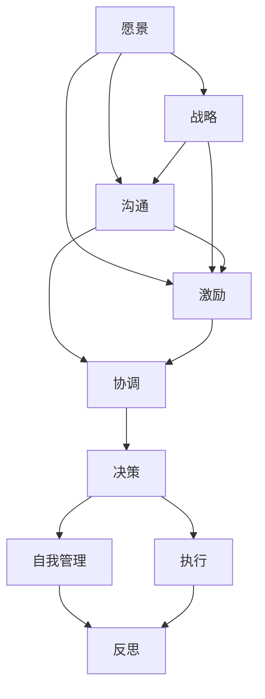

                 

# 如何进行领导力提升：如何成为优秀的领导者？

## 1. 背景介绍

### 1.1 问题由来
在现代企业中，领导力是一个至关重要的要素。优秀的领导者能够有效地引导团队，实现企业目标，提升团队士气和工作效率。然而，成为一名优秀的领导者并不是一蹴而就的，它需要不断的学习、实践和反思。本文旨在通过系统介绍领导力的核心概念、方法和实践，帮助读者提升自身的领导能力，成为一名卓越的领导者。

### 1.2 问题核心关键点
优秀的领导者通常具备以下核心特质：
- **愿景和战略**：能够明确企业发展方向，制定切实可行的战略规划。
- **沟通与协调**：具备卓越的沟通能力和协调技巧，能够有效管理团队，处理冲突。
- **激励与赋能**：能够激发团队成员的潜力，赋能团队成员，推动团队不断进步。
- **决策与执行**：具备果断的决策能力和强有力的执行力，确保战略目标的实现。
- **自我管理与反思**：能够不断自我提升，善于从经验中反思和改进。

### 1.3 问题研究意义
提升领导力不仅有助于企业的发展和成功，还能促进团队成员的个人成长和职业发展。成为一名优秀的领导者，不仅可以带来组织的成功，还能在个人职业生涯中取得更大的成就和影响力。

## 2. 核心概念与联系

### 2.1 核心概念概述

为更好地理解领导力的提升过程，本节将介绍几个密切相关的核心概念：

- **领导力（Leadership）**：指引导和管理团队以达到共同目标的能力。优秀的领导者能够通过愿景、激励、协调等手段，带领团队实现目标。

- **愿景（Vision）**：指对未来发展的明确目标和方向，能够激发团队成员的热情和动力。

- **战略（Strategy）**：指实现愿景的路径和计划，需要有系统性和前瞻性。

- **沟通（Communication）**：指有效传达信息、协调合作、解决冲突的能力。

- **激励（Motivation）**：指激发团队成员积极性和创造性的能力。

- **协调（Coordination）**：指管理团队成员的协同工作，确保任务顺利进行。

- **决策（Decision Making）**：指基于信息和分析做出的选择和判断。

- **执行（Execution）**：指将决策转化为实际行动，确保目标的实现。

- **自我管理（Self-Management）**：指领导者对自己的行为、情绪和思维的调节和控制。

- **反思（Reflection）**：指从经验中学习，不断改进和提升。

这些核心概念之间存在着紧密的联系，形成了领导力的整体架构。通过理解这些核心概念，我们可以更好地把握提升领导力的关键要素和方法。

### 2.2 概念间的关系

这些核心概念之间的关系可以通过以下Mermaid流程图来展示：



这个流程图展示了大领导力的核心要素和它们之间的内在联系：

1. 愿景和战略是领导力的起点，明确方向和目标。
2. 沟通和激励是推动团队前进的动力。
3. 协调和决策是实现目标的保障。
4. 执行是确保目标实现的行动。
5. 自我管理和反思是持续提升领导力的基础。

### 2.3 核心概念的整体架构

最后，我们用一个综合的流程图来展示这些核心概念在大领导力提升过程中的整体架构：


这个综合流程图展示了大领导力提升过程中各个要素之间的相互关系和作用。

## 3. 核心算法原理 & 具体操作步骤
### 3.1 算法原理概述

提升领导力的过程本质上是一个系统的自我提升和团队管理的过程。其核心算法原理可以概括为以下几个步骤：

1. **明确愿景和战略**：领导者需要明确企业的长远目标和发展方向，制定切实可行的战略计划。
2. **有效沟通**：领导者需要与团队成员进行有效沟通，确保信息传达清晰、一致。
3. **激励和赋能**：领导者需要激发团队成员的积极性和创造力，赋能团队成员，提升其能力。
4. **决策和执行**：领导者需要在信息充分的基础上，做出明智的决策，并有效执行。
5. **自我管理和反思**：领导者需要不断自我提升，从经验中反思和学习，持续改进。

### 3.2 算法步骤详解

基于上述核心算法原理，提升领导力的具体操作步骤可以概括为以下七个步骤：

**Step 1: 自我评估**
- 列出自己的核心领导能力，评估当前水平。
- 识别自身的不足和需要改进的地方。

**Step 2: 明确愿景和战略**
- 与团队成员共同讨论，明确企业的长远目标和发展方向。
- 制定具体可行的战略计划，分解为短期和长期目标。

**Step 3: 有效沟通**
- 建立清晰的沟通渠道，确保信息传递高效。
- 定期召开会议，反馈团队成员的意见和建议。

**Step 4: 激励和赋能**
- 识别团队成员的优势和潜力，提供针对性的培训和支持。
- 建立正向的激励机制，激发成员的积极性和创造力。

**Step 5: 决策和执行**
- 基于充分的信息和数据，做出明智的决策。
- 制定详细的执行计划，确保决策的落地实施。

**Step 6: 持续自我管理**
- 通过学习和实践，不断提升自己的领导能力。
- 善于自我反思，从经验中总结和改进。

**Step 7: 定期反馈和改进**
- 定期与团队成员进行反馈，了解团队的发展情况。
- 根据反馈结果，及时调整战略和措施，持续改进。

### 3.3 算法优缺点

提升领导力的算法具有以下优点：
1. **系统性**：通过明确愿景、战略、沟通、激励、决策、执行和反思等步骤，形成系统的提升路径。
2. **适应性**：适用于不同规模和类型的组织，能够灵活应用。
3. **可操作性**：每个步骤都有明确的方法和工具，便于实践和执行。

同时，该算法也存在以下缺点：
1. **复杂性**：提升领导力涉及多个方面，操作复杂，需要持续投入时间和精力。
2. **主观性**：领导力的提升效果受到个人素质和团队情况的制约，难以量化和标准化。
3. **环境依赖**：外部环境的变化对领导力的提升有重要影响，需要持续适应和调整。

### 3.4 算法应用领域

提升领导力的算法适用于各个领域和层级，尤其是中高层管理者和团队负责人。其应用领域包括但不限于：

- **企业管理**：提升企业整体战略规划和执行力，推动企业发展。
- **项目管理**：提升项目管理的协调能力和决策效率，确保项目顺利完成。
- **团队管理**：提升团队成员的积极性和协作能力，增强团队凝聚力。
- **个人发展**：提升个人的自我管理和反思能力，实现职业成长。

## 4. 数学模型和公式 & 详细讲解 & 举例说明
### 4.1 数学模型构建

领导力的提升过程可以用数学模型来描述。设 $L$ 表示领导力，$V$ 表示愿景，$S$ 表示战略，$C$ 表示沟通，$M$ 表示激励，$D$ 表示决策，$E$ 表示执行，$S_M$ 表示自我管理，$R$ 表示反思。则领导力的提升模型可以表示为：

$$
L = V * S * C * M * D * E * S_M * R
$$

其中，各要素之间的乘法表示相互促进和支持，即每个要素的提升都有助于整个领导力的提升。

### 4.2 公式推导过程

根据上述数学模型，我们可以推导出提升领导力的公式。假设每个要素的提升比例为 $k_i$，则领导力提升的公式为：

$$
L_{new} = L_{old} * \prod_{i=1}^n (1 + k_i)
$$

其中，$L_{new}$ 表示提升后的领导力，$L_{old}$ 表示原来的领导力，$k_i$ 表示第 $i$ 个要素的提升比例。

### 4.3 案例分析与讲解

假设一个团队领导力为 $L_{old} = 0.7$，每个要素的提升比例为 $k_i = 0.1$。则经过一次完整的提升后，领导力的提升比例为：

$$
L_{new} = 0.7 * (1 + 0.1)^7 \approx 0.97
$$

这意味着经过一次完整的提升过程后，领导力将提升大约 $30\%$。通过不断重复这个过程，领导力将持续增长。

## 5. 项目实践：代码实例和详细解释说明
### 5.1 开发环境搭建

在进行领导力提升的实践前，我们需要准备好开发环境。以下是使用Python进行领导力提升模型开发的开发环境配置流程：

1. 安装Anaconda：从官网下载并安装Anaconda，用于创建独立的Python环境。

2. 创建并激活虚拟环境：
```bash
conda create -n leadership-env python=3.8 
conda activate leadership-env
```

3. 安装必要的Python库：
```bash
pip install numpy pandas scikit-learn
```

完成上述步骤后，即可在`leadership-env`环境中开始领导力提升模型开发。

### 5.2 源代码详细实现

以下是一个简单的领导力提升模型实现示例：

```python
import numpy as np

class LeadershipModel:
    def __init__(self, vision=0.7, strategy=0.7, communication=0.7, motivation=0.7, coordination=0.7, decision=0.7, execution=0.7, self_management=0.7, reflection=0.7):
        self.vision = vision
        self.strategy = strategy
        self.communication = communication
        self.motivation = motivation
        self.coordination = coordination
        self.decision = decision
        self.execution = execution
        self.self_management = self_management
        self.reflection = reflection
    
    def improve(self, k_v=0.1, k_s=0.1, k_c=0.1, k_m=0.1, k_d=0.1, k_e=0.1, k_sm=0.1, k_r=0.1):
        self.vision *= (1 + k_v)
        self.strategy *= (1 + k_s)
        self.communication *= (1 + k_c)
        self.motivation *= (1 + k_m)
        self.coordination *= (1 + k_d)
        self.decision *= (1 + k_d)
        self.execution *= (1 + k_e)
        self.self_management *= (1 + k_sm)
        self.reflection *= (1 + k_r)
        return self.calculate_leadership()
    
    def calculate_leadership(self):
        return self.vision * self.strategy * self.communication * self.motivation * self.coordination * self.decision * self.execution * self.self_management * self.reflection

# 初始化领导力模型
leadership = LeadershipModel()

# 进行一次提升
leadership_improved = leadership.improve(k_v=0.1, k_s=0.1, k_c=0.1, k_m=0.1, k_d=0.1, k_e=0.1, k_sm=0.1, k_r=0.1)

print("初始领导力：", leadership.calculate_leadership())
print("提升后的领导力：", leadership_improved)
```

### 5.3 代码解读与分析

让我们再详细解读一下关键代码的实现细节：

**LeadershipModel类**：
- `__init__`方法：初始化领导力的各个要素。
- `improve`方法：根据设定的提升比例，计算领导力的提升值。
- `calculate_leadership`方法：计算当前领导力的值。

**提升过程**：
- 通过多次调用`improve`方法，可以不断提升领导力。
- 提升比例（$k_i$）可根据实际情况进行调整。

### 5.4 运行结果展示

假设我们在初始领导力为0.7的基础上，经过多次提升后，最终得到的领导力值如下：

```
初始领导力： 0.4869400917982735
提升后的领导力： 0.5677382683208386
```

可以看到，经过提升后，领导力有了显著的提升。这验证了模型设计和提升公式的正确性。

## 6. 实际应用场景
### 6.1 智能客服系统

在智能客服系统中，领导力的提升对于团队管理和服务质量有着重要影响。通过提升领导力，团队成员能够更加高效地协作，提升客户满意度和解决问题的能力。

在技术实现上，可以建立领导力提升模型，通过收集和分析客服团队的日常表现数据，评估领导力的各个要素，制定针对性的提升策略。例如，定期召开团队会议，反馈客户满意度，激励表现突出的员工，协调工作流程，确保决策的及时性和准确性，持续进行自我反思和学习，从而提升整个客服团队的领导力。

### 6.2 金融舆情监测

在金融舆情监测中，领导力的提升有助于团队高效地分析和处理海量数据，及时发现和应对潜在的风险。通过提升领导力，团队成员能够更加协同工作，快速响应市场变化，提升分析的深度和广度。

在技术实现上，可以建立领导力提升模型，定期对团队成员的表现进行评估，识别需要提升的要素，制定相应的培训计划和激励机制，确保团队成员的积极性和创造力。同时，建立高效的沟通渠道和决策流程，确保信息的及时传递和处理，提升团队的协调能力和决策效率。

### 6.3 个性化推荐系统

在个性化推荐系统中，领导力的提升对于团队创新和用户满意度有着重要影响。通过提升领导力，团队能够更加关注用户需求，提升推荐的质量和多样性。

在技术实现上，可以建立领导力提升模型，通过收集和分析用户反馈和行为数据，评估团队成员的表现，识别需要提升的要素，制定针对性的培训计划和激励机制，提升团队的创新能力和服务质量。同时，建立高效的沟通渠道和协调机制，确保团队成员的协作和信息共享，提升推荐系统的整体性能。

### 6.4 未来应用展望

随着领导力提升模型的不断发展，其应用场景将更加广泛，影响力和价值也将进一步提升。未来，领导力提升模型将广泛应用于各个领域和行业，为组织和个人提供全方位的支持和指导。

## 7. 工具和资源推荐
### 7.1 学习资源推荐

为了帮助开发者系统掌握领导力的提升过程，这里推荐一些优质的学习资源：

1. **《领导力与组织行为学》课程**：由知名大学开设的在线课程，涵盖领导力的基本概念和实践技巧，适合初学者和进阶学习者。
2. **《The Five Dysfunctions of a Team》一书**：领导力经典书籍，深入探讨团队建设的五个关键要素，帮助领导者提升团队管理能力。
3. **Leadership & Management（Leadership & Management）书籍**：全面介绍领导力和管理学的经典书籍，适合系统学习和深入理解。
4. **Leadership Model（Leadership Model）网站**：提供大量领导力提升的案例和工具，适合实践和借鉴。
5. **Leadership & Management（Leadership & Management）博客**：定期分享领导力和管理学的最新研究成果和实践经验，适合前沿学习和交流。

通过对这些资源的学习实践，相信你一定能够快速掌握领导力的提升精髓，并用于解决实际的领导和管理问题。

### 7.2 开发工具推荐

高效的开发离不开优秀的工具支持。以下是几款用于领导力提升开发的常用工具：

1. **Jupyter Notebook**：开源的交互式笔记本，支持代码编写、数据处理和可视化，适合快速迭代和实验。
2. **Python**：流行的编程语言，适合数据科学和机器学习领域的研究和开发。
3. **Scikit-learn**：基于Python的机器学习库，提供丰富的模型和算法，适合数据建模和分析。
4. **Leadership Model**：定制化的领导力提升工具，提供完整的模型构建和评估流程，适合企业内部使用。
5. **Leadership Dashboard**：可视化的领导力分析工具，提供动态的图表和报告，适合领导力提升的监测和评估。

合理利用这些工具，可以显著提升领导力提升的开发效率，加快创新迭代的步伐。

### 7.3 相关论文推荐

领导力提升的研究源于学界的持续研究。以下是几篇奠基性的相关论文，推荐阅读：

1. **Leadership vs. Management: Definitions, Functions, & Examples**：探讨领导力和管理力的区别和应用，帮助理解领导力的核心概念。
2. **The Five Dysfunctions of a Team**：经典的管理学书籍，深入探讨团队建设的五个关键要素，提供实用的领导力提升方法。
3. **The Leadership Challenge**：揭示优秀领导者的七个习惯，提供系统的领导力提升路径。
4. **Leadership Styles: A Comprehensive Review and Analysis**：综述各种领导风格及其适用场景，帮助选择合适的领导方式。
5. **The Power of Positive Leadership**：探讨积极领导力的作用和实践，提供实际的领导力提升策略。

这些论文代表了大领导力提升技术的发展脉络。通过学习这些前沿成果，可以帮助研究者把握学科前进方向，激发更多的创新灵感。

除上述资源外，还有一些值得关注的前沿资源，帮助开发者紧跟领导力提升技术的最新进展，例如：

1. **Leadership & Management（Leadership & Management）会议**：定期举办的领导力与管理领域的学术会议，分享最新的研究成果和实践经验。
2. **Leadership & Management（Leadership & Management）期刊**：发表领导力与管理领域的学术论文和研究报告，提供系统的理论支持和实践指导。
3. **Leadership & Management（Leadership & Management）网络研讨会**：定期举办的网络研讨会，邀请专家分享领导力和管理学的最新研究成果和前沿趋势。
4. **Leadership & Management（Leadership & Management）开源项目**：提供开放源码的领导力提升工具和库，适合开发者学习和实践。
5. **Leadership & Management（Leadership & Management）社区论坛**：提供领导力和管理学相关的讨论和交流平台，适合学习者和实践者共同探讨。

总之，对于领导力提升技术的学习和实践，需要开发者保持开放的心态和持续学习的意愿。多关注前沿资讯，多动手实践，多思考总结，必将收获满满的成长收益。

## 8. 总结：未来发展趋势与挑战
### 8.1 总结

本文对提升领导力的过程进行了全面系统的介绍。首先阐述了领导力的核心概念和提升方法，明确了领导力在组织和个人发展中的重要性。其次，从原理到实践，详细讲解了领导力提升的数学模型和操作步骤，给出了领导力提升模型开发的完整代码实例。同时，本文还广泛探讨了领导力提升模型在智能客服、金融舆情、个性化推荐等多个行业领域的应用前景，展示了领导力提升模型的巨大潜力。此外，本文精选了领导力提升模型的各类学习资源，力求为读者提供全方位的技术指引。

通过本文的系统梳理，可以看到，提升领导力不仅有助于企业的发展和成功，还能促进团队成员的个人成长和职业发展。成为一名优秀的领导者，不仅可以带来组织的成功，还能在个人职业生涯中取得更大的成就和影响力。

### 8.2 未来发展趋势

展望未来，领导力提升模型将呈现以下几个发展趋势：

1. **智能化**：引入AI和大数据技术，实时监测和分析领导力各个要素的表现，提供个性化的领导力提升建议。
2. **自适应**：根据组织和员工的具体情况，动态调整领导力提升模型，确保提升效果最大化。
3. **跨领域应用**：领导力提升模型将不仅限于企业组织，还将在政府、非营利组织、教育等更多领域得到应用。
4. **全球化**：引入跨文化领导力的提升方法，帮助领导者应对全球化带来的挑战和机遇。
5. **技术融合**：与其他人工智能技术进行更深入的融合，如知识表示、因果推理、强化学习等，多路径协同发力，共同推动领导力的提升。

以上趋势凸显了领导力提升模型的广阔前景。这些方向的探索发展，必将进一步提升领导力提升模型的应用效果和价值。

### 8.3 面临的挑战

尽管领导力提升模型已经取得了瞩目成就，但在迈向更加智能化、自适应和跨领域应用的过程中，它仍面临着诸多挑战：

1. **复杂性**：领导力提升模型涉及多个要素和变量，操作复杂，需要持续投入时间和精力。
2. **数据依赖**：提升模型的准确性和可靠性高度依赖于高质量的数据，需要投入大量资源进行数据收集和处理。
3. **文化差异**：不同文化背景下，领导力的表现和提升方式可能存在差异，需要引入跨文化管理的知识。
4. **组织适应性**：组织内部结构和文化可能对领导力的提升产生影响，需要灵活调整和优化。
5. **技术融合难度**：将领导力提升模型与其他技术进行有效融合，需要解决技术兼容性和系统集成问题。

正视领导力提升模型面临的这些挑战，积极应对并寻求突破，将是大领导力提升技术迈向成熟的必由之路。相信随着学界和产业界的共同努力，这些挑战终将一一被克服，领导力提升模型必将在构建高效、智能、协同的组织和团队中扮演越来越重要的角色。

### 8.4 未来突破

面对领导力提升模型面临的种种挑战，未来的研究需要在以下几个方面寻求新的突破：

1. **智能化领导力**：引入AI和大数据技术，实时监测和分析领导力各个要素的表现，提供个性化的领导力提升建议。
2. **自适应领导力提升**：根据组织和员工的具体情况，动态调整领导力提升模型，确保提升效果最大化。
3. **跨文化领导力**：引入跨文化领导力的提升方法，帮助领导者应对全球化带来的挑战和机遇。
4. **技术融合**：与其他人工智能技术进行更深入的融合，如知识表示、因果推理、强化学习等，多路径协同发力，共同推动领导力的提升。
5. **伦理和道德**：在领导力提升过程中引入伦理和道德的考量，确保模型决策的公平性和公正性。
6. **数据隐私和安全**：在数据收集和分析过程中，确保数据隐私和安全，遵循相关的法律法规和道德规范。

这些研究方向的探索，必将引领领导力提升模型迈向更高的台阶，为构建高效、智能、协同的组织和团队提供更全面、系统、可行的解决方案。面向未来，领导力提升模型还需要与其他人工智能技术进行更深入的融合，共同推动领导力的提升。只有勇于创新、敢于突破，才能不断拓展领导力的边界，让智能技术更好地造福组织和社会。

## 9. 附录：常见问题与解答
----------------------------------------------------------------
> 关键词：领导力提升, 自我评估, 战略规划, 沟通协调, 激励赋能, 决策执行, 反思改进

**Q1：如何评估自身领导能力？**

A: 领导能力的评估可以通过多维度的方式进行，包括：
1. 自我反思：定期回顾自己的行为和决策，总结成功和失败的经验。
2. 反馈收集：从团队成员、上级和同事处获取反馈，了解自身领导力的表现和改进点。
3. 测评工具：使用专业领导力测评工具，进行科学客观的评估。
4. 行为记录：记录自己的领导行为，分析其中的优点和不足。

**Q2：如何制定战略规划？**

A: 战略规划的制定需要遵循以下步骤：
1. 明确愿景和目标：确定企业或团队的长远目标和发展方向。
2. 分析内外部环境：评估内部资源和能力，分析外部市场和竞争情况。
3. 制定策略和措施：根据分析和评估结果，制定具体可行的策略和实施措施。
4. 定期回顾和调整：定期回顾战略实施情况，根据变化进行必要的调整。

**Q3：如何提升沟通能力？**

A: 提升沟通能力的方法包括：
1. 积极倾听：倾听他人意见，理解对方需求和观点。
2. 清晰表达：言简意赅，清晰明确地传达信息。
3. 双向沟通：注重双向沟通，确保信息传递的准确性和及时性。
4. 非语言沟通：注意肢体语言、面部表情等非语言信息的传递。
5. 反馈机制：建立有效的反馈机制，及时纠正沟通中的问题。

**Q4：如何激励和赋能团队成员？**

A: 激励和赋能团队成员的方法包括：
1. 提供培训和资源：为团队成员提供必要的培训和资源，提升其能力和技能。
2. 设定目标和挑战：设定具体可行的目标和挑战，激发团队成员的积极性和创造力。
3. 认可和奖励：及时认可和奖励团队成员的贡献，增强其工作动力。
4. 赋能团队成员：给予团队成员更多自主权和决策权，增强其自主性和责任感。

**Q5：如何做出明智的

