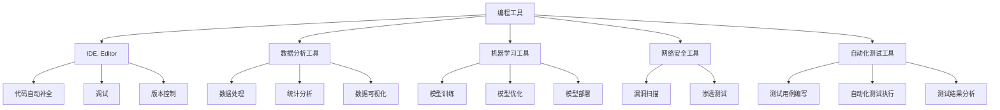
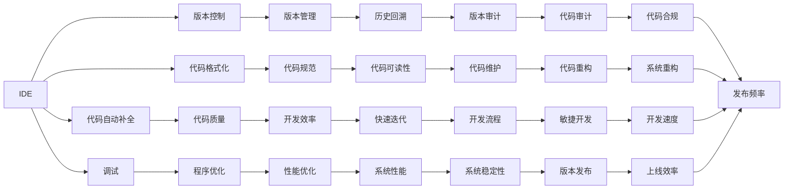
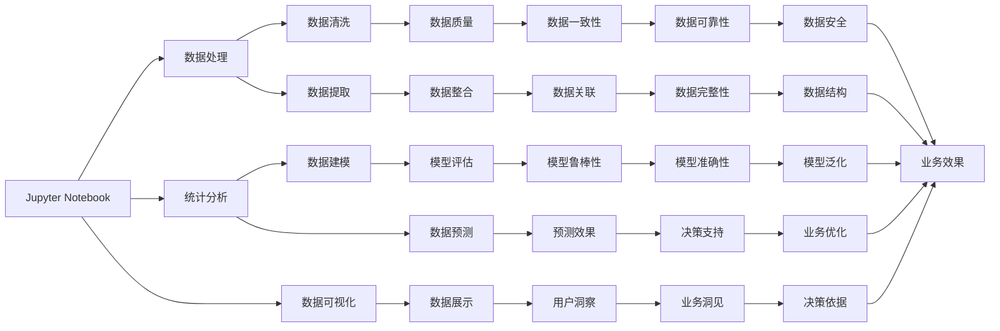
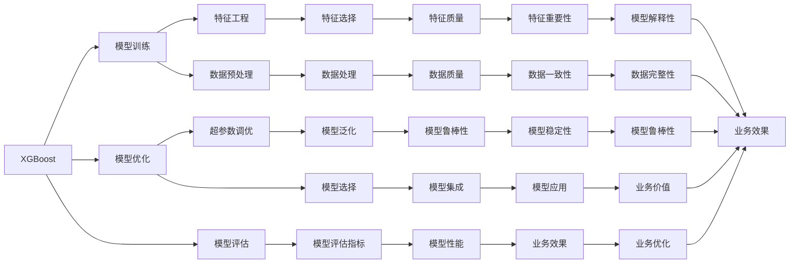
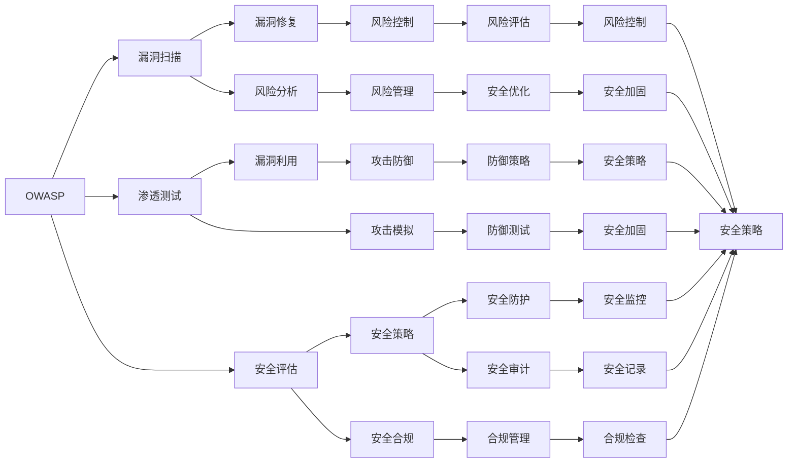
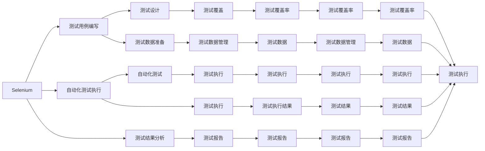
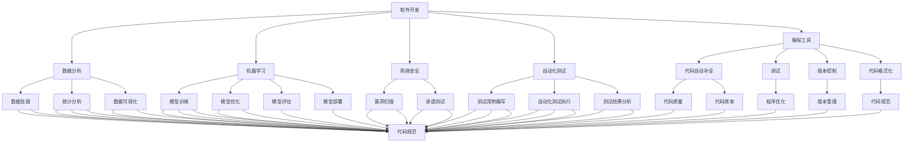

                 

# 工具使用机制在不同应用场景中的效果

> 关键词：
- 编程工具
- 数据分析工具
- 机器学习工具
- 网络安全工具
- 自动化测试工具

## 1. 背景介绍

### 1.1 问题由来
在现代软件开发和数据分析中，工具的使用已成为不可或缺的一部分。合理利用工具可以提高工作效率，降低错误率，加速项目进度。然而，不同工具在不同类型的应用场景中的效果存在较大差异。因此，研究工具使用机制在不同应用场景中的效果，对于提升技术实践和业务决策具有重要意义。

### 1.2 问题核心关键点
本研究聚焦于以下几个核心问题：
1. 编程工具在软件开发中的应用效果如何？
2. 数据分析工具在数据科学中的应用效果如何？
3. 机器学习工具在模型训练和部署中的应用效果如何？
4. 网络安全工具在保护信息安全中的应用效果如何？
5. 自动化测试工具在软件质量保证中的应用效果如何？

### 1.3 问题研究意义
研究工具使用机制在不同应用场景中的效果，对于提升技术实践和业务决策具有重要意义：

1. 提高效率：通过选择合适的工具，可以显著提高工作效率，缩短开发周期，减少人力成本。
2. 降低错误率：合理使用工具可以降低错误率，减少重复劳动，提升代码和数据质量。
3. 增强可维护性：工具使用可以提升代码和数据的可维护性，便于后续的维护和优化。
4. 促进创新：通过工具，可以更容易地尝试新技术和新方法，推动技术创新和业务发展。
5. 提供决策支持：通过数据分析工具和机器学习工具，可以获取更多业务洞见，辅助管理决策。

## 2. 核心概念与联系

### 2.1 核心概念概述

为更好地理解工具使用机制在不同应用场景中的效果，本节将介绍几个密切相关的核心概念：

- 编程工具(IDE, Editor)：用于编程开发的软件，包括集成开发环境(IDE)、文本编辑器等，提供代码自动补全、调试、版本控制等功能。
- 数据分析工具(Anaconda, Jupyter Notebook)：用于数据科学、数据分析、数据可视化的软件，提供数据处理、统计分析、数据可视化等功能。
- 机器学习工具(XGBoost, TensorFlow)：用于模型训练、模型优化、模型部署的软件，提供机器学习算法的实现和优化。
- 网络安全工具(OWASP, Nessus)：用于网络安全防护、漏洞扫描、渗透测试的软件，提供网络安全保障和防御能力。
- 自动化测试工具(Selenium, JUnit)：用于自动化测试的软件，提供测试用例编写、自动化测试执行、测试结果分析等功能。

这些核心概念之间的逻辑关系可以通过以下Mermaid流程图来展示：



这个流程图展示了各种工具的核心功能及其之间的逻辑关系：

1. 编程工具提供代码开发支持，包括IDE、文本编辑器等。
2. 数据分析工具用于数据科学和统计分析，提供数据处理、统计分析、数据可视化等功能。
3. 机器学习工具用于模型训练、优化和部署，提供机器学习算法的实现和优化。
4. 网络安全工具用于保障网络安全，提供漏洞扫描、渗透测试等功能。
5. 自动化测试工具用于软件质量保障，提供测试用例编写、自动化测试执行、测试结果分析等功能。

### 2.2 概念间的关系

这些核心概念之间存在着紧密的联系，形成了软件开发和数据分析的完整生态系统。下面我通过几个Mermaid流程图来展示这些概念之间的关系。

#### 2.2.1 编程工具的应用场景



这个流程图展示了IDE的核心功能及其在软件开发中的应用场景：

1. 代码自动补全、代码格式化、代码规范等功能提升代码质量。
2. 调试、性能优化、版本控制等功能提升开发效率和系统性能。
3. 版本管理、版本审计、代码审计等功能提升开发流程和系统稳定性。

#### 2.2.2 数据分析工具的应用场景



这个流程图展示了Jupyter Notebook的核心功能及其在数据科学中的应用场景：

1. 数据处理、数据清洗、数据整合等功能提升数据质量。
2. 统计分析、数据建模、数据预测等功能提升数据建模和预测效果。
3. 数据可视化、数据展示、数据洞察等功能提升用户洞察和业务洞见。

#### 2.2.3 机器学习工具的应用场景



这个流程图展示了XGBoost的核心功能及其在模型训练和部署中的应用场景：

1. 模型训练、特征工程、模型优化等功能提升模型质量。
2. 模型评估、超参数调优、模型选择等功能提升模型性能和业务效果。
3. 模型集成、模型解释性、模型鲁棒性等功能提升模型应用和业务优化。

#### 2.2.4 网络安全工具的应用场景



这个流程图展示了OWASP的核心功能及其在网络安全防护中的应用场景：

1. 漏洞扫描、渗透测试、安全评估等功能提升安全防护能力。
2. 漏洞修复、风险分析、风险管理等功能提升风险控制和优化。
3. 安全策略、安全合规、安全记录等功能提升安全审计和合规管理。

#### 2.2.5 自动化测试工具的应用场景



这个流程图展示了Selenium的核心功能及其在自动化测试中的应用场景：

1. 测试用例编写、测试设计、测试数据管理等功能提升测试设计和数据准备。
2. 自动化测试执行、测试执行结果、测试报告等功能提升自动化测试执行和报告分析。
3. 测试覆盖率、测试覆盖率、测试数据管理等功能提升测试覆盖率和数据管理。

### 2.3 核心概念的整体架构

最后，我们用一个综合的流程图来展示这些核心概念在大规模软件开发和数据分析中的整体架构：



这个综合流程图展示了软件开发和数据分析中各个工具的核心功能和应用场景，形成了完整的技术生态系统。

## 3. 核心算法原理 & 具体操作步骤

### 3.1 算法原理概述

编程工具、数据分析工具、机器学习工具、网络安全工具和自动化测试工具的原理和操作方法各不相同，但它们都有一个共同点，即通过提供特定的功能和接口，使用户能够更高效地完成任务。

### 3.2 算法步骤详解

以编程工具为例，其操作步骤通常包括以下几个关键步骤：

1. 安装工具：根据项目的需要，选择合适的编程工具进行安装。
2. 配置环境：设置工具的环境变量、编译器、构建工具等，使其能够与项目无缝集成。
3. 代码编写：使用工具提供的代码编辑器、IDE等功能，编写代码并进行代码自动补全、语法检查、调试等操作。
4. 版本控制：使用工具提供的版本控制功能，记录代码的历史版本，便于回溯和协作开发。
5. 代码格式化：使用工具提供的代码格式化功能，统一代码风格，提升代码可读性和可维护性。
6. 代码测试：使用工具提供的测试框架和自动化测试工具，编写测试用例，进行单元测试、集成测试等，确保代码质量。
7. 代码部署：使用工具提供的构建和打包工具，生成可执行文件或可部署的容器，进行代码部署和发布。

### 3.3 算法优缺点

编程工具、数据分析工具、机器学习工具、网络安全工具和自动化测试工具各具优势和不足，具体如下：

#### 编程工具

优点：
- 提供强大的代码编辑、调试、版本控制等功能，提升开发效率和代码质量。
- 支持多种编程语言和框架，适应多样化的开发需求。

缺点：
- 界面和配置复杂，需要一定的学习成本。
- 某些功能依赖外部插件或库，稳定性可能不如原生工具。

#### 数据分析工具

优点：
- 提供强大的数据处理、统计分析和可视化功能，提升数据分析的准确性和效率。
- 支持多种数据格式和文件类型，便于数据整合和处理。

缺点：
- 计算密集型操作可能耗时较长，需要高性能计算资源。
- 功能复杂，学习曲线较陡。

#### 机器学习工具

优点：
- 提供强大的模型训练、优化和部署功能，提升模型性能和业务效果。
- 支持多种机器学习算法和模型，便于快速迭代和实验。

缺点：
- 模型训练和优化过程耗时较长，需要高性能计算资源。
- 模型解释性较差，需要额外的技术支持。

#### 网络安全工具

优点：
- 提供强大的漏洞扫描、渗透测试和风险管理功能，提升系统安全性和防护能力。
- 支持多种网络协议和系统环境，适应多样化的安全需求。

缺点：
- 工具配置和操作复杂，需要专业知识和经验。
- 某些功能依赖系统权限，需要管理员授权。

#### 自动化测试工具

优点：
- 提供强大的自动化测试和测试报告功能，提升测试覆盖率和测试效率。
- 支持多种测试框架和测试用例编写，便于测试脚本的快速迭代和维护。

缺点：
- 工具配置和操作复杂，需要专业知识和经验。
- 测试用例编写和维护成本较高，需要团队协作。

### 3.4 算法应用领域

编程工具、数据分析工具、机器学习工具、网络安全工具和自动化测试工具在不同的应用领域中具有不同的效果和作用：

#### 编程工具

应用领域：软件开发、测试、部署、维护

工具推荐：VSCode、PyCharm、Eclipse

适用场景：中小型项目、敏捷开发、迭代开发

#### 数据分析工具

应用领域：科学研究、数据工程、大数据分析、商业智能

工具推荐：R、Python、Jupyter Notebook、Tableau

适用场景：数据量大、复杂度高的场景

#### 机器学习工具

应用领域：自然语言处理、图像识别、预测分析、推荐系统

工具推荐：TensorFlow、PyTorch、Keras、XGBoost

适用场景：数据密集型、算法复杂型场景

#### 网络安全工具

应用领域：网络安全防护、漏洞扫描、渗透测试、安全审计

工具推荐：Nessus、Metasploit、OWASP、Kali Linux

适用场景：高安全需求、复杂网络环境

#### 自动化测试工具

应用领域：软件测试、应用程序测试、Web测试、性能测试

工具推荐：Selenium、JUnit、TestNG、Robot Framework

适用场景：大型项目、自动化测试需求高的场景

## 4. 数学模型和公式 & 详细讲解 & 举例说明

### 4.1 数学模型构建

以数据分析工具为例，其数学模型可以构建如下：

设原始数据集为 $D=\{(x_i, y_i)\}_{i=1}^N$，其中 $x_i \in \mathbb{R}^d$ 为输入， $y_i \in \{0,1\}$ 为标签。

定义模型的损失函数为 $\ell(\theta) = \frac{1}{N}\sum_{i=1}^N \ell_i(\theta)$，其中 $\ell_i(\theta) = y_i\log p(y_i|x_i;\theta) + (1-y_i)\log (1-p(y_i|x_i;\theta))$， $p(y_i|x_i;\theta)$ 为模型在输入 $x_i$ 下预测标签 $y_i$ 的概率分布。

在训练过程中，使用梯度下降等优化算法最小化损失函数 $\ell(\theta)$。

### 4.2 公式推导过程

以线性回归为例，推导模型参数的计算公式：

设输入为 $x_i \in \mathbb{R}^d$，标签为 $y_i \in \mathbb{R}$。模型参数为 $\theta = (w, b)$，其中 $w \in \mathbb{R}^d$ 为权重， $b \in \mathbb{R}$ 为偏置。

损失函数为均方误差损失：$\ell(y_i,\hat{y}_i) = \frac{1}{2}(y_i - \hat{y}_i)^2$，其中 $\hat{y}_i = x_i \cdot w + b$。

定义损失函数为均方误差损失：$\ell(\theta) = \frac{1}{N}\sum_{i=1}^N \ell(y_i,\hat{y}_i)$。

对 $\theta$ 求导得：$\frac{\partial \ell(\theta)}{\partial \theta} = \frac{1}{N}\sum_{i=1}^N (x_i - \hat{y}_i)x_i$。

根据梯度下降算法，更新参数 $\theta$ 得：$\theta \leftarrow \theta - \eta \frac{\partial \ell(\theta)}{\partial \theta}$，其中 $\eta$ 为学习率。

### 4.3 案例分析与讲解

以机器学习工具为例，分析XGBoost工具的原理和使用方法：

XGBoost是一个基于决策树的集成学习算法，主要用于分类和回归问题。其核心思想是通过构建多棵决策树，并将它们组合成一个集成模型，以提升模型的准确性和鲁棒性。

XGBoost的算法步骤如下：

1. 数据预处理：对原始数据进行归一化、特征工程等预处理操作，以提升模型训练效果。
2. 构建决策树：使用梯度提升算法构建多棵决策树，每棵树都学习数据集的一个子集的近似表示。
3. 模型集成：将多棵决策树进行集成，得到最终的集成模型，提升模型的泛化能力。
4. 模型优化：使用正则化、剪枝等技术优化模型，避免过拟合和模型复杂度。

在实际使用中，XGBoost工具可以通过其提供的API进行调用，具体步骤如下：

1. 安装XGBoost工具：使用pip命令进行安装，如 `pip install xgboost`。
2. 数据准备：准备好训练集、验证集和测试集，并使用XGBoost提供的数据接口进行加载，如 `dtrain = xgb.DMatrix(train_data, label=train_label)`。
3. 模型训练：使用XGBoost提供的训练接口，设置模型参数，进行模型训练，如 `xgb.train(params, dtrain)`。
4. 模型评估：使用XGBoost提供的评估接口，评估模型在验证集和测试集上的表现，如 `predict(dtest)`。
5. 模型部署：将训练好的模型进行部署，如使用TensorFlow或PyTorch进行模型集成和部署。

## 5. 项目实践：代码实例和详细解释说明

### 5.1 开发环境搭建

以下是在Python中使用Scikit-learn和XGBoost进行数据分析和模型训练的开发环境搭建流程：

1. 安装Scikit-learn和XGBoost：使用pip命令进行安装，如 `pip install scikit-learn xgboost`。
2. 安装Python依赖：安装NumPy、Pandas等依赖库，如 `pip install numpy pandas`。
3. 设置Python路径：将Python安装路径添加到系统环境变量中，如 `export PYTHONPATH=/path/to/python:$PYTHONPATH`。
4. 配置Jupyter Notebook：在Jupyter Notebook中进行配置，如 `jupyter notebook --no-browser`。

完成上述步骤后，即可在Jupyter Notebook中进行数据分析和模型训练。

### 5.2 源代码详细实现

以下是一个使用Scikit-learn和XGBoost进行线性回归和决策树模型训练的代码实现：

```python
import numpy as np
import pandas as pd
from sklearn.model_selection import train_test_split
from sklearn.linear_model import LinearRegression
from xgboost import XGBRegressor

# 数据准备
data = pd.read_csv('data.csv')
X = data.drop('label', axis=1)
y = data['label']

# 数据划分
X_train, X_test, y_train, y_test = train_test_split(X, y, test_size=0.2, random_state=42)

# 线性回归模型训练
model_lr = LinearRegression()
model_lr.fit(X_train, y_train)

# 决策树模型训练
model_xgb = XGBRegressor()
model_xgb.fit(X_train, y_train)

# 模型评估
print('Linear Regression R2 Score:', model_lr.score(X_test, y_test))
print('XGBoost R2 Score:', model_xgb.score(X_test, y_test))
```

### 5.3 代码解读与分析

让我们再详细解读一下关键代码的实现细节：

**数据准备**

- `pd.read_csv('data.csv')`：使用Pandas库读取数据集，将其转换为DataFrame格式。
- `X = data.drop('label', axis=1)`：将数据集中的标签列分离出来，作为模型输入。
- `y = data['label']`：将数据集中的标签列作为模型输出。

**数据划分**

- `train_test_split(X, y, test_size=0.2, random_state=42)`：使用Scikit-learn库中的train_test_split函数对数据进行划分，将数据集划分为训练集和测试集，测试集占总数据集的20%。

**模型训练**

- `LinearRegression()`：使用Scikit-learn库中的线性回归模型。
- `XGBRegressor()`：使用XGBoost库中的决策树模型。
- `model_lr.fit(X_train, y_train)`：使用训练集训练线性回归模型。
- `model_xgb.fit(X_train, y_train)`：使用训练集训练决策树模型。

**模型评估**

- `model_lr.score(X_test, y_test)`：使用测试集评估线性回归模型的R2

