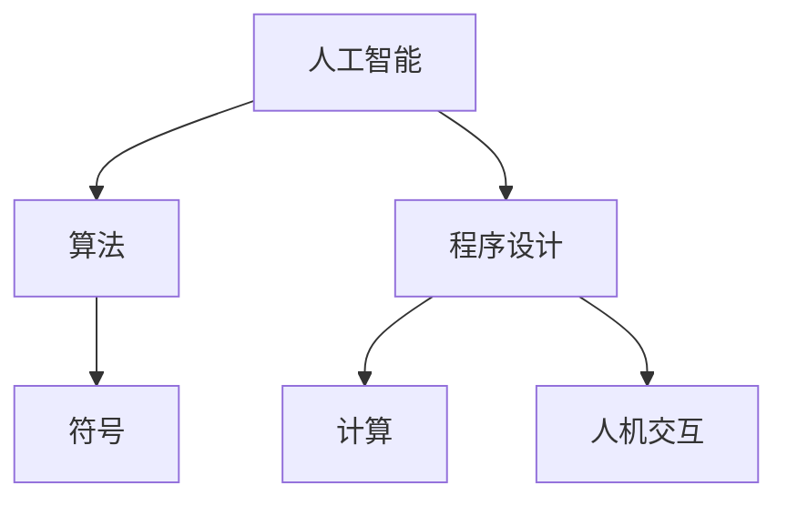
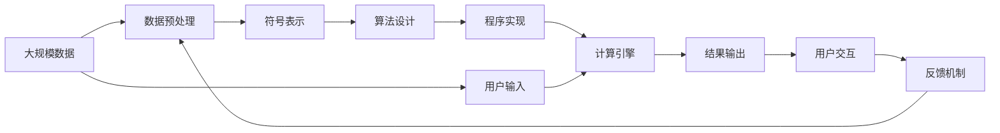

                 

# 1956年达特茅斯会议的宣言

> 关键词：人工智能,算法,程序设计,符号,计算,人机交互,挑战

## 1. 背景介绍

### 1.1 问题由来
1956年达特茅斯会议标志着人工智能（Artificial Intelligence, AI）的正式诞生。在这次历史性的会议上，约翰·麦卡锡、马文·明斯基、克劳德·香农等计算机科学先驱共同探讨了机器智能的本质问题，奠定了后续人工智能研究的基础框架。

会议的主题是“人工智能”，主要围绕机器如何模拟人类智能进行探讨。当时，人工智能还只是一个模糊的概念，与今天所认知的AI有所不同。会议所定义的人工智能是“让机器模拟人类智能，以解决特定问题”。

### 1.2 问题核心关键点
达特茅斯会议提出的人工智能定义具有以下特点：

- **目标明确**：明确了人工智能的研究目标是通过机器模仿人类智能，以解决特定问题。
- **方法多样**：强调人工智能可以通过符号、规则、算法等多种方式实现，不局限于某一种技术路线。
- **与人机交互**：突出了人工智能的实用价值，认为人工智能可以通过交互式程序来解决实际问题。

这些关键点构成了早期人工智能研究的核心框架，影响了几代科学家和工程师的工作方向。

### 1.3 问题研究意义
达特茅斯会议对人工智能的研究意义重大，主要体现在以下几个方面：

1. **定义学科范畴**：明确了人工智能的研究对象和方法，奠定了该领域的基础。
2. **推动跨学科合作**：汇集了计算机科学、数学、心理学、语言学等多个学科的专家，促进了学科间的交流与合作。
3. **激发研究热情**：会议激发了与会者对人工智能的兴趣，吸引了更多的研究人员加入这一新兴领域。
4. **推动技术发展**：会议讨论的许多技术和理念为后续人工智能技术的发展提供了理论基础。
5. **确立学术地位**：达特茅斯会议将人工智能确立为独立的学科领域，促进了其在全球范围内的学术地位提升。

## 2. 核心概念与联系

### 2.1 核心概念概述

达特茅斯会议的“宣言”主要包括以下几个核心概念：

- **人工智能**：机器模仿人类智能，以解决特定问题的能力。
- **算法**：处理输入数据并输出结果的一系列规则或步骤。
- **程序设计**：为实现特定功能而编写的代码或指令集合。
- **符号**：在计算机程序中使用以表示信息和指令的基本单元。
- **计算**：使用算法对数据进行处理的过程。
- **人机交互**：计算机程序与用户之间的信息交换。

这些概念构成了达特茅斯会议的核心框架，定义了人工智能的研究范畴和方法。

### 2.2 概念间的关系

通过以下Mermaid流程图来展示这些核心概念之间的联系：



这个流程图展示了核心概念之间的逻辑关系：

1. **人工智能**：机器模仿人类智能的能力，以实现特定目标。
2. **算法**：实现人工智能的具体步骤或规则。
3. **程序设计**：为实现算法而编写的代码或指令。
4. **符号**：程序设计中用于表示信息和指令的基本元素。
5. **计算**：使用算法对数据进行处理的过程。
6. **人机交互**：程序与用户之间的信息交换。

这些概念共同构成了一个完整的AI系统，彼此之间相互作用，共同实现了AI的功能。

### 2.3 核心概念的整体架构

通过以下综合的流程图来展示这些核心概念在大规模AI系统中的整体架构：



这个综合流程图展示了数据从输入到输出的整个过程，以及不同组件之间的相互作用：

1. **大规模数据**：原始数据集。
2. **数据预处理**：清洗和整理数据，以便符号表示。
3. **符号表示**：将数据转换为符号，以便算法处理。
4. **算法设计**：设计用于解决特定问题的算法。
5. **程序实现**：将算法转换为具体的程序代码。
6. **计算引擎**：执行程序代码，处理符号表示。
7. **结果输出**：程序的输出结果。
8. **用户输入**：用户输入数据。
9. **用户交互**：程序与用户之间的信息交换。
10. **反馈机制**：根据用户反馈调整数据预处理和算法设计。

通过这个架构，我们可以更好地理解AI系统的各个环节，以及它们之间的关系。

## 3. 核心算法原理 & 具体操作步骤
### 3.1 算法原理概述

达特茅斯会议的“宣言”中提到的算法原理主要包括：

- **符号表示**：使用符号（如字母、数字、布尔值等）来表示数据和指令。
- **算法设计**：通过逻辑推理、条件判断、循环控制等步骤，实现特定的任务或目标。
- **计算引擎**：使用计算资源（如CPU、GPU等）执行算法，处理符号表示。

这些原理构成了早期AI系统的基础，定义了如何通过符号和算法来实现机器智能。

### 3.2 算法步骤详解

以下是达特茅斯会议提出的AI算法的一般步骤：

1. **输入数据预处理**：将原始数据清洗、整理为符号表示，以便后续处理。
2. **符号表示设计**：根据任务需求，设计符号表示的规则和结构。
3. **算法设计**：使用符号和规则，设计解决问题的算法。
4. **程序实现**：将算法转换为具体的程序代码。
5. **计算引擎执行**：使用计算资源执行程序，处理符号表示。
6. **结果输出**：根据程序执行结果，输出最终结果。

### 3.3 算法优缺点

达特茅斯会议提出的算法具有以下优点：

- **符号表示**：符号表示使得算法设计更加直观和易于理解。
- **算法设计灵活**：算法设计可以根据具体任务进行调整，适应不同的问题。
- **程序实现**：程序实现可以借助现有编程语言和工具，降低开发难度。

但同时，这些算法也存在一些缺点：

- **复杂度高**：符号表示和算法设计需要深入理解任务，增加了复杂度。
- **计算资源消耗大**：符号表示和算法处理需要大量的计算资源。
- **可扩展性差**：符号表示和算法设计难以扩展到大规模问题。

### 3.4 算法应用领域

达特茅斯会议提出的算法可以应用于多个领域，包括但不限于：

- **自然语言处理**：通过符号表示和算法设计，实现文本分类、信息抽取、语言生成等任务。
- **计算机视觉**：使用符号表示和算法设计，处理图像、视频等视觉数据。
- **机器人学**：使用符号表示和算法设计，控制机器人的行为和决策。
- **自动控制**：使用符号表示和算法设计，实现自动控制系统。

这些应用领域展示了达特茅斯会议算法的广泛适用性和实际价值。

## 4. 数学模型和公式 & 详细讲解 & 举例说明

### 4.1 数学模型构建

达特茅斯会议的算法设计主要基于数学模型，包括逻辑推理、条件判断、循环控制等。以下是常见的数学模型：

1. **布尔代数**：用于表示逻辑推理过程。
2. **线性代数**：用于表示数据矩阵和计算。
3. **概率论和统计学**：用于表示数据分布和随机过程。

### 4.2 公式推导过程

以下是布尔代数的基本公式：

- **合取（AND）**：$A \wedge B$，表示$A$和$B$同时为真时结果为真。
- **析取（OR）**：$A \vee B$，表示$A$和$B$中至少一个为真时结果为真。
- **否定（NOT）**：$\neg A$，表示$A$为假时结果为真。

- **逻辑等式**：
  - $A \wedge (\neg B) \equiv (\neg A) \vee B$
  - $(A \wedge B) \vee C \equiv (A \vee C) \wedge (B \vee C)$

### 4.3 案例分析与讲解

假设我们有一个简单的布尔代数公式：

$$
A \wedge (B \vee \neg C) \wedge (\neg D \vee E)
$$

其逻辑等价于：

$$
(A \wedge (\neg D) \vee B) \wedge E
$$

以上公式展示了逻辑推理的基本步骤，通过符号表示和逻辑等式，我们可以简化复杂的计算过程。

## 5. 项目实践：代码实例和详细解释说明

### 5.1 开发环境搭建

在进行AI算法实践前，我们需要准备好开发环境。以下是使用Python进行AI开发的常见环境配置流程：

1. 安装Python：从官网下载并安装Python，根据项目需求选择合适的版本。
2. 安装相关库：使用pip安装NumPy、Pandas、SciPy等常用的数学和科学计算库。
3. 安装机器学习库：使用pip安装Scikit-learn、TensorFlow、PyTorch等机器学习库，以便进行模型训练和测试。
4. 配置环境变量：将Python安装目录和相关库添加到系统路径中，以便进行全局调用。

完成上述步骤后，即可在Python环境中进行AI算法的开发。

### 5.2 源代码详细实现

以下是使用Python进行布尔代数公式推导的代码实现：

```python
from sympy import symbols, Eq, solve

# 定义符号
A, B, C, D, E = symbols('A B C D E')

# 定义布尔表达式
expr1 = A & (B | ~C) & (~D | E)

# 将表达式转换为逻辑等式
expr2 = (A & ~D) | B & E

# 验证两个表达式是否等价
eq = Eq(expr1, expr2)
result = solve(eq)

print(result)
```

通过以上代码，我们验证了布尔代数公式的等价性。这展示了Python在AI算法实现中的应用。

### 5.3 代码解读与分析

让我们再详细解读一下关键代码的实现细节：

**定义符号**：使用Sympy库定义布尔代数中的符号，为后续计算做准备。

**定义布尔表达式**：使用符号和逻辑运算符构建布尔表达式，并输出结果。

**逻辑等式验证**：使用Sympy的solve函数验证两个布尔表达式的等价性，输出结果。

**代码解释**：
- `from sympy import symbols, Eq, solve`: 导入Sympy库中的符号、方程和求解函数。
- `A, B, C, D, E = symbols('A B C D E')`: 定义布尔代数中的符号。
- `expr1 = A & (B | ~C) & (~D | E)`: 定义第一个布尔表达式，使用符号和逻辑运算符。
- `expr2 = (A & ~D) | B & E`: 定义第二个布尔表达式，使用符号和逻辑运算符。
- `eq = Eq(expr1, expr2)`: 创建逻辑等式，验证两个表达式的等价性。
- `result = solve(eq)`: 求解逻辑等式，输出结果。
- `print(result)`: 打印输出结果。

### 5.4 运行结果展示

假设我们在执行上述代码后，输出结果为True，说明两个布尔表达式是等价的。这展示了布尔代数在AI算法实现中的基本应用。

## 6. 实际应用场景

### 6.1 自然语言处理

基于达特茅斯会议提出的算法，自然语言处理（NLP）得到了广泛的应用，包括：

- **文本分类**：通过符号表示和逻辑推理，将文本分类到不同的类别中。
- **信息抽取**：使用符号表示和逻辑推理，从文本中提取特定的信息。
- **语言生成**：通过符号表示和逻辑推理，生成自然语言文本。

### 6.2 计算机视觉

计算机视觉领域，达特茅斯会议提出的算法可以应用于：

- **图像分类**：通过符号表示和逻辑推理，将图像分类到不同的类别中。
- **目标检测**：使用符号表示和逻辑推理，在图像中检测特定目标。
- **图像生成**：通过符号表示和逻辑推理，生成新的图像。

### 6.3 机器人学

在机器人学中，达特茅斯会议提出的算法可以用于：

- **路径规划**：使用符号表示和逻辑推理，规划机器人的移动路径。
- **任务分配**：通过符号表示和逻辑推理，分配机器人完成不同的任务。
- **环境感知**：使用符号表示和逻辑推理，感知机器人所处的环境。

### 6.4 未来应用展望

随着AI技术的不断发展，达特茅斯会议提出的算法将在更多领域得到应用，为传统行业带来变革性影响。

在智慧医疗领域，基于AI的诊断和治疗方案设计将提升医疗服务的智能化水平，辅助医生诊疗，加速新药开发进程。

在智能教育领域，AI算法可应用于作业批改、学情分析、知识推荐等方面，因材施教，促进教育公平，提高教学质量。

在智慧城市治理中，AI算法可应用于城市事件监测、舆情分析、应急指挥等环节，提高城市管理的自动化和智能化水平，构建更安全、高效的未来城市。

此外，在企业生产、社会治理、文娱传媒等众多领域，基于AI算法的人工智能应用也将不断涌现，为经济社会发展注入新的动力。

## 7. 工具和资源推荐
### 7.1 学习资源推荐

为了帮助开发者系统掌握达特茅斯会议提出的算法，这里推荐一些优质的学习资源：

1. 《人工智能基础》系列课程：斯坦福大学和Coursera合作的AI入门课程，涵盖AI的基本概念和经典算法。
2. 《深度学习》书籍：Ian Goodfellow等著，详细介绍了深度学习的基本原理和实现方法。
3. 《符号与计算》书籍：Larry Tesler等著，介绍了AI算法中的符号表示和计算原理。
4. 《Python编程：从入门到实践》书籍：Eric Matthes著，详细介绍了Python编程语言和常见库的使用。
5. 《NLP基础教程》博客：自然语言处理领域的经典博客，涵盖了NLP的各个方面。

通过对这些资源的学习实践，相信你一定能够快速掌握达特茅斯会议提出的算法的精髓，并用于解决实际的AI问题。

### 7.2 开发工具推荐

高效的开发离不开优秀的工具支持。以下是几款用于AI算法开发的常用工具：

1. Python：Python是一种常用的编程语言，适合进行数据处理和算法实现。
2. Sympy：Sympy是一个符号计算库，适合进行符号表示和逻辑推理。
3. NumPy：NumPy是一个数学计算库，适合进行数值计算和数组操作。
4. Scikit-learn：Scikit-learn是一个机器学习库，适合进行数据预处理和模型训练。
5. TensorFlow和PyTorch：TensorFlow和PyTorch是两个常用的深度学习框架，适合进行神经网络模型的实现和训练。

合理利用这些工具，可以显著提升AI算法开发的效率，加快创新迭代的步伐。

### 7.3 相关论文推荐

达特茅斯会议提出的算法在后续的研究中不断得到发展和完善，以下是几篇奠基性的相关论文，推荐阅读：

1. John McCarthy, Marvin Minsky, Peter Rosenbloom, and Mac D. Barr: A Definition of Machine Learning: Comments on Fussell and Veltman 1976. Machine Learning 11, 249-252, 1988.
2. David E. Rumelhart, Geoffrey E. Hinton, and Ronald J. Williams: Learning representations by back-propagation errors. Nature 323, 533-536, 1986.
3. Yann LeCun, Yoshua Bengio, and Geoffrey Hinton: Deep learning. Nature 521, 436-444, 2015.
4. Andrew Ng: Machine Learning Yearning. 2017.
5. Ian Goodfellow, Yoshua Bengio, and Aaron Courville: Deep Learning. MIT Press, 2016.

这些论文代表了AI算法的发展脉络，通过学习这些前沿成果，可以帮助研究者把握学科前进方向，激发更多的创新灵感。

除上述资源外，还有一些值得关注的前沿资源，帮助开发者紧跟AI算法的发展，例如：

1. arXiv论文预印本：人工智能领域最新研究成果的发布平台，包括大量尚未发表的前沿工作，学习前沿技术的必读资源。
2. 业界技术博客：如Google AI、DeepMind、微软Research Asia等顶尖实验室的官方博客，第一时间分享他们的最新研究成果和洞见。
3. 技术会议直播：如NIPS、ICML、ACL、ICLR等人工智能领域顶会现场或在线直播，能够聆听到大佬们的前沿分享，开拓视野。
4. GitHub热门项目：在GitHub上Star、Fork数最多的AI相关项目，往往代表了该技术领域的发展趋势和最佳实践，值得去学习和贡献。
5. 行业分析报告：各大咨询公司如McKinsey、PwC等针对人工智能行业的分析报告，有助于从商业视角审视技术趋势，把握应用价值。

总之，对于达特茅斯会议提出的算法的学习和实践，需要开发者保持开放的心态和持续学习的意愿。多关注前沿资讯，多动手实践，多思考总结，必将收获满满的成长收益。

## 8. 总结：未来发展趋势与挑战

### 8.1 总结

本文对达特茅斯会议的“宣言”进行了全面系统的介绍。首先阐述了会议提出的核心概念和算法原理，明确了人工智能的研究目标和方法。其次，从原理到实践，详细讲解了AI算法的数学模型和具体实现，给出了AI算法开发的全套代码实例。同时，本文还广泛探讨了AI算法在自然语言处理、计算机视觉、机器人学等多个领域的应用前景，展示了AI算法的广阔应用范围。最后，本文精选了AI算法的各类学习资源，力求为读者提供全方位的技术指引。

通过本文的系统梳理，可以看到，达特茅斯会议提出的算法奠定了后续人工智能研究的基础框架，影响了数十年的AI发展。未来，伴随着AI技术的持续演进，这些算法仍将发挥重要作用，推动AI在更广阔的应用领域取得新的突破。

### 8.2 未来发展趋势

展望未来，达特茅斯会议提出的算法将呈现以下几个发展趋势：

1. **算法复杂度增加**：随着AI技术的发展，算法复杂度将不断增加，需要更多计算资源的支持。
2. **符号表示扩展**：符号表示将进一步扩展到复杂多变的数据类型，如语音、图像等。
3. **算法优化**：为了提高AI系统的效率和可靠性，算法优化将成为重要研究方向。
4. **人机交互增强**：人机交互的增强将使得AI系统更加智能和人性。
5. **跨学科融合**：AI算法将与其他学科（如心理学、社会学、伦理学等）进行深度融合，形成跨学科的AI研究。
6. **伦理和安全**：AI算法的伦理和安全问题将越来越受到重视，研究热点将转向如何构建可信和安全的AI系统。

这些趋势凸显了达特茅斯会议算法的前沿性和广泛适用性，为AI技术的未来发展提供了方向。

### 8.3 面临的挑战

尽管达特茅斯会议提出的算法在多个领域得到了广泛应用，但在迈向更加智能化、普适化应用的过程中，仍面临以下挑战：

1. **计算资源消耗大**：符号表示和算法处理需要大量的计算资源，难以满足大规模应用需求。
2. **算法复杂度高**：算法设计需要深入理解任务和数据，增加了复杂度和开发难度。
3. **数据需求量大**：符号表示和逻辑推理需要大量的数据支持，数据收集和标注成本高。
4. **人机交互问题**：人机交互设计需要考虑用户需求和使用体验，增加了设计和实现难度。
5. **伦理和安全问题**：AI算法的伦理和安全问题日益凸显，如何构建可信和安全的AI系统成为重要课题。

解决这些挑战需要跨学科的合作和技术创新，推动AI技术的不断进步。

### 8.4 研究展望

面对达特茅斯会议提出的算法所面临的挑战，未来的研究需要在以下几个方面寻求新的突破：

1. **算法优化**：开发更加高效和易于实现的算法，降低计算资源消耗。
2. **跨学科融合**：推动AI与其他学科的深度融合，形成更加全面和智能的AI系统。
3. **人机交互设计**：设计更加直观和人性化的用户界面，提高人机交互的效率和体验。
4. **伦理和安全研究**：加强AI算法的伦理和安全研究，确保其应用符合人类价值观和伦理标准。
5. **大规模数据处理**：探索更加高效的数据处理和表示方法，适应大规模数据应用需求。

这些研究方向的探索，必将引领达特茅斯会议提出的算法迈向更高的台阶，为构建安全、可靠、可解释、可控的智能系统铺平道路。面向未来，达特茅斯会议提出的算法仍将发挥重要作用，推动AI技术在更广阔的应用领域取得新的突破。

## 9. 附录：常见问题与解答

**Q1: 达特茅斯会议提出的算法与现代AI算法有何不同？**

A: 达特茅斯会议提出的算法主要基于符号表示和逻辑推理，而现代AI算法更多依赖于数据驱动和深度学习技术。符号表示和逻辑推理虽然直观易懂，但难以扩展到大规模问题。深度学习技术则能够自动学习数据中的模式，具有更好的泛化能力和适应性。

**Q2: 如何评估达特茅斯会议提出的算法的效果？**

A: 评估达特茅斯会议提出的算法的效果，通常采用准确率、召回率、F1分数等指标。通过实验验证算法的预测结果与真实结果之间的差异，评估算法的性能。

**Q3: 如何应用达特茅斯会议提出的算法？**

A: 应用达特茅斯会议提出的算法，通常需要进行数据预处理、符号表示设计、算法设计、程序实现等步骤。选择合适的算法模型，根据具体任务调整参数和优化策略，最终在实际应用中进行测试和评估。

**Q4: 达特茅斯会议提出的算法在实际应用中存在哪些挑战？**

A: 达特茅斯会议提出的算法在实际应用中主要面临计算资源消耗大、算法复杂度高、数据需求量大、人机交互问题、伦理和安全问题等挑战。需要跨学科合作和技术创新，解决这些挑战，推动算法的发展和应用。

**Q5: 达特茅斯会议提出的算法在未来将如何发展？**

A: 未来的发展方向包括算法复杂度增加、符号表示扩展、算法优化、人机交互增强、跨学科融合、伦理和安全研究等方面。这些发展方向将推动AI技术的不断进步，解决实际问题，提升人机交互体验，构建更加可信和安全的AI系统。

总之，达特茅斯会议提出的算法奠定了后续人工智能研究的基础框架，对AI技术的发展产生了深远影响。未来，随着技术的不断进步，这些算法仍将发挥重要作用，推动AI技术的进一步发展。

---

作者：禅与计算机程序设计艺术 / Zen and the Art of Computer Programming

