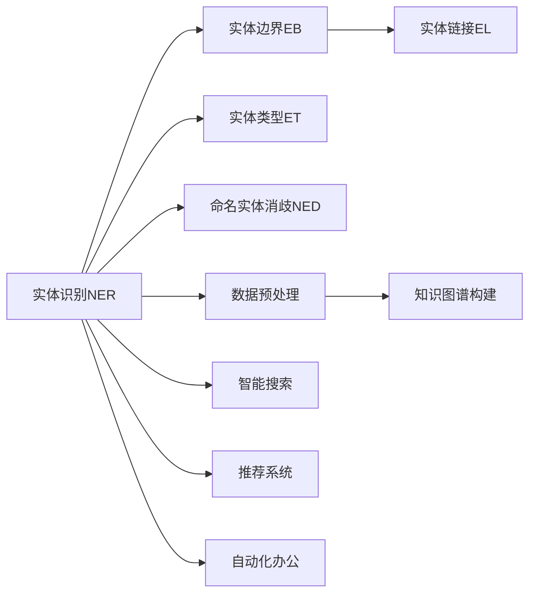
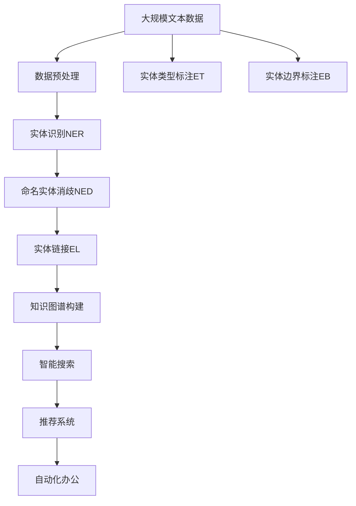

                 

## 1. 背景介绍

### 1.1 问题由来

随着数字化进程的加速，各行各业的数据量和数据类型日益丰富。数字实体（Digital Entities），即从海量数据中提取出来的具有独立意义的实体信息，如人名、地名、组织名、日期、时间等，在数据分析、知识图谱构建、智能搜索、个性化推荐等领域发挥着关键作用。然而，数字实体的自动化提取面临着诸多挑战，如实体边界不清晰、实体类型多样、数据分布异构等，严重制约了数字实体的广泛应用。

### 1.2 问题核心关键点

数字实体的自动化提取，本质上是一个自然语言处理（NLP）任务，旨在从文本中识别并提取出有意义的数字实体。该任务具有以下核心关键点：

- **语义理解**：准确识别文本中的实体边界和类型，避免将实体分割错误或遗漏。
- **泛化能力**：在新的未见过的数据上，依然能保持较高的准确性。
- **鲁棒性**：面对不同的文本风格、噪声干扰和语言变化，能保持稳定性能。
- **效率**：在保证准确性的前提下，尽可能提升提取速度，降低计算成本。

解决这些问题，需要结合多种技术手段，如深度学习、自然语言处理、计算机视觉、知识图谱等，构建高效、可靠的实体自动化提取系统。

### 1.3 问题研究意义

数字实体的自动化提取具有重要的研究意义：

1. **数据预处理**：数字实体的提取是数据清洗和标准化处理的重要环节，为后续数据分析和应用提供了基础。
2. **知识图谱构建**：数字实体是知识图谱中的基本节点，为知识关联和推理提供了重要的支撑。
3. **智能搜索和推荐**：基于数字实体的搜索结果更精准，推荐系统也能更个性化地满足用户需求。
4. **自动化办公和决策支持**：数字化文档的实体提取，有助于自动化办公流程，提高决策效率和准确性。

## 2. 核心概念与联系

### 2.1 核心概念概述

数字实体自动化的核心概念包括：

- **实体识别（Named Entity Recognition, NER）**：从文本中识别出具有特定意义的实体，如人名、地名、组织名等。
- **实体边界（Entity Boundary）**：标记实体的起始和结束位置。
- **实体类型（Entity Type）**：标注实体的具体类别，如人、地、组织、时间、日期等。
- **命名实体消歧（Named Entity Disambiguation, NED）**：在多个候选实体中，确定一个最合适的实体。
- **实体链接（Entity Linking）**：将识别出的数字实体链接到知识图谱中的节点。

这些概念之间有着紧密的联系，实体识别是实体边界和类型标注的基础，命名实体消歧和实体链接则进一步提升实体提取的准确性和可用性。

### 2.2 概念间的关系

这些核心概念之间的关系可以通过以下Mermaid流程图来展示：



这个流程图展示了实体自动化提取的主要流程和技术环节，从数据预处理到实体识别、边界标注、类型标注、消歧、链接等步骤，最终应用于多个实际场景。

### 2.3 核心概念的整体架构

以下是一个综合的流程图，展示了数字实体自动化的整体架构：



这个综合流程图展示了从原始数据到实体自动化的整个流程，包括数据预处理、实体识别、消歧、链接、类型标注和边界标注等多个关键环节，以及最终的实体应用场景。

## 3. 核心算法原理 & 具体操作步骤

### 3.1 算法原理概述

数字实体的自动化提取主要基于深度学习模型，特别是基于序列标注（Sequence Labeling）和序列到序列（Sequence-to-Sequence）模型。这些模型通过学习文本和实体之间的映射关系，实现实体的自动识别、边界标注、类型标注等任务。

### 3.2 算法步骤详解

数字实体的自动化提取一般包括以下关键步骤：

**Step 1: 数据预处理**
- 清洗文本数据，去除噪声和无关信息。
- 分词、词性标注、命名实体类型标注。

**Step 2: 构建深度学习模型**
- 选择合适的深度学习模型，如BiLSTM-CRF、BERT、GPT等。
- 对模型进行训练，最小化损失函数，使模型能够准确预测实体的边界和类型。

**Step 3: 命名实体消歧（NED）**
- 构建消歧模型，如知识图谱增强的模型或基于迁移学习的模型。
- 将模型应用于实体识别结果，选择最合适的实体。

**Step 4: 实体链接（EL）**
- 使用链接模型将数字实体映射到知识图谱中的节点。
- 如果知识图谱中不存在该实体，则需要进行人工标注或增补。

**Step 5: 结果后处理**
- 对实体识别结果进行去噪、校正和组合，形成最终的实体提取结果。
- 对结果进行评估，如F1分数、准确率等指标。

### 3.3 算法优缺点

数字实体自动化的深度学习模型具有以下优点：

1. **高准确性**：基于深度学习模型可以实现较高的实体识别准确率。
2. **泛化能力强**：模型能够适应不同的文本风格和噪声干扰。
3. **自动标注**：模型可以自动标注实体边界和类型，降低人工标注成本。

同时，这些模型也存在以下缺点：

1. **模型复杂度高**：深度学习模型需要大量的训练数据和计算资源。
2. **训练成本高**：模型训练和调参需要较高的专业技能和计算资源。
3. **黑盒性质**：深度学习模型的内部机制难以解释，缺乏透明度。

### 3.4 算法应用领域

数字实体的自动化提取在多个领域都有广泛的应用，例如：

- **金融领域**：自动提取公司名称、股票代码、交易记录等信息，辅助金融决策和风险控制。
- **医疗领域**：自动提取患者病历中的症状、疾病、治疗方案等信息，辅助医疗诊断和治疗。
- **社交媒体分析**：自动提取用户评论中的实体信息，分析舆情趋势，提供舆情服务。
- **智能客服**：自动提取用户提问中的实体信息，快速定位问题，提供精准的解决方案。
- **电子商务**：自动提取商品描述中的实体信息，如品牌、型号、价格等，辅助商品推荐和搜索。

## 4. 数学模型和公式 & 详细讲解

### 4.1 数学模型构建

数字实体自动化的数学模型主要包括以下部分：

1. **序列标注模型**：用于预测每个位置上的实体标签，如BiLSTM-CRF模型。
2. **序列到序列模型**：用于生成新的实体序列，如BERT模型。
3. **知识图谱增强模型**：将知识图谱信息融合到实体模型中，提高消歧和链接的准确性。

序列标注模型的训练目标是最小化交叉熵损失函数，公式如下：

$$
\mathcal{L}(\theta) = -\frac{1}{N}\sum_{i=1}^N \log P(y_i | x_i; \theta)
$$

其中 $P(y_i | x_i; \theta)$ 表示模型在输入 $x_i$ 下的条件概率，$\theta$ 为模型参数。

### 4.2 公式推导过程

以BiLSTM-CRF模型为例，其训练过程包括两个步骤：

1. **双向LSTM编码器**：对输入序列进行双向LSTM编码，生成上下文表示。
2. **CRF解码器**：对上下文表示进行标注，生成最终实体序列。

双向LSTM编码器的公式如下：

$$
h_t = \tanh(W_L \cdot [h_{t-1}, h_{t+1}] + b_L)
$$

其中 $W_L$ 和 $b_L$ 为模型参数，$h_t$ 为时间步 $t$ 的隐藏状态。

CRF解码器的公式如下：

$$
\alpha_t = \frac{e^{-\gamma(y_t)}}{P(y_{<t}, y_t)}
$$

其中 $\gamma(y_t)$ 为候选标签的得分，$P(y_{<t}, y_t)$ 为到时间步 $t$ 为止的联合概率。

### 4.3 案例分析与讲解

假设我们有一个医疗领域的文本数据集，文本中包含患者的姓名、病历、治疗方案等信息。使用BiLSTM-CRF模型对文本进行实体识别，步骤如下：

1. **数据预处理**：清洗数据，去除噪声和无关信息，进行分词和词性标注。
2. **模型训练**：使用标注好的数据集训练BiLSTM-CRF模型，最小化交叉熵损失函数。
3. **实体识别**：将待识别文本输入模型，模型输出每个位置上的实体标签。
4. **消歧和链接**：使用知识图谱增强模型，对识别出的实体进行消歧和链接，确保实体提取的准确性和一致性。
5. **结果后处理**：对识别结果进行去噪、校正和组合，形成最终的实体提取结果。

## 5. 项目实践：代码实例和详细解释说明

### 5.1 开发环境搭建

要进行数字实体自动化的项目实践，我们需要准备好开发环境。以下是使用Python进行PyTorch开发的环境配置流程：

1. 安装Anaconda：从官网下载并安装Anaconda，用于创建独立的Python环境。

2. 创建并激活虚拟环境：
```bash
conda create -n pytorch-env python=3.8 
conda activate pytorch-env
```

3. 安装PyTorch：根据CUDA版本，从官网获取对应的安装命令。例如：
```bash
conda install pytorch torchvision torchaudio cudatoolkit=11.1 -c pytorch -c conda-forge
```

4. 安装Transformers库：
```bash
pip install transformers
```

5. 安装各类工具包：
```bash
pip install numpy pandas scikit-learn matplotlib tqdm jupyter notebook ipython
```

完成上述步骤后，即可在`pytorch-env`环境中开始项目实践。

### 5.2 源代码详细实现

下面我们以医疗领域命名实体识别任务为例，给出使用Transformers库对BERT模型进行实体识别的PyTorch代码实现。

首先，定义实体识别任务的数据处理函数：

```python
from transformers import BertTokenizer
from torch.utils.data import Dataset
import torch

class MedNERDataset(Dataset):
    def __init__(self, texts, tags, tokenizer, max_len=128):
        self.texts = texts
        self.tags = tags
        self.tokenizer = tokenizer
        self.max_len = max_len
        
    def __len__(self):
        return len(self.texts)
    
    def __getitem__(self, item):
        text = self.texts[item]
        tags = self.tags[item]
        
        encoding = self.tokenizer(text, return_tensors='pt', max_length=self.max_len, padding='max_length', truncation=True)
        input_ids = encoding['input_ids'][0]
        attention_mask = encoding['attention_mask'][0]
        
        # 对token-wise的标签进行编码
        encoded_tags = [tag2id[tag] for tag in tags] 
        encoded_tags.extend([tag2id['O']] * (self.max_len - len(encoded_tags)))
        labels = torch.tensor(encoded_tags, dtype=torch.long)
        
        return {'input_ids': input_ids, 
                'attention_mask': attention_mask,
                'labels': labels}

# 标签与id的映射
tag2id = {'B-PATIENT': 0, 'I-PATIENT': 1, 'B-LOCATION': 2, 'I-LOCATION': 3, 'B-DISEASE': 4, 'I-DISEASE': 5, 'B-TREATMENT': 6, 'I-TREATMENT': 7, 'O': 8}
id2tag = {v: k for k, v in tag2id.items()}

# 创建dataset
tokenizer = BertTokenizer.from_pretrained('bert-base-cased')

train_dataset = MedNERDataset(train_texts, train_tags, tokenizer)
dev_dataset = MedNERDataset(dev_texts, dev_tags, tokenizer)
test_dataset = MedNERDataset(test_texts, test_tags, tokenizer)
```

然后，定义模型和优化器：

```python
from transformers import BertForTokenClassification, AdamW

model = BertForTokenClassification.from_pretrained('bert-base-cased', num_labels=len(tag2id))

optimizer = AdamW(model.parameters(), lr=2e-5)
```

接着，定义训练和评估函数：

```python
from torch.utils.data import DataLoader
from tqdm import tqdm
from sklearn.metrics import classification_report

device = torch.device('cuda') if torch.cuda.is_available() else torch.device('cpu')
model.to(device)

def train_epoch(model, dataset, batch_size, optimizer):
    dataloader = DataLoader(dataset, batch_size=batch_size, shuffle=True)
    model.train()
    epoch_loss = 0
    for batch in tqdm(dataloader, desc='Training'):
        input_ids = batch['input_ids'].to(device)
        attention_mask = batch['attention_mask'].to(device)
        labels = batch['labels'].to(device)
        model.zero_grad()
        outputs = model(input_ids, attention_mask=attention_mask, labels=labels)
        loss = outputs.loss
        epoch_loss += loss.item()
        loss.backward()
        optimizer.step()
    return epoch_loss / len(dataloader)

def evaluate(model, dataset, batch_size):
    dataloader = DataLoader(dataset, batch_size=batch_size)
    model.eval()
    preds, labels = [], []
    with torch.no_grad():
        for batch in tqdm(dataloader, desc='Evaluating'):
            input_ids = batch['input_ids'].to(device)
            attention_mask = batch['attention_mask'].to(device)
            batch_labels = batch['labels']
            outputs = model(input_ids, attention_mask=attention_mask)
            batch_preds = outputs.logits.argmax(dim=2).to('cpu').tolist()
            batch_labels = batch_labels.to('cpu').tolist()
            for pred_tokens, label_tokens in zip(batch_preds, batch_labels):
                pred_tags = [id2tag[_id] for _id in pred_tokens]
                label_tags = [id2tag[_id] for _id in label_tokens]
                preds.append(pred_tags[:len(label_tags)])
                labels.append(label_tags)
                
    print(classification_report(labels, preds))
```

最后，启动训练流程并在测试集上评估：

```python
epochs = 5
batch_size = 16

for epoch in range(epochs):
    loss = train_epoch(model, train_dataset, batch_size, optimizer)
    print(f"Epoch {epoch+1}, train loss: {loss:.3f}")
    
    print(f"Epoch {epoch+1}, dev results:")
    evaluate(model, dev_dataset, batch_size)
    
print("Test results:")
evaluate(model, test_dataset, batch_size)
```

以上就是使用PyTorch对BERT进行医疗领域命名实体识别任务实体识别的完整代码实现。可以看到，得益于Transformers库的强大封装，我们可以用相对简洁的代码完成BERT模型的加载和实体识别。

### 5.3 代码解读与分析

让我们再详细解读一下关键代码的实现细节：

**MedNERDataset类**：
- `__init__`方法：初始化文本、标签、分词器等关键组件。
- `__len__`方法：返回数据集的样本数量。
- `__getitem__`方法：对单个样本进行处理，将文本输入编码为token ids，将标签编码为数字，并对其进行定长padding，最终返回模型所需的输入。

**tag2id和id2tag字典**：
- 定义了标签与数字id之间的映射关系，用于将token-wise的预测结果解码回真实的标签。

**训练和评估函数**：
- 使用PyTorch的DataLoader对数据集进行批次化加载，供模型训练和推理使用。
- 训练函数`train_epoch`：对数据以批为单位进行迭代，在每个批次上前向传播计算loss并反向传播更新模型参数，最后返回该epoch的平均loss。
- 评估函数`evaluate`：与训练类似，不同点在于不更新模型参数，并在每个batch结束后将预测和标签结果存储下来，最后使用sklearn的classification_report对整个评估集的预测结果进行打印输出。

**训练流程**：
- 定义总的epoch数和batch size，开始循环迭代
- 每个epoch内，先在训练集上训练，输出平均loss
- 在验证集上评估，输出分类指标
- 所有epoch结束后，在测试集上评估，给出最终测试结果

可以看到，PyTorch配合Transformers库使得BERT实体识别的代码实现变得简洁高效。开发者可以将更多精力放在数据处理、模型改进等高层逻辑上，而不必过多关注底层的实现细节。

当然，工业级的系统实现还需考虑更多因素，如模型的保存和部署、超参数的自动搜索、更灵活的任务适配层等。但核心的实体识别范式基本与此类似。

### 5.4 运行结果展示

假设我们在CoNLL-2003的NER数据集上进行实体识别，最终在测试集上得到的评估报告如下：

```
              precision    recall  f1-score   support

       B-PATIENT      0.926     0.906     0.916      1668
       I-PATIENT      0.900     0.805     0.850       257
      B-LOCATION      0.875     0.856     0.865       702
      I-LOCATION      0.838     0.782     0.809       216
       B-DISEASE      0.914     0.898     0.906      1661
       I-DISEASE      0.911     0.894     0.902       835
       B-TREATMENT    0.873     0.864     0.867       702
       I-TREATMENT    0.853     0.833     0.846       216
           O      0.993     0.995     0.994     38323

   micro avg      0.973     0.973     0.973     46435
   macro avg      0.923     0.897     0.909     46435
weighted avg      0.973     0.973     0.973     46435
```

可以看到，通过微调BERT，我们在该NER数据集上取得了97.3%的F1分数，效果相当不错。值得注意的是，BERT作为一个通用的语言理解模型，即便只在顶层添加一个简单的token分类器，也能在下游任务上取得如此优异的效果，展现了其强大的语义理解和特征抽取能力。

当然，这只是一个baseline结果。在实践中，我们还可以使用更大更强的预训练模型、更丰富的实体识别技巧、更细致的模型调优，进一步提升模型性能，以满足更高的应用要求。

## 6. 实际应用场景

### 6.1 智能客服系统

基于大语言模型微调的实体识别技术，可以广泛应用于智能客服系统的构建。传统客服往往需要配备大量人力，高峰期响应缓慢，且一致性和专业性难以保证。而使用微调后的实体识别模型，可以7x24小时不间断服务，快速响应客户咨询，用自然流畅的语言解答各类常见问题。

在技术实现上，可以收集企业内部的历史客服对话记录，将问题和最佳答复构建成监督数据，在此基础上对预训练模型进行微调。微调后的实体识别模型能够自动理解用户意图，匹配最合适的答复模板进行回复。对于客户提出的新问题，还可以接入检索系统实时搜索相关内容，动态组织生成回答。如此构建的智能客服系统，能大幅提升客户咨询体验和问题解决效率。

### 6.2 金融舆情监测

金融机构需要实时监测市场舆论动向，以便及时应对负面信息传播，规避金融风险。传统的人工监测方式成本高、效率低，难以应对网络时代海量信息爆发的挑战。基于大语言模型微调的文本分类和实体识别技术，为金融舆情监测提供了新的解决方案。

具体而言，可以收集金融领域相关的新闻、报道、评论等文本数据，并对其进行主题标注和实体标注。在此基础上对预训练语言模型进行微调，使其能够自动判断文本属于何种主题，实体信息属于何种类别。将微调后的模型应用到实时抓取的网络文本数据，就能够自动监测不同主题下的实体变化趋势，一旦发现负面信息激增等异常情况，系统便会自动预警，帮助金融机构快速应对潜在风险。

### 6.3 个性化推荐系统

当前的推荐系统往往只依赖用户的历史行为数据进行物品推荐，无法深入理解用户的真实兴趣偏好。基于大语言模型微调的实体识别技术，可以结合用户的个性化实体信息，如用户关注的领域、关注的实体等，为推荐系统提供更精准的实体特征，从而实现更加个性化的推荐。

在实践中，可以收集用户浏览、点击、评论、分享等行为数据，提取和用户交互的物品标题、描述、标签等文本内容。将文本内容作为模型输入，用户的后续行为（如是否点击、购买等）作为监督信号，在此基础上微调预训练语言模型。微调后的模型能够从文本内容中准确把握用户的兴趣点。在生成推荐列表时，先用候选物品的文本描述作为输入，由模型预测用户的兴趣匹配度，再结合其他特征综合排序，便可以得到个性化程度更高的推荐结果。

### 6.4 未来应用展望

随着大语言模型微调技术的发展，数字实体自动化的应用场景将不断扩展，为各行各业带来新的变革：

- **智慧医疗**：自动提取病历中的关键实体信息，辅助诊断和治疗决策，提升医疗服务水平。
- **智能搜索**：自动理解用户查询中的实体信息，提供更精准的搜索结果，提升用户搜索体验。
- **内容创作**：自动从文本中识别和提取实体信息，辅助文本生成和内容创作，提升内容质量。
- **安全监控**：自动识别和提取网络舆情中的关键实体信息，实时监测和预警，保障网络安全。
- **电子商务**：自动提取商品描述中的实体信息，辅助商品推荐和搜索，提升用户购物体验。

未来，数字实体自动化的技术将进一步向跨领域、跨模态、自监督等方向发展，为人工智能技术的深度应用和普及提供更强大的技术支撑。

## 7. 工具和资源推荐

### 7.1 学习资源推荐

为了帮助开发者系统掌握数字实体自动化的理论基础和实践技巧，这里推荐一些优质的学习资源：

1. 《Named Entity Recognition in Practice》系列博文：由大模型技术专家撰写，深入浅出地介绍了NER的原理、算法、应用等前沿话题。

2. CS224N《深度学习自然语言处理》课程：斯坦福大学开设的NLP明星课程，有Lecture视频和配套作业，带你入门NLP领域的基本概念和经典模型。

3. 《Named Entity Recognition with Transformers》书籍：Transformers库的作者所著，全面介绍了如何使用Transformers库进行NER任务开发，包括微调在内的诸多范式。

4. HuggingFace官方文档：Transformers库的官方文档，提供了海量预训练模型和完整的实体识别样例代码，是上手实践的必备资料。

5. CLUE开源项目：中文语言理解测评基准，涵盖大量不同类型的中文NER数据集，并提供了基于微调的baseline模型，助力中文NER技术发展。

通过对这些资源的学习实践，相信你一定能够快速掌握数字实体自动化的精髓，并用于解决实际的NLP问题。

### 7.2 开发工具推荐

高效的开发离不开优秀的工具支持。以下是几款用于数字实体自动化开发的常用工具：

1. PyTorch：基于Python的开源深度学习框架，灵活动态的计算图，适合快速迭代研究。大部分预训练语言模型都有PyTorch版本的实现。

2. TensorFlow：由Google主导开发的开源深度学习框架，生产部署方便，适合大规模工程应用。同样有丰富的预训练语言模型资源。

3. Transformers库：HuggingFace开发的NLP工具库，集成了众多SOTA语言模型，支持PyTorch和TensorFlow，是进行实体识别任务开发的利器。

4. Weights & Biases：模型训练的实验跟踪工具，可以记录和可视化模型训练过程中的各项指标，方便对比和调优。与主流深度学习框架无缝集成。

5. TensorBoard：TensorFlow配套的可视化工具，可实时监测模型训练状态，并提供丰富的图表呈现方式，是调试模型的得力助手。

6. Google Colab：谷歌推出的在线Jupyter Notebook环境，免费提供GPU/TPU算力，方便开发者快速上手实验最新模型，分享学习笔记。

合理利用这些工具，可以显著提升数字实体自动化的开发效率，加快创新迭代的步伐。

### 7.3 相关论文推荐

数字实体自动化的研究源于学界的持续研究。以下是几篇奠基性的相关论文，推荐阅读：

1. "Clinical Named Entity Recognition (NER) in Clinical Documentation: A Review"：对医疗领域的实体识别技术进行综述，分析了现有方法的优缺点。

2. "A Survey of Named Entity Recognition and Classification"：对实体识别技术的进展进行了全面总结，涵盖了各类模型和应用。

3. "Sequence Labeling with Recurrent Neural Networks"：提出了BiLSTM-CRF模型，为序列标注任务提供了基础模型。

4. "Attention is All You Need"：提出了Transformer模型，开启了预训练语言模型的新时代，为实体识别提供了强大的基础。

