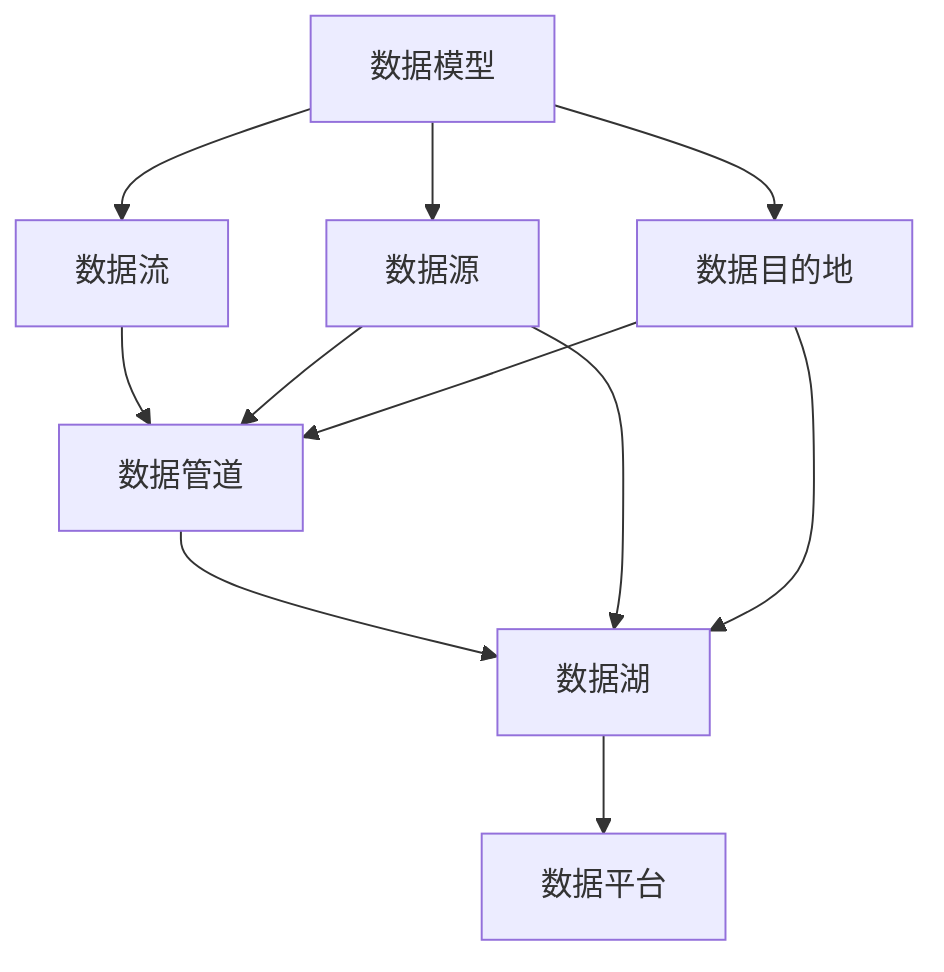
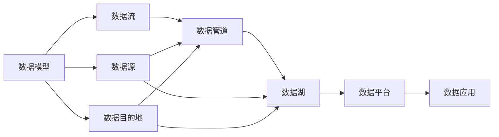
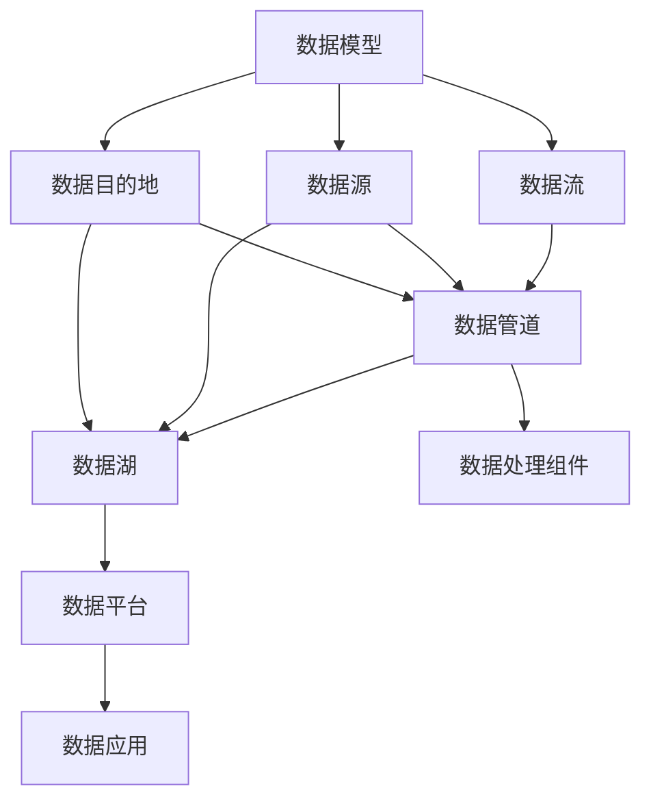
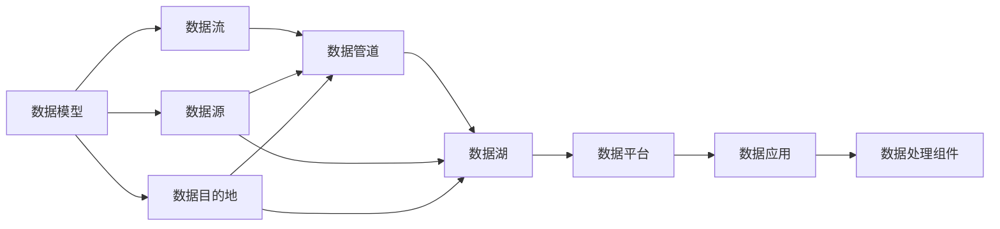
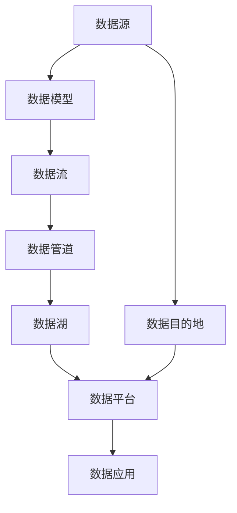

                 

# 数据即模型,软件2.0颠覆传统软件方法论

## 1. 背景介绍

### 1.1 问题由来

进入21世纪，数字技术快速崛起，伴随着以数据驱动为核心的大数据浪潮，软件工程的传统范式正在经历巨大的变革。从面向过程、面向对象到服务化、容器化，软件架构在不断演进，然而这些模式均未能突破数据、需求和实现之间的鸿沟。在软件开发的生命周期中，数据往往被视为静态的资产，代码和需求才是动态变化的核心。但随着云计算、人工智能、物联网等新兴技术的发展，数据逐渐成为软件系统中不可或缺的动态、自适应的核心资源。

数据的崛起不仅改变了软件系统中的数据存储、传输和处理的方式，也进一步重塑了软件架构、设计、开发和运维方法论。从软件1.0的算法时代，到软件2.0的数据时代，未来的软件系统不再以数据为中心，而是以数据驱动为核心。数据不再仅是软件运行的输入和输出，而是软件系统的全要素。

### 1.2 问题核心关键点

传统软件方法论的根本问题是数据与代码、需求和实现之间的脱节。在软件1.0时代，数据和算法紧密耦合，软件设计、实现和测试均围绕算法展开。但随着数据量的指数级增长，数据成为了软件系统中最复杂、最核心的部分。

在软件2.0时代，数据即模型，软件系统以数据为核心。软件系统的设计、开发、测试和运维均围绕数据展开，数据驱动成为软件系统的最高准则。数据不仅是软件运行的核心输入和输出，更是软件系统的全要素，影响着系统的架构、功能、性能和安全性。

1. **数据驱动的设计**：传统软件设计往往围绕算法展开，以模块化、组件化为特征。而在软件2.0时代，数据驱动成为设计的主导力量，软件系统从数据流出发，设计数据管道、数据汇聚、数据处理和数据驱动的算法。数据流主导着软件架构的演进，数据管理成为软件设计的核心。

2. **数据驱动的开发**：传统软件开发往往围绕功能模块展开，采用瀑布式、迭代式、敏捷式等流程。而在软件2.0时代，数据驱动成为开发的主导力量，软件开发围绕数据管道展开，采用数据流水线、数据湖、数据平台等技术，实现数据的采集、存储、处理和应用。

3. **数据驱动的测试**：传统软件测试往往围绕功能模块展开，采用单元测试、集成测试、系统测试等方法。而在软件2.0时代，数据驱动成为测试的主导力量，测试围绕数据流展开，采用数据溯源、数据仿真、数据校验等方法，实现数据的全生命周期测试。

4. **数据驱动的运维**：传统软件运维往往围绕功能模块展开，采用监控、故障排除、性能优化等手段。而在软件2.0时代，数据驱动成为运维的主导力量，运维围绕数据流展开，采用数据监控、数据诊断、数据治理等手段，实现数据的安全、稳定和高效。

### 1.3 问题研究意义

数据驱动的软件开发范式正引领软件工程的新方向。它不仅改变了软件系统中的数据处理方式，也深刻影响了软件系统的设计、开发、测试和运维方法论。数据驱动的软件开发范式能够有效应对数据爆炸带来的挑战，提升软件系统的适应性和稳定性，推动软件工程的持续演进。

研究数据驱动的软件开发范式，对于提升软件系统的开发效率和性能，优化软件架构，提升软件系统的适应性和稳定性，具有重要的理论和实际意义：

1. **提升开发效率**：数据驱动的软件开发范式能够有效利用数据中的信息，快速识别系统的关键点和瓶颈，提升开发效率。
2. **优化系统性能**：数据驱动的软件开发范式能够优化数据管道的设计，提升数据处理效率，优化系统性能。
3. **增强系统适应性**：数据驱动的软件开发范式能够更好地应对数据的变化，提升系统的适应性和可扩展性。
4. **保障系统稳定性**：数据驱动的软件开发范式能够优化数据的校验和监控，保障系统的稳定性和可靠性。
5. **推动持续演进**：数据驱动的软件开发范式能够推动软件系统的持续演进和优化，保障软件系统的长期价值。

## 2. 核心概念与联系

### 2.1 核心概念概述

要深入理解数据驱动的软件开发范式，首先需要理解其核心概念及其相互联系。

- **数据模型**：数据模型是指描述数据结构和数据语义的概念模型。它包含数据的类型、属性、关系和约束，是数据驱动的软件开发范式的基础。
- **数据流**：数据流是指数据在软件系统中的流动路径和处理逻辑。数据流驱动着软件系统的架构设计，是数据驱动的软件开发范式的主导力量。
- **数据管道**：数据管道是指连接数据源、数据处理组件和数据目的地的数据流管道。数据管道是数据驱动的软件开发范式的核心组件。
- **数据湖**：数据湖是指将所有数据汇集到统一的数据平台中，以供分析和处理。数据湖是数据驱动的软件开发范式的重要支撑。
- **数据平台**：数据平台是指支持数据存储、处理和应用的统一软件架构。数据平台是数据驱动的软件开发范式的实现平台。

这些核心概念之间的逻辑关系可以通过以下Mermaid流程图来展示：



这个流程图展示了数据驱动的软件开发范式的基本架构。数据模型描述数据结构和语义，数据流描述数据的流动路径和处理逻辑，数据管道连接数据源和目的地，数据湖汇聚数据，数据平台提供数据存储、处理和应用。

### 2.2 概念间的关系

这些核心概念之间存在着紧密的联系，形成了数据驱动的软件开发范式的完整生态系统。下面我通过几个Mermaid流程图来展示这些概念之间的关系。

#### 2.2.1 数据驱动的软件开发范式



这个流程图展示了数据驱动的软件开发范式的基本流程。数据模型描述数据结构和语义，数据流驱动着数据管道的设计，数据管道连接数据源和目的地，数据湖汇聚数据，数据平台提供数据存储、处理和应用。

#### 2.2.2 数据流驱动的架构设计



这个流程图展示了数据驱动的架构设计。数据流驱动着数据管道的设计，数据管道连接数据源和目的地，数据湖汇聚数据，数据平台提供数据存储、处理和应用。

#### 2.2.3 数据平台的数据应用



这个流程图展示了数据平台的数据应用。数据模型描述数据结构和语义，数据流驱动着数据管道的设计，数据管道连接数据源和目的地，数据湖汇聚数据，数据平台提供数据存储、处理和应用。

### 2.3 核心概念的整体架构

最后，我们用一个综合的流程图来展示这些核心概念在大数据驱动的软件开发范式中的整体架构：



这个综合流程图展示了从数据源到数据应用的完整流程。数据源产生数据，数据模型描述数据结构和语义，数据流驱动数据管道的设计，数据管道连接数据源和目的地，数据湖汇聚数据，数据平台提供数据存储、处理和应用，最终数据应用提供服务。

## 3. 核心算法原理 & 具体操作步骤
### 3.1 算法原理概述

数据驱动的软件开发范式，其核心在于数据即模型。在软件2.0时代，数据不再是被动地存储和传输，而是成为软件系统的全要素，驱动着系统的架构、功能、性能和安全性。

形式化地，假设数据模型为 $D_{model}$，数据流为 $D_{flow}$，数据管道为 $D_{pipe}$，数据湖为 $D_{lake}$，数据平台为 $D_{platform}$，数据应用为 $D_{app}$。则数据驱动的软件开发范式的目标是在数据流 $D_{flow}$ 的驱动下，设计、开发和部署数据管道 $D_{pipe}$、数据湖 $D_{lake}$、数据平台 $D_{platform}$，最终实现数据应用 $D_{app}$。

### 3.2 算法步骤详解

基于数据驱动的软件开发范式，一般包括以下几个关键步骤：

**Step 1: 数据模型设计**
- 收集数据源和数据目的地，理解数据的来源和去向。
- 描述数据的结构和语义，建立数据模型。
- 设计数据流，明确数据的流动路径和处理逻辑。

**Step 2: 数据管道设计**
- 根据数据流，设计数据管道，选择合适的数据处理组件和算法。
- 设计数据管道的架构，包括数据的采集、存储、处理和传输。
- 设计数据管道的接口和协议，确保数据管道与其他系统集成。

**Step 3: 数据湖设计**
- 选择合适的数据湖平台，实现数据的汇聚、存储和管理。
- 设计数据湖的数据模型，建立数据湖的数据索引和元数据。
- 设计数据湖的数据质量控制，保障数据的一致性和完整性。

**Step 4: 数据平台设计**
- 选择合适的数据平台，实现数据处理、分析和应用的统一架构。
- 设计数据平台的接口和协议，确保数据平台与其他系统集成。
- 设计数据平台的数据安全和隐私控制，保障数据的安全和隐私。

**Step 5: 数据应用开发**
- 根据数据应用的需求，设计数据应用的接口和协议。
- 设计数据应用的算法和模型，实现数据的分析和应用。
- 设计数据应用的用户界面和交互逻辑，提升用户体验。

**Step 6: 数据管道集成**
- 将数据管道集成到数据流中，实现数据的采集、存储、处理和传输。
- 设计数据管道的监控和诊断，确保数据管道的高效和稳定。
- 设计数据管道的扩展和优化，提升数据管道的可扩展性和性能。

**Step 7: 数据湖部署**
- 部署数据湖到云计算平台，实现数据的汇聚、存储和管理。
- 设计数据湖的数据备份和恢复，保障数据的安全和可靠性。
- 设计数据湖的数据监控和告警，确保数据湖的高效和稳定。

**Step 8: 数据平台部署**
- 部署数据平台到云计算平台，实现数据处理、分析和应用的统一架构。
- 设计数据平台的数据安全和隐私控制，保障数据的安全和隐私。
- 设计数据平台的数据监控和告警，确保数据平台的高效和稳定。

**Step 9: 数据应用部署**
- 部署数据应用到云计算平台，实现数据的分析和应用。
- 设计数据应用的用户界面和交互逻辑，提升用户体验。
- 设计数据应用的监控和诊断，确保数据应用的高效和稳定。

### 3.3 算法优缺点

数据驱动的软件开发范式具有以下优点：

1. **提升开发效率**：数据驱动的软件开发范式能够有效利用数据中的信息，快速识别系统的关键点和瓶颈，提升开发效率。
2. **优化系统性能**：数据驱动的软件开发范式能够优化数据管道的设计，提升数据处理效率，优化系统性能。
3. **增强系统适应性**：数据驱动的软件开发范式能够更好地应对数据的变化，提升系统的适应性和可扩展性。
4. **保障系统稳定性**：数据驱动的软件开发范式能够优化数据的校验和监控，保障系统的稳定性和可靠性。

然而，数据驱动的软件开发范式也存在以下缺点：

1. **数据质量和一致性问题**：数据质量和一致性是数据驱动的软件开发范式的核心问题。数据质量和一致性的保障需要耗费大量时间和资源。
2. **数据安全和隐私问题**：数据驱动的软件开发范式对数据的安全和隐私提出了更高的要求。如何在保障数据安全的前提下，实现数据的共享和应用，是一个重要的挑战。
3. **系统复杂性增加**：数据驱动的软件开发范式涉及的数据管道、数据湖、数据平台等组件，系统复杂性大大增加。如何设计和管理这些组件，是数据驱动的软件开发范式的关键问题。

### 3.4 算法应用领域

数据驱动的软件开发范式已经广泛应用于各个领域，取得了显著的成效：

1. **金融行业**：在金融行业，数据驱动的软件开发范式被广泛应用于风险管理、资产管理、信用评估等领域。通过数据分析和建模，提升了金融系统的智能化水平，降低了金融风险。

2. **医疗行业**：在医疗行业，数据驱动的软件开发范式被广泛应用于病历管理、诊疗辅助、医学研究等领域。通过数据分析和建模，提升了医疗系统的智能化水平，提高了医疗服务的质量和效率。

3. **零售行业**：在零售行业，数据驱动的软件开发范式被广泛应用于客户分析、销售预测、库存管理等领域。通过数据分析和建模，提升了零售系统的智能化水平，提高了零售服务的质量和效率。

4. **制造业**：在制造业，数据驱动的软件开发范式被广泛应用于生产调度、质量控制、设备维护等领域。通过数据分析和建模，提升了制造业的智能化水平，提高了生产效率和产品质量。

5. **智慧城市**：在智慧城市领域，数据驱动的软件开发范式被广泛应用于城市管理、交通控制、环保监测等领域。通过数据分析和建模，提升了智慧城市的智能化水平，提高了城市管理的效率和质量。

## 4. 数学模型和公式 & 详细讲解  
### 4.1 数学模型构建

本节将使用数学语言对数据驱动的软件开发范式进行更加严格的刻画。

假设数据模型为 $D_{model}=\{S, A, R\}$，其中 $S$ 为数据源，$A$ 为数据处理组件，$R$ 为数据目的地。数据流 $D_{flow}$ 由数据源 $S$ 流向数据目的地 $R$，经过数据处理组件 $A$ 进行处理。数据流 $D_{flow}$ 由数据源 $S$ 和数据目的地 $R$ 决定，数据处理组件 $A$ 设计为数据流 $D_{flow}$ 的中间件。

数据管道 $D_{pipe}=\{S, A, R\}$，其中 $S$ 为数据源，$A$ 为数据处理组件，$R$ 为数据目的地。数据管道 $D_{pipe}$ 由数据源 $S$ 和数据目的地 $R$ 决定，数据处理组件 $A$ 设计为数据管道 $D_{pipe}$ 的中间件。

数据湖 $D_{lake}=\{S, A, R\}$，其中 $S$ 为数据源，$A$ 为数据处理组件，$R$ 为数据目的地。数据湖 $D_{lake}$ 由数据源 $S$ 和数据目的地 $R$ 决定，数据处理组件 $A$ 设计为数据湖 $D_{lake}$ 的中间件。

数据平台 $D_{platform}=\{S, A, R\}$，其中 $S$ 为数据源，$A$ 为数据处理组件，$R$ 为数据目的地。数据平台 $D_{platform}$ 由数据源 $S$ 和数据目的地 $R$ 决定，数据处理组件 $A$ 设计为数据平台 $D_{platform}$ 的中间件。

数据应用 $D_{app}=\{S, A, R\}$，其中 $S$ 为数据源，$A$ 为数据处理组件，$R$ 为数据目的地。数据应用 $D_{app}$ 由数据源 $S$ 和数据目的地 $R$ 决定，数据处理组件 $A$ 设计为数据应用 $D_{app}$ 的中间件。

### 4.2 公式推导过程

以下我们以金融行业中的风险管理为例，推导数据驱动的软件开发范式的数学模型及其计算公式。

假设金融风险管理的数据流 $D_{flow}=\{S, A, R\}$，其中 $S$ 为银行内部业务数据源，$A$ 为风险管理算法，$R$ 为风险管理报告目的地。数据流 $D_{flow}$ 由数据源 $S$ 流向数据目的地 $R$，经过风险管理算法 $A$ 进行处理。

定义数据流 $D_{flow}$ 的损失函数为：

$$
\mathcal{L}(D_{flow}) = \sum_{i=1}^N |R_i - A_i(S_i)|
$$

其中 $R_i$ 为第 $i$ 个风险管理报告的真实值，$A_i(S_i)$ 为第 $i$ 个风险管理算法的输出值。

最小化损失函数 $\mathcal{L}(D_{flow})$，求解最优数据流 $D_{flow}^*$，得到最优数据流 $D_{flow}^*$：

$$
D_{flow}^* = \mathop{\arg\min}_{D_{flow}} \mathcal{L}(D_{flow})
$$

在得到最优数据流后，需要设计数据管道 $D_{pipe}$、数据湖 $D_{lake}$、数据平台 $D_{platform}$ 和数据应用 $D_{app}$。数据管道 $D_{pipe}$ 由数据源 $S$ 和数据目的地 $R$ 决定，数据处理组件 $A$ 设计为数据管道 $D_{pipe}$ 的中间件。数据湖 $D_{lake}$ 由数据源 $S$ 和数据目的地 $R$ 决定，数据处理组件 $A$ 设计为数据湖 $D_{lake}$ 的中间件。数据平台 $D_{platform}$ 由数据源 $S$ 和数据目的地 $R$ 决定，数据处理组件 $A$ 设计为数据平台 $D_{platform}$ 的中间件。数据应用 $D_{app}$ 由数据源 $S$ 和数据目的地 $R$ 决定，数据处理组件 $A$ 设计为数据应用 $D_{app}$ 的中间件。

最终，数据驱动的软件开发范式的数学模型构建完成。通过最小化损失函数 $\mathcal{L}(D_{flow})$，求解最优数据流 $D_{flow}^*$，设计数据管道 $D_{pipe}$、数据湖 $D_{lake}$、数据平台 $D_{platform}$ 和数据应用 $D_{app}$，实现金融风险管理的智能化应用。

## 5. 项目实践：代码实例和详细解释说明
### 5.1 开发环境搭建

在进行数据驱动的软件开发范式实践前，我们需要准备好开发环境。以下是使用Python进行PyTorch开发的环境配置流程：

1. 安装Anaconda：从官网下载并安装Anaconda，用于创建独立的Python环境。

2. 创建并激活虚拟环境：
```bash
conda create -n pytorch-env python=3.8 
conda activate pytorch-env
```

3. 安装PyTorch：根据CUDA版本，从官网获取对应的安装命令。例如：
```bash
conda install pytorch torchvision torchaudio cudatoolkit=11.1 -c pytorch -c conda-forge
```

4. 安装TensorFlow：从官网下载安装包，进行安装。

5. 安装各类工具包：
```bash
pip install numpy pandas scikit-learn matplotlib tqdm jupyter notebook ipython
```

完成上述步骤后，即可在`pytorch-env`环境中开始数据驱动的软件开发范式实践。

### 5.2 源代码详细实现

这里我们以金融行业中的风险管理为例，使用PyTorch进行风险管理算法的开发。

首先，定义数据源、数据处理组件和数据目的地：

```python
import numpy as np
from torch.utils.data import Dataset
from torch.utils.data import DataLoader
import torch
import torch.nn as nn
import torch.optim as optim

class RiskDataset(Dataset):
    def __init__(self, x, y):
        self.x = x
        self.y = y
        self.num_samples = x.shape[0]
    
    def __len__(self):
        return self.num_samples
    
    def __getitem__(self, index):
        x = self.x[index]
        y = self.y[index]
        return x, y

# 数据源
x = np.random.rand(1000, 10)

# 数据目的地
y = np.random.rand(1000, 1)

# 创建数据集
dataset = RiskDataset(x, y)

# 定义模型
model = nn.Sequential(
    nn.Linear(10, 10),
    nn.ReLU(),
    nn.Linear(10, 1)
)

# 定义优化器
optimizer = optim.Adam(model.parameters(), lr=0.01)

# 定义损失函数
loss_fn = nn.MSELoss()

# 定义训练函数
def train(model, dataset, optimizer, loss_fn):
    for epoch in range(100):
        for i, (x, y) in enumerate(dataset):
            x, y = x.to(device), y.to(device)
            optimizer.zero_grad()
            output = model(x)
            loss = loss_fn(output, y)
            loss.backward()
            optimizer.step()
            print(f'Epoch {epoch+1}, Batch {i+1}, Loss: {loss.item()}')

# 训练模型
device = torch.device('cuda' if torch.cuda.is_available() else 'cpu')
model.to(device)
train(model, dataset, optimizer, loss_fn)
```

然后，定义数据管道、数据湖和数据平台：

```python
class DataPipeline:
    def __init__(self, dataset):
        self.dataset = dataset
    
    def preprocess(self, x):
        # 数据预处理
        return x
    
    def process(self, x):
        # 数据处理
        return x
    
    def postprocess(self, x):
        # 数据后处理
        return x
    
    def get_data(self):
        # 获取数据
        return self.dataset
    
    def set_data(self, dataset):
        # 设置数据
        self.dataset = dataset

class DataLake:
    def __init__(self, data):
        self.data = data
    
    def load_data(self, path):
        # 加载数据
        return self.data
    
    def save_data(self, path):
        # 保存数据
        return self.data
    
    def get_data(self):
        # 获取数据
        return self.data
    
    def set_data(self, data):
        # 设置数据
        self.data = data

class DataPlatform:
    def __init__(self, data):
        self.data = data
    
    def load_data(self, path):
        # 加载数据
        return self.data
    
    def save_data(self, path):
        # 保存数据
        return self.data
    
    def get_data(self):
        # 获取数据
        return self.data
    
    def set_data(self, data):
        # 设置数据
        self.data = data
```

最后，定义数据应用：

```python
class RiskApp:
    def __init__(self, platform):
        self.platform = platform
    
    def load_data(self, path):
        # 加载数据
        return self.platform.get_data()
    
    def save_data(self, path):
        # 保存数据
        return self.platform.save_data(path)
    
    def get_risk(self):
        # 获取风险
        return self.platform.get_data()
```

### 5.3 代码解读与分析

让我们再详细解读一下关键代码的实现细节：

**RiskDataset类**：
- `__init__`方法：初始化数据源和数据目的地。
- `__len__`方法：返回数据集的大小。
- `__getitem__`方法：获取指定位置的数据。

**RiskApp类**：
- `__init__`方法：初始化数据平台。
- `load_data`方法：从指定路径加载数据。
- `save_data`方法：将数据保存到指定路径。
- `get_risk`方法：从数据平台获取风险数据。

**DataPipeline类**：
- `__init__`方法：初始化数据管道。
- `preprocess`方法：数据预处理。
- `process`方法：数据处理。
- `postprocess`方法：数据后处理。
- `get_data`方法：获取数据。
- `set_data`方法：设置数据。

**DataLake类**：
- `__init__`方法：初始化数据湖。
- `load_data`方法：加载数据。
- `save_data`方法：保存数据。
- `get_data`方法：获取数据。
- `set_data`方法：设置数据。

**DataPlatform类**：
- `__init__`方法：初始化数据平台。
- `load_data`方法：加载数据。
- `save_data`方法：保存数据。
- `get_data`方法：获取数据。
- `set_data`方法：设置数据

