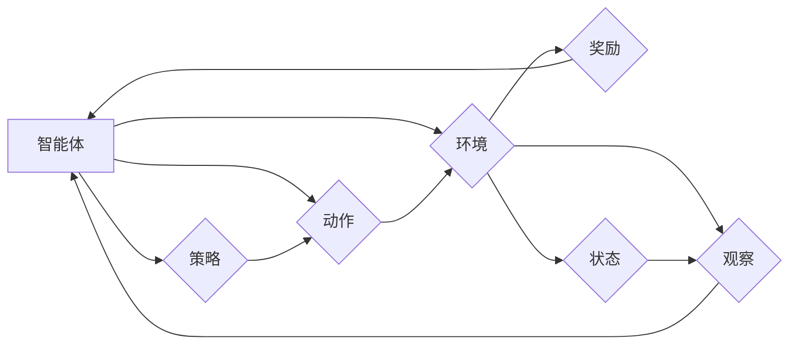

# 强化学习 (Reinforcement Learning)

> 关键词：强化学习，Q学习，策略梯度，深度强化学习，强化学习算法，智能体，环境，奖励，值函数，策略

## 1. 背景介绍

强化学习（Reinforcement Learning, RL）是机器学习的一个重要分支，它使机器能够在与环境的交互中学习如何做出决策，以实现某个目标。与监督学习和无监督学习不同，强化学习通过试错和奖励信号来指导学习过程。近年来，随着深度学习技术的发展，深度强化学习（Deep Reinforcement Learning, DRL）在多个领域取得了显著的成果，如游戏、机器人、自动驾驶等。

### 1.1 问题的由来

强化学习的核心问题是如何使一个智能体（Agent）在与环境（Environment）的交互中学习到最佳策略（Policy），从而在一系列决策中获得最大的累积奖励（Reward）。这个问题在现实世界中具有广泛的应用，例如：

- 自动驾驶汽车的导航与避障
- 电子游戏中的智能角色控制
- 机器人操作机械臂完成复杂任务
- 股票交易策略的优化

### 1.2 研究现状

强化学习的研究始于20世纪50年代，经过几十年的发展，已经形成了丰富的理论和方法。近年来，随着深度学习技术的发展，DRL成为研究热点，并在多个领域取得了突破性进展。以下是强化学习领域的一些重要进展：

- Q学习（Q-Learning）：通过值函数（Value Function）来学习最优策略。
- 策略梯度（Policy Gradient）：直接优化策略的梯度，避免值函数的预测误差。
- 深度Q网络（Deep Q-Network, DQN）：将深度学习与Q学习结合，适用于处理高维状态空间。
- 自博弈（Self-Play）：通过智能体之间的对抗性交互进行训练。

### 1.3 研究意义

强化学习的研究具有重要的理论意义和应用价值：

- 理论意义：强化学习为人工智能提供了一种新的学习和决策框架，有助于理解和解释人类的学习行为。
- 应用价值：强化学习在游戏、机器人、自动驾驶、金融等领域具有广泛的应用前景，能够为解决复杂决策问题提供有力支持。

## 2. 核心概念与联系

强化学习涉及多个核心概念，以下用Mermaid流程图展示它们之间的关系：



### 2.1 核心概念

- **智能体（Agent）**：执行动作、感知环境和接收奖励的实体。
- **环境（Environment）**：智能体所在的周围世界，提供状态和奖励信息。
- **状态（State）**：环境在某一时刻的描述，通常用向量表示。
- **动作（Action）**：智能体可以选择的行为，用于改变环境状态。
- **奖励（Reward）**：环境对智能体的动作做出的反馈，用于指导学习过程。
- **策略（Policy）**：智能体根据当前状态选择动作的规则，通常用概率分布表示。

## 3. 核心算法原理 & 具体操作步骤

### 3.1 算法原理概述

强化学习的主要目标是学习一个策略，使得智能体在给定环境下的累积奖励最大化。以下是两种常见的强化学习算法：

- **Q学习（Q-Learning）**：通过学习值函数来近似最优策略。
- **策略梯度（Policy Gradient）**：直接优化策略的梯度，避免值函数的预测误差。

### 3.2 算法步骤详解

#### 3.2.1 Q学习

Q学习的基本思想是：对于每个状态-动作对 $(s,a)$，定义一个Q值（Q-Value），表示在状态 $s$ 下执行动作 $a$ 并采取最优策略的期望奖励。Q学习的目标是学习一个Q值函数 $Q(s,a)$，使得 $Q(s,a)$ 近似等于最大Q值。

1. 初始化Q值函数 $Q(s,a)$ 为随机值。
2. 选择动作 $a$ 并执行。
3. 收集奖励 $r$ 和下一个状态 $s'$。
4. 更新Q值函数：
   $$
   Q(s,a) \leftarrow Q(s,a) + \alpha [r + \gamma \max_{a'} Q(s',a') - Q(s,a)]
   $$
   其中，$\alpha$ 为学习率，$\gamma$ 为折扣因子。
5. 重复步骤2-4，直至达到终止条件。

#### 3.2.2 策略梯度

策略梯度算法直接优化策略的梯度，避免值函数的预测误差。其基本思想是：计算策略梯度的期望，并将其用于更新策略参数。

1. 初始化策略参数 $\theta$。
2. 执行策略 $p(a|s;\theta)$，收集状态-动作对 $(s,a)$。
3. 计算策略梯度：
   $$
   \nabla_{\theta} J(\theta) = \mathbb{E}_{s,a}[\nabla_{\theta} L(s,a)]
   $$
   其中，$J(\theta)$ 为策略梯度，$L(s,a)$ 为损失函数。
4. 使用梯度下降或其他优化算法更新策略参数 $\theta$。
5. 重复步骤2-4，直至达到终止条件。

### 3.3 算法优缺点

#### Q学习

优点：

- 算法简单，易于实现。
- 无需梯度信息，适用于非光滑损失函数。
- 可以处理连续动作空间。

缺点：

- 需要大量数据进行学习。
- Q值函数的稀疏性可能导致学习困难。

#### 策略梯度

优点：

- 无需值函数，直接优化策略。
- 可以处理连续动作空间。

缺点：

- 需要梯度信息，对噪声敏感。
- 容易陷入局部最优。

### 3.4 算法应用领域

Q学习和策略梯度在多个领域都有广泛的应用，以下是一些典型的应用场景：

- 游戏：如围棋、电子竞技等。
- 机器人：如机器人路径规划、机械臂控制等。
- 自动驾驶：如车辆导航、避障等。
- 金融：如股票交易策略优化、风险管理等。

## 4. 数学模型和公式 & 详细讲解 & 举例说明

### 4.1 数学模型构建

强化学习中的数学模型主要包括以下几部分：

- **状态空间（State Space）**：$S$，表示所有可能的状态的集合。
- **动作空间（Action Space）**：$A$，表示所有可能动作的集合。
- **策略（Policy）**：$\pi(s,a)$，表示在状态 $s$ 下执行动作 $a$ 的概率。
- **值函数（Value Function）**：$V(s)$ 和 $Q(s,a)$，分别表示在状态 $s$ 下采取最优策略的期望累积奖励和状态-动作对的期望累积奖励。
- **奖励函数（Reward Function）**：$R(s,a,s')$，表示智能体在状态 $s$ 下执行动作 $a$ 到达状态 $s'$ 的奖励。

### 4.2 公式推导过程

以下以Q学习为例，推导Q值函数的更新公式。

假设智能体在状态 $s$ 下执行动作 $a$，到达状态 $s'$，并获取奖励 $r$。则Q值函数的更新公式为：

$$
Q(s,a) \leftarrow Q(s,a) + \alpha [r + \gamma \max_{a'} Q(s',a') - Q(s,a)]
$$

其中，$\alpha$ 为学习率，$\gamma$ 为折扣因子。

### 4.3 案例分析与讲解

以下以经典的"倒瓶子"任务为例，讲解Q学习算法。

假设智能体位于一个包含瓶子和瓶盖的平台，智能体的目标是学会将瓶盖从瓶子中取出。状态空间为 $(s_t, x_t, y_t)$，其中 $s_t$ 表示智能体的方向，$(x_t, y_t)$ 表示智能体的位置。动作空间为 $(\text{up}, \text{down}, \text{left}, \text{right})$，表示智能体的移动方向。奖励函数为 $R(s,a,s')$，表示智能体执行动作 $a$ 后到达状态 $s'$ 的奖励。

1. 初始化Q值函数 $Q(s,a)$ 为随机值。
2. 随机选择动作 $a$ 并执行。
3. 收集奖励 $r$ 和下一个状态 $s'$。
4. 更新Q值函数：
   $$
   Q(s_t, a_t) \leftarrow Q(s_t, a_t) + \alpha [r + \gamma \max_{a_t'} Q(s'_t, a_t') - Q(s_t, a_t)]
   $$
5. 重复步骤2-4，直至达到终止条件。

通过不断学习和更新Q值函数，智能体最终能够学会将瓶盖从瓶子中取出。

## 5. 项目实践：代码实例和详细解释说明

### 5.1 开发环境搭建

以下是使用Python和OpenAI Gym库进行强化学习项目实践的环境搭建步骤：

1. 安装Python：
   ```
   pip install python
   ```

2. 安装OpenAI Gym：
   ```
   pip install gym
   ```

3. 安装PyTorch：
   ```
   pip install torch torchvision torchaudio
   ```

### 5.2 源代码详细实现

以下是一个使用Q学习算法解决倒瓶子任务的简单示例：

```python
import gym
import torch
import torch.nn as nn
import torch.optim as optim

# 创建环境
env = gym.make('InvertedPendulum-v1')

# 定义Q网络
class QNetwork(nn.Module):
    def __init__(self):
        super(QNetwork, self).__init__()
        self.fc1 = nn.Linear(4, 64)
        self.fc2 = nn.Linear(64, 64)
        self.fc3 = nn.Linear(64, 1)

    def forward(self, x):
        x = torch.relu(self.fc1(x))
        x = torch.relu(self.fc2(x))
        x = self.fc3(x)
        return x

# 初始化模型和优化器
q_network = QNetwork()
optimizer = optim.Adam(q_network.parameters(), lr=0.01)

# Q学习算法
def q_learning(q_network, optimizer, env, episodes=1000):
    for episode in range(episodes):
        state = env.reset()
        done = False
        while not done:
            with torch.no_grad():
                q_values = q_network(state)
            action = torch.argmax(q_values).item()
            next_state, reward, done, _ = env.step(action)
            optimizer.zero_grad()
            q_values_next = q_network(next_state)
            target = reward + 0.99 * torch.max(q_values_next)
            loss = (q_values - target).pow(2).mean()
            loss.backward()
            optimizer.step()
            state = next_state

# 训练Q网络
q_learning(q_network, optimizer, env)

# 保存Q网络参数
torch.save(q_network.state_dict(), 'q_network.pth')

# 加载Q网络参数
q_network.load_state_dict(torch.load('q_network.pth'))
```

### 5.3 代码解读与分析

- `gym.make('InvertedPendulum-v1')` 创建一个倒瓶子任务的环境。
- `QNetwork` 类定义了Q网络的结构，包含两个全连接层和一个输出层。
- `q_learning` 函数实现了Q学习算法，包括初始化模型、优化器、训练循环和参数更新。
- `torch.argmax(q_values).item()` 选择动作，即选择Q值最大的动作。
- `reward + 0.99 * torch.max(q_values_next)` 计算目标值。
- `loss.backward()` 反向传播计算梯度。
- `optimizer.step()` 更新模型参数。

通过上述代码，我们可以训练一个能够解决倒瓶子任务的Q网络。这个示例展示了使用PyTorch和OpenAI Gym进行强化学习项目实践的基本流程。

### 5.4 运行结果展示

运行上述代码，可以看到Q网络在训练过程中逐渐收敛，最终能够学会稳定地控制倒瓶子任务。

## 6. 实际应用场景

强化学习在实际应用中具有广泛的应用场景，以下是一些典型的应用实例：

- **自动驾驶**：通过强化学习，自动驾驶汽车可以学习如何在复杂的交通环境中安全驾驶。
- **机器人控制**：强化学习可以帮助机器人学习执行各种复杂的操作，如抓取、搬运、焊接等。
- **游戏**：强化学习可以应用于游戏AI，使游戏角色能够进行更智能的决策。
- **推荐系统**：强化学习可以用于优化推荐系统的推荐策略，提高推荐效果。
- **金融**：强化学习可以应用于股票交易、风险管理等领域，帮助投资者做出更明智的决策。

## 7. 工具和资源推荐

### 7.1 学习资源推荐

- 《Reinforcement Learning: An Introduction》
- 《Artificial Intelligence: A Modern Approach》
- 《Reinforcement Learning: A Closer Look》
- 《Deep Reinforcement Learning》

### 7.2 开发工具推荐

- OpenAI Gym：提供多种预定义环境，方便进行强化学习实验。
- PyTorch：提供丰富的深度学习框架，支持强化学习算法的实现。
- TensorFlow：提供丰富的深度学习框架，支持强化学习算法的实现。
- Stable Baselines：提供预训练的强化学习算法，方便进行实验和比较。

### 7.3 相关论文推荐

- Q-Learning: https://www.informatik.uni-bielefeld.de/~zero/teaching/reinforcement-learning-spring-2016/lectures/lecture-04.pdf
- Deep Q-Networks: https://arxiv.org/abs/1308.02923
- Asynchronous Advantage Actor-Critic: https://arxiv.org/abs/1602.01783
- Proximal Policy Optimization: https://arxiv.org/abs/1707.06347

## 8. 总结：未来发展趋势与挑战

### 8.1 研究成果总结

强化学习作为人工智能领域的一个重要分支，在理论和方法上取得了显著进展。Q学习、策略梯度、深度强化学习等算法为解决复杂决策问题提供了有力支持。然而，强化学习在实际应用中仍面临着诸多挑战。

### 8.2 未来发展趋势

- **多智能体强化学习**：研究多个智能体之间的交互和协作，解决多智能体决策问题。
- **持续学习**：使智能体能够适应不断变化的环境和任务。
- **可解释性**：提高强化学习模型的解释性和可信度。
- **安全性**：确保强化学习系统的鲁棒性和安全性。

### 8.3 面临的挑战

- **样本效率**：如何高效地利用有限的样本数据进行学习。
- **稀疏奖励**：如何处理稀疏奖励问题。
- **可扩展性**：如何提高强化学习算法的可扩展性。
- **稳定性**：如何保证强化学习系统的稳定性和可靠性。

### 8.4 研究展望

随着研究的不断深入，强化学习将在更多领域发挥重要作用。未来，强化学习将与其他人工智能技术（如知识表示、因果推理、强化学习等）相结合，推动人工智能的发展，为人类社会创造更多价值。

## 9. 附录：常见问题与解答

**Q1：强化学习与监督学习和无监督学习有何区别？**

A: 强化学习通过与环境交互来学习，从奖励信号中获取反馈。监督学习从标注数据中学习，从标签中获取反馈。无监督学习从未标注数据中学习，无需奖励信号或标签。

**Q2：Q学习和策略梯度有何区别？**

A: Q学习通过学习值函数来近似最优策略，而策略梯度直接优化策略的梯度。

**Q3：强化学习在实际应用中面临哪些挑战？**

A: 强化学习在实际应用中面临样本效率、稀疏奖励、可扩展性、稳定性等挑战。

**Q4：如何提高强化学习算法的样本效率？**

A: 可以使用数据增强、迁移学习、多智能体强化学习等方法提高强化学习算法的样本效率。

**Q5：如何处理强化学习中的稀疏奖励问题？**

A: 可以使用重要性采样、优势学习、无模型方法等方法处理强化学习中的稀疏奖励问题。

**Q6：如何提高强化学习算法的可扩展性？**

A: 可以使用模型压缩、量化加速、异步执行等方法提高强化学习算法的可扩展性。

**Q7：如何保证强化学习系统的稳定性和可靠性？**

A：可以通过设计稳定的奖励函数、引入惩罚项、使用多智能体强化学习等方法保证强化学习系统的稳定性和可靠性。

---

作者：禅与计算机程序设计艺术 / Zen and the Art of Computer Programming