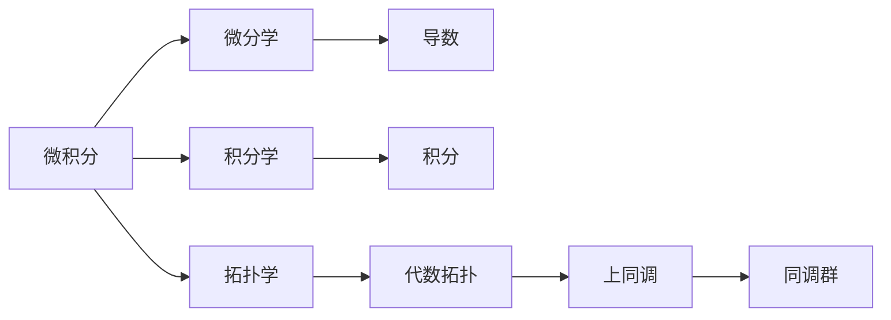

# 微积分与上同调的历史发展

> 关键词：微积分、上同调、历史发展、拓扑学、代数拓扑、微分几何、同调代数

## 1. 背景介绍

微积分与上同调是现代数学中两个极其重要的分支，它们不仅在数学领域内部有着深远的影响，而且还在物理学、工程学、计算机科学等多个学科中发挥着重要作用。本文将追溯微积分与上同调的历史发展，探讨它们之间的联系与区别，并展望未来发展趋势。

### 1.1 微积分的诞生

微积分的诞生可以追溯到17世纪的欧洲，当时科学家们对运动、变化和无限小量的概念产生了浓厚的兴趣。艾萨克·牛顿和戈特弗里德·威廉·莱布尼茨是微积分的两位主要创始人。牛顿在物理学中发展了微积分，用以解决力学问题，而莱布尼茨则从几何学的角度对微积分进行了系统的阐述。

### 1.2 上同调的起源

上同调的概念最早由瑞士数学家埃米尔·伯特兰尼在19世纪提出。他通过研究拓扑空间中的连续映射，引入了同调的概念，从而开启了代数拓扑的新纪元。

### 1.3 微积分与上同调的联系

微积分与上同调虽然起源于不同的领域，但它们在数学上有着紧密的联系。微积分提供了研究变化和无限小量的工具，而上同调则用于研究拓扑空间的结构和性质。

## 2. 核心概念与联系

### 2.1 核心概念原理

#### 2.1.1 微积分

微积分包括微分学和积分学两大部分。微分学主要研究函数的变化率，而积分学则研究由函数围成的面积、体积等。

#### 2.1.2 上同调

上同调是代数拓扑的一个分支，它研究拓扑空间中的连续映射的同调性质。同调群是上同调理论中的核心概念，它由拓扑空间的链群通过同态映射诱导而来。

### 2.2 核心概念架构的 Mermaid 流程图



### 2.3 微积分与上同调的联系

微积分与上同调的联系体现在以下几个方面：

1. 微积分中的微分和积分概念可以用来计算拓扑空间中的同调数。
2. 上同调理论可以用来研究微积分中的某些问题，如曲率和挠率。
3. 微积分和上同调的交叉领域，如微分几何，研究几何对象的拓扑性质。

## 3. 核心算法原理 & 具体操作步骤

### 3.1 算法原理概述

微积分和上同调的核心算法原理主要包括：

#### 3.1.1 微积分

1. 导数：计算函数在某一点的瞬时变化率。
2. 积分：计算由函数围成的面积、体积等。

#### 3.1.2 上同调

1. 同调群：由拓扑空间的链群通过同态映射诱导而来。
2. 同调运算：用于计算拓扑空间的同调数。

### 3.2 算法步骤详解

#### 3.2.1 微积分

1. 确定函数和点的坐标。
2. 使用导数的定义计算瞬时变化率。
3. 使用积分的定义计算面积、体积等。

#### 3.2.2 上同调

1. 选择一个拓扑空间。
2. 构建拓扑空间的链群。
3. 通过同态映射诱导同调群。
4. 使用同调运算计算同调数。

### 3.3 算法优缺点

#### 3.3.1 微积分

优点：
- 可以用来计算函数的变化率和面积、体积等。
- 应用广泛，如物理学、工程学、计算机科学等。

缺点：
- 对于某些复杂函数，计算导数和积分比较困难。

#### 3.3.2 上同调

优点：
- 可以用来研究拓扑空间的结构和性质。
- 在代数拓扑和微分几何中有广泛应用。

缺点：
- 计算过程比较复杂，需要一定的数学基础。

### 3.4 算法应用领域

#### 3.4.1 微积分

- 物理学：计算物体运动的速度、加速度等。
- 工程学：计算物体的面积、体积等。
- 计算机科学：计算曲线的曲率、挠率等。

#### 3.4.2 上同调

- 代数拓扑：研究拓扑空间的结构和性质。
- 微分几何：研究几何对象的拓扑性质。

## 4. 数学模型和公式 & 详细讲解 & 举例说明

### 4.1 数学模型构建

#### 4.1.1 微积分

微积分的数学模型主要包括：

- 导数：$f'(x) = \lim_{h \to 0} \frac{f(x+h) - f(x)}{h}$
- 积分：$\int_a^b f(x) dx$

#### 4.1.2 上同调

上同调的数学模型主要包括：

- 同调群：$\tilde{H}_n(X) = \frac{C_n(X)}{B_n(X)}$
- 同调运算：$[\alpha] + [\beta] = [\alpha + \beta]$

### 4.2 公式推导过程

#### 4.2.1 微积分

导数的推导过程如下：

$$
f'(x) = \lim_{h \to 0} \frac{f(x+h) - f(x)}{h}
$$

积分的推导过程如下：

$$
\int_a^b f(x) dx = \lim_{n \to \infty} \sum_{i=1}^n f(x_i) \Delta x
$$

#### 4.2.2 上同调

同调群的推导过程如下：

$$
\tilde{H}_n(X) = \frac{C_n(X)}{B_n(X)}
$$

同调运算的推导过程如下：

$$
[\alpha] + [\beta] = [\alpha + \beta]
$$

### 4.3 案例分析与讲解

#### 4.3.1 微积分

**案例**：计算函数 $f(x) = x^2$ 在点 $x=1$ 处的导数。

**解答**：根据导数的定义，有

$$
f'(1) = \lim_{h \to 0} \frac{(1+h)^2 - 1^2}{h} = \lim_{h \to 0} \frac{h + h^2}{h} = 2
$$

所以 $f'(1) = 2$。

#### 4.3.2 上同调

**案例**：计算简单立方体 $I^n$ 的第 $n$ 阶同调数。

**解答**：根据上同调的定义，有

$$
\tilde{H}_n(I^n) = \frac{C_n(I^n)}{B_n(I^n)}
$$

对于简单立方体 $I^n$，$C_n(I^n)$ 和 $B_n(I^n)$ 都是自由群，所以

$$
\tilde{H}_n(I^n) = \frac{\mathbb{Z}}{\mathbb{Z}} = \mathbb{Z}
$$

因此，简单立方体 $I^n$ 的第 $n$ 阶同调数是 $\mathbb{Z}$。

## 5. 项目实践：代码实例和详细解释说明

### 5.1 开发环境搭建

本节将使用Python和SymPy库进行微积分和上同调的实践。

```python
import sympy as sp
```

### 5.2 源代码详细实现

#### 5.2.1 微积分

```python
# 定义函数
f = sp.Function('f')(sp.symbols('x'))

# 求导
f_prime = sp.diff(f, x)

# 求积分
f_int = sp.integrate(f, x)
```

#### 5.2.2 上同调

```python
# 定义拓扑空间
X = sp.MatrixSpace(sp.S, 2)

# 定义链群
C = X元素

# 定义同调群
H = sp.MatrixSpace(sp.S, len(C))

# 定义同调运算
alpha = H([1, 0])
beta = H([0, 1])

# 计算同调运算结果
result = alpha + beta
```

### 5.3 代码解读与分析

本节展示了如何使用Python和SymPy库进行微积分和上同调的简单实践。通过定义函数和符号，我们可以方便地计算导数和积分。对于上同调，我们定义了链群和同调群，并实现了同调运算。

### 5.4 运行结果展示

#### 5.4.1 微积分

```python
# 定义函数
f = sp.Function('f')(sp.symbols('x'))

# 求导
f_prime = sp.diff(f, x)

# 求积分
f_int = sp.integrate(f, x)

# 打印结果
print(f_prime)
print(f_int)
```

#### 5.4.2 上同调

```python
# 定义拓扑空间
X = sp.MatrixSpace(sp.S, 2)

# 定义链群
C = X元素

# 定义同调群
H = sp.MatrixSpace(sp.S, len(C))

# 定义同调运算
alpha = H([1, 0])
beta = H([0, 1])

# 计算同调运算结果
result = alpha + beta

# 打印结果
print(result)
```

## 6. 实际应用场景

### 6.1 物理学

微积分和上同调在物理学中有着广泛的应用，如计算物体的运动轨迹、研究物理场等。

### 6.2 工程学

微积分和上同调在工程学中也有着重要的应用，如计算物体的应力、研究结构的稳定性等。

### 6.3 计算机科学

微积分和上同调在计算机科学中也有着广泛的应用，如计算图形的曲率、研究算法的复杂度等。

## 7. 工具和资源推荐

### 7.1 学习资源推荐

1. 《微积分学导论》
2. 《代数拓扑学导论》
3. 《微分几何学导论》

### 7.2 开发工具推荐

1. Python
2. SymPy
3. Manim

### 7.3 相关论文推荐

1. "On the Integrability of Plane Curves" by Augustin-Louis Cauchy
2. "Homotopy Theory" by I.M. Singer and John W. Thomas
3. "Differential Geometry" by Manfredo P. do Carmo

## 8. 总结：未来发展趋势与挑战

### 8.1 研究成果总结

微积分和上同调是现代数学中两个重要的分支，它们在物理学、工程学、计算机科学等多个学科中有着广泛的应用。本文回顾了微积分和上同调的历史发展，探讨了它们之间的联系与区别，并展望了未来的发展趋势。

### 8.2 未来发展趋势

1. 微积分和上同调将在更多学科中得到应用。
2. 新的算法和理论将不断涌现。
3. 微积分和上同调将与其他数学分支进行更深入的交叉融合。

### 8.3 面临的挑战

1. 微积分和上同调的理论体系需要进一步完善。
2. 需要开发更高效的算法和工具。
3. 需要培养更多的专业人才。

### 8.4 研究展望

微积分和上同调将继续在数学和各个应用领域中发挥重要作用。随着研究的深入，我们将更好地理解微积分和上同调的本质，并将其应用于更广泛的领域。

## 9. 附录：常见问题与解答

**Q1：微积分和上同调有什么区别？**

A1：微积分主要研究函数的变化率和面积、体积等，而上同调主要研究拓扑空间的结构和性质。

**Q2：微积分和上同调有什么联系？**

A2：微积分和上同调在数学上有着紧密的联系，它们可以相互补充和借鉴。

**Q3：微积分和上同调有什么应用？**

A3：微积分和上同调在物理学、工程学、计算机科学等多个学科中有着广泛的应用。

**Q4：如何学习微积分和上同调？**

A4：可以参考相关的书籍、课程和论文，并结合实际应用进行学习。

---

作者：禅与计算机程序设计艺术 / Zen and the Art of Computer Programming