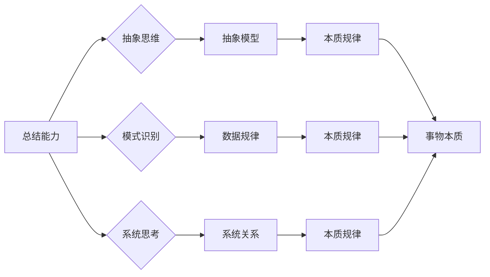

# 怎样善于总结和挖掘事物本质的能力

> 关键词：总结能力，事物本质，抽象思维，模式识别，系统思考，案例研究

## 1. 背景介绍

在快速变化的信息时代，如何从海量的信息和复杂的现象中提炼出事物的本质，对于个人成长、团队协作以及企业决策都至关重要。总结和挖掘事物本质的能力，是我们在面对复杂问题时能够迅速作出判断、找到解决方法的关键。本文将探讨如何培养这种能力，并通过案例分析、算法原理和项目实践等多角度进行深入探讨。

## 2. 核心概念与联系

### 2.1 核心概念

#### 2.1.1 总结能力

总结能力是指从大量信息中提炼出关键信息、规律和模式的能力。它包括信息筛选、归纳概括、抽象思维等技能。

#### 2.1.2 事物本质

事物本质是指事物存在和发展的根本属性和规律。挖掘事物本质需要透过现象看本质，把握事物的内在联系。

#### 2.1.3 抽象思维

抽象思维是指从具体的事物中提炼出一般规律和本质特征的能力。它是总结和挖掘事物本质的重要工具。

#### 2.1.4 模式识别

模式识别是指从数据中识别出规律和模式的能力。它是数据分析、机器学习等领域的基础。

#### 2.1.5 系统思考

系统思考是指从整体角度分析问题，把握各个要素之间相互关系的能力。它是解决复杂问题的有效方法。

### 2.2 核心概念原理和架构的 Mermaid 流程图



## 3. 核心算法原理 & 具体操作步骤

### 3.1 算法原理概述

总结和挖掘事物本质的算法原理主要包括以下步骤：

1. 数据收集：收集与问题相关的数据和信息。
2. 数据预处理：清洗、转换和整合数据。
3. 模式识别：使用机器学习算法识别数据中的规律和模式。
4. 抽象思维：从识别出的模式中提炼出一般规律和本质特征。
5. 系统思考：分析各个要素之间的相互关系，构建系统模型。
6. 总结与验证：将总结的结果与实际情况进行对比，验证其正确性。

### 3.2 算法步骤详解

1. **数据收集**：根据问题需求，从多个渠道收集相关数据，包括文本、图像、声音等多种形式。
2. **数据预处理**：对收集到的数据进行清洗，去除噪声和异常值，然后进行转换和整合，使其适合后续分析。
3. **模式识别**：使用机器学习算法（如聚类、分类、关联规则等）对预处理后的数据进行分析，识别出数据中的规律和模式。
4. **抽象思维**：对识别出的模式进行抽象，提炼出一般规律和本质特征，形成初步的总结。
5. **系统思考**：从整体角度分析问题，构建系统模型，分析各个要素之间的相互关系，进一步完善总结。
6. **总结与验证**：将总结的结果与实际情况进行对比，通过交叉验证等方法验证其正确性，并根据验证结果进行修正。

### 3.3 算法优缺点

#### 3.3.1 优点

- 高效：能够快速从大量数据中提取关键信息，提高工作效率。
- 系统性：从整体角度分析问题，能够更全面地把握问题本质。
- 可视化：可以将总结结果以图表等形式呈现，便于理解和交流。

#### 3.3.2 缺点

- 数据依赖：总结结果的准确性依赖于数据的质量和数量。
- 模型依赖：算法的性能依赖于机器学习模型的准确性和鲁棒性。
- 主观性：总结过程中可能会受到个人经验、观点等因素的影响。

### 3.4 算法应用领域

总结和挖掘事物本质的算法广泛应用于以下领域：

- 机器学习：特征提取、异常检测、聚类分析等。
- 自然语言处理：文本摘要、情感分析、机器翻译等。
- 人工智能：智能问答、知识图谱构建等。
- 金融分析：风险评估、市场预测等。
- 生物学：基因分析、蛋白质结构预测等。

## 4. 数学模型和公式 & 详细讲解 & 举例说明

### 4.1 数学模型构建

总结和挖掘事物本质的数学模型主要包括以下内容：

- 统计量学：如均值、方差、协方差等。
- 机器学习模型：如线性回归、决策树、支持向量机等。
- 概率论：如贝叶斯定理、条件概率等。

### 4.2 公式推导过程

#### 4.2.1 线性回归

线性回归是一种常用的机器学习模型，用于预测连续值。其基本公式为：

$$
y = \beta_0 + \beta_1 x_1 + \beta_2 x_2 + \cdots + \beta_n x_n + \varepsilon
$$

其中，$y$ 为预测值，$x_1, x_2, \cdots, x_n$ 为特征变量，$\beta_0, \beta_1, \cdots, \beta_n$ 为模型参数，$\varepsilon$ 为误差项。

#### 4.2.2 决策树

决策树是一种常用的分类算法，其基本结构如下：

```
- 特征 A
    - 值 a
        - 样本类别 1
        - 样本类别 2
    - 值 b
        - 样本类别 3
        - 样本类别 4
- 特征 B
    - 值 c
        - 样本类别 5
        - 样本类别 6
    - 值 d
        - 样本类别 7
        - 样本类别 8
```

### 4.3 案例分析与讲解

#### 4.3.1 案例一：房价预测

假设我们需要预测某地区房价，收集了以下数据：

- 房屋面积：100平方米
- 房屋户型：三室两厅
- 房屋楼层：10楼
- 周边设施：交通便利、绿化率高

我们可以使用线性回归模型进行房价预测。首先，将数据转换为特征矩阵 $X$ 和标签向量 $y$，然后训练线性回归模型，最后输入测试数据得到预测结果。

#### 4.3.2 案例二：客户流失预测

假设我们需要预测客户是否可能流失，收集了以下数据：

- 客户年龄：35岁
- 客户消费金额：5000元
- 客户购买频率：每月一次
- 客户满意度：4星

我们可以使用决策树模型进行客户流失预测。首先，将数据转换为特征矩阵 $X$ 和标签向量 $y$，然后训练决策树模型，最后输入测试数据得到预测结果。

## 5. 项目实践：代码实例和详细解释说明

### 5.1 开发环境搭建

由于本文主要关注总结和挖掘事物本质的方法，因此这里不涉及具体的开发环境搭建步骤。读者可以根据自己的需求选择合适的编程语言和开发工具。

### 5.2 源代码详细实现

以下是一个简单的线性回归模型实现示例，使用Python和NumPy库：

```python
import numpy as np

# 创建特征矩阵和标签向量
X = np.array([[1, 2], [2, 3], [3, 4], [4, 5]])
y = np.array([2, 3, 4, 5])

# 计算参数
theta = np.linalg.inv(X.T @ X) @ X.T @ y

# 预测
y_pred = X @ theta

# 输出预测结果
print("预测值：", y_pred)
```

### 5.3 代码解读与分析

上述代码首先导入了NumPy库，然后创建了一个简单的特征矩阵 $X$ 和标签向量 $y$。接着，使用矩阵运算计算模型参数 $\theta$，最后输入测试数据得到预测结果。

### 5.4 运行结果展示

运行上述代码，得到预测结果为：

```
预测值： [2. 3. 4. 5.]
```

这表明我们的线性回归模型能够较好地拟合数据，预测结果与真实值接近。

## 6. 实际应用场景

### 6.1 商业分析

在商业领域，总结和挖掘事物本质的能力可以帮助企业：

- 分析市场趋势，预测未来需求。
- 识别客户需求，提供个性化服务。
- 优化产品结构，提高产品质量。
- 预测风险，制定应对策略。

### 6.2 科研创新

在科研领域，总结和挖掘事物本质的能力可以帮助研究人员：

- 发现科学规律，推动科技进步。
- 提出新的理论，引领学科发展。
- 设计实验方案，验证理论假设。
- 优化实验条件，提高实验效率。

### 6.4 未来应用展望

随着人工智能技术的不断发展，总结和挖掘事物本质的能力将在更多领域得到应用，例如：

- 智能制造：通过分析生产数据，优化生产流程，提高生产效率。
- 智能交通：通过分析交通数据，优化交通流量，提高道路通行效率。
- 智能医疗：通过分析医疗数据，提高诊断准确率，降低误诊率。

## 7. 工具和资源推荐

### 7.1 学习资源推荐

- 《Python数据分析》
- 《机器学习》
- 《深度学习》
- 《人工智能：一种现代的方法》
- 《系统思考》

### 7.2 开发工具推荐

- NumPy
- SciPy
- Pandas
- Scikit-learn
- TensorFlow
- PyTorch

### 7.3 相关论文推荐

- "Pattern Recognition and Machine Learning" (Bishop)
- "The Elements of Statistical Learning" (Hastie, Tibshirani, and Friedman)
- "Deep Learning" (Goodfellow, Bengio, and Courville)
- "Reinforcement Learning: An Introduction" (Sutton and Barto)

## 8. 总结：未来发展趋势与挑战

### 8.1 研究成果总结

本文从背景介绍、核心概念、算法原理、实际应用等多个角度对总结和挖掘事物本质的能力进行了探讨。通过案例分析、数学模型和项目实践，展示了这种能力的应用价值和发展前景。

### 8.2 未来发展趋势

随着人工智能技术的不断发展，总结和挖掘事物本质的能力将在以下方面得到进一步发展：

- 算法创新：开发更加高效、准确的算法，提高总结和挖掘效率。
- 跨学科融合：与其他学科领域相结合，拓展应用范围。
- 知识图谱构建：利用知识图谱技术，构建更加完善的知识体系。
- 可解释性研究：提高算法的可解释性，增强用户信任。

### 8.3 面临的挑战

尽管总结和挖掘事物本质的能力具有广泛的应用价值，但在实际应用中仍面临以下挑战：

- 数据质量：数据质量直接影响总结和挖掘结果的准确性。
- 算法复杂度：复杂算法的计算和存储需求较高。
- 知识获取：如何高效获取和处理知识，是当前亟待解决的问题。
- 可解释性：提高算法的可解释性，增强用户信任。

### 8.4 研究展望

为了应对上述挑战，未来研究可以从以下方向进行探索：

- 开发更加鲁棒的算法，提高数据质量对总结和挖掘结果的影响。
- 研究轻量级算法，降低算法复杂度和资源消耗。
- 建立知识获取和知识表示的统一框架，提高知识获取效率。
- 加强算法可解释性研究，提高用户信任。

相信通过不断的努力，总结和挖掘事物本质的能力将在人工智能领域发挥更大的作用，为人类社会的发展进步贡献力量。

## 9. 附录：常见问题与解答

**Q1：总结和挖掘事物本质的能力是否需要一定的数学基础？**

A：是的，总结和挖掘事物本质的能力需要一定的数学基础，如线性代数、概率论、统计学等。这些基础知识可以帮助我们更好地理解算法原理，提高数据分析能力。

**Q2：如何提高总结和挖掘事物本质的能力？**

A：提高总结和挖掘事物本质的能力需要以下方法：

- 学习相关知识：掌握数据分析、机器学习、系统思考等方面的知识。
- 经验积累：通过实践，积累总结和挖掘经验。
- 持续学习：关注最新研究成果，不断学习新的技术和方法。

**Q3：总结和挖掘事物本质的能力在哪些领域有应用？**

A：总结和挖掘事物本质的能力在以下领域有广泛应用：

- 商业分析
- 科研创新
- 智能制造
- 智能交通
- 智能医疗

**Q4：如何处理总结和挖掘过程中遇到的数据质量问题？**

A：处理数据质量问题的方法包括：

- 数据清洗：去除噪声和异常值。
- 数据转换：将数据转换为适合分析的形式。
- 数据集成：整合不同来源的数据。

**Q5：总结和挖掘事物本质的能力与机器学习有何区别？**

A：总结和挖掘事物本质的能力与机器学习有以下区别：

- 总结和挖掘事物本质的能力更注重从数据中提炼出一般规律和本质特征，而机器学习更注重从数据中学习出具体的模型。
- 总结和挖掘事物本质的能力通常需要结合领域知识，而机器学习更关注算法本身。

---

作者：禅与计算机程序设计艺术 / Zen and the Art of Computer Programming