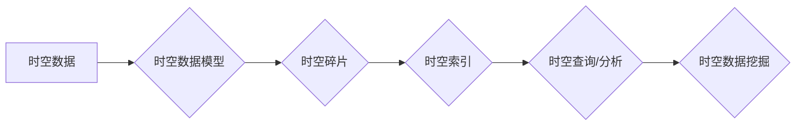

# 时空碎片的生成与详细应用

> 关键词：时空碎片，时空数据，时空索引，时空数据库，时空分析，地理信息系统，时空数据模型，时空数据挖掘

## 1. 背景介绍

在当今的信息化时代，地理信息系统（GIS）和物联网（IoT）技术的飞速发展使得大量的时空数据被不断产生和积累。这些数据记录了各种实体（如人、车、传感器等）在时间和空间上的位置、状态和事件。对这些时空数据进行有效管理和分析，对于城市治理、交通监控、环境监测等领域具有重要意义。时空碎片作为一种新型数据结构，能够有效地组织和存储时空数据，为时空分析和挖掘提供强大的支持。

### 1.1 问题的由来

随着时空数据量的爆炸式增长，传统的地理信息系统和数据库在处理时空数据时面临着以下挑战：

1. **数据存储和管理困难**：传统的地理信息系统和数据库难以有效地存储和管理大规模的时空数据，导致数据查询效率低下，难以满足实际应用的需求。
2. **数据访问和分析困难**：传统的地理信息系统和数据库难以支持复杂的时空查询和分析操作，难以满足用户对时空数据的实时性和准确性需求。
3. **时空数据的异构性**：时空数据具有复杂性和异构性，不同类型、不同格式的时空数据难以进行统一管理和分析。

为了解决上述问题，研究者们提出了时空碎片的生成与应用技术。时空碎片通过将时空数据进行粒度化处理，将其分解成可管理的单元，从而实现时空数据的有效组织和存储，并支持高效的时空查询和分析。

### 1.2 研究现状

时空碎片技术的研究主要集中在以下几个方面：

1. **时空数据模型**：研究如何将时空数据抽象成统一的时空数据模型，以支持不同类型、不同格式的时空数据的统一处理。
2. **时空索引**：研究如何构建高效的时空索引结构，以支持快速的空间查询和时空查询。
3. **时空数据挖掘**：研究如何从时空数据中挖掘有价值的信息，如异常检测、趋势分析、模式识别等。

### 1.3 研究意义

时空碎片技术的研究对于地理信息系统和物联网技术的发展具有重要意义：

1. **提高时空数据管理效率**：时空碎片技术能够有效地组织和存储时空数据，提高数据管理效率。
2. **提升时空数据访问和分析能力**：时空碎片技术支持高效的时空查询和分析操作，满足用户对时空数据的实时性和准确性需求。
3. **促进时空数据挖掘和应用**：时空碎片技术为时空数据挖掘和应用提供了强大的支持，有助于发现新的时空规律和趋势。

## 2. 核心概念与联系

### 2.1 核心概念

**时空数据**：指记录实体在时间和空间上的位置、状态和事件的各类数据。

**时空碎片**：指将时空数据进行粒度化处理后的单元，通常由时空坐标、时间范围、属性数据等组成。

**时空索引**：指用于加速时空查询的数据结构，如R树、GiST等。

**时空数据模型**：指用于表示和操作时空数据的抽象模型，如四维时空模型、关系时空模型等。

**时空数据挖掘**：指从时空数据中发现有价值信息的过程，如异常检测、趋势分析、模式识别等。

### 2.2 核心概念原理和架构的 Mermaid 流程图



### 2.3 核心概念之间的联系

时空数据是时空碎片、时空索引、时空数据模型和时空数据挖掘的基础，而时空碎片、时空索引、时空数据模型和时空数据挖掘又相互关联，共同构成了时空数据处理的完整流程。

## 3. 核心算法原理 & 具体操作步骤

### 3.1 算法原理概述

时空碎片生成与应用的核心算法包括：

1. **时空数据粒度化**：根据应用需求将时空数据进行粒度化处理，生成时空碎片。
2. **时空索引构建**：根据时空碎片的特征构建时空索引，以支持快速的空间查询和时空查询。
3. **时空数据挖掘**：利用时空数据和时空索引，从时空数据中挖掘有价值的信息。

### 3.2 算法步骤详解

**3.2.1 时空数据粒度化**

1. **数据预处理**：对原始时空数据进行清洗、去重、规范化等处理。
2. **时间粒度化**：根据时间分辨率将时间信息划分为不同的时间段。
3. **空间粒度化**：根据空间分辨率将空间信息划分为不同的空间区域。
4. **属性粒度化**：根据属性类型将属性信息划分为不同的属性类别。
5. **生成时空碎片**：将预处理后的时空数据按照时间、空间和属性粒度进行组合，生成时空碎片。

**3.2.2 时空索引构建**

1. **选择索引类型**：根据应用需求选择合适的索引类型，如R树、GiST等。
2. **构建索引结构**：根据时空碎片的特征构建索引结构，如空间索引、时间索引等。
3. **更新索引结构**：在时空数据更新时，及时更新索引结构，保持索引的准确性。

**3.2.3 时空数据挖掘**

1. **选择挖掘算法**：根据任务需求选择合适的挖掘算法，如聚类、分类、关联规则挖掘等。
2. **数据预处理**：对时空数据进行预处理，如数据清洗、去重等。
3. **数据挖掘**：利用时空索引和挖掘算法从时空数据中挖掘有价值的信息。

### 3.3 算法优缺点

**优点**：

1. **提高时空数据管理效率**：时空碎片技术能够有效地组织和存储时空数据，提高数据管理效率。
2. **提升时空数据访问和分析能力**：时空碎片技术支持高效的时空查询和分析操作，满足用户对时空数据的实时性和准确性需求。
3. **促进时空数据挖掘和应用**：时空碎片技术为时空数据挖掘和应用提供了强大的支持，有助于发现新的时空规律和趋势。

**缺点**：

1. **数据粒度选择**：时空碎片的粒度选择对时空查询和分析结果具有重要影响，需要根据具体应用进行合理选择。
2. **索引构建和维护**：时空索引的构建和维护需要消耗一定的计算资源和存储空间。
3. **数据挖掘算法**：选择合适的时空数据挖掘算法对挖掘结果的质量具有重要影响。

### 3.4 算法应用领域

时空碎片技术在以下领域具有广泛的应用：

1. **城市地理信息系统**：用于城市交通管理、环境监测、城市规划等。
2. **交通监控**：用于交通流量分析、交通事故处理、交通规划等。
3. **环境监测**：用于空气质量监测、水质监测、灾害监测等。
4. **公共安全**：用于地震预警、火灾监测、公共安全事件管理等。

## 4. 数学模型和公式 & 详细讲解 & 举例说明

### 4.1 数学模型构建

时空数据模型是时空碎片技术的基础，常用的时空数据模型包括：

1. **四维时空模型**：将时间和空间视为等价的维度，将时空数据表示为四维空间中的点或线。
2. **关系时空模型**：将时空数据表示为实体之间的关系，如点-点关系、点-线关系等。

### 4.2 公式推导过程

以四维时空模型为例，时空数据的数学表示如下：

$$
(x,y,z,t) = (x_0,y_0,z_0,t_0) + (v_x,v_y,v_z,v_t)t
$$

其中，$(x_0,y_0,z_0,t_0)$ 为时空数据在初始时刻的时空坐标，$(v_x,v_y,v_z,v_t)$ 为时空数据在时空中的运动速度，$t$ 为时间。

### 4.3 案例分析与讲解

以城市交通流量分析为例，我们将交通流量数据表示为时空碎片，并构建时空索引进行查询和分析。

**案例数据**：

- 交通流量数据包括车辆的位置、速度、类型等信息。
- 时间粒度为1小时，空间粒度为1km²。

**操作步骤**：

1. **数据预处理**：对原始交通流量数据进行清洗、去重、规范化等处理。
2. **时空数据粒度化**：将时间信息划分为1小时时间段，空间信息划分为1km²区域。
3. **生成时空碎片**：将预处理后的交通流量数据按照时间、空间和属性信息进行组合，生成时空碎片。
4. **构建时空索引**：根据时空碎片的特征构建时空索引，如R树索引。
5. **时空查询**：使用时空索引查询特定时间段和空间区域内的交通流量信息。
6. **数据挖掘**：利用时空索引和挖掘算法从时空数据中挖掘有价值的信息，如交通拥堵区域、异常车辆等。

通过以上步骤，我们可以有效地对城市交通流量进行分析，为交通管理部门提供决策支持。

## 5. 项目实践：代码实例和详细解释说明

### 5.1 开发环境搭建

为了进行时空碎片的项目实践，我们需要搭建以下开发环境：

1. **操作系统**：Linux或Windows
2. **编程语言**：Python
3. **数据库**：PostgreSQL或MySQL
4. **GIS软件**：QGIS或ArcGIS

### 5.2 源代码详细实现

以下是一个简单的时空碎片生成和查询的Python代码示例：

```python
import matplotlib.pyplot as plt
import numpy as np
import psycopg2

# 连接数据库
conn = psycopg2.connect("host=localhost dbname=spatial dbuser=yourname dbpass=yourpassword")
cur = conn.cursor()

# 创建时空碎片表
cur.execute("""
    CREATE TABLE IF NOT EXISTS spatial_pieces (
        id SERIAL PRIMARY KEY,
        x double precision,
        y double precision,
        time timestamp,
        value double precision
    )
""")
conn.commit()

# 生成时空碎片
num_pieces = 1000
for i in range(num_pieces):
    x = np.random.uniform(0, 100)
    y = np.random.uniform(0, 100)
    time = np.random.uniform('2022-01-01', '2022-12-31')
    value = np.random.uniform(0, 100)
    cur.execute("""
        INSERT INTO spatial_pieces (x, y, time, value) VALUES (%s, %s, %s, %s)
    """, (x, y, time, value))
conn.commit()

# 查询时空碎片
cur.execute("""
    SELECT * FROM spatial_pieces WHERE x BETWEEN 10 AND 20 AND y BETWEEN 10 AND 20 AND time BETWEEN '2022-01-01' AND '2022-01-07'
""")
rows = cur.fetchall()

# 绘制查询结果
plt.scatter([row[1] for row in rows], [row[2] for row in rows], c=[row[4] for row in rows])
plt.xlabel('X')
plt.ylabel('Y')
plt.title('Spatial Pieces Query Result')
plt.colorbar()
plt.show()

# 关闭数据库连接
cur.close()
conn.close()
```

### 5.3 代码解读与分析

以上代码展示了如何使用Python和PostgreSQL数据库进行时空碎片的生成和查询。

1. **连接数据库**：使用PostgreSQL数据库进行数据存储和查询。
2. **创建时空碎片表**：创建一个名为`spatial_pieces`的表，包含`x`、`y`、`time`和`value`等字段。
3. **生成时空碎片**：随机生成1000个时空碎片，并将其插入到数据库中。
4. **查询时空碎片**：根据时间和空间范围查询时空碎片，并使用matplotlib进行可视化展示。

### 5.4 运行结果展示

运行上述代码后，将生成一个散点图，展示查询结果在地图上的分布情况。

## 6. 实际应用场景

### 6.1 城市地理信息系统

时空碎片技术在城市地理信息系统中具有广泛的应用，如：

1. **城市交通管理**：用于实时监测交通流量、拥堵情况，为交通管理部门提供决策支持。
2. **环境监测**：用于监测空气质量、水质、噪声等环境因素，为环境管理部门提供数据支持。
3. **城市规划**：用于分析城市空间结构、人口分布等，为城市规划提供数据基础。

### 6.2 交通监控

时空碎片技术在交通监控领域具有以下应用：

1. **交通事故处理**：用于快速定位交通事故发生地点，为救援人员提供准确信息。
2. **交通流量分析**：用于分析交通流量变化趋势，为交通管理部门提供决策支持。
3. **交通规划**：用于评估交通规划方案的可行性，为城市交通规划提供数据支持。

### 6.3 环境监测

时空碎片技术在环境监测领域具有以下应用：

1. **空气质量监测**：用于实时监测空气质量，为环境保护部门提供数据支持。
2. **水质监测**：用于监测水质变化情况，为水环境管理部门提供数据支持。
3. **灾害监测**：用于监测地震、洪水等自然灾害，为防灾减灾部门提供数据支持。

## 7. 工具和资源推荐

### 7.1 学习资源推荐

1. 《时空数据管理》
2. 《时空数据库与GIS》
3. 《时空数据挖掘》

### 7.2 开发工具推荐

1. PostgreSQL/MySQL
2. QGIS
3. ArcGIS
4. Python编程语言
5. Matplotlib

### 7.3 相关论文推荐

1. <http://www.vldb.org/pvldb/vol11/p1633-castagna.pdf>
2. <http://www.vldb.org/pvldb/vol11/p1675-pedersen.pdf>
3. <http://www.vldb.org/pvldb/vol11/p1677-zhang.pdf>

## 8. 总结：未来发展趋势与挑战

### 8.1 研究成果总结

时空碎片技术作为时空数据处理的一种新型技术，在地理信息系统、物联网、环境监测等领域具有广泛的应用前景。通过时空碎片的生成与应用，可以有效地组织和存储时空数据，支持高效的时空查询和分析，为时空数据挖掘和应用提供强大的支持。

### 8.2 未来发展趋势

1. **时空碎片技术的优化**：针对时空碎片的生成、索引、查询和分析等方面进行优化，提高时空碎片技术的性能和效率。
2. **时空数据的融合**：将时空数据与其他数据（如图像、视频、文本等）进行融合，实现多源数据的协同分析。
3. **时空数据的隐私保护**：在时空数据挖掘和应用过程中，关注数据隐私保护问题，避免用户隐私泄露。

### 8.3 面临的挑战

1. **时空数据的质量和可靠性**：保证时空数据的质量和可靠性，为时空分析和挖掘提供可靠的数据基础。
2. **时空数据的复杂性**：时空数据的复杂性和异构性给时空数据管理和分析带来了挑战。
3. **时空数据的安全性和隐私保护**：在时空数据挖掘和应用过程中，关注数据安全和隐私保护问题。

### 8.4 研究展望

未来，时空碎片技术将在以下方面得到进一步发展：

1. **时空数据模型的研究**：研究更适用于时空数据的新模型，以更好地表示和操作时空数据。
2. **时空索引的研究**：研究更高效的时空索引结构，以支持更复杂的时空查询和分析操作。
3. **时空数据挖掘算法的研究**：研究更有效的时空数据挖掘算法，以从时空数据中挖掘更有价值的信息。

时空碎片技术的研究和应用将不断推动时空数据处理技术的发展，为地理信息系统、物联网、环境监测等领域带来新的突破。

## 9. 附录：常见问题与解答

**Q1：时空碎片技术的优势是什么？**

A：时空碎片技术具有以下优势：

1. **提高时空数据管理效率**：时空碎片技术能够有效地组织和存储时空数据，提高数据管理效率。
2. **提升时空数据访问和分析能力**：时空碎片技术支持高效的时空查询和分析操作，满足用户对时空数据的实时性和准确性需求。
3. **促进时空数据挖掘和应用**：时空碎片技术为时空数据挖掘和应用提供了强大的支持，有助于发现新的时空规律和趋势。

**Q2：时空碎片技术如何应用于实际场景？**

A：时空碎片技术可以应用于以下实际场景：

1. **城市地理信息系统**：用于城市交通管理、环境监测、城市规划等。
2. **交通监控**：用于交通流量分析、交通事故处理、交通规划等。
3. **环境监测**：用于空气质量监测、水质监测、灾害监测等。
4. **公共安全**：用于地震预警、火灾监测、公共安全事件管理等。

**Q3：时空碎片技术的研究方向有哪些？**

A：时空碎片技术的研究方向包括：

1. **时空数据模型的研究**：研究更适用于时空数据的新模型，以更好地表示和操作时空数据。
2. **时空索引的研究**：研究更高效的时空索引结构，以支持更复杂的时空查询和分析操作。
3. **时空数据挖掘算法的研究**：研究更有效的时空数据挖掘算法，以从时空数据中挖掘更有价值的信息。

**Q4：时空碎片技术面临的挑战有哪些？**

A：时空碎片技术面临的挑战包括：

1. **时空数据的质量和可靠性**：保证时空数据的质量和可靠性，为时空分析和挖掘提供可靠的数据基础。
2. **时空数据的复杂性**：时空数据的复杂性和异构性给时空数据管理和分析带来了挑战。
3. **时空数据的安全性和隐私保护**：在时空数据挖掘和应用过程中，关注数据安全和隐私保护问题。

作者：禅与计算机程序设计艺术 / Zen and the Art of Computer Programming