# 标准化的大模型抽象：Mode I/O

> 关键词：大模型抽象，模式识别，模型互操作性，接口设计，数据标准化，API，语义一致性

## 1. 背景介绍

随着人工智能技术的飞速发展，大模型已经成为推动自然语言处理（NLP）、计算机视觉（CV）等领域进步的核心力量。这些大模型通常由数以亿计的参数组成，能够在海量数据上进行预训练，从而学习到丰富的知识。然而，大模型的应用也面临着一些挑战，例如模型互操作性差、数据标准化困难、接口设计不统一等问题。为了解决这些问题，本文提出了“标准化的大模型抽象：Mode I/O”的概念，旨在构建一个统一的大模型抽象层，提高模型之间的互操作性，简化数据标准化流程，并实现高效的接口设计。

### 1.1 问题的由来

1. **模型互操作性差**：不同的模型之间缺乏统一的接口和协议，导致模型之间的交互和集成变得困难。
2. **数据标准化困难**：大模型通常需要大量的标注数据，而这些数据往往来自于不同的来源，格式各异，难以进行统一处理。
3. **接口设计不统一**：不同的模型可能使用不同的API，这给开发者和用户带来了困扰。

### 1.2 研究现状

目前，一些开源社区和组织正在努力解决这些问题。例如，Hugging Face的Transformers库提供了大量预训练模型和API，但仍然缺乏统一的抽象层。其他一些项目，如ONNX（Open Neural Network Exchange）和TensorFlow SavedModel，旨在提供模型交换的标准化格式，但主要用于模型部署，而非模型之间的互操作性。

### 1.3 研究意义

“标准化的大模型抽象：Mode I/O”旨在解决大模型应用中的互操作性、数据标准化和接口设计问题，具有以下意义：

1. **提高模型互操作性**：通过统一的抽象层，不同模型之间可以方便地进行交互和集成。
2. **简化数据标准化流程**：提供统一的数据处理标准，简化数据预处理和标注过程。
3. **实现高效的接口设计**：通过定义统一的API接口，降低开发者和用户的开发成本。

### 1.4 本文结构

本文将分为以下几个部分：

1. 介绍“标准化的大模型抽象：Mode I/O”的核心概念和架构。
2. 阐述Mode I/O的算法原理和具体操作步骤。
3. 分析Mode I/O的数学模型和公式，并进行案例分析和讲解。
4. 提供Mode I/O的代码实例和详细解释说明。
5. 探讨Mode I/O的实际应用场景和未来应用展望。
6. 推荐Mode I/O相关的学习资源、开发工具和参考文献。
7. 总结Mode I/O的未来发展趋势与挑战。

## 2. 核心概念与联系

### 2.1 核心概念原理

“标准化的大模型抽象：Mode I/O”的核心概念是构建一个统一的模型抽象层，它包含以下几个关键组件：

1. **模型接口**：定义了模型输入、输出和中间状态的规范，确保不同模型之间的互操作性。
2. **数据规范**：定义了数据格式和编码标准，简化数据标准化流程。
3. **API规范**：定义了API接口的规范，包括函数签名、参数和返回值等。
4. **语义一致性**：确保模型接口和数据规范的语义一致性，避免歧义和误解。

### 2.2 架构的 Mermaid 流程图

```mermaid
graph LR
    subgraph Model Interface
        A[Model Interface] --> B{Input Data}
        B --> C[Preprocessing]
        C --> D[Model Inference]
        D --> E{Output Data}
        E --> F[Postprocessing]
    end
    subgraph Data Specification
        G[Data Specification] --> H{Input Data}
        H --> I[Preprocessing]
        I --> J[Model Inference]
        J --> K[Output Data]
        K --> L[Postprocessing]
    end
    subgraph API Specification
        M[API Specification] --> N{Input Data}
        N --> O[Preprocessing]
        O --> P{Model Inference}
        P --> Q{Output Data}
        Q --> R[Postprocessing]
    end
    subgraph Semantic Consistency
        S[Semantic Consistency] --> T{Model Interface}
        T --> U{Data Specification}
        U --> V{API Specification}
    end
```



### 2.3 核心概念联系

Mode I/O通过以下方式实现核心概念之间的联系：

1. **模型接口**与**数据规范**确保输入和输出的数据格式一致，方便模型处理。
2. **模型接口**与**API规范**确保模型接口的调用方式一致，方便用户使用。
3. **语义一致性**确保模型接口、数据规范和API规范之间的语义一致，避免歧义和误解。

## 3. 核心算法原理 & 具体操作步骤

### 3.1 算法原理概述

Mode I/O的核心算法原理是构建一个统一的模型抽象层，该层包含以下模块：

1. **接口模块**：定义模型输入、输出和中间状态的规范。
2. **数据模块**：定义数据格式和编码标准。
3. **API模块**：定义API接口的规范。
4. **一致性模块**：确保接口模块、数据模块和API模块之间的语义一致性。

### 3.2 算法步骤详解

1. **定义接口模块**：根据具体任务的需求，定义模型输入、输出和中间状态的规范。
2. **定义数据模块**：根据接口模块的定义，定义数据格式和编码标准。
3. **定义API模块**：根据数据模块的定义，定义API接口的规范。
4. **一致性模块**：确保接口模块、数据模块和API模块之间的语义一致性。

### 3.3 算法优缺点

**优点**：

1. 提高模型互操作性。
2. 简化数据标准化流程。
3. 实现高效的接口设计。

**缺点**：

1. 需要额外的工作来定义接口、数据规范和API规范。
2. 可能需要修改现有的模型和API。

### 3.4 算法应用领域

Mode I/O可以应用于以下领域：

1. NLP：文本分类、情感分析、机器翻译等。
2. CV：图像识别、目标检测、语义分割等。
3. 语音识别：语音识别、语音合成、语音转文字等。

## 4. 数学模型和公式 & 详细讲解 & 举例说明

### 4.1 数学模型构建

Mode I/O的数学模型可以表示为：

$$
Model\_IO = \{ Model\_Interface, Data\_Specification, API\_Specification, Semantic\_Consistency \}
$$

其中：

- $Model\_Interface$ 表示模型接口。
- $Data\_Specification$ 表示数据规范。
- $API\_Specification$ 表示API规范。
- $Semantic\_Consistency$ 表示语义一致性。

### 4.2 公式推导过程

Mode I/O的公式推导过程如下：

1. 定义模型接口。
2. 定义数据规范。
3. 定义API规范。
4. 确保接口模块、数据模块和API模块之间的语义一致性。

### 4.3 案例分析与讲解

以文本分类任务为例，Mode I/O可以定义以下模型接口：

```
ModelInterface:
    Input: [text]
    Output: [label]
```

然后，定义数据规范：

```
DataSpecification:
    text: string
    label: string
```

接着，定义API规范：

```
APISpecification:
    text: "string"
    label: "string"
```

最后，确保接口模块、数据模块和API模块之间的语义一致性。

## 5. 项目实践：代码实例和详细解释说明

### 5.1 开发环境搭建

为了实现Mode I/O，我们需要搭建以下开发环境：

1. Python编程语言。
2. PyTorch或TensorFlow深度学习框架。
3. Mermaid流程图工具。

### 5.2 源代码详细实现

以下是一个简单的Mode I/O示例：

```python
# 定义模型接口
class TextClassifier:
    def __init__(self):
        self.model = load_pretrained_model("text_classification_model")
    
    def predict(self, text):
        # 预处理文本数据
        processed_text = preprocess_text(text)
        # 模型推理
        prediction = self.model(processed_text)
        # 后处理输出
        label = postprocess_prediction(prediction)
        return label

# 定义数据规范
def preprocess_text(text):
    # 实现文本预处理逻辑
    return processed_text

def postprocess_prediction(prediction):
    # 实现预测后处理逻辑
    return label

# 使用Mode I/O进行文本分类
classifier = TextClassifier()
label = classifier.predict("This is a great product.")
print(label)
```

### 5.3 代码解读与分析

上述代码定义了一个简单的文本分类器，它使用Mode I/O进行数据处理、模型推理和结果后处理。`TextClassifier`类实现了模型接口，`preprocess_text`和`postprocess_prediction`函数实现了数据规范，从而确保了Model I/O的一致性。

### 5.4 运行结果展示

运行上述代码，将输出分类结果。

## 6. 实际应用场景

Mode I/O可以应用于以下实际应用场景：

1. **智能客服**：构建一个统一的接口，方便不同模型的集成和替换。
2. **多模态应用**：将文本、图像、语音等多种模态数据统一处理，实现跨模态交互。
3. **数据集共享**：通过Mode I/O定义的数据规范，实现不同数据集之间的互操作性。

### 6.4 未来应用展望

随着Mode I/O的不断发展，它将有望在以下方面取得突破：

1. **标准化大模型生态**：推动大模型生态的标准化和规范化。
2. **提高模型开发效率**：简化模型开发流程，降低开发成本。
3. **促进模型创新**：为模型创新提供新的可能性。

## 7. 工具和资源推荐

### 7.1 学习资源推荐

1. 《深度学习》作者：Ian Goodfellow、Yoshua Bengio、Aaron Courville
2. 《Python深度学习》作者：François Chollet
3. Hugging Face官网：https://huggingface.co/

### 7.2 开发工具推荐

1. PyTorch：https://pytorch.org/
2. TensorFlow：https://www.tensorflow.org/
3. Mermaid：https://mermaid.ink/

### 7.3 相关论文推荐

1. "The unreasonable effectiveness of data" by Pedro Domingos
2. "The Unreasonable Effectiveness of Recurrent Neural Networks" by Andrej Karpathy
3. "Generative Adversarial Nets" by Ian Goodfellow et al.

## 8. 总结：未来发展趋势与挑战

### 8.1 研究成果总结

本文介绍了“标准化的大模型抽象：Mode I/O”的概念和架构，阐述了其核心算法原理和具体操作步骤，并通过代码实例和案例分析进行了详细解释说明。Mode I/O旨在解决大模型应用中的互操作性、数据标准化和接口设计问题，具有提高模型互操作性、简化数据标准化流程、实现高效的接口设计等优点。

### 8.2 未来发展趋势

未来，Mode I/O将朝着以下方向发展：

1. **扩展支持更多模型类型**：支持更多类型的模型，如图像、语音、视频等。
2. **提高数据标准化效率**：通过自动化工具提高数据标准化效率。
3. **优化API接口**：优化API接口，提高易用性和可扩展性。

### 8.3 面临的挑战

Mode I/O面临的挑战包括：

1. **标准化问题**：如何在保证兼容性的同时，满足不同模型和应用的需求。
2. **数据质量问题**：如何保证数据的质量和一致性。
3. **性能优化**：如何提高Mode I/O的性能和效率。

### 8.4 研究展望

未来，Mode I/O的研究将聚焦于以下方向：

1. **标准化框架**：构建更加完善的标准化框架，支持更多模型和应用。
2. **数据增强**：研究数据增强技术，提高数据质量和一致性。
3. **模型优化**：研究模型优化技术，提高Mode I/O的性能和效率。

## 9. 附录：常见问题与解答

**Q1：Mode I/O与现有技术的关系是什么？**

A1：Mode I/O旨在解决现有技术中存在的问题，如模型互操作性差、数据标准化困难、接口设计不统一等。它并不是替代现有技术，而是作为补充，与其他技术协同工作。

**Q2：Mode I/O如何提高模型互操作性？**

A2：Mode I/O通过定义统一的模型接口、数据规范和API规范，确保不同模型之间的互操作性。

**Q3：Mode I/O如何简化数据标准化流程？**

A3：Mode I/O通过定义统一的数据规范，简化数据预处理和标注过程。

**Q4：Mode I/O如何实现高效的接口设计？**

A4：Mode I/O通过定义统一的API规范，实现高效的接口设计。

**Q5：Mode I/O是否适用于所有应用场景？**

A5：Mode I/O适用于大多数需要模型互操作性、数据标准化和接口设计统一的应用场景。

作者：禅与计算机程序设计艺术 / Zen and the Art of Computer Programming