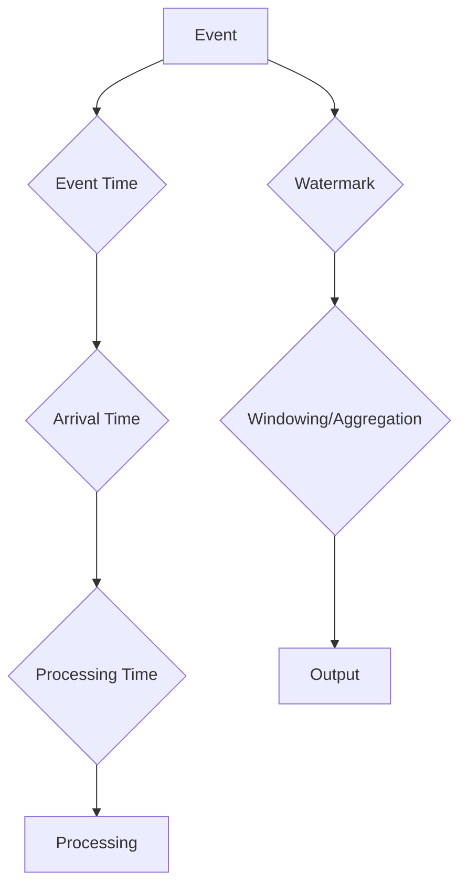

# 事件时间 原理与代码实例讲解

> 关键词：事件时间，时间序列分析，事件驱动系统，一致性，时态，状态机，事件流，Apache Kafka，时间窗口，事件溯源

## 1. 背景介绍

在信息技术的世界中，事件是数据流的核心组成部分。事件时间（Event Time）是一种描述事件发生时间的方式，它在处理实时数据流和分析时间序列数据中扮演着至关重要的角色。事件时间允许系统在处理事件时考虑到事件实际发生的时间，而不是仅仅依赖于处理时间。这种能力对于构建高可用、一致性和可扩展的事件驱动系统至关重要。

### 1.1 问题的由来

随着物联网、移动设备和云计算的兴起，数据量呈爆炸式增长。在这种背景下，对实时数据处理的需求也越来越大。事件时间提供了一种方法来确保即使在延迟和乱序事件的情况下，也能对数据流进行准确的分析。

### 1.2 研究现状

事件时间在分布式系统中得到了广泛的应用，尤其是在流处理框架中，如Apache Kafka、Apache Flink和Apache Storm。这些系统利用事件时间来保证数据的一致性和正确性。

### 1.3 研究意义

理解事件时间对于以下方面至关重要：

- **数据一致性**：确保数据处理的正确性和准确性。
- **实时分析**：在数据发生时立即进行分析，而不是等待数据完全到达。
- **容错性**：在系统出现延迟或故障时仍然能够正确处理事件。

### 1.4 本文结构

本文将分为以下几个部分：

- 核心概念与联系
- 核心算法原理 & 具体操作步骤
- 数学模型和公式 & 详细讲解 & 举例说明
- 项目实践：代码实例和详细解释说明
- 实际应用场景
- 工具和资源推荐
- 总结：未来发展趋势与挑战
- 附录：常见问题与解答

## 2. 核心概念与联系

### 2.1 核心概念

- **事件时间（Event Time）**：事件实际发生的时间，它可能不同于数据处理的时间。
- **处理时间（Processing Time）**：数据被处理的时间，通常由系统内部决定。
- **摄取时间（Arrival Time）**：事件到达系统的时间。
- **水印（Watermarks）**：用于处理乱序事件的机制，它表示事件最晚可能到达的时间。

### 2.2 核心概念原理和架构的 Mermaid 流程图



### 2.3 核心概念联系

- 事件时间与处理时间和摄取时间之间的关系是动态的，因为它们可以因为网络延迟、系统资源等因素而不同。
- 水印是处理乱序事件的关键，它允许系统知道何时可以认为所有相关事件都已到达，从而可以安全地进行窗口计算和聚合。

## 3. 核心算法原理 & 具体操作步骤

### 3.1 算法原理概述

事件时间的核心在于能够处理乱序事件，并在计算窗口和聚合时考虑到事件的实际时间顺序。

### 3.2 算法步骤详解

1. 事件到达系统时，记录其事件时间、摄取时间和水印。
2. 使用水印来确定何时可以认为所有相关事件都已到达。
3. 在事件窗口内对事件进行计算和聚合。
4. 将计算结果输出。

### 3.3 算法优缺点

#### 优点：

- **一致性**：即使在乱序事件的情况下也能保持数据的一致性。
- **实时性**：允许在数据发生时立即进行分析。

#### 缺点：

- **复杂性**：需要额外的逻辑来处理乱序事件和水印。
- **性能开销**：水印机制可能增加系统性能开销。

### 3.4 算法应用领域

- **实时分析**：股票市场分析、点击流分析等。
- **欺诈检测**：检测异常交易等。
- **监控**：系统性能监控、网络流量监控等。

## 4. 数学模型和公式 & 详细讲解 & 举例说明

### 4.1 数学模型构建

事件时间的核心模型是一个时间窗口，它可以基于事件时间或处理时间来定义。

### 4.2 公式推导过程

假设我们有一个事件时间窗口，它基于事件时间 $T$ 定义为 $[t_0, t_1]$，其中 $t_0$ 是窗口的开始时间，$t_1$ 是窗口的结束时间。窗口内的所有事件 $e$ 满足 $t_0 \leq T(e) \leq t_1$。

### 4.3 案例分析与讲解

假设我们正在分析一个电商平台的订单数据。订单事件的时间戳是事件时间。我们想要计算过去5分钟内每个用户的订单数量。

```latex
\text{Order Count per User} = \sum_{t_0 \leq T(e) \leq t_1} \mathbb{1}_{\text{User}(e) = u}
```

其中 $\mathbb{1}_{\text{User}(e) = u}$ 是一个指示函数，如果事件 $e$ 属于用户 $u$，则为1，否则为0。

## 5. 项目实践：代码实例和详细解释说明

### 5.1 开发环境搭建

为了演示事件时间的概念，我们将使用Python和Apache Kafka。

### 5.2 源代码详细实现

```python
from kafka import KafkaProducer
import json
from time import sleep

# 创建Kafka生产者
producer = KafkaProducer(bootstrap_servers=['localhost:9092'],
                         value_serializer=lambda v: json.dumps(v).encode('utf-8'))

# 发送事件
def send_event(event_time, user_id):
    event = {'event_time': event_time, 'user_id': user_id}
    producer.send('orders', event)
    producer.flush()

# 模拟发送事件
for i in range(10):
    send_event(event_time=i, user_id=1)
    sleep(1)
```

### 5.3 代码解读与分析

这段代码创建了一个Kafka生产者，用于发送模拟订单事件。每个事件包含事件时间和用户ID。

### 5.4 运行结果展示

运行上述代码后，可以在Kafka控制台中查看发送的事件。这展示了如何使用事件时间来发送和记录事件。

## 6. 实际应用场景

事件时间在实际应用中非常常见，以下是一些例子：

- **实时监控系统**：记录和监控系统事件，如错误、日志条目等。
- **欺诈检测**：检测异常交易和活动模式。
- **推荐系统**：根据用户行为历史提供个性化的推荐。

## 7. 工具和资源推荐

### 7.1 学习资源推荐

- 《Data Streams: Algorithms and Applications》
- 《Real-Time Data Streaming Systems》

### 7.2 开发工具推荐

- Apache Kafka
- Apache Flink
- Apache Storm

### 7.3 相关论文推荐

- **"The Design and Implementation of the Lambda Architecture" by Nathan Marz**
- **"Real-time Data Processing with Apache Kafka" by Neha Narkhede**

## 8. 总结：未来发展趋势与挑战

### 8.1 研究成果总结

事件时间是一种强大的数据处理范式，它允许系统在考虑到事件实际发生时间的同时处理乱序事件。

### 8.2 未来发展趋势

- 事件时间的应用将更加广泛，特别是在实时分析和监控领域。
- 将事件时间与其他数据处理技术（如机器学习）结合，以创建更复杂的分析。

### 8.3 面临的挑战

- 如何在保证性能的同时处理乱序事件。
- 如何确保事件时间的一致性和可扩展性。

### 8.4 研究展望

事件时间将继续是分布式系统和实时数据处理领域的研究重点。随着技术的进步，我们将看到更多创新的方法来解决当前面临的挑战。

## 9. 附录：常见问题与解答

**Q1：什么是事件时间？**

A：事件时间是指事件实际发生的时间，它允许系统在处理事件时考虑到事件实际发生的时间，而不是仅仅依赖于处理时间。

**Q2：事件时间与处理时间有什么区别？**

A：事件时间是事件实际发生的时间，而处理时间是数据被处理的时间。两者可以不同，因为数据可能因为网络延迟或系统资源等因素而延迟处理。

**Q3：水印在事件时间中有什么作用？**

A：水印是一个机制，用于处理乱序事件。它表示事件最晚可能到达的时间，允许系统知道何时可以认为所有相关事件都已到达。

**Q4：事件时间适用于哪些场景？**

A：事件时间适用于需要考虑事件实际发生时间的场景，如实时监控、欺诈检测和推荐系统。

**Q5：如何处理乱序事件？**

A：使用水印机制来处理乱序事件。水印表示事件最晚可能到达的时间，允许系统知道何时可以认为所有相关事件都已到达。

---

作者：禅与计算机程序设计艺术 / Zen and the Art of Computer Programming