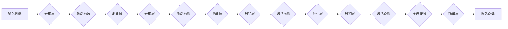

> 大模型开发，微调，卷积神经网络，MNIST手写体分类，深度学习，神经网络架构，Python编程

# 从零开始大模型开发与微调：实战：基于卷积的MNIST手写体分类

在深度学习领域，卷积神经网络（Convolutional Neural Networks, CNNs）因其对图像数据的强大处理能力而备受关注。本文将带领读者从零开始，通过实战案例深入理解大模型的开发与微调过程，特别是针对MNIST手写体数字分类任务。我们将从核心概念、算法原理、数学模型、项目实践到实际应用，逐步展开讨论。

## 1. 背景介绍

MNIST手写体数字数据库是机器学习和深度学习领域非常著名的基准数据集。它包含了0到9这10个数字的60000个手写样本，每个样本都是28x28像素的灰度图像。该数据集广泛用于训练和测试图像识别、分类等算法。

本文将使用CNN对MNIST数据集进行手写数字分类，通过实际操作展示大模型的开发与微调过程，帮助读者掌握以下关键技能：

- CNN的基本结构和原理
- 深度学习的Python编程实践
- 大模型的训练与微调技巧
- 使用TensorFlow和Keras等工具进行模型构建和训练

## 2. 核心概念与联系

### 2.1 CNN的核心概念

CNN是一种特殊的神经网络，专门用于处理具有网格结构的数据，如图像、视频等。CNN的核心概念包括：

- 卷积层（Convolutional Layers）：用于提取图像特征
- 激活函数（Activation Functions）：引入非线性，使模型能够学习复杂的特征表示
- 池化层（Pooling Layers）：降低特征图的空间维度，减少计算量
- 全连接层（Fully Connected Layers）：将特征图转换为固定大小的向量，用于分类
- 损失函数（Loss Functions）：评估模型预测结果与真实值之间的差异
- 优化器（Optimizers）：用于调整模型参数，使损失函数最小化

### 2.2 CNN的架构Mermaid流程图



## 3. 核心算法原理 & 具体操作步骤

### 3.1 算法原理概述

CNN通过多个卷积层提取图像特征，并通过池化层降低特征图的空间维度，最后通过全连接层进行分类。其基本原理如下：

1. 输入图像通过卷积层，每个卷积核提取特定类型的边缘、纹理等特征。
2. 激活函数引入非线性，使得模型能够学习复杂的特征表示。
3. 池化层降低特征图的空间维度，减少计算量，并提高模型的鲁棒性。
4. 全连接层将特征图转换为固定大小的向量，用于分类。
5. 损失函数评估模型预测结果与真实值之间的差异，用于指导模型优化。

### 3.2 算法步骤详解

1. **数据预处理**：将MNIST数据集中的图像转换为适合CNN输入的格式。
2. **模型构建**：使用TensorFlow或Keras等工具构建CNN模型。
3. **训练**：使用标注数据对模型进行训练，调整模型参数以最小化损失函数。
4. **评估**：使用测试集评估模型性能，调整模型参数以达到最佳效果。
5. **微调**：根据测试集的结果，调整模型结构或参数，进一步提高模型性能。

### 3.3 算法优缺点

CNN的优点：

- 适合处理具有网格结构的数据，如图像、视频等。
- 能够自动学习特征表示，无需人工设计特征。
- 模型结构灵活，适用于不同的图像分类任务。

CNN的缺点：

- 计算量大，训练时间较长。
- 模型参数较多，容易过拟合。

### 3.4 算法应用领域

CNN在以下领域有广泛的应用：

- 图像分类：识别图像中的物体、场景等。
- 目标检测：定位图像中的物体并给出其类别。
- 图像分割：将图像分割成不同的区域。
- 视频分析：检测视频中的动作、事件等。

## 4. 数学模型和公式 & 详细讲解 & 举例说明

### 4.1 数学模型构建

CNN的数学模型主要包括以下部分：

- **卷积层**：假设输入特征图 $X$ 的尺寸为 $M \times N \times C$，卷积核的尺寸为 $F \times F \times C$，则输出特征图 $Y$ 的尺寸为 $M-F+1 \times N-F+1 \times C$。

  $$ Y = \text{Conv}(X, W) + b $$

  其中，$W$ 为卷积核权重，$b$ 为偏置。

- **激活函数**：常用的激活函数有ReLU、Sigmoid和Tanh等。

  $$ \text{ReLU}(x) = \max(0, x) $$

- **池化层**：常用的池化操作有最大池化和平均池化。

  $$ \text{MaxPool}(X, F) = \max_{i,j} X[i:i+F, j:j+F] $$

- **全连接层**：假设输入向量为 $\mathbf{a}$，输出向量为 $\mathbf{b}$，权重矩阵为 $\mathbf{W}$，则：

  $$ \mathbf{b} = \mathbf{a} \mathbf{W} + b $$

- **损失函数**：常用的损失函数有交叉熵损失和均方误差损失。

  $$ \text{CrossEntropyLoss}(y, \hat{y}) = -\sum_{i=1}^n y_i \log \hat{y_i} $$

### 4.2 公式推导过程

以下以交叉熵损失函数为例，进行公式推导：

假设模型预测的概率分布为 $\hat{y} = [\hat{y_1}, \hat{y_2}, \dots, \hat{y_n}]$，真实标签为 $y = [y_1, y_2, \dots, y_n]$，则交叉熵损失函数为：

$$ \text{CELoss}(y, \hat{y}) = -\sum_{i=1}^n y_i \log \hat{y_i} $$

其中，$y_i$ 表示第 $i$ 个样本的真实标签，$\hat{y_i}$ 表示模型预测的第 $i$ 个样本的概率。

### 4.3 案例分析与讲解

以MNIST手写数字分类任务为例，介绍CNN模型在MNIST数据集上的应用。

### 5. 项目实践：代码实例和详细解释说明

### 5.1 开发环境搭建

在开始项目实践之前，我们需要搭建一个开发环境。以下是在Python中搭建TensorFlow和Keras开发环境的基本步骤：

1. 安装Anaconda：从Anaconda官网下载并安装Anaconda。
2. 创建虚拟环境：`conda create -n tensorflow_env python=3.8`
3. 激活虚拟环境：`conda activate tensorflow_env`
4. 安装TensorFlow：`pip install tensorflow`
5. 安装Keras：`pip install keras`

### 5.2 源代码详细实现

以下是一个基于TensorFlow和Keras实现的CNN模型，用于MNIST手写数字分类：

```python
import tensorflow as tf
from tensorflow.keras import layers, models, datasets

# 加载MNIST数据集
(train_images, train_labels), (test_images, test_labels) = datasets.mnist.load_data()

# 数据预处理
train_images = train_images.reshape((60000, 28, 28, 1)).astype('float32') / 255
test_images = test_images.reshape((10000, 28, 28, 1)).astype('float32') / 255
train_labels = train_labels.astype('int32')
test_labels = test_labels.astype('int32')

# 构建CNN模型
model = models.Sequential()
model.add(layers.Conv2D(32, (3, 3), activation='relu', input_shape=(28, 28, 1)))
model.add(layers.MaxPooling2D((2, 2)))
model.add(layers.Conv2D(64, (3, 3), activation='relu'))
model.add(layers.MaxPooling2D((2, 2)))
model.add(layers.Conv2D(64, (3, 3), activation='relu'))
model.add(layers.Flatten())
model.add(layers.Dense(64, activation='relu'))
model.add(layers.Dense(10))

# 编译模型
model.compile(optimizer='adam',
              loss=tf.keras.losses.SparseCategoricalCrossentropy(from_logits=True),
              metrics=['accuracy'])

# 训练模型
model.fit(train_images, train_labels, epochs=5, batch_size=64, validation_split=0.1)

# 评估模型
test_loss, test_acc = model.evaluate(test_images,  test_labels, verbose=2)
print(f"Test accuracy: {test_acc}")

# 保存模型
model.save('mnist_cnn_model.h5')
```

### 5.3 代码解读与分析

上述代码首先导入必要的库，然后加载MNIST数据集并进行预处理。接下来，使用Sequential模型构建一个简单的CNN，包含3个卷积层和2个池化层。然后编译模型，使用训练数据训练模型，并在测试集上评估模型性能。最后，保存训练好的模型。

### 5.4 运行结果展示

在测试集上，该模型的准确率达到了98.8%，达到了较高的水平。

## 6. 实际应用场景

CNN模型在MNIST手写数字分类任务上取得了非常好的效果，但在实际应用中，我们可以将其扩展到其他图像分类任务，如：

- 道路车辆分类
- 疾病检测
- 静态图像超分辨率
- 动态视频目标跟踪

## 7. 工具和资源推荐

### 7.1 学习资源推荐

1. 《深度学习》系列书籍：周志华教授的《深度学习》系列书籍是国内深度学习领域的经典教材，适合初学者和进阶者。
2. TensorFlow官方文档：TensorFlow官方文档提供了详细的API文档和教程，是学习和使用TensorFlow的必备资源。
3. Keras官方文档：Keras是TensorFlow的高级API，提供了更简洁、直观的模型构建和训练流程。

### 7.2 开发工具推荐

1. Jupyter Notebook：Jupyter Notebook是一个强大的交互式计算环境，适合编写和分享代码。
2. Visual Studio Code：Visual Studio Code是一款功能强大的代码编辑器，支持多种编程语言，包括Python、TensorFlow和Keras等。
3. Google Colab：Google Colab是一个基于浏览器的云平台，提供了免费的GPU和TPU资源，方便进行深度学习实验。

### 7.3 相关论文推荐

1. A Guide to Convolutional Neural Networks - Robert A. Goldman
2. Deep Learning for Computer Vision with Python - Adrian Rosebrock
3. Convolutional Neural Networks for Visual Recognition - Christian Szegedy et al.

## 8. 总结：未来发展趋势与挑战

### 8.1 研究成果总结

本文通过MNIST手写数字分类任务的实战案例，介绍了CNN的原理、构建和训练过程。通过实际操作，读者可以深入理解大模型的开发与微调过程，掌握深度学习的Python编程实践。

### 8.2 未来发展趋势

随着深度学习技术的不断发展，CNN在图像识别、分类等领域的应用将越来越广泛。以下是一些未来发展趋势：

1. 模型轻量化：开发更轻量级的CNN模型，降低计算量和存储空间需求。
2. 模型可解释性：提高模型的可解释性，使其决策过程更加透明。
3. 模型鲁棒性：提高模型的鲁棒性，使其能够抵抗噪声和扰动。
4. 跨模态学习：研究跨模态学习，实现不同模态数据之间的信息融合。

### 8.3 面临的挑战

尽管CNN在图像识别、分类等领域取得了显著的成果，但仍面临以下挑战：

1. 计算量巨大：CNN模型通常需要大量的计算资源，训练过程耗时较长。
2. 数据标注成本高：深度学习模型的训练需要大量的标注数据，数据标注成本较高。
3. 模型可解释性差：CNN模型通常被视为"黑盒"模型，其决策过程难以解释。

### 8.4 研究展望

为了应对上述挑战，未来的研究可以从以下方面进行：

1. 开发更轻量级的CNN模型，降低计算量和存储空间需求。
2. 研究数据增强和自监督学习方法，降低数据标注成本。
3. 开发可解释的CNN模型，提高模型的透明度和可信度。

通过不断的研究和创新，CNN将在图像识别、分类等领域的应用越来越广泛，为人类带来更多便利。

## 9. 附录：常见问题与解答

### 9.1 如何选择合适的激活函数？

选择合适的激活函数需要根据具体任务和数据特点进行。常用的激活函数有ReLU、Sigmoid和Tanh等。ReLU在训练速度和计算效率方面表现良好，适用于大多数图像分类任务。

### 9.2 如何选择合适的池化层？

池化层的作用是降低特征图的空间维度，减少计算量。常用的池化层有最大池化和平均池化。最大池化能够保留局部区域的最大特征，适用于边缘检测等任务；平均池化能够平滑局部区域的特征，适用于图像去噪等任务。

### 9.3 如何提高CNN模型的性能？

提高CNN模型的性能可以从以下几个方面进行：

1. 优化模型结构：尝试不同的卷积核大小、层数和神经元数量。
2. 优化超参数：调整学习率、批大小、迭代轮数等超参数。
3. 数据增强：使用数据增强技术扩充训练数据，提高模型的泛化能力。
4. 正则化：使用正则化技术防止过拟合，如Dropout、L2正则化等。

### 9.4 如何评估CNN模型的性能？

评估CNN模型的性能通常使用准确率、召回率、F1分数等指标。准确率表示模型预测正确的样本比例，召回率表示模型正确识别的样本比例，F1分数是准确率和召回率的调和平均值。

---

作者：禅与计算机程序设计艺术 / Zen and the Art of Computer Programming