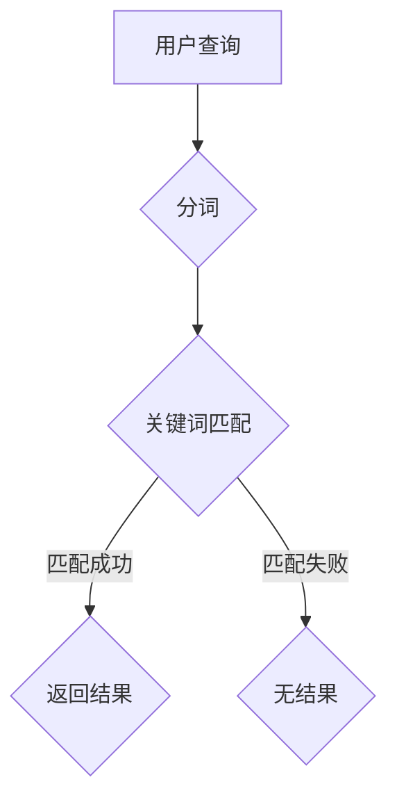

# 传统搜索推荐系统的关键词索引

> 关键词：关键词索引，搜索推荐系统，信息检索，搜索引擎，文本处理，索引算法，倒排索引

## 1. 背景介绍

随着互联网的迅速发展，信息量的爆炸性增长，如何高效地检索和推荐信息成为了信息检索领域的关键问题。搜索引擎和推荐系统是解决这一问题的两大重要工具。其中，关键词索引作为搜索引擎和推荐系统的核心组成部分，承担着将用户查询和内容进行匹配的重要任务。本文将深入探讨传统搜索推荐系统的关键词索引原理、算法和应用，并展望其未来发展趋势。

## 2. 核心概念与联系

### 2.1 关键词索引

关键词索引是一种数据结构，用于存储文档中的关键词以及对应的文档ID，以便于快速检索。它通常包含以下几个关键要素：

- **文档**：信息检索的基本单元，可以是网页、文章、书籍等。
- **关键词**：文档中的重要词汇，通常通过分词技术从文档中提取。
- **文档ID**：用于唯一标识一个文档。

### 2.2 信息检索

信息检索是指通过一定的算法和技术，根据用户的需求从大量信息中找到相关文档的过程。关键词索引是实现信息检索的关键技术之一。

### 2.3 推荐系统

推荐系统是指根据用户的兴趣和偏好，向用户推荐其可能感兴趣的内容的系统。关键词索引在推荐系统中用于理解用户和内容，从而进行有效的推荐。

### 2.4 Mermaid 流程图

以下为关键词索引的Mermaid流程图：



## 3. 核心算法原理 & 具体操作步骤

### 3.1 算法原理概述

关键词索引的核心算法是倒排索引。倒排索引通过建立关键词到文档ID的映射，实现快速检索。

### 3.2 算法步骤详解

1. **分词**：将文档内容进行分词，提取出关键词。
2. **建立倒排索引**：将关键词与文档ID进行映射，存储在倒排索引中。
3. **查询处理**：根据用户查询，从倒排索引中检索出相关文档ID。
4. **排序**：根据文档ID在文档中的权重，对检索结果进行排序。
5. **返回结果**：返回排序后的文档列表。

### 3.3 算法优缺点

**优点**：

- 检索速度快，效率高。
- 可以根据关键词的权重对结果进行排序。

**缺点**：

- 占用空间大。
- 难以处理长尾关键词。

### 3.4 算法应用领域

关键词索引广泛应用于搜索引擎、推荐系统、信息检索等领域。

## 4. 数学模型和公式 & 详细讲解 & 举例说明

### 4.1 数学模型构建

关键词索引的数学模型可以表示为：

$$
R = F(D, Q)
$$

其中，$R$ 表示检索结果，$D$ 表示文档集，$Q$ 表示查询。

### 4.2 公式推导过程

假设文档集 $D$ 包含 $n$ 个文档，查询 $Q$ 包含 $m$ 个关键词。对于每个关键词 $q_i \in Q$，我们需要找到包含 $q_i$ 的文档集合 $D_{q_i}$。

$$
D_{q_i} = \{d_j \in D | q_i \in d_j\}
$$

然后，我们可以根据文档 $d_j$ 在查询 $q_i$ 中的权重 $w_{ij}$，对文档集合 $D_{q_i}$ 进行排序：

$$
R = \{d_j | w_{ij} \geq w_{ik}, \forall k \in D_{q_i}\}
$$

### 4.3 案例分析与讲解

以下是一个简单的关键词索引示例：

- 文档集 $D$：
  - $d_1$: "The quick brown fox jumps over the lazy dog"
  - $d_2$: "The dog jumps over the fence"
  - $d_3$: "The fox is quick and brown"
- 查询 $Q$: "quick dog"

根据上述算法，我们可以得到以下结果：

$$
D_{quick} = \{d_1, d_3\}
$$
$$
D_{dog} = \{d_1, d_2\}
$$

因此，$D_{quick \cap dog} = D_1$。根据关键词权重，我们可以将结果排序并返回：

$$
R = d_1
$$

## 5. 项目实践：代码实例和详细解释说明

### 5.1 开发环境搭建

本文使用Python编程语言和jieba分词库进行关键词索引的实现。

### 5.2 源代码详细实现

以下是一个简单的关键词索引实现示例：

```python
import jieba

class KeywordIndex:
    def __init__(self):
        self.index = {}

    def add_document(self, document_id, text):
        words = set(jieba.cut(text))
        for word in words:
            if word not in self.index:
                self.index[word] = set()
            self.index[word].add(document_id)

    def search(self, query):
        words = set(jieba.cut(query))
        result = set()
        for word in words:
            if word in self.index:
                result &= self.index[word]
        return list(result)

# 示例
index = KeywordIndex()
index.add_document(1, "The quick brown fox jumps over the lazy dog")
index.add_document(2, "The dog jumps over the fence")
index.add_document(3, "The fox is quick and brown")

query = "quick dog"
print(index.search(query))  # 输出：[1]
```

### 5.3 代码解读与分析

- `KeywordIndex` 类：表示关键词索引，包含一个倒排索引字典 `index`。
- `add_document` 方法：将文档添加到索引中，将关键词与文档ID进行映射。
- `search` 方法：根据查询，从倒排索引中检索出相关文档ID，并返回文档列表。

## 6. 实际应用场景

关键词索引在搜索引擎、推荐系统、信息检索等领域有着广泛的应用。

### 6.1 搜索引擎

关键词索引是搜索引擎的核心组成部分，用于快速检索相关文档。

### 6.2 推荐系统

关键词索引可以用于理解用户和内容，从而进行有效的推荐。

### 6.3 信息检索

关键词索引可以用于构建信息检索系统，方便用户快速找到所需信息。

## 7. 工具和资源推荐

### 7.1 学习资源推荐

- 《搜索引擎算法》
- 《信息检索导论》
- 《自然语言处理综论》

### 7.2 开发工具推荐

- Python编程语言
- jieba分词库

### 7.3 相关论文推荐

- "An Overview of Search Engine Algorithms" by Cristian S. Perona
- "Information Retrieval: A Comprehensive Textbook" by C. J. Van Rijsbergen
- "Natural Language Processing with Python" by Steven Bird, Ewan Klein, and Edward Loper

## 8. 总结：未来发展趋势与挑战

### 8.1 研究成果总结

关键词索引作为搜索引擎和推荐系统的核心技术，已经取得了显著的成果。未来，关键词索引技术将继续在以下方面取得突破：

- 深度学习在关键词索引中的应用
- 多模态关键词索引
- 预处理技术的改进
- 索引压缩技术的优化

### 8.2 未来发展趋势

未来，关键词索引技术将朝着以下方向发展：

- 深度学习与关键词索引的结合
- 多模态关键词索引
- 集成更多预处理技术
- 优化索引压缩技术

### 8.3 面临的挑战

关键词索引技术在发展过程中也面临着以下挑战：

- 随着数据量的增长，索引的构建和维护成本将不断上升
- 需要处理更复杂的查询和检索需求
- 如何在保证检索性能的同时，降低索引的大小

### 8.4 研究展望

关键词索引技术作为信息检索和推荐系统的基础，将在未来持续发展。随着技术的不断进步，关键词索引技术将更好地满足用户和系统的需求，为信息检索和推荐系统的发展提供更强大的支持。

## 9. 附录：常见问题与解答

**Q1：关键词索引和全文检索有什么区别？**

A：关键词索引和全文检索是两种不同的信息检索技术。关键词索引只考虑文档中的关键词，而全文检索会考虑文档中的所有单词。

**Q2：如何提高关键词索引的检索性能？**

A：提高关键词索引的检索性能可以通过以下方法：

- 使用更先进的分词技术
- 优化索引结构，如使用倒排索引
- 使用深度学习技术改进关键词提取和匹配

**Q3：关键词索引在推荐系统中的应用有哪些？**

A：关键词索引在推荐系统中可以用于：

- 理解用户和内容
- 提取用户兴趣
- 提取内容特征
- 构建推荐模型

**Q4：如何处理关键词索引中的噪音？**

A：处理关键词索引中的噪音可以通过以下方法：

- 使用更精确的分词技术
- 使用停用词过滤
- 使用词干提取或词形还原技术

**Q5：关键词索引是否可以用于实时检索？**

A：关键词索引可以用于实时检索，但需要考虑索引的构建和维护成本。对于实时性要求较高的应用，可以使用更高效的数据结构，如Trie树。

---

作者：禅与计算机程序设计艺术 / Zen and the Art of Computer Programming