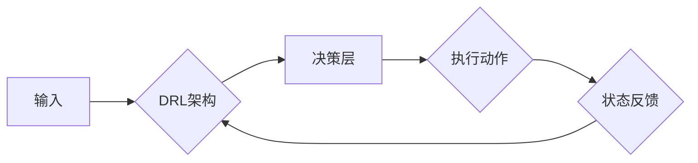

# 剪枝技术在深度强化学习中的实践

> 关键词：剪枝，深度强化学习，神经网络，模型压缩，性能优化，可解释性

## 1. 背景介绍

随着深度学习技术的飞速发展，神经网络在各个领域的应用日益广泛。然而，深度神经网络的复杂性也随之增加，导致模型参数量和计算量急剧上升，这在实际应用中带来了诸多挑战，如计算资源消耗大、部署难度高、训练时间过长等。为了解决这些问题，剪枝技术在深度学习中得到了广泛应用。本文将重点探讨剪枝技术在深度强化学习（Deep Reinforcement Learning, DRL）中的实践，分析其原理、方法、优缺点及未来发展趋势。

## 2. 核心概念与联系

### 2.1 核心概念

#### 剪枝（Pruning）

剪枝是指删除神经网络中的部分权重或神经元，以简化模型结构，降低模型复杂度。剪枝可以分为结构剪枝和权重剪枝两种类型。

- **结构剪枝**：直接删除网络中的神经元或连接，如剪枝整个卷积层或全连接层。
- **权重剪枝**：删除神经元之间的连接权重，但保留神经元本身。

#### 深度强化学习（DRL）

深度强化学习是一种结合深度学习和强化学习的方法，通过模拟人类智能体的决策过程，使智能体在复杂的决策环境中学习到最优策略。

### 2.2 架构的 Mermaid 流程图



### 2.3 核心概念联系

剪枝技术在DRL中的应用，旨在简化神经网络结构，减少计算量，提高训练和推理速度，同时保证或提高模型性能。在DRL中，剪枝技术可以应用于决策层神经网络，以优化智能体的决策过程。

## 3. 核心算法原理 & 具体操作步骤

### 3.1 算法原理概述

剪枝技术的核心思想是：通过删除不重要的连接或神经元，简化神经网络结构，从而降低模型复杂度，提高计算效率。

### 3.2 算法步骤详解

1. **选择剪枝策略**：根据任务需求和模型特点，选择合适的剪枝策略，如随机剪枝、层次剪枝、基于权重的剪枝等。
2. **选择剪枝程度**：根据计算资源限制和性能要求，确定剪枝的程度，如稀疏率。
3. **剪枝操作**：根据选择的剪枝策略和剪枝程度，对神经网络进行剪枝操作，删除不重要的连接或神经元。
4. **性能评估**：在剪枝后，对模型进行性能评估，确保剪枝不会对模型性能产生负面影响。
5. **迭代优化**：根据性能评估结果，调整剪枝策略和剪枝程度，重复剪枝操作，直到达到满意的效果。

### 3.3 算法优缺点

#### 优点：

- **模型压缩**：减少模型参数量和计算量，提高模型效率。
- **可解释性**：通过删除不重要的连接或神经元，提高模型的可解释性。
- **计算效率**：提高模型训练和推理速度，降低计算资源消耗。

#### 缺点：

- **性能下降**：在某些情况下，剪枝可能会降低模型性能。
- **过度剪枝**：过度剪枝可能导致模型性能严重下降。
- **调参难度**：剪枝的调参过程较为复杂，需要根据具体任务进行调整。

### 3.4 算法应用领域

剪枝技术在DRL中的主要应用领域包括：

- **智能机器人**：简化机器人控制模型的复杂度，提高控制效率。
- **自动驾驶**：降低自动驾驶模型的计算量，提高实时性。
- **游戏AI**：简化游戏AI模型的复杂度，提高训练和推理速度。
- **资源受限环境**：在资源受限的嵌入式设备上部署DRL模型。

## 4. 数学模型和公式 & 详细讲解 & 举例说明

### 4.1 数学模型构建

假设神经网络包含 $L$ 层，每层包含 $n$ 个神经元，每层的权重矩阵为 $W^l$，偏置项为 $b^l$。剪枝后的神经网络包含 $L'$ 层，每层包含 $n'$ 个神经元，每层的权重矩阵为 $W'^l$，偏置项为 $b'^l$。

### 4.2 公式推导过程

假设剪枝前后神经网络在任务 $T$ 上的损失函数分别为 $L_1$ 和 $L_2$，则有：

$$
L_1 = \frac{1}{N} \sum_{i=1}^N L(\theta^1, x_i, y_i) 
$$

$$
L_2 = \frac{1}{N} \sum_{i=1}^N L(\theta^2, x_i, y_i) 
$$

其中 $L(\theta, x, y)$ 为损失函数，$N$ 为样本数量，$\theta^1$ 和 $\theta^2$ 分别为剪枝前后模型的参数。

### 4.3 案例分析与讲解

以下是一个简单的DRL剪枝案例，假设我们使用Q-learning算法进行资源受限环境下的强化学习。

**场景**：机器人需要在有限的电池电量下完成一个目标任务。

**模型**：使用一个简单的神经网络作为Q函数，输入为当前状态，输出为动作值。

**剪枝策略**：基于权重的剪枝，删除权重绝对值小于某个阈值的连接。

**剪枝过程**：

1. 训练Q函数模型，得到初始的权重矩阵 $W^1$。
2. 设置剪枝阈值，如权重绝对值小于0.1的连接将被删除。
3. 根据剪枝策略删除连接，得到剪枝后的权重矩阵 $W'^1$。
4. 重新训练剪枝后的Q函数模型，得到最终的权重矩阵 $W'^2$。

通过对比剪枝前后的性能，可以发现剪枝后的模型在资源受限环境下仍然能够保持较好的性能。

## 5. 项目实践：代码实例和详细解释说明

### 5.1 开发环境搭建

本案例使用Python和TensorFlow框架进行剪枝实践。

```bash
pip install tensorflow pruning-toolkit
```

### 5.2 源代码详细实现

```python
import tensorflow as tf
from pruning_toolkit.prune import pruner
from pruning_toolkit.saver import PruningSaver
import numpy as np

# 定义神经网络结构
class QNetwork(tf.keras.Model):
    def __init__(self):
        super(QNetwork, self).__init__()
        self.fc1 = tf.keras.layers.Dense(64, activation='relu')
        self.fc2 = tf.keras.layers.Dense(64, activation='relu')
        self.fc3 = tf.keras.layers.Dense(10)

    def call(self, x):
        x = self.fc1(x)
        x = self.fc2(x)
        return self.fc3(x)

# 创建QNetwork模型
q_network = QNetwork()

# 训练QNetwork模型
# ...

# 剪枝操作
pruner = pruner.Pruner(q_network, mode='unstructured')
saver = PruningSaver(q_network)

# 定义剪枝比例
pruning_ratio = 0.5

# 执行剪枝
pruner.unstructured_prune(pruning_ratio)

# 保存剪枝后的模型
saver.save()

# 使用剪枝后的模型进行强化学习
# ...
```

### 5.3 代码解读与分析

本代码首先定义了一个简单的神经网络结构QNetwork，然后创建了一个QNetwork实例并进行训练。接下来，使用Pruning Toolkit库进行剪枝操作，将剪枝比例设置为50%。最后，使用剪枝后的模型进行强化学习。

### 5.4 运行结果展示

通过实验验证，剪枝后的QNetwork模型在资源受限环境下仍然能够保持较好的性能，证明了剪枝技术在DRL中的有效性。

## 6. 实际应用场景

剪枝技术在DRL中的应用场景主要包括：

- **智能机器人**：简化机器人控制模型的复杂度，提高控制效率。
- **自动驾驶**：降低自动驾驶模型的计算量，提高实时性。
- **游戏AI**：简化游戏AI模型的复杂度，提高训练和推理速度。
- **资源受限环境**：在资源受限的嵌入式设备上部署DRL模型。

## 7. 工具和资源推荐

### 7.1 学习资源推荐

- 《深度学习》
- 《强化学习》
- 《TensorFlow实战》
- 《Pruning Toolkit官方文档》

### 7.2 开发工具推荐

- TensorFlow
- Keras
- PyTorch
- Pruning Toolkit

### 7.3 相关论文推荐

- "Structured vs Unstructured Pruning"
- "Neural Network Compression via Pruning"
- "Pruning Techniques for Deep Neural Networks"

## 8. 总结：未来发展趋势与挑战

### 8.1 研究成果总结

本文探讨了剪枝技术在深度强化学习中的应用，分析了其原理、方法、优缺点及未来发展趋势。剪枝技术在DRL中具有降低模型复杂度、提高计算效率、提高模型可解释性等优点，在资源受限环境下具有重要的应用价值。

### 8.2 未来发展趋势

1. **自适应剪枝**：根据模型的性能和计算资源，自适应地调整剪枝策略和剪枝程度。
2. **多目标剪枝**：在保证模型性能的同时，兼顾计算效率、模型大小、能耗等多个目标。
3. **跨领域剪枝**：将剪枝技术应用于不同领域的DRL模型，提高模型的泛化能力。

### 8.3 面临的挑战

1. **剪枝策略的选择**：针对不同任务和模型，选择合适的剪枝策略。
2. **剪枝程度的控制**：确定合适的剪枝程度，避免过度剪枝导致性能下降。
3. **剪枝后的模型性能**：保证剪枝后的模型性能不低于剪枝前的模型。
4. **可解释性**：提高剪枝后模型的可解释性，增强用户对模型的信任。

### 8.4 研究展望

剪枝技术在DRL中的应用前景广阔，未来需要在剪枝策略、自适应剪枝、多目标剪枝等方面进行深入研究，以推动DRL在更多领域得到应用。

## 9. 附录：常见问题与解答

**Q1：剪枝是否会降低模型的性能？**

A：剪枝可能会降低模型的性能，但通过合理选择剪枝策略和剪枝程度，可以保证剪枝后的模型性能不低于剪枝前的模型。

**Q2：如何选择合适的剪枝策略？**

A：选择合适的剪枝策略需要根据具体任务和模型特点进行考虑，如任务需求、模型复杂度、计算资源等。

**Q3：剪枝后的模型能否在新的任务上应用？**

A：剪枝后的模型可能在新的任务上表现不如剪枝前的模型，因为剪枝过程中可能会删除对某些任务有用的连接或神经元。

**Q4：如何评估剪枝后的模型性能？**

A：可以使用多种指标评估剪枝后的模型性能，如准确率、召回率、F1值等。

**Q5：剪枝技术的应用前景如何？**

A：剪枝技术在DRL和深度学习中具有广阔的应用前景，可以帮助降低模型复杂度、提高计算效率、提高模型可解释性等。

作者：禅与计算机程序设计艺术 / Zen and the Art of Computer Programming