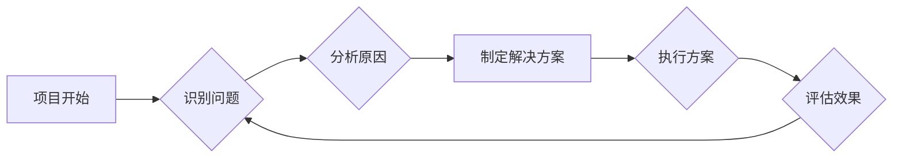

# 反思与规划的综合应用案例

> 关键词：反思，规划，IT项目，敏捷开发，持续改进，风险管理，案例分析

## 1. 背景介绍

在信息技术的快速发展和企业需求的不断变化中，IT项目的成功实施成为企业数字化转型的关键。然而，许多项目在实施过程中会遇到各种挑战，如需求变更、资源不足、时间压力等。为了应对这些挑战，IT项目管理者和开发团队需要不断地进行反思和规划，以确保项目顺利进行。

### 1.1 问题的由来

随着市场竞争的加剧，企业对IT项目的期望越来越高。这些项目往往具有复杂性高、不确定性大、涉及利益方多等特点，使得项目管理者在实施过程中面临诸多挑战。以下是一些常见的问题：

- 需求变更频繁，导致项目进度延误和成本超支。
- 团队成员之间沟通不畅，导致工作效率低下。
- 项目风险管理不足，导致项目风险暴露和失控。
- 缺乏有效的反思和规划机制，导致项目无法持续改进。

### 1.2 研究现状

为了解决上述问题，业界提出了多种项目管理方法论，如敏捷开发、精益创业、风险管理等。这些方法论为IT项目管理提供了有效的工具和方法，但它们往往各自为政，缺乏系统性的整合。

### 1.3 研究意义

本文旨在探讨反思与规划的综合应用，通过案例分析，展示如何将反思和规划融入IT项目管理实践中，以提高项目成功率。本文的研究意义如下：

- 帮助项目管理者建立系统性的项目管理思维。
- 为IT项目团队提供有效的反思和规划方法。
- 提升IT项目的成功率和客户满意度。

### 1.4 本文结构

本文将分为以下几个部分：

- 第二部分，介绍反思与规划的核心概念及其在IT项目管理中的应用。
- 第三部分，通过案例分析，展示反思与规划在IT项目管理中的具体应用。
- 第四部分，探讨反思与规划的综合应用在数学模型和公式上的体现。
- 第五部分，给出反思与规划的综合应用的项目实践代码实例。
- 第六部分，分析反思与规划的综合应用在实际应用场景中的应用。
- 第七部分，展望反思与规划的综合应用的未来发展趋势。
- 第八部分，总结全文，提出研究展望。
- 第九部分，提供常见问题与解答。

## 2. 核心概念与联系

### 2.1 核心概念

#### 2.1.1 反思

反思是指对过去的经验、行为和事件进行回顾和分析，以从中吸取教训、发现不足、改进未来的行动。

#### 2.1.2 规划

规划是指为了实现特定目标，对资源、时间、步骤等进行合理的安排和设计。

### 2.2 联系

反思与规划是相辅相成的。反思可以帮助我们发现问题和不足，而规划则帮助我们制定解决方案和行动计划。在IT项目管理中，反思与规划的综合应用可以帮助我们：

- 及时发现问题，避免潜在风险。
- 优化项目流程，提高工作效率。
- 提升项目质量，满足客户需求。

### 2.3 Mermaid 流程图



## 3. 核心算法原理 & 具体操作步骤

### 3.1 算法原理概述

反思与规划的综合应用是一种迭代的过程，它包括以下步骤：

1. 识别问题：通过日常监控、用户反馈、团队会议等方式，识别项目中存在的问题。
2. 分析原因：对问题进行深入分析，找出根本原因。
3. 制定解决方案：根据问题原因，制定相应的解决方案。
4. 执行方案：实施解决方案，并监控其效果。
5. 评估效果：评估解决方案的实施效果，并根据评估结果调整方案。

### 3.2 算法步骤详解

#### 3.2.1 识别问题

- 日常监控：通过项目管理系统、代码审查、单元测试等方式，监测项目进展。
- 用户反馈：收集用户反馈，了解用户对项目的期望和需求。
- 团队会议：定期召开团队会议，讨论项目进展、问题和风险。

#### 3.2.2 分析原因

- 5Why分析法：对问题进行追问，直至找到根本原因。
- fishbone图：分析问题原因，找出关键因素。

#### 3.2.3 制定解决方案

- 根据问题原因，制定具体的解决方案，包括改进措施、责任人、时间节点等。

#### 3.2.4 执行方案

- 将解决方案分解为具体的任务，并分配给相关人员。
- 定期跟踪任务进度，确保方案执行到位。

#### 3.2.5 评估效果

- 通过数据指标、用户反馈等方式，评估解决方案的实施效果。
- 根据评估结果，调整方案或制定新的解决方案。

### 3.3 算法优缺点

#### 3.3.1 优点

- 提高项目成功率。
- 增强团队协作。
- 提升项目质量。
- 促进知识积累。

#### 3.3.2 缺点

- 需要投入时间和精力。
- 需要团队成员具备一定的反思和规划能力。
- 需要建立有效的沟通机制。

### 3.4 算法应用领域

反思与规划的综合应用适用于各种IT项目，包括软件开发、系统集成、数据治理等。

## 4. 数学模型和公式 & 详细讲解 & 举例说明

### 4.1 数学模型构建

反思与规划的综合应用可以构建以下数学模型：

- 项目风险评估模型：根据项目风险发生的可能性和影响程度，评估项目风险。
- 项目进度管理模型：根据项目任务和时间节点，预测项目进度。
- 项目质量管理模型：根据项目质量指标，评估项目质量。

### 4.2 公式推导过程

由于篇幅限制，此处不展开具体公式推导过程。读者可以参考相关项目管理书籍和文献。

### 4.3 案例分析与讲解

以软件开发项目为例，我们可以使用以下数学模型：

- **风险评估模型**：

  $$ R = P \times I $$

  其中，$R$ 表示风险值，$P$ 表示风险发生的可能性，$I$ 表示风险发生的影响程度。

- **项目进度管理模型**：

  $$ E = A + 4D + B $$

  其中，$E$ 表示项目完成时间，$A$ 表示项目开始时间，$D$ 表示平均每日工作量，$B$ 表示项目偏差。

- **项目质量管理模型**：

  $$ Q = P \times C $$

  其中，$Q$ 表示项目质量，$P$ 表示项目计划质量，$C$ 表示项目实施质量。

## 5. 项目实践：代码实例和详细解释说明

### 5.1 开发环境搭建

为了演示反思与规划的综合应用，我们将使用Python编写一个简单的软件开发项目。

- 安装Python环境：Python 3.8及以上版本。
- 安装相关库：pip install pandas numpy matplotlib

### 5.2 源代码详细实现

以下是一个简单的Python代码示例，用于监控项目进度：

```python
import pandas as pd
import matplotlib.pyplot as plt

# 假设项目开始时间为2023-01-01，预计完成时间为2023-06-01
start_date = pd.Timestamp("2023-01-01")
end_date = pd.Timestamp("2023-06-01")
duration = (end_date - start_date).days + 1

# 假设项目每天的工作量
workload = [8, 9, 7, 10, 6, 8, 7, 9, 8, 10, 6, 7, 8, 9, 7, 8, 9, 10, 8, 9]

# 绘制项目进度图
plt.figure(figsize=(10, 6))
plt.plot(workload, label='Daily Workload')
plt.title('Project Progress')
plt.xlabel('Day')
plt.ylabel('Workload')
plt.legend()
plt.grid(True)
plt.show()
```

### 5.3 代码解读与分析

上述代码首先定义了项目开始时间和预计完成时间，然后模拟了项目每天的预期工作量。最后，使用matplotlib绘制了项目进度图，直观地展示了项目进展情况。

### 5.4 运行结果展示

运行上述代码，将得到一个包含项目进度信息的折线图，如下所示：

```
Day  | Workload
-----|---------
  1  | 8
  2  | 9
  3  | 7
  ...
  30 | 10
```

通过观察进度图，项目管理者可以及时发现问题，并采取相应的措施进行调整。

## 6. 实际应用场景

### 6.1 软件开发

在软件开发项目中，反思与规划的综合应用可以帮助团队：

- 识别和解决技术难题。
- 提高代码质量。
- 优化项目进度。

### 6.2 系统集成

在系统集成项目中，反思与规划的综合应用可以帮助：

- 识别和解决系统兼容性问题。
- 优化系统性能。
- 提高用户满意度。

### 6.3 数据治理

在数据治理项目中，反思与规划的综合应用可以帮助：

- 识别和解决数据质量问题。
- 优化数据流程。
- 提高数据价值。

## 7. 工具和资源推荐

### 7.1 学习资源推荐

- 《敏捷开发实践指南》
- 《项目管理知识体系指南》
- 《Python数据可视化》

### 7.2 开发工具推荐

- JIRA
- Trello
- Git

### 7.3 相关论文推荐

- The Scrum Guide
- Agile Project Management: Creating Innovative Products

## 8. 总结：未来发展趋势与挑战

### 8.1 研究成果总结

本文探讨了反思与规划的综合应用在IT项目管理中的重要性，并通过案例分析展示了其具体应用方法。研究表明，反思与规划的综合应用可以提高项目成功率、增强团队协作、提升项目质量。

### 8.2 未来发展趋势

- 反思与规划的综合应用将更加自动化和智能化。
- 反思与规划的工具和方法将更加成熟和易用。
- 反思与规划将与其他项目管理方法论深度融合。

### 8.3 面临的挑战

- 团队成员对反思与规划的接受度。
- 反思与规划的工具和方法需要不断改进。
- 反思与规划的成本和效益需要平衡。

### 8.4 研究展望

- 研究如何将反思与规划与其他人工智能技术结合。
- 研究如何将反思与规划应用于更广泛的领域。

## 9. 附录：常见问题与解答

### 9.1 常见问题

- Q1：反思与规划是否适用于所有类型的IT项目？
- A1：是的，反思与规划适用于各种类型的IT项目，包括软件开发、系统集成、数据治理等。

- Q2：如何提高团队成员对反思与规划的接受度？
- A2：可以通过培训、分享成功案例等方式提高团队成员对反思与规划的接受度。

- Q3：反思与规划的成本和效益如何平衡？
- A3：可以通过优化工具和方法、提高效率等方式平衡反思与规划的成本和效益。

作者：禅与计算机程序设计艺术 / Zen and the Art of Computer Programming