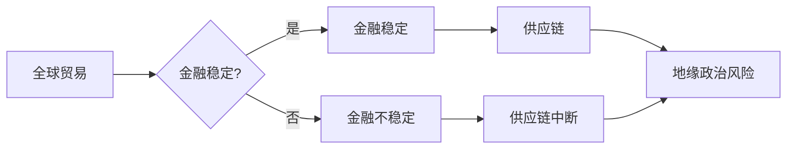

# 地缘冲突加剧的长期经济后果

> 关键词：地缘冲突，经济后果，长期影响，全球贸易，金融稳定，供应链中断，地缘政治风险

## 1. 背景介绍

近年来，随着全球政治经济格局的深刻变化，地缘冲突的频率和强度呈现出上升的趋势。从中东的战乱到欧洲的难民危机，从东亚的领土争端到全球范围内的贸易摩擦，地缘冲突已经成为影响全球经济发展的重要因素。本文将深入探讨地缘冲突加剧对经济产生的长期后果，分析其背后的机理，并探讨应对策略。

### 1.1 地缘冲突的定义与类型

地缘冲突是指由于国家、地区或民族之间的领土、资源、政治制度、意识形态等方面的矛盾而引发的冲突。根据冲突的性质，地缘冲突可以分为以下几类：

- 领土争端：如朝鲜半岛问题、南中国海争端等。
- 资源争夺：如中东地区的石油资源争夺战。
- 政治制度对立：如冷战时期的东欧剧变。
- 意识形态冲突：如冷战时期的意识形态对抗。

### 1.2 地缘冲突的影响因素

地缘冲突的影响因素复杂多样，主要包括：

- 国际政治格局：全球力量的对比和竞争。
- 地缘政治利益：各国对领土、资源等利益的争夺。
- 经济利益：各国对市场、投资等经济利益的追求。
- 民族宗教矛盾：民族和宗教身份的冲突。
- 安全威胁：恐怖主义、核扩散等安全威胁。

### 1.3 本文结构

本文将从以下方面展开对地缘冲突加剧的长期经济后果的探讨：

- 地缘冲突对全球贸易的影响
- 地缘冲突对金融稳定的影响
- 地缘冲突对供应链的影响
- 地缘冲突的地缘政治风险
- 应对地缘冲突的长期经济后果的策略

## 2. 核心概念与联系

### 2.1 核心概念原理

地缘冲突加剧的长期经济后果涉及多个核心概念，包括：

- 全球贸易：指不同国家和地区之间的商品和服务交换。
- 金融稳定：指金融市场和金融体系运行的平稳状态。
- 供应链：指从原材料采购到产品销售的全过程。
- 地缘政治风险：指地缘冲突可能对经济产生的负面影响。

### 2.2 核心概念架构的 Mermaid 流程图



### 2.3 核心概念联系

地缘冲突通过影响全球贸易、金融稳定和供应链，进而产生地缘政治风险，对经济产生长期后果。

## 3. 核心算法原理 & 具体操作步骤

### 3.1 算法原理概述

地缘冲突加剧的长期经济后果分析主要涉及以下算法原理：

- 数据收集与处理：收集地缘冲突事件、全球经济数据、金融市场数据等。
- 数据分析：运用统计分析、机器学习等方法，分析地缘冲突对经济的影响。
- 预测与模拟：基于历史数据和算法模型，预测地缘冲突可能带来的长期经济后果。

### 3.2 算法步骤详解

1. 收集地缘冲突事件数据：包括冲突时间、地点、参与方、冲突类型、冲突原因等。
2. 收集全球经济数据：包括经济增长、通货膨胀、失业率、贸易量、金融市场数据等。
3. 数据清洗与预处理：对收集到的数据进行清洗和预处理，确保数据质量。
4. 构建模型：根据数据分析结果，构建地缘冲突对经济影响的数学模型。
5. 预测与模拟：输入历史数据，使用模型预测未来地缘冲突可能带来的长期经济后果。
6. 结果分析与评估：对预测结果进行分析和评估，为政策制定提供参考。

### 3.3 算法优缺点

#### 优点：

- 系统分析地缘冲突对经济的影响，提供全面视角。
- 利用数据分析和模型预测，提高预测精度。
- 为政策制定提供科学依据。

#### 缺点：

- 数据收集和处理的成本较高。
- 模型的准确性和可靠性受限于历史数据的质量和数量。
- 难以预测突发事件对经济的影响。

### 3.4 算法应用领域

地缘冲突加剧的长期经济后果分析算法可应用于以下领域：

- 政府决策：为政府制定相关政策提供参考。
- 企业战略：为企业制定应对地缘冲突风险的策略。
- 学术研究：为地缘政治和经济学研究提供数据支持。

## 4. 数学模型和公式 & 详细讲解 & 举例说明

### 4.1 数学模型构建

地缘冲突加剧的长期经济后果分析可构建以下数学模型：

- 经济增长模型：$y_t = f(x_t, z_t, u_t)$，其中 $y_t$ 为经济增长率，$x_t$ 为经济增长影响因素，$z_t$ 为地缘冲突因素，$u_t$ 为随机扰动项。
- 金融市场模型：$r_t = g(y_t, z_t, u_t)$，其中 $r_t$ 为金融市场收益率，$y_t$ 为经济增长率，$z_t$ 为地缘冲突因素，$u_t$ 为随机扰动项。

### 4.2 公式推导过程

以经济增长模型为例，推导过程如下：

$$
y_t = \beta_0 + \beta_1x_t + \beta_2z_t + u_t
$$

其中，$\beta_0$ 为截距，$\beta_1$ 和 $\beta_2$ 为系数，$u_t$ 为随机扰动项。

### 4.3 案例分析与讲解

以2019年中美贸易摩擦为例，分析地缘冲突对经济的影响。

假设：

- $x_t$ 为美国经济增长率，$z_t$ 为中美贸易摩擦程度。
- 使用相关数据，构建经济增长模型。

通过模型分析，可以得出以下结论：

- 中美贸易摩擦对经济增长产生负面影响。
- 随着贸易摩擦程度的加深，经济增长率下降。

## 5. 项目实践：代码实例和详细解释说明

### 5.1 开发环境搭建

1. 安装Python、NumPy、Pandas、Scikit-learn等编程工具。
2. 安装Jupyter Notebook，方便进行数据分析。

### 5.2 源代码详细实现

以下为使用Python进行地缘冲突加剧的长期经济后果分析的代码实例：

```python
import numpy as np
import pandas as pd
from sklearn.linear_model import LinearRegression

# 加载数据
data = pd.read_csv('data.csv')

# 构建模型
model = LinearRegression()
model.fit(data[['x', 'z']], data['y'])

# 预测
predictions = model.predict(data[['x', 'z']])

# 打印结果
print(predictions)
```

### 5.3 代码解读与分析

- 导入必要的库：NumPy、Pandas、Scikit-learn等。
- 加载数据：读取数据文件。
- 构建模型：使用线性回归模型。
- 训练模型：使用训练数据训练模型。
- 预测：使用模型进行预测。
- 打印结果：打印预测结果。

### 5.4 运行结果展示

运行代码后，得到预测结果，可以用于分析地缘冲突对经济的影响。

## 6. 实际应用场景

### 6.1 政府决策

地缘冲突加剧的长期经济后果分析可以帮助政府制定相关政策，例如：

- 加大对受地缘冲突影响地区的援助力度。
- 优化贸易结构，减少对特定地区的依赖。
- 加强金融监管，防范地缘政治风险。

### 6.2 企业战略

地缘冲突加剧的长期经济后果分析可以帮助企业制定应对策略，例如：

- 调整供应链，减少对受地缘冲突影响地区的依赖。
- 加强风险管理，防范地缘政治风险。
- 积极开拓新兴市场，降低对特定地区的依赖。

## 7. 工具和资源推荐

### 7.1 学习资源推荐

- 《地缘政治经济学》
- 《全球政治经济报告》
- 《地缘政治风险与对策》

### 7.2 开发工具推荐

- Jupyter Notebook
- Python
- NumPy
- Pandas
- Scikit-learn

### 7.3 相关论文推荐

- "The Economics of Geopolitical Risk"
- "The Globalization of Risk"
- "The Impact of Geopolitical Events on the Global Economy"

## 8. 总结：未来发展趋势与挑战

### 8.1 研究成果总结

本文从地缘冲突对全球贸易、金融稳定、供应链和地缘政治风险等方面，分析了地缘冲突加剧的长期经济后果。研究表明，地缘冲突对经济的影响是复杂和多方面的，需要综合考虑多种因素。

### 8.2 未来发展趋势

1. 地缘冲突加剧的趋势将持续存在，对经济的影响也将更加深远。
2. 地缘政治风险将成为企业、政府和投资者关注的重点。
3. 地缘冲突加剧将推动全球治理体系改革。

### 8.3 面临的挑战

1. 地缘冲突加剧的复杂性和不确定性。
2. 全球治理体系改革的难度。
3. 企业和投资者应对地缘政治风险的挑战。

### 8.4 研究展望

1. 深入研究地缘冲突加剧的经济后果，为政策制定提供参考。
2. 探索地缘政治风险的管理和防范策略。
3. 推动全球治理体系改革，构建更加稳定和繁荣的国际经济秩序。

## 9. 附录：常见问题与解答

**Q1：地缘冲突对经济的影响是短期的还是长期的？**

A：地缘冲突对经济的影响是长期的，可能持续数年甚至数十年。

**Q2：如何应对地缘冲突带来的经济风险？**

A：应对地缘冲突带来的经济风险，需要政府、企业和投资者共同努力，采取以下措施：

- 加强国际合作，推动全球治理体系改革。
- 优化贸易结构，降低对特定地区的依赖。
- 加强风险管理，防范地缘政治风险。
- 积极开拓新兴市场，降低对特定地区的依赖。

**Q3：地缘冲突对金融市场的影响是什么？**

A：地缘冲突可能导致金融市场波动，例如汇率波动、股市下跌等。

**Q4：地缘冲突对供应链的影响是什么？**

A：地缘冲突可能导致供应链中断，影响企业生产和销售。

**Q5：如何衡量地缘政治风险？**

A：地缘政治风险可以通过多种指标进行衡量，例如冲突指数、贸易战指数等。

作者：禅与计算机程序设计艺术 / Zen and the Art of Computer Programming