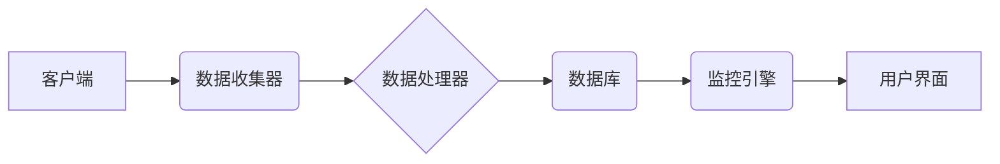

# 基于Django框架的服务器监控系统详细设计与具体代码实现

> 关键词：Django, Python, 监控系统, REST API, Celery, 集成开发环境, 服务器性能, 系统监控

## 1. 背景介绍

随着互联网和云计算技术的飞速发展，服务器数量和种类日益增多，对服务器性能的监控成为了确保业务稳定运行的关键。传统的监控方式往往依赖于命令行工具和手工操作，效率低下且难以实现自动化。而基于Web的监控系统，则能够提供更加直观、高效、易于管理的监控体验。本文将详细介绍如何使用Django框架开发一个功能完善的服务器监控系统，并通过REST API和Celery实现数据的收集、处理和展示。

### 1.1 问题的由来

- 服务器性能监控的重要性：服务器性能直接影响着网站的响应速度和稳定性，对用户体验和业务发展至关重要。
- 传统监控方式的局限性：手动监控效率低，难以实现自动化，且难以处理大量数据。
- Web监控系统的优势：提供直观的界面，易于管理，支持自动化数据收集和分析。

### 1.2 研究现状

目前，基于Web的监控平台有很多，如Nagios、Zabbix、Prometheus等。然而，这些平台往往功能复杂，学习曲线陡峭，且定制化程度较低。Django框架以其简洁、易用的特点，成为开发自定义监控系统的理想选择。

### 1.3 研究意义

- 提高监控效率：自动化数据收集和分析，减轻人工负担。
- 提升监控质量：提供实时、全面的性能数据。
- 降低运维成本：实现集中化管理，提高运维效率。

### 1.4 本文结构

本文将按照以下结构展开：
- 第2章介绍核心概念和架构设计。
- 第3章讲解监控系统的具体实现步骤。
- 第4章分析监控系统涉及的数学模型和公式。
- 第5章展示监控系统的代码实例和运行结果。
- 第6章探讨监控系统的实际应用场景。
- 第7章推荐相关的学习资源和开发工具。
- 第8章总结研究成果，展望未来发展趋势。

## 2. 核心概念与联系

### 2.1 核心概念

- Django：Python的一个高级Web框架，用于快速构建安全、健壮、可扩展的网站。
- REST API：一种基于HTTP协议的API设计风格，用于实现服务器和客户端之间的数据交互。
- Celery：一个异步任务队列/作业队列基于分布式消息传递的开源项目。
- 监控数据：服务器性能指标，如CPU、内存、磁盘、网络等。
- 监控算法：用于处理和分析监控数据的算法，如阈值监控、历史趋势分析等。

### 2.2 架构设计

监控系统架构图如下：



### 2.3 关系

- 客户端负责收集服务器性能数据。
- 数据收集器将数据发送到数据处理器。
- 数据处理器对数据进行初步处理，如格式转换、去重等。
- 处理后的数据存储到数据库中。
- 监控引擎根据预设规则对数据进行实时分析，触发报警。
- 用户界面展示监控数据和分析结果。

## 3. 核心算法原理 & 具体操作步骤

### 3.1 算法原理概述

监控系统的主要功能包括数据收集、数据处理、数据存储、数据分析和数据展示。以下将分别介绍这些功能的算法原理。

#### 3.1.1 数据收集

数据收集主要通过客户端实现，客户端可以是脚本、软件或硬件设备。常用的数据收集方法包括：

- 命令行工具：如`top`、`ps`、`ifconfig`等，用于收集CPU、内存、磁盘、网络等基础性能数据。
- 软件库：如Python的`psutil`库，可以方便地获取系统信息。
- 硬件接口：如SNMP、IPMI等，可以收集服务器硬件信息。

#### 3.1.2 数据处理

数据处理器负责对收集到的数据进行初步处理，主要任务包括：

- 数据格式转换：将不同数据源的格式统一为统一的数据格式。
- 数据去重：去除重复数据，避免影响后续分析。
- 数据清洗：去除异常数据，提高数据质量。

#### 3.1.3 数据存储

处理后的数据存储到数据库中，常用的数据库包括：

- 关系型数据库：如MySQL、PostgreSQL等，适用于结构化数据存储。
- NoSQL数据库：如MongoDB、Redis等，适用于非结构化数据存储。

#### 3.1.4 数据分析

监控引擎根据预设规则对数据进行实时分析，主要任务包括：

- 阈值监控：根据历史数据设置阈值，当数据超出阈值时触发报警。
- 历史趋势分析：分析数据的历史趋势，预测未来的性能变化。

#### 3.1.5 数据展示

用户界面展示监控数据和分析结果，主要功能包括：

- 实时数据展示：实时显示服务器性能指标。
- 历史数据查询：查询历史数据，分析性能变化趋势。
- 报警信息展示：展示报警信息，方便用户及时处理。

### 3.2 算法步骤详解

以下是基于Django框架的服务器监控系统开发步骤：

1. **设计数据库模型**：根据监控需求设计数据库模型，包括服务器信息、监控指标、报警记录等。
2. **创建Django项目**：使用Django的`startproject`命令创建一个新的项目。
3. **创建应用**：使用`startapp`命令创建一个应用，用于实现监控功能。
4. **设计URL配置**：配置URL路由，将URL与视图函数关联。
5. **编写视图函数**：编写视图函数，处理HTTP请求，返回响应。
6. **设计模板**：设计HTML模板，用于展示监控数据和报警信息。
7. **实现数据收集**：编写数据收集脚本，定时收集服务器性能数据。
8. **实现数据处理**：编写数据处理脚本，处理收集到的数据。
9. **实现数据存储**：将处理后的数据存储到数据库中。
10. **实现数据分析**：编写数据分析脚本，分析数据并触发报警。
11. **实现数据展示**：编写前端页面，展示监控数据和报警信息。

### 3.3 算法优缺点

#### 优点

- 开发效率高：Django框架简化了Web开发流程，提高开发效率。
- 代码质量高：Django遵循MVC设计模式，代码结构清晰，易于维护。
- 安全性高：Django内置了许多安全机制，如CSRF保护、SQL注入防护等。

#### 缺点

- 学习曲线陡峭：Django框架功能强大，但学习成本较高。
- 性能瓶颈：Django框架本身占用资源较多，在高并发场景下可能存在性能瓶颈。

### 3.4 算法应用领域

基于Django框架的服务器监控系统适用于以下场景：

- 中小型企业内部服务器监控
- 云服务器监控
- 数据中心监控
- 互联网公司监控

## 4. 数学模型和公式 & 详细讲解 & 举例说明

### 4.1 数学模型构建

#### 4.1.1 监控指标

监控系统需要收集多种监控指标，以下是一些常见的监控指标：

- CPU使用率：表示CPU的使用程度，一般以百分比表示。
- 内存使用率：表示内存的使用程度，一般以百分比表示。
- 磁盘使用率：表示磁盘的使用程度，一般以百分比表示。
- 网络流量：表示网络的数据传输量，一般以字节或比特表示。

#### 4.1.2 阈值监控

阈值监控的数学模型如下：

$$
\text{报警} = (\text{当前指标值} - \text{阈值}) \times \text{报警系数}
$$

其中，报警系数用于控制报警的灵敏度。

### 4.2 公式推导过程

#### 4.2.1 阈值设定

阈值的设定需要综合考虑以下因素：

- 历史数据：分析历史数据，确定合理的阈值范围。
- 业务需求：根据业务需求，设定不同的报警阈值。
- 资源配置：根据服务器配置，设定不同的报警阈值。

#### 4.2.2 报警系数

报警系数用于控制报警的灵敏度，其计算公式如下：

$$
\text{报警系数} = \frac{\text{当前指标值} - \text{阈值}}{\text{历史最大值} - \text{阈值}}
$$

### 4.3 案例分析与讲解

以下是一个简单的阈值监控示例：

- 服务器CPU使用率阈值为80%。
- 报警系数为1.2。

假设当前CPU使用率为90%，则报警系数为：

$$
\text{报警系数} = \frac{90\% - 80\%}{100\% - 80\%} = 1.2
$$

由于报警系数大于1，触发报警。

## 5. 项目实践：代码实例和详细解释说明

### 5.1 开发环境搭建

以下是基于Django框架的服务器监控系统开发环境搭建步骤：

1. 安装Python和Django：
```bash
pip install python
pip install django
```

2. 创建Django项目：
```bash
django-admin startproject monitor
cd monitor
```

3. 创建应用：
```bash
python manage.py startapp monitor_app
```

4. 配置数据库：
```python
# monitor/settings.py
DATABASES = {
    'default': {
        'ENGINE': 'django.db.backends.sqlite3',
        'NAME': BASE_DIR / 'db.sqlite3',
    }
}
```

5. 配置URL：
```python
# monitor/urls.py
from django.contrib import admin
from django.urls import path
from . import views

urlpatterns = [
    path('admin/', admin.site.urls),
    path('monitor/', views.monitor, name='monitor'),
]
```

### 5.2 源代码详细实现

以下是一个简单的监控指标视图函数示例：

```python
# monitor_app/views.py
from django.shortcuts import render
from .models import CPUUsage

def monitor(request):
    cpu_usage = CPUUsage.objects.last()
    if cpu_usage:
        context = {'cpu_usage': cpu_usage}
        return render(request, 'monitor/monitor.html', context)
    else:
        return render(request, 'monitor/monitor.html', {'cpu_usage': None})
```

### 5.3 代码解读与分析

以上代码展示了如何使用Django框架创建一个简单的监控指标视图函数。首先，从`monitor_app/models.py`中导入`CPUUsage`模型，然后定义`monitor`视图函数。在`monitor`函数中，从数据库中获取最新的CPU使用率数据，并将其传递给模板文件。

### 5.4 运行结果展示

以下是一个简单的监控指标页面示例：

```html
<!-- monitor/templates/monitor/monitor.html -->
<!DOCTYPE html>
<html>
<head>
    <title>服务器监控</title>
</head>
<body>
    <h1>服务器监控</h1>
    <p>CPU使用率：{{ cpu_usage.cpu_usage }}%</p>
</body>
</html>
```

以上代码展示了如何使用Django模板语言渲染监控数据。在`<p>`标签中，使用`{{ cpu_usage.cpu_usage }}`表达式插入CPU使用率数据。

## 6. 实际应用场景

基于Django框架的服务器监控系统适用于以下场景：

- **企业内部服务器监控**：用于监控企业内部服务器的性能，及时发现故障，保障业务稳定运行。
- **云服务器监控**：用于监控云服务器的性能，合理分配资源，降低成本。
- **数据中心监控**：用于监控数据中心服务器的性能，优化资源配置，提高数据中心利用率。
- **互联网公司监控**：用于监控互联网公司的服务器性能，及时发现故障，保障网站稳定运行。

## 7. 工具和资源推荐

### 7.1 学习资源推荐

- Django官方文档：https://docs.djangoproject.com/en/stable/
- Python官方文档：https://docs.python.org/3/
- 监控系统相关书籍：《云原生监控：构建高效、可靠的监控系统》

### 7.2 开发工具推荐

- Django IDE：PyCharm、VSCode
- 数据库工具：MySQL Workbench、PostgreSQL Workbench
- 版本控制工具：Git

### 7.3 相关论文推荐

- 《Building, Deploying, and Maintaining a Cloud-Based Monitoring System》
- 《A Survey on Cloud Monitoring: Challenges and Opportunities》

## 8. 总结：未来发展趋势与挑战

### 8.1 研究成果总结

本文介绍了基于Django框架的服务器监控系统详细设计与具体代码实现。通过使用Django框架，可以快速开发功能完善、易于管理的监控系统。监控系统可以根据业务需求进行定制化开发，提高监控效率和质量。

### 8.2 未来发展趋势

- **智能化**：监控系统将引入人工智能技术，实现自动故障诊断、预测性维护等功能。
- **自动化**：监控系统将实现自动化数据收集、分析、报警等功能，减轻人工负担。
- **可视化**：监控系统将提供更加直观的界面，方便用户快速了解系统状态。

### 8.3 面临的挑战

- **数据安全**：监控系统需要处理大量敏感数据，确保数据安全是重要挑战。
- **可扩展性**：监控系统需要适应不断变化的环境和需求，确保可扩展性。
- **成本控制**：监控系统开发和维护成本较高，需要合理控制成本。

### 8.4 研究展望

随着技术的不断发展，基于Django框架的服务器监控系统将更加智能化、自动化和可视化。未来，监控系统将更好地服务于企业，提高业务稳定性，降低运维成本。

## 9. 附录：常见问题与解答

**Q1：为什么选择Django框架开发监控系统？**

A：Django框架以其简洁、易用、安全、可扩展的特点，成为开发Web应用程序的理想选择。使用Django框架可以快速开发功能完善、易于管理的监控系统。

**Q2：如何保证监控系统的安全性？**

A：监控系统需要处理大量敏感数据，确保数据安全至关重要。可以采取以下措施：
- 使用HTTPS协议进行数据传输。
- 对敏感数据进行加密存储。
- 定期更新系统，修复安全漏洞。

**Q3：如何优化监控系统性能？**

A：监控系统性能优化可以从以下几个方面入手：
- 使用异步任务队列，如Celery，提高数据收集和处理效率。
- 对数据库进行优化，如使用索引、分区等。
- 对前端页面进行优化，减少页面加载时间。

**Q4：如何扩展监控系统功能？**

A：监控系统可以根据业务需求进行扩展，以下是一些常见的扩展方式：
- 添加新的监控指标。
- 添加新的报警规则。
- 添加新的数据展示方式。

**Q5：如何实现监控系统的国际化？**

A：监控系统可以实现国际化，支持多种语言。以下是一些实现方法：
- 使用Django内置的国际化功能。
- 使用第三方库，如`django-i18n`。
- 使用前端国际化库，如`i18next`。

作者：禅与计算机程序设计艺术 / Zen and the Art of Computer Programming