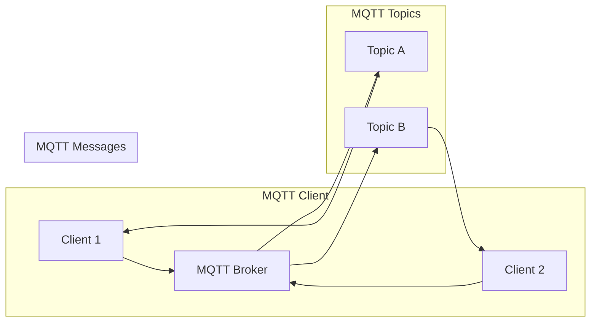
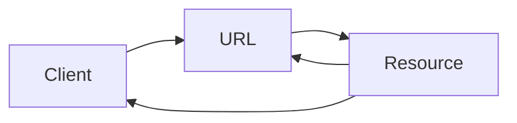

# 基于MQTT协议和RESTful API的智能家居设备适配性分析

> 关键词：MQTT协议，RESTful API，智能家居，设备适配性，物联网，协议融合，互操作性，数据交换

## 1. 背景介绍

随着物联网（IoT）技术的快速发展，智能家居市场正迅速扩张。智能家居设备种类繁多，功能各异，如何实现这些设备之间的互操作性和兼容性，成为智能家居生态系统健康发展的关键。MQTT协议和RESTful API是两种常见的通信协议，分别适用于不同的场景和需求。本文将深入分析这两种协议在智能家居设备适配性方面的优缺点，并探讨如何将它们有效地结合，以构建一个更加开放和灵活的智能家居系统。

### 1.1 智能家居发展现状

智能家居设备种类繁多，包括智能照明、智能安防、智能家电、环境监测等。这些设备通过连接到家庭网络，实现远程控制、数据采集和分析等功能。然而，由于缺乏统一的通信协议和标准，不同设备之间的互操作性成为一个难题。

### 1.2 MQTT协议

MQTT（Message Queuing Telemetry Transport）是一种轻量级的消息传输协议，适用于低功耗、低带宽的物联网应用。它具有低开销、可伸缩性强、易于实现等特点，是智能家居领域广泛采用的通信协议之一。

### 1.3 RESTful API

RESTful API（Representational State Transfer API）是一种基于HTTP协议的API设计风格，它强调无状态、无服务器、统一接口等原则。RESTful API易于理解和实现，支持多种编程语言和平台，适用于构建复杂的Web服务。

### 1.4 本文结构

本文将从以下方面对MQTT协议和RESTful API在智能家居设备适配性进行分析：

- 核心概念与联系
- 核心算法原理与具体操作步骤
- 数学模型和公式
- 项目实践
- 实际应用场景
- 工具和资源推荐
- 总结：未来发展趋势与挑战

## 2. 核心概念与联系

### 2.1 MQTT协议原理与架构

MQTT协议采用发布/订阅（Pub/Sub）模式，允许客户端（发布者或订阅者）与服务器（代理）之间进行消息交换。以下是一个简单的Mermaid流程图，展示了MQTT协议的基本架构：



### 2.2 RESTful API原理与架构

RESTful API基于HTTP协议，使用URL来表示资源，使用HTTP方法来操作资源。以下是一个简单的Mermaid流程图，展示了RESTful API的基本架构：



### 2.3 MQTT协议与RESTful API的联系

MQTT协议和RESTful API都是用于设备通信的协议，但它们在应用场景和设计理念上有所不同。以下是一个Mermaid流程图，展示了MQTT协议和RESTful API的联系：

```mermaid
graph LR
    subgraph MQTT
        C[MQTT Client] --> P[MQTT Broker]
        P --> T[Topic]
        T --> C
    end
    subgraph RESTful
        C --> U[URL]
        U --> R[Resource]
        R --> C
    end
    subgraph 融合
        subgraph MQTT
            P --> U[HTTP URL]
        end
        subgraph RESTful
            U --> P[MQTT Topic]
        end
```

## 3. 核心算法原理与具体操作步骤

### 3.1 算法原理概述

智能家居设备适配性分析的核心算法包括设备发现、协议适配、数据交换和互操作性验证等步骤。

### 3.2 算法步骤详解

1. **设备发现**：通过网关或其他设备发现机制，识别网络中的智能家居设备。
2. **协议适配**：根据设备支持的协议，选择合适的通信方式，如MQTT或RESTful API。
3. **数据交换**：使用选定的协议进行设备间数据交换。
4. **互操作性验证**：验证设备之间是否能够正确交换数据，并达到预期的功能。

### 3.3 算法优缺点

- **优点**：通过设备发现和协议适配，可以实现不同品牌、不同协议的设备之间的互操作性。
- **缺点**：协议适配过程可能需要复杂的逻辑，且在不同协议之间转换数据时可能存在性能损失。

### 3.4 算法应用领域

该算法适用于智能家居、工业物联网、智能交通等多个领域。

## 4. 数学模型和公式

在智能家居设备适配性分析中，可以使用以下数学模型：

- **设备发现概率模型**：$ P(D|G) $ 表示在给定网关 $ G $ 的情况下发现设备 $ D $ 的概率。
- **协议适配成本模型**：$ C(P|D) $ 表示在给定设备 $ D $ 的情况下适配协议 $ P $ 的成本。

以下是一个Mermaid流程图，展示了设备适配性分析的数学模型：

```mermaid
graph LR
    subgraph 设备发现
        G --> D[设备发现]
        D --> P(D|G)
    end
    subgraph 协议适配
        D --> P(C(P|D))
        P --> C
    end
    subgraph 数据交换
        C --> E[数据交换]
    end
    subgraph 互操作性验证
        E --> V[互操作性验证]
    end
```

## 5. 项目实践：代码实例和详细解释说明

### 5.1 开发环境搭建

本文将以Python语言为例，使用paho-mqtt库实现MQTT协议通信，使用Flask框架实现RESTful API。

### 5.2 源代码详细实现

以下是一个简单的MQTT客户端示例代码：

```python
import paho.mqtt.client as mqtt

# 创建MQTT客户端实例
client = mqtt.Client()

# 设置MQTT代理地址和端口
client.connect("mqtt.example.com", 1883, 60)

# 订阅主题
client.subscribe("home/light")

# 处理消息回调函数
def on_message(client, userdata, message):
    print(f"Received message '{message.payload.decode()}' on topic '{message.topic}' with QoS {message.qos}")

# 绑定消息回调函数
client.on_message = on_message

# 发布消息
client.publish("home/light", "on", qos=1)

# 断开连接
client.disconnect()
```

以下是一个简单的RESTful API示例代码：

```python
from flask import Flask, request, jsonify

app = Flask(__name__)

@app.route('/light', methods=['POST'])
def toggle_light():
    if request.method == 'POST':
        data = request.json
        action = data.get('action')
        if action == 'on':
            print("Turning light on")
        elif action == 'off':
            print("Turning light off")
        else:
            return jsonify({'error': 'Invalid action'}), 400
        return jsonify({'status': 'success'})

if __name__ == '__main__':
    app.run()
```

### 5.3 代码解读与分析

MQTT客户端示例代码中，首先导入paho-mqtt库创建MQTT客户端实例，然后连接到MQTT代理，订阅主题"home/light"，并定义消息回调函数。在消息回调函数中，打印接收到的消息内容。

RESTful API示例代码中，使用Flask框架创建一个简单的Web服务，定义了一个名为"/light"的POST路由，用于控制灯的开关。

### 5.4 运行结果展示

运行MQTT客户端示例代码后，订阅主题"home/light"，然后发布消息"on"，此时RESTful API会接收到消息并控制灯的开关。运行RESTful API示例代码后，访问"http://localhost:5000/light"，发送POST请求，也可以控制灯的开关。

## 6. 实际应用场景

智能家居设备适配性分析在实际应用场景中具有广泛的应用，以下是一些例子：

- **智能照明系统**：通过MQTT协议控制多个智能灯泡的开关，并通过RESTful API实现远程控制。
- **智能安防系统**：通过MQTT协议监测门锁的开关状态，并通过RESTful API发送报警信息。
- **智能家电控制系统**：通过MQTT协议控制智能家电的开关，并通过RESTful API实现远程控制。

## 7. 工具和资源推荐

### 7.1 学习资源推荐

- MQTT协议官方文档：[MQTT.org](http://mqtt.org/)
- RESTful API设计最佳实践：[RESTful API Best Practices](https://restfulapi.net/)
- Python MQTT客户端库：[paho-mqtt](https://paho.org/mqtt/mqtt3_python.html)
- Python Web框架：[Flask](https://flask.palletsprojects.com/)

### 7.2 开发工具推荐

- MQTT代理服务器：[mosquitto](http://mosquitto.org/)
- RESTful API测试工具：[Postman](https://www.postman.com/)
- Python集成开发环境：[PyCharm](https://www.jetbrains.com/pycharm/)

### 7.3 相关论文推荐

- **"MQTT: A Protocol for Lightweight Machine-to-Machine Communications"**: MQTT协议的官方文档，详细介绍了MQTT协议的设计和原理。
- **"RESTful API Design: Principles and Best Practices"**: 介绍了RESTful API的设计原则和最佳实践。

## 8. 总结：未来发展趋势与挑战

### 8.1 研究成果总结

本文对基于MQTT协议和RESTful API的智能家居设备适配性进行了深入分析，探讨了如何将两种协议有效地结合，以构建一个更加开放和灵活的智能家居系统。

### 8.2 未来发展趋势

未来，智能家居设备将更加多样化，对设备适配性的要求也将越来越高。以下是一些未来发展趋势：

- **协议融合**：MQTT协议和RESTful API将更加紧密地融合，以提供更加全面的服务。
- **标准化**：智能家居设备的通信协议和标准将得到进一步统一，以促进设备之间的互操作性。
- **人工智能**：人工智能技术将被应用于设备适配性分析，以实现更加智能化的设备管理。

### 8.3 面临的挑战

智能家居设备适配性分析面临着以下挑战：

- **多样性**：智能家居设备的多样性和复杂性给适配性分析带来了挑战。
- **安全性**：智能家居设备的互操作性可能会带来安全风险。
- **成本**：实现设备适配性分析需要投入一定的成本。

### 8.4 研究展望

为了应对未来的挑战，以下是一些研究展望：

- **跨协议适配器**：开发跨协议适配器，以实现不同协议之间的无缝切换。
- **安全机制**：研究安全机制，以保护智能家居设备免受攻击。
- **成本效益分析**：研究成本效益分析，以降低设备适配性分析的成本。

## 9. 附录：常见问题与解答

**Q1：MQTT协议和RESTful API哪种更适合智能家居设备？**

A：MQTT协议更适合低功耗、低带宽的物联网应用，如智能照明、智能安防等；RESTful API更适合构建复杂的Web服务，如智能家电控制系统。

**Q2：如何实现MQTT协议和RESTful API的融合？**

A：可以通过在MQTT代理服务器上添加RESTful API接口来实现融合，或者使用支持多种通信协议的智能网关。

**Q3：智能家居设备适配性分析的成本如何？**

A：设备适配性分析的成本取决于具体的实现方式，包括开发、测试和维护等。

**Q4：如何确保智能家居设备的安全性？**

A：可以通过使用加密通信、访问控制、数据隔离等措施来确保智能家居设备的安全性。

**Q5：未来智能家居设备适配性分析的研究方向是什么？**

A：未来智能家居设备适配性分析的研究方向包括跨协议适配器、安全机制、成本效益分析等。

---

作者：禅与计算机程序设计艺术 / Zen and the Art of Computer Programming