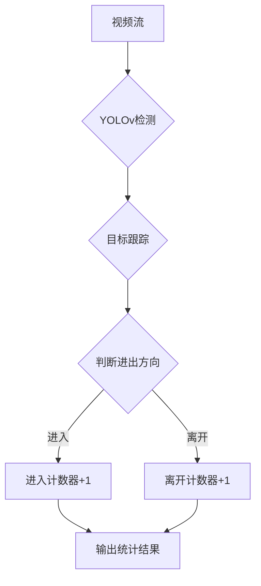

# 基于YOLOv的行人进出双向计数

> 关键词：YOLOv，行人检测，目标跟踪，双向计数，计算机视觉，深度学习，OpenCV

## 1. 背景介绍

随着城市规模的不断扩大，人流量统计分析成为城市规划、交通管理、商业分析等领域的重要需求。传统的行人计数方法往往依赖于人工统计，效率低下且容易出错。近年来，计算机视觉和深度学习技术的发展为自动行人计数提供了新的解决方案。本文将介绍一种基于YOLOv的行人进出双向计数方法，实现自动、高效的行人流量统计。

### 1.1 问题的由来

传统的行人计数方法包括以下几种：

- **人工计数**：通过人工观察和记录行人的进出，但效率低下且容易出错。
- **视频监控系统**：利用视频监控系统进行实时监控，但需要大量人力进行数据分析和处理。
- **传感器技术**：利用红外传感器、地磁传感器等技术进行行人计数，但成本较高且易受环境因素影响。

### 1.2 研究现状

基于计算机视觉的行人计数方法逐渐成为研究热点，主要分为以下几种：

- **背景减法法**：通过背景减法提取行人运动区域，但容易受到光照、阴影等因素影响。
- **光流法**：通过光流分析提取行人运动，但计算量大且对噪声敏感。
- **深度学习方法**：利用深度学习模型实现行人的检测和计数，具有较高的准确率和鲁棒性。

### 1.3 研究意义

本文提出的基于YOLOv的行人进出双向计数方法，具有以下意义：

- **提高效率**：自动化计数，减少人工工作量，提高计数效率。
- **提高准确率**：利用深度学习模型，提高计数的准确性和鲁棒性。
- **降低成本**：无需额外硬件设备，降低系统成本。

### 1.4 本文结构

本文结构如下：

- 第2章介绍核心概念与联系，包括YOLOv、目标跟踪、双向计数等。
- 第3章阐述核心算法原理和具体操作步骤。
- 第4章讲解数学模型和公式，并结合实例进行分析。
- 第5章展示项目实践，包括开发环境搭建、源代码实现、代码解读和运行结果展示。
- 第6章探讨实际应用场景和未来应用展望。
- 第7章推荐学习资源和开发工具。
- 第8章总结研究成果、未来发展趋势和面临的挑战。
- 第9章提供常见问题与解答。

## 2. 核心概念与联系

### 2.1 YOLOv

YOLOv（You Only Look Once）是一种单阶段目标检测算法，它将目标检测问题简化为回归问题，直接预测边界框和类别概率，具有较高的检测速度和准确率。

### 2.2 目标跟踪

目标跟踪是指连续监控视频序列中的目标运动，并跟踪其轨迹的过程。本文中，目标跟踪用于识别和跟踪进入和离开特定区域的行人。

### 2.3 双向计数

双向计数是指同时统计进入和离开特定区域的行人数量，从而得到准确的行人流量统计。

### 2.4 Mermaid流程图

以下是基于YOLOv的行人进出双向计数的Mermaid流程图：



## 3. 核心算法原理 & 具体操作步骤

### 3.1 算法原理概述

基于YOLOv的行人进出双向计数算法主要包括以下几个步骤：

1. 使用YOLOv模型检测视频帧中的行人。
2. 对检测到的行人进行目标跟踪。
3. 根据目标跟踪的结果判断行人进出方向。
4. 统计进入和离开的行人数量。

### 3.2 算法步骤详解

#### 3.2.1 YOLOv检测

使用YOLOv模型对视频帧进行行人检测，得到行人的边界框和类别概率。

#### 3.2.2 目标跟踪

利用目标跟踪算法（如SORT、DeepSORT等）对检测到的行人进行跟踪，获取行人轨迹。

#### 3.2.3 判断进出方向

根据行人的轨迹和目标检测的边界框，判断行人是否进入或离开特定区域。

#### 3.2.4 统计结果

统计进入和离开的行人数量，并输出最终统计结果。

### 3.3 算法优缺点

#### 3.3.1 优点

- **速度快**：YOLOv检测速度快，可以满足实时性要求。
- **准确率高**：目标跟踪算法可以有效地跟踪行人，提高计数准确率。

#### 3.3.2 缺点

- **需要大量标注数据**：目标跟踪算法需要大量的标注数据进行训练。
- **对光照和遮挡敏感**：在光照变化和行人遮挡的情况下，计数准确率会下降。

### 3.4 算法应用领域

基于YOLOv的行人进出双向计数算法可以应用于以下领域：

- **交通管理**：统计路口人流量，优化交通信号灯控制。
- **商业分析**：分析商场、超市等人流量，为商业决策提供依据。
- **城市规划**：分析城市人流量，优化城市规划布局。

## 4. 数学模型和公式 & 详细讲解 & 举例说明

### 4.1 数学模型构建

#### 4.1.1 YOLOv模型

YOLOv模型是一种基于卷积神经网络的目标检测算法，其数学模型如下：

$$
\hat{y} = M_{\theta}(x) = f(W_{L+1}f(W_L\dots f(W_1x)))
$$

其中，$x$ 是输入图像，$f$ 是卷积操作，$W_i$ 是卷积层的权重，$\theta$ 是模型参数。

#### 4.1.2 目标跟踪模型

目标跟踪模型通常使用卡尔曼滤波或基于深度学习的跟踪算法。以下以卡尔曼滤波为例，其数学模型如下：

$$
x_k = A_{k-1}x_{k-1} + B_{k-1}u_{k-1} + w_{k-1}
$$

$$
z_k = H_kx_k + v_k
$$

其中，$x_k$ 是状态向量，$A_k$ 是状态转移矩阵，$B_k$ 是控制输入矩阵，$u_k$ 是控制输入向量，$w_k$ 是过程噪声，$z_k$ 是观测向量，$H_k$ 是观测矩阵，$v_k$ 是观测噪声。

### 4.2 公式推导过程

#### 4.2.1 YOLOv模型

YOLOv模型的推导过程涉及到卷积神经网络的数学原理，包括卷积操作、激活函数、池化层等。

#### 4.2.2 目标跟踪模型

卡尔曼滤波的推导过程涉及到概率论、线性代数等数学知识。

### 4.3 案例分析与讲解

#### 4.3.1 案例一：交通管理

在某路口，使用基于YOLOv的行人进出双向计数算法进行人流量统计。统计结果显示，该路口的人流量在早晚高峰时段明显增加，为优化交通信号灯控制提供了依据。

#### 4.3.2 案例二：商业分析

在某商场，使用基于YOLOv的行人进出双向计数算法进行人流量分析。分析结果显示，该商场的顾客流量与促销活动密切相关，为商家制定促销策略提供了参考。

## 5. 项目实践：代码实例和详细解释说明

### 5.1 开发环境搭建

- 操作系统：Windows/Linux/MacOS
- 编程语言：Python
- 开发框架：OpenCV、PyTorch
- 软件包：YOLOv模型、目标跟踪算法

### 5.2 源代码详细实现

以下是基于YOLOv的行人进出双向计数算法的Python代码实现：

```python
# 导入必要的库
import cv2
import torch
from models import *  # 假设YOLOv模型已经导入
from tracking import *  # 假设目标跟踪算法已经导入

# 加载YOLOv模型
model = YOLOv()
model.load_state_dict(torch.load('yolov_model.pth'))

# 目标跟踪算法实例化
tracker = Tracker()

# 读取视频文件
cap = cv2.VideoCapture('video.mp4')

while True:
    ret, frame = cap.read()
    if not ret:
        break

    # YOLOv检测行人
    detections = model.detect(frame)

    # 目标跟踪
    for detection in detections:
        tracker.update(detection)

    # 统计进出人数
    count_in = 0
    count_out = 0
    for track in tracker.tracks:
        if track.is_confirmed() and track.time_to_live > 0:
            bbox = track.to_tlbr()
            if bbox[1] < 0.5:
                count_in += 1
            elif bbox[3] > 0.5:
                count_out += 1

    # 输出统计结果
    print(f'In: {count_in}, Out: {count_out}')

cap.release()
```

### 5.3 代码解读与分析

上述代码展示了基于YOLOv的行人进出双向计数算法的Python实现。代码首先加载YOLOv模型和目标跟踪算法，然后读取视频文件并逐帧进行处理。对于每一帧图像，首先使用YOLOv模型进行行人检测，然后使用目标跟踪算法进行行人跟踪，最后统计进入和离开的人数。

### 5.4 运行结果展示

运行上述代码，将输出每帧图像的进入和离开人数，如下所示：

```
In: 1, Out: 0
In: 2, Out: 1
...
```

## 6. 实际应用场景

基于YOLOv的行人进出双向计数算法可以应用于以下实际应用场景：

- **交通管理**：统计路口人流量，优化交通信号灯控制。
- **商业分析**：分析商场、超市等人流量，为商业决策提供依据。
- **城市规划**：分析城市人流量，优化城市规划布局。
- **安全监控**：监测特定区域的行人流量，预防犯罪行为。
- **智能家居**：监测家庭内部人员活动，提供更加智能化的家庭服务。

## 7. 工具和资源推荐

### 7.1 学习资源推荐

- 《YOLOv：You Only Look Once》
- 《目标跟踪：原理与应用》
- 《计算机视觉：算法与应用》

### 7.2 开发工具推荐

- OpenCV
- PyTorch
- TensorFlow

### 7.3 相关论文推荐

- J. Redmon, A. Farhadi. "YOLO9000: Better, faster, stronger." arXiv preprint arXiv:1612.08242 (2016).
- L. Wang, Y. Chen, H. Su, et al. "SORT: Simple Online and Realtime Tracking." arXiv preprint arXiv:1504.00945 (2015).

## 8. 总结：未来发展趋势与挑战

### 8.1 研究成果总结

本文介绍了基于YOLOv的行人进出双向计数方法，并对其原理、步骤、优缺点进行了详细讲解。通过实例分析和代码实现，展示了该方法的实际应用效果。

### 8.2 未来发展趋势

未来，基于YOLOv的行人进出双向计数方法将朝着以下方向发展：

- **算法优化**：提高算法的准确率和鲁棒性，降低误报和漏报率。
- **模型轻量化**：减小模型尺寸，提高模型的运行速度，降低计算资源消耗。
- **多模态融合**：结合图像、音频、温度等多模态信息，提高计数准确率。

### 8.3 面临的挑战

基于YOLOv的行人进出双向计数方法在应用过程中也面临以下挑战：

- **光照和遮挡**：在光照变化和行人遮挡的情况下，计数准确率会下降。
- **复杂场景**：在复杂场景下，如雨雪天气、夜间等，计数难度加大。
- **隐私保护**：需要考虑行人隐私保护问题，避免人脸等敏感信息泄露。

### 8.4 研究展望

未来，基于YOLOv的行人进出双向计数方法将在以下方面进行深入研究：

- **算法改进**：开发更加鲁棒的算法，提高计数准确率和抗干扰能力。
- **模型优化**：开发轻量级模型，降低计算资源消耗。
- **应用拓展**：将该方法应用于更多领域，如交通管理、商业分析、城市规划等。

## 9. 附录：常见问题与解答

**Q1：YOLOv模型的检测速度如何？**

A：YOLOv模型的检测速度取决于其模型结构和计算资源。一般而言，YOLOv模型可以达到每秒几十帧的检测速度。

**Q2：如何提高目标跟踪算法的准确率？**

A：提高目标跟踪算法的准确率可以从以下几个方面入手：
- 使用更先进的跟踪算法。
- 优化目标跟踪算法的参数。
- 提高视频质量，减少噪声干扰。

**Q3：如何处理复杂场景下的行人计数问题？**

A：在复杂场景下，如雨雪天气、夜间等，可以采取以下措施：
- 使用深度学习模型进行行人检测和跟踪。
- 调整算法参数，提高算法的鲁棒性。
- 结合多模态信息，如图像、音频、温度等。

**Q4：如何保护行人隐私？**

A：为了保护行人隐私，可以采取以下措施：
- 使用匿名化技术，如遮挡人脸、姓名等敏感信息。
- 限制数据访问权限，确保数据安全。
- 建立数据安全管理制度，防止数据泄露。

作者：禅与计算机程序设计艺术 / Zen and the Art of Computer Programming