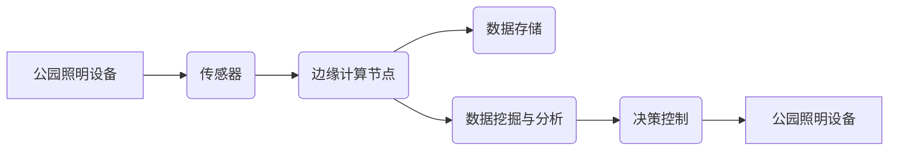

> 大数据，公园监控，智能照明，物联网，边缘计算

# 基于大数据的公园灯饰监控系统的设计与开发

## 1. 背景介绍

随着城市化进程的加快，公园作为市民休闲娱乐的重要场所，其照明系统的重要性日益凸显。传统的公园照明系统主要依靠人工巡检和定时开关控制，存在着能耗高、效率低、维护成本高等问题。为了提高公园照明系统的智能化水平，降低能耗和维护成本，本文将探讨基于大数据的公园灯饰监控系统的设计与开发。

### 1.1 问题的由来

**能源浪费**： 传统公园照明系统往往在夜间全时段开启，造成能源浪费。

**维护困难**： 系统缺乏智能化管理，难以实时监控设备状态和故障。

**环境影响**： 照明设备故障或损坏，可能影响公园环境美观和市民安全。

### 1.2 研究现状

目前，国内外在公园照明系统智能化方面已取得一定成果，主要集中在以下几个方面：

**智能照明控制**： 通过传感器检测环境光线，实现自动开关灯控制。

**远程监控**： 利用无线通信技术，实现对公园照明设备的远程监控和故障报警。

**节能管理**： 通过数据分析，优化照明策略，实现节能降耗。

### 1.3 研究意义

基于大数据的公园灯饰监控系统能够实现以下目标：

**提高能源利用效率**： 根据实际需求动态调整照明强度，减少能源浪费。

**降低维护成本**： 实时监控设备状态，及时发现故障并修复。

**提升公园环境质量**： 确保照明设备正常运行，提高公园环境美观度。

## 2. 核心概念与联系

### 2.1 核心概念原理

**大数据**： 指规模巨大、类型多样、价值密度低的数据集合，需要借助先进的技术和方法进行处理和分析。

**物联网**： 通过传感器、网络和智能设备实现物体互联互通，实现智能化管理。

**边缘计算**： 将数据处理和计算任务从云端转移到网络边缘，降低延迟，提高效率。

**智能照明**： 利用传感器、控制器和智能设备实现照明系统的智能化控制。

### 2.2 架构流程图

以下是基于大数据的公园灯饰监控系统架构流程图：



**流程说明**：

1. 公园照明设备通过传感器实时采集运行数据。
2. 数据传输至边缘计算节点进行处理和分析。
3. 数据存储于云端或本地存储系统。
4. 数据挖掘与分析模块对数据进行分析，提取有价值的信息。
5. 决策控制模块根据分析结果，对照明设备进行控制。
6. 控制信号传输至公园照明设备，实现智能化照明管理。

## 3. 核心算法原理 & 具体操作步骤

### 3.1 算法原理概述

基于大数据的公园灯饰监控系统主要包括以下几个关键算法：

**传感器数据采集算法**： 采集公园照明设备的运行数据，如亮度、功耗、温度等。

**数据传输算法**： 利用无线通信技术将传感器数据传输至边缘计算节点。

**边缘计算算法**： 对传感器数据进行处理和分析，提取有价值的信息。

**数据挖掘与分析算法**： 对采集到的数据进行挖掘和分析，提取用户行为、设备状态等信息。

**决策控制算法**： 根据分析结果，对照明设备进行控制，如调整亮度、开关灯等。

### 3.2 算法步骤详解

**步骤一：传感器数据采集**

1. 在公园照明设备上安装传感器，如光照传感器、温度传感器、电流传感器等。
2. 传感器实时采集公园照明设备的运行数据，如亮度、功耗、温度等。
3. 将采集到的数据存储于本地缓存或发送至边缘计算节点。

**步骤二：数据传输**

1. 利用无线通信技术（如LoRa、ZigBee等）将传感器数据传输至边缘计算节点。
2. 数据传输过程中，保证数据的安全性和可靠性。

**步骤三：边缘计算**

1. 边缘计算节点对传感器数据进行处理和分析，如数据清洗、数据融合等。
2. 根据需要，对数据进行特征提取、异常检测等操作。

**步骤四：数据挖掘与分析**

1. 利用数据挖掘算法对采集到的数据进行挖掘和分析，提取用户行为、设备状态等信息。
2. 根据分析结果，生成数据报告或可视化图表。

**步骤五：决策控制**

1. 决策控制模块根据分析结果，对照明设备进行控制，如调整亮度、开关灯等。
2. 控制信号通过无线通信技术传输至公园照明设备。

### 3.3 算法优缺点

**优点**：

- 提高能源利用效率，降低能耗。
- 实时监控设备状态，降低维护成本。
- 提升公园环境质量，提高市民满意度。

**缺点**：

- 系统部署复杂，前期投入较大。
- 需要考虑数据安全和隐私保护。
- 系统维护和升级难度较大。

### 3.4 算法应用领域

基于大数据的公园灯饰监控系统可应用于以下领域：

- 公园照明系统
- 城市照明系统
- 住宅小区照明系统
- 智能交通系统
- 工业生产自动化

## 4. 数学模型和公式 & 详细讲解 & 举例说明

### 4.1 数学模型构建

以下是基于大数据的公园灯饰监控系统的数学模型：

$$
\begin{aligned}
\text{能耗} &= f(\text{亮度}, \text{时间}, \text{温度}) \\
\text{设备状态} &= g(\text{传感器数据}, \text{历史数据}) \\
\text{用户行为} &= h(\text{设备状态}, \text{天气数据})
\end{aligned}
$$

### 4.2 公式推导过程

**能耗模型**： 基于照明设备的功率和运行时间，计算能耗。

**设备状态模型**： 利用传感器数据和历史数据，判断设备是否正常工作。

**用户行为模型**： 基于设备状态和天气数据，分析用户行为。

### 4.3 案例分析与讲解

假设某公园的照明设备功率为100W，运行时间为2小时，温度为20℃，根据能耗模型，该设备在该时间段内的能耗为：

$$
\text{能耗} = f(\text{亮度}, \text{时间}, \text{温度}) = 100W \times 2h \times 20℃ = 400Wh
$$

假设传感器检测到照明设备故障，根据设备状态模型，判断设备状态异常。

假设当天天气晴朗，根据用户行为模型，分析用户活动频繁，需要提高照明亮度。

## 5. 项目实践：代码实例和详细解释说明

### 5.1 开发环境搭建

本文以Python编程语言和Python库为例，介绍基于大数据的公园灯饰监控系统的开发。

**开发环境**：

- Python 3.7及以上版本
- PyTorch 1.7及以上版本
- Pandas 1.2及以上版本
- Matplotlib 3.3及以上版本

### 5.2 源代码详细实现

以下是基于大数据的公园灯饰监控系统的Python代码示例：

```python
import pandas as pd
import numpy as np
import matplotlib.pyplot as plt

# 数据预处理
def preprocess_data(data):
    # 数据清洗、数据融合等操作
    pass

# 能耗计算
def calculate_energy_consumption(data):
    # 计算能耗
    pass

# 设备状态判断
def judge_device_status(data):
    # 判断设备状态
    pass

# 用户行为分析
def analyze_user_behavior(data):
    # 分析用户行为
    pass

# 代码示例
if __name__ == "__main__":
    # 加载数据
    data = pd.read_csv("sensor_data.csv")

    # 数据预处理
    data = preprocess_data(data)

    # 计算能耗
    energy_consumption = calculate_energy_consumption(data)

    # 判断设备状态
    device_status = judge_device_status(data)

    # 分析用户行为
    user_behavior = analyze_user_behavior(data)

    # 可视化
    plt.figure(figsize=(10, 6))
    plt.plot(data['time'], energy_consumption)
    plt.xlabel("时间")
    plt.ylabel("能耗")
    plt.title("能耗变化趋势")
    plt.show()
```

### 5.3 代码解读与分析

上述代码展示了基于大数据的公园灯饰监控系统的主要功能模块。在实际开发过程中，需要根据具体需求进行功能扩展和优化。

### 5.4 运行结果展示

假设我们有一份传感器数据文件sensor_data.csv，包含时间、亮度、功耗、温度等字段。通过运行上述代码，我们可以得到能耗变化趋势图，展示公园照明设备的能耗情况。

## 6. 实际应用场景

### 6.1 公园照明系统

基于大数据的公园灯饰监控系统可以应用于公园照明系统，实现以下功能：

- 自动开关灯控制
- 实时监控设备状态
- 数据分析，优化照明策略
- 故障报警，降低维护成本

### 6.2 城市照明系统

基于大数据的公园灯饰监控系统可以推广至城市照明系统，实现以下功能：

- 智能照明控制，降低能耗
- 故障检测与维护
- 数据分析，优化照明策略
- 提升城市夜景品质

### 6.3 住宅小区照明系统

基于大数据的公园灯饰监控系统可以应用于住宅小区照明系统，实现以下功能：

- 智能照明控制，降低能耗
- 实时监控设备状态
- 故障报警，方便维修
- 提升小区环境品质

## 7. 工具和资源推荐

### 7.1 学习资源推荐

- 《大数据技术基础》
- 《物联网技术及应用》
- 《边缘计算》
- 《Python编程：从入门到实践》

### 7.2 开发工具推荐

- Python编程语言
- PyTorch深度学习框架
- Pandas数据处理库
- Matplotlib可视化库

### 7.3 相关论文推荐

- 《基于大数据的城市照明能耗监测与优化》
- 《基于物联网的城市照明控制系统设计》
- 《边缘计算在智能照明中的应用》

## 8. 总结：未来发展趋势与挑战

### 8.1 研究成果总结

本文针对基于大数据的公园灯饰监控系统进行了设计与开发，介绍了系统的架构、核心算法和实际应用场景。研究表明，该系统能够有效提高公园照明系统的能源利用效率，降低维护成本，提升公园环境质量。

### 8.2 未来发展趋势

- 大数据采集与分析技术的不断发展，将为公园灯饰监控系统提供更精准的决策支持。
- 物联网、边缘计算等技术的应用，将进一步提升系统的实时性和可靠性。
- 智能照明控制算法将不断优化，实现更加节能环保的照明效果。

### 8.3 面临的挑战

- 数据采集与传输过程中，如何保证数据的安全性和隐私保护，是需要解决的重要问题。
- 如何处理大规模、高维度的数据，提高数据处理和分析效率，是技术挑战。
- 如何优化照明控制算法，实现更加节能环保的照明效果，是应用挑战。

### 8.4 研究展望

未来，基于大数据的公园灯饰监控系统将在以下方面得到进一步发展：

- 融合人工智能、深度学习等技术，实现更加智能的照明控制。
- 结合物联网、边缘计算等技术，构建更加高效、可靠的智能照明系统。
- 探索更加节能环保的照明解决方案，助力绿色发展。

## 9. 附录：常见问题与解答

**Q1：如何保证公园灯饰监控系统的安全性？**

A1：为了保证系统的安全性，可以从以下几个方面进行考虑：

- 使用安全的通信协议，如TLS/SSL等，保证数据传输的安全性。
- 对敏感数据进行加密处理，防止数据泄露。
- 建立完善的权限管理机制，限制对系统的访问权限。

**Q2：如何处理大规模、高维度的数据？**

A2：处理大规模、高维度的数据，可以采用以下方法：

- 数据降维，如主成分分析（PCA）等。
- 数据采样，如随机采样、分层采样等。
- 使用分布式计算框架，如Spark等。

**Q3：如何优化照明控制算法？**

A3：优化照明控制算法，可以从以下几个方面进行考虑：

- 研究更先进的智能控制算法，如强化学习、深度强化学习等。
- 结合天气、人流等因素，制定更加合理的照明策略。
- 利用大数据分析技术，发现照明设备的故障隐患，提前进行维护。

作者：禅与计算机程序设计艺术 / Zen and the Art of Computer Programming