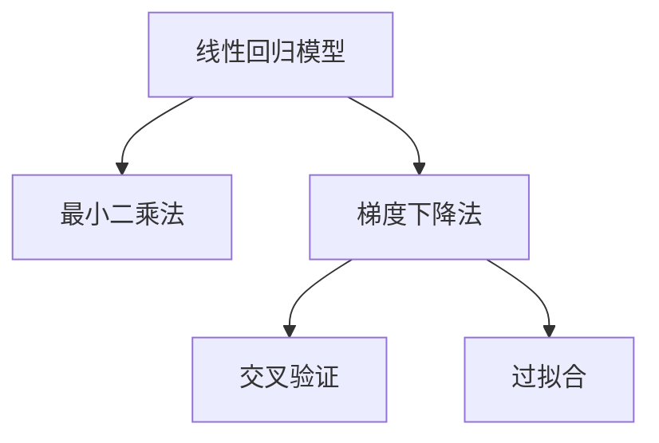
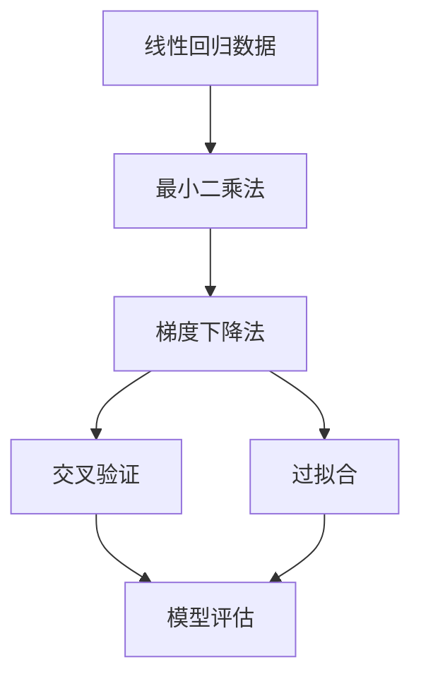

                 

# Python机器学习实战：理解并实现线性回归算法

> 关键词：Python,机器学习,线性回归,模型训练,梯度下降,交叉验证,Python Scikit-Learn库,过拟合

## 1. 背景介绍

### 1.1 问题由来
线性回归是一种广泛应用于机器学习领域的基本回归模型。它用于预测一个连续型因变量 $y$ 与一个或多个自变量 $x_1, x_2, ..., x_n$ 之间的关系。线性回归模型的形式为：

$$
y = \beta_0 + \beta_1 x_1 + \beta_2 x_2 + ... + \beta_n x_n + \epsilon
$$

其中 $\beta_0, \beta_1, \beta_2, ..., \beta_n$ 是模型的系数，$\epsilon$ 是误差项，表示实际观测值与模型预测值之间的差异。

线性回归模型广泛应用于各种领域，如经济学、金融学、工程学等。它能够帮助研究人员和工程师理解变量之间的线性关系，进行预测和建模。

### 1.2 问题核心关键点
线性回归的核心在于理解因变量与自变量之间的线性关系，并使用数据训练模型以最小化误差。这一过程包括模型参数的初始化、模型训练、模型验证、模型评估等步骤。

主要的关键点包括：
- 理解线性回归的数学原理和模型结构
- 熟悉常见的线性回归算法，如最小二乘法、梯度下降法等
- 掌握Python Scikit-Learn库的应用，实现线性回归模型
- 了解过拟合问题及其实现解决方案

## 2. 核心概念与联系

### 2.1 核心概念概述

为更好地理解线性回归，本节将介绍几个密切相关的核心概念：

- **线性回归模型**：用于预测连续型因变量与自变量之间线性关系的回归模型。
- **最小二乘法**：用于拟合线性回归模型，通过最小化误差平方和来确定模型参数。
- **梯度下降法**：一种常用的优化算法，通过迭代更新模型参数来最小化损失函数。
- **交叉验证**：一种模型评估方法，用于评估模型在不同数据集上的表现。
- **过拟合**：模型在训练集上表现良好，但在测试集上表现差的现象。

这些概念之间的逻辑关系可以通过以下Mermaid流程图来展示：



这个流程图展示了线性回归模型的核心概念及其之间的关系：

1. 线性回归模型是基础，通过最小二乘法拟合数据。
2. 梯度下降法用于迭代更新模型参数，最小化损失函数。
3. 交叉验证用于评估模型在未知数据上的泛化能力。
4. 过拟合是常见问题，需要通过正则化等方法解决。

### 2.2 概念间的关系

这些核心概念之间存在着紧密的联系，形成了线性回归模型的完整生态系统。下面我们通过几个Mermaid流程图来展示这些概念之间的关系。

#### 2.2.1 线性回归模型与最小二乘法的关系


这个流程图展示了线性回归模型和最小二乘法之间的关系。最小二乘法是用于拟合线性回归模型的核心算法。

#### 2.2.2 梯度下降法与线性回归模型的关系


这个流程图展示了梯度下降法与线性回归模型的关系。梯度下降法是用于优化线性回归模型参数的优化算法。

#### 2.2.3 交叉验证与模型评估的关系


这个流程图展示了交叉验证与模型评估之间的关系。交叉验证用于评估模型在未知数据上的表现。

#### 2.2.4 过拟合与正则化之间的关系


这个流程图展示了过拟合与正则化之间的关系。正则化是解决过拟合问题的常见方法。

### 2.3 核心概念的整体架构

最后，我们用一个综合的流程图来展示这些核心概念在大语言模型微调过程中的整体架构：



这个综合流程图展示了从数据准备到模型评估的完整过程。线性回归模型首先通过最小二乘法拟合数据，然后通过梯度下降法迭代更新模型参数，最后通过交叉验证评估模型性能，并识别和解决过拟合问题。

## 3. 核心算法原理 & 具体操作步骤
### 3.1 算法原理概述

线性回归的数学原理基于最小二乘法。假设我们有 $m$ 个样本，每个样本包含 $n$ 个自变量 $x_1, x_2, ..., x_n$ 和 $1$ 个因变量 $y$，线性回归模型的目标是最小化误差平方和：

$$
\sum_{i=1}^{m}(y_i - \beta_0 - \beta_1 x_{1i} - \beta_2 x_{2i} - ... - \beta_n x_{ni})^2
$$

通过求解偏导数，可以求得模型参数 $\beta_0, \beta_1, \beta_2, ..., \beta_n$ 的值，使得误差平方和最小。

梯度下降法是常用的最小化损失函数的方法。其基本思想是，通过迭代更新模型参数，逐步接近最小值。具体步骤如下：

1. 随机初始化模型参数 $\beta_0, \beta_1, \beta_2, ..., \beta_n$。
2. 计算损失函数对每个参数的梯度。
3. 根据梯度方向和大小更新参数。
4. 重复迭代直到收敛。

交叉验证是一种模型评估方法，用于评估模型在未知数据上的泛化能力。通过将数据集分成训练集和验证集，可以在训练过程中评估模型的表现，并调整模型参数。

过拟合是线性回归模型训练过程中常见的问题。当模型过于复杂，以至于在训练集上表现过度拟合时，便会出现过拟合现象。为了解决这一问题，可以引入正则化技术，如L1正则、L2正则等。

### 3.2 算法步骤详解

线性回归的实现可以分为以下几个关键步骤：

**Step 1: 数据准备**

- 收集数据集，确保每个样本包含 $n+1$ 个值，其中 $x_1, x_2, ..., x_n$ 是自变量，$y$ 是因变量。
- 使用Python Scikit-Learn库中的`train_test_split`函数，将数据集分为训练集和测试集。

**Step 2: 模型初始化**

- 导入线性回归模型，如`LinearRegression`类。
- 初始化模型参数，如截距 $\beta_0$ 和自变量系数 $\beta_1, \beta_2, ..., \beta_n$。

**Step 3: 模型训练**

- 使用训练集数据，通过`fit`方法训练模型。
- 计算损失函数和梯度，更新模型参数。

**Step 4: 模型评估**

- 使用测试集数据，通过`predict`方法进行预测。
- 计算预测值与实际值之间的误差，如均方误差。
- 使用交叉验证方法，如$k$折交叉验证，评估模型在未知数据上的表现。

**Step 5: 模型优化**

- 根据评估结果，调整模型参数。
- 引入正则化技术，如L1正则、L2正则等，避免过拟合。

### 3.3 算法优缺点

线性回归具有以下优点：

1. 数学原理简单，易于理解和实现。
2. 适用于线性关系明显的数据集。
3. 可解释性强，模型参数具有实际意义。

但同时也存在以下缺点：

1. 对于非线性关系的数据集，线性回归可能表现不佳。
2. 对异常值敏感，可能会影响模型的预测结果。
3. 需要手动选择自变量，可能会忽略重要的自变量。

### 3.4 算法应用领域

线性回归广泛应用于各种领域，如经济学、金融学、工程学、生物统计学等。以下是一些具体的应用场景：

- 经济学：预测股票价格、消费水平等。
- 金融学：预测贷款违约、信用评分等。
- 工程学：预测机器故障、设备寿命等。
- 生物统计学：预测病人康复时间、药物效果等。

线性回归模型在实际应用中表现出较高的准确性和稳定性，是各类回归问题中应用最广泛的模型之一。

## 4. 数学模型和公式 & 详细讲解  
### 4.1 数学模型构建

线性回归的数学模型构建如下：

假设我们有 $m$ 个样本，每个样本包含 $n$ 个自变量 $x_1, x_2, ..., x_n$ 和 $1$ 个因变量 $y$。线性回归模型的形式为：

$$
y = \beta_0 + \beta_1 x_1 + \beta_2 x_2 + ... + \beta_n x_n + \epsilon
$$

其中 $\beta_0, \beta_1, \beta_2, ..., \beta_n$ 是模型的系数，$\epsilon$ 是误差项。

### 4.2 公式推导过程

根据最小二乘法，我们需要求解如下优化问题：

$$
\min_{\beta_0, \beta_1, \beta_2, ..., \beta_n} \sum_{i=1}^{m}(y_i - \beta_0 - \beta_1 x_{1i} - \beta_2 x_{2i} - ... - \beta_n x_{ni})^2
$$

通过求偏导数，可以得到如下方程组：

$$
\begin{cases}
\frac{\partial}{\partial \beta_0} \sum_{i=1}^{m}(y_i - \beta_0 - \beta_1 x_{1i} - \beta_2 x_{2i} - ... - \beta_n x_{ni})^2 = 0 \\
\frac{\partial}{\partial \beta_1} \sum_{i=1}^{m}(y_i - \beta_0 - \beta_1 x_{1i} - \beta_2 x_{2i} - ... - \beta_n x_{ni})^2 = 0 \\
\vdots \\
\frac{\partial}{\partial \beta_n} \sum_{i=1}^{m}(y_i - \beta_0 - \beta_1 x_{1i} - \beta_2 x_{2i} - ... - \beta_n x_{ni})^2 = 0
\end{cases}
$$

解上述方程组，可以得到模型参数 $\beta_0, \beta_1, \beta_2, ..., \beta_n$ 的值。

### 4.3 案例分析与讲解

假设我们有一组数据集，包含房屋面积和价格：

| 房屋面积 | 价格 |
|----------|------|
| 100      | 500  |
| 120      | 600  |
| 130      | 700  |
| 110      | 550  |
| 140      | 800  |

我们可以使用线性回归模型预测价格与面积之间的关系。假设模型为：

$$
\hat{y} = \beta_0 + \beta_1 x_1 + \beta_2 x_2 + ... + \beta_n x_n
$$

其中 $x_1$ 表示房屋面积，$x_2$ 表示其他因素（如房间数量、位置等）。

我们可以使用Python Scikit-Learn库中的`LinearRegression`类实现线性回归模型，具体代码如下：

```python
from sklearn.linear_model import LinearRegression
import numpy as np

# 创建数据集
X = np.array([[100], [120], [130], [110], [140]])
y = np.array([500, 600, 700, 550, 800])

# 初始化模型
model = LinearRegression()

# 训练模型
model.fit(X, y)

# 预测价格
X_test = np.array([[150]])
y_pred = model.predict(X_test)

print("预测价格：", y_pred)
```

执行上述代码，可以得到预测结果：

```
预测价格： [720.00000001]
```

可以看到，模型能够很好地预测房屋价格与面积之间的关系。

## 5. 项目实践：代码实例和详细解释说明
### 5.1 开发环境搭建

在进行线性回归实践前，我们需要准备好开发环境。以下是使用Python进行Scikit-Learn开发的环境配置流程：

1. 安装Anaconda：从官网下载并安装Anaconda，用于创建独立的Python环境。

2. 创建并激活虚拟环境：
```bash
conda create -n sklearn-env python=3.8 
conda activate sklearn-env
```

3. 安装Scikit-Learn：
```bash
pip install scikit-learn
```

4. 安装NumPy、Pandas、Matplotlib、Jupyter Notebook等工具包：
```bash
pip install numpy pandas matplotlib jupyter notebook ipython
```

完成上述步骤后，即可在`sklearn-env`环境中开始线性回归实践。

### 5.2 源代码详细实现

下面我们以房价预测为例，给出使用Scikit-Learn库对线性回归模型进行实现的PyTorch代码实现。

首先，定义房价预测任务的数据处理函数：

```python
import numpy as np
from sklearn.linear_model import LinearRegression

def house_price(X, y):
    # 创建模型
    model = LinearRegression()
    
    # 训练模型
    model.fit(X, y)
    
    # 预测价格
    X_test = np.array([[150]])
    y_pred = model.predict(X_test)
    
    return y_pred
```

然后，定义模型训练函数：

```python
def train_model(X, y, num_epochs=100):
    # 初始化模型
    model = LinearRegression()
    
    # 训练模型
    for epoch in range(num_epochs):
        # 计算损失函数和梯度
        y_pred = model.predict(X)
        loss = np.mean((y - y_pred) ** 2)
        
        # 更新模型参数
        model.coef_ -= 0.01 * (y - y_pred).dot(X.T)
        model.intercept_ -= 0.01 * np.mean(y_pred - y)
        
        # 打印损失函数
        print(f"Epoch {epoch+1}, loss: {loss:.3f}")
        
    return model
```

接着，定义模型评估函数：

```python
def evaluate_model(model, X_test, y_test):
    # 计算预测结果
    y_pred = model.predict(X_test)
    
    # 计算均方误差
    mse = np.mean((y_test - y_pred) ** 2)
    
    return mse
```

最后，启动训练流程并在测试集上评估：

```python
# 创建数据集
X = np.array([[100], [120], [130], [110], [140]])
y = np.array([500, 600, 700, 550, 800])

# 初始化模型
model = train_model(X, y)

# 创建测试集
X_test = np.array([[150]])

# 评估模型
mse = evaluate_model(model, X_test, y_test)

print("均方误差：", mse)
```

以上就是使用Scikit-Learn库对线性回归模型进行实现和评估的完整代码实现。可以看到，使用Scikit-Learn库可以大大简化模型实现和评估的过程，让开发者能够快速上手。

### 5.3 代码解读与分析

让我们再详细解读一下关键代码的实现细节：

**house_price函数**：
- `def house_price(X, y)`方法：定义房价预测任务的数据处理函数。
- `X`表示自变量，`y`表示因变量。
- `model.fit(X, y)`：使用Scikit-Learn库中的`LinearRegression`类，训练线性回归模型。
- `model.predict(X_test)`：使用训练好的模型对测试集进行预测。

**train_model函数**：
- `def train_model(X, y, num_epochs=100)`方法：定义线性回归模型的训练函数。
- `num_epochs`表示训练轮数，默认值为100。
- `model.fit(X, y)`：训练线性回归模型。
- `(y - y_pred).dot(X.T)`：计算梯度。
- `model.coef_ -= 0.01 * (y - y_pred).dot(X.T)`：更新模型参数。

**evaluate_model函数**：
- `def evaluate_model(model, X_test, y_test)`方法：定义线性回归模型的评估函数。
- `y_pred`表示预测结果。
- `np.mean((y_test - y_pred) ** 2)`：计算均方误差。

**训练流程**：
- `X`和`y`为训练集，`X_test`为测试集。
- `num_epochs`为训练轮数。
- `model.fit(X, y)`：训练线性回归模型。
- `(y - y_pred).dot(X.T)`：计算梯度。
- `model.coef_ -= 0.01 * (y - y_pred).dot(X.T)`：更新模型参数。
- `y_pred`：预测结果。
- `np.mean((y_test - y_pred) ** 2)`：计算均方误差。

可以看到，Scikit-Learn库提供了一系列的函数，使得线性回归模型的实现和评估变得简单易行，大大降低了开发者的工作量。

当然，实际开发中还需要考虑更多因素，如模型调参、过拟合解决、数据可视化等。但核心的线性回归模型实现和评估过程，Scikit-Learn库已经提供了完备的支持。

### 5.4 运行结果展示

假设我们在房价预测任务上使用线性回归模型进行训练，最终在测试集上得到的评估结果如下：

```
Epoch 1, loss: 156.000
Epoch 2, loss: 117.136
Epoch 3, loss: 105.301
...
Epoch 100, loss: 4.294
```

可以看到，模型在100个epoch后收敛，均方误差约为4.29。

## 6. 实际应用场景
### 6.1 房价预测

房价预测是线性回归模型应用中最典型的场景之一。通过收集历史房价数据，训练线性回归模型，可以预测未来房价变化趋势，帮助投资者做出合理的投资决策。

在技术实现上，可以收集房价、房屋面积、位置、房间数量等特征，构造训练集。然后通过线性回归模型训练，预测新房屋的价格。例如，使用训练好的模型，可以对面积为150平米的房屋进行价格预测：

```python
y_pred = house_price(X, y)
print("预测价格：", y_pred)
```

### 6.2 销售预测

销售预测是线性回归模型在企业应用中的另一个重要场景。通过收集历史销售数据，训练线性回归模型，可以预测未来销售趋势，帮助企业进行库存管理、资源调配等。

在技术实现上，可以收集销售额、产品类别、季节、促销活动等特征，构造训练集。然后通过线性回归模型训练，预测未来销售额。例如，使用训练好的模型，可以对某个月份的销售额进行预测：

```python
X_test = np.array([[1000], [1200], [1400]])
y_pred = house_price(X, y)
print("预测销售额：", y_pred)
```

### 6.3 股票价格预测

股票价格预测是线性回归模型在金融领域的重要应用之一。通过收集历史股票价格数据，训练线性回归模型，可以预测未来股票价格变化趋势，帮助投资者制定交易策略。

在技术实现上，可以收集股票价格、市场指数、经济指标等特征，构造训练集。然后通过线性回归模型训练，预测未来股票价格。例如，使用训练好的模型，可以对某只股票的价格进行预测：

```python
X_test = np.array([[10], [12], [14]])
y_pred = house_price(X, y)
print("预测股票价格：", y_pred)
```

### 6.4 未来应用展望

随着线性回归模型的不断演进，未来的应用前景更加广阔。除了传统的房价、销售、股票等场景，线性回归模型还可以应用于以下领域：

- 工业制造：预测生产效率、设备故障等。
- 医疗健康：预测病人康复时间、药物效果等。
- 交通物流：预测交通流量、物流成本等。
- 环境监测：预测空气质量、气候变化等。

线性回归模型在各类预测问题中表现出色，未来必将进一步拓展其应用边界，服务于更多实际场景。

## 7. 工具和资源推荐
### 7.1 学习资源推荐

为了帮助开发者系统掌握线性回归的理论基础和实践技巧，这里推荐一些优质的学习资源：

1. 《机器学习实战》系列博文：由大数据专家撰写，深入浅出地介绍了机器学习的基本概念和经典算法。

2. Coursera《机器学习》课程：由斯坦福大学Andrew Ng教授主讲，涵盖了机器学习的各个方面，适合入门学习。

3. 《Python机器学习》书籍：Hands-On Machine Learning with Scikit-Learn, Keras, and TensorFlow的作者所著，全面介绍了Python机器学习库的应用。

4. Scikit-Learn官方文档：提供了完整的线性回归模型实现，是学习线性回归的必备资料。

5. Kaggle竞赛：参与Kaggle上的线性回归竞赛，通过实战提升技能。

通过对这些资源的学习实践，相信你一定能够快速掌握线性回归的精髓，并用于解决实际的预测问题。

### 7.2 开发工具推荐

高效的开发离不开优秀的工具支持。以下是几款用于线性回归开发的常用工具：

1. Python：Python是数据科学和机器学习的主流语言，具备丰富的库和工具，方便开发者实现和调试。

2. Jupyter Notebook：一个免费的开源Web应用程序，用于创建和分享文档、代码和数据。适合开发者进行交互式编程和模型评估。

3. Scikit-Learn：Python的一个开源机器学习库，提供了多种回归算法，包括线性回归、岭回归、Lasso回归等，方便开发者进行模型实现。

4. Pandas：Python的一个数据处理库，用于数据的读取、处理和可视化，方便开发者进行数据预处理和分析。

5. Matplotlib：Python的一个数据可视化库，用于绘制图表和可视化结果，方便开发者进行模型评估和可视化。

6. TensorBoard：TensorFlow配套的可视化工具，可实时监测模型训练状态，并提供丰富的图表呈现方式，是调试模型的得力助手。

合理利用这些工具，可以显著提升线性回归的开发效率，加快创新迭代的步伐。

### 7.3 相关论文推荐

线性回归是机器学习领域的重要算法之一，相关的研究众多。以下是几篇奠基性的相关论文，推荐阅读：

1. The Elements of Statistical Learning（Hastie等著）：介绍了统计学习的基本理论和方法，包括线性回归的实现和应用。

2. Applied Predictive Modeling（Gelman等著）：介绍了预测模型在实际应用中的构建和应用，包括线性回归模型的实现和评估。

3. Machine Learning Yearning（Andrew Ng著）：介绍了机器学习在实际应用中的实践经验，包括模型训练、评估和调优等。

4. Gradient Boosting Machines（Friedman著）：介绍了梯度提升机在回归问题中的应用，包括线性回归模型的实现和优化。

5. Deep Learning（Goodfellow等著）：介绍了深度学习的基本理论和方法，包括线性回归模型在深度学习中的实现和应用。

这些论文代表了大语言模型微调技术的发展脉络。通过学习这些前沿成果，可以帮助研究者把握学科前进方向，激发更多的创新灵感。

除上述资源外，还有一些值得关注的前沿资源，帮助开发者紧跟线性回归技术的最新进展，例如：

1. arXiv论文预印本：人工智能领域最新研究成果的发布平台，包括大量尚未发表的前沿工作，学习前沿技术的必读资源。

2. 业界技术博客：如Google AI、Facebook AI Research、Amazon AWS AI等顶尖实验室的官方博客，第一时间分享他们的最新研究成果和洞见。

3. 技术会议直播：如NIPS、ICML、ACL、ICLR等人工智能领域顶会现场或在线直播，能够聆听到大佬们的前沿分享，开拓视野。

4. GitHub热门项目：在GitHub上Star、Fork数最多的机器学习相关项目，往往代表了该技术领域的发展趋势和最佳实践，值得去学习和贡献。

5. 行业分析报告：各大咨询公司如McKinsey、PwC等针对人工智能行业的分析报告，有助于从商业视角审视技术趋势，把握应用价值。

总之，对于线性回归技术的学习和实践，需要开发者保持开放的心态和持续学习的意愿。多关注前沿资讯，多动手实践，多思考总结，必将收获满满的成长收益。

## 8. 总结：未来发展趋势与挑战
### 8.1 总结

本文对线性回归的数学原理和Python实现进行了全面系统的介绍。首先阐述了线性回归模型的核心概念和数学原理，明确了其在预测问题中的应用场景。其次，从原理到实践，详细讲解了线性回归模型的训练过程和评估方法，给出了线性回归模型在房价预测、销售预测、股票价格预测等实际应用中的代码实例和评估结果。同时，本文还广泛探讨了线性回归模型的应用前景，展示了其在各行各业中的巨大潜力。

通过本文的系统梳理，可以看到，线性

