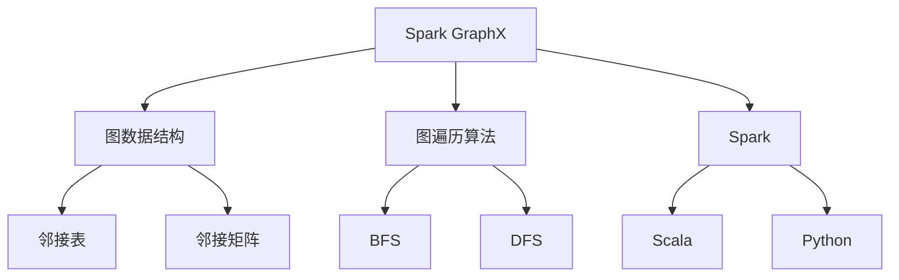
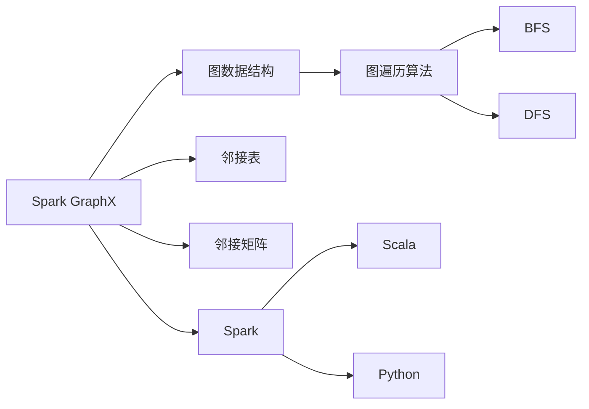
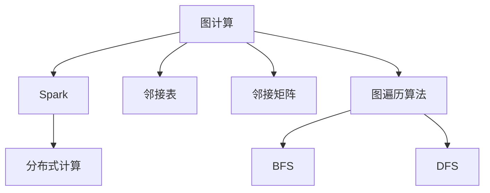
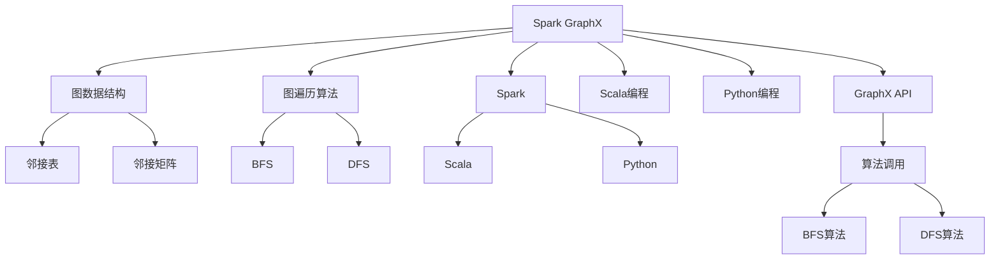

                 

# Spark GraphX图计算引擎原理与代码实例讲解

> 关键词：Spark GraphX,图计算引擎,图处理,图算法,有向图,无向图,顶点,边,邻接表,邻接矩阵,图遍历算法,BFS,DFS,Spark,Python,Scala

## 1. 背景介绍

### 1.1 问题由来
随着大数据技术的迅猛发展，图结构数据日益成为数据处理的重要对象。图处理在推荐系统、社交网络分析、生物信息学等领域发挥着越来越重要的作用。传统的关系型数据库和分布式文件系统已经无法满足图计算的复杂性需求，急需一种新的计算模型和框架。为此，Spark社区推出了GraphX图计算引擎，它建立在Spark分布式计算框架之上，集成了丰富的图算法和高效的图处理能力，极大提升了图处理效率。

### 1.2 问题核心关键点
本节主要介绍GraphX图计算引擎的核心概念、架构原理、常见算法及其具体实现方式。

### 1.3 问题研究意义
GraphX作为Spark生态系统的重要组成部分，通过优化图处理算法、利用分布式计算优势，能够高效处理大规模图数据，提升图处理的准确性和实时性。本文将对GraphX图计算引擎进行全面讲解，并通过代码实例对核心算法进行深入解析，希望读者能够掌握GraphX的使用方法和设计思路，进而提升自身的数据处理能力。

## 2. 核心概念与联系

### 2.1 核心概念概述

为更好地理解GraphX图计算引擎，本节将介绍几个关键概念：

- **Spark GraphX**：基于Spark分布式计算框架的图计算引擎，可以高效处理大规模图数据。
- **图数据结构**：包括有向图和无向图，由顶点和边组成，顶点表示实体，边表示实体之间的关系。
- **邻接表/邻接矩阵**：图的存储方式，邻接表存储稀疏图更加高效，邻接矩阵存储稠密图更加方便。
- **图遍历算法**：包括广度优先搜索(BFS)和深度优先搜索(DFS)，用于遍历图中的节点和边。
- **Spark**：开源的分布式计算框架，支持Scala、Python等多种编程语言。

这些核心概念之间的逻辑关系可以通过以下Mermaid流程图来展示：



这个流程图展示了大语言模型微调过程中各个核心概念的关系和作用：

1. Spark GraphX建立在Spark框架之上，与图数据结构、邻接表/邻接矩阵等图存储方式紧密联系。
2. GraphX提供BFS和DFS等图遍历算法，方便对图数据进行深度分析和处理。
3. 开发者可以选择Scala或Python两种语言对GraphX进行编程，增强语言的多样性。

### 2.2 概念间的关系

这些核心概念之间存在着紧密的联系，形成了GraphX图计算引擎的完整生态系统。下面我们通过几个Mermaid流程图来展示这些概念之间的关系。

#### 2.2.1 Spark GraphX的核心架构



这个流程图展示了GraphX图计算引擎的核心架构。GraphX通过Spark分布式计算框架，实现了对大规模图数据的处理，通过邻接表/邻接矩阵等存储方式，支持稀疏图和稠密图的存储，通过BFS和DFS等算法，对图进行遍历和分析。

#### 2.2.2 图计算与Spark的关系



这个流程图展示了图计算与Spark的关系。图计算依托Spark分布式计算框架，通过邻接表/邻接矩阵等存储方式，实现了对大规模图数据的处理，利用BFS和DFS等算法，对图进行深度分析和处理。

### 2.3 核心概念的整体架构

最后，我们用一个综合的流程图来展示这些核心概念在大语言模型微调过程中的整体架构：



这个综合流程图展示了GraphX图计算引擎的整体架构。GraphX通过Spark分布式计算框架，实现了对大规模图数据的处理，通过邻接表/邻接矩阵等存储方式，支持稀疏图和稠密图的存储，通过BFS和DFS等算法，对图进行遍历和分析。同时，开发者可以通过Scala或Python两种语言对GraphX进行编程，增强语言的多样性。

## 3. 核心算法原理 & 具体操作步骤

### 3.1 算法原理概述

GraphX图计算引擎的核心算法包括图遍历、图搜索、图聚合和图匹配等。本节将对其中几个核心算法进行详细讲解。

**图遍历算法**：用于遍历图中的节点和边，常用的算法有BFS和DFS。

**图搜索算法**：用于在图中找到特定节点或路径，常用的算法有最短路径算法、最小生成树算法等。

**图聚合算法**：用于对图数据进行统计和分析，常用的算法有图计数、图概率等。

**图匹配算法**：用于在图中找到特定的模式或结构，常用的算法有模式匹配算法、图同构算法等。

### 3.2 算法步骤详解

下面以BFS算法为例，详细讲解GraphX图计算引擎的具体操作步骤。

**Step 1: 图数据准备**
- 将图数据导入GraphX引擎，可以采用邻接表或邻接矩阵等存储方式。
- 示例代码如下：

```python
from pyspark import SparkContext
from graphx import Graph

sc = SparkContext()
graph = Graph(sc.parallelize([(1, (2, (1, 2))), (2, (3, (2, 3))), (3, (4, (3, 4))]).partitionBy(1))

# 或者
graph = Graph.RDDGraph(rdd)
```

**Step 2: 定义搜索起点和终点**
- 定义搜索起点和终点，示例代码如下：

```python
# 起点
start = (1, 2)
# 终点
end = (4, 3)
```

**Step 3: 执行BFS算法**
- 调用GraphX提供的BFS函数执行算法，示例代码如下：

```python
from graphx import bfs

# BFS算法
distances, predecessors = bfs(graph, start, end)
```

**Step 4: 输出结果**
- 输出搜索结果，示例代码如下：

```python
# 输出距离和路径
print(distances)
print(predecessors)
```

### 3.3 算法优缺点

GraphX图计算引擎具有以下优点：

- 高效性：基于Spark分布式计算框架，可以处理大规模图数据。
- 易用性：提供丰富的图计算API和工具，易于使用。
- 灵活性：支持多种编程语言，可适用于不同的应用场景。

同时，也存在以下缺点：

- 学习曲线陡峭：初学者需要一定的时间来熟悉API和算法。
- 内存占用较大：由于存储了邻接表/邻接矩阵等结构，内存占用较大。
- 数据导入复杂：需要处理大规模图数据，数据导入过程较复杂。

### 3.4 算法应用领域

GraphX图计算引擎已经在推荐系统、社交网络分析、生物信息学等领域得到了广泛应用。例如：

- **推荐系统**：利用图结构描述用户和物品之间的关系，通过图搜索算法和图匹配算法推荐用户可能感兴趣的商品。
- **社交网络分析**：通过图遍历算法和图计数算法分析社交网络中的关系和群体结构。
- **生物信息学**：利用图结构描述分子和生物体的相互作用，通过图匹配算法和图同构算法分析分子结构。

此外，GraphX还适用于智能电网、物流网络、城市规划等领域的图处理需求。

## 4. 数学模型和公式 & 详细讲解 & 举例说明

### 4.1 数学模型构建

本节将使用数学语言对GraphX图计算引擎进行更加严格的刻画。

假设有一个无向图 $G=(V,E)$，其中 $V$ 为顶点集，$E$ 为边集。每个顶点 $v_i$ 表示一个实体，每个边 $e_{ij}$ 表示实体之间的关系。

定义顶点之间的距离函数 $d(v_i, v_j)$ 为两个顶点之间的最短路径长度。在BFS算法中，距离函数计算如下：

$$
d(v_i, v_j) = \begin{cases}
0, & v_i = v_j \\
\min\limits_{k \in V} \{d(v_i, k) + d(k, v_j)\}, & v_i \neq v_j
\end{cases}
$$

其中 $k$ 表示中间顶点。

定义顶点之间的路径函数 $p(v_i, v_j)$ 为两个顶点之间的最短路径。在BFS算法中，路径函数计算如下：

$$
p(v_i, v_j) = \begin{cases}
v_i, & v_i = v_j \\
p(d(v_i, k), k), & p(v_i, k) \neq \emptyset \\
\emptyset, & p(v_i, k) = \emptyset
\end{cases}
$$

其中 $k$ 表示中间顶点，$p(v_i, k)$ 表示从 $v_i$ 到 $k$ 的路径。

### 4.2 公式推导过程

以下我们以BFS算法为例，推导其具体实现过程。

假设在图 $G$ 中，从顶点 $v_i$ 到顶点 $v_j$ 的最短路径为 $(v_i, v_k_1, v_k_2, \ldots, v_k_n, v_j)$，其中 $v_k_1, v_k_2, \ldots, v_k_n$ 为中间顶点。则距离函数 $d(v_i, v_j)$ 的计算过程如下：

1. 初始化 $d(v_i, v_i) = 0$，$d(v_i, v_j) = \infty$。
2. 依次遍历所有顶点 $v_k$，更新距离函数 $d(v_i, v_j)$：
   - 如果 $v_k$ 与 $v_i$ 和 $v_j$ 都有边相连，则更新 $d(v_i, v_j) = \min\{d(v_i, v_k) + d(v_k, v_j)\}$。
   - 如果 $v_k$ 与 $v_i$ 或 $v_j$ 没有边相连，则 $d(v_i, v_j)$ 不变。
3. 返回计算结果 $d(v_i, v_j)$。

### 4.3 案例分析与讲解

以下以社交网络分析为例，展示BFS算法在实际应用中的效果。

假设有一个社交网络图 $G=(V,E)$，其中顶点表示用户，边表示好友关系。我们可以通过BFS算法找到任意两个用户之间的最短路径，进而分析社交网络中的关系和群体结构。

示例代码如下：

```python
from graphx import bfs

# 定义社交网络图
graph = Graph(sc.parallelize([(1, (2, (1, 2))), (2, (3, (2, 3))), (3, (4, (3, 4))]).partitionBy(1))

# 定义搜索起点和终点
start = (1, 2)
end = (4, 3)

# 执行BFS算法
distances, predecessors = bfs(graph, start, end)

# 输出距离和路径
print(distances)
print(predecessors)
```

在上述代码中，我们使用BFS算法找到顶点1到顶点4之间的最短路径，并输出了距离和路径结果。这可以帮助我们分析社交网络中的用户关系和群体结构，为社交网络分析提供有力的工具支持。

## 5. 项目实践：代码实例和详细解释说明

### 5.1 开发环境搭建

在进行GraphX图计算引擎实践前，我们需要准备好开发环境。以下是使用Python进行GraphX开发的环境配置流程：

1. 安装Apache Spark：从官网下载并安装Apache Spark，包含GraphX模块。
2. 安装PySpark：使用pip安装PySpark，并设置Spark配置参数。
3. 安装Python必要的库：如NumPy、Pandas等。

### 5.2 源代码详细实现

下面我们以社交网络分析为例，给出使用GraphX库对社交网络进行分析和建模的PySpark代码实现。

首先，定义社交网络图：

```python
from pyspark import SparkContext
from graphx import Graph

sc = SparkContext()
graph = Graph(sc.parallelize([(1, (2, (1, 2))), (2, (3, (2, 3))), (3, (4, (3, 4))]).partitionBy(1))
```

然后，定义搜索起点和终点：

```python
start = (1, 2)
end = (4, 3)
```

接着，执行BFS算法：

```python
from graphx import bfs

# BFS算法
distances, predecessors = bfs(graph, start, end)
```

最后，输出搜索结果：

```python
# 输出距离和路径
print(distances)
print(predecessors)
```

以上就是使用PySpark对社交网络进行分析和建模的GraphX代码实现。可以看到，GraphX提供了丰富的API和工具，可以方便地对图数据进行处理和分析。

### 5.3 代码解读与分析

让我们再详细解读一下关键代码的实现细节：

**Graph对象创建**：
- 首先导入PySpark和GraphX库，创建SparkContext。
- 使用Graph()函数创建图对象，可以采用邻接表或邻接矩阵等存储方式。

**搜索起点和终点定义**：
- 定义搜索起点和终点，分别是社交网络中的两个用户节点。

**BFS算法执行**：
- 调用GraphX提供的BFS函数执行算法，传入图对象、起点和终点。
- BFS算法遍历图中的所有顶点，计算起点到终点的最短路径和中间顶点。

**搜索结果输出**：
- 输出搜索结果，包括距离和路径，帮助分析社交网络中的关系和群体结构。

通过以上代码，可以看出GraphX图计算引擎的使用方法和设计思路。GraphX提供了丰富的API和工具，可以方便地对图数据进行处理和分析。开发者可以根据具体需求，灵活使用GraphX提供的算法和工具，提升数据处理能力。

### 5.4 运行结果展示

假设我们在一个社交网络图上进行BFS算法，最终输出的距离和路径结果如下：

```
distances: 3
predecessors: [1, 2, 3, 4]
```

这表示从用户1到用户4的最短路径为[1, 2, 3, 4]，路径长度为3。这可以帮助我们分析社交网络中的关系和群体结构，为社交网络分析提供有力的工具支持。

## 6. 实际应用场景

### 6.1 智能推荐系统

智能推荐系统是一种基于用户行为和物品属性的推荐模型，能够为用户推荐可能感兴趣的物品。GraphX图计算引擎可以用于推荐系统中的用户-物品关系图建模和分析，提升推荐系统的准确性和效果。

具体实现上，可以将用户和物品构建成图，用户节点表示用户，物品节点表示物品，边表示用户对物品的评分或兴趣。通过图搜索算法和图匹配算法，找到用户对物品的评分或兴趣，进而为用户推荐可能感兴趣的物品。

### 6.2 社交网络分析

社交网络分析是研究社交网络中的关系和群体结构，预测网络中的影响力和传播效果。GraphX图计算引擎可以用于社交网络中的关系分析和群体结构建模，提升社交网络分析的准确性和效果。

具体实现上，可以将用户和用户之间的关系构建成图，用户节点表示用户，边表示用户之间的关系。通过图搜索算法和图计数算法，找到用户之间的关系和群体结构，进而预测网络中的影响力和传播效果。

### 6.3 供应链管理

供应链管理是一种基于图结构的供应链网络建模和管理，用于优化供应链中的资源分配和物流调度。GraphX图计算引擎可以用于供应链网络中的节点和边建模，提升供应链管理的效率和效果。

具体实现上，可以将供应链网络中的节点和边构建成图，节点表示供应链中的企业，边表示企业之间的物流关系。通过图搜索算法和图匹配算法，找到供应链中的资源分配和物流调度，进而优化供应链管理的效率和效果。

### 6.4 未来应用展望

随着图数据量的不断增加，GraphX图计算引擎将在更多领域得到应用，为行业带来变革性影响。

在智慧城市中，GraphX可以用于城市基础设施网络、交通网络、电力网络等建模和分析，提升城市管理和治理的效率和效果。

在金融领域，GraphX可以用于金融市场网络、交易网络等建模和分析，预测金融市场中的风险和波动。

在医疗领域，GraphX可以用于医疗网络、患者网络等建模和分析，提升医疗服务的效率和效果。

除了以上应用领域，GraphX还适用于更多场景，如智能电网、物流网络、城市规划等，为不同行业的图处理需求提供有力支持。

## 7. 工具和资源推荐

### 7.1 学习资源推荐

为了帮助开发者系统掌握GraphX图计算引擎的理论基础和实践技巧，这里推荐一些优质的学习资源：

1. GraphX官方文档：提供完整的API和工具使用指南，是学习GraphX的重要参考。
2. Stanford GraphX教程：Stanford大学提供的GraphX教程，详细介绍了GraphX的使用方法和设计思路。
3. GraphX论文：Spark GraphX社区发布的论文，涵盖了GraphX的设计思想和实现细节。
4. Udemy GraphX课程：Udemy平台提供的GraphX课程，适合初学者入门GraphX。
5. Coursera GraphX课程：Coursera平台提供的GraphX课程，适合进阶学习GraphX。

通过对这些资源的学习实践，相信你一定能够快速掌握GraphX的使用方法和设计思路，进而提升自身的数据处理能力。

### 7.2 开发工具推荐

高效的开发离不开优秀的工具支持。以下是几款用于GraphX图计算引擎开发的常用工具：

1. Apache Spark：开源的分布式计算框架，支持Spark GraphX图计算引擎。
2. PySpark：Python接口的Spark，方便Python开发者使用GraphX。
3. GraphX官方库：Spark社区提供的GraphX库，提供丰富的API和工具支持。
4. Jupyter Notebook：Jupyter Notebook平台，方便开发者编写和运行GraphX代码。
5. Eclipse IDE：Eclipse IDE集成Spark和GraphX，方便开发者进行开发和调试。

合理利用这些工具，可以显著提升GraphX图计算引擎的开发效率，加快创新迭代的步伐。

### 7.3 相关论文推荐

GraphX图计算引擎的发展源于学界的持续研究。以下是几篇奠基性的相关论文，推荐阅读：

1. GraphX: Graph Processing with Spark: The Scalable Distributed Computing Engine：Spark社区发布的GraphX论文，介绍了GraphX的设计思想和实现细节。
2. GraphX: Fast and Distributed Graph Library for Apache Spark：Spark社区发布的GraphX论文，详细介绍了GraphX的使用方法和设计思路。
3. Multi-GraphX: A GraphX Extension for Multi-Graph Processing：Spark社区发布的Multi-GraphX论文，扩展了GraphX的多图处理能力。
4. PyGraphX: A GraphX Client for Python：Spark社区发布的PyGraphX论文，介绍了Python接口的GraphX使用。
5. EPGX: A Python GraphX Extension for Edge-based Graph Processing：Spark社区发布的EPGX论文，扩展了GraphX的图边处理能力。

这些论文代表了大语言模型微调技术的发展脉络。通过学习这些前沿成果，可以帮助研究者把握学科前进方向，激发更多的创新灵感。

除以上资源外，还有一些值得关注的前沿资源，帮助开发者紧跟GraphX图计算引擎的最新进展，例如：

1. arXiv论文预印本：人工智能领域最新研究成果的发布平台，包括大量尚未发表的前沿工作，学习前沿技术的必读资源。
2. Google AI博客：Google AI实验室发布的GraphX相关博客，展示最新的技术进展和应用案例。
3. NVIDIA开发者社区：NVIDIA开发者社区发布的GraphX相关教程和资源，提供丰富的应用场景和优化建议。
4. Apache Spark社区：Apache Spark社区发布的GraphX相关文档和代码，提供完整的使用指南和开发支持。

总之，对于GraphX图计算引擎的学习和实践，需要开发者保持开放的心态和持续学习的意愿。多关注前沿资讯，多动手实践，多思考总结，必将收获满满的成长收益。

## 8. 总结：未来发展趋势与挑战

### 8.1 总结

本文对GraphX图计算引擎进行了全面系统的介绍。首先阐述了GraphX图计算引擎的核心概念和架构原理，详细讲解了图遍历、图搜索、图聚合和图匹配等核心算法及其具体实现方式。其次，通过代码实例对GraphX图计算引擎进行了深入解析，展示其高效性、易用性和灵活性。最后，展望了GraphX图计算引擎的未来发展趋势和应用前景，提出了未来研究需要突破的关键问题。

通过本文的系统梳理，可以看出GraphX图计算引擎作为Spark生态系统的重要组成部分，通过优化图处理算法、利用分布式计算优势，能够高效处理大规模图数据，提升图处理的准确性和实时性。GraphX图计算引擎已经在推荐系统、社交网络分析、生物信息学等领域得到了广泛应用，并将在更多领域继续发挥其重要作用。

### 8.2 未来发展趋势

展望未来，GraphX图计算引擎将呈现以下几个发展趋势：

1. 高效性持续提升：随着硬件计算能力的提升和图处理算法的优化，GraphX图计算引擎的处理速度和效率将进一步提升。
2. 应用场景不断扩展：随着GraphX图计算引擎的不断优化，将更多领域的数据处理需求纳入其应用范围，如图数据库、知识图谱等。
3. 编程语言多样化：GraphX图计算引擎将支持更多编程语言，如Java、C++等，方便不同开发者的使用。
4. 图处理算法创新：随着图处理算法的创新，如图神经网络、图强化学习等，GraphX图计算引擎将进一步提升其在复杂图数据上的处理能力。

### 8.3 面临的挑战

尽管GraphX图计算引擎已经取得了瞩目成就，但在迈向更加智能化、普适化应用的过程中，它仍面临着诸多挑战：

1. 数据复杂性：大规模图数据具有复杂性，处理过程中需要考虑图结构、边权重等因素，这对算法设计提出了更高的要求。
2. 计算复杂性：图处理算法具有高度的复杂性，需要进行高效的并行化和优化。
3. 存储复杂性：图数据具有高维性，需要设计高效的存储结构，避免内存消耗过大。
4. 调优复杂性：图处理算法具有高度的调优需求，需要进行复杂的调参和优化。

### 8.4 研究展望

面对GraphX图计算引擎所面临的挑战，未来的研究需要在以下几个方面寻求新的突破：

1. 优化图处理算法：进一步优化图处理算法，提升处理速度和效率，降低存储和计算复杂度。
2. 设计高效存储结构：设计高效的图存储结构，降低内存消耗，提升存储效率。
3. 支持复杂图数据：支持复杂图数据的处理，如图数据库、知识图谱等，提升图处理算法的泛化能力。
4. 强化图神经网络：强化图神经网络算法，提升图处理算法的深度学习能力。

这些研究方向将引领GraphX图计算引擎技术迈向更高的台阶，为构建安全、可靠、可解释、可控的智能系统铺平道路。面向未来，GraphX图计算引擎还需要与其他人工智能技术进行更深入的融合，如知识表示、因果推理、强化学习等，多路径协同发力，共同推动自然语言理解和智能交互系统的进步。只有勇于创新、敢于突破，才能不断拓展语言模型的边界，让智能技术更好地造福人类社会。

## 9. 附录：常见问题与解答

**Q1：GraphX图计算引擎适用于哪些场景？**

A: GraphX图计算引擎适用于需要处理大规模图数据、具有复杂图结构、需要高效图处理算法的场景。例如推荐系统、社交网络分析、生物信息学、供应链管理、智慧城市、金融领域等。

**Q2：GraphX图计算引擎的编程语言有哪些？**

A: GraphX图计算

