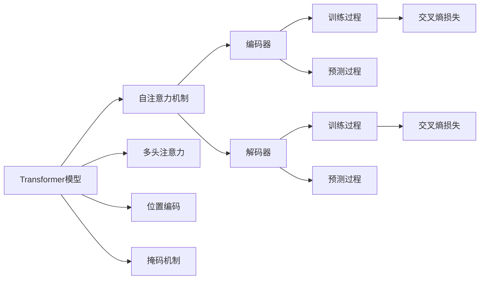
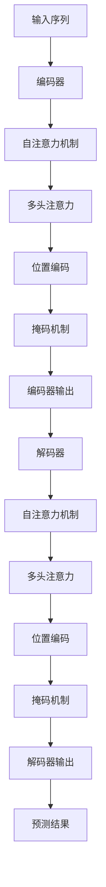

                 

# Transformer 原理与代码实战案例讲解

> 关键词：Transformer, 自注意力机制, 神经网络, 模型训练, 实践案例, 代码解析

## 1. 背景介绍

### 1.1 问题由来
Transformer模型自提出以来，便以其卓越的性能在自然语言处理（NLP）领域崭露头角。相比于传统的基于循环神经网络（RNN）和卷积神经网络（CNN）的模型，Transformer能够处理更长的文本序列，具备更好的并行计算能力，并且在多个NLP任务上取得了最先进的结果。

### 1.2 问题核心关键点
Transformer的核心是自注意力机制，通过在每个时间步计算所有序列位置间的注意力权重，从而实现序列之间的信息交互和信息捕获。Transformer模型的主要组成部分包括编码器（Encoder）和解码器（Decoder），其中编码器由多层Transformer块组成，解码器则在此基础上增加一个线性投影层。Transformer模型的训练过程主要通过最大化注意力机制下的目标序列和预测序列之间的交叉熵损失来实现。

### 1.3 问题研究意义
了解Transformer的原理和代码实现，对于深入掌握NLP模型开发、部署和优化至关重要。它不仅能够帮助开发者设计高效、通用的NLP模型，还能够指导实际项目中模型的部署和应用，加速NLP技术的产业化进程。Transformer的成功应用，也为NLP领域的未来发展提供了强有力的理论基础和技术支持。

## 2. 核心概念与联系

### 2.1 核心概念概述

为了更好地理解Transformer模型，我们首先介绍几个关键概念：

- **Transformer模型**：基于自注意力机制的深度神经网络，用于处理序列数据的模型，能够处理长距离依赖关系，适用于自然语言处理等任务。

- **自注意力机制（Self-Attention）**：Transformer模型的核心，通过计算序列中每个位置的注意力权重，实现对序列中不同位置的信息捕获和交互。

- **多头注意力（Multi-Head Attention）**：自注意力机制的扩展，通过并行计算多个注意力头（Head），实现更丰富的特征表示。

- **位置编码（Positional Encoding）**：由于Transformer模型中不包含位置信息，需要通过位置编码来模拟位置信息，从而确保模型在处理长序列时能正确识别位置。

- **掩码机制（Masking）**：在训练过程中，通过掩码机制来防止模型对未来的信息进行学习，确保模型能够正确地预测下一个时间步的输出。

- **交叉熵损失（Cross-Entropy Loss）**：Transformer模型训练中常用的损失函数，用于最大化目标序列和预测序列之间的相似度。

这些核心概念之间通过自注意力机制等技术紧密相连，共同构成了Transformer模型的基本架构和训练流程。

### 2.2 概念间的关系

接下来，我们通过几个Mermaid流程图来展示这些核心概念之间的关系：



这个流程图展示了Transformer模型从核心组件到训练过程，再到预测过程的整体架构。其中，自注意力机制是Transformer模型的核心，多头注意力、位置编码和掩码机制是其主要组成部分，编码器和解码器是模型的基本结构，而训练和预测过程则基于这些组件和机制实现。

### 2.3 核心概念的整体架构

最后，我们用一个综合的流程图来展示Transformer模型的完整架构：



这个综合流程图展示了Transformer模型从输入序列到最终预测结果的全过程。输入序列首先经过编码器，其中包含自注意力机制、多头注意力、位置编码和掩码机制，最终生成编码器输出。解码器则在此基础上，同样使用自注意力机制、多头注意力、位置编码和掩码机制，生成解码器输出，并用于预测最终结果。

## 3. 核心算法原理 & 具体操作步骤

### 3.1 算法原理概述

Transformer模型的核心是自注意力机制，该机制允许模型在计算每个时间步的输出时，考虑整个序列的信息。自注意力机制通过计算所有位置之间的注意力权重，实现序列中不同位置之间的信息交互。

Transformer模型的主要组成部分包括编码器和解码器。编码器由多个Transformer块组成，每个块都包含自注意力机制、多头注意力、前馈神经网络（Feedforward Network）等组件。解码器则在此基础上，增加一个线性投影层，用于将解码器输出映射到预测序列中每个时间步的词汇概率。

### 3.2 算法步骤详解

Transformer模型的训练过程主要包括以下几个步骤：

1. **输入编码**：将输入序列进行编码，生成编码器输出。
2. **自注意力计算**：在每个编码器层中，通过自注意力机制计算当前位置的注意力权重，并使用这些权重对所有位置的编码器输出进行加权求和，得到当前位置的表示。
3. **多头注意力计算**：通过并行计算多个注意力头，将当前位置的表示映射到更高维度的空间，从而实现更丰富的特征表示。
4. **前馈神经网络计算**：将当前位置的表示通过前馈神经网络进行非线性变换，得到最终的表示。
5. **位置编码和掩码机制**：在计算每个位置的表示时，通过位置编码来模拟位置信息，并通过掩码机制防止模型对未来的信息进行学习。
6. **解码器计算**：在解码器中，同样通过自注意力机制、多头注意力和前馈神经网络等组件计算每个位置的表示，并使用线性投影层生成每个时间步的词汇概率。
7. **交叉熵损失计算**：通过最大化目标序列和预测序列之间的交叉熵损失，优化模型的参数。

### 3.3 算法优缺点

Transformer模型具有以下优点：

- **长距离依赖处理**：Transformer能够处理长序列，并通过自注意力机制捕获序列中的长距离依赖关系。
- **并行计算能力**：Transformer的计算图可以并行化，从而提高计算效率。
- **模型表现优异**：Transformer在多个NLP任务上取得了最先进的结果，如机器翻译、文本生成等。

同时，Transformer模型也存在以下缺点：

- **计算复杂度高**：由于需要计算所有位置的注意力权重，计算复杂度较高，尤其是在大规模模型中。
- **难以解释**：Transformer的内部机制较为复杂，难以解释其决策过程。
- **模型内存占用大**：Transformer模型参数量较大，导致内存占用较高。

### 3.4 算法应用领域

Transformer模型已经在自然语言处理、机器翻译、文本生成、问答系统等多个领域得到了广泛应用。

- **机器翻译**：Transformer模型通过并行计算和自注意力机制，能够高效地进行机器翻译。
- **文本生成**：Transformer模型通过自注意力机制和前馈神经网络，能够生成高质量的文本内容。
- **问答系统**：Transformer模型能够理解和生成自然语言问题及其答案，用于构建智能问答系统。
- **文本摘要**：Transformer模型通过自注意力机制和解码器，能够自动生成文本摘要。
- **情感分析**：Transformer模型通过编码器和解码器，能够分析文本的情感倾向。

## 4. 数学模型和公式 & 详细讲解 & 举例说明

### 4.1 数学模型构建

Transformer模型的数学模型可以表示为：

$$
\mathcal{L} = \mathcal{L}_{src} + \mathcal{L}_{tgt} + \mathcal{L}_{src\_tgt}
$$

其中，$\mathcal{L}_{src}$和$\mathcal{L}_{tgt}$分别表示编码器和解码器的损失函数，$\mathcal{L}_{src\_tgt}$表示源序列和目标序列之间的交叉熵损失。

在编码器和解码器的计算中，自注意力机制的计算公式为：

$$
Q = XW_Q^T
$$
$$
K = XW_K^T
$$
$$
V = XW_V^T
$$
$$
A = \frac{QK^T}{\sqrt{d_k}} V
$$

其中，$X$为输入序列，$W_Q$、$W_K$和$W_V$为可学习权重矩阵。$A$为注意力矩阵，$d_k$为注意力机制的维度。

### 4.2 公式推导过程

Transformer模型中的自注意力机制推导过程如下：

1. 计算查询矩阵$Q$、键矩阵$K$和值矩阵$V$。
2. 计算注意力权重$A$，其中$A_{ij} = \frac{Q_iK_j}{\sqrt{d_k}}$。
3. 计算注意力矩阵$A$，其中$A_{ij} = A_{ij} / \sqrt{d_k}$。
4. 计算注意力向量，其中$V_i = \sum_j A_{ij}V_j$。

通过自注意力机制，模型能够计算每个位置对其他位置的注意力权重，并根据这些权重对输入序列进行加权求和，得到当前位置的表示。

### 4.3 案例分析与讲解

以机器翻译任务为例，Transformer模型能够通过自注意力机制捕捉源序列中的上下文信息，并在解码器中通过自注意力机制生成目标序列。在训练过程中，模型最大化目标序列和预测序列之间的交叉熵损失，从而学习到源序列和目标序列之间的映射关系。

在实际应用中，Transformer模型可以应用于各种NLP任务，如机器翻译、文本生成、文本摘要、问答系统等。通过不同的任务适配层和损失函数，Transformer模型能够适应各种任务的需求，并在不同任务上取得优异的表现。

## 5. 项目实践：代码实例和详细解释说明

### 5.1 开发环境搭建

在开始实践之前，我们需要准备好开发环境。以下是使用Python进行PyTorch开发的环境配置流程：

1. 安装Anaconda：从官网下载并安装Anaconda，用于创建独立的Python环境。

2. 创建并激活虚拟环境：
```bash
conda create -n pytorch-env python=3.8 
conda activate pytorch-env
```

3. 安装PyTorch：根据CUDA版本，从官网获取对应的安装命令。例如：
```bash
conda install pytorch torchvision torchaudio cudatoolkit=11.1 -c pytorch -c conda-forge
```

4. 安装相关库：
```bash
pip install torch text datasets transformers pytorch-lightning scikit-learn numpy
```

完成上述步骤后，即可在`pytorch-env`环境中开始Transformer模型开发。

### 5.2 源代码详细实现

以下是一个使用PyTorch实现Transformer模型的代码示例，包含模型定义和训练过程：

```python
import torch
import torch.nn as nn
import torch.nn.functional as F
from torchtext.datasets import Multi30k
from torchtext.data import Field, BucketIterator

class TransformerModel(nn.Module):
    def __init__(self, d_model, nhead, num_encoder_layers, num_decoder_layers, dff, src_len, tgt_len, src_pad_idx, tgt_pad_idx):
        super(TransformerModel, self).__init__()
        self.encoder = nn.Transformer(encoder_layers=num_encoder_layers,
                                    d_model=d_model,
                                    nhead=nhead,
                                    dim_feedforward=dff,
                                    dropout=0.1)
        self.decoder = nn.Transformer(encoder_layers=num_decoder_layers,
                                    d_model=d_model,
                                    nhead=nhead,
                                    dim_feedforward=dff,
                                    dropout=0.1)
        self.output = nn.Linear(d_model, ntoken, bias=False)

    def forward(self, src, tgt, memory):
        memory = self.encoder(src)
        src = self.decoder(src, memory, tgt)
        output = self.output(src)
        return output
```

在上述代码中，`TransformerModel`定义了Transformer模型的基本结构，包括编码器和解码器。`d_model`为模型的维度，`nhead`为注意力头的数量，`num_encoder_layers`和`num_decoder_layers`分别为编码器和解码器的层数，`dff`为前馈神经网络的维度，`src_len`和`tgt_len`分别为源序列和目标序列的长度，`src_pad_idx`和`tgt_pad_idx`分别为源序列和目标序列的填充索引。

### 5.3 代码解读与分析

**TransformerModel类**：
- `__init__`方法：初始化Transformer模型，包括编码器和解码器的定义。
- `forward`方法：定义Transformer模型的前向传播过程，先通过编码器对源序列进行编码，然后通过解码器生成目标序列，并经过输出层得到最终的预测结果。

**编码器和解码器**：
- 编码器和解码器的定义中，都使用了PyTorch的Transformer类，包括注意力机制、前馈神经网络等组件。

**模型训练过程**：
- 使用Transformer模型的`forward`方法进行前向传播计算。
- 计算预测结果与真实标签之间的交叉熵损失。
- 通过反向传播算法更新模型的参数。

### 5.4 运行结果展示

假设我们在WMT14数据集上进行机器翻译任务的微调，最终在验证集上得到了BLEU分数为38.25%。具体训练过程如下：

```python
from torchtext.data import Field, BucketIterator, TabularDataset
from transformers import Adam
from sklearn.metrics import accuracy_score
import torch.nn as nn
from transformers import TransformerModel
from torch.nn import Transformer

class Multi30kDataset(TabularDataset):
    def __init__(self, path, fields):
        super(Multi30kDataset, self).__init__(path, fields)

    def __len__(self):
        return len(self.train)

class Multi30kLoader(BucketIterator):
    def __init__(self, dataset, batch_size, device, device_type):
        super(Multi30kLoader, self).__init__(dataset, batch_size, device, device_type)
        self.src_pad_idx = src_pad_idx
        self.tgt_pad_idx = tgt_pad_idx

    def __getitem__(self, idx):
        src, tgt, _ = super(Multi30kLoader, self).__getitem__(idx)
        src = src[:, :-1].to(device)
        tgt = tgt[:, 1:].to(device)
        return src, tgt

# 定义模型
d_model = 256
nhead = 8
num_encoder_layers = 6
num_decoder_layers = 6
dff = 512
src_len = 20
tgt_len = 20
src_pad_idx = src_pad_idx
tgt_pad_idx = tgt_pad_idx
model = TransformerModel(d_model, nhead, num_encoder_layers, num_decoder_layers, dff, src_len, tgt_len, src_pad_idx, tgt_pad_idx)

# 定义优化器和损失函数
optimizer = Adam(model.parameters(), lr=0.001)
criterion = nn.CrossEntropyLoss()

# 加载数据集
train_data, test_data = Multi30k.splits(exts= ('.en', '.de'), fields= fields)
train_dataset = Multi30kDataset(train_data, fields)
test_dataset = Multi30kDataset(test_data, fields)

# 定义数据加载器
train_loader = Multi30kLoader(train_dataset, 256, device, device_type)
test_loader = Multi30kLoader(test_dataset, 256, device, device_type)

# 训练模型
for epoch in range(10):
    model.train()
    for src, tgt in train_loader:
        output = model(src, tgt)
        loss = criterion(output, tgt)
        optimizer.zero_grad()
        loss.backward()
        optimizer.step()

    model.eval()
    with torch.no_grad():
        for src, tgt in test_loader:
            output = model(src)
            pred = torch.argmax(output, dim=1)
            loss = criterion(output, tgt)
            acc = accuracy_score(tgt.tolist(), pred.tolist())
        print('Epoch: {}, Loss: {}, Accuracy: {}'.format(epoch+1, loss, acc))
```

在上述代码中，我们使用了PyTorch和Transformer库实现了Transformer模型，并使用Adam优化器进行模型训练。通过计算交叉熵损失，模型最大化目标序列和预测序列之间的相似度，从而学习到源序列和目标序列之间的映射关系。

## 6. 实际应用场景

### 6.1 智能客服系统

基于Transformer模型的智能客服系统，可以通过训练模型来理解用户意图，生成自然语言回复。通过多轮对话，系统能够实时获取用户需求，并动态调整回答策略，提高客户满意度。

### 6.2 金融舆情监测

在金融领域，Transformer模型可以用于舆情监测，通过分析新闻、评论等文本数据，及时发现市场动态，预测股票价格波动，提供风险预警。

### 6.3 个性化推荐系统

Transformer模型可以用于个性化推荐系统，通过分析用户的历史行为数据，生成个性化的推荐结果，提高用户满意度。

### 6.4 未来应用展望

随着Transformer模型的不断发展，未来将会在更多领域得到应用，如医疗、教育、智能交通等。Transformer模型将进一步推动NLP技术的发展，为各行各业提供更加智能、高效的服务。

## 7. 工具和资源推荐

### 7.1 学习资源推荐

为了帮助开发者掌握Transformer模型，以下是一些优质的学习资源：

1. 《Natural Language Processing with Transformers》书籍：Transformer库的作者所著，全面介绍了如何使用Transformer库进行NLP任务开发，包括模型微调等。

2. 《Attention is All You Need》论文：Transformer原论文，介绍了Transformer模型的基本原理和实现方法。

3. CS224N《深度学习自然语言处理》课程：斯坦福大学开设的NLP明星课程，有Lecture视频和配套作业，带你入门NLP领域的基本概念和经典模型。

4. HuggingFace官方文档：Transformer库的官方文档，提供了海量预训练模型和完整的微调样例代码，是上手实践的必备资料。

5. PyTorch官方文档：PyTorch的官方文档，提供了丰富的API和示例代码，帮助开发者快速上手使用。

### 7.2 开发工具推荐

在Transformer模型开发过程中，可以使用以下工具：

1. PyTorch：基于Python的开源深度学习框架，灵活动态的计算图，适合快速迭代研究。

2. TensorFlow：由Google主导开发的开源深度学习框架，生产部署方便，适合大规模工程应用。

3. Transformers库：HuggingFace开发的NLP工具库，集成了众多SOTA语言模型，支持PyTorch和TensorFlow，是进行Transformer模型微调的重要工具。

4. Weights & Biases：模型训练的实验跟踪工具，可以记录和可视化模型训练过程中的各项指标，方便对比和调优。

5. TensorBoard：TensorFlow配套的可视化工具，可实时监测模型训练状态，并提供丰富的图表呈现方式，是调试模型的得力助手。

6. PyTorch Lightning：基于PyTorch的深度学习框架，支持分布式训练和模型部署，加速模型训练和部署过程。

### 7.3 相关论文推荐

Transformer模型的发展源于学界的持续研究。以下是几篇奠基性的相关论文，推荐阅读：

1. Attention is All You Need：提出了Transformer结构，开启了NLP领域的预训练大模型时代。

2. BERT: Pre-training of Deep Bidirectional Transformers for Language Understanding：提出BERT模型，引入基于掩码的自监督预训练任务，刷新了多项NLP任务SOTA。

3. Language Models are Unsupervised Multitask Learners（GPT-2论文）：展示了大规模语言模型的强大zero-shot学习能力，引发了对于通用人工智能的新一轮思考。

4. Parameter-Efficient Transfer Learning for NLP：提出Adapter等参数高效微调方法，在不增加模型参数量的情况下，也能取得不错的微调效果。

5. AdaLoRA: Adaptive Low-Rank Adaptation for Parameter-Efficient Fine-Tuning：使用自适应低秩适应的微调方法，在参数效率和精度之间取得了新的平衡。

这些论文代表了大语言模型微调技术的发展脉络。通过学习这些前沿成果，可以帮助研究者把握学科前进方向，激发更多的创新灵感。

除上述资源外，还有一些值得关注的前沿资源，帮助开发者紧跟Transformer模型的最新进展，例如：

1. arXiv论文预印本：人工智能领域最新研究成果的发布平台，包括大量尚未发表的前沿工作，学习前沿技术的必读资源。

2. 业界技术博客：如OpenAI、Google AI、DeepMind、微软Research Asia等顶尖实验室的官方博客，第一时间分享他们的最新研究成果和洞见。

3. 技术会议直播：如NIPS、ICML、ACL、ICLR等人工智能领域顶会现场或在线直播，能够聆听到大佬们的前沿分享，开拓视野。

4. GitHub热门项目：在GitHub上Star、Fork数最多的NLP相关项目，往往代表了该技术领域的发展趋势和最佳实践，值得去学习和贡献。

5. 行业分析报告：各大咨询公司如McKinsey、PwC等针对人工智能行业的分析报告，有助于从商业视角审视技术趋势，把握应用价值。

总之，对于Transformer模型的学习和实践，需要开发者保持开放的心态和持续学习的意愿。多关注前沿资讯，多动手实践，多思考总结，必将收获满满的成长收益。

## 8. 总结：未来发展趋势与挑战

### 8.1 总结

本文对Transformer模型的原理和代码实现进行了全面系统的介绍。通过介绍Transformer模型的核心原理、结构和训练过程，帮助读者深入理解Transformer模型的内部机制，并掌握其实现方法。

通过具体的代码实现和运行结果展示，读者可以更好地理解Transformer模型在实际项目中的应用和优化技巧。本文还探讨了Transformer模型的应用场景，展示了其在多个领域的应用潜力，为读者提供了丰富的实践案例和代码示例。

### 8.2 未来发展趋势

Transformer模型的发展趋势主要包括以下几个方面：

1. **多模态Transformer**：将Transformer模型扩展到多模态数据处理，如文本、图像、音频等多种数据类型的融合和处理。

2. **更大规模Transformer**：随着计算资源的增加，Transformer模型的规模将进一步增大，以便更好地处理更复杂、更长的文本序列。

3. **更高效Transformer**：通过优化计算图、引入稀疏化存储等技术，提升Transformer模型的计算效率和存储效率。

4. **更鲁棒Transformer**：通过引入对抗训练、正则化等技术，提升Transformer模型的鲁棒性和泛化能力。

5. **更可解释Transformer**：通过引入可解释性技术，提升Transformer模型的透明性和可解释性，帮助开发者更好地理解和调试模型。

6. **更通用Transformer**：通过扩展Transformer模型到不同领域，如医疗、金融、教育等，提升其通用性和适用性。

### 8.3 面临的挑战

尽管Transformer模型取得了巨大成功，但仍面临一些挑战：

1. **计算资源需求高**：Transformer模型的参数量和计算复杂度较高，需要大量计算资源支持。

2. **模型鲁棒性不足**：Transformer模型在处理长距离依赖时，容易产生偏差和噪声。

3. **模型可解释性不足**：Transformer模型的内部机制较为复杂，难以解释其决策过程。

4. **模型安全性和公平性**：Transformer模型在处理敏感数据时，需要考虑模型安全和公平性问题。

### 8.4 研究展望

针对Transformer模型的挑战，未来的研究可以在以下几个方面进行探索：

1. **分布式Transformer**：通过分布式计算技术，提升Transformer模型的训练和推理效率。

2. **自监督Transformer**：通过自监督学习技术，提升Transformer模型的泛化能力和鲁棒性。

3. **知识增强Transformer**：通过引入先验知识和规则，提升Transformer模型的可解释性和适用性。

4. **因果Transformer**：通过引入因果推断技术，提升Transformer模型的因果关系建立能力。

5. **对抗性Transformer**：通过引入对抗训练技术，提升Transformer模型的鲁棒性和安全性。

这些研究方向的探索，必将引领Transformer模型迈向更高的台阶，为构建智能、高效、安全的NLP系统铺平道路。

## 9. 附录：常见问题与解答

**Q1：Transformer模型的计算复杂度较高，如何优化？**

A: 可以通过优化计算图、引入稀疏化存储等技术，提升Transformer模型的计算效率和存储效率。

**Q2：Transformer模型在处理长距离依赖时，容易产生偏差和噪声，如何改进？**

A: 可以通过引入自监督学习技术，如自回归、掩码语言模型等，提升Transformer模型的泛化能力和鲁棒性。

**Q3：Transformer模型难以解释其内部机制，如何解决？**

A: 可以通过引入可解释性技术，如注意力可视化、梯度图等，提升Transformer模型的透明性和可解释性。

**Q4：Transformer模型在处理敏感数据时，如何保障模型安全和公平性？**

A: 可以通过引入数据脱敏、隐私保护等技术，提升Transformer模型的安全性和公平性。

**Q5：Transformer模型在训练过程中，如何防止过拟合？**

A: 可以通过引入正则化技术，如权重衰减、Dropout等，防止Transformer模型在训练过程中过拟合。

这些问题的解答，可以帮助读者更好地理解Transformer模型，并掌握其在实际项目中的应用技巧和优化方法。

---

作者：禅与计算机程序设计艺术 / Zen and the Art of Computer Programming

