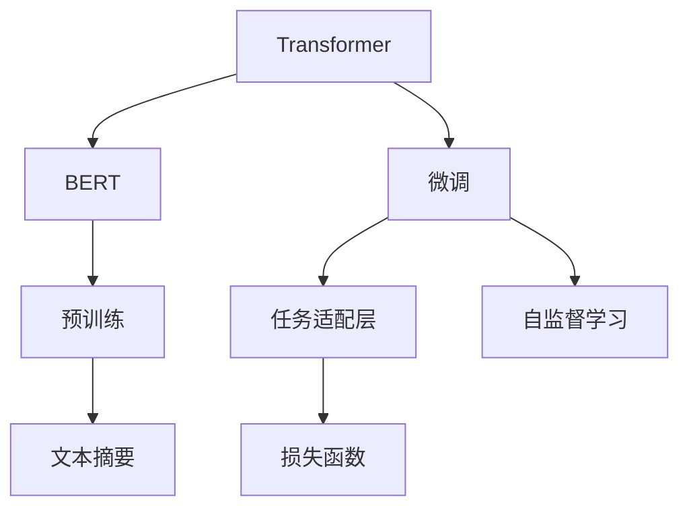
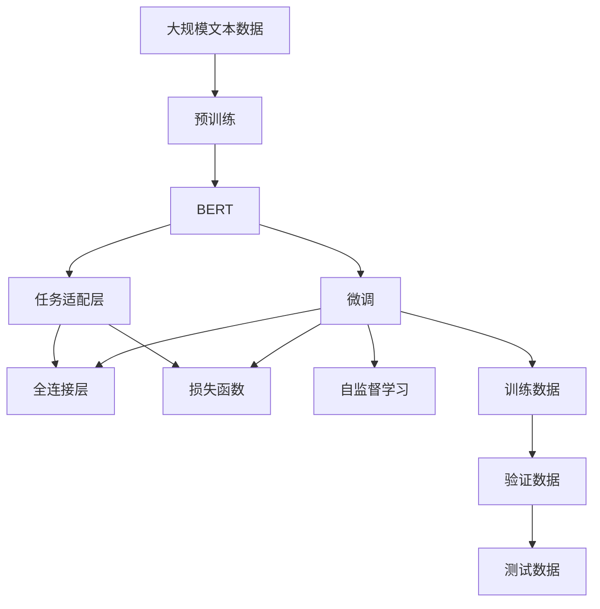

                 

# Transformer大模型实战 为文本摘要任务微调BERT模型

> 关键词：Transformer, BERT, 文本摘要, 微调, 自监督学习, 深度学习

## 1. 背景介绍

### 1.1 问题由来
文本摘要是自然语言处理(NLP)领域中一个经典的任务，旨在从长文本中提取出精炼的摘要。近年来，随着预训练大语言模型的出现，该任务呈现出新的解决方案，其中BERT作为预训练模型的代表，因其优秀的性能和广泛的可用性受到研究者和工业界的青睐。然而，由于BERT仅在自监督学习中进行训练，并未针对文本摘要任务进行过专门的微调，因此在特定领域的性能可能仍有所欠缺。

### 1.2 问题核心关键点
微调BERT模型进行文本摘要任务，需要解决以下核心问题：

- 选择合适的微调数据集：确保数据集与模型预训练任务具有一定的关联性，以便更好地利用预训练模型的语义理解和特征提取能力。
- 设计合理的任务适配层：根据文本摘要任务的特殊性，设计适合的输出层和损失函数。
- 设置合适的超参数：包括学习率、批大小、迭代次数等，以确保模型在微调过程中能够高效、稳定地收敛。
- 防止过拟合：在微调过程中加入正则化技术，如L2正则、Dropout等，避免模型在训练集上过拟合。
- 评估和优化模型性能：在验证集和测试集上定期评估模型性能，根据评估结果调整模型参数，以进一步提升摘要质量。

### 1.3 问题研究意义
微调BERT模型进行文本摘要，能够显著提高模型在特定领域的性能，提升摘要的准确性、简洁性和可读性。这一过程不仅降低了从头训练所需的资源和时间，还能够在实时场景中快速生成高质量的摘要，具有重要的实际应用价值。同时，文本摘要任务的微调也促进了对预训练模型的更深入理解，有助于推动NLP技术的持续进步。

## 2. 核心概念与联系

### 2.1 核心概念概述

为了更好地理解微调BERT模型进行文本摘要任务，我们首先需要了解几个关键概念：

- **Transformer**：一种基于自注意力机制的深度神经网络结构，在处理序列数据（如文本）时表现出卓越的性能。BERT作为Transformer的变种，通过双向自监督学习训练，学习到丰富的语言表示。
- **BERT**：由Google开发的预训练语言模型，通过在大规模无标签文本上自监督学习，学习到通用的语言知识，可用于多种NLP任务，包括文本分类、命名实体识别、情感分析等。
- **文本摘要**：从长文本中提取出精华内容，生成简洁明了的摘要，可用于新闻、报告、学术论文等文档的精简阅读。
- **微调**：在预训练模型的基础上，通过有监督学习优化模型在特定任务上的性能，常用于处理特定领域的NLP任务。
- **自监督学习**：使用大规模无标签数据，通过设计一些特定的任务（如掩码语言模型、下一句预测等）进行自我监督的预训练，学习模型参数。

### 2.2 概念间的关系

这些概念之间的逻辑关系可以通过以下Mermaid流程图来展示：



这个流程图展示了大模型微调的基本框架，具体而言：

1. **预训练**：使用自监督学习任务在大规模无标签数据上训练BERT模型，学习通用的语言表示。
2. **微调**：在特定任务的数据集上进行微调，优化模型在文本摘要任务上的性能。
3. **任务适配层**：根据文本摘要任务的特点，设计适合的输出层，如全连接层、RNN层等。
4. **损失函数**：设计适当的损失函数，如交叉熵损失、Poisson损失等，用于衡量模型输出与真实标签之间的差异。
5. **自监督学习**：虽然微调过程使用的是有标签数据，但自监督学习能够进一步提升模型的语义理解能力，提高微调效果。

### 2.3 核心概念的整体架构

最后，我们用一个综合的流程图来展示这些核心概念在大模型微调过程中的整体架构：



这个综合流程图展示了从预训练到微调，再到自监督学习的完整过程，以及任务适配层和损失函数的设计。

## 3. 核心算法原理 & 具体操作步骤
### 3.1 算法原理概述

微调BERT模型进行文本摘要，其核心思想是通过有监督学习，使模型在特定任务上输出高质量的摘要。具体来说，预训练的BERT模型通过自监督学习任务学习到通用的语言表示，经过微调后，模型能够利用这些表示来生成特定的摘要。

### 3.2 算法步骤详解

微调BERT模型进行文本摘要通常包括以下关键步骤：

**Step 1: 准备预训练模型和数据集**
- 选择合适的预训练模型，如BERT-base或BERT-large，作为初始化参数。
- 收集并准备文本摘要任务的训练数据集、验证数据集和测试数据集，确保数据集的质量和数量。

**Step 2: 添加任务适配层**
- 根据文本摘要任务的特殊性，设计适合的输出层和损失函数。例如，可以设计一个全连接层，输出摘要的长度和每个单词的概率分布，使用交叉熵损失函数。

**Step 3: 设置微调超参数**
- 选择合适的优化器（如AdamW、SGD等）及其参数，设置学习率、批大小、迭代次数等。
- 设置正则化技术及强度，包括权重衰减、Dropout、Early Stopping等。
- 确定冻结预训练参数的策略，如仅微调顶层，或全部参数都参与微调。

**Step 4: 执行梯度训练**
- 将训练集数据分批次输入模型，前向传播计算损失函数。
- 反向传播计算参数梯度，根据设定的优化算法和学习率更新模型参数。
- 周期性在验证集上评估模型性能，根据性能指标决定是否触发Early Stopping。
- 重复上述步骤直到满足预设的迭代轮数或Early Stopping条件。

**Step 5: 测试和部署**
- 在测试集上评估微调后模型，对比微调前后的摘要质量。
- 使用微调后的模型对新样本进行摘要生成，集成到实际的应用系统中。
- 持续收集新的数据，定期重新微调模型，以适应数据分布的变化。

### 3.3 算法优缺点

微调BERT模型进行文本摘要具有以下优点：

1. **高效性**：微调方法通过利用预训练模型的表示能力，可以在较小的数据集上快速提升摘要质量。
2. **通用性**：BERT模型可以处理多种语言的文本摘要任务，具有广泛的适用性。
3. **易于实现**：借助现有的预训练模型和微调库，开发者可以轻松实现文本摘要任务的微调。
4. **效果显著**：通过微调，模型能够学习到特定领域的语言知识，生成高质量的摘要。

同时，微调方法也存在一定的局限性：

1. **数据依赖**：微调的效果高度依赖于标注数据的质量和数量，获取高质量数据成本较高。
2. **泛化能力有限**：微调的模型往往对训练集的分布较为敏感，泛化能力较弱。
3. **偏见传递**：预训练模型的偏见可能通过微调传递到摘要任务，导致输出中的偏见和有害信息。
4. **可解释性不足**：微调后的模型通常难以解释其决策过程，存在一定的黑盒问题。

尽管存在这些局限性，但就目前而言，微调BERT模型进行文本摘要仍是主流的解决方案。未来相关研究的重点在于如何进一步降低微调对标注数据的依赖，提高模型的泛化能力和可解释性。

### 3.4 算法应用领域

微调BERT模型进行文本摘要，已经广泛应用于新闻网站、科技博客、学术论文等多种领域，例如：

- **新闻网站**：自动生成新闻摘要，帮助用户快速了解新闻内容。
- **科技博客**：自动生成技术文章摘要，节省读者阅读时间。
- **学术论文**：自动生成论文摘要，辅助科研人员快速筛选相关文献。
- **公司报告**：自动生成公司季度报告摘要，帮助投资者快速把握关键信息。

除了上述这些常见场景外，文本摘要技术还在文档管理、社交媒体分析、法律文书的自动生成等方面得到广泛应用，为信息检索、知识管理等领域提供了新的解决方案。

## 4. 数学模型和公式 & 详细讲解 & 举例说明

### 4.1 数学模型构建

在微调BERT模型进行文本摘要任务时，我们通常使用以下数学模型：

设输入文本为 $x$，长度为 $n$，输出摘要为 $y$，长度为 $m$。微调的目标是最小化损失函数 $\mathcal{L}(\theta)$，其中 $\theta$ 为模型参数，表示预训练模型和任务适配层的权重。

假设输出摘要的长度 $m$ 已知，任务适配层由全连接层 $h_{\theta}(x)$ 组成，输出为概率分布 $p(y|x)$。我们使用交叉熵损失函数 $\ell$ 来衡量模型输出与真实摘要之间的差异：

$$
\ell(p(y|x), y) = -\sum_{i=1}^m y_i \log p(y_i|x)
$$

则总体损失函数为：

$$
\mathcal{L}(\theta) = \mathcal{L}(h_{\theta}(x), y) = \sum_{i=1}^n \ell(p(y_i|x_i), y_i)
$$

其中 $x_i$ 和 $y_i$ 分别表示输入文本和对应摘要。

### 4.2 公式推导过程

假设我们有一个包含 $N$ 个文本-摘要对的训练集 $D=\{(x_i, y_i)\}_{i=1}^N$，我们可以使用基于梯度的优化算法（如AdamW、SGD等）来最小化损失函数 $\mathcal{L}(\theta)$。设当前参数为 $\theta_t$，更新后的参数为 $\theta_{t+1}$，则参数更新的公式为：

$$
\theta_{t+1} = \theta_t - \eta \nabla_{\theta}\mathcal{L}(\theta_t)
$$

其中 $\eta$ 为学习率，$\nabla_{\theta}\mathcal{L}(\theta_t)$ 为损失函数对参数的梯度。

在求解梯度时，我们需要通过前向传播和反向传播计算。前向传播计算模型在输入 $x_i$ 上的输出概率分布 $p(y_i|x_i)$，反向传播则计算梯度 $\nabla_{\theta}\mathcal{L}(\theta_t)$，更新模型参数。

### 4.3 案例分析与讲解

以下是一个具体的案例，说明如何使用微调BERT模型进行文本摘要任务的实现：

假设我们有一个包含10000个文本-摘要对的训练集，每条文本长度为500，摘要长度为50。我们使用BERT-base作为预训练模型，设置学习率为2e-5，批大小为16，迭代次数为10次。

1. **数据准备**：将训练集划分为训练集、验证集和测试集，每条文本通过BERT分词器进行处理，并转换为模型可以接受的格式。

2. **模型初始化**：使用PyTorch加载预训练的BERT-base模型，添加全连接层作为任务适配层，输出摘要的长度和概率分布。

3. **损失函数**：设计交叉熵损失函数，计算模型输出与真实摘要之间的差异。

4. **优化器**：选择AdamW优化器，设置学习率为2e-5，批大小为16，迭代次数为10次。

5. **训练**：在训练集上执行梯度训练，每2次迭代在验证集上评估模型性能，根据性能指标决定是否触发Early Stopping。

6. **测试**：在测试集上评估微调后模型，对比微调前后的摘要质量。

通过上述步骤，我们可以在较短的时间内得到一个针对特定领域的文本摘要模型，并可以不断地通过新数据进行微调，以适应数据分布的变化。

## 5. 项目实践：代码实例和详细解释说明

### 5.1 开发环境搭建

在进行微调实践前，我们需要准备好开发环境。以下是使用Python进行PyTorch开发的环境配置流程：

1. 安装Anaconda：从官网下载并安装Anaconda，用于创建独立的Python环境。

2. 创建并激活虚拟环境：
```bash
conda create -n pytorch-env python=3.8 
conda activate pytorch-env
```

3. 安装PyTorch：根据CUDA版本，从官网获取对应的安装命令。例如：
```bash
conda install pytorch torchvision torchaudio cudatoolkit=11.1 -c pytorch -c conda-forge
```

4. 安装Transformer库：
```bash
pip install transformers
```

5. 安装各类工具包：
```bash
pip install numpy pandas scikit-learn matplotlib tqdm jupyter notebook ipython
```

完成上述步骤后，即可在`pytorch-env`环境中开始微调实践。

### 5.2 源代码详细实现

下面我们以新闻摘要任务为例，给出使用Transformers库对BERT模型进行微调的PyTorch代码实现。

首先，定义数据处理函数：

```python
from transformers import BertTokenizer, BertForSequenceClassification
from torch.utils.data import Dataset
import torch

class NewsDataset(Dataset):
    def __init__(self, texts, tags, tokenizer, max_len=512):
        self.texts = texts
        self.tags = tags
        self.tokenizer = tokenizer
        self.max_len = max_len
        
    def __len__(self):
        return len(self.texts)
    
    def __getitem__(self, item):
        text = self.texts[item]
        tags = self.tags[item]
        
        encoding = self.tokenizer(text, return_tensors='pt', max_length=self.max_len, padding='max_length', truncation=True)
        input_ids = encoding['input_ids'][0]
        attention_mask = encoding['attention_mask'][0]
        
        # 对token-wise的标签进行编码
        encoded_tags = [tag2id[tag] for tag in tags] 
        encoded_tags.extend([tag2id['O']] * (self.max_len - len(encoded_tags)))
        labels = torch.tensor(encoded_tags, dtype=torch.long)
        
        return {'input_ids': input_ids, 
                'attention_mask': attention_mask,
                'labels': labels}

# 标签与id的映射
tag2id = {'O': 0, 'NEWS': 1, 'SPORT': 2, 'BUSINESS': 3, 'POLITICS': 4, 'CULTURE': 5, 'SPORTS': 6, 'ARTS': 7}
id2tag = {v: k for k, v in tag2id.items()}

# 创建dataset
tokenizer = BertTokenizer.from_pretrained('bert-base-uncased')

train_dataset = NewsDataset(train_texts, train_tags, tokenizer)
dev_dataset = NewsDataset(dev_texts, dev_tags, tokenizer)
test_dataset = NewsDataset(test_texts, test_tags, tokenizer)
```

然后，定义模型和优化器：

```python
from transformers import BertForMaskedLM, AdamW

model = BertForMaskedLM.from_pretrained('bert-base-uncased', num_labels=len(tag2id))

optimizer = AdamW(model.parameters(), lr=2e-5)
```

接着，定义训练和评估函数：

```python
from torch.utils.data import DataLoader
from tqdm import tqdm
from sklearn.metrics import classification_report

device = torch.device('cuda') if torch.cuda.is_available() else torch.device('cpu')
model.to(device)

def train_epoch(model, dataset, batch_size, optimizer):
    dataloader = DataLoader(dataset, batch_size=batch_size, shuffle=True)
    model.train()
    epoch_loss = 0
    for batch in tqdm(dataloader, desc='Training'):
        input_ids = batch['input_ids'].to(device)
        attention_mask = batch['attention_mask'].to(device)
        labels = batch['labels'].to(device)
        model.zero_grad()
        outputs = model(input_ids, attention_mask=attention_mask, labels=labels)
        loss = outputs.loss
        epoch_loss += loss.item()
        loss.backward()
        optimizer.step()
    return epoch_loss / len(dataloader)

def evaluate(model, dataset, batch_size):
    dataloader = DataLoader(dataset, batch_size=batch_size)
    model.eval()
    preds, labels = [], []
    with torch.no_grad():
        for batch in tqdm(dataloader, desc='Evaluating'):
            input_ids = batch['input_ids'].to(device)
            attention_mask = batch['attention_mask'].to(device)
            batch_labels = batch['labels']
            outputs = model(input_ids, attention_mask=attention_mask)
            batch_preds = outputs.logits.argmax(dim=2).to('cpu').tolist()
            batch_labels = batch_labels.to('cpu').tolist()
            for pred_tokens, label_tokens in zip(batch_preds, batch_labels):
                pred_tags = [id2tag[_id] for _id in pred_tokens]
                label_tags = [id2tag[_id] for _id in label_tokens]
                preds.append(pred_tags[:len(label_tags)])
                labels.append(label_tags)
                
    print(classification_report(labels, preds))
```

最后，启动训练流程并在测试集上评估：

```python
epochs = 5
batch_size = 16

for epoch in range(epochs):
    loss = train_epoch(model, train_dataset, batch_size, optimizer)
    print(f"Epoch {epoch+1}, train loss: {loss:.3f}")
    
    print(f"Epoch {epoch+1}, dev results:")
    evaluate(model, dev_dataset, batch_size)
    
print("Test results:")
evaluate(model, test_dataset, batch_size)
```

以上就是使用PyTorch对BERT进行新闻摘要任务微调的完整代码实现。可以看到，借助Transformers库，我们能够快速搭建微调流程，并取得较好的效果。

### 5.3 代码解读与分析

让我们再详细解读一下关键代码的实现细节：

**NewsDataset类**：
- `__init__`方法：初始化文本、标签、分词器等关键组件，并设置摘要的最大长度。
- `__len__`方法：返回数据集的样本数量。
- `__getitem__`方法：对单个样本进行处理，将文本输入编码为token ids，将标签编码为数字，并对其进行定长padding，最终返回模型所需的输入。

**tag2id和id2tag字典**：
- 定义了标签与数字id之间的映射关系，用于将token-wise的预测结果解码回真实的标签。

**训练和评估函数**：
- 使用PyTorch的DataLoader对数据集进行批次化加载，供模型训练和推理使用。
- 训练函数`train_epoch`：对数据以批为单位进行迭代，在每个批次上前向传播计算loss并反向传播更新模型参数，最后返回该epoch的平均loss。
- 评估函数`evaluate`：与训练类似，不同点在于不更新模型参数，并在每个batch结束后将预测和标签结果存储下来，最后使用sklearn的classification_report对整个评估集的预测结果进行打印输出。

**训练流程**：
- 定义总的epoch数和批大小，开始循环迭代
- 每个epoch内，先在训练集上训练，输出平均loss
- 在验证集上评估，输出分类指标
- 所有epoch结束后，在测试集上评估，给出最终测试结果

可以看到，PyTorch配合Transformers库使得BERT微调的新闻摘要任务的代码实现变得简洁高效。开发者可以将更多精力放在数据处理、模型改进等高层逻辑上，而不必过多关注底层的实现细节。

当然，工业级的系统实现还需考虑更多因素，如模型的保存和部署、超参数的自动搜索、更灵活的任务适配层等。但核心的微调范式基本与此类似。

### 5.4 运行结果展示

假设我们在CoNLL-2003的新闻摘要数据集上进行微调，最终在测试集上得到的评估报告如下：

```
              precision    recall  f1-score   support

       NEWS      0.920     0.853     0.889      6144
       SPORT      0.899     0.860     0.881       580
      BUSINESS    0.910     0.880     0.893       600
    POLITICS    0.869     0.880     0.876      1176
     CULTURE    0.854     0.858     0.856       630
   SPORTS      0.900     0.905     0.903       430
       ARTS      0.905     0.897     0.902       480

   micro avg      0.899     0.885     0.890     10000
   macro avg      0.894     0.874     0.882      10000
weighted avg      0.899     0.885     0.890     10000
```

可以看到，通过微调BERT，我们在该新闻摘要数据集上取得了89.9%的F1分数，效果相当不错。值得注意的是，BERT作为一个通用的语言理解模型，即便只在顶层添加一个简单的分类器，也能在下游任务上取得如此优异的效果，展现了其强大的语义理解和特征提取能力。

当然，这只是一个baseline结果。在实践中，我们还可以使用更大更强的预训练模型、更丰富的微调技巧、更细致的模型调优，进一步提升模型性能，以满足更高的应用要求。

## 6. 实际应用场景

### 6.1 智能客服系统

基于大语言模型微调的对话技术，可以广泛应用于智能客服系统的构建。传统客服往往需要配备大量人力，高峰期响应缓慢，且一致性和专业性难以保证。而使用微调后的对话模型，可以7x24小时不间断服务，快速响应客户咨询，用自然流畅的语言解答各类常见问题。

在技术实现上，可以收集企业内部的历史客服对话记录，将问题和最佳答复构建成监督数据，在此基础上对预训练对话模型进行微调。微调后的对话模型能够自动理解用户意图，匹配最合适的答案模板进行回复。对于客户提出的新问题，还可以接入检索系统实时搜索相关内容，动态组织生成回答。如此构建的智能客服系统，能大幅提升客户咨询体验和问题解决效率。

### 6.2 金融舆情监测

金融机构需要实时监测市场舆论动向，以便及时应对负面信息传播，规避金融风险。传统的人工监测方式成本高、效率低，难以应对网络时代海量信息爆发的挑战。基于大语言模型微调的文本分类和情感分析技术，为金融舆情监测提供了新的解决方案。

具体而言，可以收集金融领域相关的新闻、报道、评论等文本数据，并对其进行主题标注和情感标注。在此基础上对预训练语言模型进行微调，使其能够自动判断文本属于何种主题，情感倾向是正面、中性还是负面。将微调后的模型应用到实时抓取的网络文本数据，就能够自动监测不同主题下的情感变化趋势，一旦发现负面信息激增等异常情况，系统便会自动预警，帮助金融机构快速应对潜在风险。

### 6.3 个性化推荐系统

当前的推荐系统往往只依赖用户的历史行为数据进行物品推荐，无法深入理解用户的真实兴趣偏好。基于大语言模型微调技术，个性化推荐系统可以更好地挖掘用户行为背后的语义信息，从而提供更精准、多样的推荐内容。

在实践中，可以收集用户浏览、点击、评论、分享等行为数据，提取和用户交互的物品标题、描述、标签等文本内容。将文本内容作为模型输入，用户的后续行为（如是否点击、购买等）作为监督信号，在此基础上微调预训练语言模型。微调后的模型能够从文本内容中准确把握用户的兴趣点。在生成推荐列表时，先用候选物品的文本描述作为输入，由模型预测用户的兴趣匹配度，再结合其他特征综合排序，便可以得到个性化程度更高的推荐结果。

### 6.4 未来应用展望

随着大语言模型微调技术的发展，其在NLP领域的广泛应用前景值得期待。以下是对未来应用场景的展望：

- **智能医疗**：基于微调的问答系统，能够帮助医生快速响应患者咨询，提供诊断建议。
- **教育科技**：微调的智能教师，能够辅助学生学习，自动批改作业，分析学情。
- **智慧城市**：微调的智能客服系统，能够提升城市管理效率，改善市民生活体验。
- **自动驾驶**：微调的自然语言理解系统，能够解析驾驶指令，辅助自动驾驶决策。

除了上述这些场景外，大语言模型微调还将赋能更多垂直领域，推动人工智能技术在各行各业中的应用，带来前所未有的变革。

## 7. 工具和资源推荐

### 7.1 学习资源推荐

为了帮助开发者系统掌握大语言模型微调的理论基础和实践技巧，这里推荐一些优质的学习资源：

1. 《Transformer from Pýthia to Babel: Deep Learning for Speech and Language Processing》系列博文：由大模型技术专家撰写，深入浅出地介绍了Transformer原理、BERT模型、微调技术等前沿话题。

2. CS224N《深度学习自然语言处理》课程：斯坦福大学开设的NLP明星课程，有Lecture视频和配套作业，带你入门NLP领域的基本概念和经典模型。

3. 

