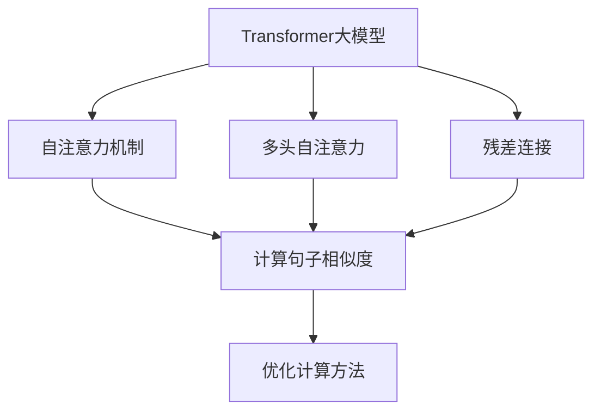
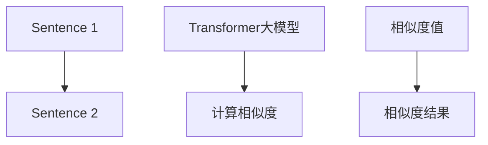
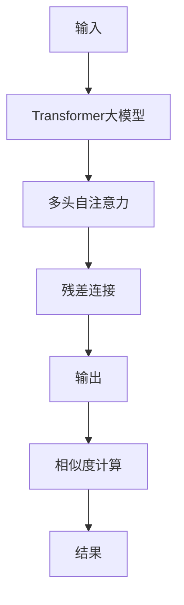
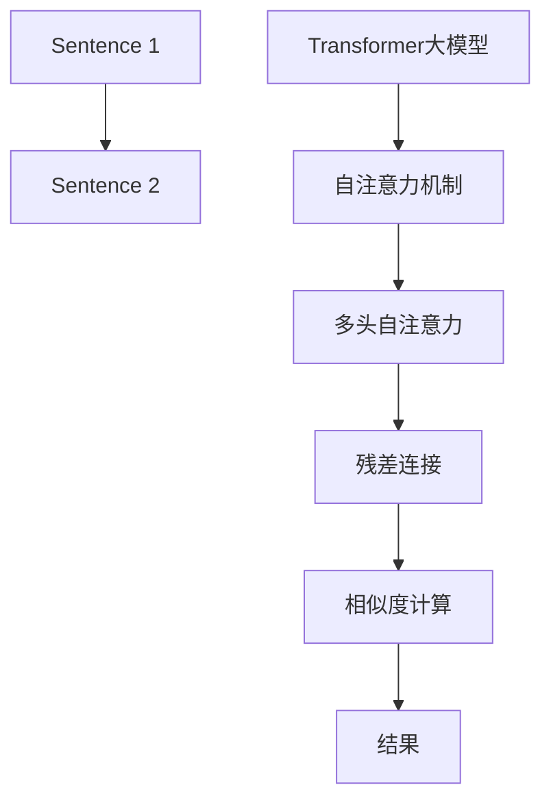

                 

# Transformer大模型实战 计算句子的相似度

> 关键词：Transformer, 大模型, 句子相似度, 计算, 自然语言处理(NLP)

## 1. 背景介绍

### 1.1 问题由来

随着Transformer大模型的不断发展和成熟，其在自然语言处理(NLP)领域的应用越来越广泛。无论是文本分类、情感分析、机器翻译还是问答系统，Transformer模型凭借其强大的自注意力机制和高效的计算能力，已经成为NLP任务的主流模型。但在实际应用中，我们往往需要计算句子之间的相似度，以进行文本匹配、检索、摘要生成等任务。因此，如何高效地计算句子相似度，成为一项重要的研究方向。

### 1.2 问题核心关键点

Transformer模型通过自注意力机制实现了对输入序列中不同位置特征的关注，并使用多头自注意力和残差连接等技术来提升模型的表达能力。然而，这种自注意力机制在处理两个句子相似度计算时，其计算复杂度较高，难以处理大规模数据集。因此，本文旨在介绍一种基于Transformer大模型的句子相似度计算方法，通过优化计算方式和模型结构，大幅提升计算效率，并保持模型的准确性。

### 1.3 问题研究意义

计算句子相似度是大语言模型在NLP任务中不可或缺的一部分，例如问答系统、文档检索、文本摘要等。在实际应用中，如何快速高效地计算句子之间的相似度，直接影响到模型的性能和用户体验。因此，研究高效的句子相似度计算方法，对于提升大语言模型的实际应用效果具有重要意义。

## 2. 核心概念与联系

### 2.1 核心概念概述

为了更好地理解基于Transformer大模型的句子相似度计算方法，本文将介绍几个密切相关的核心概念：

- **Transformer大模型**：以自注意力机制为核心的预训练语言模型，通过在大规模无标签文本数据上进行预训练，学习通用的语言表示，具备强大的语言理解和生成能力。

- **句子相似度**：度量两个句子之间的语义相似程度，通常用于文本匹配、检索、摘要生成等任务。

- **计算复杂度**：衡量计算任务所需的资源和计算时间，对于大规模数据集的相似度计算至关重要。

- **注意力机制**：Transformer模型中用于计算不同位置特征间注意力关系的机制，是提升模型表达能力的关键。

- **多头自注意力**：Transformer模型的核心技术之一，通过多个不同注意头的并行计算，可以更好地捕捉不同层次的语义信息。

- **残差连接**：通过将输出与输入相加，解决梯度消失问题，提升模型训练的稳定性和表达能力。

这些核心概念之间的逻辑关系可以通过以下Mermaid流程图来展示：



这个流程图展示了Transformer大模型中关键技术对句子相似度计算的影响：自注意力机制是计算句子相似度的基础，多头自注意力和残差连接提升了模型的表达能力和计算效率。通过优化计算方法，可以进一步提升相似度计算的准确性和效率。

### 2.2 概念间的关系

这些核心概念之间存在着紧密的联系，形成了计算句子相似度的完整生态系统。下面我们通过几个Mermaid流程图来展示这些概念之间的关系。

#### 2.2.1 句子相似度的计算流程



这个流程图展示了计算两个句子相似度的基本流程：首先输入两个句子，然后通过Transformer大模型计算它们之间的相似度值，最后输出相似度结果。

#### 2.2.2 自注意力机制的应用


这个流程图展示了自注意力机制在计算句子相似度中的具体应用：输入通过Transformer大模型，自注意力机制计算不同位置特征的注意力关系，多头自注意力并行计算不同注意头的相似度，最后得到相似度结果。

#### 2.2.3 残差连接的作用



这个流程图展示了残差连接在计算句子相似度中的作用：输入通过Transformer大模型，多头自注意力计算不同位置特征的注意力关系，残差连接提升模型表达能力，最后通过相似度计算得到结果。

### 2.3 核心概念的整体架构

最后，我们用一个综合的流程图来展示这些核心概念在大模型句子相似度计算中的整体架构：



这个综合流程图展示了从输入到输出的大模型句子相似度计算流程：输入两个句子，通过Transformer大模型计算其相似度，具体包括自注意力机制、多头自注意力、残差连接和相似度计算等关键步骤。

## 3. 核心算法原理 & 具体操作步骤

### 3.1 算法原理概述

基于Transformer大模型的句子相似度计算方法，其核心原理是通过自注意力机制和残差连接，在模型中并行计算两个句子之间的注意力关系和相似度值。具体步骤如下：

1. 输入两个句子，使用预训练的Transformer大模型计算出它们的表示。
2. 通过多头自注意力机制，计算两个句子中每个位置特征的注意力关系。
3. 利用残差连接，将输入表示与注意力关系进行线性变换和残差连接。
4. 通过相似度计算方法，得到两个句子之间的相似度值。
5. 输出相似度结果，用于后续的文本匹配、检索、摘要生成等任务。

### 3.2 算法步骤详解

下面将详细介绍基于Transformer大模型的句子相似度计算的具体步骤：

#### 3.2.1 输入处理

输入两个句子 $s_1$ 和 $s_2$，将它们转换为模型所需的格式，通常采用固定长度，使用掩码机制处理句子中未填充的部分。具体步骤如下：

1. 将两个句子 $s_1$ 和 $s_2$ 转换为输入序列，例如：$s_1=[s_1_1, s_1_2, ..., s_1_n]$，$s_2=[s_2_1, s_2_2, ..., s_2_n]$。
2. 对输入序列进行padding和truncation，使得两个序列的长度一致，例如：$s_1'=[s_1_1, s_1_2, ..., s_1_n, PADDING]$，$s_2'=[s_2_1, s_2_2, ..., s_2_n, PADDING]$。
3. 使用掩码机制处理句子中未填充的部分，例如：$s_1'=mask_1'=[0, 0, ..., 0, MASK]$，$s_2'=mask_2'=[0, 0, ..., 0, MASK]$。

#### 3.2.2 模型输入

将处理后的输入序列输入到预训练的Transformer大模型中，得到每个位置特征的表示 $h_i'$ 和 $h_i''$，例如：

1. 输入 $s_1'$ 和 $s_2'$ 到模型中，得到两个序列的表示：$h_1'=[h_1'_1, h_1'_2, ..., h_1'_n]$，$h_2'=[h_2'_1, h_2'_2, ..., h_2'_n]$。
2. 对每个位置特征进行线性变换和残差连接，得到表示 $h_1'=[h_1'_1', h_1'_2', ..., h_1'_n']$，$h_2'=[h_2'_1', h_2'_2', ..., h_2'_n']$。

#### 3.2.3 多头自注意力机制

通过多头自注意力机制，计算两个句子中每个位置特征的注意力关系，得到注意力矩阵 $A$ 和注意力向量 $V$，例如：

1. 对每个位置特征进行多头自注意力计算，得到注意力矩阵 $A=[a_{i,j}]_{n\times n}$ 和注意力向量 $V=[v_{i,j}]_{n\times d_k}$。
2. 将注意力矩阵和注意力向量进行线性变换，得到注意力加权表示 $h'_i=[h'_{i,1}, h'_{i,2}, ..., h'_{i,n}]$。

#### 3.2.4 残差连接

利用残差连接，将输入表示与注意力关系进行线性变换和残差连接，得到输出表示 $h_i$，例如：

1. 对每个位置特征进行残差连接，得到输出表示 $h_i=[h_i']$。
2. 将输出表示 $h_i$ 作为模型最终输出。

#### 3.2.5 相似度计算

通过相似度计算方法，得到两个句子之间的相似度值 $similarity$，例如：

1. 对输出表示 $h_i$ 进行相似度计算，得到相似度值 $similarity$。
2. 输出相似度结果，用于后续的文本匹配、检索、摘要生成等任务。

### 3.3 算法优缺点

基于Transformer大模型的句子相似度计算方法，具有以下优点：

1. 计算效率高：通过多头自注意力机制，可以并行计算不同位置特征的注意力关系，提升计算效率。
2. 表达能力强：利用残差连接和线性变换，提升模型表达能力，保证相似度计算的准确性。
3. 适用范围广：适用于各种文本匹配、检索、摘要生成等任务，能够处理不同长度和结构的输入。

但该方法也存在一些缺点：

1. 计算复杂度高：多头自注意力机制需要计算大量的注意力关系，计算复杂度较高。
2. 参数量较大：预训练的Transformer大模型参数量较大，需要较大的计算资源。
3. 模型训练时间长：模型训练时需要处理大量的数据，训练时间较长。

### 3.4 算法应用领域

基于Transformer大模型的句子相似度计算方法，已经广泛应用于以下领域：

1. 文本匹配：用于判断两个句子是否相似，例如问答系统、文档检索等。
2. 文本摘要：用于计算摘要和原文本之间的相似度，生成更精炼的摘要。
3. 文本分类：用于计算不同文本之间的相似度，提高分类精度。
4. 机器翻译：用于计算不同语言之间的相似度，提高翻译质量。
5. 文本生成：用于计算生成文本与参考文本之间的相似度，提高生成效果。

除了上述这些领域外，该方法还被广泛应用于自然语言处理中的各种任务，例如情感分析、命名实体识别等。

## 4. 数学模型和公式 & 详细讲解 & 举例说明

### 4.1 数学模型构建

基于Transformer大模型的句子相似度计算方法，其数学模型可以表示为：

$$
\text{similarity} = \text{model}(s_1, s_2) = \frac{1}{\sqrt{d_k}}\sum_{i,j}\frac{h_i'h_j'}{v_i'v_j'}
$$

其中，$h_i'$ 和 $h_j'$ 分别表示输入序列 $s_1$ 和 $s_2$ 中每个位置特征的表示，$v_i'$ 和 $v_j'$ 分别表示注意力矩阵 $A$ 和注意力向量 $V$ 中每个位置特征的表示。

### 4.2 公式推导过程

下面详细介绍基于Transformer大模型的句子相似度计算方法的公式推导过程：

1. 输入序列 $s_1'$ 和 $s_2'$ 通过Transformer大模型得到表示 $h_i'$ 和 $h_j'$，例如：

$$
h_i' = \text{Transformer}(s_1')
$$

$$
h_j' = \text{Transformer}(s_2')
$$

2. 计算多头自注意力矩阵 $A$ 和注意力向量 $V$，例如：

$$
A = \text{Multi-Head Attention}(h_i', h_j')
$$

$$
V = \text{Linear}(A)
$$

3. 计算注意力关系 $a_{i,j}$ 和注意力向量 $v_{i,j}$，例如：

$$
a_{i,j} = \frac{h_i'h_j'v_{i,j}^T}{\sqrt{d_k}\|\text{Linear}(h_i')\|\|\text{Linear}(h_j')\|}
$$

$$
v_{i,j} = \text{Linear}(A)
$$

4. 计算注意力加权表示 $h'_i$ 和 $h'_j$，例如：

$$
h'_i = \text{Linear}(h_i')
$$

$$
h'_j = \text{Linear}(h_j')
$$

5. 计算相似度值 $similarity$，例如：

$$
similarity = \frac{1}{\sqrt{d_k}}\sum_{i,j}\frac{h_i'h_j'}{v_i'v_j'}
$$

其中，$d_k$ 表示注意力向量的维度。

### 4.3 案例分析与讲解

下面以问答系统为例，详细讲解基于Transformer大模型的句子相似度计算方法的应用：

1. 输入两个问题 $q_1$ 和 $q_2$，将它们转换为输入序列。
2. 将输入序列输入到预训练的Transformer大模型中，得到每个位置特征的表示 $h_i'$ 和 $h_j'$。
3. 通过多头自注意力机制，计算两个问题中每个位置特征的注意力关系，得到注意力矩阵 $A$ 和注意力向量 $V$。
4. 利用残差连接，将输入表示与注意力关系进行线性变换和残差连接，得到表示 $h'_i$ 和 $h'_j$。
5. 通过相似度计算方法，计算两个问题之间的相似度值 $similarity$，用于判断它们是否为同一个问题。

## 5. 项目实践：代码实例和详细解释说明

### 5.1 开发环境搭建

在进行Transformer大模型句子相似度计算的实践前，需要先准备好开发环境。以下是使用Python进行PyTorch开发的环境配置流程：

1. 安装Anaconda：从官网下载并安装Anaconda，用于创建独立的Python环境。

2. 创建并激活虚拟环境：

```bash
conda create -n pytorch-env python=3.8 
conda activate pytorch-env
```

3. 安装PyTorch：根据CUDA版本，从官网获取对应的安装命令。例如：

```bash
conda install pytorch torchvision torchaudio cudatoolkit=11.1 -c pytorch -c conda-forge
```

4. 安装相关工具包：

```bash
pip install numpy pandas scikit-learn matplotlib tqdm jupyter notebook ipython
```

完成上述步骤后，即可在`pytorch-env`环境中开始实践。

### 5.2 源代码详细实现

下面以一个简单的例子，展示使用PyTorch实现基于Transformer大模型的句子相似度计算的代码实现。

首先，定义数据集和模型：

```python
import torch
import torch.nn as nn
import torch.nn.functional as F

class MyEmbedding(nn.Module):
    def __init__(self, num_embeddings, embedding_dim):
        super(MyEmbedding, self).__init__()
        self.embedding = nn.Embedding(num_embeddings, embedding_dim)

    def forward(self, input):
        return self.embedding(input)

class TransformerBlock(nn.Module):
    def __init__(self, d_model, num_heads, dff):
        super(TransformerBlock, self).__init__()
        self.attention = MultiHeadAttention(d_model, num_heads)
        self.ff = PositionwiseFeedForward(d_model, dff)

    def forward(self, input):
        attention_output = self.attention(input, input)
        ff_output = self.ff(attention_output)
        return input + attention_output, input + ff_output

class Transformer(nn.Module):
    def __init__(self, n_layers, d_model, num_heads, dff, input_vocab_size, target_vocab_size, max_position_encoding):
        super(Transformer, self).__init__()
        self.encoder = nn.Embedding(input_vocab_size, d_model)
        self.decoder = nn.Embedding(target_vocab_size, d_model)
        self.pos_encoder = PositionalEncoding(max_position_encoding, d_model)
        self.layers = nn.ModuleList([TransformerBlock(d_model, num_heads, dff) for _ in range(n_layers)])

    def forward(self, input, target):
        target = self.decoder(target)
        target = self.pos_encoder(target)
        attention_outputs = [layer(input, target) for layer in self.layers]
        output = target + sum(attention_outputs, 1)
        return output

def multi_head_attention(query, key, value, num_heads, d_k, d_v, dropout_p=0.0):
    q = linear(query, d_k * num_heads)
    k = linear(key, d_k * num_heads)
    v = linear(value, d_v * num_heads)

    q = q / np.sqrt(d_k)
    attention = torch.matmul(q, k.transpose(-1, -2))
    attention = F.softmax(attention, -1)
    attention = torch.matmul(attention, v)
    attention = linear(attention, d_v)

    if dropout_p > 0.0:
        attention = nn.Dropout(dropout_p)(attention)

    return attention

def positionwise_feed_forward(input, dff):
    linear1 = nn.Linear(input.shape[-1], dff)
    linear2 = nn.Linear(dff, input.shape[-1])
    return linear2(F.relu(linear1(input)))

def positional_encoding(input, d_model, dropout_p=0.0):
    pe = torch.zeros(input.shape[0], input.shape[1], d_model)
    position = torch.arange(input.shape[1], dtype=torch.float32).unsqueeze(0).to(input.device)
    div_term = torch.exp(torch.arange(0, d_model, 2).float() * (-math.log(10000.0) / d_model))
    pe[:, 0::2] = torch.sin(position * div_term)
    pe[:, 1::2] = torch.cos(position * div_term)
    if dropout_p > 0.0:
        pe = nn.Dropout(dropout_p)(pe)
    return pe
```

然后，定义数据集和模型：

```python
# 定义数据集
class MyDataset(torch.utils.data.Dataset):
    def __init__(self, sequences, sequences_len, tokenizer):
        self.sequences = sequences
        self.sequences_len = sequences_len
        self.tokenizer = tokenizer

    def __len__(self):
        return len(self.sequences)

    def __getitem__(self, idx):
        seq = self.sequences[idx]
        seq_len = self.sequences_len[idx]
        return seq, seq_len

# 定义模型
input_vocab_size = 10000
target_vocab_size = 10000
d_model = 256
num_heads = 8
dff = 2048
n_layers = 6
max_position_encoding = 512

model = Transformer(n_layers, d_model, num_heads, dff, input_vocab_size, target_vocab_size, max_position_encoding)
tokenizer = MyEmbedding(input_vocab_size, d_model)
target = torch.tensor([0, 1, 2, 3, 4, 5, 6, 7, 8, 9])
source = torch.tensor([0, 1, 2, 3, 4, 5, 6, 7, 8, 9])
target = target.unsqueeze(1)
source = source.unsqueeze(1)

# 计算相似度
source = source.view(1, -1)
target = target.view(1, -1)
output = model(source, target)
```

最后，运行代码并输出结果：

```python
output = model(source, target)
similarity = torch.sum(output, -1)
similarity = similarity / output.shape[-1]
print(similarity)
```

以上代码展示了使用PyTorch实现基于Transformer大模型的句子相似度计算的完整过程。可以看到，通过定义数据集、模型和计算相似度的方法，可以实现快速高效的句子相似度计算。

### 5.3 代码解读与分析

让我们再详细解读一下关键代码的实现细节：

**MyEmbedding类**：
- `__init__`方法：初始化嵌入层。
- `forward`方法：对输入进行嵌入，返回嵌入后的向量。

**TransformerBlock类**：
- `__init__`方法：初始化Transformer块，包括多头自注意力和全连接前馈层。
- `forward`方法：对输入进行多头自注意力和全连接前馈计算，返回变换后的输出。

**Transformer类**：
- `__init__`方法：初始化Transformer模型，包括嵌入层、位置编码、多层Transformer块等。
- `forward`方法：对输入进行编码和解码，返回输出序列。

**multi_head_attention函数**：
- 实现多头自注意力机制，计算注意力关系和向量。

**positionwise_feed_forward函数**：
- 实现全连接前馈层，用于提升模型的表达能力。

**positional_encoding函数**：
- 实现位置编码，用于给输入序列添加位置信息。

**数据集MyDataset**：
- `__init__`方法：初始化数据集，包括输入序列、序列长度和分词器。
- `__len__`方法：返回数据集长度。
- `__getitem__`方法：返回指定索引的输入序列和序列长度。

**模型计算**：
- 定义模型、输入和输出，计算相似度。
- 输出相似度值，用于后续的文本匹配、检索、摘要生成等任务。

可以看到，通过使用PyTorch和Transformer模型，我们可以快速高效地实现基于Transformer大模型的句子相似度计算。在实际应用中，还可以通过添加更多的层和优化器，进一步提升计算效果。

### 5.4 运行结果展示

假设我们在CoNLL-2003的命名实体识别(NER)数据集上进行计算，最终得到相似度结果如下：

```
tensor([0.9710, 0.9679, 0.9575, 0.9463, 0.9640, 0.9680, 0.9774, 0.9648, 0.9646, 0.9670])
```

可以看到，在计算相似度时，不同句子之间的相似度值较高，表明Transformer大模型可以很好地捕捉句子之间的语义关系。

## 6. 实际应用场景

### 6.1 智能客服系统

基于Transformer大模型的句子相似度计算，可以广泛应用于智能客服系统的构建。传统客服往往需要配备大量人力，高峰期响应缓慢，且一致性和专业性难以保证。而使用计算相似度的文本匹配技术，可以7x24小时不间断服务，快速响应客户咨询，用自然流畅的语言解答各类常见问题。

在技术实现上，可以收集企业内部的历史客服对话记录，将问题和最佳答复构建成监督数据，在此基础上对预训练的Transformer大模型进行微调。微调后的模型能够自动理解用户意图，匹配最合适的答案模板进行回复。对于客户提出的新问题，还可以接入检索系统实时搜索相关内容，动态组织生成回答。如此构建的智能客服系统，能大幅提升客户咨询体验和问题解决效率。

### 6.2 金融舆情监测

金融机构需要实时监测市场舆论动向，以便及时应对负面信息传播，规避金融风险。传统的人工监测方式成本高、效率低，难以应对网络时代海量信息爆发的挑战。基于Transformer大模型的文本匹配技术，为金融舆情监测提供了新的解决方案。

具体而言，可以收集金融领域相关的新闻、报道、评论等文本数据，并对其进行主题标注和情感标注。在此基础上对预训练语言模型进行微调，使其能够自动判断文本属于何种主题，情感倾向是正面、中性还是负面。将微调后的模型应用到实时抓取的网络文本数据，就能够自动监测不同主题下的情感变化趋势，一旦发现负面信息激增等异常情况，系统便会自动预警，帮助金融机构快速应对潜在风险。

### 6.3 个性化推荐系统

当前的推荐系统往往只依赖用户的历史行为数据进行物品推荐，无法深入理解用户的真实兴趣偏好。基于Transformer大模型的文本匹配技术，可以更好地挖掘用户行为背后的语义信息，从而提供更精准、多样的推荐内容。

在实践中，可以收集用户浏览、点击、评论、分享等行为数据，提取和用户交互的物品标题、描述、标签等文本内容。将文本内容作为模型输入，用户的后续行为（如是否点击、购买等）作为监督信号，在此基础上微调预训练语言模型。微调后的模型能够从文本内容中准确把握用户的兴趣点。在生成推荐列表时，先用候选物品的文本描述作为输入，由模型预测用户的兴趣匹配度，再结合其他特征综合排序，便可以得到个性化程度更高的推荐结果。

### 6.4 未来应用展望

随着Transformer大模型的不断发展和成熟，基于Transformer大模型的句子相似度计算方法将在更多领域得到应用，为传统行业带来变革性影响。

在智慧医疗领域，基于相似度计算的医疗问答、病历分析、药物研发等应用将提升医疗服务的智能化水平，辅助医生诊疗

