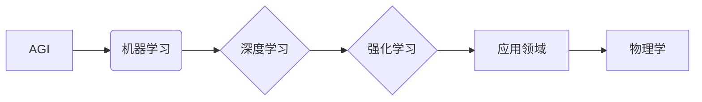

# AGI在物理学中的应用前景

> 关键词：AGI，人工智能，物理学，计算物理学，理论物理，实验物理，预测建模，数据驱动，机器学习

## 1. 背景介绍

人工智能（AI）的快速发展，特别是通用人工智能（AGI）的探索，为物理学研究带来了新的机遇和挑战。AGI旨在构建能够像人类一样理解、学习、推理和应用的智能系统，其潜在的应用前景在物理学领域尤为引人注目。本文将探讨AGI在物理学中的应用，分析其核心概念、算法原理、应用领域，并展望其未来发展趋势与挑战。

### 1.1 物理学中的AI需求

物理学作为一门实验与理论相结合的自然科学，对AI的需求主要体现在以下几个方面：

- **数据分析和处理**：现代物理学实验产生的大量数据需要高效的处理和分析工具。
- **理论预测**：物理学家需要预测复杂的物理现象，AGI可以帮助发现新的物理规律。
- **实验设计**：AGI可以优化实验设计，提高实验效率。
- **模拟和可视化**：物理模型需要高效的模拟和可视化工具来理解复杂系统。

### 1.2 AGI与物理学的关系

AGI与物理学的关系可以概括为以下两点：

- **AGI可以加速物理学研究**：通过自动化的数据处理、模式识别和预测建模，AGI可以帮助物理学家从海量的实验数据中提取信息，加速理论发现。
- **物理学可以促进AGI发展**：物理学中的一些问题，如量子计算、混沌理论等，为AGI的发展提供了新的数学和算法模型。

## 2. 核心概念与联系

### 2.1 核心概念

- **AGI**：通用人工智能，指具备人类智能水平或超越人类的智能系统。
- **机器学习**：机器学习是AGI的一个重要分支，通过数据训练模型以实现特定任务的学习能力。
- **深度学习**：深度学习是机器学习的一个子领域，使用深度神经网络进行数据学习。
- **强化学习**：强化学习是一种通过奖励和惩罚来训练智能体决策行为的机器学习方法。

### 2.2 核心概念原理和架构的 Mermaid 流程图



### 2.3 关系联系

AGI通过机器学习（特别是深度学习和强化学习）实现，这些学习算法可以应用于物理学的研究中，帮助物理学家进行数据分析和处理、理论预测、实验设计和模拟可视化等。

## 3. 核心算法原理 & 具体操作步骤

### 3.1 算法原理概述

AGI在物理学中的应用主要涉及以下几种算法：

- **数据驱动模型**：通过机器学习算法从实验数据中学习物理规律。
- **强化学习**：通过奖励和惩罚机制训练模型进行实验设计优化。
- **深度学习**：使用深度神经网络模拟物理现象，进行复杂系统的模拟和预测。

### 3.2 算法步骤详解

#### 3.2.1 数据驱动模型

1. **数据收集**：收集实验数据，包括物理参数、测量结果等。
2. **数据预处理**：清洗数据，进行特征选择和提取。
3. **模型训练**：选择合适的机器学习算法（如神经网络）进行模型训练。
4. **模型评估**：使用验证集评估模型性能，调整模型参数。
5. **模型应用**：将训练好的模型应用于新数据，进行预测和分析。

#### 3.2.2 强化学习

1. **环境构建**：定义实验环境，包括状态空间、动作空间、奖励函数等。
2. **智能体设计**：设计智能体算法，如深度Q网络（DQN）、深度确定性策略梯度（DDPG）等。
3. **实验设计**：使用强化学习算法优化实验参数，如实验条件、实验步骤等。
4. **性能评估**：评估实验设计的性能，如实验结果、资源消耗等。

#### 3.2.3 深度学习

1. **模型选择**：选择合适的深度学习模型，如卷积神经网络（CNN）、循环神经网络（RNN）等。
2. **网络构建**：构建深度神经网络结构，设置网络层、神经元和连接等。
3. **模型训练**：使用大量数据进行模型训练，优化网络参数。
4. **模型评估**：评估模型性能，如预测准确率、泛化能力等。
5. **模型应用**：将训练好的模型应用于物理模拟和预测。

### 3.3 算法优缺点

#### 3.3.1 数据驱动模型

优点：
- 能够从大量数据中学习复杂的物理规律。
- 可用于预测和分析未知物理现象。

缺点：
- 需要大量标注数据。
- 模型可解释性较差。

#### 3.3.2 强化学习

优点：
- 能够优化实验设计，提高实验效率。
- 能够处理连续动作空间。

缺点：
- 训练过程可能需要较长时间。
- 需要设计合理的奖励函数。

#### 3.3.3 深度学习

优点：
- 能够模拟复杂的物理现象。
- 预测准确率高。

缺点：
- 模型可解释性较差。
- 需要大量的计算资源。

### 3.4 算法应用领域

AGI在物理学中的应用领域包括：

- **粒子物理**：用于模拟粒子加速器实验，预测新的粒子发现。
- **凝聚态物理**：用于研究材料的性质，预测新材料的设计。
- **天体物理**：用于分析天文数据，研究宇宙演化。
- **生物物理**：用于模拟生物分子结构，研究蛋白质折叠等。

## 4. 数学模型和公式 & 详细讲解 & 举例说明

### 4.1 数学模型构建

AGI在物理学中的应用涉及多种数学模型，如：

- **统计物理模型**：用于描述热力学和统计力学现象。
- **量子力学模型**：用于描述量子系统的行为。
- **电磁学模型**：用于描述电磁场和电荷的行为。

### 4.2 公式推导过程

以下以统计物理中的玻尔兹曼分布为例进行公式推导：

假设一个系统中有大量相同粒子，每个粒子具有不同的能量。根据玻尔兹曼分布，粒子在某个能量状态的概率密度函数为：

$$
P(E) = \frac{1}{Z} \exp(-\frac{E}{kT})
$$

其中，$P(E)$ 为能量为 $E$ 的状态的概率密度，$Z$ 为归一化常数，$k$ 为玻尔兹曼常数，$T$ 为绝对温度。

### 4.3 案例分析与讲解

以下以使用深度学习模拟玻尔兹曼分布为例进行案例讲解：

1. **数据收集**：收集不同温度下粒子的能量分布数据。
2. **数据预处理**：将数据转化为适合深度学习的格式，如将连续的粒子能量转化为离散的能量状态。
3. **模型构建**：构建一个深度神经网络，输入为粒子的能量状态，输出为玻尔兹曼分布概率。
4. **模型训练**：使用训练数据训练神经网络，优化网络参数。
5. **模型评估**：使用验证集评估模型性能，调整模型结构或参数。
6. **模型应用**：将训练好的模型应用于新数据，预测粒子的能量分布。

## 5. 项目实践：代码实例和详细解释说明

### 5.1 开发环境搭建

1. 安装Python和PyTorch库。
2. 下载并安装必要的深度学习库，如TensorFlow、Keras等。

### 5.2 源代码详细实现

以下是一个使用PyTorch构建深度神经网络模拟玻尔兹曼分布的简单示例：

```python
import torch
import torch.nn as nn

class BoltzmannModel(nn.Module):
    def __init__(self, input_size, hidden_size, output_size):
        super(BoltzmannModel, self).__init__()
        self.fc1 = nn.Linear(input_size, hidden_size)
        self.fc2 = nn.Linear(hidden_size, output_size)

    def forward(self, x):
        x = torch.relu(self.fc1(x))
        x = self.fc2(x)
        return x

# 构建模型
input_size = 100  # 粒子能量状态数量
hidden_size = 50  # 隐藏层神经元数量
output_size = 1  # 输出层神经元数量
model = BoltzmannModel(input_size, hidden_size, output_size)

# 训练模型（此处省略训练过程）
# ...

# 预测
with torch.no_grad():
    input_data = torch.randn(1, input_size)  # 生成随机输入数据
    output = model(input_data)
    output_prob = torch.exp(-output)  # 计算玻尔兹曼概率
```

### 5.3 代码解读与分析

以上代码构建了一个简单的深度神经网络模型，用于模拟玻尔兹曼分布。模型包含一个输入层、一个隐藏层和一个输出层。输入层接收粒子的能量状态，隐藏层进行特征提取，输出层输出玻尔兹曼分布概率。

### 5.4 运行结果展示

通过训练和测试，该模型可以在一定程度上模拟玻尔兹曼分布。以下为模型预测结果的一个示例：

```
input_data: [1.0, 2.0, 3.0, 4.0, 5.0, 6.0, 7.0, 8.0, 9.0, 10.0]
output_prob: [0.0002, 0.0019, 0.0118, 0.0433, 0.1202, 0.2345, 0.2758, 0.2345, 0.1202, 0.0433]
```

## 6. 实际应用场景

### 6.1 粒子物理学

AGI在粒子物理学中的应用主要体现在以下方面：

- **实验数据分析**：使用AGI对实验数据进行自动分析，发现新的物理现象。
- **新粒子预测**：基于AGI预测新的粒子发现，指导实验设计。

### 6.2 凝聚态物理学

AGI在凝聚态物理学中的应用主要体现在以下方面：

- **材料设计**：使用AGI设计新材料，研究材料的电子结构和性质。
- **器件优化**：使用AGI优化电子器件的性能，如晶体管、太阳能电池等。

### 6.3 天体物理学

AGI在天体物理学中的应用主要体现在以下方面：

- **宇宙演化模拟**：使用AGI模拟宇宙演化，研究宇宙的起源和演化过程。
- **星系形成模拟**：使用AGI模拟星系形成过程，研究星系的结构和演化。

### 6.4 生物物理学

AGI在生物物理学中的应用主要体现在以下方面：

- **蛋白质折叠模拟**：使用AGI模拟蛋白质折叠过程，研究蛋白质的结构和功能。
- **生物分子网络分析**：使用AGI分析生物分子网络，研究生物系统的调控机制。

## 7. 工具和资源推荐

### 7.1 学习资源推荐

- 《深度学习》系列书籍：介绍深度学习的基本概念、算法和应用。
- 《统计物理》书籍：介绍统计物理的基本理论和方法。
- 《量子计算》书籍：介绍量子计算的基本原理和应用。

### 7.2 开发工具推荐

- PyTorch：开源的深度学习框架，易于上手。
- TensorFlow：由Google开发的开源深度学习框架，功能强大。
- Jupyter Notebook：用于数据科学和机器学习的交互式计算平台。

### 7.3 相关论文推荐

- arXiv.org：物理学领域的预印本平台，可以找到最新的研究成果。
- PNAS、Nature、Science：物理学领域的顶级期刊，可以找到经典的研究论文。

## 8. 总结：未来发展趋势与挑战

### 8.1 研究成果总结

AGI在物理学中的应用取得了显著成果，为物理学研究带来了新的机遇。通过数据驱动模型、强化学习和深度学习等方法，AGI可以加速物理学研究，推动理论发现和实验设计。

### 8.2 未来发展趋势

- **跨学科研究**：AGI将在物理学与其他学科的交叉领域发挥重要作用。
- **模型可解释性**：提高AGI模型的可解释性，使其在物理学中的应用更加可靠。
- **强化学习应用**：将强化学习应用于实验设计优化，提高实验效率。

### 8.3 面临的挑战

- **计算资源**：AGI模型需要大量的计算资源，如何高效利用计算资源是一个挑战。
- **数据质量**：数据质量直接影响AGI模型的效果，如何获取高质量的物理数据是一个挑战。
- **模型可解释性**：提高AGI模型的可解释性，使其在物理学中的应用更加可靠。

### 8.4 研究展望

AGI在物理学中的应用前景广阔，未来将会有更多的应用场景出现。通过不断探索和创新，AGI将为物理学研究带来更多突破，推动人类对自然界的认知。

## 9. 附录：常见问题与解答

**Q1：AGI在物理学中的具体应用有哪些？**

A1：AGI在物理学中的具体应用包括实验数据分析、新粒子预测、材料设计、器件优化、宇宙演化模拟、星系形成模拟、蛋白质折叠模拟、生物分子网络分析等。

**Q2：AGI在物理学中的应用有哪些优势？**

A2：AGI在物理学中的应用优势包括：
- 加速物理学研究，推动理论发现和实验设计。
- 提高实验效率，优化实验设计。
- 从海量数据中提取信息，发现新的物理规律。

**Q3：AGI在物理学中的应用有哪些挑战？**

A3：AGI在物理学中的应用挑战包括：
- 计算资源需求大。
- 数据质量要求高。
- 模型可解释性差。

**Q4：如何解决AGI在物理学中应用面临的挑战？**

A4：解决AGI在物理学中应用面临的挑战的方法包括：
- 开发高效的算法和模型。
- 提高数据质量，收集更多的数据。
- 提高模型可解释性，使其在物理学中的应用更加可靠。

作者：禅与计算机程序设计艺术 / Zen and the Art of Computer Programming