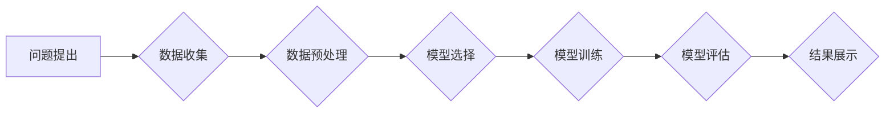
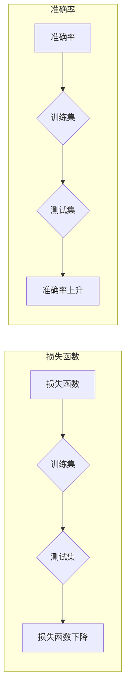

# AI hackathon的影响与未来

> 关键词：AI hackathon, 创新竞赛, 人工智能, 团队合作, 技术挑战, 解决方案, 未来趋势

## 1. 背景介绍

随着人工智能技术的飞速发展，AI hackathon作为一种新兴的科技竞赛形式，在全球范围内迅速兴起。AI hackathon通常聚集了一群来自不同背景的程序员、数据科学家、AI研究人员等，他们共同在有限的时间内，针对特定的AI问题提出创新解决方案。本文将探讨AI hackathon的影响，并展望其未来发展趋势。

### 1.1 问题的由来

AI hackathon的兴起源于以下几个因素：

1. **技术进步**：人工智能技术的快速发展为AI hackathon提供了技术基础。
2. **数据资源**：互联网时代积累了大量的数据资源，为AI模型训练提供了可能。
3. **人才聚集**：全球范围内涌现出大量的AI人才，为AI hackathon提供了人才支持。
4. **创新需求**：企业和社会对AI技术的创新应用需求不断增长，AI hackathon成为推动创新的重要平台。

### 1.2 研究现状

AI hackathon已经成为全球范围内最受欢迎的科技竞赛之一。许多知名企业和研究机构都举办了各类AI hackathon，如Facebook AI Research、Google AI、亚马逊等。这些竞赛不仅吸引了大量人才参与，还催生了众多创新成果。

### 1.3 研究意义

AI hackathon对人工智能领域的影响主要体现在以下几个方面：

1. **推动技术创新**：AI hackathon为参与者提供了展示才华、交流学习的平台，有助于推动人工智能技术的创新。
2. **加速技术落地**：AI hackathon的解决方案可以快速应用于实际场景，加速人工智能技术的落地。
3. **培养人才**：AI hackathon有助于培养跨学科人才，提高参与者的技术创新能力和团队协作能力。
4. **促进产业合作**：AI hackathon促进了企业和研究机构的合作，为人工智能产业发展提供了新的动力。

### 1.4 本文结构

本文将按照以下结构展开：

- **第2章**：介绍AI hackathon的核心概念与联系，包括核心算法、数据集和评估指标等。
- **第3章**：探讨AI hackathon的算法原理和具体操作步骤。
- **第4章**：讲解AI hackathon中常用的数学模型和公式，并结合实例进行分析。
- **第5章**：展示AI hackathon的代码实例，并进行详细解释说明。
- **第6章**：分析AI hackathon的实际应用场景，并展望未来发展趋势。
- **第7章**：推荐AI hackathon相关的学习资源、开发工具和参考文献。
- **第8章**：总结AI hackathon的研究成果，并展望未来发展趋势与挑战。
- **第9章**：附录，提供常见问题与解答。

## 2. 核心概念与联系

### 2.1 核心算法原理

AI hackathon中常用的核心算法包括：

- **监督学习**：通过标注数据训练模型，实现预测和分类。
- **无监督学习**：通过未标注数据学习数据分布，发现数据中的潜在规律。
- **强化学习**：通过与环境交互学习最优策略，实现决策优化。

### 2.2 数据集

AI hackathon中常用的数据集包括：

- **图像数据集**：如ImageNet、CIFAR-10等，用于图像分类、物体检测等任务。
- **文本数据集**：如Common Crawl、Twitter等，用于情感分析、文本摘要等任务。
- **语音数据集**：如LibriSpeech、TIMIT等，用于语音识别、语音合成等任务。

### 2.3 评估指标

AI hackathon中常用的评估指标包括：

- **准确率**：预测结果与真实标签一致的样本比例。
- **召回率**：所有真实正例中被正确识别的比例。
- **F1值**：准确率和召回率的调和平均数。
- **损失函数**：用于衡量预测结果与真实标签之间的差距，如交叉熵损失函数。

### 2.4 Mermaid 流程图

以下为AI hackathon的基本流程图：



## 3. 核心算法原理 & 具体操作步骤

### 3.1 算法原理概述

AI hackathon中的核心算法主要包括以下几种：

- **监督学习**：通过标注数据训练模型，实现预测和分类。例如，使用神经网络进行图像分类，使用逻辑回归进行文本分类。
- **无监督学习**：通过未标注数据学习数据分布，发现数据中的潜在规律。例如，使用聚类算法进行数据降维，使用主成分分析进行特征提取。
- **强化学习**：通过与环境交互学习最优策略，实现决策优化。例如，使用深度Q网络(DQN)进行游戏AI，使用策略梯度方法进行机器人路径规划。

### 3.2 算法步骤详解

以下以图像分类任务为例，介绍AI hackathon的算法步骤：

1. **数据收集**：收集大量的图像数据，并进行标注。
2. **数据预处理**：对图像数据进行预处理，如裁剪、缩放、旋转等，以提高模型的泛化能力。
3. **模型选择**：根据任务特点选择合适的模型，如卷积神经网络(CNN)、循环神经网络(RNN)等。
4. **模型训练**：使用标注数据进行模型训练，调整模型参数，以降低预测误差。
5. **模型评估**：使用测试数据评估模型性能，调整超参数，以提高模型效果。
6. **结果展示**：展示模型的预测结果，并与其他模型进行比较。

### 3.3 算法优缺点

- **监督学习**：优点是模型性能稳定，缺点是需要大量标注数据。
- **无监督学习**：优点是不需要标注数据，缺点是模型性能可能不如监督学习。
- **强化学习**：优点是能够学习到复杂的决策策略，缺点是训练过程复杂，需要大量样本。

### 3.4 算法应用领域

AI hackathon的核心算法在以下领域有着广泛的应用：

- **图像识别**：如图像分类、物体检测、图像分割等。
- **自然语言处理**：如文本分类、情感分析、机器翻译等。
- **语音识别**：如语音合成、语音识别、语音识别率提升等。
- **推荐系统**：如商品推荐、音乐推荐、电影推荐等。

## 4. 数学模型和公式 & 详细讲解 & 举例说明

### 4.1 数学模型构建

以下以图像分类任务为例，介绍常用的数学模型：

- **卷积神经网络(CNN)**：由卷积层、池化层和全连接层组成，用于提取图像特征并进行分类。

### 4.2 公式推导过程

以下为CNN中卷积层和池化层的公式推导：

- **卷积层**：假设输入图像为 $X \in \mathbb{R}^{H \times W \times C}$，卷积核为 $K \in \mathbb{R}^{K \times K \times C}$，则输出特征图 $F \in \mathbb{R}^{H' \times W' \times C'}$ 的公式为：

  $$
  F(x_{ij}) = \sum_{k=1}^{C'} \sum_{p=1}^{C} \sum_{q=1}^{C'} \sum_{r=1}^{C} K_{pqrc} \cdot x_{(i-j+p)(k-r+1)(l-q+1)}
  $$

- **池化层**：假设输入特征图为 $F \in \mathbb{R}^{H \times W \times C}$，池化窗口为 $W' \times W'$，则输出特征图 $F' \in \mathbb{R}^{H' \times W' \times C}$ 的公式为：

  $$
  F'(i,j,c) = \max_{x \in W'} F(x_{ij}, x_{ij+1}, ..., x_{ij+W'-1}, ..., x_{ij+1+W'-1}, x_{ij+H'-1}, ..., x_{ij+H'-1+W'-1})
  $$

### 4.3 案例分析与讲解

以下以基于CNN的图像分类任务为例，分析其优缺点：

- **优点**：
  - 能够有效提取图像特征，提高模型性能。
  - 可扩展性强，可通过调整网络结构实现不同任务的分类。
- **缺点**：
  - 训练过程复杂，计算量较大。
  - 模型可解释性较差，难以理解模型的决策过程。

## 5. 项目实践：代码实例和详细解释说明

### 5.1 开发环境搭建

以下以使用TensorFlow和Keras搭建图像分类任务的开发环境为例：

1. 安装TensorFlow和Keras：
```bash
pip install tensorflow
pip install keras
```

2. 导入必要的库：
```python
import tensorflow as tf
from tensorflow.keras import layers, models
```

### 5.2 源代码详细实现

以下为使用Keras实现图像分类任务的示例代码：

```python
# 定义CNN模型
model = models.Sequential()
model.add(layers.Conv2D(32, (3, 3), activation='relu', input_shape=(32, 32, 3)))
model.add(layers.MaxPooling2D((2, 2)))
model.add(layers.Conv2D(64, (3, 3), activation='relu'))
model.add(layers.MaxPooling2D((2, 2)))
model.add(layers.Conv2D(64, (3, 3), activation='relu'))
model.add(layers.Flatten())
model.add(layers.Dense(64, activation='relu'))
model.add(layers.Dense(10, activation='softmax'))

# 编译模型
model.compile(optimizer='adam',
              loss='sparse_categorical_crossentropy',
              metrics=['accuracy'])

# 训练模型
model.fit(train_images, train_labels, epochs=10)

# 评估模型
test_loss, test_acc = model.evaluate(test_images, test_labels, verbose=2)
print('
Test accuracy:', test_acc)
```

### 5.3 代码解读与分析

以上代码展示了使用Keras实现图像分类任务的基本流程：

1. 定义CNN模型，包括卷积层、池化层和全连接层。
2. 编译模型，设置优化器、损失函数和评估指标。
3. 训练模型，使用训练数据集进行训练。
4. 评估模型，使用测试数据集评估模型性能。

### 5.4 运行结果展示

以下为训练过程中损失函数和准确率的变化曲线：



从图中可以看出，随着训练的进行，损失函数逐渐下降，准确率逐渐上升，说明模型性能在不断提升。

## 6. 实际应用场景

AI hackathon的解决方案在以下领域有着广泛的应用：

### 6.1 医疗健康

- **疾病诊断**：利用AI技术对医学影像进行分析，辅助医生进行疾病诊断。
- **药物研发**：利用AI技术加速药物研发过程，提高药物研发效率。

### 6.2 智能制造

- **生产优化**：利用AI技术优化生产流程，提高生产效率和质量。
- **设备维护**：利用AI技术进行设备故障预测和诊断，降低设备故障率。

### 6.3 智慧城市

- **交通管理**：利用AI技术优化交通流量，缓解交通拥堵。
- **环境监测**：利用AI技术监测环境状况，保护生态环境。

### 6.4 金融服务

- **欺诈检测**：利用AI技术检测金融欺诈行为，保障金融安全。
- **风险评估**：利用AI技术进行风险评估，降低金融风险。

### 6.5 教育领域

- **个性化学习**：利用AI技术实现个性化学习，提高学习效果。
- **智能辅导**：利用AI技术提供智能辅导，帮助学生解决学习问题。

## 7. 工具和资源推荐

### 7.1 学习资源推荐

- **书籍**：
  - 《深度学习》（Goodfellow等著）
  - 《Python机器学习基础教程》（Peter Harrington著）
- **在线课程**：
  - Coursera上的《机器学习》课程
  - edX上的《深度学习专项课程》
- **技术社区**：
  - GitHub
  - Stack Overflow

### 7.2 开发工具推荐

- **深度学习框架**：
  - TensorFlow
  - PyTorch
  - Keras
- **数据分析工具**：
  - Pandas
  - NumPy
  - Scikit-learn
- **可视化工具**：
  - Matplotlib
  - Seaborn
  - Plotly

### 7.3 相关论文推荐

- **图像分类**：
  - VGGNet
  - ResNet
  - Inception
- **自然语言处理**：
  - BERT
  - GPT
  - ELMO

## 8. 总结：未来发展趋势与挑战

### 8.1 研究成果总结

AI hackathon作为一种新兴的科技竞赛形式，对人工智能领域产生了深远的影响。它不仅推动了技术创新，加速了技术落地，还培养了人才，促进了产业合作。未来，AI hackathon将继续发挥其重要作用，为人工智能领域的发展贡献力量。

### 8.2 未来发展趋势

1. **跨学科融合**：AI hackathon将更加注重跨学科融合，吸引更多领域的人才参与，推动人工智能与其他领域的结合。
2. **开源社区发展**：AI hackathon将进一步促进开源社区的发展，推动技术的共享和传播。
3. **社会影响力提升**：AI hackathon将更加关注社会问题，利用人工智能技术解决现实挑战。

### 8.3 面临的挑战

1. **数据安全和隐私**：AI hackathon中涉及的大量数据需要确保安全和隐私。
2. **算法偏见和歧视**：AI模型可能存在偏见和歧视，需要采取措施消除。
3. **技术伦理**：AI技术的应用需要遵循伦理规范，确保技术发展符合社会价值观。

### 8.4 研究展望

未来，AI hackathon将不断推动人工智能技术的发展，为构建更加美好的未来贡献力量。

## 9. 附录：常见问题与解答

**Q1：AI hackathon适合初学者吗？**

A：AI hackathon适合初学者。虽然AI技术门槛较高，但AI hackathon提供了一个学习和实践的平台，让初学者能够通过团队协作、学习交流等方式快速提升技能。

**Q2：如何选择合适的AI hackathon项目？**

A：选择合适的AI hackathon项目需要考虑以下几个因素：

- **个人兴趣**：选择自己感兴趣的项目，能够更好地投入精力。
- **技术栈**：选择自己熟悉的技术栈，降低学习成本。
- **项目难度**：选择适合自己的项目难度，既能够挑战自己，又能够完成任务。

**Q3：如何提高AI hackathon的参赛成功率？**

A：提高AI hackathon的参赛成功率需要做到以下几点：

- **团队合作**：与团队成员保持良好沟通，分工协作。
- **数据驱动**：注重数据分析，从数据中寻找规律和规律。
- **模型优化**：不断优化模型，提高模型性能。
- **时间管理**：合理规划时间，确保项目按时完成。

**Q4：AI hackathon的成果如何转化成实际应用？**

A：AI hackathon的成果可以转化为实际应用的方式有以下几种：

- **开源**：将代码和模型开源，供他人学习和使用。
- **合作**：与企业和研究机构合作，将成果应用于实际场景。
- **创业**：将成果转化为产品，创立自己的公司。

作者：禅与计算机程序设计艺术 / Zen and the Art of Computer Programming