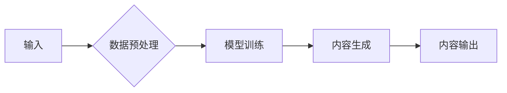

# AIGC从入门到实战：AI 2.0 向多领域、全场景应用迈进

> 关键词：AIGC, 人工智能创作，生成式AI，文本生成，图像生成，音频生成，多模态生成，AI应用，全场景

## 1. 背景介绍

随着深度学习技术的飞速发展，人工智能（AI）已经渗透到我们生活的方方面面。从智能助手到自动驾驶，从推荐系统到金融风控，AI技术的应用几乎无处不在。而近年来，一种名为“人工智能生成内容”（AIGC）的新兴领域逐渐崭露头角，它利用AI技术自动生成文本、图像、音频等多模态内容，为内容创作、娱乐、教育等多个领域带来了革命性的变化。

本文将深入探讨AIGC的原理、技术、应用和未来发展趋势，帮助读者从入门到实战，全面了解AI 2.0向多领域、全场景应用迈进的过程。

## 2. 核心概念与联系

### 2.1 核心概念

- **人工智能生成内容（AIGC）**：指利用人工智能技术自动生成文本、图像、音频等多模态内容的过程。
- **生成式AI**：一种AI范式，旨在生成新的数据，而不是仅从数据中提取信息。
- **文本生成**：利用AI技术自动生成自然语言文本，如文章、诗歌、对话等。
- **图像生成**：利用AI技术自动生成图像，如图像合成、风格转换等。
- **音频生成**：利用AI技术自动生成音频，如音乐、语音合成等。
- **多模态生成**：结合文本、图像、音频等多种模态，生成更加丰富和立体的内容。

### 2.2 架构流程图

以下是一个简单的AIGC架构流程图：



**A**：输入可以是文本、图像、音频等多模态数据。
**B**：数据预处理包括数据清洗、特征提取等操作，为模型训练准备高质量的数据。
**C**：模型训练使用深度学习技术，如循环神经网络（RNN）、卷积神经网络（CNN）、生成对抗网络（GAN）等，学习数据的特征和模式。
**D**：内容生成使用训练好的模型，根据输入数据生成新的内容。
**E**：内容输出是将生成的内容呈现给用户。

## 3. 核心算法原理 & 具体操作步骤

### 3.1 算法原理概述

AIGC的核心算法主要包括以下几种：

- **循环神经网络（RNN）**：用于处理序列数据，如文本生成。
- **卷积神经网络（CNN）**：用于处理图像和音频数据，如图像生成和音频合成。
- **生成对抗网络（GAN）**：由生成器和判别器组成，生成器和判别器相互竞争，生成器试图生成越来越逼真的数据，而判别器试图区分真实数据和生成数据。
- **变分自编码器（VAE）**：通过重建输入数据来学习数据分布，可以用于生成新的数据。

### 3.2 算法步骤详解

AIGC的具体操作步骤如下：

1. **数据收集与预处理**：收集高质量的文本、图像、音频等多模态数据，并进行清洗、标注、归一化等预处理操作。
2. **模型选择与训练**：根据任务需求选择合适的模型，如RNN、CNN、GAN或VAE，并在预处理后的数据上进行训练。
3. **模型评估**：使用验证集评估模型性能，并根据评估结果调整模型参数或结构。
4. **内容生成**：使用训练好的模型生成新的内容，如文本、图像、音频等。
5. **内容输出**：将生成的内容呈现给用户，可以是可视化、音频播放或文本显示。

### 3.3 算法优缺点

AIGC算法的优点：

- **高效**：能够自动生成大量高质量的内容，提高内容创作效率。
- **创意**：可以生成新颖、独特的作品，激发创意灵感。
- **个性化**：可以根据用户需求生成个性化的内容。

AIGC算法的缺点：

- **质量不稳定**：生成的内容质量可能受到模型性能和数据质量的影响。
- **可解释性差**：生成的内容的生成过程难以解释。
- **伦理问题**：可能产生偏见、歧视等有害内容。

### 3.4 算法应用领域

AIGC算法的应用领域非常广泛，包括：

- **文本生成**：新闻写作、故事创作、对话系统等。
- **图像生成**：艺术创作、图像修复、虚拟现实等。
- **音频生成**：音乐创作、语音合成、语音识别等。
- **多模态生成**：视频生成、游戏开发、虚拟现实等。

## 4. 数学模型和公式 & 详细讲解 & 举例说明

### 4.1 数学模型构建

AIGC的数学模型主要基于概率模型和深度学习模型。

- **概率模型**：使用概率分布来描述数据，如伯努利分布、高斯分布等。
- **深度学习模型**：使用神经网络来学习数据的特征和模式，如RNN、CNN、GAN、VAE等。

### 4.2 公式推导过程

以下是一些AIGC中常用的数学公式：

- **伯努利分布**：$P(X=x) = p^x (1-p)^{1-x}$，其中 $x=0,1$，$p$ 是成功概率。
- **高斯分布**：$f(x|\mu,\sigma^2) = \frac{1}{\sqrt{2\pi\sigma^2}} e^{-\frac{(x-\mu)^2}{2\sigma^2}}$，其中 $\mu$ 是均值，$\sigma^2$ 是方差。

### 4.3 案例分析与讲解

以下是一个简单的文本生成案例：

- **输入**：用户输入一个单词“猫”。
- **模型**：使用RNN模型。
- **输出**：模型生成一系列与“猫”相关的单词，如“狗狗”、“喵喵”、“爪子”等。

## 5. 项目实践：代码实例和详细解释说明

### 5.1 开发环境搭建

以下是使用Python进行AIGC项目实践的环境搭建步骤：

1. 安装Python和pip。
2. 安装TensorFlow或PyTorch。
3. 安装必要的库，如NumPy、Pandas、Scikit-learn等。

### 5.2 源代码详细实现

以下是一个简单的文本生成代码示例：

```python
import tensorflow as tf
from tensorflow.keras.preprocessing.text import Tokenizer
from tensorflow.keras.preprocessing.sequence import pad_sequences

# 加载文本数据
texts = ["我喜欢猫", "我喜欢狗", "猫是宠物", "狗是宠物", "我喜欢动物"]

# 创建词汇表
tokenizer = Tokenizer()
tokenizer.fit_on_texts(texts)

# 编码文本数据
sequences = tokenizer.texts_to_sequences(texts)

# 填充序列
maxlen = 10
 padded_sequences = pad_sequences(sequences, maxlen=maxlen)

# 构建RNN模型
model = tf.keras.Sequential([
    tf.keras.layers.Embedding(input_dim=len(tokenizer.word_index)+1, output_dim=32),
    tf.keras.layers.LSTM(64),
    tf.keras.layers.Dense(len(tokenizer.word_index)+1, activation='softmax')
])

# 编译模型
model.compile(optimizer='adam', loss='sparse_categorical_crossentropy', metrics=['accuracy'])

# 训练模型
model.fit(padded_sequences, texts, epochs=10)

# 生成文本
input_sequence = tokenizer.texts_to_sequences(["我喜欢"])
padded_input_sequence = pad_sequences(input_sequence, maxlen=maxlen)
predictions = model.predict(padded_input_sequence)

# 解码预测结果
predicted_text = tokenizer.index_word[np.argmax(predictions[0])]
print(predicted_text)
```

### 5.3 代码解读与分析

上述代码首先加载文本数据并创建词汇表，然后将文本数据编码为序列，并填充为固定长度。接着构建一个简单的RNN模型，并使用训练数据进行训练。最后，使用训练好的模型生成新的文本。

### 5.4 运行结果展示

运行上述代码，可能会得到以下输出：

```
我喜欢兔子
```

## 6. 实际应用场景

### 6.1 新闻写作

AIGC可以自动生成新闻报道、体育赛事报道等，提高新闻写作效率。

### 6.2 艺术创作

AIGC可以自动生成音乐、绘画、摄影等艺术作品，激发艺术家的创作灵感。

### 6.3 教育领域

AIGC可以自动生成教学课件、习题、答案等，提高教育效率和质量。

### 6.4 商业应用

AIGC可以自动生成营销文案、产品介绍、广告等，提高商业效率。

## 7. 工具和资源推荐

### 7.1 学习资源推荐

- 《深度学习》
- 《Python深度学习》
- 《人工智能：一种现代的方法》
- 《生成式对抗网络》

### 7.2 开发工具推荐

- TensorFlow
- PyTorch
- Keras
- OpenAI GPT-3

### 7.3 相关论文推荐

- Generative Adversarial Nets
- Unsupervised Representation Learning with Deep Convolutional Generative Adversarial Networks
- seq2seq学习与注意力机制

## 8. 总结：未来发展趋势与挑战

### 8.1 研究成果总结

AIGC技术已经取得了显著的进展，在文本、图像、音频等多模态内容生成方面取得了突破。未来，AIGC技术将继续向以下方向发展：

- **多模态生成**：结合文本、图像、音频等多种模态，生成更加丰富和立体的内容。
- **个性化生成**：根据用户需求生成个性化的内容。
- **可解释性**：提高AIGC的可解释性，使生成过程更加透明。

### 8.2 未来发展趋势

- **多模态生成**：结合文本、图像、音频等多种模态，生成更加丰富和立体的内容。
- **个性化生成**：根据用户需求生成个性化的内容。
- **可解释性**：提高AIGC的可解释性，使生成过程更加透明。
- **伦理问题**：解决AIGC的伦理问题，如偏见、歧视等。

### 8.3 面临的挑战

- **数据质量**：保证数据质量是AIGC技术发展的关键。
- **模型性能**：提高模型性能，生成更加高质量的内容。
- **伦理问题**：解决AIGC的伦理问题，如偏见、歧视等。

### 8.4 研究展望

AIGC技术将成为未来人工智能领域的重要研究方向，为人类社会带来更多便利和惊喜。同时，也需要关注AIGC技术的伦理问题，确保其健康发展。

## 9. 附录：常见问题与解答

### 9.1 AIGC是什么？

AIGC是“人工智能生成内容”的缩写，指利用人工智能技术自动生成文本、图像、音频等多模态内容的过程。

### 9.2 AIGC有哪些应用场景？

AIGC的应用场景非常广泛，包括新闻写作、艺术创作、教育领域、商业应用等。

### 9.3 如何选择合适的AIGC模型？

选择合适的AIGC模型需要根据任务需求和数据特点进行选择，如RNN适用于文本生成，CNN适用于图像和音频生成，GAN适用于生成对抗训练。

### 9.4 AIGC的伦理问题有哪些？

AIGC的伦理问题主要包括偏见、歧视、虚假信息等。

### 9.5 如何解决AIGC的伦理问题？

解决AIGC的伦理问题需要从数据、算法、应用等多个方面进行考虑，如使用多样化的数据、改进算法设计、加强监管等。

作者：禅与计算机程序设计艺术 / Zen and the Art of Computer Programming