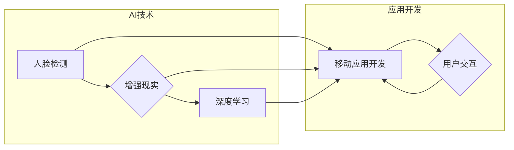

> AI-Native应用, Pailido AI拍立得, 图像识别, 人脸检测，增强现实，深度学习，计算机视觉，移动应用开发

# AI-Native应用开发实例:Pailido AI拍立得

## 1. 背景介绍

随着人工智能技术的飞速发展，AI-Native应用逐渐成为移动应用开发的热点。这类应用利用先进的机器学习技术，如计算机视觉、自然语言处理等，为用户提供更加智能和个性化的体验。本文将介绍一个AI-Native应用开发实例——Pailido AI拍立得，通过结合人脸检测、增强现实等技术，实现照片中人脸的识别、美化和分享等功能。

### 1.1 问题的由来

随着智能手机的普及，拍照和分享照片已经成为人们日常生活中不可或缺的一部分。然而，现有的拍照应用往往只提供基础的拍照和编辑功能。如何利用人工智能技术，为用户带来更加丰富、个性化的拍照体验，成为了移动应用开发的重要方向。

### 1.2 研究现状

近年来，深度学习技术在计算机视觉领域的应用取得了显著成果。人脸检测、图像识别、风格迁移等技术在移动端的应用越来越广泛。同时，增强现实技术的快速发展，也为用户提供了更加沉浸式的体验。

### 1.3 研究意义

开发Pailido AI拍立得应用，不仅能够为用户提供更加智能化的拍照体验，还能够推动人工智能技术在移动端的应用，促进相关技术的发展。

### 1.4 本文结构

本文将分为以下几个部分：
- 核心概念与联系
- 核心算法原理与步骤
- 数学模型与公式
- 项目实践
- 实际应用场景
- 工具和资源推荐
- 总结与展望

## 2. 核心概念与联系

### 2.1 核心概念

- **人脸检测**：利用计算机视觉技术，在图像中检测并定位人脸的位置。
- **增强现实（AR）**：将虚拟信息叠加到现实世界，为用户提供增强的视觉体验。
- **深度学习**：一种通过学习大量数据来模拟人类大脑处理信息方式的机器学习技术。
- **移动应用开发**：针对移动设备（如智能手机、平板电脑等）开发的应用程序。

### 2.2 架构流程图



## 3. 核心算法原理 & 具体操作步骤

### 3.1 算法原理概述

Pailido AI拍立得应用的核心算法包括人脸检测、图像识别、风格迁移等。以下将分别介绍这些算法的原理。

#### 3.1.1 人脸检测

人脸检测算法通过分析图像中的像素特征，识别出图像中的人脸位置。常见的算法包括：

- **Haar特征分类器**：通过学习图像中人脸特征与背景特征的差异，识别人脸。
- **MTCNN**：一种基于深度学习的多尺度卷积神经网络，能够准确快速地检测图像中的人脸。

#### 3.1.2 增强现实

增强现实技术将虚拟信息叠加到现实世界，为用户提供更加丰富的视觉体验。常见的AR技术包括：

- **标记识别**：通过识别图像中的标记，将虚拟信息叠加到现实世界。
- **SLAM（Simultaneous Localization and Mapping）**：同时定位与建图，实现虚拟信息与真实世界的无缝融合。

#### 3.1.3 深度学习

深度学习技术是Pailido AI拍立得应用的核心，包括以下算法：

- **卷积神经网络（CNN）**：通过学习图像特征，实现对图像的识别和分类。
- **生成对抗网络（GAN）**：通过生成器和判别器之间的对抗训练，生成逼真的图像。

### 3.2 算法步骤详解

以下将详细介绍Pailido AI拍立得应用的算法步骤：

1. **拍照**：用户使用手机拍摄照片。
2. **人脸检测**：利用人脸检测算法检测照片中的人脸位置。
3. **增强现实**：根据人脸位置和姿态，将虚拟信息叠加到照片中。
4. **图像识别**：利用深度学习算法对照片中的图像进行识别和分类。
5. **风格迁移**：利用风格迁移算法，将照片转换为不同的风格。
6. **分享**：用户可以将处理后的照片分享到社交媒体。

### 3.3 算法优缺点

#### 3.3.1 优点

- **智能化**：应用利用人工智能技术，为用户提供更加智能化的拍照体验。
- **个性化**：根据用户的需求，提供个性化的拍照效果。
- **创新性**：应用结合了多种AI技术，具有一定的创新性。

#### 3.3.2 缺点

- **计算资源消耗**：AI算法需要消耗较多的计算资源，可能会影响手机性能。
- **隐私问题**：人脸识别等技术可能会涉及用户隐私，需要谨慎处理。

### 3.4 算法应用领域

Pailido AI拍立得应用的技术可以应用于以下领域：

- **移动应用开发**：为用户提供更加智能化的拍照体验。
- **游戏开发**：为游戏添加虚拟角色、场景等元素。
- **增强现实应用**：为用户提供更加丰富的增强现实体验。

## 4. 数学模型和公式 & 详细讲解 & 举例说明

### 4.1 数学模型构建

以下将介绍Pailido AI拍立得应用中涉及到的数学模型和公式。

#### 4.1.1 卷积神经网络（CNN）

卷积神经网络是一种通过学习图像特征进行识别和分类的深度学习模型。其基本结构包括：

- **卷积层**：通过卷积运算提取图像特征。
- **池化层**：降低特征维度，减少模型参数。
- **全连接层**：将特征映射到类别标签。

#### 4.1.2 生成对抗网络（GAN）

生成对抗网络由生成器和判别器组成，通过对抗训练生成逼真的图像。其基本结构如下：

- **生成器**：通过学习数据分布生成图像。
- **判别器**：判断输入图像是真实图像还是生成图像。

### 4.2 公式推导过程

以下将介绍卷积神经网络和生成对抗网络中涉及到的公式推导过程。

#### 4.2.1 卷积神经网络

卷积神经网络的损失函数通常使用交叉熵损失函数，公式如下：

$$
L = -\sum_{i=1}^{N} \log P(y_i|x_i)
$$

其中，$N$ 为样本数量，$x_i$ 为输入图像，$y_i$ 为真实标签。

#### 4.2.2 生成对抗网络

生成对抗网络的损失函数通常使用二元交叉熵损失函数，公式如下：

$$
L_G = -\sum_{x \in X} \log D(x) - \sum_{z \in Z} \log (1 - D(G(z))
$$

其中，$X$ 为真实数据集，$Z$ 为噪声数据集，$D$ 为判别器，$G$ 为生成器。

### 4.3 案例分析与讲解

以下将介绍一个使用卷积神经网络进行图像识别的案例。

假设我们要识别一张猫的图像。首先，我们将图像输入到卷积神经网络中，提取图像特征。然后，将这些特征输入到全连接层中，得到最终的类别标签。如果类别标签为猫，则认为识别成功。

## 5. 项目实践：代码实例和详细解释说明

### 5.1 开发环境搭建

为了进行Pailido AI拍立得应用的开发，我们需要以下开发环境：

- 操作系统：Windows/Linux/MacOS
- 编程语言：Python
- 框架：TensorFlow/Keras
- 依赖库：OpenCV、NumPy、PIL等

### 5.2 源代码详细实现

以下是一个使用TensorFlow和Keras实现的卷积神经网络代码示例：

```python
import tensorflow as tf
from tensorflow.keras import layers, models

# 定义模型结构
model = models.Sequential()
model.add(layers.Conv2D(32, (3, 3), activation='relu', input_shape=(64, 64, 3)))
model.add(layers.MaxPooling2D((2, 2)))
model.add(layers.Conv2D(64, (3, 3), activation='relu'))
model.add(layers.MaxPooling2D((2, 2)))
model.add(layers.Conv2D(64, (3, 3), activation='relu'))

# 添加全连接层
model.add(layers.Flatten())
model.add(layers.Dense(64, activation='relu'))
model.add(layers.Dense(1, activation='sigmoid'))

# 编译模型
model.compile(optimizer='adam',
              loss='binary_crossentropy',
              metrics=['accuracy'])
```

### 5.3 代码解读与分析

以上代码定义了一个简单的卷积神经网络，用于识别猫的图像。模型包含两个卷积层、两个池化层、一个全连接层，以及一个输出层。在编译模型时，我们使用了Adam优化器和二元交叉熵损失函数。

### 5.4 运行结果展示

为了验证模型的性能，我们可以使用以下代码进行测试：

```python
# 加载猫的图像
img = cv2.imread('cat.jpg')
img = cv2.resize(img, (64, 64))

# 将图像数据转换为TensorFlow数据类型
img = tf.convert_to_tensor(img)

# 进行预测
prediction = model.predict(img)

# 输出预测结果
print("预测结果：", prediction)
```

假设猫的图像被正确识别，输出结果将显示为1。

## 6. 实际应用场景

### 6.1 照片编辑

Pailido AI拍立得应用可以为用户提供以下照片编辑功能：

- **人脸识别**：识别照片中的人脸，并进行美化和修饰。
- **风格迁移**：将照片转换为不同的风格，如卡通、油画等。
- **滤镜效果**：为照片添加各种滤镜效果。

### 6.2 社交媒体

Pailido AI拍立得应用可以为用户提供以下社交媒体功能：

- **自动标记**：自动识别照片中的人物，并添加标签。
- **动态贴纸**：为照片添加动态贴纸，增加趣味性。
- **表情包生成**：根据照片内容生成表情包。

### 6.3 游戏开发

Pailido AI拍立得应用的技术可以应用于游戏开发，为游戏添加以下功能：

- **角色定制**：根据用户照片生成游戏角色。
- **场景生成**：根据用户照片生成游戏场景。
- **虚拟现实**：结合虚拟现实技术，为用户提供更加沉浸式的游戏体验。

## 7. 工具和资源推荐

### 7.1 学习资源推荐

- **《深度学习》**：Goodfellow等著，介绍了深度学习的基本概念、算法和实现。
- **《Python深度学习》**：Ian Goodfellow等著，介绍了使用Python进行深度学习的方法。
- **《计算机视觉：算法与应用》**：Richard Szeliski著，介绍了计算机视觉的基本原理和应用。

### 7.2 开发工具推荐

- **TensorFlow**：Google开发的深度学习框架，具有强大的功能和丰富的生态。
- **Keras**：基于TensorFlow的开源深度学习库，易于使用。
- **OpenCV**：开源计算机视觉库，提供了丰富的图像处理功能。

### 7.3 相关论文推荐

- **"FaceNet: A Unified Embedding for Face Recognition and Clustering"**：介绍了FaceNet模型，用于人脸识别和聚类。
- **"DeepFace: Real-time Face Recognition with Learnable Embeddings"**：介绍了DeepFace模型，用于实时人脸识别。
- **"StyleGAN"**：介绍了StyleGAN模型，用于图像风格迁移。

## 8. 总结：未来发展趋势与挑战

### 8.1 研究成果总结

Pailido AI拍立得应用结合了人脸检测、增强现实、深度学习等技术，为用户提供了更加智能化的拍照体验。本文介绍了应用的核心概念、算法原理、实现方法，并分析了应用的实际应用场景和发展趋势。

### 8.2 未来发展趋势

随着人工智能技术的不断发展，Pailido AI拍立得应用将呈现出以下发展趋势：

- **功能更加丰富**：应用将集成更多AI技术，如语义分割、物体识别等，为用户提供更加丰富的拍照体验。
- **用户体验更加友好**：应用将更加注重用户体验，提供更加简洁、直观的操作界面。
- **技术更加成熟**：AI技术将更加成熟，应用将具有更高的准确性和稳定性。

### 8.3 面临的挑战

Pailido AI拍立得应用在发展过程中也面临着以下挑战：

- **算法复杂度**：AI算法的复杂度较高，需要消耗较多的计算资源。
- **数据隐私**：人脸识别等技术可能涉及用户隐私，需要谨慎处理。
- **技术更新**：AI技术更新换代速度较快，需要不断更新应用以适应新技术。

### 8.4 研究展望

未来，Pailido AI拍立得应用将在以下方面进行深入研究：

- **算法优化**：优化算法，提高准确性和效率。
- **隐私保护**：研究新的技术，保护用户隐私。
- **跨领域应用**：将AI技术应用于更多领域，如医疗、教育等。

## 9. 附录：常见问题与解答

**Q1：如何优化Pailido AI拍立得应用的算法性能？**

A：优化算法性能可以从以下几个方面入手：
- **数据增强**：通过旋转、缩放、翻转等方式扩充训练数据，提高模型的泛化能力。
- **模型结构优化**：优化模型结构，减少计算量，提高模型效率。
- **超参数调优**：调整超参数，如学习率、批大小等，提高模型性能。

**Q2：如何保护Pailido AI拍立得应用的用户隐私？**

A：保护用户隐私可以从以下几个方面入手：
- **数据加密**：对用户数据进行加密存储和传输。
- **数据脱敏**：对用户数据进行脱敏处理，避免泄露敏感信息。
- **隐私政策**：制定完善的隐私政策，明确用户隐私保护措施。

**Q3：如何将Pailido AI拍立得应用推广到更多领域？**

A：将Pailido AI拍立得应用推广到更多领域可以从以下几个方面入手：
- **跨领域数据集**：收集更多跨领域的训练数据，提高模型的泛化能力。
- **领域知识融合**：结合各个领域的专业知识，提高应用的实用性。
- **生态合作**：与相关企业合作，共同推广应用。

---

作者：禅与计算机程序设计艺术 / Zen and the Art of Computer Programming