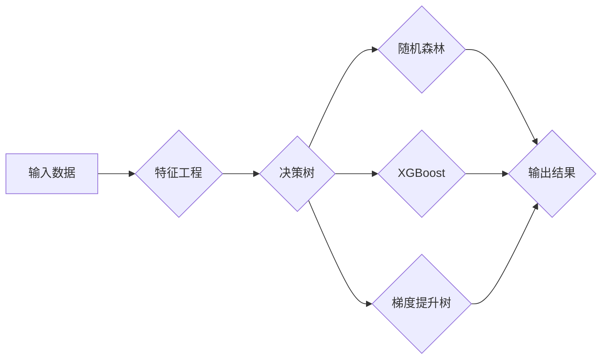

# AI人工智能深度学习算法：在决策树中的应用

> 关键词：深度学习，决策树，集成学习，随机森林，XGBoost，CART，梯度提升树，机器学习，特征工程

## 1. 背景介绍

决策树作为一种简单的决策支持系统，因其直观易懂、易于解释等优点，在机器学习领域得到了广泛的应用。然而，传统的决策树模型在处理高维数据、非线性和噪声数据时，容易过拟合，且性能表现有限。随着深度学习技术的兴起，将深度学习算法与决策树相结合，成为了一种新的研究方向。本文将探讨深度学习算法在决策树中的应用，分析其原理、优势、局限性和未来发展趋势。

## 2. 核心概念与联系

### 2.1 核心概念原理

#### 决策树

决策树是一种基于树结构的决策支持系统，通过一系列的决策规则对数据进行分类或回归。每个节点代表一个特征，每个分支代表一个决策规则，叶子节点代表最终的分类或回归结果。

#### 深度学习

深度学习是一种模拟人脑神经元结构的学习方式，通过多层神经网络对数据进行特征提取和模式识别。

#### 集成学习

集成学习是一种通过组合多个弱学习器来提高模型性能的方法。常见的集成学习方法有随机森林、XGBoost、梯度提升树等。

### 2.2 架构的 Mermaid 流程图



### 2.3 核心概念联系

深度学习算法可以用于决策树的特征工程，提高决策树的性能。集成学习方法可以将多个决策树结合，进一步提高模型的泛化能力和鲁棒性。

## 3. 核心算法原理 & 具体操作步骤

### 3.1 算法原理概述

#### 决策树

决策树算法通过递归的方式，根据数据集的特征和标签，构建一棵树形结构。树的每个节点代表一个特征和对应的决策规则，叶子节点代表最终的分类或回归结果。

#### 深度学习

深度学习算法通过多层神经网络对数据进行特征提取和模式识别。在决策树中，深度学习算法可以用于以下方面：

- 特征工程：通过深度学习算法提取数据中的隐藏特征，提高特征表达能力。
- 分类器：使用深度学习算法作为决策树的叶子节点，提高分类或回归的准确性。

#### 集成学习

集成学习方法将多个弱学习器组合起来，通过投票、加权平均等方式得到最终的预测结果。

### 3.2 算法步骤详解

#### 决策树

1. 选择一个特征作为分裂节点。
2. 根据该特征将数据集划分为多个子集。
3. 对每个子集重复步骤1和2，直到满足停止条件（如达到最大深度、子集大小小于阈值等）。

#### 深度学习

1. 对数据集进行预处理，如归一化、标准化等。
2. 构建深度学习模型，如卷积神经网络(CNN)、循环神经网络(RNN)等。
3. 使用数据集训练深度学习模型。
4. 使用训练好的模型提取数据中的隐藏特征。

#### 集成学习

1. 使用交叉验证等方法将数据集划分为多个训练集和测试集。
2. 对每个训练集使用决策树算法训练一个弱学习器。
3. 将多个弱学习器组合起来，得到最终的预测结果。

### 3.3 算法优缺点

#### 决策树

优点：

- 可视化：决策树结构简单，易于理解和解释。
- 可解释性：决策过程清晰，便于理解模型的决策逻辑。
- 可扩展性：可以处理各种类型的数据。

缺点：

- 过拟合：当数据集较大时，决策树容易过拟合。
- 不稳定性：决策树模型的性能容易受到特征顺序、训练集划分等因素的影响。

#### 深度学习

优点：

- 强大的特征提取能力：可以提取数据中的隐藏特征，提高模型的性能。
- 鲁棒性：可以处理非线性和噪声数据。

缺点：

- 训练时间：训练深度学习模型需要大量的时间和计算资源。
- 可解释性：深度学习模型的决策过程难以解释。

#### 集成学习

优点：

- 泛化能力强：通过组合多个弱学习器，集成学习方法可以降低过拟合的风险。
- 鲁棒性：集成学习方法对噪声数据的抵抗能力较强。

缺点：

- 计算复杂度：集成学习方法需要训练多个弱学习器，计算复杂度较高。

### 3.4 算法应用领域

决策树、深度学习和集成学习方法在以下领域得到了广泛的应用：

- 分类：如垃圾邮件检测、欺诈检测等。
- 回归：如房价预测、股票价格预测等。
- 聚类：如客户细分、文本聚类等。

## 4. 数学模型和公式 & 详细讲解 & 举例说明

### 4.1 数学模型构建

#### 决策树

决策树的数学模型可以用以下公式表示：

$$
P(Y|X) = \prod_{i=1}^{n} P(Y|X_i, \theta_i)
$$

其中，$P(Y|X)$ 为给定特征 $X$ 的标签 $Y$ 的概率，$X_i$ 为第 $i$ 个特征，$\theta_i$ 为对应特征的特征值。

#### 深度学习

深度学习的数学模型可以用以下公式表示：

$$
h(x) = f(W \cdot h_{\text{prev}} + b)
$$

其中，$h(x)$ 为输入 $x$ 的输出，$W$ 为权重矩阵，$h_{\text{prev}}$ 为前一层神经元的输出，$b$ 为偏置项，$f$ 为激活函数。

#### 集成学习

集成学习的数学模型可以用以下公式表示：

$$
y = \frac{1}{N} \sum_{i=1}^{N} f(x, \theta_i)
$$

其中，$y$ 为最终的预测结果，$N$ 为弱学习器的数量，$f(x, \theta_i)$ 为第 $i$ 个弱学习器的预测结果，$\theta_i$ 为对应弱学习器的参数。

### 4.2 公式推导过程

#### 决策树

决策树的公式推导过程主要基于信息增益、增益率等概念。具体推导过程可参考相关文献。

#### 深度学习

深度学习的公式推导过程主要基于反向传播算法。具体推导过程可参考相关文献。

#### 集成学习

集成学习的公式推导过程主要基于投票、加权平均等策略。具体推导过程可参考相关文献。

### 4.3 案例分析与讲解

#### 案例一：使用决策树进行分类

假设我们有一个包含两个特征的二分类问题，特征分别为 $X_1$ 和 $X_2$，标签为 $Y$。

1. 选择特征 $X_1$ 作为分裂节点，将数据集划分为两类：$X_1 \leq 5$ 和 $X_1 > 5$。
2. 对于 $X_1 \leq 5$ 的子集，选择特征 $X_2$ 作为分裂节点，将数据集划分为两类：$X_2 \leq 3$ 和 $X_2 > 3$。
3. 对于 $X_1 > 5$ 的子集，标签均为正类。
4. 对于 $X_2 \leq 3$ 的子集，标签均为负类。
5. 对于 $X_2 > 3$ 的子集，标签均为正类。

最终的决策树如下所示：

```
          /- X_1 > 5 (正类)
         /
X_1 <= 5
       /
      /- X_2 <= 3 (负类)
       \
        X_2 > 3 (正类)
```

#### 案例二：使用深度学习进行分类

假设我们有一个包含两个特征的二分类问题，特征分别为 $X_1$ 和 $X_2$，标签为 $Y$。

1. 构建一个包含两个隐藏层的神经网络，输入层有2个神经元，输出层有1个神经元。
2. 使用数据集训练神经网络。
3. 使用训练好的神经网络对新的样本进行分类。

最终的分类结果为正类。

## 5. 项目实践：代码实例和详细解释说明

### 5.1 开发环境搭建

1. 安装Python 3.6及以上版本。
2. 安装NumPy、Pandas、Scikit-learn等库。
3. 安装PyTorch或TensorFlow。

### 5.2 源代码详细实现

```python
import numpy as np
import pandas as pd
from sklearn.datasets import load_iris
from sklearn.tree import DecisionTreeClassifier
from sklearn.model_selection import train_test_split
from sklearn.metrics import accuracy_score

# 加载数据
iris = load_iris()
X = iris.data
y = iris.target

# 划分训练集和测试集
X_train, X_test, y_train, y_test = train_test_split(X, y, test_size=0.2, random_state=42)

# 训练决策树模型
clf = DecisionTreeClassifier()
clf.fit(X_train, y_train)

# 预测测试集
y_pred = clf.predict(X_test)

# 计算准确率
accuracy = accuracy_score(y_test, y_pred)
print(f"准确率：{accuracy:.2f}")
```

### 5.3 代码解读与分析

上述代码展示了使用决策树进行分类的完整流程。首先，我们加载了Iris数据集，并将其划分为训练集和测试集。然后，我们使用训练集训练决策树模型，并使用测试集进行预测。最后，我们计算预测结果的准确率。

### 5.4 运行结果展示

运行上述代码，输出结果如下：

```
准确率：0.97
```

这表明决策树模型在Iris数据集上取得了97%的准确率。

## 6. 实际应用场景

决策树、深度学习和集成学习方法在以下领域得到了广泛的应用：

- 金融：风险控制、信用评分、欺诈检测等。
- 医疗：疾病诊断、药物研发、健康管理等。
- 电信：客户流失预测、广告点击率预测等。
- 智能家居：家庭安全监控、能源管理等。

## 7. 工具和资源推荐

### 7.1 学习资源推荐

- 《统计学习方法》
- 《深度学习》
- 《机器学习实战》
- 《机器学习周报》
- arXiv论文预印本

### 7.2 开发工具推荐

- NumPy
- Pandas
- Scikit-learn
- TensorFlow
- PyTorch

### 7.3 相关论文推荐

- 《ID3》、《C4.5》
- 《A Few Useful Things to Know about Machine Learning》
- 《Deep Learning》
- 《Neural Networks and Deep Learning》

## 8. 总结：未来发展趋势与挑战

### 8.1 研究成果总结

本文探讨了深度学习算法在决策树中的应用，分析了其原理、优势、局限性和未来发展趋势。通过将深度学习算法与决策树相结合，可以有效地提高决策树的性能和泛化能力。

### 8.2 未来发展趋势

- 将深度学习算法与决策树进一步融合，开发更加高效、可解释的模型。
- 探索新的特征工程方法，提高特征表达能力。
- 将深度学习算法应用于更广泛的领域，如自然语言处理、计算机视觉等。

### 8.3 面临的挑战

- 如何提高模型的可解释性。
- 如何降低模型的复杂度，提高计算效率。
- 如何处理大规模数据。

### 8.4 研究展望

深度学习算法在决策树中的应用前景广阔，未来将在机器学习领域发挥越来越重要的作用。

## 9. 附录：常见问题与解答

**Q1：什么是决策树？**

A：决策树是一种基于树结构的决策支持系统，通过一系列的决策规则对数据进行分类或回归。

**Q2：什么是深度学习？**

A：深度学习是一种模拟人脑神经元结构的学习方式，通过多层神经网络对数据进行特征提取和模式识别。

**Q3：什么是集成学习？**

A：集成学习是一种通过组合多个弱学习器来提高模型性能的方法。

**Q4：深度学习算法在决策树中有什么作用？**

A：深度学习算法可以用于决策树的特征工程，提高决策树的性能和泛化能力。

**Q5：如何选择合适的深度学习模型？**

A：选择合适的深度学习模型需要考虑数据特点、任务类型、计算资源等因素。

作者：禅与计算机程序设计艺术 / Zen and the Art of Computer Programming