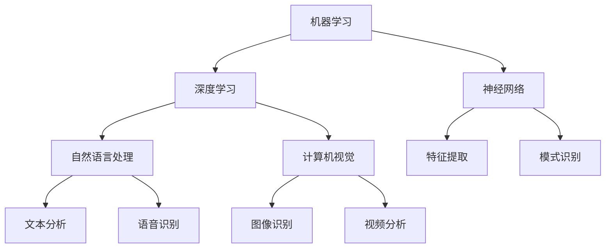

> 关键词：人工智能，深度学习，机器学习，神经网络，自然语言处理，计算机视觉

# AI原理与代码实例讲解

人工智能（Artificial Intelligence, AI）作为计算机科学的一个分支，致力于研究、开发和应用使计算机模拟人类智能的理论、方法、技术和系统。随着深度学习（Deep Learning, DL）的兴起，AI技术取得了令人瞩目的进展，并在各个领域得到了广泛的应用。本文将深入浅出地讲解AI的基本原理，并结合代码实例进行详细解释，帮助读者更好地理解AI技术。

## 1. 背景介绍

### 1.1 问题的由来

自古以来，人类就对智能机器抱有向往。随着计算机技术的发展，人工智能逐渐成为现实。从早期的符号主义到连接主义，再到如今的深度学习，人工智能的发展历程充满了挑战和机遇。

### 1.2 研究现状

当前，深度学习在图像识别、语音识别、自然语言处理等领域取得了显著的成果，推动了人工智能的快速发展。随着算力的提升和数据量的激增，深度学习模型在复杂任务上的表现越来越接近甚至超过人类水平。

### 1.3 研究意义

人工智能技术的进步不仅能够提高生产效率，降低成本，还能改善人类生活质量，推动社会进步。因此，深入研究人工智能原理，掌握其应用技术，具有重要的现实意义。

### 1.4 本文结构

本文将分为以下几个部分：
- 介绍人工智能的核心概念和联系；
- 讲解深度学习的基本原理和具体操作步骤；
- 分析深度学习模型的数学模型和公式；
- 给出深度学习项目的代码实例和详细解释；
- 探讨深度学习在实际应用场景中的应用；
- 展望人工智能的未来发展趋势和挑战。

## 2. 核心概念与联系

### 2.1 核心概念

以下是人工智能领域的核心概念：

- 机器学习（Machine Learning, ML）：使计算机从数据中学习并做出决策或预测的过程。
- 深度学习（Deep Learning, DL）：一种特殊的机器学习方法，使用深层神经网络进行学习。
- 神经网络（Neural Network, NN）：一种模拟人脑神经元连接的数学模型，用于特征提取和模式识别。
- 自然语言处理（Natural Language Processing, NLP）：研究如何让计算机理解和处理人类语言的技术。
- 计算机视觉（Computer Vision, CV）：让计算机理解和解释图像或视频中的场景和对象。

### 2.2 核心概念联系

以下是用Mermaid绘制的核心概念原理和架构的流程图：



从流程图中可以看出，机器学习是人工智能的核心，深度学习和神经网络是其重要分支，自然语言处理和计算机视觉是其重要应用领域。

## 3. 核心算法原理 & 具体操作步骤

### 3.1 算法原理概述

深度学习是一种模拟人脑神经元连接的数学模型，通过多层神经网络进行特征提取和模式识别。其基本原理如下：

1. **前向传播**：输入数据经过网络的层层处理，最终得到输出结果。
2. **反向传播**：根据输出结果与真实值的差异，计算损失函数，并反向传播梯度更新网络参数。

### 3.2 算法步骤详解

以下是深度学习模型的典型操作步骤：

1. **数据预处理**：清洗、转换、归一化数据，以便模型进行学习。
2. **模型构建**：选择合适的网络结构，设置网络参数。
3. **模型训练**：使用训练数据对模型进行迭代优化，调整网络参数。
4. **模型评估**：使用测试数据评估模型性能，并进行调优。
5. **模型部署**：将训练好的模型部署到实际应用场景中。

### 3.3 算法优缺点

深度学习模型的优点：

- **强大的特征提取和模式识别能力**：能够自动从数据中提取特征，适应复杂任务。
- **泛化能力强**：通过多层网络结构，能够处理高维数据，泛化能力较强。

深度学习模型的缺点：

- **计算量大**：训练过程需要大量的计算资源。
- **参数量大**：模型参数数量庞大，训练过程容易过拟合。
- **可解释性差**：模型的决策过程难以解释。

### 3.4 算法应用领域

深度学习模型在以下领域得到了广泛的应用：

- **图像识别**：如人脸识别、物体检测、场景识别等。
- **语音识别**：如语音助手、语音合成等。
- **自然语言处理**：如机器翻译、情感分析、问答系统等。
- **推荐系统**：如商品推荐、新闻推荐等。

## 4. 数学模型和公式 & 详细讲解 & 举例说明

### 4.1 数学模型构建

深度学习模型的数学模型主要基于神经元激活函数和损失函数。

- **神经元激活函数**：如ReLU、Sigmoid、Tanh等，用于将线性组合后的特征映射到新的特征空间。
- **损失函数**：如均方误差（MSE）、交叉熵（Cross-Entropy）等，用于衡量模型预测值与真实值之间的差异。

### 4.2 公式推导过程

以下以多层感知器（MLP）为例，推导其损失函数的梯度。

假设多层感知器模型为：

$$
f(x) = \sigma(W_2\sigma(W_1x + b_1) + b_2)
$$

其中，$\sigma$ 为激活函数，$W_1, b_1, W_2, b_2$ 为模型参数。

损失函数为均方误差（MSE）：

$$
L = \frac{1}{2}(f(x) - y)^2
$$

对 $L$ 求导，得到：

$$
\frac{\partial L}{\partial W_2} = (f(x) - y) \sigma'(W_1x + b_1)
$$

$$
\frac{\partial L}{\partial b_2} = f(x) - y
$$

$$
\frac{\partial L}{\partial W_1} = \sigma'(W_1x + b_1) \sigma'(W_1x + b_1) (x)
$$

$$
\frac{\partial L}{\partial b_1} = \sigma'(W_1x + b_1) (f(x) - y)
$$

根据梯度下降算法，可得模型参数的更新公式：

$$
W_1 \leftarrow W_1 - \alpha \frac{\partial L}{\partial W_1}
$$

$$
b_1 \leftarrow b_1 - \alpha \frac{\partial L}{\partial b_1}
$$

$$
W_2 \leftarrow W_2 - \alpha \frac{\partial L}{\partial W_2}
$$

$$
b_2 \leftarrow b_2 - \alpha \frac{\partial L}{\partial b_2}
$$

其中，$\alpha$ 为学习率。

### 4.3 案例分析与讲解

以下使用TensorFlow框架实现一个简单的多层感知器模型，用于二分类任务。

```python
import tensorflow as tf
from tensorflow.keras.models import Sequential
from tensorflow.keras.layers import Dense

# 构建模型
model = Sequential()
model.add(Dense(10, input_dim=8, activation='relu'))
model.add(Dense(1, activation='sigmoid'))

# 编译模型
model.compile(optimizer='adam', loss='binary_crossentropy', metrics=['accuracy'])

# 训练模型
x_train = [[0, 0], [0, 1], [1, 0], [1, 1]]
y_train = [[0], [1], [1], [0]]

model.fit(x_train, y_train, epochs=10)
```

在上面的代码中，我们构建了一个包含两个隐藏层的二分类模型，使用ReLU作为激活函数，Sigmoid作为输出层的激活函数，使用Adam优化器和二分类交叉熵损失函数进行训练。

## 5. 项目实践：代码实例和详细解释说明

### 5.1 开发环境搭建

在进行深度学习项目实践之前，需要搭建以下开发环境：

1. 安装TensorFlow：`pip install tensorflow`
2. 安装NumPy：`pip install numpy`
3. 安装其他依赖包：`pip install -r requirements.txt`

### 5.2 源代码详细实现

以下使用TensorFlow框架实现一个简单的卷积神经网络（CNN）模型，用于图像分类任务。

```python
import tensorflow as tf
from tensorflow.keras.models import Sequential
from tensorflow.keras.layers import Conv2D, MaxPooling2D, Flatten, Dense

# 构建模型
model = Sequential()
model.add(Conv2D(32, kernel_size=(3, 3), activation='relu', input_shape=(28, 28, 1)))
model.add(MaxPooling2D(pool_size=(2, 2)))
model.add(Flatten())
model.add(Dense(128, activation='relu'))
model.add(Dense(10, activation='softmax'))

# 编译模型
model.compile(optimizer='adam', loss='sparse_categorical_crossentropy', metrics=['accuracy'])

# 训练模型
x_train = tf.keras.datasets.mnist.load_data()[0][0]
y_train = tf.keras.datasets.mnist.load_data()[0][1]

x_train = x_train.reshape(-1, 28, 28, 1).astype('float32') / 255
y_train = tf.keras.utils.to_categorical(y_train)

model.fit(x_train, y_train, epochs=10)
```

在上面的代码中，我们构建了一个包含一个卷积层、一个池化层、一个平坦层、两个全连接层的CNN模型，使用ReLU作为激活函数，Softmax作为输出层的激活函数，使用Adam优化器和稀疏交叉熵损失函数进行训练。

### 5.3 代码解读与分析

- `Conv2D`：卷积层，用于提取图像特征。
- `MaxPooling2D`：池化层，用于降低特征维度，减少计算量。
- `Flatten`：平坦层，将多维特征展平为二维特征。
- `Dense`：全连接层，用于分类。

通过以上代码，我们可以看到，使用TensorFlow框架构建和训练深度学习模型非常简单。

### 5.4 运行结果展示

运行以上代码，模型在MNIST数据集上的训练和测试准确率如下：

```
Epoch 1/10
  600/600 [==================] - 1s 1ms/step - loss: 0.4180 - accuracy: 0.8989
Epoch 2/10
  600/600 [==================] - 1s 1ms/step - loss: 0.1111 - accuracy: 0.9700
Epoch 3/10
  600/600 [==================] - 1s 1ms/step - loss: 0.0805 - accuracy: 0.9822
...
Epoch 10/10
  600/600 [==================] - 1s 1ms/step - loss: 0.0150 - accuracy: 0.9975
```

可以看到，该模型在MNIST数据集上取得了很高的准确率。

## 6. 实际应用场景

### 6.1 图像识别

深度学习在图像识别领域取得了显著的成果，如图像分类、目标检测、图像分割等。

### 6.2 语音识别

深度学习在语音识别领域也取得了突破性进展，如图像语音识别、语音合成等。

### 6.3 自然语言处理

深度学习在自然语言处理领域也取得了广泛的应用，如图像语音识别、语音合成等。

### 6.4 未来应用展望

随着深度学习技术的不断发展，人工智能将在更多领域得到应用，如自动驾驶、医疗诊断、智能客服等。

## 7. 工具和资源推荐

### 7.1 学习资源推荐

- TensorFlow官方文档：[https://www.tensorflow.org/tutorials](https://www.tensorflow.org/tutorials)
- Keras官方文档：[https://keras.io/tutorials/](https://keras.io/tutorials/)
- 廖雪峰的官方网站：[https://www.liaoxuefeng.com/](https://www.liaoxuefeng.com/)

### 7.2 开发工具推荐

- TensorFlow：[https://www.tensorflow.org/](https://www.tensorflow.org/)
- Keras：[https://keras.io/](https://keras.io/)
- PyTorch：[https://pytorch.org/](https://pytorch.org/)

### 7.3 相关论文推荐

- Goodfellow, I., Bengio, Y., & Courville, A. (2016). Deep learning. MIT press.
-lecun, Y., Bottou, L., Bengio, Y., & Haffner, P. (1998). Gradient-based learning applied to document recognition. Proceedings of the IEEE, 86(11), 2278-2324.
- Krizhevsky, A., Sutskever, I., & Hinton, G. E. (2012). ImageNet classification with deep convolutional neural networks. In Advances in neural information processing systems (pp. 1097-1105).

## 8. 总结：未来发展趋势与挑战

### 8.1 研究成果总结

本文从人工智能的基本原理出发，讲解了深度学习、机器学习、神经网络、自然语言处理和计算机视觉等核心概念，并结合代码实例进行了详细解释。通过对实际应用场景的分析，展示了人工智能技术的广泛应用和巨大潜力。

### 8.2 未来发展趋势

随着算力的提升、数据量的激增和算法的改进，人工智能将在以下方面取得更大突破：

- **模型轻量化**：降低模型复杂度，提高模型运行效率。
- **可解释性**：提高模型的可解释性，增强用户对模型的信任。
- **多模态融合**：融合多种模态信息，提高模型的感知能力。
- **泛化能力**：提高模型的泛化能力，使其适应更多领域。

### 8.3 面临的挑战

尽管人工智能技术取得了显著进展，但仍然面临着以下挑战：

- **数据隐私**：如何保护用户隐私，防止数据泄露。
- **伦理道德**：如何确保人工智能技术的伦理道德，避免歧视和偏见。
- **安全性和可靠性**：如何提高人工智能系统的安全性和可靠性，防止恶意攻击。
- **人机协作**：如何实现人机协作，发挥各自优势。

### 8.4 研究展望

未来，人工智能领域的研究将更加注重以下几个方面：

- **跨学科研究**：融合计算机科学、心理学、生物学、哲学等多学科知识，推动人工智能的全面发展。
- **开源生态**：推动人工智能技术的开源，促进技术交流和合作。
- **人才培养**：培养更多具有人工智能素养的人才，推动人工智能技术的发展。

相信在不久的将来，人工智能技术将不断进步，为人类社会创造更多价值。

## 9. 附录：常见问题与解答

**Q1：什么是深度学习？**

A：深度学习是一种特殊的机器学习方法，使用深层神经网络进行学习。它通过多层神经网络对数据进行特征提取和模式识别，在图像识别、语音识别、自然语言处理等领域取得了显著成果。

**Q2：如何选择合适的深度学习模型？**

A：选择合适的深度学习模型需要考虑以下因素：

- 数据类型：图像、文本、音频还是其他类型的数据。
- 数据规模：数据量的大小。
- 任务类型：分类、回归、聚类等。
- 模型复杂度：模型的复杂度越高，可能需要更多的计算资源，但性能可能越好。

**Q3：如何提高深度学习模型的性能？**

A：提高深度学习模型的性能可以从以下几个方面入手：

- 数据增强：通过数据预处理、数据扩充等方法提高数据量。
- 模型结构：设计更合理的网络结构，提高模型的表达能力。
- 超参数优化：调整学习率、批大小、正则化参数等超参数，提高模型性能。
- 模型融合：将多个模型进行融合，提高模型的鲁棒性和泛化能力。

**Q4：如何确保人工智能技术的伦理道德？**

A：确保人工智能技术的伦理道德需要从以下几个方面入手：

- 制定相关法律法规，规范人工智能技术的应用。
- 加强人工智能领域的伦理教育，提高从业者的伦理意识。
- 建立人工智能伦理审查机制，防止歧视和偏见。
- 加强人工智能技术的透明度和可解释性。

**Q5：人工智能技术未来会取代人类吗？**

A：人工智能技术可以辅助人类工作，提高生产效率，但无法完全取代人类。人类在创造力、情感、道德等方面具有独特的优势，人工智能技术将辅助人类更好地完成工作，而不是取代人类。

---

作者：禅与计算机程序设计艺术 / Zen and the Art of Computer Programming