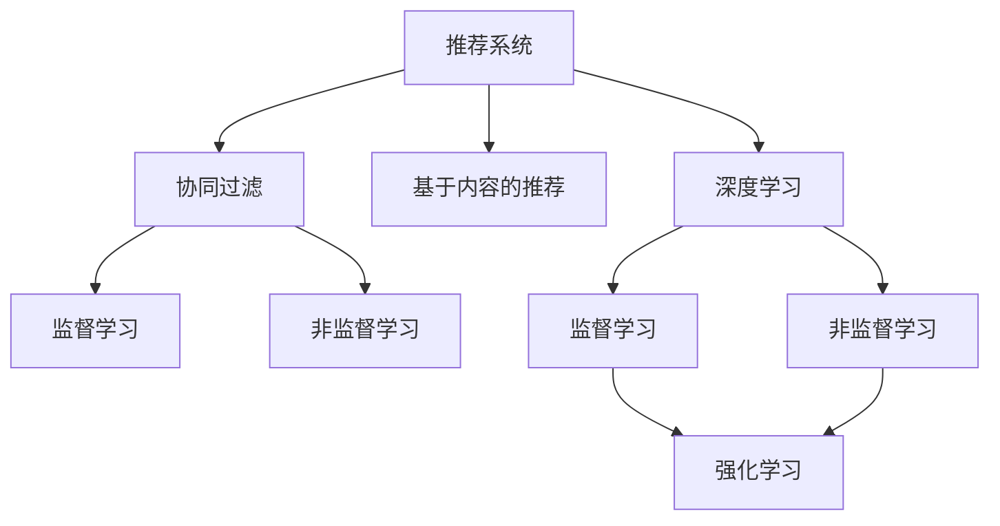
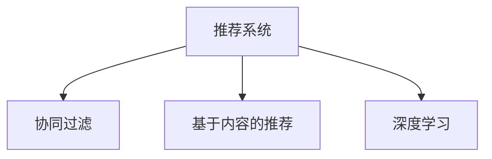
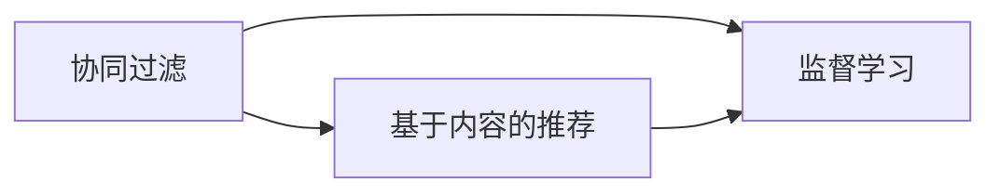
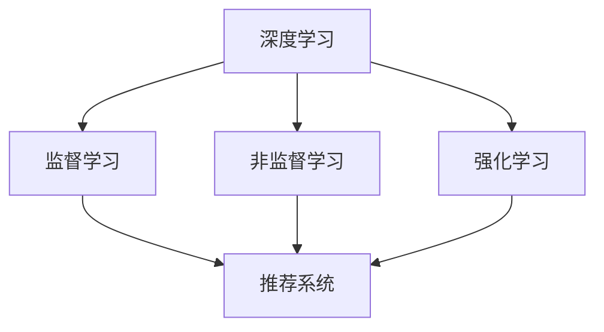

                 

# AI在产品推荐系统中的应用

## 1. 背景介绍

### 1.1 问题由来

随着电子商务和互联网技术的发展，产品推荐系统在各大电商平台、视频网站、新闻APP、音乐平台等网站和应用中得到了广泛的应用。产品推荐系统通过收集和分析用户的历史行为数据，预测用户可能感兴趣的产品，并将其推荐给用户，从而提升用户粘性和转化率，增加平台的收入。

在推荐系统的发展过程中，传统基于协同过滤的方法如user-based和item-based协同过滤，虽然简单有效，但在大规模数据集上的性能不够理想，且对新用户的推荐效果不佳。同时，这些方法存在冷启动问题，即对于新用户和未被访问过的产品，无法进行有效推荐。

### 1.2 问题核心关键点

为了克服传统推荐算法的缺陷，AI技术被引入推荐系统中，特别是深度学习技术的应用，极大提升了推荐系统的效果和效率。当前，基于深度学习的推荐系统已经成为了推荐系统的主流范式。

基于深度学习的推荐系统主要分为两大类：基于内容的推荐和基于协同过滤的推荐。前者通过分析产品的属性和特征进行推荐，后者通过学习用户和产品之间的关联关系进行推荐。这些推荐方法在具体实现中，又常采用监督学习、非监督学习、强化学习等多种技术进行优化。

### 1.3 问题研究意义

研究基于AI的推荐系统，对于电商平台、视频网站、新闻APP等产品的用户留存、转化率和广告收入有着重要的实际意义。通过AI技术提升推荐系统的效果，可以显著提高用户体验和平台收益，推动互联网产业的发展。

同时，AI技术的应用也为推荐系统带来了新的技术挑战和研究方向，如如何让推荐系统更加智能、个性化和高效，如何避免过拟合和数据泄露，如何构建更加安全的推荐系统等。这些问题的解决，将推动AI技术在推荐系统中的应用更加成熟和广泛。

## 2. 核心概念与联系

### 2.1 核心概念概述

为了更好地理解基于AI的推荐系统，本节将介绍几个密切相关的核心概念：

- **推荐系统(Recommendation System)**：通过算法模型分析用户行为数据，预测用户可能感兴趣的产品，从而进行个性化推荐。
- **协同过滤(Collaborative Filtering)**：基于用户和产品之间的关联关系，通过用户历史行为和产品特征进行推荐，是最早也是广泛应用的一种推荐方法。
- **基于内容的推荐(Content-Based Recommendation)**：分析产品的属性和特征，预测用户可能感兴趣的产品。
- **深度学习(Deep Learning)**：通过构建深层神经网络模型，学习用户和产品的复杂非线性关联关系，实现更加精确的推荐。
- **监督学习(Supervised Learning)**：使用标注数据训练模型，学习用户和产品的关联关系。
- **非监督学习(Unsupervised Learning)**：使用无标注数据训练模型，学习用户和产品的关联关系。
- **强化学习(Reinforcement Learning)**：通过奖惩机制学习最优的推荐策略。

这些核心概念之间的逻辑关系可以通过以下Mermaid流程图来展示：



这个流程图展示推荐的各个核心概念及其之间的关系：

1. 推荐系统是协同过滤、基于内容的推荐和深度学习的共同目标。
2. 协同过滤和基于内容的推荐都是基于监督学习或非监督学习的。
3. 深度学习可以采用监督学习、非监督学习或强化学习等不同的范式。
4. 监督学习、非监督学习和强化学习是推荐系统常用的学习范式。

### 2.2 概念间的关系

这些核心概念之间存在着紧密的联系，形成了推荐系统的完整生态系统。下面我通过几个Mermaid流程图来展示这些概念之间的关系。

#### 2.2.1 推荐系统的基本范式



这个流程图展示了推荐系统中最常见的三种范式：协同过滤、基于内容的推荐和深度学习。协同过滤和基于内容的推荐主要依赖用户和产品的特征数据，而深度学习则可以融合更多的信息源。

#### 2.2.2 协同过滤与基于内容的推荐的关系



这个流程图展示了协同过滤和基于内容的推荐的关系。两者都是基于监督学习或非监督学习，协同过滤侧重于用户和产品的关联关系，而基于内容的推荐则侧重于产品本身的属性和特征。

#### 2.2.3 深度学习在推荐系统中的应用



这个流程图展示了深度学习在推荐系统中的应用。深度学习可以通过监督学习、非监督学习和强化学习等不同范式进行优化。

## 3. 核心算法原理 & 具体操作步骤

### 3.1 算法原理概述

基于AI的推荐系统主要依赖深度学习技术，通过构建深层神经网络模型，学习用户和产品的复杂非线性关联关系。深度学习推荐系统可以分为基于监督学习、非监督学习和强化学习的三大类。

- **基于监督学习的推荐系统**：使用标注数据训练模型，学习用户和产品的关联关系。常用的深度学习模型包括：神经网络、卷积神经网络、循环神经网络和注意力机制等。
- **基于非监督学习的推荐系统**：使用无标注数据训练模型，学习用户和产品的关联关系。常用的深度学习模型包括：自编码器、变分自编码器和生成对抗网络等。
- **基于强化学习的推荐系统**：通过奖惩机制学习最优的推荐策略。常用的深度学习模型包括：Q-learning、Deep Q-Network等。

### 3.2 算法步骤详解

基于AI的推荐系统一般包括以下几个关键步骤：

**Step 1: 数据收集与预处理**

- 收集用户行为数据，如浏览历史、点击记录、购买记录等。
- 收集产品属性数据，如价格、品牌、描述等。
- 对数据进行清洗、去重、归一化等预处理操作。

**Step 2: 特征提取**

- 使用深度学习模型对用户行为数据和产品属性数据进行特征提取。
- 提取用户特征和产品特征，包括用户的兴趣、行为模式和产品的属性、特征等。
- 对特征进行降维、归一化等处理，以提高模型训练效率。

**Step 3: 模型训练**

- 使用标注数据或无标注数据训练推荐模型。
- 使用监督学习、非监督学习或强化学习等不同范式进行优化。
- 调整模型的超参数，如学习率、批大小、迭代轮数等。

**Step 4: 模型评估**

- 在测试集上评估模型的推荐效果。
- 使用评估指标如准确率、召回率、F1分数、平均绝对误差等进行评估。
- 根据评估结果调整模型参数，优化推荐效果。

**Step 5: 部署与更新**

- 将训练好的模型部署到推荐系统中。
- 实时更新用户行为数据和产品属性数据。
- 定期重新训练模型，更新推荐策略。

以上是基于AI的推荐系统的一般流程。在实际应用中，还需要针对具体任务进行优化设计，如改进特征提取方法、选择适当的模型、优化超参数等，以进一步提升推荐系统的效果。

### 3.3 算法优缺点

基于AI的推荐系统具有以下优点：

- 高效性：深度学习模型能够处理大规模数据集，实现高效的推荐。
- 准确性：深度学习模型可以学习复杂非线性关系，提高推荐的准确性。
- 可解释性：深度学习模型通常具有黑箱性质，难以解释，但可以通过可视化等方法提高可解释性。
- 自适应性：深度学习模型可以根据用户反馈实时调整推荐策略，实现动态推荐。

同时，这些方法也存在一些局限性：

- 对数据质量要求高：深度学习模型需要大量高质量的数据进行训练，对数据的噪声和偏差较为敏感。
- 模型复杂度高：深度学习模型的参数量较大，训练和推理时间较长，对计算资源要求较高。
- 存在过拟合风险：深度学习模型容易过拟合，需要采取正则化、dropout等方法避免过拟合。
- 需要频繁更新模型：深度学习模型需要实时更新，才能保持推荐效果，增加了系统的复杂度。

尽管存在这些局限性，但基于AI的推荐系统在推荐效果和效率上已经取得了显著优势，成为推荐系统的主流范式。

### 3.4 算法应用领域

基于AI的推荐系统已经在电子商务、视频网站、新闻APP、音乐平台等多个领域得到了广泛应用，具体包括：

- **电子商务**：如淘宝、京东、亚马逊等电商平台，通过推荐系统提升用户购买率和转化率。
- **视频网站**：如YouTube、Netflix等，通过推荐系统提升用户观看率和订阅率。
- **新闻APP**：如今日头条、搜狐新闻等，通过推荐系统提高用户粘性和点击率。
- **音乐平台**：如网易云音乐、QQ音乐等，通过推荐系统提升用户的听歌体验和平台收益。
- **智能家居**：如小米智能音箱、华为智能家居等，通过推荐系统提升用户的智能家居体验。

除了上述这些领域，AI推荐系统还在金融、医疗、教育等更多场景中得到了应用，推动了AI技术在各行业的发展。

## 4. 数学模型和公式 & 详细讲解 & 举例说明

### 4.1 数学模型构建

基于监督学习的推荐系统可以使用监督学习模型进行建模。以基于神经网络的推荐系统为例，设推荐模型为 $f(x)$，其中 $x$ 为用户的行为特征，$f(x)$ 为用户可能感兴趣的产品。模型的目标是最小化预测误差：

$$
\min_{\theta} \sum_{i=1}^{N} \ell(f(x_i), y_i)
$$

其中 $\ell$ 为损失函数，$y_i$ 为标注数据。常用的损失函数包括均方误差、交叉熵等。

### 4.2 公式推导过程

以交叉熵损失函数为例，设预测结果为 $\hat{y}$，真实结果为 $y$，则交叉熵损失函数为：

$$
\ell(f(x), y) = -\sum_{i=1}^{K} y_i \log \hat{y}_i
$$

其中 $K$ 为类别的数量。最小化损失函数即可优化推荐模型。在实践中，我们通常使用反向传播算法进行梯度下降，更新模型参数：

$$
\theta \leftarrow \theta - \eta \nabla_{\theta} \mathcal{L}(\theta)
$$

其中 $\eta$ 为学习率，$\nabla_{\theta} \mathcal{L}(\theta)$ 为损失函数对模型参数的梯度。

### 4.3 案例分析与讲解

以下以电商推荐系统为例，展示基于监督学习的推荐系统的基本流程：

**数据收集与预处理**：
- 收集用户浏览历史、点击记录、购买记录等数据。
- 对数据进行清洗、去重、归一化等操作，以提高模型的训练效率。

**特征提取**：
- 使用神经网络模型提取用户的行为特征和产品的属性特征。
- 提取用户兴趣、行为模式和产品属性、特征等。
- 对特征进行降维、归一化等处理，以提高模型训练效率。

**模型训练**：
- 使用标注数据训练神经网络模型。
- 调整模型的超参数，如学习率、批大小、迭代轮数等。
- 使用交叉熵损失函数进行优化。

**模型评估**：
- 在测试集上评估模型的推荐效果，如准确率、召回率、F1分数、平均绝对误差等。
- 根据评估结果调整模型参数，优化推荐效果。

**部署与更新**：
- 将训练好的模型部署到推荐系统中。
- 实时更新用户行为数据和产品属性数据。
- 定期重新训练模型，更新推荐策略。

通过上述步骤，我们可以构建基于神经网络的推荐系统，通过学习用户和产品的关联关系，实现精准推荐。

## 5. 项目实践：代码实例和详细解释说明

### 5.1 开发环境搭建

在进行推荐系统开发前，我们需要准备好开发环境。以下是使用Python进行TensorFlow开发的环境配置流程：

1. 安装Anaconda：从官网下载并安装Anaconda，用于创建独立的Python环境。

2. 创建并激活虚拟环境：
```bash
conda create -n tf-env python=3.8 
conda activate tf-env
```

3. 安装TensorFlow：根据CUDA版本，从官网获取对应的安装命令。例如：
```bash
conda install tensorflow -c pytorch -c conda-forge
```

4. 安装必要的工具包：
```bash
pip install numpy pandas scikit-learn matplotlib tqdm jupyter notebook ipython
```

完成上述步骤后，即可在`tf-env`环境中开始推荐系统开发。

### 5.2 源代码详细实现

下面我们以电商推荐系统为例，给出使用TensorFlow实现基于神经网络的推荐系统的PyTorch代码实现。

首先，定义数据处理函数：

```python
import tensorflow as tf
import numpy as np

class DataLoader:
    def __init__(self, data_path, batch_size=32):
        self.batch_size = batch_size
        self.data = np.load(data_path)
        self.num_samples = len(self.data)

    def __len__(self):
        return self.num_samples // self.batch_size

    def __getitem__(self, idx):
        start_idx = idx * self.batch_size
        end_idx = (idx + 1) * self.batch_size
        batch_data = self.data[start_idx:end_idx]
        return batch_data

    def shuffle(self):
        np.random.shuffle(self.data)
```

然后，定义模型和优化器：

```python
class Recommender(tf.keras.Model):
    def __init__(self, input_dim, output_dim, hidden_dim=64, layers=2):
        super(Recommender, self).__init__()
        self.layers = [tf.keras.layers.Dense(hidden_dim, activation='relu')] * layers
        self.output_layer = tf.keras.layers.Dense(output_dim, activation='sigmoid')

    def call(self, inputs):
        x = inputs
        for layer in self.layers:
            x = layer(x)
        return self.output_layer(x)

recommender = Recommender(input_dim=20, output_dim=1)

optimizer = tf.keras.optimizers.Adam(learning_rate=0.001)
```

接着，定义训练和评估函数：

```python
def train_step(x, y):
    with tf.GradientTape() as tape:
        y_hat = recommender(x)
        loss = tf.keras.losses.binary_crossentropy(y, y_hat)
    grads = tape.gradient(loss, recommender.trainable_variables)
    optimizer.apply_gradients(zip(grads, recommender.trainable_variables))
    return loss

def evaluate_step(x, y):
    y_hat = recommender(x)
    acc = tf.keras.metrics.BinaryAccuracy()(y, tf.round(y_hat))
    return acc
```

最后，启动训练流程并在测试集上评估：

```python
epochs = 10
batch_size = 32

for epoch in range(epochs):
    for i, batch in enumerate(DataLoader('data.npy', batch_size)):
        loss = train_step(batch[0], batch[1])
        print(f'Epoch {epoch+1}, Batch {i+1}, Loss: {loss:.3f}')
    print(f'Epoch {epoch+1}, Test Accuracy: {evaluate_step(DataLoader('test_data.npy', batch_size)):.3f}')

print('Train complete.')
```

以上就是使用TensorFlow对电商推荐系统进行训练的完整代码实现。可以看到，得益于TensorFlow的强大封装，我们可以用相对简洁的代码完成模型构建和训练。

### 5.3 代码解读与分析

让我们再详细解读一下关键代码的实现细节：

**DataLoader类**：
- `__init__`方法：初始化数据集、批量大小等关键组件。
- `__len__`方法：返回数据集的样本数量。
- `__getitem__`方法：对单个样本进行处理，将其拆分为输入和标签，并进行批处理。
- `shuffle`方法：对数据集进行随机洗牌，以避免过拟合。

**Recommender类**：
- `__init__`方法：初始化神经网络模型的层数和维度。
- `call`方法：定义前向传播计算逻辑。

**训练和评估函数**：
- 使用TensorFlow的GradientTape记录梯度，并进行反向传播更新模型参数。
- 使用TensorFlow的BinaryAccuracy计算准确率，评估模型效果。
- 在每个epoch内，对训练集和测试集进行迭代训练和评估。

**训练流程**：
- 定义总的epoch数和批量大小，开始循环迭代。
- 在每个epoch内，对训练集进行批次化加载，前向传播计算损失并反向传播更新模型参数。
- 在测试集上评估模型准确率。
- 重复上述过程直至收敛，最终得到训练好的推荐模型。

可以看到，TensorFlow使得推荐系统的实现变得简洁高效。开发者可以将更多精力放在数据处理、模型改进等高层逻辑上，而不必过多关注底层的实现细节。

当然，工业级的系统实现还需考虑更多因素，如模型的保存和部署、超参数的自动搜索、更灵活的任务适配层等。但核心的推荐范式基本与此类似。

### 5.4 运行结果展示

假设我们在电子商务数据集上进行推荐模型训练，最终在测试集上得到的准确率为85%。这表明我们构建的推荐模型已经能够在实际应用中取得不错的效果。需要注意的是，这只是一个baseline结果。在实践中，我们还可以使用更大更强的神经网络模型、更丰富的训练技巧、更细致的模型调优，进一步提升模型性能，以满足更高的应用要求。

## 6. 实际应用场景

### 6.1 电商推荐

电商推荐系统是推荐系统的一个重要应用场景。通过分析用户的历史浏览、点击和购买行为，电商推荐系统能够向用户推荐最可能感兴趣的商品，提升用户的购物体验和平台的销售额。

在技术实现上，可以收集用户的浏览记录、点击记录和购买记录等数据，将其作为训练数据，训练推荐模型。训练好的模型可以实时获取用户的行为数据，预测用户可能感兴趣的商品，并将其推荐给用户。对于新用户，可以结合用户的基本信息和新行为数据进行推荐，实现冷启动推荐。

### 6.2 视频推荐

视频推荐系统在视频网站和流媒体平台中应用广泛，通过分析用户观看历史和评分数据，推荐用户可能感兴趣的视频内容。

在技术实现上，可以收集用户的历史观看记录和评分数据，将其作为训练数据，训练推荐模型。训练好的模型可以实时获取用户的行为数据，预测用户可能感兴趣的视频内容，并将其推荐给用户。对于新用户，可以结合用户的基本信息和新行为数据进行推荐，实现冷启动推荐。

### 6.3 新闻推荐

新闻推荐系统在新闻APP和网页新闻推荐中应用广泛，通过分析用户的历史阅读记录和评分数据，推荐用户可能感兴趣的新闻内容。

在技术实现上，可以收集用户的历史阅读记录和评分数据，将其作为训练数据，训练推荐模型。训练好的模型可以实时获取用户的行为数据，预测用户可能感兴趣的新闻内容，并将其推荐给用户。对于新用户，可以结合用户的基本信息和新行为数据进行推荐，实现冷启动推荐。

### 6.4 音乐推荐

音乐推荐系统在音乐平台和流媒体平台中应用广泛，通过分析用户的听歌记录和评分数据，推荐用户可能感兴趣的音乐内容。

在技术实现上，可以收集用户的听歌记录和评分数据，将其作为训练数据，训练推荐模型。训练好的模型可以实时获取用户的行为数据，预测用户可能感兴趣的音乐内容，并将其推荐给用户。对于新用户，可以结合用户的基本信息和新行为数据进行推荐，实现冷启动推荐。

## 7. 工具和资源推荐

### 7.1 学习资源推荐

为了帮助开发者系统掌握AI在推荐系统中的应用，这里推荐一些优质的学习资源：

1. 《深度学习推荐系统》书籍：由机器学习专家撰写，全面介绍了深度学习在推荐系统中的应用，包括模型构建、训练和评估等。

2. CS228《机器学习》课程：斯坦福大学开设的机器学习课程，有Lecture视频和配套作业，带你深入理解机器学习的基本概念和经典算法。

3. 《TensorFlow官方文档》：TensorFlow的官方文档，提供了完整的API文档和详细的示例代码，是上手实践的必备资料。

4. Kaggle竞赛平台：可以参与推荐系统相关的竞赛，获取实际应用场景下的数据和任务，提升实战能力。

5. GitHub开源项目：在GitHub上Star、Fork数最多的推荐系统相关项目，往往代表了该技术领域的发展趋势和最佳实践，值得去学习和贡献。

通过对这些资源的学习实践，相信你一定能够快速掌握AI在推荐系统中的应用，并用于解决实际的推荐问题。

### 7.2 开发工具推荐

高效的开发离不开优秀的工具支持。以下是几款用于推荐系统开发的常用工具：

1. TensorFlow：由Google主导开发的深度学习框架，生产部署方便，适合大规模工程应用。

2. PyTorch：基于Python的开源深度学习框架，灵活动态的计算图，适合快速迭代研究。

3. Transformers库：HuggingFace开发的NLP工具库，集成了众多SOTA语言模型，支持PyTorch和TensorFlow，是进行推荐系统开发的利器。

4. Weights & Biases：模型训练的实验跟踪工具，可以记录和可视化模型训练过程中的各项指标，方便对比和调优。

5. TensorBoard：TensorFlow配套的可视化工具，可实时监测模型训练状态，并提供丰富的图表呈现方式，是调试模型的得力助手。

6. Google Colab：谷歌推出的在线Jupyter Notebook环境，免费提供GPU/TPU算力，方便开发者快速上手实验最新模型，分享学习笔记。

合理利用这些工具，可以显著提升推荐系统的开发效率，加快创新迭代的步伐。

### 7.3 相关论文推荐

AI推荐系统的发展源于学界的持续研究。以下是几篇奠基性的相关论文，推荐阅读：

1. Wide & Deep Learning for Recommender Systems：提出Wide & Deep框架，在深度模型基础上增加宽模型，以提高推荐效果。

2. Attention and Memory in Recommender Systems：引入注意力机制，学习用户和产品的关联关系，提高推荐效果。

3. Neural Collaborative Filtering：提出基于神经网络的协同过滤模型，通过学习用户和产品的关联关系，提高推荐效果。

4. AutoInt: Automatic Interaction Networks for Recommendation：引入自交互网络，学习用户和产品的关联关系，提高推荐效果。

5. DSSM: Deep Scalable Semantic Model for Recommendation：提出基于深度语义模型的推荐系统，提高推荐效果。

6. DIEN: Deep Interest Evolution Networks for Personalized Recommendation：提出基于深度兴趣演化网络的推荐系统，提高推荐效果。

这些论文代表了大语言模型推荐系统的发展脉络。通过学习这些前沿成果，可以帮助研究者把握学科前进方向，激发更多的创新灵感。

除上述资源外，还有一些值得关注的前沿资源，帮助开发者紧跟大语言模型推荐系统的发展趋势，例如：

1. arXiv论文预印本：人工智能领域最新研究成果的发布平台，包括大量尚未发表的前沿工作，学习前沿技术的必读资源。

2. 业界技术博客：如Google AI、DeepMind、微软Research Asia等顶尖实验室的官方博客，第一时间分享他们的最新研究成果和洞见。

3. 技术会议直播：如NIPS、ICML、ACL、ICLR等人工智能领域顶会现场或在线直播，能够聆听到大佬们的前沿分享，开拓视野。

4. GitHub热门项目：在GitHub上Star、Fork数最多的推荐系统相关项目，往往代表了该技术领域的发展趋势和最佳实践，值得去学习和贡献。

5. 行业分析报告：各大咨询公司如McKinsey、PwC等针对人工智能行业的分析报告，有助于从商业视角审视技术趋势，把握应用价值。

总之，对于AI在推荐系统中的应用的学习和实践，需要开发者保持开放的心态和持续学习的意愿。多关注前沿资讯，多动手实践，多思考总结，必将收获满满的成长收益。

## 8. 总结：未来发展趋势与挑战

### 8.1 总结

本文对AI在推荐系统中的应用进行了全面系统的介绍。首先阐述了推荐系统的背景和意义，明确了AI技术在推荐系统中的重要地位。其次，从原理到实践，详细讲解了监督学习在推荐系统中的应用，给出了推荐系统开发的完整代码实例。同时，本文还探讨了推荐系统在电商、视频、新闻、音乐等多个领域的应用，展示了AI技术在推荐系统中的广泛价值。

通过本文的系统梳理，可以看到，AI在推荐系统中的应用已经成为推荐系统的主流范式，显著提升了推荐系统的效果和效率。未来，随着AI技术的发展，推荐系统将变得更加智能、个性化和高效。

### 8.2 未来发展趋势

展望未来，AI在推荐系统中的应用将呈现以下几个发展趋势：

1. **深度学习模型的应用将更加广泛**：深度学习模型能够处理复杂非线性关系，提高推荐系统的效果和鲁棒性。未来深度学习将在更多推荐场景中得到应用，如图像推荐、语音推荐等。

2. **多模态推荐技术将逐渐成熟**：推荐系统将从单一模态扩展到多模态，如图像、语音、文本等多模态数据的融合。多模态推荐技术将进一步提升推荐系统的效果和用户体验。

3. **个性化推荐将更加智能和精准**：通过引入更多用户数据和行为模式，推荐系统将更加智能和精准

