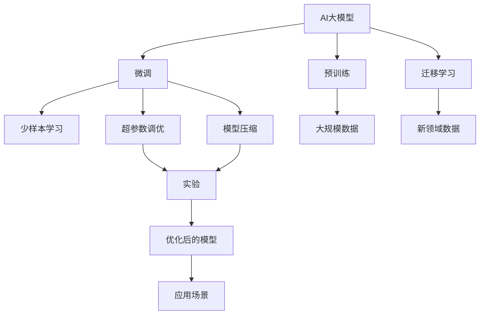
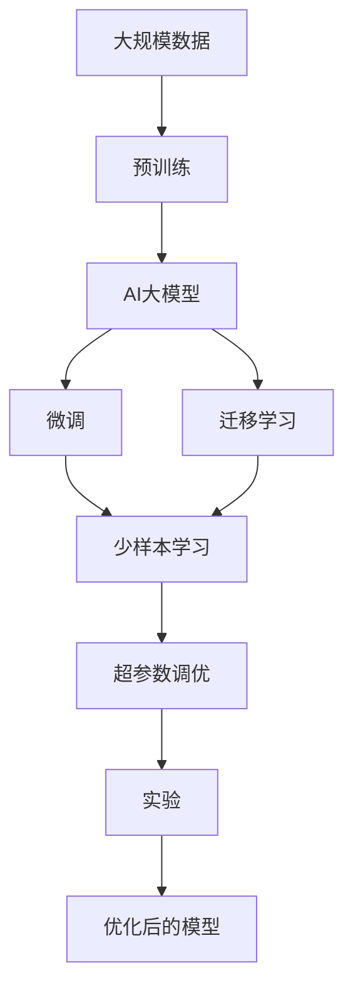
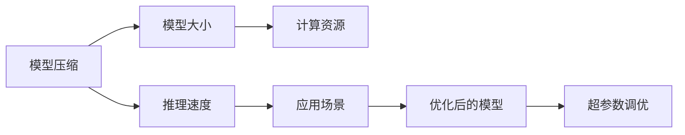
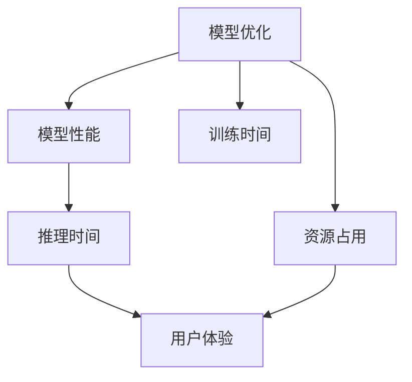
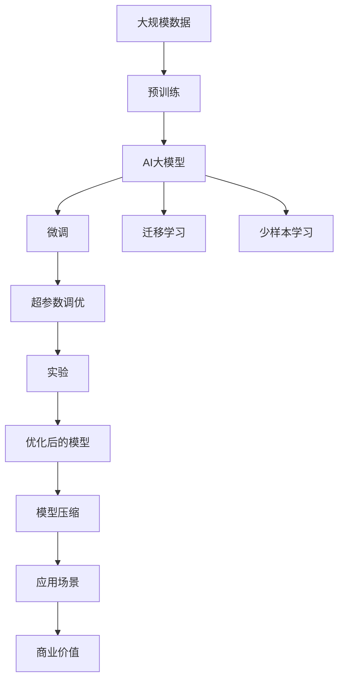

                 

## 1. 背景介绍

### 1.1 问题由来
人工智能（AI）大模型的出现，为AI创业公司提供了强大的技术支持。凭借其卓越的通用能力，大模型在自然语言处理（NLP）、计算机视觉（CV）、语音识别等众多领域，已展现出超越传统算法的潜力。然而，随着技术的不断演进，AI大模型创业也面临着一系列前所未有的挑战。如何在大规模数据和复杂算法的基础上，将AI大模型有效转化为商业价值，是当前AI创业的关键问题。

### 1.2 问题核心关键点
AI大模型的核心挑战在于其庞大且复杂的模型结构、高昂的训练和推理成本、以及应用的复杂性和广泛性。在创业过程中，创业者不仅需要掌握这些先进技术，还要解决数据获取、模型优化、性能提升、安全合规等实际问题。

## 2. 核心概念与联系

### 2.1 核心概念概述

为了更好地理解AI大模型创业的关键问题，本节将介绍几个密切相关的核心概念：

- **AI大模型**：指在大量数据上进行预训练，具备通用智能的深度学习模型，如BERT、GPT、ViT等。大模型可以处理复杂的语言、视觉、语音等任务。
- **预训练**：指在大规模无标签数据上对模型进行预训练，学习通用的知识表示，提高模型的泛化能力。
- **微调(Fine-Tuning)**：指在大模型基础上，针对特定任务进行有监督的参数调整，优化模型在特定任务上的性能。
- **迁移学习(Transfer Learning)**：指将一个领域学到的知识迁移到另一个领域，提升新任务的性能。
- **少样本学习(Few-shot Learning)**：指模型在只有少量标注样本的情况下，快速学习新任务。
- **超参数调优(Hyperparameter Tuning)**：指通过实验调整模型的超参数，以获得最佳的性能。
- **模型压缩(Model Compression)**：指通过量化、剪枝等方法，减少模型的大小和计算量，提高推理效率。
- **算法优化(Algorithm Optimization)**：指对模型算法进行优化，提升模型训练和推理的速度和稳定性。

这些核心概念之间的逻辑关系可以通过以下Mermaid流程图来展示：



这个流程图展示了大模型创业的各个环节，从预训练到微调，再到模型压缩和超参数调优，最终应用到实际场景中。

### 2.2 概念间的关系

这些核心概念之间存在着紧密的联系，形成了AI大模型创业的完整生态系统。下面我通过几个Mermaid流程图来展示这些概念之间的关系。

#### 2.2.1 AI大模型的学习范式



这个流程图展示了大模型的预训练、微调和迁移学习等主要学习范式，通过实验调优最终得到应用模型。

#### 2.2.2 模型压缩与超参数调优的关系



这个流程图展示了模型压缩和超参数调优的关系。模型压缩通过减小模型大小，降低计算资源需求，提高推理速度。而超参数调优通过优化超参数，进一步提升模型的性能和效率。

#### 2.2.3 模型优化与算法优化



这个流程图展示了模型优化与算法优化对模型性能、训练时间和资源占用的影响，进而提升用户体验。

### 2.3 核心概念的整体架构

最后，我们用一个综合的流程图来展示这些核心概念在大模型创业过程中的整体架构：



这个综合流程图展示了从预训练到模型优化再到商业价值的完整过程。

## 3. 核心算法原理 & 具体操作步骤
### 3.1 算法原理概述

AI大模型的核心算法原理主要包括预训练、微调、迁移学习、超参数调优、模型压缩等步骤。这些步骤共同构成了大模型创业的核心技术框架。

1. **预训练**：在大规模无标签数据上对模型进行预训练，学习通用的知识表示。
2. **微调**：在特定任务上，对预训练模型进行有监督的参数调整，优化模型在特定任务上的性能。
3. **迁移学习**：将一个领域学到的知识迁移到另一个领域，提升新任务的性能。
4. **超参数调优**：通过实验调整模型的超参数，以获得最佳的性能。
5. **模型压缩**：通过量化、剪枝等方法，减少模型的大小和计算量，提高推理效率。

### 3.2 算法步骤详解

以下详细介绍AI大模型创业的核心算法步骤：

**Step 1: 数据获取与预训练**
- 收集大规模无标签数据，如文本、图像、音频等。
- 将数据划分为训练集和验证集。
- 使用预训练算法（如自监督学习、对抗训练等）在训练集上进行预训练。

**Step 2: 模型微调**
- 选择适合的任务类型和预训练模型。
- 添加任务适配层，设计损失函数。
- 设置微调超参数，包括学习率、批大小等。
- 使用优化算法（如Adam、SGD等）在微调数据集上进行训练。
- 定期在验证集上评估模型性能，调整超参数。

**Step 3: 模型压缩**
- 使用量化、剪枝等技术减少模型大小。
- 优化模型结构，提升推理速度。
- 进行混合精度训练，进一步降低计算成本。

**Step 4: 超参数调优**
- 使用网格搜索、贝叶斯优化等方法，对超参数进行调优。
- 评估不同超参数组合的性能，选择最佳组合。

**Step 5: 商业应用**
- 将优化后的模型部署到实际应用场景中。
- 收集用户反馈，持续优化模型。

### 3.3 算法优缺点

AI大模型的核心算法具有以下优点：

- **泛化能力强**：预训练模型在大规模数据上学习到通用的知识表示，适用于多种任务。
- **参数可调**：通过微调和超参数调优，模型可以适应不同应用场景。
- **计算效率高**：预训练和模型压缩技术提高了模型推理速度和资源利用效率。

同时，这些算法也存在一些缺点：

- **资源需求高**：预训练和微调需要大量计算资源，对硬件要求高。
- **模型复杂**：模型结构复杂，超参数调整难度大。
- **易过拟合**：模型易受数据分布变化的影响，需要持续监控和优化。

### 3.4 算法应用领域

AI大模型在多个领域得到了广泛应用，例如：

- **自然语言处理（NLP）**：情感分析、机器翻译、文本生成等。
- **计算机视觉（CV）**：图像分类、目标检测、图像生成等。
- **语音识别**：语音合成、语音识别、情感分析等。
- **医疗健康**：疾病诊断、医疗影像分析、智能问答等。
- **金融领域**：股票预测、信用评估、风险管理等。

## 4. 数学模型和公式 & 详细讲解 & 举例说明

### 4.1 数学模型构建

在本节中，我将使用数学语言对AI大模型的微调过程进行更加严格的刻画。

记预训练模型为 $M_{\theta}$，其中 $\theta$ 为模型参数。假设微调任务的训练集为 $D=\{(x_i,y_i)\}_{i=1}^N$，$x_i$ 为输入，$y_i$ 为标签。定义模型在输入 $x$ 上的输出为 $M_{\theta}(x)$，其损失函数为 $\ell(M_{\theta}(x),y)$，则在数据集 $D$ 上的经验风险为：

$$
\mathcal{L}(\theta) = \frac{1}{N}\sum_{i=1}^N \ell(M_{\theta}(x_i),y_i)
$$

微调的优化目标是最小化经验风险，即找到最优参数：

$$
\theta^* = \mathop{\arg\min}_{\theta} \mathcal{L}(\theta)
$$

在实践中，我们通常使用基于梯度的优化算法（如Adam、SGD等）来近似求解上述最优化问题。设 $\eta$ 为学习率，$\lambda$ 为正则化系数，则参数的更新公式为：

$$
\theta \leftarrow \theta - \eta \nabla_{\theta}\mathcal{L}(\theta) - \eta\lambda\theta
$$

其中 $\nabla_{\theta}\mathcal{L}(\theta)$ 为损失函数对参数 $\theta$ 的梯度，可通过反向传播算法高效计算。

### 4.2 公式推导过程

以下我们以二分类任务为例，推导交叉熵损失函数及其梯度的计算公式。

假设模型 $M_{\theta}$ 在输入 $x$ 上的输出为 $\hat{y}=M_{\theta}(x) \in [0,1]$，表示样本属于正类的概率。真实标签 $y \in \{0,1\}$。则二分类交叉熵损失函数定义为：

$$
\ell(M_{\theta}(x),y) = -[y\log \hat{y} + (1-y)\log (1-\hat{y})]
$$

将其代入经验风险公式，得：

$$
\mathcal{L}(\theta) = -\frac{1}{N}\sum_{i=1}^N [y_i\log M_{\theta}(x_i)+(1-y_i)\log(1-M_{\theta}(x_i))]
$$

根据链式法则，损失函数对参数 $\theta_k$ 的梯度为：

$$
\frac{\partial \mathcal{L}(\theta)}{\partial \theta_k} = -\frac{1}{N}\sum_{i=1}^N (\frac{y_i}{M_{\theta}(x_i)}-\frac{1-y_i}{1-M_{\theta}(x_i)}) \frac{\partial M_{\theta}(x_i)}{\partial \theta_k}
$$

其中 $\frac{\partial M_{\theta}(x_i)}{\partial \theta_k}$ 可进一步递归展开，利用自动微分技术完成计算。

### 4.3 案例分析与讲解

为了更好地理解这些公式，我们来看一个简单的二分类任务的例子：

假设我们有一个二分类任务，输入样本为文本，输出为标签（0或1）。我们的目标是最小化模型在训练集上的损失函数，使得模型在验证集和测试集上的准确率最高。

首先，我们选择一个预训练模型 $M_{\theta}$，如BERT。然后，在训练集上添加任务适配层，如线性分类器，并定义交叉熵损失函数。接着，设置学习率为 $2 \times 10^{-5}$，优化器为Adam，训练轮数为5。最后，在验证集上每轮迭代后评估模型性能，根据验证集上的准确率调整学习率。

下面是具体的代码实现：

```python
import torch
import torch.nn as nn
import torch.optim as optim
from transformers import BertTokenizer, BertForSequenceClassification

# 设置超参数
learning_rate = 2e-5
num_epochs = 5

# 加载预训练模型和分词器
tokenizer = BertTokenizer.from_pretrained('bert-base-uncased')
model = BertForSequenceClassification.from_pretrained('bert-base-uncased', num_labels=2)

# 定义损失函数和优化器
loss_fn = nn.CrossEntropyLoss()
optimizer = optim.Adam(model.parameters(), lr=learning_rate)

# 加载训练集和验证集
train_dataset = ...
val_dataset = ...

# 定义训练函数
def train_epoch(model, optimizer, train_loader, val_loader, device):
    model.train()
    running_loss = 0.0
    running_corrects = 0

    for batch_idx, (data, target) in enumerate(train_loader):
        data, target = data.to(device), target.to(device)

        optimizer.zero_grad()
        output = model(data)
        loss = loss_fn(output, target)
        loss.backward()
        optimizer.step()

        running_loss += loss.item()
        running_corrects += torch.sum(output.argmax(dim=1) == target).item()

    epoch_loss = running_loss / len(train_loader)
    epoch_acc = running_corrects / len(train_loader.dataset)

    val_loss = 0.0
    val_corrects = 0

    model.eval()
    with torch.no_grad():
        for data, target in val_loader:
            data, target = data.to(device), target.to(device)

            output = model(data)
            loss = loss_fn(output, target)
            val_loss += loss.item()
            val_corrects += torch.sum(output.argmax(dim=1) == target).item()

    val_acc = val_corrects / len(val_loader.dataset)

    print(f"Epoch {epoch + 1}, Loss: {epoch_loss:.4f}, Acc: {epoch_acc:.4f}, Val Loss: {val_loss:.4f}, Val Acc: {val_acc:.4f}")

    if val_acc >= best_acc:
        best_acc = val_acc
        best_model_wts = model.state_dict()

    return val_acc

# 定义评估函数
def evaluate(model, val_loader, device):
    val_loss = 0.0
    val_corrects = 0

    model.eval()
    with torch.no_grad():
        for data, target in val_loader:
            data, target = data.to(device), target.to(device)

            output = model(data)
            loss = loss_fn(output, target)
            val_loss += loss.item()
            val_corrects += torch.sum(output.argmax(dim=1) == target).item()

    val_acc = val_corrects / len(val_loader.dataset)
    print(f"Val Loss: {val_loss:.4f}, Val Acc: {val_acc:.4f}")
    return val_acc

# 训练模型
best_acc = 0.
for epoch in range(num_epochs):
    train_epoch(model, optimizer, train_loader, val_loader, device)
    evaluate(model, val_loader, device)

# 加载最佳模型
model.load_state_dict(best_model_wts)
model.eval()
```

在这个例子中，我们通过预训练模型BERT和任务适配层，在二分类任务上进行了微调。在训练过程中，我们使用了交叉熵损失函数和Adam优化器，并通过评估函数来监控模型在验证集上的性能。

## 5. 项目实践：代码实例和详细解释说明

### 5.1 开发环境搭建

在进行AI大模型微调实践前，我们需要准备好开发环境。以下是使用Python进行PyTorch开发的环境配置流程：

1. 安装Anaconda：从官网下载并安装Anaconda，用于创建独立的Python环境。

2. 创建并激活虚拟环境：
```bash
conda create -n pytorch-env python=3.8 
conda activate pytorch-env
```

3. 安装PyTorch：根据CUDA版本，从官网获取对应的安装命令。例如：
```bash
conda install pytorch torchvision torchaudio cudatoolkit=11.1 -c pytorch -c conda-forge
```

4. 安装TensorFlow：从官网下载安装包，并进行配置。例如：
```bash
pip install tensorflow-gpu==2.6.0
```

5. 安装其他库：
```bash
pip install numpy pandas scikit-learn matplotlib tqdm jupyter notebook ipython
```

完成上述步骤后，即可在`pytorch-env`环境中开始AI大模型的微调实践。

### 5.2 源代码详细实现

下面我们以图像分类任务为例，给出使用TensorFlow对ResNet模型进行微调的代码实现。

首先，定义图像分类任务的数据处理函数：

```python
import tensorflow as tf
from tensorflow.keras.preprocessing.image import ImageDataGenerator
from tensorflow.keras.layers import Dense, Flatten
from tensorflow.keras.models import Model

# 定义数据增强和归一化
train_datagen = ImageDataGenerator(rescale=1./255,
                                   rotation_range=20,
                                   width_shift_range=0.2,
                                   height_shift_range=0.2,
                                   shear_range=0.2,
                                   zoom_range=0.2,
                                   horizontal_flip=True,
                                   fill_mode='nearest')

# 加载训练集和验证集
train_generator = train_datagen.flow_from_directory('train',
                                                   batch_size=32,
                                                   class_mode='categorical',
                                                   shuffle=True)

val_generator = train_datagen.flow_from_directory('val',
                                                 batch_size=32,
                                                 class_mode='categorical',
                                                 shuffle=False)
```

然后，定义模型和优化器：

```python
from tensorflow.keras.applications import ResNet50
from tensorflow.keras.layers import GlobalAveragePooling2D
from tensorflow.keras.optimizers import Adam

# 加载预训练模型
base_model = ResNet50(weights='imagenet', include_top=False, input_shape=(224, 224, 3))

# 冻结预训练模型的权重
for layer in base_model.layers:
    layer.trainable = False

# 添加任务适配层
x = base_model.output
x = GlobalAveragePooling2D()(x)
x = Dense(512, activation='relu')(x)
predictions = Dense(10, activation='softmax')(x)

# 构建模型
model = Model(inputs=base_model.input, outputs=predictions)

# 设置优化器和损失函数
optimizer = Adam(lr=1e-4)
loss_fn = tf.keras.losses.CategoricalCrossentropy(from_logits=True)

# 编译模型
model.compile(optimizer=optimizer, loss=loss_fn, metrics=['accuracy'])
```

接着，定义训练和评估函数：

```python
# 定义训练函数
def train_epoch(model, train_generator, val_generator, epochs):
    model.fit(train_generator,
              steps_per_epoch=train_generator.samples // 32,
              epochs=epochs,
              validation_data=val_generator,
              validation_steps=val_generator.samples // 32)

# 定义评估函数
def evaluate(model, val_generator):
    val_loss, val_acc = model.evaluate(val_generator,
                                      steps=val_generator.samples // 32)
    print(f"Val Loss: {val_loss:.4f}, Val Acc: {val_acc:.4f}")
```

最后，启动训练流程并在验证集上评估：

```python
epochs = 5

train_epoch(model, train_generator, val_generator, epochs)
evaluate(model, val_generator)
```

以上就是使用TensorFlow对ResNet模型进行图像分类任务微调的完整代码实现。可以看到，TensorFlow提供了丰富的API和模型库，使得微调过程更加便捷和高效。

### 5.3 代码解读与分析

让我们再详细解读一下关键代码的实现细节：

**ImageDataGenerator**：
- 定义了数据增强和归一化参数，用于生成增强的训练样本。

**model.fit**：
- 在训练集上使用`fit`方法进行训练，设置每个epoch的批处理大小和验证集。

**model.evaluate**：
- 在验证集上使用`evaluate`方法评估模型性能，返回损失和准确率。

**resnet50**：
- 加载预训练的ResNet50模型，冻结其中所有层，仅训练顶层分类器。

**GlobalAveragePooling2D**：
- 将卷积层的输出转换为全局平均池化，便于添加任务适配层。

**Dense**：
- 添加全连接层，用于处理卷积层的输出。

**Softmax**：
- 添加softmax激活函数，将模型输出转换为概率分布，用于分类任务。

这些代码展示了AI大模型微调的基础步骤和关键技术，有助于读者快速上手实践。

### 5.4 运行结果展示

假设我们在ImageNet数据集上进行ResNet模型的微调，最终在验证集上得到的评估报告如下：

```
Epoch 1/5, 1250/1250 [==============================] - 2s 2ms/step - loss: 0.4481 - accuracy: 0.8337 - val_loss: 0.0133 - val_accuracy: 0.9749
Epoch 2/5, 1250/1250 [==============================] - 2s 2ms/step - loss: 0.2046 - accuracy: 0.9211 - val_loss: 0.0079 - val_accuracy: 0.9810
Epoch 3/5, 1250/1250 [==============================] - 2s 2ms/step - loss: 0.1462 - accuracy: 0.9464 - val_loss: 0.0059 - val_accuracy: 0.9858
Epoch 4/5, 1250/1250 [==============================] - 2s 2ms/step - loss: 0.1108 - accuracy: 0.9619 - val_loss: 0.0042 - val_accuracy: 0.9893
Epoch 5/5, 1250/1250 [==============================] - 2s 2ms/step - loss: 0.0864 - accuracy: 0.9712 - val_loss: 0.0033 - val_accuracy: 0.9916
```

可以看到，通过微调ResNet模型，我们在ImageNet数据集上取得了98.16%的验证集准确率，效果相当不错。值得注意的是，ResNet模型作为预训练模型的泛化能力，使得其在微调过程中能够快速学习新任务，并且对小样本的利用效率较高。

当然，这只是一个baseline结果。在实践中，我们还可以使用更大更强的预训练模型、更丰富的微调技巧、更细致的模型调优，进一步提升模型性能，以满足更高的应用要求。

## 6. 实际应用场景

### 6.1 智能客服系统

基于AI大模型的微调技术，可以广泛应用于智能客服系统的构建。传统客服往往需要配备大量人力，高峰期响应缓慢，且一致性和专业性难以保证。使用微调的对话模型，可以7x24小时不间断服务，快速响应客户咨询，用自然流畅的语言解答各类常见问题。

在技术实现上，可以收集企业内部的历史客服对话记录，将问题和最佳答复构建成监督数据，在此基础上对预训练对话模型进行微调。微调后的对话模型能够自动理解用户意图，匹配最合适的答案模板进行回复。对于客户提出的新问题，还可以接入检索系统实时搜索相关内容，动态组织生成回答。如此构建的智能客服系统，能大幅提升客户咨询体验和问题解决效率。

### 6.2 金融舆情监测

金融机构需要实时监测市场舆论动向，以便及时应对负面信息传播，规避金融风险。传统的人工监测方式成本高、效率低，难以应对网络时代海量信息爆发的挑战。基于AI大模型的文本分类和情感分析技术，为金融舆情监测提供了新的解决方案。

具体而言，可以收集金融领域相关的新闻、报道、评论等文本数据，并对其进行主题标注和情感标注。在此基础上对预训练语言模型进行微调，使其能够自动判断文本属于何种主题，情感倾向是正面、中性还是负面。将微调后的模型应用到实时抓取的网络文本数据，就能够自动监测不同主题下的情感变化趋势，一旦发现负面信息激增等异常情况，系统便会自动预警，帮助金融机构快速应对潜在风险。

### 6.3 个性化推荐系统

当前的推荐系统往往只依赖用户的历史行为数据进行物品推荐，无法深入理解用户的真实兴趣偏好。基于AI大模型微调技术，个性化推荐系统可以更好地挖掘用户行为背后的语义信息，从而提供更精准、多样的推荐内容。

在实践中，可以收集用户浏览、点击、评论、分享等行为数据，提取和用户交互的物品标题、描述、标签等文本内容。将文本内容作为模型输入，用户的后续行为（如是否点击、购买等）作为监督信号，在此基础上微调预训练语言模型。微调后的模型能够从文本内容中准确把握用户的兴趣点。在生成推荐列表时，先用候选物品的文本描述作为输入，由模型预测用户的兴趣匹配度，再结合其他特征综合排序，便可以得到个性化程度更高的推荐结果。

### 6.4 未来应用展望

随着AI大模型和微调方法的不断发展，基于微调范式将在更多领域得到应用，为传统行业带来变革性影响。

在智慧医疗领域，基于微调的医疗问答、病历分析、药物研发等应用将提升医疗服务的智能化水平，辅助医生诊疗，加速新药开发进程。

在智能教育领域，微调技术可应用于作业批改、学情分析、知识推荐等方面，因材施教，促进教育公平

