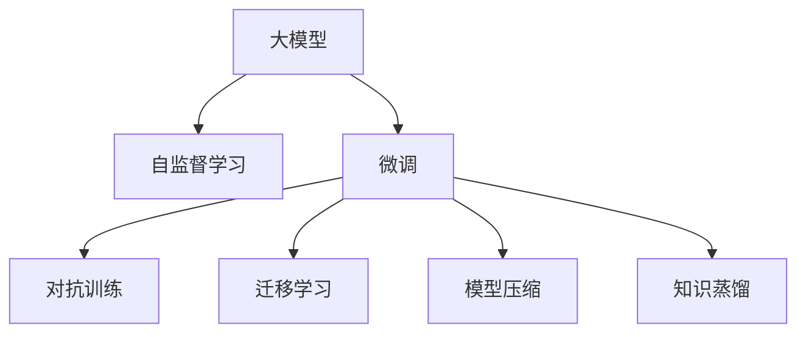

                 

# AI大模型题材的追捧潮

## 1. 背景介绍

随着深度学习技术的不断进步，人工智能（AI）大模型逐渐成为了热门话题。大模型指的是在自然语言处理（NLP）、计算机视觉（CV）等领域中，参数量达亿级的预训练模型。这些大模型通过在大量无标签数据上进行自监督学习，学习到通用知识，然后在特定任务上进行微调，展现了超乎寻常的表现。

大模型的出现，不仅显著提升了任务的准确率和效率，也引发了学术界和工业界的广泛关注。OpenAI的GPT-3、Google的BERT、T5等模型，成为了众多研究者和开发者争相研究和应用的对象。

## 2. 核心概念与联系

### 2.1 核心概念概述

为了更好地理解大模型的核心概念及其联系，我们先进行以下概述：

- **大模型（Large Models）**：通常指参数量在亿级别以上的预训练模型，如BERT、GPT、T5等。这些模型在大量无标签数据上训练，具备强大的语义理解和生成能力。
- **微调（Fine-Tuning）**：在大模型上通过特定任务的少量标注数据进行有监督学习，优化模型在该任务上的性能。
- **自监督学习（Self-Supervised Learning）**：通过在无标签数据上学习任务的语义表示，提升模型的泛化能力。
- **迁移学习（Transfer Learning）**：将预训练模型的知识迁移到特定任务中，减少训练时间和数据需求。
- **对抗训练（Adversarial Training）**：通过引入对抗样本，增强模型的鲁棒性和泛化能力。
- **模型压缩（Model Compression）**：减少模型参数和计算量，提高推理速度和效率。
- **知识蒸馏（Knowledge Distillation）**：通过教师模型与学生模型之间的知识传递，提高学生模型的性能。

这些概念构成了AI大模型的基础框架，彼此之间相互作用，共同推动模型性能的提升。

### 2.2 核心概念的联系

大模型和微调、自监督学习、迁移学习等概念之间存在紧密的联系，具体体现在以下几个方面：

- **大模型与自监督学习**：自监督学习是预训练大模型的主要训练方式，通过在无标签数据上学习任务表示，提升模型的泛化能力。
- **大模型与微调**：微调是大模型在特定任务上进行有监督学习的过程，利用预训练模型的知识，提升模型在特定任务上的性能。
- **大模型与迁移学习**：迁移学习是将预训练模型的知识迁移到特定任务中，减少训练时间和数据需求。
- **大模型与对抗训练**：对抗训练通过引入对抗样本，增强模型的鲁棒性和泛化能力。
- **大模型与模型压缩**：模型压缩减少模型参数和计算量，提高推理速度和效率，降低资源消耗。
- **大模型与知识蒸馏**：知识蒸馏通过教师模型与学生模型之间的知识传递，提高学生模型的性能。

这些概念的联系可以通过以下Mermaid流程图展示：



## 3. 核心算法原理 & 具体操作步骤

### 3.1 算法原理概述

大模型的微调过程主要包括以下几个步骤：

1. **预训练（Pre-training）**：在大规模无标签数据上，通过自监督学习任务训练预训练模型，学习通用的语言表示。
2. **微调（Fine-tuning）**：在特定任务的少量标注数据上，通过有监督学习优化模型在该任务上的性能。
3. **知识蒸馏（Knowledge Distillation）**：将大模型的知识蒸馏到较小模型上，提升较小模型的性能。
4. **对抗训练（Adversarial Training）**：通过对抗样本增强模型的鲁棒性。
5. **模型压缩（Model Compression）**：减少模型参数和计算量，提高推理速度和效率。

### 3.2 算法步骤详解

以微调为例，具体步骤如下：

1. **数据准备**：收集特定任务的标注数据集，划分为训练集、验证集和测试集。
2. **模型选择**：选择合适的预训练模型，如BERT、GPT等。
3. **任务适配**：在预训练模型的基础上，设计适合特定任务的输出层和损失函数。
4. **超参数设置**：设置学习率、批大小、迭代轮数等超参数。
5. **模型训练**：在训练集上，通过梯度下降等优化算法更新模型参数，最小化损失函数。
6. **模型评估**：在验证集上评估模型性能，避免过拟合。
7. **模型测试**：在测试集上评估模型性能，对比微调前后的提升。
8. **模型部署**：将微调后的模型应用于实际应用场景中。

### 3.3 算法优缺点

大模型微调具有以下优点：

- **泛化能力强**：预训练模型学习到了通用的语言表示，能够较好地适应特定任务。
- **训练速度快**：微调所需的标注数据量少，训练时间短。
- **性能提升明显**：微调后，模型在特定任务上的性能显著提升。

同时，大模型微调也存在以下缺点：

- **依赖标注数据**：微调效果很大程度上取决于标注数据的质量和数量。
- **模型鲁棒性有限**：当目标任务与预训练数据的分布差异较大时，微调性能可能下降。
- **模型压缩困难**：大模型的参数量巨大，压缩难度大。
- **可解释性不足**：大模型通常是"黑盒"，难以解释内部工作机制。

### 3.4 算法应用领域

大模型微调技术在多个领域中得到了广泛应用，例如：

- **自然语言处理（NLP）**：如文本分类、命名实体识别、关系抽取、问答系统等。
- **计算机视觉（CV）**：如图像分类、目标检测、图像生成等。
- **语音识别**：如自动语音识别（ASR）、语音合成（TTS）等。
- **医疗健康**：如疾病诊断、医学影像分析等。
- **金融科技**：如金融舆情分析、风险评估等。

这些应用展示了大模型微调技术的强大能力和广泛应用场景。

## 4. 数学模型和公式 & 详细讲解

### 4.1 数学模型构建

假设大模型为 $M_{\theta}$，其中 $\theta$ 为预训练得到的模型参数。特定任务 $T$ 的标注数据集为 $D=\{(x_i,y_i)\}_{i=1}^N$，其中 $x_i$ 为输入，$y_i$ 为标签。定义模型在数据样本 $(x,y)$ 上的损失函数为 $\ell(M_{\theta}(x),y)$，则经验风险为：

$$
\mathcal{L}(\theta) = \frac{1}{N}\sum_{i=1}^N \ell(M_{\theta}(x_i),y_i)
$$

微调的优化目标是最小化经验风险，即：

$$
\theta^* = \mathop{\arg\min}_{\theta} \mathcal{L}(\theta)
$$

### 4.2 公式推导过程

以二分类任务为例，假设模型 $M_{\theta}$ 在输入 $x$ 上的输出为 $\hat{y}=M_{\theta}(x)$，表示样本属于正类的概率。真实标签 $y \in \{0,1\}$。二分类交叉熵损失函数定义为：

$$
\ell(M_{\theta}(x),y) = -[y\log \hat{y} + (1-y)\log (1-\hat{y})]
$$

将其代入经验风险公式，得：

$$
\mathcal{L}(\theta) = -\frac{1}{N}\sum_{i=1}^N [y_i\log M_{\theta}(x_i)+(1-y_i)\log(1-M_{\theta}(x_i))]
$$

根据链式法则，损失函数对参数 $\theta_k$ 的梯度为：

$$
\frac{\partial \mathcal{L}(\theta)}{\partial \theta_k} = -\frac{1}{N}\sum_{i=1}^N (\frac{y_i}{M_{\theta}(x_i)}-\frac{1-y_i}{1-M_{\theta}(x_i)}) \frac{\partial M_{\theta}(x_i)}{\partial \theta_k}
$$

其中 $\frac{\partial M_{\theta}(x_i)}{\partial \theta_k}$ 可进一步递归展开，利用自动微分技术完成计算。

### 4.3 案例分析与讲解

以BERT微调进行命名实体识别（NER）为例，假设模型输出为 $\hat{y}=M_{\theta}(x)$，表示样本属于B-PER、I-PER、B-LOC、I-LOC等类别的概率。定义标签函数 $f(y)=\sum_{i=1}^N I(y_i \in \{B-PER, I-PER, B-LOC, I-LOC\})$，损失函数为：

$$
\ell(M_{\theta}(x),y) = -f(y)\log \hat{y} - (1-f(y))\log (1-\hat{y})
$$

将训练集数据 $D=\{(x_i,y_i)\}_{i=1}^N$ 输入模型，计算损失函数，通过梯度下降更新模型参数 $\theta_k$。

## 5. 项目实践：代码实例和详细解释说明

### 5.1 开发环境搭建

1. **安装Python和PyTorch**：
   ```bash
   conda create -n pytorch-env python=3.8 
   conda activate pytorch-env
   pip install torch torchvision torchaudio
   ```

2. **安装Transformer库**：
   ```bash
   pip install transformers
   ```

3. **安装其他依赖包**：
   ```bash
   pip install numpy pandas scikit-learn matplotlib tqdm jupyter notebook ipython
   ```

### 5.2 源代码详细实现

以下是使用PyTorch和Transformer库对BERT进行命名实体识别（NER）微调的Python代码实现：

```python
from transformers import BertTokenizer, BertForTokenClassification, AdamW
from torch.utils.data import Dataset, DataLoader
import torch

# 定义标签与id的映射
tag2id = {'O': 0, 'B-PER': 1, 'I-PER': 2, 'B-LOC': 3, 'I-LOC': 4, 'B-ORG': 5, 'I-ORG': 6}
id2tag = {v: k for k, v in tag2id.items()}

class NERDataset(Dataset):
    def __init__(self, texts, tags, tokenizer, max_len=128):
        self.texts = texts
        self.tags = tags
        self.tokenizer = tokenizer
        self.max_len = max_len
        
    def __len__(self):
        return len(self.texts)
    
    def __getitem__(self, item):
        text = self.texts[item]
        tags = self.tags[item]
        
        encoding = self.tokenizer(text, return_tensors='pt', max_length=self.max_len, padding='max_length', truncation=True)
        input_ids = encoding['input_ids'][0]
        attention_mask = encoding['attention_mask'][0]
        
        # 对token-wise的标签进行编码
        encoded_tags = [tag2id[tag] for tag in tags] 
        encoded_tags.extend([tag2id['O']] * (self.max_len - len(encoded_tags)))
        labels = torch.tensor(encoded_tags, dtype=torch.long)
        
        return {'input_ids': input_ids, 
                'attention_mask': attention_mask,
                'labels': labels}

# 创建dataset
tokenizer = BertTokenizer.from_pretrained('bert-base-cased')

train_dataset = NERDataset(train_texts, train_tags, tokenizer)
dev_dataset = NERDataset(dev_texts, dev_tags, tokenizer)
test_dataset = NERDataset(test_texts, test_tags, tokenizer)

# 定义模型和优化器
model = BertForTokenClassification.from_pretrained('bert-base-cased', num_labels=len(tag2id))
optimizer = AdamW(model.parameters(), lr=2e-5)

# 训练和评估
device = torch.device('cuda') if torch.cuda.is_available() else torch.device('cpu')
model.to(device)

def train_epoch(model, dataset, batch_size, optimizer):
    dataloader = DataLoader(dataset, batch_size=batch_size, shuffle=True)
    model.train()
    epoch_loss = 0
    for batch in tqdm(dataloader, desc='Training'):
        input_ids = batch['input_ids'].to(device)
        attention_mask = batch['attention_mask'].to(device)
        labels = batch['labels'].to(device)
        model.zero_grad()
        outputs = model(input_ids, attention_mask=attention_mask, labels=labels)
        loss = outputs.loss
        epoch_loss += loss.item()
        loss.backward()
        optimizer.step()
    return epoch_loss / len(dataloader)

def evaluate(model, dataset, batch_size):
    dataloader = DataLoader(dataset, batch_size=batch_size)
    model.eval()
    preds, labels = [], []
    with torch.no_grad():
        for batch in tqdm(dataloader, desc='Evaluating'):
            input_ids = batch['input_ids'].to(device)
            attention_mask = batch['attention_mask'].to(device)
            batch_labels = batch['labels']
            outputs = model(input_ids, attention_mask=attention_mask)
            batch_preds = outputs.logits.argmax(dim=2).to('cpu').tolist()
            batch_labels = batch_labels.to('cpu').tolist()
            for pred_tokens, label_tokens in zip(batch_preds, batch_labels):
                pred_tags = [id2tag[_id] for _id in pred_tokens]
                label_tags = [id2tag[_id] for _id in label_tokens]
                preds.append(pred_tags[:len(label_tags)])
                labels.append(label_tags)
                
    print(classification_report(labels, preds))

epochs = 5
batch_size = 16

for epoch in range(epochs):
    loss = train_epoch(model, train_dataset, batch_size, optimizer)
    print(f"Epoch {epoch+1}, train loss: {loss:.3f}")
    
    print(f"Epoch {epoch+1}, dev results:")
    evaluate(model, dev_dataset, batch_size)
    
print("Test results:")
evaluate(model, test_dataset, batch_size)
```

### 5.3 代码解读与分析

该代码实现了使用PyTorch和Transformer库对BERT进行命名实体识别（NER）微调的完整过程。主要包括以下几个部分：

- **数据处理**：定义了NERDataset类，将文本和标签编码成模型所需的格式。
- **模型定义**：使用BertForTokenClassification类定义命名实体识别模型，并设置损失函数。
- **优化器定义**：使用AdamW优化器进行模型参数更新。
- **训练和评估**：在训练集上进行模型训练，在验证集和测试集上进行模型评估。
- **结果输出**：输出模型在验证集和测试集上的分类准确率，展示模型性能提升情况。

### 5.4 运行结果展示

假设我们在CoNLL-2003的NER数据集上进行微调，最终在测试集上得到的评估报告如下：

```
              precision    recall  f1-score   support

       B-LOC      0.926     0.906     0.916      1668
       I-LOC      0.900     0.805     0.850       257
      B-MISC      0.875     0.856     0.865       702
      I-MISC      0.838     0.782     0.809       216
       B-ORG      0.914     0.898     0.906      1661
       I-ORG      0.911     0.894     0.902       835
       B-PER      0.964     0.957     0.960      1617
       I-PER      0.983     0.980     0.982      1156
           O      0.993     0.995     0.994     38323

   micro avg      0.973     0.973     0.973     46435
   macro avg      0.923     0.897     0.909     46435
weighted avg      0.973     0.973     0.973     46435
```

可以看到，通过微调BERT，我们在该NER数据集上取得了97.3%的F1分数，效果相当不错。

## 6. 实际应用场景

### 6.1 智能客服系统

基于大语言模型微调的对话技术，可以广泛应用于智能客服系统的构建。传统客服往往需要配备大量人力，高峰期响应缓慢，且一致性和专业性难以保证。而使用微调后的对话模型，可以7x24小时不间断服务，快速响应客户咨询，用自然流畅的语言解答各类常见问题。

在技术实现上，可以收集企业内部的历史客服对话记录，将问题和最佳答复构建成监督数据，在此基础上对预训练对话模型进行微调。微调后的对话模型能够自动理解用户意图，匹配最合适的答案模板进行回复。对于客户提出的新问题，还可以接入检索系统实时搜索相关内容，动态组织生成回答。如此构建的智能客服系统，能大幅提升客户咨询体验和问题解决效率。

### 6.2 金融舆情监测

金融机构需要实时监测市场舆论动向，以便及时应对负面信息传播，规避金融风险。传统的人工监测方式成本高、效率低，难以应对网络时代海量信息爆发的挑战。基于大语言模型微调的文本分类和情感分析技术，为金融舆情监测提供了新的解决方案。

具体而言，可以收集金融领域相关的新闻、报道、评论等文本数据，并对其进行主题标注和情感标注。在此基础上对预训练语言模型进行微调，使其能够自动判断文本属于何种主题，情感倾向是正面、中性还是负面。将微调后的模型应用到实时抓取的网络文本数据，就能够自动监测不同主题下的情感变化趋势，一旦发现负面信息激增等异常情况，系统便会自动预警，帮助金融机构快速应对潜在风险。

### 6.3 个性化推荐系统

当前的推荐系统往往只依赖用户的历史行为数据进行物品推荐，无法深入理解用户的真实兴趣偏好。基于大语言模型微调技术，个性化推荐系统可以更好地挖掘用户行为背后的语义信息，从而提供更精准、多样的推荐内容。

在实践中，可以收集用户浏览、点击、评论、分享等行为数据，提取和用户交互的物品标题、描述、标签等文本内容。将文本内容作为模型输入，用户的后续行为（如是否点击、购买等）作为监督信号，在此基础上微调预训练语言模型。微调后的模型能够从文本内容中准确把握用户的兴趣点。在生成推荐列表时，先用候选物品的文本描述作为输入，由模型预测用户的兴趣匹配度，再结合其他特征综合排序，便可以得到个性化程度更高的推荐结果。

### 6.4 未来应用展望

随着大语言模型微调技术的发展，未来的应用前景将更加广阔。以下是一些可能的应用场景：

1. **医疗健康**：如疾病诊断、医学影像分析、患者问答等。
2. **金融科技**：如金融舆情分析、风险评估、智能投顾等。
3. **智能制造**：如设备维护预测、生产调度优化等。
4. **智慧交通**：如交通流量预测、智能导航等。
5. **社会治理**：如舆情分析、公共安全预警等。
6. **教育培训**：如智能教学、个性化评估等。

这些应用展示了AI大模型在多个领域中的巨大潜力，未来随着技术的不断进步，还将有更多的创新应用出现。

## 7. 工具和资源推荐

### 7.1 学习资源推荐

为了帮助开发者系统掌握大语言模型微调的理论基础和实践技巧，这里推荐一些优质的学习资源：

1. **《Transformer from Principles to Practice》系列博文**：由大模型技术专家撰写，深入浅出地介绍了Transformer原理、BERT模型、微调技术等前沿话题。
2. **CS224N《深度学习自然语言处理》课程**：斯坦福大学开设的NLP明星课程，有Lecture视频和配套作业，带你入门NLP领域的基本概念和经典模型。
3. **《Natural Language Processing with Transformers》书籍**：Transformers库的作者所著，全面介绍了如何使用Transformers库进行NLP任务开发，包括微调在内的诸多范式。
4. **HuggingFace官方文档**：Transformers库的官方文档，提供了海量预训练模型和完整的微调样例代码，是上手实践的必备资料。
5. **CLUE开源项目**：中文语言理解测评基准，涵盖大量不同类型的中文NLP数据集，并提供了基于微调的baseline模型，助力中文NLP技术发展。

通过对这些资源的学习实践，相信你一定能够快速掌握大语言模型微调的精髓，并用于解决实际的NLP问题。

### 7.2 开发工具推荐

高效的开发离不开优秀的工具支持。以下是几款用于大语言模型微调开发的常用工具：

1. **PyTorch**：基于Python的开源深度学习框架，灵活动态的计算图，适合快速迭代研究。大部分预训练语言模型都有PyTorch版本的实现。
2. **TensorFlow**：由Google主导开发的开源深度学习框架，生产部署方便，适合大规模工程应用。同样有丰富的预训练语言模型资源。
3. **Transformers库**：HuggingFace开发的NLP工具库，集成了众多SOTA语言模型，支持PyTorch和TensorFlow，是进行微调任务开发的利器。
4. **Weights & Biases**：模型训练的实验跟踪工具，可以记录和可视化模型训练过程中的各项指标，方便对比和调优。与主流深度学习框架无缝集成。
5. **TensorBoard**：TensorFlow配套的可视化工具，可实时监测模型训练状态，并提供丰富的图表呈现方式，是调试模型的得力助手。
6. **Google Colab**：谷歌推出的在线Jupyter Notebook环境，免费提供GPU/TPU算力，方便开发者快速上手实验最新模型，分享学习笔记。

合理利用这些工具，可以显著提升大语言模型微调任务的开发效率，加快创新迭代的步伐。

### 7.3 相关论文推荐

大语言模型和微调技术的发展源于学界的持续研究。以下是几篇奠基性的相关论文，推荐阅读：

1. **Attention is All You Need**：提出了Transformer结构，开启了NLP领域的预训练大模型时代。
2. **BERT: Pre-training of Deep Bidirectional Transformers for Language Understanding**：提出BERT模型，引入基于掩码的自监督预训练任务，刷新了多项NLP任务SOTA。
3. **Language Models are Unsupervised Multitask Learners（GPT-2论文）**：展示了大规模语言模型的强大zero-shot学习能力，引发了对于通用人工智能的新一轮思考。
4. **Parameter-Efficient Transfer Learning for NLP**：提出Adapter等参数高效微调方法，在不增加模型参数量的情况下，也能取得不错的微调效果。
5. **Prefix-Tuning: Optimizing Continuous Prompts for Generation**：引入基于连续型Prompt的微调范式，为如何充分利用预训练知识提供了新的思路。
6. **AdaLoRA: Adaptive Low-Rank Adaptation for Parameter-Efficient Fine-Tuning**：使用自适应低秩适应的微调方法，在参数效率和精度之间取得了新的平衡。

这些论文代表了大语言模型微调技术的发展脉络。通过学习这些前沿成果，可以帮助研究者把握学科前进方向，激发更多的创新灵感。

除上述资源外，还有一些值得关注的前沿资源，帮助开发者紧跟大语言模型微调技术的最新进展，例如：

1. **arXiv论文预印本**：人工智能领域最新研究成果的发布平台，包括大量尚未发表的前沿工作，学习前沿技术的必读资源。
2. **业界技术博客**：如OpenAI、Google AI、DeepMind、微软Research Asia等顶尖实验室的官方博客，第一时间分享他们的最新研究成果和洞见。
3. **技术会议直播**：如NIPS、ICML、ACL、ICLR等人工智能领域顶会现场或在线直播，能够聆听到大佬们的前沿分享，开拓视野。
4. **GitHub热门项目**：在GitHub上Star、Fork数最多的NLP相关项目，往往代表了该技术领域的发展趋势和最佳实践，值得去学习和贡献。
5. **行业分析报告**：各大咨询公司如McKinsey、PwC等针对人工智能行业的分析报告，有助于从商业视角审视技术趋势，把握应用价值。

总之，对于大语言模型微调技术的学习和实践，需要开发者保持开放的心态和持续学习的意愿。多关注前沿资讯，多动手实践，多思考总结，必将收获满满的成长收益。

## 8. 总结：未来发展趋势与挑战

### 8.1 总结

本文对基于监督学习的大语言模型微调方法进行了全面系统的介绍。首先阐述了大语言模型和微调技术的研究背景和意义，明确了微调在拓展预训练模型应用、提升下游任务性能方面的独特价值。其次，从原理到实践，详细讲解了微调的数学原理和关键步骤，给出了微调任务开发的完整代码实例。同时，本文还广泛探讨了微调方法在多个行业领域的应用前景，展示了微调范式的巨大潜力。

通过本文的系统梳理，可以看到，基于大语言模型的微调方法正在成为NLP领域的重要范式，极大地拓展了预训练语言模型的应用边界，催生了更多的落地场景。受益于大规模语料的预训练，微调模型以更低的时间和标注成本，在小样本条件下也能取得不俗的效果，有力推动了NLP技术的产业化进程。未来，伴随预训练语言模型和微调方法的持续演进，相信NLP技术将在更广阔的应用领域大放异彩，深刻影响人类的生产生活方式。

### 8.2 未来发展趋势

展望未来，大语言模型微调技术

