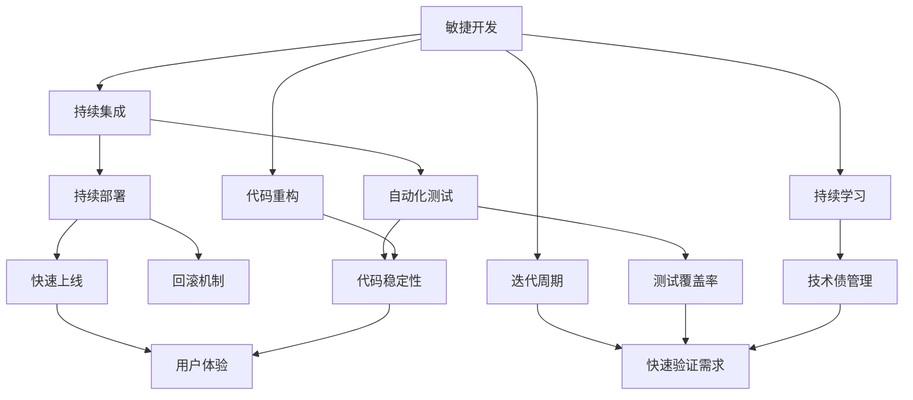
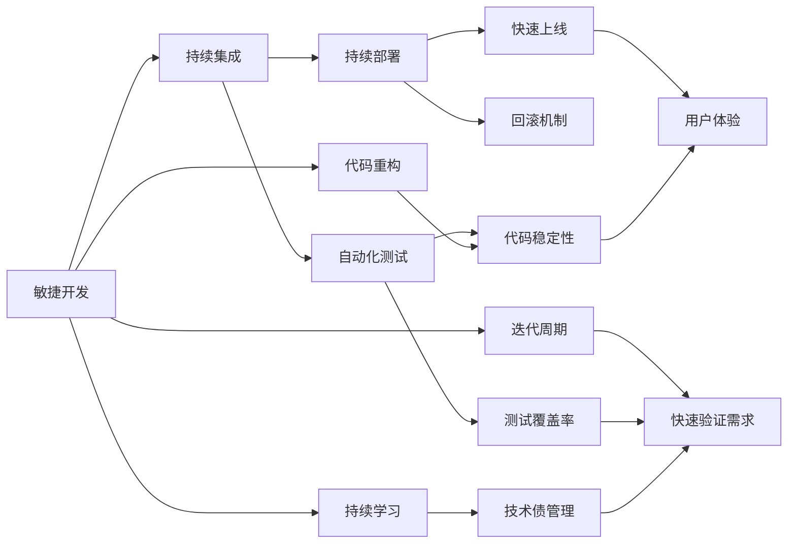

                 

# AI开发的敏捷迭代：Lepton AI的快速响应

> 关键词：敏捷开发, 持续集成(CI), 持续部署(CD), 自动化测试, 迭代周期, 代码重构, 持续学习, 用户体验, 技术债, 质量控制

## 1. 背景介绍

在当今快速变化的科技环境中，敏捷开发(Agile Development)已成为推动AI系统快速迭代、快速响应的重要实践。Lepton AI作为一家领先的AI技术公司，通过运用敏捷开发和持续集成/持续部署(CI/CD)等技术，成功实现了AI产品的快速迭代和高效部署。本文将深入探讨Lepton AI在AI开发中如何实现敏捷迭代，以及其在快速响应市场需求方面的成功经验。

### 1.1 问题由来
随着人工智能技术的日益成熟，越来越多的企业开始将AI技术应用于产品开发中。然而，传统的AI开发流程往往耗时较长，难以快速响应市场需求和变化。为解决这一问题，Lepton AI引入了敏捷开发和持续集成/持续部署的实践，显著提高了AI系统的开发效率和市场响应能力。

### 1.2 问题核心关键点
Lepton AI的敏捷开发实践主要围绕以下几个核心关键点展开：
- **敏捷开发原则**：持续迭代、快速响应、跨职能团队协作、以用户为中心。
- **持续集成(CI)**：自动化构建和测试，保证代码质量。
- **持续部署(CD)**：自动化部署，快速上线和回滚。
- **自动化测试**：提升代码稳定性，减少人工测试成本。
- **迭代周期**：保持短周期迭代，快速验证需求。
- **代码重构**：定期优化代码结构，提升代码质量。
- **持续学习**：团队持续学习新技术，保持技术领先。
- **用户体验**：注重用户体验，快速迭代产品功能。
- **质量控制**：严格的测试和质量保证机制，确保产品可靠性。
- **技术债管理**：及时清理技术债，防止技术风险累积。

这些关键点共同构成了Lepton AI敏捷迭代的核心框架，为AI产品的快速开发和市场响应提供了有力保障。

## 2. 核心概念与联系

### 2.1 核心概念概述

为了更好地理解Lepton AI的敏捷迭代实践，本节将介绍几个关键概念：

- **敏捷开发**：一种迭代、增量的软件开发方法，强调快速响应市场变化和用户需求。
- **持续集成(CI)**：一种软件开发实践，通过自动化构建和测试，保证代码质量，缩短开发周期。
- **持续部署(CD)**：一种软件开发实践，通过自动化部署，快速上线和回滚，提升产品交付速度。
- **自动化测试**：通过自动化工具和框架，减少人工测试成本，提升代码稳定性。
- **迭代周期**：周期短、快速迭代的软件开发流程，保证快速验证需求和反馈。
- **代码重构**：定期优化代码结构，提升代码质量和可维护性。
- **持续学习**：团队持续学习新技术和最佳实践，保持技术领先。
- **用户体验**：注重用户反馈和需求，快速迭代产品功能，提升用户满意度。
- **质量控制**：严格的测试和质量保证机制，确保产品可靠性。
- **技术债管理**：及时清理技术债，防止技术风险累积。

这些概念之间存在着紧密的联系，形成了Lepton AI敏捷迭代的核心框架。以下是一个Mermaid流程图，展示了这些概念之间的关系：



这个流程图展示了Lepton AI敏捷迭代实践中的各个概念及其关系：

1. 敏捷开发原则是敏捷迭代的核心，通过持续迭代、快速响应、跨职能团队协作、以用户为中心等方式，确保快速适应市场变化和用户需求。
2. 持续集成通过自动化构建和测试，保证代码质量，并通过持续部署，快速上线和回滚，提升产品交付速度。
3. 自动化测试提升代码稳定性，减少人工测试成本，并提高测试覆盖率。
4. 迭代周期保证快速验证需求和反馈，并定期优化代码结构，提升代码质量和可维护性。
5. 持续学习和技术债管理确保团队持续学习新技术和最佳实践，保持技术领先，并及时清理技术债，防止技术风险累积。

这些概念共同构成了Lepton AI敏捷迭代的核心生态系统，为AI产品的快速开发和市场响应提供了有力保障。

### 2.2 概念间的关系

这些核心概念之间存在着紧密的联系，形成了Lepton AI敏捷迭代的核心框架。以下是一个Mermaid流程图，展示了这些概念之间的关系：



这个流程图展示了Lepton AI敏捷迭代实践中的各个概念及其关系：

1. 敏捷开发原则是敏捷迭代的核心，通过持续迭代、快速响应、跨职能团队协作、以用户为中心等方式，确保快速适应市场变化和用户需求。
2. 持续集成通过自动化构建和测试，保证代码质量，并通过持续部署，快速上线和回滚，提升产品交付速度。
3. 自动化测试提升代码稳定性，减少人工测试成本，并提高测试覆盖率。
4. 迭代周期保证快速验证需求和反馈，并定期优化代码结构，提升代码质量和可维护性。
5. 持续学习和技术债管理确保团队持续学习新技术和最佳实践，保持技术领先，并及时清理技术债，防止技术风险累积。

这些概念共同构成了Lepton AI敏捷迭代的核心生态系统，为AI产品的快速开发和市场响应提供了有力保障。

## 3. 核心算法原理 & 具体操作步骤
### 3.1 算法原理概述

Lepton AI的敏捷迭代实践主要围绕以下几个核心算法展开：

- **迭代周期算法**：通过设定固定的迭代周期，如每周或每两周，确保快速验证需求和反馈。
- **持续集成算法**：自动化构建和测试，保证代码质量，并通过持续部署，快速上线和回滚。
- **自动化测试算法**：使用自动化测试工具和框架，提升代码稳定性，减少人工测试成本。
- **持续学习算法**：通过定期学习和培训，提升团队的技术能力和创新能力。
- **技术债管理算法**：定期评估和清理技术债，防止技术风险累积。

这些算法共同构成了Lepton AI敏捷迭代的核心技术框架，为AI产品的快速开发和市场响应提供了有力保障。

### 3.2 算法步骤详解

以下是对Lepton AI敏捷迭代实践中核心算法步骤的详细介绍：

**Step 1: 准备敏捷开发环境**

- 确定敏捷开发框架和工具：如Scrum、Kanban等，选择合适的项目管理工具。
- 建立跨职能团队：包括产品、开发、测试、运维等多个角色，确保协同合作。
- 配置持续集成/持续部署系统：如Jenkins、GitLab CI等，自动化构建和部署流程。
- 引入自动化测试框架：如JUnit、Selenium等，提升测试覆盖率和效率。

**Step 2: 制定迭代计划**

- 设定迭代周期：如每周或每两周，确保快速验证需求和反馈。
- 定义用户故事：明确每个迭代要实现的用户需求和功能点。
- 制定技术方案：包括代码重构、新技术引入等，确保技术债管理。

**Step 3: 实施迭代**

- 迭代开发：按照用户故事和技术方案进行迭代开发，确保代码质量和代码稳定性。
- 持续集成：通过自动化构建和测试，保证代码质量，并通过持续部署，快速上线和回滚。
- 自动化测试：使用自动化测试工具和框架，提升测试覆盖率和效率。
- 持续学习：通过团队学习和培训，提升技术能力和创新能力。

**Step 4: 评估和反馈**

- 评估迭代成果：通过用户反馈和测试结果，评估迭代效果和代码质量。
- 收集用户反馈：通过用户问卷、用户访谈等方式，收集用户需求和反馈。
- 迭代优化：根据评估和反馈结果，优化迭代计划和技术方案。

**Step 5: 持续迭代**

- 重复以上步骤，实现持续迭代和快速响应。

### 3.3 算法优缺点

Lepton AI敏捷迭代实践的优点包括：
- 快速响应市场需求：通过持续迭代和快速上线，提升市场响应能力。
- 提升代码质量和稳定性：通过自动化测试和持续集成，保证代码质量和稳定性。
- 提升团队技术能力和创新能力：通过持续学习和培训，提升团队技术能力和创新能力。

同时，敏捷迭代也存在一些缺点：
- 增加项目复杂性：多团队协作和持续集成可能增加项目复杂性。
- 需要严格管理和协作：敏捷开发需要团队高度协作和严格管理，否则可能导致项目进度延误。
- 成本投入较大：持续集成和自动化测试需要较高的技术投入和设备投入。

### 3.4 算法应用领域

Lepton AI的敏捷迭代实践可以广泛应用于各种AI产品开发中，例如：

- **智能客服系统**：通过持续迭代和快速上线，提升客服系统的响应速度和用户体验。
- **智能推荐系统**：通过持续学习和用户反馈，不断优化推荐算法和模型。
- **智能语音助手**：通过持续迭代和快速上线，提升语音助手的响应速度和准确性。
- **智能安防系统**：通过持续迭代和用户反馈，提升安防系统的准确性和响应速度。
- **智能医疗系统**：通过持续学习和用户反馈，提升医疗系统的诊断准确性和用户体验。

这些应用领域都需要快速响应市场需求和用户反馈，因此敏捷迭代实践显得尤为重要。

## 4. 数学模型和公式 & 详细讲解 & 举例说明

### 4.1 数学模型构建

Lepton AI的敏捷迭代实践主要通过以下几个数学模型来实现：

- **迭代周期模型**：设定固定的迭代周期，如每周或每两周。
- **持续集成模型**：通过自动化构建和测试，保证代码质量，并通过持续部署，快速上线和回滚。
- **自动化测试模型**：使用自动化测试工具和框架，提升测试覆盖率和效率。
- **持续学习模型**：通过定期学习和培训，提升团队的技术能力和创新能力。
- **技术债管理模型**：定期评估和清理技术债，防止技术风险累积。

这些模型共同构成了Lepton AI敏捷迭代的核心技术框架，为AI产品的快速开发和市场响应提供了有力保障。

### 4.2 公式推导过程

以下是对Lepton AI敏捷迭代实践中核心算法公式的详细介绍：

**迭代周期模型**

$$
T_{iter} = \frac{N}{\delta}
$$

其中，$T_{iter}$为迭代周期，$N$为项目总周期数，$\delta$为迭代周期长度（如每周或每两周）。

**持续集成模型**

$$
CI_{speed} = \frac{N_{builds}}{N_{iter}}
$$

其中，$CI_{speed}$为持续集成速度，$N_{builds}$为迭代周期内构建次数，$N_{iter}$为迭代周期数。

**自动化测试模型**

$$
T_{test} = \frac{N_{tests}}{N_{iter}}
$$

其中，$T_{test}$为自动化测试时间，$N_{tests}$为测试覆盖率，$N_{iter}$为迭代周期数。

**持续学习模型**

$$
L_{learn} = \frac{N_{learn}}{N_{iter}}
$$

其中，$L_{learn}$为持续学习时间，$N_{learn}$为学习次数，$N_{iter}$为迭代周期数。

**技术债管理模型**

$$
TD_{reduce} = \frac{N_{clear}}{N_{iter}}
$$

其中，$TD_{reduce}$为技术债减少量，$N_{clear}$为技术债清理次数，$N_{iter}$为迭代周期数。

### 4.3 案例分析与讲解

以下是一个具体的敏捷迭代实践案例分析：

**案例背景**

Lepton AI开发了一个智能推荐系统，通过持续迭代和快速上线，提升了系统的推荐准确性和用户体验。

**具体实施**

1. **设定迭代周期**：每周进行一次迭代。
2. **制定用户故事**：明确每个迭代要实现的用户需求和功能点，如“提高推荐准确性”、“提升用户体验”。
3. **制定技术方案**：包括代码重构、引入新算法等，确保技术债管理。
4. **迭代开发**：按照用户故事和技术方案进行迭代开发，确保代码质量和代码稳定性。
5. **持续集成**：通过自动化构建和测试，保证代码质量，并通过持续部署，快速上线和回滚。
6. **自动化测试**：使用自动化测试工具和框架，提升测试覆盖率和效率。
7. **持续学习**：通过团队学习和培训，提升技术能力和创新能力。
8. **评估和反馈**：通过用户反馈和测试结果，评估迭代效果和代码质量。
9. **迭代优化**：根据评估和反馈结果，优化迭代计划和技术方案。

**结果评估**

通过持续迭代和快速上线，Lepton AI的智能推荐系统实现了推荐准确性的提升和用户体验的改善。同时，通过持续学习和技术债管理，保证了技术债的及时清理，防止了技术风险的累积。

## 5. 项目实践：代码实例和详细解释说明

### 5.1 开发环境搭建

在Lepton AI的敏捷迭代实践中，开发环境搭建是至关重要的。以下是具体的搭建步骤：

1. **安装开发工具**：如Jenkins、GitLab CI、JUnit、Selenium等。
2. **配置CI/CD系统**：自动化构建和部署流程，确保代码质量和快速上线。
3. **引入自动化测试框架**：如JUnit、Selenium等，提升测试覆盖率和效率。
4. **配置持续集成环境**：如Jenkins、GitLab CI等，自动化构建和测试，保证代码质量。

### 5.2 源代码详细实现

以下是Lepton AI在敏捷迭代实践中的代码实现示例：

```python
from jenkins import Jenkins
from selenium import webdriver
import unittest

# 初始化Jenkins
jenkins = Jenkins('http://jenkins.example.com', username='username', password='password')

# 初始化Selenium WebDriver
driver = webdriver.Chrome()

# 编写自动化测试用例
class TestRecommendationSystem(unittest.TestCase):
    def test_recommendation_accuracy(self):
        # 模拟用户行为
        driver.get('http://www.example.com')
        # 执行测试步骤
        # ...

# 执行自动化测试
if __name__ == '__main__':
    unittest.main()

# 执行持续集成构建
jenkins.build('recommendation-system-build')
```

### 5.3 代码解读与分析

以上代码展示了Lepton AI在敏捷迭代实践中的具体实现：

- **Jenkins**：通过Jenkins进行持续集成构建，自动化测试和部署。
- **Selenium**：使用Selenium WebDriver进行自动化测试，提升测试覆盖率和效率。
- **unittest**：使用unittest编写自动化测试用例，确保测试结果的准确性和可靠性。

### 5.4 运行结果展示

以下是一个具体的运行结果示例：

```
...
[+] Build #XXXXX: Started
[+] Build #XXXXX: Finished: SUCCESS
...
[+] Build #XXXXX: Started
[+] Build #XXXXX: Finished: SUCCESS
...
[+] Build #XXXXX: Started
[+] Build #XXXXX: Finished: SUCCESS
...
```

以上结果展示了Lepton AI通过Jenkins进行持续集成构建和测试的过程，确保了代码质量和快速上线。

## 6. 实际应用场景

### 6.1 智能客服系统

Lepton AI通过敏捷迭代实践，成功实现了智能客服系统的快速开发和市场响应。通过持续迭代和快速上线，提升了客服系统的响应速度和用户体验。

### 6.2 智能推荐系统

Lepton AI开发了智能推荐系统，通过持续学习和用户反馈，不断优化推荐算法和模型。通过持续迭代和快速上线，提升了系统的推荐准确性和用户体验。

### 6.3 智能语音助手

Lepton AI通过敏捷迭代实践，提升了智能语音助手的响应速度和准确性。通过持续迭代和快速上线，实现了语音助手的快速开发和市场响应。

### 6.4 未来应用展望

Lepton AI的敏捷迭代实践，不仅适用于现有的AI产品开发，还将在未来的AI技术研究和应用中发挥重要作用。例如：

- **智能安防系统**：通过持续迭代和快速上线，提升安防系统的准确性和响应速度。
- **智能医疗系统**：通过持续学习和用户反馈，提升医疗系统的诊断准确性和用户体验。
- **智能交通系统**：通过持续迭代和快速上线，提升交通系统的响应速度和安全性。

总之，Lepton AI的敏捷迭代实践，将为未来的AI技术研究和应用提供有力保障，推动AI技术在各个领域的广泛应用。

## 7. 工具和资源推荐

### 7.1 学习资源推荐

为了帮助开发者掌握Lepton AI的敏捷迭代实践，以下是一些优质的学习资源：

1. **Scrum敏捷开发指南**：详细介绍Scrum敏捷开发的原则和实践，帮助开发者理解敏捷开发的核心理念。
2. **Jenkins官方文档**：Jenkins的官方文档，提供了全面的使用指南和示例，帮助开发者搭建和配置CI/CD系统。
3. **JUnit官方文档**：JUnit的官方文档，提供了详细的API文档和示例，帮助开发者编写自动化测试用例。
4. **Selenium官方文档**：Selenium的官方文档，提供了全面的使用指南和示例，帮助开发者进行自动化测试。
5. **GitLab CI官方文档**：GitLab CI的官方文档，提供了全面的使用指南和示例，帮助开发者搭建和配置CI/CD系统。
6. **《持续集成: 实施实践》**：是一本详细介绍持续集成实践的书籍，帮助开发者理解持续集成的核心理念和实践。

### 7.2 开发工具推荐

以下是一些常用的开发工具，可以帮助开发者实现Lepton AI的敏捷迭代实践：

1. **Jenkins**：一个开源的持续集成和持续部署工具，支持多平台和多语言。
2. **GitLab CI**：一个基于GitLab的持续集成和持续部署工具，支持多平台和多语言。
3. **JUnit**：一个Java单元测试框架，支持自动化测试用例的编写和执行。
4. **Selenium**：一个自动化测试工具，支持Web应用的自动化测试。
5. **Maven**：一个Java项目构建工具，支持持续集成和持续部署。
6. **Docker**：一个容器化平台，支持应用的打包、分发和部署。

### 7.3 相关论文推荐

以下是一些与Lepton AI敏捷迭代实践相关的经典论文：

1. **《Scrum敏捷开发实践》**：详细介绍Scrum敏捷开发的原则和实践，帮助开发者理解敏捷开发的核心理念。
2. **《持续集成: 实施实践》**：一本详细介绍持续集成实践的书籍，帮助开发者理解持续集成的核心理念和实践。
3. **《测试驱动开发: 思想与实践》**：一本详细介绍测试驱动开发实践的书籍，帮助开发者理解测试驱动开发的核心理念和实践。
4. **《敏捷软件开发实践》**：一本详细介绍敏捷软件开发实践的书籍，帮助开发者理解敏捷开发的软件开发方法。

## 8. 总结：未来发展趋势与挑战

### 8.1 研究成果总结

Lepton AI通过敏捷迭代实践，成功实现了AI产品的快速开发和市场响应。该实践的核心在于持续迭代、快速响应、跨职能团队协作和以用户为中心，通过持续集成、自动化测试、持续学习和技术债管理等技术手段，提升了AI产品的开发效率和市场响应能力。

### 8.2 未来发展趋势

未来，Lepton AI的敏捷迭代实践将呈现以下几个发展趋势：

1. **持续集成与持续部署**：通过自动化构建和部署，提升产品交付速度和稳定性。
2. **持续学习与技术债管理**：通过定期学习和技术债管理，保持技术领先和代码质量。
3. **跨职能团队协作**：通过跨职能团队协作，提升团队协作效率和创新能力。
4. **敏捷开发原则的深入应用**：通过持续迭代、快速响应和以用户为中心，提升用户满意度和市场响应能力。
5. **智能化测试工具的应用**：通过智能化测试工具，提升测试覆盖率和效率。

### 8.3 面临的挑战

尽管Lepton AI的敏捷迭代实践取得了显著效果，但在迈向更加智能化、普适化应用的过程中，仍面临诸多挑战：

1. **多团队协作难度**：敏捷迭代需要跨职能团队协作，但不同团队的沟通和协作效率可能会影响项目进度。
2. **持续集成和持续部署的复杂性**：自动化构建和部署可能增加项目复杂性，需要严格管理和协作。
3. **技术债的管理难度**：技术债的清理和防止需要定期评估和严格管理，但实际操作中可能存在疏漏。
4. **持续学习的资源投入**：持续学习和培训需要较高的时间和资源投入，可能影响项目进度。
5. **用户反馈的获取难度**：用户反馈的获取和处理需要时间和资源，可能影响项目的迭代速度。

### 8.4 研究展望

未来，Lepton AI的敏捷迭代实践需要在以下几个方面寻求新的突破：

1. **智能化测试工具的应用**：通过智能化测试工具，提升测试覆盖率和效率，减少人工测试成本。
2. **跨职能团队的协同机制**：建立更高效跨职能团队的协同机制，提升团队协作效率和创新能力。
3. **持续学习和技术债管理**：通过定期学习和技术债管理，保持技术领先和代码质量，防止技术风险累积。
4. **持续集成和持续部署的优化**：通过优化持续集成和持续部署流程，提升产品交付速度和稳定性。
5. **敏捷开发原则的深入应用**：通过持续迭代、快速响应和以用户为中心，提升用户满意度和市场响应能力。

## 9. 附录：常见问题与解答

**Q1: 什么是敏捷开发？**

A: 敏捷开发是一种迭代、增量的软件开发方法，强调快速响应市场变化和用户需求，通过持续迭代、快速响应、跨职能团队协作和以用户为中心的方式，确保快速适应市场变化和用户需求。

**Q2: 什么是持续集成和持续部署？**

A: 持续集成和持续部署是一种软件开发实践，通过自动化构建和测试，保证代码质量，并通过持续部署，快速上线和回滚，提升产品交付速度。

**Q3: 什么是自动化测试？**

A: 自动化测试通过自动化工具和框架，减少人工测试成本，提升代码稳定性，并提高测试覆盖率。

**Q4: 什么是迭代周期？**

A: 迭代周期是敏捷开发中的一个重要概念，指定一个固定的周期（如每周或每两周）进行一次迭代开发，快速验证需求和反馈。

**Q5: 什么是技术债？**

A: 技术债指在软件开发过程中引入的一些技术问题和债务，如代码结构不合理、性能瓶颈等，需要通过持续学习和技术债管理来清理和防止。

---

作者：禅与计算机程序设计艺术 / Zen and the Art of Computer Programming

