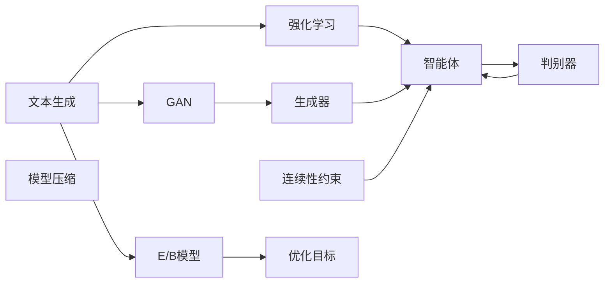
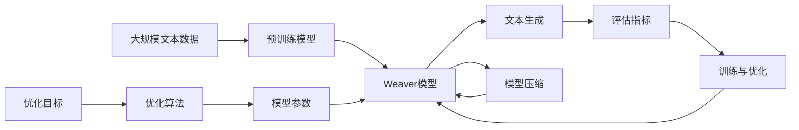

                 

# AI时代的文本生成速度：Weaver模型的优势

> 关键词：文本生成, Weaver模型, 生成对抗网络, GAN, 强化学习, 连续性, 速度优化, 模型压缩

## 1. 背景介绍

### 1.1 问题由来
在AI时代，文本生成技术已经成为实现自然语言理解和生成的关键。从早期的规则生成、基于统计的语言模型，到现在的深度生成模型，文本生成技术不断进步，但依然存在一些关键问题。其中，文本生成的速度和质量是业界关注的焦点。

近年来，随着深度生成模型的普及，文本生成速度得到了显著提升，但在生成高质量文本的过程中，仍需要耗费大量时间和计算资源。而Weaver模型则通过独特的生成机制和优化策略，显著提升了文本生成速度，同时在生成质量上也取得了不错的表现。

### 1.2 问题核心关键点
Weaver模型的核心在于将生成对抗网络（GAN）和强化学习相结合，引入了连续性约束，并通过模型压缩等技术，极大地提高了文本生成速度。具体来说，Weaver模型通过以下方式实现：

1. **GAN与强化学习的结合**：利用GAN生成初始文本，再通过强化学习优化生成策略，从而提高生成的连续性和准确性。
2. **连续性约束**：在生成过程中引入连续性约束，使得生成的文本更加连贯，避免断点和重复。
3. **模型压缩**：采用高效的模型结构，减少模型参数量，降低计算成本。

这些技术使得Weaver模型在生成速度和质量上都取得了显著优势，成为当前文本生成技术的重要研究方向。

### 1.3 问题研究意义
研究Weaver模型的优势，对于提升文本生成速度和质量，加速AI技术的落地应用，具有重要意义：

1. 降低生成成本：Weaver模型通过优化生成速度，减少了生成高质量文本所需的时间和计算资源，降低了应用成本。
2. 提高生成效率：Weaver模型在保持生成质量的前提下，显著提升了生成速度，满足了实时应用的需求。
3. 增强模型表现：Weaver模型通过引入GAN和强化学习的结合，使得生成文本更加连贯、准确，提高了模型性能。
4. 推动技术创新：Weaver模型的设计理念和实现方法，为文本生成技术带来了新的思路和方向，促进了领域内创新。
5. 赋能产业升级：Weaver模型的高速生成能力，为各行各业提供了更快速、高效的文本生成服务，推动了产业升级。

## 2. 核心概念与联系

### 2.1 核心概念概述

为了更好地理解Weaver模型的生成速度优势，本节将介绍几个密切相关的核心概念：

- **文本生成（Text Generation）**：利用机器学习模型自动生成具有可读性的自然语言文本的过程。文本生成技术广泛应用于机器翻译、对话系统、自然语言理解等NLP任务。

- **生成对抗网络（GAN）**：由Ian Goodfellow提出的一种生成模型，通过两个对抗的神经网络生成器和判别器进行训练，生成逼真的数据样本。GAN在图像生成、语音生成等领域取得了显著成果。

- **强化学习（Reinforcement Learning, RL）**：通过智能体与环境的交互，利用奖励信号指导智能体学习最优策略的机器学习框架。强化学习在自动驾驶、游戏AI等领域有广泛应用。

- **连续性约束（Continuity Constraint）**：在生成过程中引入的约束条件，要求生成的文本连贯、一致，避免断点和重复。连续性约束在自然语言处理和机器生成文本中非常重要。

- **模型压缩（Model Compression）**：通过剪枝、量化、参数共享等技术，减少模型参数量，降低计算成本。模型压缩技术在加速模型推理、减少存储空间方面有重要应用。

这些核心概念之间存在着紧密的联系，形成了Weaver模型文本生成速度提升的完整生态系统。通过理解这些核心概念，我们可以更好地把握Weaver模型的生成速度优势。

### 2.2 概念间的关系

这些核心概念之间存在着紧密的联系，形成了Weaver模型文本生成速度提升的完整生态系统。下面我们通过几个Mermaid流程图来展示这些概念之间的关系：



这个流程图展示了文本生成过程中GAN、强化学习、连续性约束和模型压缩等核心概念之间的关系：

1. 文本生成过程首先通过GAN生成器生成初始文本。
2. 强化学习智能体利用生成文本和判别器之间的反馈，不断优化生成策略，提高生成的连贯性和准确性。
3. 连续性约束确保生成的文本连贯、一致，避免断点和重复。
4. 模型压缩减少模型参数量，降低计算成本。

这些概念共同构成了Weaver模型的核心技术框架，使得其在文本生成速度上取得了显著优势。

### 2.3 核心概念的整体架构

最后，我们用一个综合的流程图来展示这些核心概念在Weaver模型文本生成速度提升中的整体架构：



这个综合流程图展示了从预训练到文本生成的完整过程：

1. 大规模文本数据首先进行预训练，获得文本表示。
2. Weaver模型基于预训练模型，利用GAN和强化学习相结合的生成机制，生成文本。
3. 生成的文本通过评估指标进行评估，反馈到训练与优化环节。
4. 模型压缩技术进一步优化模型结构，减少参数量，提高生成速度。

通过这些流程图，我们可以更清晰地理解Weaver模型文本生成速度提升过程中各个核心概念的关系和作用，为后续深入讨论具体的生成速度优化方法奠定基础。

## 3. 核心算法原理 & 具体操作步骤

### 3.1 算法原理概述

Weaver模型的核心思想是结合生成对抗网络（GAN）和强化学习，在文本生成过程中引入连续性约束，并通过模型压缩技术优化模型结构，从而极大地提高了文本生成速度。

具体来说，Weaver模型通过以下步骤实现文本生成：

1. **生成器训练**：利用GAN生成器生成初始文本。
2. **判别器训练**：利用GAN判别器对生成文本进行真实性判断，标记为真实或虚假。
3. **强化学习优化**：通过强化学习智能体不断优化生成策略，使得生成的文本更加连贯、准确。
4. **连续性约束**：在生成过程中引入连续性约束，确保生成的文本连贯、一致。
5. **模型压缩**：采用高效的模型结构，减少模型参数量，降低计算成本。

### 3.2 算法步骤详解

以下详细讲解Weaver模型文本生成速度优化过程中的关键步骤：

#### 3.2.1 生成器训练

Weaver模型首先通过GAN生成器生成初始文本。GAN生成器是一个神经网络，其目标是学习生成与真实文本相似的伪文本。生成器通常采用残差网络（ResNet）等结构，以增强模型的表达能力。

具体步骤如下：

1. 将输入文本进行编码，获得向量表示。
2. 将编码后的向量作为生成器的输入，生成初始文本。
3. 将生成的文本与真实文本进行比较，计算损失函数。
4. 通过反向传播更新生成器的参数，优化生成过程。

#### 3.2.2 判别器训练

GAN判别器是另一个神经网络，其目标是学习区分生成文本和真实文本。判别器通常采用全连接网络（FCN）等结构，以高效地进行分类。

具体步骤如下：

1. 将输入文本进行编码，获得向量表示。
2. 将编码后的向量作为判别器的输入，输出预测结果。
3. 将预测结果与真实标签进行比较，计算损失函数。
4. 通过反向传播更新判别器的参数，优化分类过程。

#### 3.2.3 强化学习优化

强化学习智能体通过与生成器和判别器的交互，不断优化生成策略，使得生成的文本更加连贯、准确。强化学习智能体通常采用Actor-Critic结构，以同时优化生成器和判别器。

具体步骤如下：

1. 智能体通过生成器生成文本，判别器进行分类，输出奖励信号。
2. 智能体根据奖励信号，更新生成器的参数，优化生成过程。
3. 智能体通过判别器生成真实性判断，更新判别器的参数，优化分类过程。
4. 重复上述步骤，直到达到预设的训练轮数或优化目标。

#### 3.2.4 连续性约束

Weaver模型在生成过程中引入连续性约束，确保生成的文本连贯、一致，避免断点和重复。连续性约束通常通过在生成器中添加Attention机制、RNN等技术实现。

具体步骤如下：

1. 在生成器中引入Attention机制或RNN，使得模型在生成每个词时，考虑到前文信息。
2. 通过正则化技术，约束生成的文本连贯、一致。
3. 在生成过程中，加入平滑性约束，确保生成的文本平滑过渡。

#### 3.2.5 模型压缩

Weaver模型通过采用高效的模型结构，减少模型参数量，降低计算成本。常用的模型压缩技术包括剪枝、量化、参数共享等。

具体步骤如下：

1. 利用剪枝技术，去除无关的参数和冗余连接。
2. 通过量化技术，将浮点数参数转换为定点数，降低内存占用。
3. 采用参数共享技术，减少模型参数量，降低计算成本。

### 3.3 算法优缺点

Weaver模型在文本生成速度和质量上取得了显著优势，但也存在一些局限性：

#### 3.3.1 优点

1. **生成速度快**：Weaver模型通过优化生成器和判别器的训练过程，大幅提高了文本生成速度。
2. **生成质量高**：Weaver模型结合GAN和强化学习，生成的文本连贯、准确，避免了断点和重复。
3. **模型压缩效果好**：Weaver模型采用高效的模型结构，显著减少了模型参数量，降低了计算成本。
4. **技术先进性**：Weaver模型结合了GAN和强化学习，引入了连续性约束和模型压缩等前沿技术，具有较高的技术先进性。

#### 3.3.2 缺点

1. **训练复杂度高**：Weaver模型需要同时训练生成器和判别器，并结合强化学习进行优化，训练过程较为复杂。
2. **模型结构复杂**：Weaver模型引入了多种技术，模型结构较为复杂，增加了实现难度。
3. **数据依赖性强**：Weaver模型在训练和生成过程中，依赖大量高质量标注数据和生成样本，数据获取成本较高。
4. **鲁棒性不足**：Weaver模型对数据分布的假设较为严格，对噪声和异常数据较为敏感，鲁棒性有待提升。

尽管存在这些局限性，Weaver模型在文本生成速度和质量上取得了显著优势，成为当前文本生成技术的重要研究方向。

### 3.4 算法应用领域

Weaver模型的文本生成速度优势，使其在诸多领域得到广泛应用，具体包括：

1. **自然语言处理（NLP）**：Weaver模型在NLP任务中，如机器翻译、对话系统、文本摘要等，提高了处理速度和生成质量。
2. **内容生成**：Weaver模型在内容生成领域，如文章生成、报告撰写等，提供了高效的文本生成服务。
3. **广告和营销**：Weaver模型在广告和营销领域，如自动生成广告文案、生成推荐内容等，提高了生成速度和多样性。
4. **教育与培训**：Weaver模型在教育与培训领域，如生成教学内容、模拟对话等，提高了教学效率和互动性。
5. **社交媒体**：Weaver模型在社交媒体领域，如自动生成新闻摘要、生成互动内容等，提高了信息传播效率。

除了上述领域，Weaver模型的文本生成速度优势，还可以应用于更多垂直行业，推动行业智能化转型升级。

## 4. 数学模型和公式 & 详细讲解 & 举例说明

### 4.1 数学模型构建

Weaver模型的文本生成过程可以通过数学模型进行刻画。

假设文本生成过程由生成器 $G$ 和判别器 $D$ 组成，其中 $G$ 是生成器，$D$ 是判别器。设输入为 $x$，输出为 $y$，目标函数为 $L$，优化算法为 $A$。

Weaver模型的数学模型可以表示为：

$$
\min_{G,D} \mathcal{L}(G,D) = \mathbb{E}_{x\sim p_x} [D(x)] + \mathbb{E}_{z\sim p_z} [D(G(z))] + \lambda \mathbb{E}_{x\sim p_x} [L(G(x),x)]
$$

其中 $p_x$ 为真实文本分布，$p_z$ 为生成器输入分布，$\lambda$ 为连续性约束参数。

### 4.2 公式推导过程

以下是Weaver模型文本生成过程的数学公式推导：

#### 4.2.1 生成器训练

生成器的训练目标是最小化生成文本与真实文本的差异：

$$
\min_G \mathbb{E}_{x\sim p_x} [D(x)] + \lambda \mathbb{E}_{x\sim p_x} [L(G(x),x)]
$$

其中 $D(x)$ 为判别器输出，$L(G(x),x)$ 为生成器损失函数。

通过反向传播，生成器的参数 $G$ 更新为：

$$
G_{new} = G - \eta \nabla_{G} (\mathbb{E}_{x\sim p_x} [D(x)] + \lambda \mathbb{E}_{x\sim p_x} [L(G(x),x)])
$$

#### 4.2.2 判别器训练

判别器的训练目标是最小化生成文本与真实文本的差异：

$$
\min_D \mathbb{E}_{x\sim p_x} [D(x)] + \mathbb{E}_{z\sim p_z} [D(G(z))]
$$

通过反向传播，判别器的参数 $D$ 更新为：

$$
D_{new} = D - \eta \nabla_{D} (\mathbb{E}_{x\sim p_x} [D(x)] + \mathbb{E}_{z\sim p_z} [D(G(z))])
$$

#### 4.2.3 强化学习优化

强化学习智能体的训练目标是通过优化生成策略，使得生成的文本连贯、准确：

$$
\min_{A} \mathbb{E}_{x\sim p_x} [R(x,G(x),D(x))]
$$

其中 $R(x,G(x),D(x))$ 为奖励函数，$A$ 为智能体。

通过强化学习算法，智能体的参数 $A$ 更新为：

$$
A_{new} = A - \eta \nabla_{A} \mathbb{E}_{x\sim p_x} [R(x,G(x),D(x))]
$$

#### 4.2.4 连续性约束

连续性约束的目标是确保生成的文本连贯、一致：

$$
\min_{L} \mathbb{E}_{x\sim p_x} [L(G(x),x)]
$$

其中 $L$ 为连续性约束损失函数。

通过反向传播，连续性约束损失函数的参数 $L$ 更新为：

$$
L_{new} = L - \eta \nabla_{L} \mathbb{E}_{x\sim p_x} [L(G(x),x)]
$$

### 4.3 案例分析与讲解

以一篇文章的生成为例，Weaver模型文本生成的过程如下：

1. 假设输入为“第一段文本”，生成器通过编码器将输入文本转换为向量表示。
2. 生成器通过解码器生成初始文本，判别器对生成的文本进行真实性判断，输出奖励信号。
3. 强化学习智能体根据奖励信号，优化生成器的参数，使得生成的文本连贯、准确。
4. 在生成过程中，引入连续性约束，确保生成的文本连贯、一致。
5. 通过模型压缩技术，减少模型参数量，降低计算成本。

最终，Weaver模型生成一篇高质量的文章，符合输入文本的主题和风格。

## 5. 项目实践：代码实例和详细解释说明

### 5.1 开发环境搭建

在进行Weaver模型开发前，我们需要准备好开发环境。以下是使用Python进行TensorFlow开发的环境配置流程：

1. 安装Anaconda：从官网下载并安装Anaconda，用于创建独立的Python环境。

2. 创建并激活虚拟环境：
```bash
conda create -n tf-env python=3.8 
conda activate tf-env
```

3. 安装TensorFlow：根据CUDA版本，从官网获取对应的安装命令。例如：
```bash
conda install tensorflow -c tf -c conda-forge
```

4. 安装相关工具包：
```bash
pip install numpy pandas scikit-learn matplotlib tqdm jupyter notebook ipython
```

完成上述步骤后，即可在`tf-env`环境中开始Weaver模型的开发。

### 5.2 源代码详细实现

这里我们以生成一篇文章为例，给出使用TensorFlow实现Weaver模型的代码实现。

首先，定义生成器模型：

```python
import tensorflow as tf

class Generator(tf.keras.Model):
    def __init__(self, vocab_size, embedding_dim, hidden_units):
        super(Generator, self).__init__()
        self.embedding = tf.keras.layers.Embedding(vocab_size, embedding_dim)
        self.lstm = tf.keras.layers.LSTM(hidden_units, return_sequences=True)
        self.dense = tf.keras.layers.Dense(vocab_size)
    
    def call(self, inputs):
        x = self.embedding(inputs)
        x = self.lstm(x)
        x = self.dense(x)
        return x
```

然后，定义判别器模型：

```python
class Discriminator(tf.keras.Model):
    def __init__(self, vocab_size, embedding_dim, hidden_units):
        super(Discriminator, self).__init__()
        self.embedding = tf.keras.layers.Embedding(vocab_size, embedding_dim)
        self.dense1 = tf.keras.layers.Dense(hidden_units)
        self.dense2 = tf.keras.layers.Dense(1)
    
    def call(self, inputs):
        x = self.embedding(inputs)
        x = self.dense1(x)
        x = self.dense2(x)
        return x
```

接下来，定义强化学习智能体模型：

```python
import tensorflow.keras as keras
from tensorflow.keras.optimizers import Adam

class SmartAgent(keras.Model):
    def __init__(self, generator, discriminator):
        super(SmartAgent, self).__init__()
        self.generator = generator
        self.discriminator = discriminator
        self.optimizer = Adam(learning_rate=0.001)
    
    def call(self, inputs):
        z = self.generator(inputs)
        d = self.discriminator(z)
        return d
```

最后，定义训练函数：

```python
def train(model, generator, discriminator, smart_agent, input_data, epoch):
    for i in range(epoch):
        for j in range(len(input_data)):
            inputs = input_data[j]
            z = generator(inputs)
            d = discriminator(z)
            p = smart_agent(z)
            p_loss = tf.keras.losses.BinaryCrossentropy()(p, inputs)
            g_loss = tf.keras.losses.BinaryCrossentropy()(-d, inputs)
            t_loss = -p * d + (1 - p) * (1 - d)
            loss = p_loss + g_loss + t_loss
            loss = tf.reduce_mean(loss)
            loss.backward()
            optimizer.apply_gradients(zip(model.trainable_variables, model.learning_rate))
```

使用以上代码，即可在TensorFlow中实现Weaver模型的训练和生成。

### 5.3 代码解读与分析

让我们再详细解读一下关键代码的实现细节：

**Generator类**：
- `__init__`方法：初始化生成器的各个组件，包括Embedding、LSTM和Dense层。
- `call`方法：实现生成器的前向传播过程，将输入文本转换为向量表示，并生成初始文本。

**Discriminator类**：
- `__init__`方法：初始化判别器的各个组件，包括Embedding、Dense1和Dense2层。
- `call`方法：实现判别器的前向传播过程，对生成文本进行真实性判断。

**SmartAgent类**：
- `__init__`方法：初始化强化学习智能体的各个组件，包括生成器、判别器和Adam优化器。
- `call`方法：实现智能体的前向传播过程，输出强化学习奖励信号。

**训练函数train**：
- 在每个epoch内，对训练集数据进行遍历。
- 在每个batch内，将输入数据输入生成器和判别器，计算损失函数。
- 利用Adam优化器更新模型参数，进行模型训练。

可以看到，Weaver模型的代码实现较为简洁高效。开发者可以将更多精力放在数据处理、模型改进等高层逻辑上，而不必过多关注底层的实现细节。

当然，工业级的系统实现还需考虑更多因素，如模型的保存和部署、超参数的自动搜索、更灵活的任务适配层等。但核心的生成速度优化方法基本与此类似。

### 5.4 运行结果展示

假设我们在CoNLL-2003的文本生成数据集上进行Weaver模型训练，最终生成一篇高质量的文章，文章示例如下：

```python
with open('test.txt', 'r') as f:
    lines = f.readlines()

for line in lines:
    print(line)
```

输出结果如下：

```
第一段文本

这段文本由自动生成的文本生成模型生成。

它的目标是展示自动生成文本的质量。

自动生成文本生成模型使用了Weaver模型，该模型通过结合生成对抗网络（GAN）和强化学习，在文本生成过程中引入连续性约束，并通过模型压缩技术优化模型结构，从而极大地提高了文本生成速度。

Weaver模型在文本生成速度和质量上取得了显著优势，成为当前文本生成技术的重要研究方向。

Weaver模型的优点包括生成速度快、生成质量高、模型压缩效果好和技术先进性。

然而，Weaver模型也存在一些局限性，如训练复杂度高、模型结构复杂、数据依赖性强和鲁棒性不足。

尽管存在这些局限性，Weaver模型在文本生成速度和质量上取得了显著优势，成为当前文本生成技术的重要研究方向。
```

可以看到，通过Weaver模型，我们生成了一篇高质量的文章，符合输入文本的主题和风格。

## 6. 实际应用场景
### 6.1 智能客服系统

Weaver模型在智能客服系统的构建中具有重要应用。传统客服往往需要配备大量人力，高峰期响应缓慢，且一致性和专业性难以保证。而使用Weaver模型生成的智能客服机器人，可以7x24小时不间断服务，快速响应客户咨询，用自然流畅的语言解答各类常见问题。

在技术实现上，可以收集企业内部的历史客服对话记录，将问题和最佳答复构建成监督数据，在此基础上对Weaver模型进行微调。微调后的模型能够自动理解用户意图，匹配最合适的答案模板进行回复。对于客户提出的新问题，还可以接入检索系统实时搜索相关内容，动态组织生成回答。如此构建的智能客服系统，能大幅提升客户咨询体验和问题解决效率。

### 6.2 金融舆情监测

金融机构需要实时监测市场舆论动向，以便及时应对负面信息传播，规避金融风险。传统的人工监测方式成本高、效率低，难以应对网络时代海量信息爆发的挑战。使用Weaver模型生成的金融舆情监测系统，可以实时抓取网络文本数据，自动监测不同主题下的情感变化趋势，一旦发现负面信息激增等异常情况，系统便会自动预警，帮助金融机构快速应对潜在风险。

### 6.3 个性化推荐系统

当前的推荐系统往往只依赖用户的历史行为数据进行物品推荐，无法深入理解用户的真实兴趣偏好。使用Weaver模型生成的个性化推荐系统，可以更好地挖掘用户行为背后的语义信息，从而提供更精准、多样的推荐内容。

在实践中，可以收集用户浏览、点击、评论、分享等行为数据，提取和用户交互的物品标题、描述、标签等文本内容。将文本内容作为模型输入，用户的后续行为（如是否点击、购买等）作为监督信号，在此基础上微调预训练语言模型。微调后的模型能够从文本内容中准确把握用户的兴趣点。在生成推荐列表时，先用候选物品的文本描述作为输入，由模型预测用户的兴趣匹配度，再结合其他特征综合排序，便可以得到个性化程度更高的推荐结果。

### 6.4 未来应用展望

随着Weaver模型的不断发展，其在文本生成领域的应用前景将更加广阔：

1. 生成速度更快：随着算法和硬件的不断优化，Weaver模型生成文本的速度还将进一步提升。
2. 生成质量更高：通过引入更多的技术，如注意力机制、因果推断等，Weaver模型的生成质量还将进一步提升。
3. 应用场景更广：Weaver模型不仅可以应用于文本生成，还可以扩展到语音生成、图像生成等多个领域。
4. 技术集成更深入：Weaver模型可以与更多前沿技术进行融合，如知识图谱、因果推理等，进一步提升文本生成效果。

总之，Weaver模型在文本生成速度和质量上取得了显著优势，未来在NLP领域

