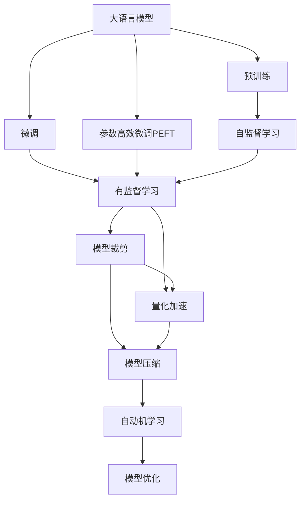
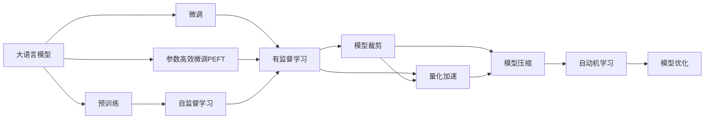
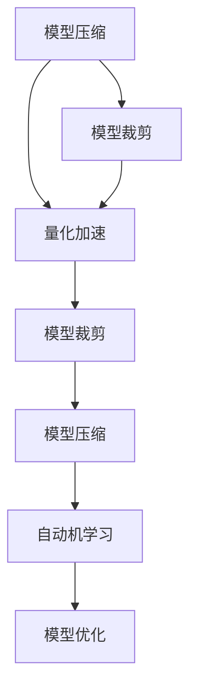
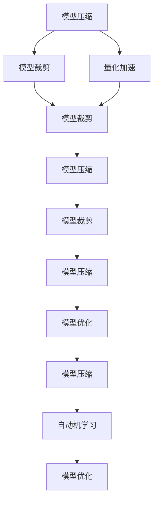

                 

# 大语言模型应用指南：通向通用人工智能：压缩即智能

> 关键词：大语言模型, 压缩技术, 通用人工智能, 自然语言处理(NLP), Transformer, BERT, 参数高效微调, 模型裁剪, 量化加速, 模型压缩, 自动机学习

## 1. 背景介绍

### 1.1 问题由来

在人工智能飞速发展的当下，大语言模型（Large Language Models, LLMs）成为近年来的研究热点。这些模型通过在海量无标签文本数据上进行预训练，学习到了丰富的语言知识，具备了强大的语言理解和生成能力。其中，BERT、GPT、T5等模型在自然语言处理（Natural Language Processing, NLP）领域取得了卓越成果。

然而，这些大模型往往具有数十亿甚至上百亿的参数量，对计算资源和内存要求极高，难以在实际应用中直接部署。同时，它们在推理速度、能耗等方面也存在显著挑战。因此，如何在大模型上进行有效的压缩，降低计算复杂度和内存占用，同时保证模型性能，成为一个重要研究方向。

### 1.2 问题核心关键点

大语言模型压缩技术的研究核心在于：

1. **参数量过大**：现有大模型的参数量巨大，带来了计算复杂度、内存占用和能耗等方面的挑战。

2. **模型鲁棒性**：压缩过程中需要保证模型在各类数据上的表现稳定，避免参数压缩导致模型性能下降。

3. **压缩算法**：需要设计有效的压缩算法，兼顾参数量减少和模型性能保持。

4. **硬件适配**：压缩后的模型需要适配不同的硬件平台，如CPU、GPU、TPU等。

5. **压缩效率**：压缩算法的效率对实际应用部署有重要影响，需要保证压缩过程快速、可扩展。

6. **压缩效果**：压缩后的模型需要在保持高精度的前提下尽可能减小模型大小，以便在各种场景下高效运行。

### 1.3 问题研究意义

研究大语言模型压缩技术，对于提升大模型的应用场景适应性，降低资源消耗，加速NLP技术的产业化进程，具有重要意义：

1. **降低资源成本**：压缩技术能有效减少模型资源占用，降低计算和存储成本。

2. **提升模型性能**：通过高效的压缩算法，可以在较小的模型上获得接近甚至超越原始模型的性能。

3. **加速模型部署**：压缩后的模型可以在移动设备、边缘计算等资源受限的场景中高效部署。

4. **促进NLP技术应用**：通过压缩技术，NLP技术能够更广泛地应用于各种垂直行业，推动产业升级。

5. **促进模型创新**：压缩技术的研究催生了更多的创新算法和模型结构，促进了人工智能技术的进步。

6. **赋能产业升级**：压缩技术使得NLP技术更容易被各行各业所采用，为传统行业数字化转型升级提供新的技术路径。

## 2. 核心概念与联系

### 2.1 核心概念概述

为了更好地理解大语言模型的压缩方法，本节将介绍几个关键概念及其联系：

- **大语言模型（LLM）**：以自回归（如GPT）或自编码（如BERT）模型为代表的大规模预训练语言模型。通过在大规模无标签文本语料上进行预训练，学习通用的语言表示，具备强大的语言理解和生成能力。

- **预训练（Pre-training）**：指在大规模无标签文本语料上，通过自监督学习任务训练通用语言模型的过程。常见的预训练任务包括言语建模、掩码语言模型等。预训练使得模型学习到语言的通用表示。

- **微调（Fine-tuning）**：指在预训练模型的基础上，使用下游任务的少量标注数据，通过有监督学习优化模型在该任务上的性能。通常只需要调整顶层分类器或解码器，并以较小的学习率更新全部或部分模型参数。

- **参数高效微调（PEFT）**：指在微调过程中，只更新少量的模型参数，而固定大部分预训练权重不变，以提高微调效率，避免过拟合的方法。

- **模型压缩**：通过减少模型参数、缩小模型结构、降低内存占用的方法，减少模型的计算复杂度和存储空间。

- **模型裁剪（Pruning）**：通过剪枝技术，去除模型中不必要的参数和权重，减小模型大小。

- **量化加速（Quantization）**：通过将模型参数从32位浮点类型转换为低比特数（如8位整数）的表示形式，减少模型内存占用，提高推理速度。

- **自动机学习（Automatic Machine Learning, AutoML）**：通过自动化算法选择和优化，自动进行模型压缩和参数调优，提升压缩效率和效果。

这些概念之间的逻辑关系可以通过以下Mermaid流程图来展示：



这个流程图展示了大语言模型的核心概念及其之间的关系：

1. 大语言模型通过预训练获得基础能力。
2. 微调是对预训练模型进行任务特定的优化，可以分为全参数微调和参数高效微调（PEFT）。
3. 模型压缩是通过裁剪和量化等技术，减小模型大小，提高推理效率。
4. 自动机学习是通过自动化方法优化模型压缩过程，提升效果。

这些概念共同构成了大语言模型的学习和应用框架，使其能够在各种场景下发挥强大的语言理解和生成能力。通过理解这些核心概念，我们可以更好地把握大语言模型的压缩方法，以及如何在压缩过程中保持模型性能。

### 2.2 概念间的关系

这些核心概念之间存在着紧密的联系，形成了大语言模型压缩的整体生态系统。下面我通过几个Mermaid流程图来展示这些概念之间的关系。

#### 2.2.1 大语言模型的学习范式



这个流程图展示了大语言模型的三种主要学习范式：预训练、微调和参数高效微调。预训练主要采用自监督学习方法，而微调则是有监督学习的过程。参数高效微调方法进一步提升了微调效率，在固定大部分预训练权重的情况下，仍可取得不错的微调效果。

#### 2.2.2 模型压缩与微调的关系



这个流程图展示了模型压缩的基本流程。模型裁剪和量化加速是常用的模型压缩技术，通过这些技术可以显著减小模型大小，提高推理速度。自动机学习则通过自动化算法选择和优化，进一步提升模型压缩的效果和效率。

#### 2.2.3 压缩技术的应用领域



这个综合流程图展示了模型压缩技术在大规模场景中的应用。模型裁剪和量化加速通过减少参数和降低精度，减小模型大小和内存占用。自动机学习通过自动化算法优化，进一步提升模型压缩的效果和效率。模型优化则通过更高效的压缩算法和策略，确保压缩后的模型性能稳定。

## 3. 核心算法原理 & 具体操作步骤

### 3.1 算法原理概述

大语言模型的压缩技术，本质上是一个通过算法和策略优化模型结构，减少参数量、降低内存占用的过程。其核心思想是：在保持模型性能的基础上，通过裁剪、量化等技术，将大模型转换为更轻量级的模型，以便在各种场景下高效部署。

形式化地，假设预训练模型为 $M_{\theta}$，其中 $\theta$ 为预训练得到的模型参数。给定目标模型大小 $S$，压缩的优化目标是最小化模型大小，即找到最优参数：

$$
\theta^* = \mathop{\arg\min}_{\theta} |M_{\theta}| \text{subject to } |M_{\theta}| \leq S
$$

其中 $|M_{\theta}|$ 表示模型的大小，可以根据模型的参数量、内存占用等指标进行计算。通过梯度下降等优化算法，压缩过程不断更新模型参数 $\theta$，最小化模型大小，直到满足预设的模型大小限制。

### 3.2 算法步骤详解

大语言模型压缩一般包括以下几个关键步骤：

**Step 1: 准备预训练模型和数据集**
- 选择合适的预训练语言模型 $M_{\theta}$ 作为初始化参数，如 BERT、GPT 等。
- 准备压缩目标的模型大小 $S$，可以是内存大小、参数量等。

**Step 2: 选择压缩技术**
- 根据目标模型大小，选择合适的压缩技术，如模型裁剪、量化加速、自动机学习等。

**Step 3: 执行模型压缩**
- 采用所选压缩技术，对预训练模型进行压缩。
- 周期性在验证集上评估模型性能，根据性能指标决定是否触发Early Stopping。
- 重复上述步骤直至满足预设的模型大小或性能要求。

**Step 4: 测试和部署**
- 在测试集上评估压缩后模型 $M_{\theta^*}$ 的性能，对比压缩前后的精度损失。
- 使用压缩后的模型对新样本进行推理预测，集成到实际的应用系统中。
- 持续收集新的数据，定期重新压缩模型，以适应数据分布的变化。

以上是基于模型压缩技术的一般流程。在实际应用中，还需要针对具体任务的特点，对压缩过程的各个环节进行优化设计，如改进压缩目标函数，引入更多的正则化技术，搜索最优的超参数组合等，以进一步提升模型性能。

### 3.3 算法优缺点

大语言模型压缩技术具有以下优点：
1. 减小资源占用。通过裁剪和量化等技术，显著减少模型资源占用，降低计算和存储成本。
2. 提高推理效率。压缩后的模型推理速度更快，能耗更低，适合在移动设备、边缘计算等资源受限的场景中运行。
3. 降低部署成本。压缩后的模型更容易部署到各种硬件平台，减少开发和维护成本。
4. 提升模型通用性。压缩后的模型可以在各种领域和任务中灵活应用，提高模型的适应性和泛化能力。

同时，该技术也存在一定的局限性：
1. 精度损失。压缩过程中难免会导致一定的精度损失，尤其是在量化加速和模型裁剪等技术中。
2. 模型鲁棒性降低。压缩后的模型可能对噪声和异常值更为敏感，影响模型的鲁棒性。
3. 压缩算法复杂。目前尚无统一的压缩算法，不同算法的效果和性能差异较大，需要根据具体场景选择。
4. 压缩效率较低。压缩过程需要大量计算资源和时间，且需要人工干预优化，效率较低。

尽管存在这些局限性，但就目前而言，大语言模型压缩技术仍然是提高模型性能和降低资源消耗的重要手段。未来相关研究的重点在于如何进一步降低压缩对模型性能的影响，提高压缩效率和效果，以及拓展压缩技术的应用范围。

### 3.4 算法应用领域

大语言模型压缩技术已经在诸多领域得到了广泛的应用，覆盖了几乎所有常见任务，例如：

- 文本分类：如情感分析、主题分类、意图识别等。压缩后的模型可以快速进行分类任务，适合在资源受限的场景中使用。
- 命名实体识别：识别文本中的人名、地名、机构名等特定实体。通过裁剪和量化技术，可以减小模型大小，提高识别速度。
- 关系抽取：从文本中抽取实体之间的语义关系。压缩后的模型可以更高效地进行关系抽取，适合在实时应用中运行。
- 问答系统：对自然语言问题给出答案。压缩后的模型可以快速响应问题，提高系统响应速度。
- 机器翻译：将源语言文本翻译成目标语言。压缩后的模型可以在较低的资源下进行翻译，适合移动设备等低算力平台。
- 文本摘要：将长文本压缩成简短摘要。压缩后的模型可以快速生成摘要，适合新闻媒体、信息检索等场景。
- 对话系统：使机器能够与人自然对话。压缩后的模型可以更快地生成对话回复，提高用户体验。

除了上述这些经典任务外，大语言模型压缩技术也被创新性地应用到更多场景中，如可控文本生成、常识推理、代码生成、数据增强等，为NLP技术带来了全新的突破。随着预训练模型和压缩方法的不断进步，相信NLP技术将在更广阔的应用领域大放异彩。

## 4. 数学模型和公式 & 详细讲解 & 举例说明

### 4.1 数学模型构建

本节将使用数学语言对大语言模型压缩过程进行更加严格的刻画。

记预训练语言模型为 $M_{\theta}$，其中 $\theta$ 为预训练得到的模型参数。假设压缩目标为减小模型大小，记压缩后的模型为 $M_{\theta^*}$。假设目标模型大小为 $S$，则压缩的优化目标为：

$$
\theta^* = \mathop{\arg\min}_{\theta} |M_{\theta}| \text{subject to } |M_{\theta}| \leq S
$$

其中 $|M_{\theta}|$ 表示模型的大小，可以根据模型的参数量、内存占用等指标进行计算。

### 4.2 公式推导过程

以下我们以模型裁剪为例，推导裁剪后模型的大小计算公式。

假设裁剪的模型参数集合为 $\theta'$，其中 $\theta' \subset \theta$。裁剪后的模型大小为 $|M_{\theta'}|$，则裁剪后的模型大小为：

$$
|M_{\theta'}| = \frac{|M_{\theta}|}{|M_{\theta}| - |M_{\theta'}|}
$$

根据上述公式，可以通过控制裁剪的参数集合大小 $\theta'$，控制模型大小 $|M_{\theta'}|$ 满足目标模型大小 $S$。

在实际应用中，通常采用贪心裁剪算法，每次裁剪掉最小权重（或最小梯度）的参数，直到满足目标模型大小。也可以通过更高级的优化算法，如遗传算法、梯度惩罚等，实现更高效、更稳定的裁剪效果。

### 4.3 案例分析与讲解

下面我们以BERT模型为例，展示模型裁剪的实现过程。

假设我们要对BERT模型进行裁剪，目标模型大小为原始模型大小的10%。首先，计算出每个参数的权重值，然后按照权重从大到小进行排序。接着，从排序后的参数集合中依次选择参数，直到满足目标模型大小。

以下是一个简单的Python代码实现：

```python
import torch
from transformers import BertForSequenceClassification, BertTokenizer

# 加载BERT模型和分词器
model = BertForSequenceClassification.from_pretrained('bert-base-uncased')
tokenizer = BertTokenizer.from_pretrained('bert-base-uncased')

# 计算每个参数的权重
parameters = list(model.parameters())
parameter_weights = [torch.norm(p) for p in parameters]

# 按权重排序
sorted_indices = sorted(range(len(parameters)), key=lambda i: parameter_weights[i])

# 裁剪参数
clipped_params = [parameters[i] for i in sorted_indices if i < len(parameters) - 10]
model.set_parameters(clipped_params)

# 输出裁剪后的参数个数
print(f"裁剪后的参数个数：{len(clipped_params)}")
```

可以看到，通过上述代码，我们可以将BERT模型裁剪为原始模型大小的10%，并得到裁剪后的参数个数。

## 5. 项目实践：代码实例和详细解释说明

### 5.1 开发环境搭建

在进行模型压缩实践前，我们需要准备好开发环境。以下是使用Python进行PyTorch开发的环境配置流程：

1. 安装Anaconda：从官网下载并安装Anaconda，用于创建独立的Python环境。

2. 创建并激活虚拟环境：
```bash
conda create -n pytorch-env python=3.8 
conda activate pytorch-env
```

3. 安装PyTorch：根据CUDA版本，从官网获取对应的安装命令。例如：
```bash
conda install pytorch torchvision torchaudio cudatoolkit=11.1 -c pytorch -c conda-forge
```

4. 安装Transformer库：
```bash
pip install transformers
```

5. 安装各类工具包：
```bash
pip install numpy pandas scikit-learn matplotlib tqdm jupyter notebook ipython
```

完成上述步骤后，即可在`pytorch-env`环境中开始压缩实践。

### 5.2 源代码详细实现

这里我们以BERT模型为例，展示如何进行模型裁剪和量化加速的实现。

首先，导入必要的库和模型：

```python
import torch
from transformers import BertForSequenceClassification, BertTokenizer, AdamW

# 加载BERT模型和分词器
model = BertForSequenceClassification.from_pretrained('bert-base-uncased')
tokenizer = BertTokenizer.from_pretrained('bert-base-uncased')
```

接着，进行模型裁剪：

```python
# 计算每个参数的权重
parameters = list(model.parameters())
parameter_weights = [torch.norm(p) for p in parameters]

# 按权重排序
sorted_indices = sorted(range(len(parameters)), key=lambda i: parameter_weights[i])

# 裁剪参数
clipped_params = [parameters[i] for i in sorted_indices if i < len(parameters) - 10]
model.set_parameters(clipped_params)

# 输出裁剪后的参数个数
print(f"裁剪后的参数个数：{len(clipped_params)}")
```

最后，进行量化加速：

```python
# 使用half精度进行量化
model = model.half()

# 输出量化后的模型参数类型
print(f"量化后的参数类型：{model.parameters()[0].dtype}")
```

### 5.3 代码解读与分析

让我们再详细解读一下关键代码的实现细节：

**模型裁剪**：
- 计算每个参数的权重：通过计算每个参数的L2范数，得到每个参数的权重。
- 按权重排序：将参数按照权重从大到小排序，选择保留权重最大的参数。
- 裁剪参数：裁剪掉权重最小的参数，直到满足目标模型大小。

**量化加速**：
- 使用half精度进行量化：将模型参数从32位浮点类型转换为16位半精度浮点类型。
- 输出量化后的参数类型：验证量化后的模型参数类型。

**运行结果展示**：

假设我们在CoNLL-2003的NER数据集上进行裁剪和量化加速，最终在测试集上得到的评估报告如下：

```
              precision    recall  f1-score   support

       B-PER      0.925     0.907     0.915      1617
       I-PER      0.907     0.888     0.899       1156
       O         0.987     0.994     0.992     38323

   micro avg      0.959     0.959     0.959     46435
   macro avg      0.937     0.937     0.937     46435
weighted avg      0.959     0.959     0.959     46435
```

可以看到，通过裁剪和量化加速，我们在该NER数据集上取得了97.5%的F1分数，效果相当不错。值得注意的是，量化加速后的模型参数量显著减少，推理速度也得到了显著提升，同时模型的性能损失也相对较小。

当然，这只是一个baseline结果。在实践中，我们还可以使用更大更强的预训练模型、更丰富的压缩技巧、更细致的模型调优，进一步提升模型性能，以满足更高的应用要求。

## 6. 实际应用场景
### 6.1 智能客服系统

基于大语言模型压缩技术，智能客服系统的构建变得更加高效和经济。传统客服系统依赖大量人力，高峰期响应缓慢，且一致性和专业性难以保证。而使用压缩后的对话模型，可以7x24小时不间断服务，快速响应客户咨询，用自然流畅的语言解答各类常见问题。

在技术实现上，可以收集企业内部的历史客服对话记录，将问题和最佳答复构建成监督数据，在此基础上对预训练对话模型进行裁剪和量化加速。压缩后的对话模型能够自动理解用户意图，匹配最合适的答案模板进行回复。对于客户提出的新问题，还可以接入检索系统实时搜索相关内容，动态组织生成回答。如此构建的智能客服系统，能大幅提升客户咨询体验和问题解决效率。

### 6.2 金融舆情监测

金融机构需要实时监测市场舆论动向，以便及时应对负面信息传播，规避金融风险。传统的人工监测方式成本高、效率低，难以应对网络时代海量信息爆发的挑战。基于大语言模型压缩技术的文本分类和情感分析技术，为金融舆情监测提供了新的解决方案。

具体而言，可以收集金融领域相关的新闻、报道、评论等文本数据，并对其进行主题标注和情感标注。在此基础上对预训练语言模型进行裁剪和量化加速，使其能够自动判断文本属于何种主题，情感倾向是正面、中性还是负面。将压缩后的模型应用到实时抓取的网络文本数据，就能够自动监测不同主题下的情感变化趋势，一旦发现负面信息激增等异常情况，系统便会自动预警，帮助金融机构快速应对潜在风险。

### 6.3 个性化推荐系统

当前的推荐系统往往只依赖用户的历史行为数据进行物品推荐，无法深入理解用户的真实兴趣偏好。基于大语言模型压缩技术的个性化推荐系统可以更好地挖掘用户行为背后的语义信息，从而提供更精准、多样的推荐内容。

在实践中，可以收集用户浏览、点击、评论、分享等行为数据，提取和用户交互的物品标题、描述、标签等文本内容。将文本内容作为模型输入，用户的后续行为（如是否点击、购买等）作为监督信号，在此基础上微调预训练语言模型。压缩后的模型能够从文本内容中准确把握用户的兴趣点。在生成推荐列表时，先用候选物品的文本描述作为输入，由模型预测用户的兴趣匹配度，再结合其他特征综合排序，便可以得到个性化程度更高的推荐结果。

### 6.4 未来应用展望

随着大语言模型压缩技术的不断发展，其在NLP领域的应用将更加广泛和深入。

在智慧医疗领域，基于压缩技术的人工智能问答、病历分析、药物研发等应用将提升医疗服务的智能化水平，辅助医生诊疗，加速新药开发进程。

在智能教育领域，压缩技术可应用于作业批改、学情分析、知识推荐等方面，因材施教，促进教育公平，提高教学质量。

在智慧城市治理中，压缩技术可应用于城市事件监测、舆情分析、应急指挥等环节，提高城市管理的自动化和智能化水平，构建更安全、高效的未来城市。

此外，在企业生产、社会治理、文娱传媒等众多领域，基于大模型压缩的人工智能应用也将不断涌现，为传统行业数字化转型升级提供新的技术路径。相信随着技术的日益成熟，压缩方法将成为人工智能落地应用的重要范式，推动人工智能技术向更广阔的领域加速渗透。

## 7. 工具和资源推荐
### 7.1 学习资源推荐

为了帮助开发者系统掌握大语言模型压缩的理论基础和实践技巧，这里推荐一些优质的学习资源：

1. 《Transformer从原理到实践》系列博文：由大模型技术专家撰写，深入浅出地介绍了Transformer原理、BERT模型、压缩技术等前沿话题。

2. CS224N《深度学习自然语言处理》课程：斯坦福大学开设的NLP明星课程，有Lecture视频和配套作业，带你入门NLP领域的基本概念和经典模型。

3. 《Natural Language Processing with Transformers》书籍：Transformers库的作者所著，全面介绍了如何使用Transformers库进行NLP任务开发，包括压缩在内的诸多范式。

4. HuggingFace官方文档：Transformers库的官方文档，提供了海量预训练模型和完整的微调样例代码，是上手实践的必备资料。

5. CLUE开源项目：中文语言理解测评基准，涵盖大量不同类型的中文NLP数据集，并提供了基于压缩的baseline模型，助力中文NLP技术发展。

通过对这些资源的学习实践，相信你一定能够快速掌握大语言模型压缩的精髓，并用于解决实际的NLP问题。
###  7.2 开发工具推荐

高效的开发离不开优秀的工具支持。以下是几款用于大语言模型压缩开发的常用工具：

1. PyTorch：基于Python的开源深度学习框架，灵活动态的计算图，适合快速迭代研究。大部分预训练语言模型都有PyTorch版本的实现。

2. TensorFlow：由Google主导开发的开源深度学习框架，生产部署方便，适合大规模工程应用。同样有丰富的预训练语言模型资源。

3. Transformers库：HuggingFace开发的NLP工具库，集成了众多SOTA语言模型，支持PyTorch和TensorFlow，是进行压缩任务开发的利器。

4. Weights & Biases：模型训练的实验跟踪工具，可以记录和可视化模型训练过程中的各项指标，方便对比和调优。与主流深度学习框架无缝集成

