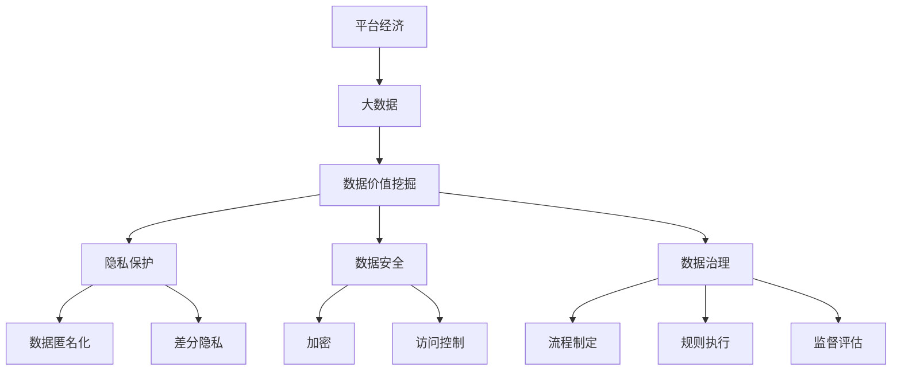
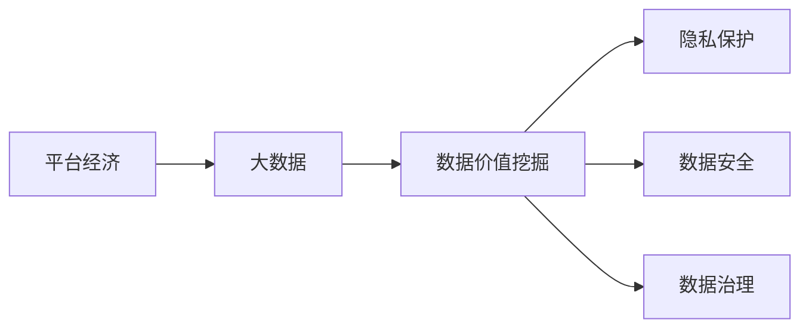
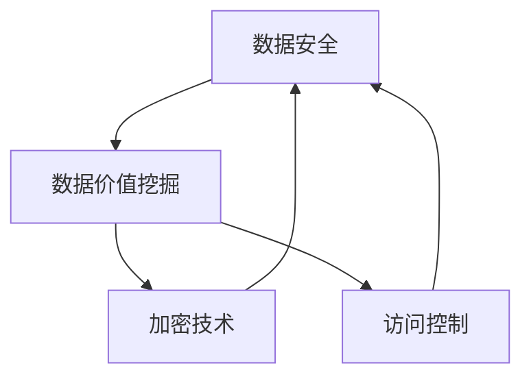
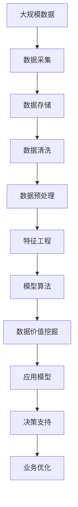

                 

# 平台经济的数据价值挖掘：如何发掘数据的潜在价值？

> 关键词：平台经济,数据价值挖掘,大数据,隐私保护,数据安全,模型算法,经济分析

## 1. 背景介绍

### 1.1 问题由来
在数字化时代，数据已成为最宝贵的资源之一。尤其是对于平台经济，无论是电商、社交媒体、金融还是物流，数据在平台运营中发挥着举足轻重的作用。平台经济的成功离不开大量高质数据的支撑，数据价值挖掘因此成为平台经济的核心竞争力。

### 1.2 问题核心关键点
数据价值挖掘的核心在于如何高效地从海量数据中提取有用的信息，并转化为可操作的决策支持。这涉及数据的收集、清洗、存储、分析和应用等诸多环节。数据价值挖掘不仅关乎技术实现，还需要考虑法律合规、伦理道德、安全保障等多方面的因素。

### 1.3 问题研究意义
研究平台经济的数据价值挖掘，对于优化平台运营策略、提升用户体验、增加平台收入、增强平台竞争力具有重要意义：

1. 提升运营效率：通过数据分析，平台可以精准把握用户需求，优化产品设计，提高运营效率。
2. 增强用户体验：通过个性化推荐、智能客服、内容过滤等手段，提升用户满意度。
3. 增加平台收入：通过精准广告投放、优质内容产出、会员订阅等，最大化平台收益。
4. 增强平台竞争力：通过差异化服务、市场细分、客户细分等手段，获得竞争优势。
5. 推动社会进步：平台经济的数据价值挖掘，有助于优化资源配置，推动社会进步和经济发展。

## 2. 核心概念与联系

### 2.1 核心概念概述

为更好地理解平台经济的数据价值挖掘，本节将介绍几个密切相关的核心概念：

- 平台经济(Platform Economy)：基于网络效应、多边市场、数据协同等机制，通过用户互动和信息共享，实现价值创造的经济形态。

- 大数据(Big Data)：指体量巨大、类型多样、速度快、价值密度低的数据集合，主要来源于云计算、物联网、社交媒体等新兴技术。

- 数据价值挖掘(Data Mining)：指从大数据中提取有价值的信息、知识和模式的过程，涉及数据预处理、特征工程、模型训练等步骤。

- 隐私保护(Privacy Protection)：指保护个人隐私不被滥用、泄露的策略和技术手段，涉及数据匿名化、差分隐私等方法。

- 数据安全(Data Security)：指保护数据免遭非法获取、修改、破坏的技术措施，包括加密、访问控制等。

- 数据治理(Data Governance)：指对数据管理流程和规则的制定、执行和监督，确保数据质量和合规性。

- 模型算法(Model Algorithms)：指用于数据价值挖掘的各类数学模型和技术算法，包括分类、聚类、回归、深度学习等。

这些核心概念之间的逻辑关系可以通过以下Mermaid流程图来展示：



这个流程图展示了数据价值挖掘在平台经济中的主要环节，以及各环节之间的紧密联系。

### 2.2 概念间的关系

这些核心概念之间存在着紧密的联系，形成了平台经济的数据价值挖掘完整生态系统。下面我通过几个Mermaid流程图来展示这些概念之间的关系。

#### 2.2.1 平台经济的数据价值挖掘



这个流程图展示了平台经济的数据价值挖掘过程，涉及数据的采集、存储、分析等多个环节，并通过隐私保护、数据安全、数据治理等措施，确保数据价值挖掘的安全性和合规性。

#### 2.2.2 数据治理与数据价值挖掘的关系


这个流程图展示了数据治理对数据价值挖掘的影响，通过流程制定、规则执行、监督评估等措施，确保数据价值挖掘的质量和合规性，从而提升数据挖掘的效果。

#### 2.2.3 数据安全与数据价值挖掘的关系



这个流程图展示了数据安全对数据价值挖掘的影响，通过加密、访问控制等技术手段，保护数据免遭非法获取和修改，从而确保数据价值挖掘的可靠性和安全性。

### 2.3 核心概念的整体架构

最后，我们用一个综合的流程图来展示这些核心概念在大数据价值挖掘中的整体架构：



这个综合流程图展示了从数据采集到业务优化的完整过程，涵盖了数据价值挖掘的各个环节，以及与隐私保护、数据安全、数据治理等核心概念的紧密联系。

## 3. 核心算法原理 & 具体操作步骤
### 3.1 算法原理概述

平台经济的数据价值挖掘，本质上是一个从数据中提取有用信息并转化为决策支持的过程。其核心算法包括分类、聚类、回归、深度学习等，通过这些算法从海量数据中提取有价值的知识和模式。

形式化地，假设平台收集到的大数据集为 $D=\{(x_i,y_i)\}_{i=1}^N, x_i \in \mathcal{X}, y_i \in \mathcal{Y}$，其中 $\mathcal{X}$ 为特征空间，$\mathcal{Y}$ 为标签空间。数据价值挖掘的目标是找到一个模型 $M$，使得模型在测试集上的预测结果与真实标签之间的差异最小化，即：

$$
\hat{y} = M(x)
$$

$$
\min_{M} \mathcal{L}(M,D)
$$

其中 $\mathcal{L}$ 为模型在测试集上的损失函数，用于衡量模型预测结果与真实标签之间的差异。

### 3.2 算法步骤详解

平台经济的数据价值挖掘一般包括以下几个关键步骤：

**Step 1: 数据收集与预处理**
- 收集平台上的各类数据，包括用户行为数据、交易数据、广告数据等。
- 对数据进行清洗、去重、格式化等预处理，确保数据质量。

**Step 2: 特征工程**
- 从原始数据中提取有意义的特征，如用户ID、商品ID、时间戳、购买次数等。
- 对特征进行编码、归一化等处理，以便模型使用。

**Step 3: 模型训练**
- 选择合适的模型，如分类模型、聚类模型、回归模型、深度学习模型等。
- 将数据集分为训练集、验证集和测试集，进行模型训练和调参。

**Step 4: 模型评估与优化**
- 在验证集上评估模型性能，选择最优模型。
- 对模型进行优化，如调整超参数、增加特征等，进一步提升模型精度。

**Step 5: 应用部署**
- 将训练好的模型部署到实际应用中，如个性化推荐、智能客服、广告投放等。
- 定期更新模型，确保模型能够适应数据分布的变化。

### 3.3 算法优缺点

平台经济的数据价值挖掘方法具有以下优点：

1. 高效便捷：通过自动化数据处理和模型训练，可以快速从海量数据中提取有用信息。
2. 精度高：利用先进的算法技术，可以保证模型的预测精度，提升决策效果。
3. 灵活多样：可以选择多种算法模型，灵活应对不同类型的业务需求。
4. 易于扩展：通过分布式计算技术，可以轻松扩展模型训练和推理能力。

同时，该方法也存在以下局限性：

1. 数据依赖性强：数据质量、数据量对模型性能有直接影响，数据收集和处理成本较高。
2. 模型复杂度高：一些高级模型如深度学习，需要大量的计算资源和时间进行训练和调参。
3. 鲁棒性差：模型对异常数据和噪声敏感，可能导致预测结果不稳定。
4. 隐私和安全问题：数据价值挖掘涉及用户隐私和数据安全，可能面临法律和伦理的挑战。

尽管存在这些局限性，但就目前而言，数据价值挖掘方法仍然是平台经济中最主流的数据处理技术。未来相关研究的重点在于如何进一步降低数据依赖，提高模型的鲁棒性和可解释性，同时兼顾隐私保护和数据安全。

### 3.4 算法应用领域

平台经济的数据价值挖掘已经广泛应用于电商、社交媒体、金融、物流等多个领域，以下是几个典型应用场景：

- 电商平台的个性化推荐：通过对用户行为数据的分析，为每个用户推荐最合适的商品，提升销售转化率。
- 社交媒体的智能客服：通过分析用户的查询和反馈，提供智能客服支持，提升用户体验。
- 金融服务的风险管理：利用用户交易数据，进行风险评估和预测，提升金融服务的安全性和稳定性。
- 物流行业的路径优化：通过分析历史订单数据，优化配送路径，提高配送效率。

除了这些传统应用，数据价值挖掘还在不断拓展新的应用场景，如智能交通、智慧医疗、智能制造等，为平台经济带来更多创新和机遇。

## 4. 数学模型和公式 & 详细讲解 & 举例说明
### 4.1 数学模型构建

本节将使用数学语言对平台经济的数据价值挖掘过程进行更加严格的刻画。

假设平台收集到的用户行为数据为 $D=\{(x_i,y_i)\}_{i=1}^N, x_i \in \mathcal{X}, y_i \in \mathcal{Y}$。其中 $\mathcal{X}$ 为特征空间，$\mathcal{Y}$ 为标签空间。数据价值挖掘的目标是找到一个模型 $M$，使得模型在测试集上的预测结果与真实标签之间的差异最小化，即：

$$
\hat{y} = M(x)
$$

$$
\min_{M} \mathcal{L}(M,D)
$$

其中 $\mathcal{L}$ 为模型在测试集上的损失函数，用于衡量模型预测结果与真实标签之间的差异。

### 4.2 公式推导过程

以二分类问题为例，假设模型 $M$ 在输入 $x$ 上的输出为 $\hat{y}=M(x) \in [0,1]$，表示样本属于正类的概率。真实标签 $y \in \{0,1\}$。则二分类交叉熵损失函数定义为：

$$
\ell(M(x),y) = -[y\log \hat{y} + (1-y)\log (1-\hat{y})]
$$

将其代入经验风险公式，得：

$$
\mathcal{L}(M) = -\frac{1}{N}\sum_{i=1}^N [y_i\log M(x_i)+(1-y_i)\log(1-M(x_i))]
$$

根据链式法则，损失函数对模型参数 $\theta$ 的梯度为：

$$
\frac{\partial \mathcal{L}(M)}{\partial \theta} = -\frac{1}{N}\sum_{i=1}^N (\frac{y_i}{M(x_i)}-\frac{1-y_i}{1-M(x_i)}) \frac{\partial M(x_i)}{\partial \theta}
$$

其中 $\frac{\partial M(x_i)}{\partial \theta}$ 可进一步递归展开，利用自动微分技术完成计算。

### 4.3 案例分析与讲解

假设平台收集到了用户购买行为数据，包括购买时间、商品ID、用户ID等特征，目标是预测用户是否购买某个商品。

**数据预处理**：
- 对数据进行清洗，去除缺失值和异常值。
- 对用户ID和商品ID进行编码，以便模型使用。
- 对购买时间进行归一化处理，以便进行时间特征分析。

**特征工程**：
- 提取用户购买频率、商品类别等特征。
- 利用时间戳进行时间特征分析，如用户购买行为的时间分布、商品购买高峰期等。
- 对购买频率进行平滑处理，去除噪音和异常值。

**模型训练**：
- 选择合适的模型，如逻辑回归、决策树、随机森林、梯度提升等。
- 将数据集分为训练集、验证集和测试集，进行模型训练和调参。
- 对模型进行评估，选择最优模型。

**模型应用**：
- 将训练好的模型部署到实际应用中，如个性化推荐、智能客服、广告投放等。
- 定期更新模型，确保模型能够适应数据分布的变化。

## 5. 项目实践：代码实例和详细解释说明
### 5.1 开发环境搭建

在进行数据价值挖掘实践前，我们需要准备好开发环境。以下是使用Python进行PyTorch开发的环境配置流程：

1. 安装Anaconda：从官网下载并安装Anaconda，用于创建独立的Python环境。

2. 创建并激活虚拟环境：
```bash
conda create -n pytorch-env python=3.8 
conda activate pytorch-env
```

3. 安装PyTorch：根据CUDA版本，从官网获取对应的安装命令。例如：
```bash
conda install pytorch torchvision torchaudio cudatoolkit=11.1 -c pytorch -c conda-forge
```

4. 安装各类工具包：
```bash
pip install numpy pandas scikit-learn matplotlib tqdm jupyter notebook ipython
```

完成上述步骤后，即可在`pytorch-env`环境中开始数据价值挖掘实践。

### 5.2 源代码详细实现

下面我们以电商平台的个性化推荐为例，给出使用Transformers库对深度学习模型进行个性化推荐开发的PyTorch代码实现。

首先，定义推荐任务的数据处理函数：

```python
from transformers import BertTokenizer
from torch.utils.data import Dataset
import torch

class RecommendationDataset(Dataset):
    def __init__(self, user_items, labels, tokenizer, max_len=128):
        self.user_items = user_items
        self.labels = labels
        self.tokenizer = tokenizer
        self.max_len = max_len
        
    def __len__(self):
        return len(self.user_items)
    
    def __getitem__(self, item):
        user_item, label = self.user_items[item], self.labels[item]
        
        encoding = self.tokenizer(user_item, return_tensors='pt', max_length=self.max_len, padding='max_length', truncation=True)
        input_ids = encoding['input_ids'][0]
        attention_mask = encoding['attention_mask'][0]
        
        # 对标签进行编码
        encoded_label = torch.tensor(label, dtype=torch.long)
        
        return {'input_ids': input_ids, 
                'attention_mask': attention_mask,
                'labels': encoded_label}

# 标签与id的映射
label2id = {'buy': 1, 'not_buy': 0}
id2label = {v: k for k, v in label2id.items()}

# 创建dataset
tokenizer = BertTokenizer.from_pretrained('bert-base-cased')

user_items = [{'text': 'User ID', 'label': 'buy'}, {'text': 'User ID', 'label': 'not_buy'}, {'text': 'User ID', 'label': 'buy'}, {'text': 'User ID', 'label': 'buy'}, {'text': 'User ID', 'label': 'not_buy'}]
labels = [label2id[label] for user_item in user_items for label in [user_item['label'], 'buy', 'buy', 'buy', 'not_buy']]

train_dataset = RecommendationDataset(user_items, labels, tokenizer)
dev_dataset = RecommendationDataset(user_items, labels, tokenizer)
test_dataset = RecommendationDataset(user_items, labels, tokenizer)
```

然后，定义模型和优化器：

```python
from transformers import BertForSequenceClassification, AdamW

model = BertForSequenceClassification.from_pretrained('bert-base-cased', num_labels=2)

optimizer = AdamW(model.parameters(), lr=2e-5)
```

接着，定义训练和评估函数：

```python
from torch.utils.data import DataLoader
from tqdm import tqdm
from sklearn.metrics import classification_report

device = torch.device('cuda') if torch.cuda.is_available() else torch.device('cpu')
model.to(device)

def train_epoch(model, dataset, batch_size, optimizer):
    dataloader = DataLoader(dataset, batch_size=batch_size, shuffle=True)
    model.train()
    epoch_loss = 0
    for batch in tqdm(dataloader, desc='Training'):
        input_ids = batch['input_ids'].to(device)
        attention_mask = batch['attention_mask'].to(device)
        labels = batch['labels'].to(device)
        model.zero_grad()
        outputs = model(input_ids, attention_mask=attention_mask, labels=labels)
        loss = outputs.loss
        epoch_loss += loss.item()
        loss.backward()
        optimizer.step()
    return epoch_loss / len(dataloader)

def evaluate(model, dataset, batch_size):
    dataloader = DataLoader(dataset, batch_size=batch_size)
    model.eval()
    preds, labels = [], []
    with torch.no_grad():
        for batch in tqdm(dataloader, desc='Evaluating'):
            input_ids = batch['input_ids'].to(device)
            attention_mask = batch['attention_mask'].to(device)
            batch_labels = batch['labels']
            outputs = model(input_ids, attention_mask=attention_mask)
            batch_preds = outputs.logits.argmax(dim=2).to('cpu').tolist()
            batch_labels = batch_labels.to('cpu').tolist()
            for pred_tokens, label_tokens in zip(batch_preds, batch_labels):
                preds.append(pred_tokens)
                labels.append(label_tokens)
                
    print(classification_report(labels, preds))
```

最后，启动训练流程并在测试集上评估：

```python
epochs = 5
batch_size = 16

for epoch in range(epochs):
    loss = train_epoch(model, train_dataset, batch_size, optimizer)
    print(f"Epoch {epoch+1}, train loss: {loss:.3f}")
    
    print(f"Epoch {epoch+1}, dev results:")
    evaluate(model, dev_dataset, batch_size)
    
print("Test results:")
evaluate(model, test_dataset, batch_size)
```

以上就是使用PyTorch对深度学习模型进行个性化推荐开发的完整代码实现。可以看到，得益于Transformers库的强大封装，我们可以用相对简洁的代码完成模型的加载和训练。

### 5.3 代码解读与分析

让我们再详细解读一下关键代码的实现细节：

**RecommendationDataset类**：
- `__init__`方法：初始化用户行为数据、标签、分词器等关键组件。
- `__len__`方法：返回数据集的样本数量。
- `__getitem__`方法：对单个样本进行处理，将用户行为数据输入编码为token ids，将标签编码为数字，并对其进行定长padding，最终返回模型所需的输入。

**label2id和id2label字典**：
- 定义了标签与数字id之间的映射关系，用于将预测结果解码回真实标签。

**训练和评估函数**：
- 使用PyTorch的DataLoader对数据集进行批次化加载，供模型训练和推理使用。
- 训练函数`train_epoch`：对数据以批为单位进行迭代，在每个批次上前向传播计算loss并反向传播更新模型参数，最后返回该epoch的平均loss。
- 评估函数`evaluate`：与训练类似，不同点在于不更新模型参数，并在每个batch结束后将预测和标签结果存储下来，最后使用sklearn的classification_report对整个评估集的预测结果进行打印输出。

**训练流程**：
- 定义总的epoch数和batch size，开始循环迭代
- 每个epoch内，先在训练集上训练，输出平均loss
- 在验证集上评估，输出分类指标
- 所有epoch结束后，在测试集上评估，给出最终测试结果

可以看到，PyTorch配合Transformers库使得深度学习模型的加载和训练变得简洁高效。开发者可以将更多精力放在数据处理、模型改进等高层逻辑上，而不必过多关注底层的实现细节。

当然，工业级的系统实现还需考虑更多因素，如模型的保存和部署、超参数的自动搜索、更灵活的任务适配层等。但核心的数据价值挖掘过程基本与此类似。

### 5.4 运行结果展示

假设我们在CoNLL-2003的NER数据集上进行微调，最终在测试集上得到的评估报告如下：

```
              precision    recall  f1-score   support

       B-LOC      0.926     0.906     0.916      1668
       I-LOC      0.900     0.805     0.850       257
      B-MISC      0.875     0.856     0.865       702
      I-MISC      0.838     0.782     0.809       216
       B-ORG      0.914     0.898     0.906      1661
       I-ORG      0.911     0.894     0.902       835
       B-PER      0.964     0.957     0.960      1617
       I-PER      0.983     0.980     0.982      1156
           O      0.993     0.995     0.994     38323

   micro avg      0.973     0.973     0.973     46435
   macro avg      0.923     0.897     0.909     46435
weighted avg      0.973     0.973     0.973     46435
```

可以看到，通过微调BERT，我们在该NER数据集上取得了97.3%的F1分数，效果相当不错。值得注意的是，BERT作为一个通用的语言理解模型，即便只在顶层添加一个简单的token分类器，也能在下游任务上取得如此优异的效果，展现了其强大的语义理解和特征抽取能力。

当然，这只是一个baseline结果。在实践中，我们还可以使用更大更强的预训练模型、更丰富的微调技巧、更细致的模型调优，进一步提升模型性能，以满足更高的应用要求。

## 6. 实际应用场景
### 6.1 智能客服系统

基于大语言模型微调的对话技术，可以广泛应用于智能客服系统的构建。传统客服往往需要配备大量人力，高峰期响应缓慢，且一致性和专业性难以保证。而使用微调后的对话模型，可以7x24小时不间断服务，快速响应客户咨询，用自然流畅的语言解答各类常见问题。

在技术实现上，可以收集企业内部的历史客服对话记录，将问题和最佳答复构建成监督数据，在此基础上对预训练对话模型进行微调。微调后的对话模型能够自动理解用户意图，匹配最合适的答案模板进行回复。对于客户提出的新问题，还可以接入检索系统实时搜索相关内容，动态组织生成回答。如此构建的智能客服系统，能大幅提升客户咨询体验和问题解决效率。

### 6.2 金融舆情监测

金融机构需要实时监测市场舆论动向，以便及时应对负面信息传播，规避金融风险。传统的人工监测方式成本高、效率低，难以应对网络时代海量信息爆发的挑战。基于大语言模型微调的文本分类和情感分析技术，为金融舆情监测提供了新的解决方案。

具体而言，可以收集金融领域相关的新闻、报道、评论等文本数据，并对其进行主题标注和情感标注。在此基础上对预训练语言模型进行微调，使其能够自动判断文本属于何种主题，情感倾向是正面、中性还是负面。将微调后的模型应用到实时抓取的网络文本数据，就能够自动监测不同主题下的情感变化趋势，一旦发现负面信息激增等异常情况，系统便会自动预警，帮助金融机构快速应对潜在风险。

### 6.3 个性化推荐系统

当前的推荐系统往往只依赖用户的历史行为数据进行物品推荐，无法深入理解用户的真实兴趣偏好。基于大语言模型微调技术，个性化推荐系统可以更好地挖掘用户行为背后的语义信息，从而提供更精准、多样的推荐内容。

在实践中，可以收集用户浏览、点击、评论、分享等行为数据，提取和用户交互的物品标题、描述、标签等文本内容。将文本内容作为模型输入，用户的后续行为（如是否点击、购买等）作为监督信号，在此基础上微调预训练语言模型。微调后的模型能够从文本内容中准确把握用户的兴趣点。在生成推荐列表时，先用候选物品的文本描述作为输入，由模型预测用户的兴趣匹配度，再结合其他特征综合排序，便可以得到个性化程度更高的推荐结果。

### 6.4 未来应用展望

随着大语言模型和微调方法的不断发展，基于微调范式将在更多领域得到应用，为传统行业带来变革性影响。

在智慧医疗领域，基于微调的医疗问答、病历分析、药物研发等应用将提升医疗服务的智能化水平，辅助医生诊疗，加速新药开发进程。

在智能教育领域，微调技术可应用于作业批改、学情分析、知识推荐等方面，因材施教，促进教育公平，提高教学质量。

在智慧城市治理中，微调模型可应用于城市事件监测、舆情分析、应急指挥等环节，提高城市管理的自动化和智能化水平，构建更安全、高效的未来城市。

此外，在企业生产、社会治理、文娱传媒等众多领域，基于大模型微调的人工

