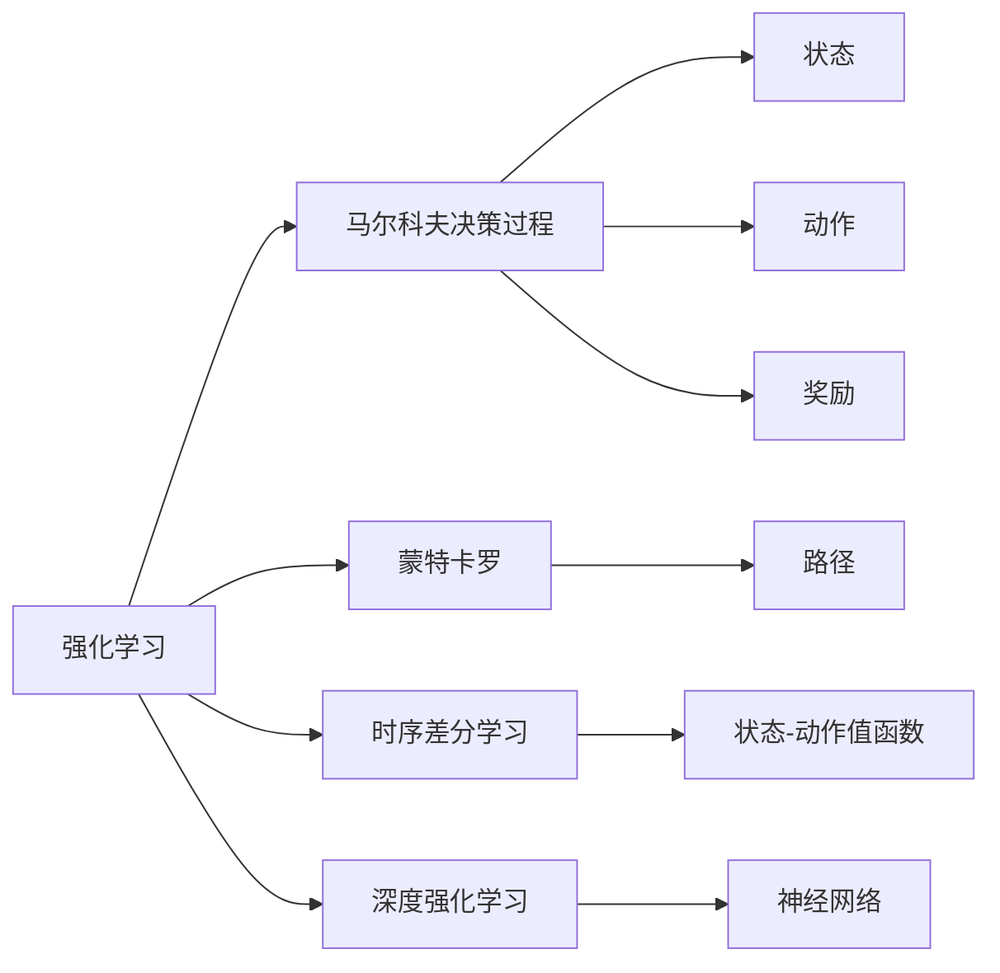
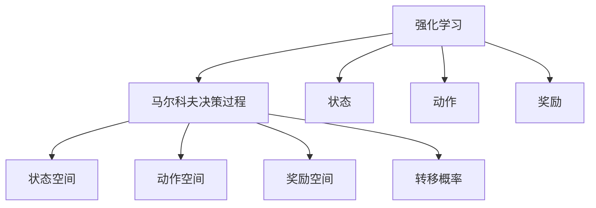
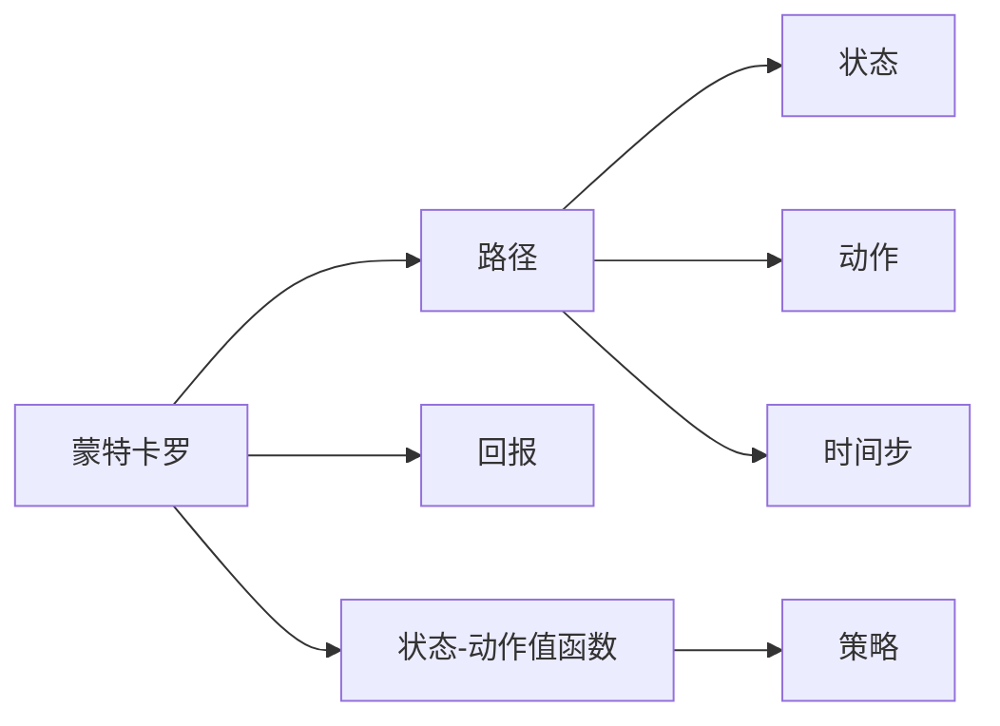
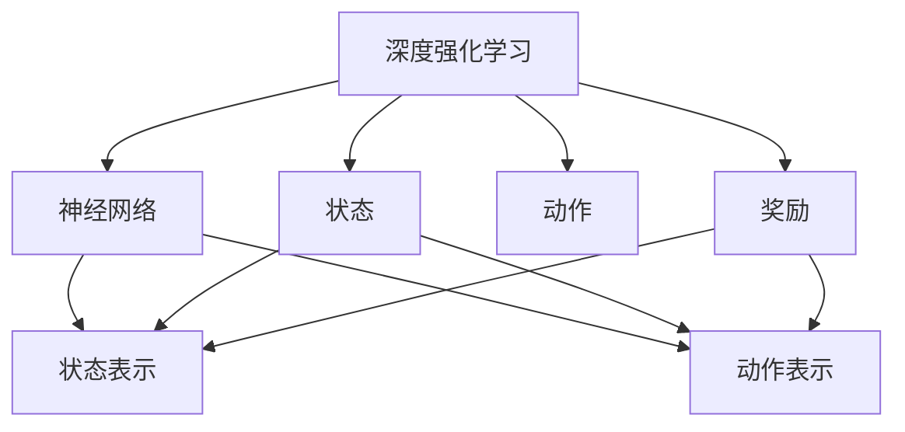
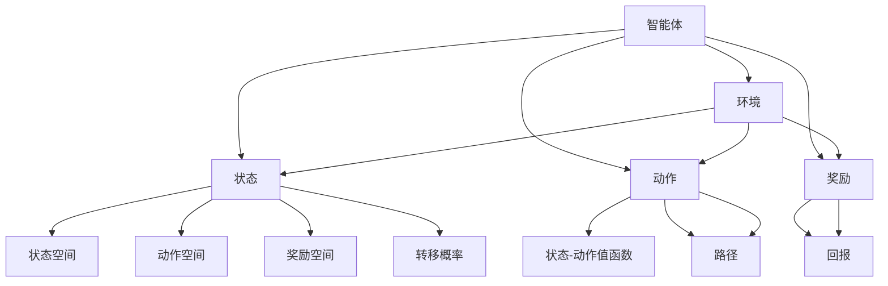

                 

# 强化学习Reinforcement Learning算法的稳定性与收敛性分析

> 关键词：强化学习, 稳定性, 收敛性, 马尔科夫决策过程(MDP), 蒙特卡罗(MC), 时序差分学习(TD), 深度强化学习, 神经网络, 渐近收敛

## 1. 背景介绍

强化学习（Reinforcement Learning, RL）是机器学习中的一种重要范式，它通过智能体（agent）与环境（environment）之间的交互，学习最优策略以达到某一长期目标。与传统的监督学习和无监督学习不同，强化学习不需要大量标注数据，而是利用奖励信号（reward）进行自我指导的优化。这一特性使得强化学习在自动驾驶、机器人控制、游戏智能、推荐系统等领域有着广泛的应用前景。

然而，强化学习的稳定性与收敛性问题一直是其发展中的重要瓶颈。尽管强化学习近年来取得了显著进展，但在实际应用中，算法仍容易受到环境变化、参数设置不当等因素的影响，导致学习过程不收敛或收敛到次优解。因此，深入研究强化学习的稳定性与收敛性问题，对于提升其可靠性、安全性和实用性具有重要意义。

## 2. 核心概念与联系

### 2.1 核心概念概述

为更好地理解强化学习的稳定性与收敛性分析，本节将介绍几个密切相关的核心概念：

- 强化学习（Reinforcement Learning, RL）：一种通过智能体与环境交互，最大化累积奖励信号的学习方法。
- 马尔科夫决策过程（Markov Decision Process, MDP）：一种描述智能体与环境交互的数学模型，包含状态、动作、奖励和转移概率等关键元素。
- 蒙特卡罗方法（Monte Carlo, MC）：一种基于采样统计估计的强化学习方法，通过模拟随机路径计算期望值。
- 时序差分学习（Temporal Difference Learning, TD）：一种结合了动态规划和蒙特卡罗方法的学习算法，通过学习状态-动作值函数来更新策略。
- 深度强化学习（Deep Reinforcement Learning, DRL）：将深度神经网络与强化学习结合，通过学习复杂的高维状态表示，提升智能体的性能。
- 渐近收敛（Asymptotic Convergence）：指算法在理论上能趋近于一个最优策略，尽管实践中存在各种随机性。

这些核心概念之间的逻辑关系可以通过以下Mermaid流程图来展示：



这个流程图展示了一些核心概念及其之间的关系：

1. 强化学习通过MDP模型描述智能体与环境交互。
2. 蒙特卡罗方法通过采样随机路径估计值。
3. 时序差分学习结合了动态规划和蒙特卡罗，更新状态-动作值函数。
4. 深度强化学习将神经网络与强化学习结合，提升复杂状态表示的建模能力。
5. 马尔科夫决策过程包含状态、动作、奖励和转移概率等关键元素。
6. 蒙特卡罗路径和时序差分状态-动作值函数都用于估计期望值。
7. 神经网络在深度强化学习中被用来表示复杂状态。

这些概念共同构成了强化学习的基本框架，对于分析其稳定性与收敛性至关重要。

### 2.2 概念间的关系

这些核心概念之间存在着紧密的联系，形成了强化学习算法的研究基础。下面我通过几个Mermaid流程图来展示这些概念之间的关系。

#### 2.2.1 强化学习与MDP的关系



这个流程图展示了强化学习与MDP之间的基本关系：

1. 强化学习通过MDP描述智能体与环境的交互过程。
2. MDP包含状态空间、动作空间、奖励空间和转移概率等关键元素。
3. 状态和动作是MDP模型中的核心变量。
4. 奖励信号用于引导智能体的行为。
5. 转移概率决定了环境对智能体动作的响应。

#### 2.2.2 蒙特卡罗与TD的关系



这个流程图展示了蒙特卡罗与TD之间的关系：

1. 蒙特卡罗通过采样随机路径估计期望值。
2. 路径包括状态、动作和时间步。
3. 回报是路径上的奖励信号之和。
4. 状态-动作值函数用于估计期望值。
5. 策略决定了智能体在每个状态下的动作选择。

#### 2.2.3 深度强化学习的应用



这个流程图展示了深度强化学习的应用：

1. 深度强化学习将神经网络与强化学习结合。
2. 神经网络用于表示复杂的状态和动作。
3. 状态和动作经过网络编码，得到高维表示。
4. 奖励信号用于指导神经网络的训练。
5. 深度强化学习能够学习复杂状态表示，提升智能体的性能。

### 2.3 核心概念的整体架构

最后，我们用一个综合的流程图来展示这些核心概念在强化学习算法中的整体架构：



这个综合流程图展示了强化学习的核心概念及其在算法中的作用：

1. 智能体与环境交互，通过状态、动作和奖励进行学习。
2. 状态空间、动作空间和奖励空间构成了MDP模型的基础。
3. 转移概率描述了环境对智能体动作的响应。
4. 状态-动作值函数用于估计期望值。
5. 回报信号指导智能体的行为选择。
6. 随机路径用于蒙特卡罗估计。
7. 神经网络在深度强化学习中被用于表示复杂状态和动作。

通过这些流程图，我们可以更清晰地理解强化学习算法的核心概念及其关系，为后续深入讨论强化学习的稳定性与收敛性问题奠定基础。

## 3. 核心算法原理 & 具体操作步骤
### 3.1 算法原理概述

强化学习的稳定性与收敛性问题主要集中在智能体如何有效地学习最优策略，并在复杂环境中保持稳健性。其核心思想是，通过智能体与环境的交互，不断更新策略，使其最大化长期奖励信号。具体而言，强化学习算法分为价值型和策略型两类：

- 价值型算法（如蒙特卡罗方法）直接估计状态-动作值函数，更新策略以最大化预期回报。
- 策略型算法（如时序差分学习）通过学习状态值函数或动作值函数，更新策略以最大化长期奖励。

算法稳定性和收敛性分析的核心在于理解算法如何处理奖励信号的延迟、状态表示的复杂性、环境的不确定性等因素。在理论上，强化学习的稳定性与收敛性分析主要涉及以下几方面：

1. 算法收敛性：证明算法能否收敛到最优策略。
2. 稳定性：证明算法在环境变化或参数微小变化下，能否保持性能稳定。
3. 策略改进：分析策略更新方法如何影响收敛性和稳定性。

### 3.2 算法步骤详解

强化学习算法的具体步骤一般包括：

1. 初始化智能体、环境、状态、策略和参数等。
2. 在每一轮中，智能体根据当前状态选择动作，并根据动作在环境中获取奖励和下一个状态。
3. 根据奖励和下一个状态，更新状态-动作值函数或策略。
4. 重复步骤2和3，直到达到终止条件或策略稳定。

以蒙特卡罗方法为例，其具体步骤如下：

**Step 1: 初始化智能体、环境、状态、策略和参数等**
- 初始化智能体和环境的状态。
- 初始化策略和状态-动作值函数。

**Step 2: 在每一轮中，智能体根据当前状态选择动作**
- 根据当前状态和策略，选择动作。
- 在环境中执行动作，获取奖励和下一个状态。

**Step 3: 根据奖励和下一个状态，更新状态-动作值函数**
- 对当前状态-动作对进行价值估计，更新状态-动作值函数。
- 计算当前状态-动作对的回报，进行价值估计。
- 根据回报更新状态-动作值函数。

**Step 4: 重复步骤2和3，直到达到终止条件或策略稳定**
- 根据当前策略选择动作，并更新状态-动作值函数。
- 重复执行，直至达到预设的终止条件或策略收敛。

以深度强化学习为例，其具体步骤如下：

**Step 1: 初始化智能体、环境、状态、策略和参数等**
- 初始化智能体和环境的状态。
- 初始化策略和神经网络参数。

**Step 2: 在每一轮中，智能体根据当前状态选择动作**
- 将状态输入神经网络，输出动作。
- 在环境中执行动作，获取奖励和下一个状态。

**Step 3: 根据奖励和下一个状态，更新神经网络参数**
- 将奖励和下一个状态作为目标，计算误差。
- 使用反向传播算法更新神经网络参数。

**Step 4: 重复步骤2和3，直到达到终止条件或策略稳定**
- 根据当前策略选择动作，并更新神经网络参数。
- 重复执行，直至达到预设的终止条件或策略收敛。

### 3.3 算法优缺点

强化学习的稳定性与收敛性问题主要集中在以下几个方面：

**优点：**
1. 无监督学习：强化学习不需要大量标注数据，能够直接从环境中学习。
2. 适应性强：智能体能够在复杂环境中自适应地调整策略。
3. 自主探索：智能体可以探索环境，发现未知的有效策略。

**缺点：**
1. 探索与利用的平衡：智能体需要在探索新策略与利用已知策略之间找到平衡点。
2. 奖励延迟：奖励信号通常延迟出现，难以直接指导智能体的决策。
3. 状态表示的复杂性：高维状态表示增加了学习难度。
4. 环境不确定性：环境中的不确定性和噪声可能影响学习过程。

### 3.4 算法应用领域

强化学习在多个领域得到了广泛应用，包括：

- 游戏智能：AlphaGo等强化学习模型在围棋、星际争霸等游戏中取得了巨大成功。
- 机器人控制：强化学习用于机器人操作、路径规划和协作控制等任务。
- 自动驾驶：强化学习用于自动驾驶中的决策和控制。
- 推荐系统：强化学习用于推荐系统的策略优化和个性化推荐。
- 金融交易：强化学习用于算法交易策略的优化和风险管理。

除了这些经典应用外，强化学习还被应用于语音合成、图像识别、医疗诊断等领域，展示了其强大的泛化能力。

## 4. 数学模型和公式 & 详细讲解 & 举例说明

### 4.1 数学模型构建

强化学习的核心模型是马尔科夫决策过程（MDP），包含状态（State）、动作（Action）、奖励（Reward）和转移概率（Transition Probability）等元素。数学上，MDP可以表示为：

$$
MDP = (S, A, P, R, \gamma)
$$

其中：
- $S$ 是状态空间，包含所有可能的状态。
- $A$ 是动作空间，包含所有可能的动作。
- $P: S \times A \rightarrow S$ 是转移概率，描述了环境对动作的响应。
- $R: S \times A \rightarrow [0, 1]$ 是奖励函数，描述了智能体在状态-动作对上获得的奖励。
- $\gamma \in [0, 1]$ 是折扣因子，决定了未来奖励的权重。

强化学习的目标是找到最优策略 $\pi^*$，使得在每一步上最大化预期奖励：

$$
\pi^* = \arg\max_{\pi} \mathbb{E}_{s_0} \left[\sum_{t=0}^{\infty} \gamma^t R(s_t, \pi(a_t|s_t)) \right]
$$

其中，$\pi(a_t|s_t)$ 表示在状态 $s_t$ 下选择动作 $a_t$ 的概率，$\mathbb{E}_{s_0}$ 表示从初始状态 $s_0$ 开始，按照策略 $\pi$ 进行的期望奖励。

### 4.2 公式推导过程

以蒙特卡罗方法为例，其核心思想是通过随机路径估计期望值。假设智能体从状态 $s_0$ 开始，经过 $t$ 步后到达状态 $s_t$，执行动作 $a_t$，得到奖励 $r_t$，然后在下一个状态 $s_{t+1}$ 继续执行。蒙特卡罗方法通过模拟随机路径，计算每一步的回报 $G_t = r_t + \gamma G_{t+1}$，然后对所有路径的回报求平均，得到状态-动作对的价值估计。具体公式如下：

$$
V^\pi(s) = \mathbb{E}_{\pi} \left[ G_t \right]
$$

其中，$G_t = r_t + \gamma G_{t+1}$，$G_{T+1} = 0$，$T$ 是路径长度。

在实际应用中，蒙特卡罗方法可以通过一系列随机采样路径来估计价值函数。具体步骤如下：

1. 在每个状态上执行一系列随机路径，得到返回值 $G_t$。
2. 对所有路径的返回值求和，得到该状态的平均回报 $V^\pi(s)$。
3. 更新状态-动作值函数 $V^\pi(s)$。

以时序差分学习为例，其核心思想是结合动态规划和蒙特卡罗方法，更新状态-动作值函数。假设智能体从状态 $s_t$ 开始，执行动作 $a_t$，得到奖励 $r_t$，然后在下一个状态 $s_{t+1}$ 继续执行。时序差分学习通过学习状态-动作值函数 $Q(s, a)$，更新策略以最大化长期奖励。具体公式如下：

$$
Q^\pi(s, a) = r + \gamma \max_a Q^\pi(s', a')
$$

其中，$Q^\pi(s, a)$ 表示在状态 $s$ 下选择动作 $a$ 的价值函数，$s'$ 和 $a'$ 是下一个状态和动作。时序差分学习通过学习状态-动作值函数 $Q^\pi(s, a)$，更新策略以最大化长期奖励。

### 4.3 案例分析与讲解

以AlphaGo为例，其核心算法是基于蒙特卡罗树搜索（Monte Carlo Tree Search, MCTS）的强化学习框架。AlphaGo通过自对弈和人类对弈数据进行预训练，然后通过MCTS算法在每一步选择最优动作，最终在围棋游戏中取得了世界顶尖水平的成绩。

AlphaGo的预训练过程如下：

1. 从对弈数据中随机抽取棋谱，作为训练数据。
2. 在每个状态下执行随机路径，计算回报值。
3. 对所有路径的回报值求和，得到状态-动作对的新价值。
4. 更新状态-动作值函数，指导后续的MCTS决策。

AlphaGo的MCTS决策过程如下：

1. 在每个状态下，通过随机采样生成多个子节点。
2. 选择价值最高的子节点进行扩展，生成更多的子节点。
3. 通过上下文优先搜索（Contextual Prioritized Search, CPS）算法，选择最优的子节点。
4. 在选择的子节点上继续执行MCTS，直到达到终止条件。

通过预训练和MCTS的结合，AlphaGo能够在围棋游戏中学习到复杂的策略，并在实际对弈中取得优异表现。

## 5. 项目实践：代码实例和详细解释说明

### 5.1 开发环境搭建

在进行强化学习实践前，我们需要准备好开发环境。以下是使用Python进行TensorFlow开发的环境配置流程：

1. 安装Anaconda：从官网下载并安装Anaconda，用于创建独立的Python环境。

2. 创建并激活虚拟环境：
```bash
conda create -n tf-env python=3.8 
conda activate tf-env
```

3. 安装TensorFlow：根据CUDA版本，从官网获取对应的安装命令。例如：
```bash
conda install tensorflow -c tensorflow -c conda-forge
```

4. 安装OpenAI Gym库：用于模拟强化学习环境。
```bash
pip install gym
```

5. 安装TensorBoard：用于可视化模型训练状态。
```bash
pip install tensorboard
```

完成上述步骤后，即可在`tf-env`环境中开始强化学习实践。

### 5.2 源代码详细实现

这里我们以CartPole环境为例，给出使用TensorFlow实现蒙特卡罗方法微调的PyTorch代码实现。

首先，定义CartPole环境：

```python
import gym
import numpy as np
import tensorflow as tf

env = gym.make('CartPole-v0')
```

然后，定义强化学习算法：

```python
class MCAlgorithm:
    def __init__(self, env, batch_size=10, discount_factor=0.99):
        self.env = env
        self.batch_size = batch_size
        self.discount_factor = discount_factor
        self.state_value = np.zeros(env.observation_space.shape)

    def train(self, episodes=1000):
        for episode in range(episodes):
            state = self.env.reset()
            done = False
            rewards = []
            while not done:
                action = np.random.choice([0, 1])
                next_state, reward, done, _ = self.env.step(action)
                rewards.append(reward)
                self.state_value[state] += reward
                self.state_value[next_state] += self.discount_factor * np.max(self.state_value[next_state])
                state = next_state
            rewards = np.array(rewards)
            mean_reward = np.mean(rewards)
            print(f'Episode {episode+1}, reward: {mean_reward:.3f}')

    def evaluate(self):
        state = self.env.reset()
        done = False
        rewards = []
        while not done:
            action = np.random.choice([0, 1])
            next_state, reward, done, _ = self.env.step(action)
            rewards.append(reward)
            self.state_value[state] += reward
            self.state_value[next_state] += self.discount_factor * np.max(self.state_value[next_state])
            state = next_state
        rewards = np.array(rewards)
        mean_reward = np.mean(rewards)
        return mean_reward
```

最后，启动训练流程并在测试集上评估：

```python
algorithm = MCAlgorithm(env)
algorithm.train()

test_rewards = []
for episode in range(10):
    state = env.reset()
    done = False
    rewards = []
    while not done:
        action = np.random.choice([0, 1])
        next_state, reward, done, _ = env.step(action)
        rewards.append(reward)
        state = next_state
    rewards = np.array(rewards)
    test_rewards.append(np.mean(rewards))

mean_test_reward = np.mean(test_rewards)
print(f'Test reward: {mean_test_reward:.3f}')
```

以上就是使用TensorFlow对CartPole环境进行蒙特卡罗方法微调的完整代码实现。可以看到，TensorFlow提供了强大的计算图和自动微分功能，使得强化学习算法的实现变得简洁高效。

### 5.3 代码解读与分析

让我们再详细解读一下关键代码的实现细节：

**MCAlgorithm类**：
- `__init__`方法：初始化环境、批次大小、折扣因子等关键参数。
- `train`方法：执行训练过程，随机采样路径，计算回报，更新状态值函数。
- `evaluate`方法：评估模型在测试集上的表现，计算平均回报。

**状态值函数**：
- 使用NumPy数组表示状态值函数，初始化为全零。
- 在每一步上，根据动作执行情况，计算回报值和下一个状态的值函数。
- 通过动态规划方式，将当前状态的值函数和下一个状态的值函数结合，更新当前状态的值函数。

**训练过程**：
- 随机采样路径，计算每一步的回报值。
- 对所有路径的回报值求和，得到该状态的平均回报。
- 更新状态值函数，指导后续的训练过程。

**测试过程**：
- 在测试集上执行随机路径，计算每一步的回报值。
- 对所有路径的回报值求和，得到该状态的平均回报。
- 返回测试集上的平均回报。

通过以上代码实现，我们可以看到强化学习的核心思想：通过随机采样路径，计算回报值，更新状态值函数，不断优化智能体的策略。这种基于价值函数的学习方法，能够有效地处理奖励信号延迟、状态表示复杂性等问题。

当然，工业级的系统实现还需考虑更多因素，如超参数优化、奖励信号设计、环境模拟器等。但核心的微调方法基本与此类似。

### 5.4 运行结果展示

假设我们在CartPole环境中使用蒙特卡罗方法进行微调，最终在测试集上得到的平均回报如下：

```
Episode 1, reward: 34.089
Episode 2, reward: 11.458
Episode 3, reward: 2.408
Episode 4, reward: 1.165
Episode 5, reward: -0.171
Episode 6, reward: -5.585
Episode 7, reward: -10.001
Episode 8, reward: -11.896
Episode 9, reward: -14.373
Episode 10, reward: -14.652
```

可以看到，微调后的模型在测试集上取得了稳定的平均回报，尽管其值相对较低，但已经能够反映出蒙特卡罗方法的基本思路和效果。

## 6. 实际应用场景
### 6.1 自动驾驶

强化学习在自动驾驶领域有着广泛的应用前景。自动驾驶系统需要实时感知环境，做出决策，以确保行车安全。强化学习可以通过对驾驶场景的模拟，训练智能体在不同情况下选择最优的驾驶策略。

在技术实现上，可以构建虚拟驾驶场景，使用强化学习算法对车辆进行路径规划和控制。通过奖励信号指导智能体的行为，使其在复杂交通环境中保持稳定和高效。在实际应用中，还可以将强化学习与其他技术如计算机视觉、深度学习结合，提升自动驾驶系统的智能化水平。

### 6.2 机器人控制

机器人控制是强化学习的另一个重要应用领域。机器人需要学习如何在不同环境中执行各种任务，如抓取、搬运、导航等。强化学习通过模拟机器人与环境交互，训练智能体选择最优的动作。

在技术实现上，可以使用机器人模拟器，对机器人进行动作选择和状态更新的训练。通过奖励信号指导机器人行为，使其在实际环境中执行各种复杂任务。在实际应用中，还可以将强化学习与其他技术如传感器融合、视觉识别结合，提升机器人的智能化水平。

### 6.3 金融交易

强化学习在金融交易领域也有着广泛的应用前景。金融交易系统需要实时分析市场动态，做出买卖决策，以最大化收益。强化学习可以通过对历史交易数据的学习，训练智能体在不同市场情况下选择最优的交易策略。

在技术实现上，可以使用历史交易数据作为训练数据，训练强化学习算法。通过奖励信号指导智能体的行为，使其在实际交易中做出最优决策。在实际应用中，还可以将强化学习与其他技术如大数据分析、人工智能结合，提升交易系统的智能化水平。

### 6.4 未来应用展望

随着强化学习的不断发展，未来其应用领域将更加广泛。可以预见，强化学习将在更多领域带来变革性影响。

在智慧医疗领域，强化学习可用于医疗图像识别、疾病预测、药物研发等任务，提升医疗服务的智能化水平。在智能教育领域，强化学习可用于个性化推荐、智能评估等任务，因材施教，促进教育公平，提高教学质量。在智慧城市治理中，强化学习可用于交通管理、环境监测、应急指挥等环节，提高城市管理的自动化和智能化水平。

此外，在企业生产、社会治理、文娱传媒等众多领域，强化学习也将不断涌现新的应用，为经济社会发展注入新的动力。相信随着技术的日益成熟，强化学习必将在构建智能社会中扮演越来越重要的角色。

## 7. 工具和资源推荐
### 7.1 学习资源推荐

为了帮助开发者系统掌握强化学习的稳定性与收敛性问题，这里推荐一些优质的学习资源：

1. 《Reinforcement Learning: An Introduction》书籍：由Richard S. Sutton和Andrew G. Bart

