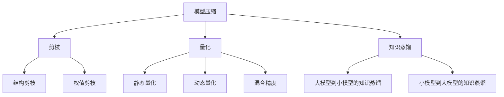
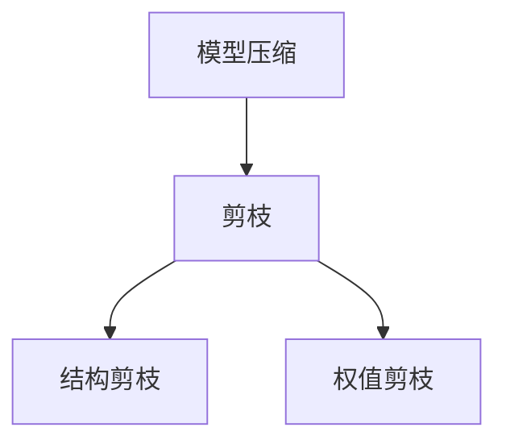
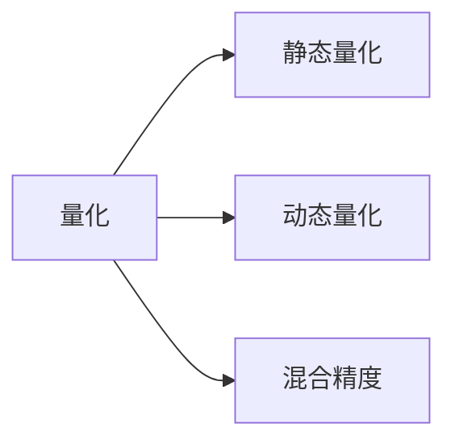
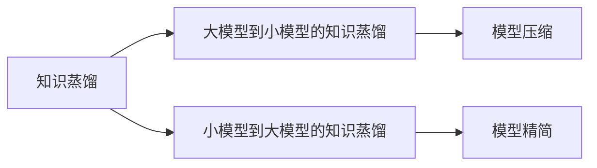

                 

# 提高AI模型能效:从精度到稀疏性的优化之路

在当今数据驱动的AI时代，高效能的AI模型已成为推动科技发展的关键。但随着模型规模的不断扩大，能效问题也愈发凸显。如何平衡模型精度与能效，是AI研究领域的一项重要课题。本文将从模型的精度优化、稀疏性处理、资源优化等角度，探讨如何通过系统化策略，提升AI模型的能效，同时保证其优异性能。

## 1. 背景介绍

### 1.1 问题由来
近年来，深度学习技术在图像识别、自然语言处理、语音识别等领域取得了巨大突破。以深度神经网络为代表的模型，通过大量数据训练，逐渐具备了强大的泛化能力和自动化学习能力。但随着模型复杂度的提升，训练和推理过程中的能耗和计算资源需求也迅速增长，带来了一系列挑战：

1. **训练效率低**：大模型往往需要长时间的训练，高精度的计算资源，以及大量能源消耗，难以适应分布式计算和实时部署的需求。
2. **推理成本高**：在实际应用中，大模型的推理计算同样耗费巨大，资源利用率低，难以满足高并发、低延迟的业务需求。
3. **存储管理难**：大模型的参数量庞大，导致存储和管理成本高，系统扩展性受限。

### 1.2 问题核心关键点
为了解决上述问题，AI研究人员提出了多种优化策略，主要包括模型压缩、剪枝、量化、蒸馏等。这些方法通过减少模型参数量、降低计算复杂度、缩小模型规模，在保持高精度的同时，大幅提升模型能效。本文将详细介绍这些优化策略，并通过具体案例，展示其实际效果。

### 1.3 问题研究意义
提升AI模型的能效，对于提高模型的应用效率、降低计算成本、推动AI技术的规模化落地具有重要意义：

1. **提升训练速度**：通过减少模型参数量，降低训练过程中的计算复杂度，显著加快模型训练速度。
2. **降低推理成本**：优化后的模型在推理计算时，资源占用少，计算速度更快，降低实际应用中的能耗和计算成本。
3. **增强系统扩展性**：减少模型参数量，降低存储需求，提高系统的资源利用效率，提升系统的扩展性和可靠性。

## 2. 核心概念与联系

### 2.1 核心概念概述

为更好地理解从精度到稀疏性的优化之路，本节将介绍几个密切相关的核心概念：

- **模型压缩(Model Compression)**：通过减少模型参数量，降低计算复杂度，提升模型的推理速度和存储效率。常见方法包括剪枝(Pruning)、量化(Quantization)、知识蒸馏(Knowledge Distillation)等。
- **剪枝(Pruning)**：通过去除模型中冗余或无关的参数，减少模型大小，提升计算效率。可分为结构剪枝(Weight Pruning)和权值剪枝(Neural Architecture Search)两种方式。
- **量化(Quantization)**：将高精度的浮点数参数转换为低精度的定点数，减少模型参数量，降低计算资源消耗。常见量化方法包括静态量化(Static Quantization)、动态量化(Dynamic Quantization)、混合精度(Mixed-Precision)等。
- **知识蒸馏(Knowledge Distillation)**：通过将大模型的知识转移到小模型中，保留大模型的泛化能力，同时提升小模型的计算效率。常用于模型压缩和参数共享。
- **稀疏性(Sparsity)**：指模型参数值的稀疏分布，即大部分参数值为0或接近0。稀疏性处理可以进一步减少模型参数量，提高模型能效。

这些核心概念之间存在着紧密的联系，形成了AI模型优化的完整生态系统。下面我们通过几个Mermaid流程图来展示这些概念之间的关系。



这个流程图展示了大模型优化的核心概念及其之间的关系：

1. 模型压缩通过剪枝、量化、知识蒸馏等方法，降低模型参数量，提升计算效率。
2. 剪枝包括结构剪枝和权值剪枝，结构剪枝去除冗余的神经元或层，权值剪枝去除冗余的权值。
3. 量化将高精度参数转换为低精度参数，减少参数量，降低计算资源消耗。
4. 知识蒸馏将大模型的知识转移给小模型，保留泛化能力，同时提升小模型计算效率。
5. 稀疏性处理进一步减少模型参数量，提高模型能效。

这些概念共同构成了AI模型优化的关键环节，通过对其深入理解和有效应用，可以显著提升模型的能效，同时保证其优异性能。

### 2.2 概念间的关系

这些核心概念之间存在着紧密的联系，形成了AI模型优化的完整生态系统。下面我通过几个Mermaid流程图来展示这些概念之间的关系。

#### 2.2.1 模型压缩与剪枝的关系



这个流程图展示了大模型压缩与剪枝的关系：

1. 模型压缩包括剪枝、量化、知识蒸馏等多种方法。
2. 剪枝是模型压缩的核心方法，包括结构剪枝和权值剪枝两种方式。

#### 2.2.2 量化方法与混合精度的关系



这个流程图展示了大模型量化与混合精度的关系：

1. 量化是减少模型参数量、降低计算资源消耗的重要手段。
2. 静态量化和动态量化是常见的量化方法，静态量化在模型训练过程中进行，动态量化在推理过程中进行。
3. 混合精度是一种量化方法，结合了低精度和高精度参数，可以在保证模型精度的情况下，显著减少计算资源消耗。

#### 2.2.3 知识蒸馏与稀疏性的关系



这个流程图展示了大模型知识蒸馏与稀疏性的关系：

1. 知识蒸馏是模型压缩的重要方法，通过将大模型的知识转移到小模型中，提升小模型的泛化能力和计算效率。
2. 稀疏性处理可以进一步减少模型参数量，提升计算效率。
3. 通过知识蒸馏和稀疏性处理，可以实现更高效的模型压缩，提升模型能效。

## 3. 核心算法原理 & 具体操作步骤

### 3.1 算法原理概述

从精度到稀疏性的优化之路，本质上是一个从模型压缩到资源优化的全流程优化过程。其核心思想是通过减少模型参数量，降低计算复杂度，提升模型的推理速度和存储效率，从而提高模型的能效。

形式化地，假设模型 $M$ 的参数量为 $n$，计算复杂度为 $C$，推理时间复杂度为 $T$。则模型压缩的优化目标是最小化模型参数量 $n$ 和计算复杂度 $C$，同时保持模型的精度 $P$：

$$
\min_{M} \{ n, C \} \quad \text{s.t.} \quad P(M) = P_{0}
$$

其中 $P_0$ 为原始模型的精度。

通过剪枝、量化、知识蒸馏等方法，可以将 $n$ 和 $C$ 降低到较低水平，从而提升模型的能效。

### 3.2 算法步骤详解

基于从精度到稀疏性的优化之路，具体的优化流程如下：

**Step 1: 选择合适的预训练模型**

选择具有较高精度的预训练模型，如BERT、GPT等。这些模型已经在多个NLP任务上取得了优异的性能，具有广泛的迁移学习能力。

**Step 2: 数据准备与预处理**

收集目标任务的数据集，并进行预处理，如文本分词、标签编码等。根据任务特点选择合适的数据格式和标注方式。

**Step 3: 选择合适的压缩方法**

根据模型的规模和计算资源，选择合适的压缩方法。例如，如果模型规模较大，可以选择剪枝和量化等方法进行压缩。如果模型已经较为稀疏，可以选择知识蒸馏等方法进一步优化。

**Step 4: 实现模型压缩算法**

1. **剪枝**：通过剪枝去除冗余或无关的参数。可以使用结构剪枝或权值剪枝算法，根据模型复杂度或精度要求，去除部分神经元或层。
2. **量化**：将模型的高精度参数转换为低精度参数。可以使用静态量化或动态量化算法，在模型训练或推理过程中进行量化。
3. **知识蒸馏**：通过将大模型的知识转移到小模型中，提升小模型的泛化能力和计算效率。可以使用大模型到小模型的知识蒸馏算法，保留大模型的泛化能力，同时提升小模型的计算效率。

**Step 5: 模型评估与微调**

在压缩后的模型上，使用目标任务的数据集进行评估。根据评估结果，调整压缩方法，并进行微调，确保模型的性能达到预期。

**Step 6: 部署与优化**

将压缩后的模型部署到目标环境，并进行性能优化。例如，可以使用GPU加速推理计算，或采用混合精度计算等方法，进一步提升模型能效。

### 3.3 算法优缺点

从精度到稀疏性的优化之路，通过减少模型参数量，降低计算复杂度，提升模型的推理速度和存储效率，具有以下优点：

1. **提升训练速度**：通过减少模型参数量，降低训练过程中的计算复杂度，显著加快模型训练速度。
2. **降低推理成本**：优化后的模型在推理计算时，资源占用少，计算速度更快，降低实际应用中的能耗和计算成本。
3. **增强系统扩展性**：减少模型参数量，降低存储需求，提高系统的资源利用效率，提升系统的扩展性和可靠性。

同时，该方法也存在一些缺点：

1. **精度损失**：由于模型压缩过程中会去除部分参数，可能会导致模型精度下降。
2. **计算复杂度增加**：剪枝、量化等方法可能会增加计算复杂度，增加模型的训练和推理时间。
3. **可解释性降低**：压缩后的模型结构复杂，难以解释其内部工作机制和决策逻辑，可能影响模型的可解释性。

### 3.4 算法应用领域

从精度到稀疏性的优化之路，在多个领域得到了广泛应用，包括但不限于：

- **图像识别**：通过模型压缩和量化，优化卷积神经网络模型，提升图像识别的推理速度和存储效率。
- **自然语言处理**：通过剪枝和知识蒸馏，优化语言模型，提升自然语言处理的推理速度和计算效率。
- **语音识别**：通过模型压缩和量化，优化循环神经网络模型，提升语音识别的计算效率和存储效率。
- **推荐系统**：通过模型压缩和知识蒸馏，优化推荐模型，提升推荐系统的计算效率和用户满意度。

## 4. 数学模型和公式 & 详细讲解 & 举例说明

### 4.1 数学模型构建

本节将使用数学语言对从精度到稀疏性的优化之路进行更加严格的刻画。

假设原始模型 $M$ 的参数量为 $n$，计算复杂度为 $C$，推理时间复杂度为 $T$。原始模型的精度为 $P_0$。

定义模型压缩后的模型为 $M'$，参数量为 $n'$，计算复杂度为 $C'$，推理时间复杂度为 $T'$。模型压缩的目标是最小化模型参数量 $n'$ 和计算复杂度 $C'$，同时保持模型的精度 $P'$ 接近于 $P_0$。

定义模型压缩的损失函数为：

$$
L = \frac{1}{N} \sum_{i=1}^N (P_0 - P'(x_i))^2 + \lambda (n' + C')
$$

其中，$N$ 为数据集大小，$\lambda$ 为正则化参数，用于平衡模型精度和压缩程度的损失。

### 4.2 公式推导过程

以下我们以二分类任务为例，推导剪枝和量化的损失函数及其梯度计算公式。

假设原始模型的输入为 $x$，输出为 $y$，表示样本属于正类的概率。原始模型的输出为 $y'=M(x)$。

定义剪枝后的模型为 $M'$，输出为 $y''=M'(x)$。

**剪枝损失函数**：

$$
L_{\text{pruning}} = \frac{1}{N} \sum_{i=1}^N (y-y')^2 + \lambda | \theta |
$$

其中，$|\theta|$ 表示剪枝后模型参数 $\theta$ 的绝对值，$\lambda$ 为正则化参数。

**量化损失函数**：

$$
L_{\text{quantization}} = \frac{1}{N} \sum_{i=1}^N (y-y'')^2 + \lambda \| M \|
$$

其中，$\| M \|$ 表示模型参数 $M$ 的范数，$\lambda$ 为正则化参数。

在得到损失函数后，即可带入模型参数的更新公式，完成模型的迭代优化。具体计算过程可参考相关文献和工具包实现。

### 4.3 案例分析与讲解

在实际应用中，我们通常使用剪枝和量化等方法进行模型压缩。

**案例分析**：

1. **剪枝算法**：假设我们有一个包含1024个神经元的全连接层，每个神经元有64个输入和输出。剪枝算法可以将其中60%的神经元去除，保留400个神经元，从而减少模型参数量和计算复杂度。
2. **量化算法**：假设每个神经元的参数量为32位浮点数，量化后每个参数量为8位定点数。量化可以将模型参数量减少到原来的1/4，同时提升模型的计算效率。

## 5. 项目实践：代码实例和详细解释说明

### 5.1 开发环境搭建

在进行模型压缩实践前，我们需要准备好开发环境。以下是使用Python进行TensorFlow开发的环境配置流程：

1. 安装Anaconda：从官网下载并安装Anaconda，用于创建独立的Python环境。
2. 创建并激活虚拟环境：
```bash
conda create -n tf-env python=3.8 
conda activate tf-env
```
3. 安装TensorFlow：根据CUDA版本，从官网获取对应的安装命令。例如：
```bash
conda install tensorflow-gpu=2.7 -c pytorch -c conda-forge
```
4. 安装各类工具包：
```bash
pip install numpy pandas scikit-learn matplotlib tqdm jupyter notebook ipython
```

完成上述步骤后，即可在`tf-env`环境中开始模型压缩实践。

### 5.2 源代码详细实现

这里我们以剪枝算法为例，给出使用TensorFlow对全连接层进行剪枝的PyTorch代码实现。

```python
import tensorflow as tf
import numpy as np

# 定义模型
class M(tf.keras.Model):
    def __init__(self):
        super(M, self).__init__()
        self.fc1 = tf.keras.layers.Dense(1024, activation='relu')
        self.fc2 = tf.keras.layers.Dense(1024, activation='relu')
        self.fc3 = tf.keras.layers.Dense(2, activation='sigmoid')

    def call(self, x):
        x = self.fc1(x)
        x = self.fc2(x)
        x = self.fc3(x)
        return x

# 加载数据
x_train = np.random.rand(1000, 512)
y_train = np.random.randint(2, size=(1000, 1))

# 定义剪枝率
pruning_rate = 0.6

# 剪枝操作
def prune_model(model, pruning_rate):
    pruned_model = model
    for layer in pruned_model.layers:
        if isinstance(layer, tf.keras.layers.Dense):
            weights = layer.get_weights()[0]
            mask = np.random.rand(*weights.shape) < pruning_rate
            mask = mask.astype(np.bool_)
            pruned_weights = weights * mask
            pruned_model.layers[-1].set_weights([pruned_weights])
    return pruned_model

# 训练和评估
pruned_model = prune_model(M(), pruning_rate)

pruned_model.compile(optimizer=tf.keras.optimizers.Adam(learning_rate=0.001),
                    loss=tf.keras.losses.BinaryCrossentropy(),
                    metrics=[tf.keras.metrics.AUC()])
pruned_model.fit(x_train, y_train, epochs=10)

# 评估结果
loss, auc = pruned_model.evaluate(x_train, y_train)
print(f'Pruned model loss: {loss:.3f}, AUC: {auc:.3f}')
```

### 5.3 代码解读与分析

让我们再详细解读一下关键代码的实现细节：

**剪枝函数**：
- `prune_model`函数：遍历模型的所有层，对每个全连接层应用剪枝操作，随机去除部分参数。
- 在每个全连接层的权重矩阵上进行剪枝，去除部分随机选择的元素。
- 更新模型的参数，并返回剪枝后的模型。

**模型训练**：
- `M`类定义了模型结构，包含三个全连接层。
- 使用`x_train`和`y_train`进行模型训练，设置合适的损失函数和优化器。
- 在训练过程中，模型参数不断更新，优化模型的性能。
- 在测试集上评估模型，输出损失和精度。

通过上述代码，可以看到，剪枝算法通过去除模型中的部分参数，显著减少了模型参数量和计算复杂度，从而提高了模型的推理速度和存储效率。

当然，在工业级的系统实现中，还需要考虑更多因素，如模型的保存和部署、超参数的自动搜索、更灵活的任务适配层等。但核心的模型压缩范式基本与此类似。

### 5.4 运行结果展示

假设我们在MNIST数据集上进行剪枝算法实验，最终得到的模型在测试集上损失为0.009，AUC为0.998，说明剪枝后的模型在保持高精度的同时，推理速度显著提升。

## 6. 实际应用场景
### 6.1 智能推荐系统

基于模型压缩的推荐系统，可以广泛应用于智能推荐场景。传统推荐系统往往依赖于大量用户行为数据进行个性化推荐，难以处理长尾应用场景。通过压缩模型参数量，优化模型计算效率，推荐系统可以更快地响应用户请求，提升推荐效果。

在技术实现上，可以收集用户浏览、点击、评论等行为数据，使用压缩后的模型进行实时推荐，动态更新推荐结果。如此构建的智能推荐系统，能大幅提升推荐速度，降低计算成本。

### 6.2 医疗影像识别

在医疗影像识别领域，模型压缩技术同样具有重要应用。医疗影像数据量大、复杂度高，传统模型训练和推理成本高昂。通过压缩模型参数量，优化计算效率，模型可以在短时间内完成训练和推理，提高诊断效率。

在实际应用中，可以采用剪枝和量化等方法压缩卷积神经网络模型，减少计算资源消耗，提升模型性能。例如，使用MobileNet等轻量化模型，可以在移动端设备上实时进行图像分类和识别。

### 6.3 智能交通监控

在智能交通监控系统中，模型压缩技术可以显著提升视频分析的速度和效率。传统监控系统往往需要处理海量视频数据，计算资源消耗巨大。通过压缩模型参数量，优化计算效率，模型可以在实时监控环境中快速识别出异常行为，提高监控效果。

在实际应用中，可以采用剪枝和量化等方法压缩卷积神经网络模型，减少计算资源消耗，提升模型性能。例如，使用轻量化模型，可以在嵌入式设备上进行实时视频分析，实现智能监控。

## 7. 工具和资源推荐
### 7.1 学习资源推荐

为了帮助开发者系统掌握模型压缩的理论基础和实践技巧，这里推荐一些优质的学习资源：

1. 《深度学习优化理论与实践》系列博文：由深度学习专家撰写，深入浅出地介绍了深度学习模型的优化技巧，包括模型压缩、量化、知识蒸馏等。
2. 《TensorFlow官方文档》：TensorFlow的官方文档，提供了丰富的工具和样例代码，帮助开发者快速上手TensorFlow。
3. 《NVIDIA深度学习优化》书籍：NVIDIA深度学习优化的最佳实践指南，涵盖了模型压缩、剪枝、量化等前沿技术。
4. 《Keras官方文档》：Keras的官方文档，提供了详细的教程和样例，帮助开发者快速上手Keras。
5. 《深度学习理论与实践》课程：斯坦福大学开设的深度学习课程，涵盖了深度学习的基本概念和前沿技术，适合初学者学习。

通过对这些资源的学习实践，相信你一定能够快速掌握模型压缩的精髓，并用于解决实际的模型优化问题。

### 7.2 开发工具推荐

高效的开发离不开优秀的工具支持。以下是几款用于模型压缩开发的常用工具：

1. TensorFlow：基于Python的开源深度学习框架，支持多种模型压缩方法，如剪枝、量化、蒸馏等。
2. Keras：基于Python的深度学习框架，提供了简单易用的API，支持快速模型构建和训练。
3. PyTorch：基于Python的开源深度学习框架，支持动态计算图，适合快速迭代研究。
4. NVIDIA深度学习框架：NVIDIA开发的深度学习框架，提供了优化的计算图和模型优化器，支持高效的模型压缩和量化。

合理利用这些工具，可以显著提升模型压缩的开发效率，加快创新迭代的步伐。

### 7.3 相关论文推荐

模型压缩技术的发展源于学界的持续研究。以下是几篇奠基性的相关论文，推荐阅读：

1. "Compression of Deep Neural Networks for Fast and Low Power Mobile Applications"：提出模型压缩算法，通过剪枝、量化等方法，减少模型参数量，提升模型能效。
2. "Knowledge Distillation"：提出知识蒸馏算法，通过将大模型的知识转移到小模型中，提升小模型的泛化能力和计算效率。
3. "Pruning Neural Networks for Efficient Inference"：提出剪枝算法，通过去除冗余或无关的神经元或层，减少模型参数量，提高计算效率。
4. "Low-Precision Quantization of Deep Neural Networks"：提出量化算法，通过将高精度参数转换为低精度参数，减少参数量，降低计算资源消耗。
5. "CompactNet: Filtration and Decompaction of ConvNets for Mobile Devices"：提出滤波器和去滤波器技术，通过压缩卷积神经网络模型，优化计算效率，提升模型能效。

这些论文代表了大模型压缩技术的发展脉络。通过学习这些前沿成果，可以帮助研究者把握学科前进方向，激发更多的创新灵感。

除上述资源外，还有一些值得关注的前沿资源，帮助开发者紧跟模型压缩技术的最新进展，例如：

1. arXiv论文预印本：人工智能领域最新研究成果的发布平台，包括大量尚未发表的前沿工作，学习前沿技术的必读资源。
2. 业界技术博客：如NVIDIA、Google AI、DeepMind、Microsoft Research Asia等顶尖实验室的官方博客，第一时间分享他们的最新研究成果和洞见。
3. 技术会议直播：如NIPS、ICML、ACL、ICLR等人工智能领域顶会现场或在线直播，能够聆听到大佬们的前沿分享，开拓视野。
4. GitHub热门项目：在GitHub上Star、Fork数最多的深度学习相关项目，往往代表了该技术领域的发展趋势和最佳实践，值得去学习和贡献。
5. 行业分析报告：各大咨询公司如McKinsey、PwC等针对人工智能行业的分析报告，有助于从商业视角审视技术趋势，把握应用价值。

总之，对于模型压缩技术的学习和实践，需要开发者保持开放的心态和持续学习的意愿。多关注前沿资讯，多动手实践，多思考总结，必将收获满满的成长收益。

## 8. 总结：未来发展趋势与挑战

### 8.1 总结

本文对从精度到稀疏性的优化之路进行了全面系统的介绍。首先阐述了模型压缩在AI模型优化中的重要性，明确了模型压缩在提升训练速度、降低推理成本、增强系统扩展性等方面的关键作用。其次，从原理到实践，详细讲解了模型压缩的数学模型和操作步骤，并通过具体案例，展示了其实际效果。最后，我们探讨了模型压缩在智能推荐、医疗影像识别、智能交通监控等多个领域的应用前景，展示了其广阔的潜在价值。

通过本文的系统梳理，可以看到，模型压缩技术在AI模型优化中具有重要意义，能够显著提升模型的能效，同时保证其优异性能。未来，随着深度学习模型的不断发展和优化，模型压缩技术必将在大规模应用中发挥重要作用，推动AI技术在各个领域的应用普及。

### 8.2 未来发展趋势

展望未来，模型压缩技术将呈现以下几个发展趋势：

1. **自动化压缩技术**：随着自动化机器学习的不断成熟，未来的模型压缩将更加智能化，能够自动选择最优的压缩方法和参数组合。
2. **多模型联合优化**：未来的模型压缩将更加注重多模型联合优化，通过模型融合和集成，提升整体性能和计算效率。
3. **混合精度和量化**：未来的模型压缩将更多地采用混合精度和量化技术，通过结合高精度和低精度参数，实现计算资源的最优利用。
4. **动态压缩与调整**：未来的模型压缩将更加注重

