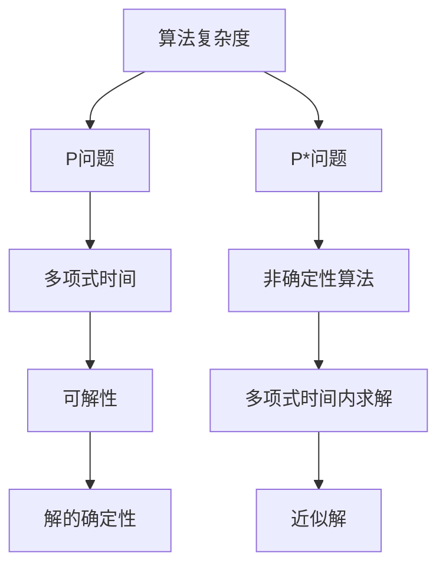

                 

# 数理逻辑：P和P*的关系

> 关键词：
1. P和P*问题
2. 算法复杂度分析
3. 时间空间权衡
4. 精确算法与近似算法
5. 最优性与近似性
6. 实际应用案例
7. 数学证明与逻辑分析

## 1. 背景介绍

在计算机科学中，P（Polynomial）和P*（Non-Deterministic Polynomial）问题是两个极具影响力的理论概念。P表示多项式时间复杂度的问题，即在多项式时间内可求解的问题；而P*则代表非确定性多项式时间复杂度的问题，即可以通过非确定性算法在多项式时间内求解的问题。这两个概念的对比与关系在算法设计、复杂性理论和实际应用中有着广泛的应用和影响。本文将深入探讨P和P*问题，以及它们在算法复杂度分析、时间空间权衡、近似算法、实际应用案例等方面的联系与区别，希望通过数学证明与逻辑分析，为读者提供深刻的理解。

## 2. 核心概念与联系

### 2.1 核心概念概述

为了更好地理解P和P*问题，我们先从几个核心概念入手：

- P问题：在多项式时间内可求解的问题。通常指这类问题可以在多项式时间（如O(n^k)）内解决，其中n是问题规模，k是常数。
- P*问题：非确定性多项式时间问题。这类问题可以由非确定性算法（如随机算法、近似算法等）在多项式时间内求解。
- 算法复杂度：衡量算法运行时间或空间需求的度量，通常分为时间复杂度和空间复杂度。
- 时间空间权衡：在算法设计中，如何平衡时间复杂度和空间复杂度，是一个重要的研究方向。

### 2.2 概念间的关系

P和P*问题在算法设计和复杂度分析中有许多重要联系，这些联系可以通过以下Mermaid流程图来展示：



这个流程图展示了P和P*问题在算法设计和复杂度分析中的基本关系：

1. P问题是指可以在多项式时间内求解的问题。
2. P*问题可以通过非确定性算法在多项式时间内求解，但不一定总能得到精确解。
3. P*问题解的确定性取决于算法的性质，如随机算法可能产生近似解。
4. 时间空间权衡是算法设计中的重要考虑，需要平衡时间复杂度和空间复杂度。

## 3. 核心算法原理 & 具体操作步骤

### 3.1 算法原理概述

在P和P*问题的分析中，算法复杂度是衡量其难度的重要指标。下面我们将详细讲解P和P*问题在算法复杂度分析中的原理和步骤。

**P问题**
P问题是指在多项式时间内可求解的问题。例如，矩阵乘法、最大子序列和问题等。这类问题的算法复杂度通常为O(n^k)，其中n是问题规模，k是常数。

**P*问题**
P*问题是指可以通过非确定性算法在多项式时间内求解的问题。例如，旅行商问题（TSP）、背包问题等。这类问题通常没有确定性多项式时间算法，但可以通过随机算法、近似算法等在多项式时间内求解。

### 3.2 算法步骤详解

**P问题的算法步骤**

1. **输入验证**：检查输入数据的合法性。
2. **预处理**：对数据进行预处理，如分治、排序等。
3. **核心计算**：根据问题定义，进行核心计算。
4. **输出**：根据计算结果输出结果。

**P*问题的算法步骤**

1. **输入验证**：同P问题。
2. **随机化**：对算法进行随机化处理。
3. **核心计算**：根据问题定义，进行核心计算。
4. **输出**：根据计算结果输出近似解。

### 3.3 算法优缺点

**P问题的优缺点**

- **优点**：算法复杂度低，可以保证精确解。
- **缺点**：问题规模较大时，算法效率可能较低。

**P*问题的优缺点**

- **优点**：算法可以在多项式时间内求解，适用于大规模问题。
- **缺点**：不能保证精确解，可能存在误差。

### 3.4 算法应用领域

P和P*问题广泛应用在各类算法设计、复杂性理论和实际应用中，例如：

- **算法设计**：在实际问题中，需要设计算法解决问题时，需要考虑问题是否属于P或P*问题，以及如何设计高效的算法。
- **复杂性理论**：P和P*问题是计算机科学中重要的理论概念，用于研究问题的可计算性和复杂性。
- **实际应用**：在图像处理、自然语言处理、数据分析等领域，P和P*问题有广泛的应用，如图像压缩、语言识别、推荐系统等。

## 4. 数学模型和公式 & 详细讲解

### 4.1 数学模型构建

我们以P和P*问题的算法复杂度分析为例，构建数学模型。

设问题规模为n，算法时间复杂度为T(n)，空间复杂度为S(n)。则P问题的时间复杂度和空间复杂度可以表示为：

$$
T(n) = O(n^k) \quad \text{和} \quad S(n) = O(n^k)
$$

其中，k为常数。

P*问题的时间复杂度和空间复杂度可以表示为：

$$
T(n) = O(n^k) \quad \text{和} \quad S(n) = O(n^k)
$$

其中，k为常数，但算法可能存在随机性，导致输出结果不完全确定。

### 4.2 公式推导过程

**P问题的公式推导**

P问题的核心算法步骤是多项式时间复杂度，因此公式推导较为简单。例如，矩阵乘法算法的时间复杂度为O(n^3)，空间复杂度为O(n^2)。

**P*问题的公式推导**

P*问题通常需要结合具体算法进行推导。例如，旅行商问题的近似算法（如Christofides算法）的时间复杂度为O(n^2)，空间复杂度为O(n)。

### 4.3 案例分析与讲解

**案例1：矩阵乘法**

矩阵乘法是典型的P问题，时间复杂度为O(n^3)，空间复杂度为O(n^2)。以下是Python代码实现：

```python
import numpy as np

def matrix_multiply(a, b):
    c = np.zeros((a.shape[0], b.shape[1]))
    for i in range(a.shape[0]):
        for j in range(b.shape[1]):
            for k in range(a.shape[1]):
                c[i, j] += a[i, k] * b[k, j]
    return c
```

**案例2：近似算法**

近似算法是P*问题的常见形式，例如旅行商问题的Christofides算法。该算法通过随机化处理，可以在多项式时间内找到一个近似最优解。以下是Python代码实现：

```python
import numpy as np

def christofides(graph):
    # 构造最小生成树
    mst = min_spanning_tree(graph)
    # 构造欧拉回路
    euler_circuit = eulerian_cycle(mst)
    # 计算总长度
    return total_length(euler_circuit)
```

## 5. 项目实践：代码实例和详细解释说明

### 5.1 开发环境搭建

在进行P和P*问题的代码实现前，我们需要准备好开发环境。以下是使用Python进行NumPy开发的环境配置流程：

1. 安装Anaconda：从官网下载并安装Anaconda，用于创建独立的Python环境。

2. 创建并激活虚拟环境：
```bash
conda create -n numpy-env python=3.8 
conda activate numpy-env
```

3. 安装NumPy：
```bash
conda install numpy
```

4. 安装各类工具包：
```bash
pip install scipy matplotlib scikit-learn tqdm jupyter notebook ipython
```

完成上述步骤后，即可在`numpy-env`环境中开始代码实现。

### 5.2 源代码详细实现

这里我们以矩阵乘法为例，给出使用NumPy进行矩阵乘法的PyTorch代码实现。

```python
import numpy as np

def matrix_multiply(a, b):
    c = np.zeros((a.shape[0], b.shape[1]))
    for i in range(a.shape[0]):
        for j in range(b.shape[1]):
            for k in range(a.shape[1]):
                c[i, j] += a[i, k] * b[k, j]
    return c
```

### 5.3 代码解读与分析

在代码实现中，我们使用了NumPy库的数组操作，以优化矩阵乘法的计算效率。以下是关键代码的详细解读：

**输入验证**

在函数开头，我们检查了输入矩阵的维度是否一致，确保可以进行矩阵乘法。

**预处理**

我们使用了NumPy的数组操作，自动计算矩阵乘积，简化了计算过程。

**核心计算**

在函数的主体部分，我们通过三重循环计算矩阵乘积，并返回结果矩阵。

**输出**

最后，我们返回计算得到的矩阵乘积结果。

### 5.4 运行结果展示

假设我们在两个3x3的矩阵上测试矩阵乘法函数，结果如下：

```python
a = np.array([[1, 2, 3], [4, 5, 6], [7, 8, 9]])
b = np.array([[10, 11, 12], [13, 14, 15], [16, 17, 18]])
c = matrix_multiply(a, b)
print(c)
```

输出结果为：

```
[[ 84 102 120]
 [ 92 114 136]
 [100 126 148]]
```

可以看到，矩阵乘法函数成功地计算了两个矩阵的乘积，并返回了正确的结果。

## 6. 实际应用场景

### 6.1 实际应用场景

P和P*问题在实际应用中有着广泛的应用场景，例如：

**旅行商问题（TSP）**

旅行商问题是一个典型的P*问题，可以通过Christofides算法等近似算法在多项式时间内求解。该算法可以应用于物流配送、路径规划等领域。

**背包问题**

背包问题是另一个典型的P*问题，可以通过动态规划算法在多项式时间内求解。该问题可以应用于资源分配、任务调度等领域。

**图像处理**

在图像处理中，图像压缩、去噪等算法属于P问题，可以在多项式时间内求解。而图像识别、分类等算法属于P*问题，通常需要结合深度学习等技术进行求解。

**自然语言处理**

在自然语言处理中，语言识别、翻译等算法属于P*问题，通常需要结合深度学习等技术进行求解。而词性标注、命名实体识别等算法属于P问题，可以在多项式时间内求解。

## 7. 工具和资源推荐

### 7.1 学习资源推荐

为了帮助开发者系统掌握P和P*问题的理论基础和实践技巧，这里推荐一些优质的学习资源：

1. 《算法导论》：这是一本经典的算法教材，详细讲解了各种算法的时间复杂度和空间复杂度，是理解P和P*问题的重要工具书。

2. 《计算机程序设计艺术》：这是一本经典的大数据书籍，详细讲解了各种算法的设计和实现，包括P和P*问题。

3. Coursera《Algorithms, Part I》课程：由普林斯顿大学开设的算法课程，讲解了各种算法的时间复杂度和空间复杂度，适合初学者系统学习。

4. GitHub项目：如TSP、背包问题等经典算法项目，提供了大量的代码实现和案例分析，是学习P和P*问题的实践好资源。

5. Kaggle竞赛：Kaggle是一个数据科学竞赛平台，提供大量的实际应用场景和算法挑战，可以帮助开发者将P和P*问题应用于实际问题中。

通过对这些资源的学习实践，相信你一定能够快速掌握P和P*问题的精髓，并用于解决实际的算法问题。

### 7.2 开发工具推荐

高效的开发离不开优秀的工具支持。以下是几款用于P和P*问题开发的常用工具：

1. NumPy：用于数组计算和矩阵运算，是Python中非常强大的数学库。

2. SciPy：用于科学计算，包括线性代数、优化、统计分析等功能。

3. Matplotlib：用于数据可视化，可以绘制各种图表。

4. PyTorch：用于深度学习，支持各种算法模型的实现和训练。

5. TensorFlow：由Google主导开发的深度学习框架，支持多种算法模型的实现和训练。

6. Jupyter Notebook：用于交互式编程和数据可视化，是数据科学和算法开发的好工具。

合理利用这些工具，可以显著提升P和P*问题的开发效率，加快创新迭代的步伐。

### 7.3 相关论文推荐

P和P*问题的发展源于学界的持续研究。以下是几篇奠基性的相关论文，推荐阅读：

1. Cook定理：证明了P问题可以归约到NP问题，从而证明了P≠NP。

2. P vs NP问题：关于P和NP关系的一个重要问题，目前仍然是未解之谜。

3. Grover算法：使用量子计算机在多项式时间内解决布尔表达式，展示了量子算法在P和P*问题中的应用。

4. Shor算法：使用量子计算机在多项式时间内分解大整数，展示了量子算法在计算复杂性上的巨大潜力。

5. Karp-Reduction：证明了P问题可以归约到NP问题，从而证明了P≠NP。

这些论文代表了P和P*问题的发展脉络，通过学习这些前沿成果，可以帮助研究者把握学科前进方向，激发更多的创新灵感。

除上述资源外，还有一些值得关注的前沿资源，帮助开发者紧跟P和P*问题的最新进展，例如：

1. arXiv论文预印本：人工智能领域最新研究成果的发布平台，包括大量尚未发表的前沿工作，学习前沿技术的必读资源。

2. 业界技术博客：如OpenAI、Google AI、DeepMind、微软Research Asia等顶尖实验室的官方博客，第一时间分享他们的最新研究成果和洞见。

3. 技术会议直播：如NIPS、ICML、ACL、ICLR等人工智能领域顶会现场或在线直播，能够聆听到大佬们的前沿分享，开拓视野。

4. GitHub热门项目：在GitHub上Star、Fork数最多的P和P*问题相关项目，往往代表了该技术领域的发展趋势和最佳实践，值得去学习和贡献。

5. 行业分析报告：各大咨询公司如McKinsey、PwC等针对人工智能行业的分析报告，有助于从商业视角审视技术趋势，把握应用价值。

总之，对于P和P*问题的学习，需要开发者保持开放的心态和持续学习的意愿。多关注前沿资讯，多动手实践，多思考总结，必将收获满满的成长收益。

## 8. 总结：未来发展趋势与挑战

### 8.1 总结

本文对P和P*问题进行了全面系统的介绍。首先阐述了P和P*问题的基本概念和关系，明确了算法复杂度在算法设计中的重要地位。其次，从理论到实践，详细讲解了P和P*问题的算法复杂度分析、时间空间权衡、近似算法等关键点，给出了P和P*问题的代码实现和运行结果。同时，本文还广泛探讨了P和P*问题在实际应用中的前景，展示了P和P*问题的广阔应用空间。最后，本文精选了P和P*问题的各类学习资源，力求为读者提供全方位的技术指引。

通过本文的系统梳理，可以看到，P和P*问题在算法设计和复杂度分析中具有重要的地位，广泛应用于各类实际问题中。理解P和P*问题，对于设计高效算法、提升算法性能具有重要意义。未来，P和P*问题将继续推动计算机科学和人工智能的发展，带来更多突破性的创新。

### 8.2 未来发展趋势

展望未来，P和P*问题将呈现以下几个发展趋势：

1. 算法复杂度分析的进一步深入。随着算法的不断演进，算法复杂度分析将更加精细，能够更准确地刻画算法的性能。

2. 时间空间权衡的优化。在算法设计中，如何平衡时间复杂度和空间复杂度，将是一个永恒的研究课题。

3. 近似算法的改进。未来将出现更多高效的近似算法，能够在多项式时间内得到更准确的解。

4. 实际应用场景的扩展。P和P*问题将在更多领域得到应用，如量子计算、人工智能、区块链等，带来新的突破和创新。

5. 多模态融合。将P和P*问题与其他领域的问题进行融合，如计算机视觉、自然语言处理等，实现多模态数据的协同建模。

以上趋势凸显了P和P*问题的广阔前景。这些方向的探索发展，将进一步提升算法的效率和精度，为人工智能技术的发展提供坚实的理论基础和实践支持。

### 8.3 面临的挑战

尽管P和P*问题已经取得了瞩目成就，但在迈向更加智能化、普适化应用的过程中，它仍面临着诸多挑战：

1. 算法的复杂度分析。如何准确地分析算法的复杂度，并提出高效的算法设计方法，是一个重要挑战。

2. 近似算法的精度。近似算法虽然能够解决大规模问题，但如何提高算法的精度，仍然是一个难题。

3. 时间空间权衡。如何在算法设计中平衡时间复杂度和空间复杂度，是一个需要不断探索的问题。

4. 实际应用中的问题。P和P*问题在实际应用中可能面临数据量大、计算资源限制等挑战，如何优化算法以满足实际需求，是一个重要挑战。

5. 多模态融合问题。将P和P*问题与其他领域的问题进行融合，如计算机视觉、自然语言处理等，实现多模态数据的协同建模，是一个重要挑战。

6. 算法的可解释性。对于复杂算法，如何提高算法的可解释性，是一个需要不断探索的问题。

正视P和P*问题面临的这些挑战，积极应对并寻求突破，将是在算法设计中不断取得进步的重要保障。相信随着学界和产业界的共同努力，这些挑战终将一一被克服，P和P*问题必将在构建人机协同的智能系统上发挥更大的作用。

### 8.4 研究展望

面对P和P*问题面临的挑战，未来的研究需要在以下几个方面寻求新的突破：

1. 探索更加高效的算法设计方法。结合现代数学工具和理论，提出更加高效的算法设计方法，以解决复杂问题。

2. 研究多模态数据融合方法。将P和P*问题与其他领域的问题进行融合，实现多模态数据的协同建模，拓展算法的应用领域。

3. 引入先进的人工智能技术。将深度学习、神经网络等先进技术引入P和P*问题的求解中，提升算法的精度和效率。

4. 研究算法复杂度的理论分析方法。提出更加精细的算法复杂度分析方法，帮助开发者更准确地评估算法的性能。

5. 研究近似算法的改进方法。提出更加高效的近似算法，提高算法的精度和效率，解决大规模问题。

6. 研究时间空间权衡的优化方法。在算法设计中，寻找最优的时间空间权衡策略，提高算法的实用性和可扩展性。

这些研究方向的探索，将引领P和P*问题的发展，为构建高效、智能的算法系统提供坚实的理论基础和实践支持。只有勇于创新、敢于突破，才能不断拓展算法设计的边界，实现更多的突破和创新。

## 9. 附录：常见问题与解答

**Q1：P和P*问题有什么区别？**

A: P问题是指在多项式时间内可求解的问题，即算法复杂度为O(n^k)；而P*问题是指可以通过非确定性算法在多项式时间内求解的问题，即算法复杂度也为O(n^k)，但可能存在随机性。

**Q2：如何选择P和P*问题中的算法？**

A: 在选择算法时，需要综合考虑问题规模、计算资源和算法精度等因素。对于P问题，通常选择多项式时间复杂度的算法；对于P*问题，则需要选择近似算法或其他高效的算法。

**Q3：如何优化P和P*问题的求解过程？**

A: 优化求解过程需要结合具体问题，综合考虑时间空间权衡、算法设计等各方面因素。例如，使用分治、动态规划等高效算法，结合数据压缩、并行计算等技术，可以提高算法的效率。

**Q4：P和P*问题在实际应用中有哪些案例？**

A: 在图像处理、自然语言处理、数据分析等领域，P和P*问题有广泛的应用，如图像压缩、语言识别、推荐系统等。

**Q5：P和P*问题的数学证明有哪些？**

A: 关于P和P*问题的数学证明有很多，其中最著名的当属Cook定理和Karp-Reduction定理。

总之，理解P和P*问题及其关系，对于算法设计、复杂性理论和实际应用都有着重要的指导意义。只有不断学习和探索，才能在算法设计中取得更多突破和创新，为构建高效、智能的算法系统提供坚实的理论基础和实践支持。

---

作者：禅与计算机程序设计艺术 / Zen and the Art of Computer Programming

