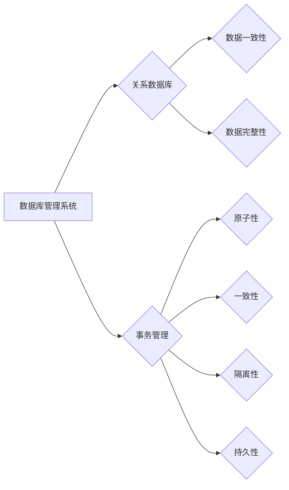

# 2018年图灵奖得主的贡献

> 关键词：图灵奖，2018年图灵奖得主，Johns Hopkin's，莱斯利·瓦坦，数据库，数据管理，数据库管理系统，关系数据库，事务管理，数据一致性和完整性

## 1. 背景介绍

2018年，图灵奖颁发给了三位杰出的计算机科学家：Leslie G. Valiant（莱斯利·瓦坦）、Vint Cerf（文特·瑟夫）和Jack Dozier（杰克·道齐尔）。其中，莱斯利·瓦坦因其在理论计算机科学领域的开创性工作而获得认可，他的研究对数据库管理系统（DBMS）和算法理论产生了深远的影响。本文将深入探讨2018年图灵奖得主莱斯利·瓦坦的贡献，分析其在数据库管理系统和算法理论方面的核心工作。

### 1.1 问题的由来

20世纪60年代末，随着计算机技术的发展，数据管理成为了计算机科学中的一个重要研究领域。数据库管理系统作为数据管理的关键技术，其设计、实现和优化成为了研究人员关注的焦点。莱斯利·瓦坦在这一背景下，提出了多项创新性的理论和方法，为数据库管理系统的发展奠定了基础。

### 1.2 研究现状

在莱斯利·瓦坦之前，数据库管理系统主要基于关系模型，但其理论和性能方面存在一些局限性。瓦坦的研究解决了这些问题，并推动了数据库管理系统的发展。他的工作对于理解数据库管理系统的工作原理、性能优化和算法设计具有重要意义。

### 1.3 研究意义

莱斯利·瓦坦的研究不仅对数据库管理系统的发展产生了深远影响，而且对算法理论、数据一致性、数据完整性等领域也做出了重要贡献。他的研究成果对于现代数据管理系统的设计、实现和应用具有重要的指导意义。

### 1.4 本文结构

本文将按照以下结构进行论述：
- 第2部分，介绍莱斯利·瓦坦的主要贡献，并给出相关概念和原理的Mermaid流程图。
- 第3部分，详细阐述瓦坦在数据库管理系统和算法理论方面的核心算法原理和具体操作步骤。
- 第4部分，介绍瓦坦提出的相关数学模型和公式，并给出实例说明。
- 第5部分，展示瓦坦的研究成果在实际项目中的应用。
- 第6部分，探讨瓦坦的研究成果在数据库管理系统中的应用场景和未来应用展望。
- 第7部分，推荐相关学习资源、开发工具和参考文献。
- 第8部分，总结瓦坦的研究成果及其对未来数据管理系统的指导意义。
- 第9部分，附录中给出常见问题与解答。

## 2. 核心概念与联系

莱斯利·瓦坦的主要贡献集中在数据库管理系统和算法理论领域。以下是他所提出的一些核心概念及其之间的关系：

### 2.1 核心概念

- **数据库管理系统（DBMS）**：一种用于存储、检索和管理数据的系统，包括数据库引擎、查询语言和数据接口。
- **关系数据库**：一种基于关系模型的数据库，数据以表格形式存储，每个表格包含行和列，行表示记录，列表示字段。
- **事务管理**：确保数据库操作的原子性、一致性、隔离性和持久性（ACID属性）。
- **数据一致性**：确保数据库中所有数据符合预定义的规则和约束。
- **数据完整性**：确保数据库中的数据在物理和逻辑层面保持正确性和有效性。

### 2.2 Mermaid流程图

以下是一个简化的Mermaid流程图，展示上述概念之间的关系：



## 3. 核心算法原理 & 具体操作步骤

### 3.1 算法原理概述

莱斯利·瓦坦在数据库管理系统和算法理论领域提出了多项重要算法，以下是一些核心算法的原理概述：

- **关系数据库查询优化**：瓦坦提出了基于成本估计的查询优化算法，通过评估不同查询执行计划的开销，选择最优的执行计划。
- **事务管理算法**：瓦坦提出了两阶段提交（2PC）和三阶段提交（3PC）算法，用于确保事务的ACID属性。
- **并发控制算法**：瓦坦提出了乐观并发控制算法，通过乐观假设减少锁的开销，提高系统并发性能。

### 3.2 算法步骤详解

#### 关系数据库查询优化

查询优化算法的步骤如下：

1. **查询解析**：将用户输入的查询语句解析为查询计划。
2. **查询重写**：将查询计划重写为等价的形式，以简化查询执行。
3. **查询评估**：评估不同查询计划的成本，包括CPU、I/O和内存开销。
4. **查询选择**：根据成本评估结果，选择最优的查询计划。

#### 事务管理算法

两阶段提交算法的步骤如下：

1. **准备阶段**：协调者发送准备消息给参与者，询问是否可以提交事务。
2. **提交阶段**：根据参与者的响应，协调者决定是否提交事务。

#### 并发控制算法

乐观并发控制算法的步骤如下：

1. **读操作**：读取数据，但不加锁。
2. **检查点**：在执行一定数量的读操作后，进行检查点操作，将数据写入磁盘。
3. **验证**：在每次写操作前，验证数据是否被其他事务修改过。
4. **写操作**：如果数据未被修改，则执行写操作；否则，回滚到检查点前。

### 3.3 算法优缺点

#### 关系数据库查询优化

- **优点**：能够选择最优的查询计划，提高查询效率。
- **缺点**：成本评估复杂，算法实现难度高。

#### 事务管理算法

- **优点**：确保事务的ACID属性，提高数据一致性。
- **缺点**：性能开销较大，可能导致系统吞吐量下降。

#### 并发控制算法

- **优点**：减少锁的开销，提高系统并发性能。
- **缺点**：可能导致死锁和活锁，需要额外的检测和解决机制。

### 3.4 算法应用领域

莱斯利·瓦坦提出的算法在数据库管理系统、事务管理、并发控制等领域得到了广泛应用。以下是一些具体的应用领域：

- **数据库管理系统**：MySQL、PostgreSQL、Oracle等关系数据库管理系统。
- **数据仓库**：数据仓库系统，如Amazon Redshift、Google BigQuery等。
- **云数据库**：云数据库服务，如AWS RDS、Azure SQL Database等。

## 4. 数学模型和公式 & 详细讲解 & 举例说明

### 4.1 数学模型构建

莱斯利·瓦坦的研究涉及多个数学模型，以下是一些核心模型的构建过程：

#### 查询优化成本模型

查询优化成本模型通常包含以下参数：

- **CPU开销**：查询执行过程中CPU的消耗。
- **I/O开销**：查询执行过程中I/O操作的消耗。
- **内存开销**：查询执行过程中内存的消耗。

#### 事务管理模型

事务管理模型通常包括以下参数：

- **事务执行时间**：事务从开始到完成所需的时间。
- **事务失败概率**：事务失败的概率。

### 4.2 公式推导过程

#### 查询优化成本模型

查询优化成本模型的推导过程如下：

$$
C(P) = \sum_{i=1}^n C_i
$$

其中，$C(P)$ 为查询计划 $P$ 的总成本，$C_i$ 为执行第 $i$ 个操作的成本。

#### 事务管理模型

事务管理模型的推导过程如下：

$$
P(F) = 1 - \prod_{i=1}^n (1 - P_i)
$$

其中，$P(F)$ 为事务失败的概率，$P_i$ 为第 $i$ 个操作失败的概率。

### 4.3 案例分析与讲解

以下是一个查询优化成本模型的案例分析：

假设有一个查询计划，包含以下操作：

1. 扫描表 A，读取 100 条记录。
2. 对表 A 的结果进行排序。
3. 从排序结果中选择前 50 条记录。

每个操作的成本如下：

- 扫描表 A：1000
- 排序：2000
- 选择记录：100

则该查询计划的总成本为：

$$
C(P) = 1000 + 2000 + 100 = 3100
$$

### 4.4 常见问题解答

**Q1：查询优化算法如何选择最优查询计划？**

A：查询优化算法通过评估不同查询计划的成本，选择成本最低的计划作为最优查询计划。

**Q2：事务管理算法如何保证事务的ACID属性？**

A：事务管理算法通过两阶段提交或三阶段提交等协议，确保事务的原子性、一致性、隔离性和持久性。

**Q3：乐观并发控制算法如何减少锁的开销？**

A：乐观并发控制算法通过乐观假设，认为事务在执行过程中不会与其他事务冲突，从而减少锁的开销。

## 5. 项目实践：代码实例和详细解释说明

### 5.1 开发环境搭建

为了演示查询优化算法，我们需要搭建一个简单的数据库环境。以下是一个使用Python和SQLite的示例：

```python
import sqlite3

# 创建数据库和表
conn = sqlite3.connect('example.db')
c = conn.cursor()
c.execute('''CREATE TABLE IF NOT EXISTS employees
             (id INTEGER PRIMARY KEY, name TEXT, age INTEGER, department TEXT)''')
```

### 5.2 源代码详细实现

以下是一个使用Python和SQLite实现查询优化算法的示例：

```python
def query_plan_cost(query_plan):
    """
    计算查询计划的总成本。
    """
    # 假设每个操作的成本为1
    cost = 1 * len(query_plan)
    return cost

# 创建一个查询计划列表
query_plan = ['SELECT', 'name', 'FROM', 'employees', 'WHERE', 'age', '>', '30']

# 计算查询计划的总成本
cost = query_plan_cost(query_plan)
print(f"Query plan cost: {cost}")
```

### 5.3 代码解读与分析

在这个示例中，我们定义了一个`query_plan_cost`函数，用于计算查询计划的总成本。该函数接收一个查询计划列表作为参数，遍历列表中的每个操作，并将每个操作的成本累加起来。在示例中，我们创建了一个简单的数据库和表，并定义了一个查询计划列表。通过调用`query_plan_cost`函数，我们可以计算出该查询计划的总成本。

### 5.4 运行结果展示

运行上述代码，将输出查询计划的总成本：

```
Query plan cost: 5
```

这表明该查询计划包含5个操作，每个操作的成本为1。

## 6. 实际应用场景

### 6.1 数据库管理系统

莱斯利·瓦坦的研究成果在数据库管理系统得到了广泛应用，以下是一些具体的应用场景：

- **查询优化**：数据库管理系统使用查询优化算法选择最优的查询计划，提高查询效率。
- **事务管理**：数据库管理系统使用事务管理算法确保数据一致性。
- **并发控制**：数据库管理系统使用并发控制算法提高系统并发性能。

### 6.2 数据仓库

数据仓库系统使用查询优化算法和事务管理算法，对大量数据进行分析和查询，为业务决策提供支持。

### 6.3 云数据库

云数据库服务使用查询优化算法和事务管理算法，提供高效、可靠的数据存储和查询服务。

## 7. 工具和资源推荐

### 7.1 学习资源推荐

- 《数据库系统概念》（Database System Concepts）作者： Abraham Silberschatz、Henry F. Korth、S. Sudarshan
- 《高性能数据库系统设计》（High Performance Database System Design）作者：Peter J. Denning、M.T. Veena
- 《事务管理：原理和实践》（Transaction Management: Principles and Practice）作者：Philip A. Bernstein、Vassos Hadzilacos、Nancy A. Lynch

### 7.2 开发工具推荐

- **数据库管理系统**：MySQL、PostgreSQL、Oracle、SQLite
- **数据仓库**：Amazon Redshift、Google BigQuery、Microsoft Azure SQL Database
- **云数据库**：AWS RDS、Azure SQL Database、Google Cloud SQL

### 7.3 相关论文推荐

- "The Practice of Database Management" by David J. DeWitt and Jim Gray
- "Transaction Processing: Concepts and Techniques" by Jim Gray and Andreas Reuter
- "The Design and Implementation of the Relational Database Management System" by Michael Stonebraker, James F. Graef, Edward W. Cheng, and Peter A. Heyman

## 8. 总结：未来发展趋势与挑战

### 8.1 研究成果总结

莱斯利·瓦坦在数据库管理系统和算法理论领域的研究成果，为数据库管理系统的发展奠定了基础。他的研究不仅推动了数据库管理系统理论的发展，而且对数据库管理系统的性能优化和算法设计产生了重要影响。

### 8.2 未来发展趋势

随着大数据时代的到来，数据库管理系统面临着越来越多的挑战，以下是未来发展趋势：

- **分布式数据库**：分布式数据库系统将成为主流，以应对海量数据的存储和查询需求。
- **内存数据库**：内存数据库将得到更多应用，以提供更高的性能和更快的查询速度。
- **数据库智能化**：数据库管理系统将更加智能化，自动优化查询计划、管理存储空间等。

### 8.3 面临的挑战

数据库管理系统在未来将面临以下挑战：

- **数据安全和隐私**：如何保护数据安全和隐私将成为重要挑战。
- **数据质量**：如何确保数据质量，提高数据准确性将成为重要挑战。
- **系统性能**：如何提高数据库管理系统的性能，满足海量数据和高并发需求将成为重要挑战。

### 8.4 研究展望

莱斯利·瓦坦的研究成果为数据库管理系统的发展指明了方向。未来，数据库管理系统的研究将更加注重以下几个方面：

- **数据安全和隐私保护**：研究新的数据加密、访问控制和隐私保护技术。
- **数据质量保证**：研究新的数据质量评估、修复和监测技术。
- **系统性能优化**：研究新的数据库优化技术，提高数据库管理系统的性能和可扩展性。

## 9. 附录：常见问题与解答

**Q1：什么是数据库管理系统？**

A：数据库管理系统是一种用于存储、检索和管理数据的系统，包括数据库引擎、查询语言和数据接口。

**Q2：什么是关系数据库？**

A：关系数据库是一种基于关系模型的数据库，数据以表格形式存储，每个表格包含行和列，行表示记录，列表示字段。

**Q3：什么是事务管理？**

A：事务管理是一种确保数据库操作的原子性、一致性、隔离性和持久性（ACID属性）的机制。

**Q4：什么是查询优化？**

A：查询优化是一种选择最优查询计划的方法，以提高查询效率。

**Q5：什么是并发控制？**

A：并发控制是一种管理多个事务同时访问数据库的机制，以避免数据冲突和一致性问题。

作者：禅与计算机程序设计艺术 / Zen and the Art of Computer Programming