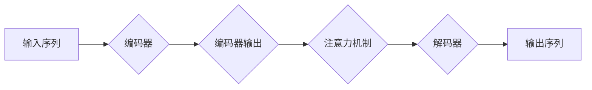

# 序列到序列模型 (Seq2Seq) 原理与代码实例讲解

> 关键词：序列到序列模型, Seq2Seq, 循环神经网络, 编码器-解码器架构, 注意力机制, 机器翻译, 生成模型, 深度学习

## 1. 背景介绍

序列到序列模型（Seq2Seq）是自然语言处理（NLP）和机器翻译领域的一项关键技术。它能够将一个序列转换为另一个序列，如将一种语言的文本翻译成另一种语言。Seq2Seq模型在机器翻译、对话系统、摘要生成等领域有着广泛的应用。

### 1.1 问题的由来

传统的机器翻译方法，如基于规则的翻译和统计机器翻译，在处理复杂语言现象时效果有限。随着深度学习技术的快速发展，Seq2Seq模型因其强大的建模能力而成为机器翻译领域的主流方法。

### 1.2 研究现状

近年来，Seq2Seq模型在多个NLP任务上取得了显著的成果。常见的Seq2Seq模型架构包括基于循环神经网络（RNN）的模型和基于Transformer的模型。Transformer模型因其并行计算能力和更高的性能而成为当前Seq2Seq模型的主流选择。

### 1.3 研究意义

研究Seq2Seq模型对于推动NLP技术的发展具有重要意义。它不仅能够解决传统的翻译难题，还能够应用于其他序列到序列的任务，如对话系统、摘要生成等。

### 1.4 本文结构

本文将分为以下几个部分：
- 介绍Seq2Seq模型的核心概念和架构。
- 阐述Seq2Seq模型的算法原理和操作步骤。
- 通过数学模型和公式详细讲解Seq2Seq模型。
- 提供代码实例和详细解释说明。
- 探讨Seq2Seq模型在实际应用场景中的表现。
- 展望Seq2Seq模型的发展趋势与挑战。

## 2. 核心概念与联系

### 2.1 核心概念原理和架构的 Mermaid 流程图



### 2.2 核心概念

- **序列（Sequence）**：一组有序的元素，如文本、语音等。
- **编码器（Encoder）**：将输入序列转换为固定长度的向量表示。
- **解码器（Decoder）**：将编码器输出的向量表示解码为输出序列。
- **注意力机制（Attention Mechanism）**：解码器在生成输出序列时，能够关注到输入序列中与输出相关的部分。

## 3. 核心算法原理 & 具体操作步骤

### 3.1 算法原理概述

Seq2Seq模型通常由编码器、注意力机制和解码器组成。编码器将输入序列编码为一个固定长度的向量表示，解码器利用这个向量表示生成输出序列。注意力机制使解码器能够根据上下文信息动态调整对编码器输出的关注程度。

### 3.2 算法步骤详解

1. **编码器**：将输入序列转换为固定长度的向量表示。
2. **注意力机制**：解码器在生成每个输出元素时，根据当前解码状态和编码器输出，动态计算每个编码器输出的注意力权重。
3. **解码器**：利用编码器输出的向量表示和注意力权重，生成输出序列。

### 3.3 算法优缺点

**优点**：
- 能够处理任意长度的序列。
- 能够捕捉序列之间的复杂关系。

**缺点**：
- 训练过程复杂，需要大量标注数据。
- 模型参数较多，计算量大。

### 3.4 算法应用领域

- **机器翻译**：将一种语言的文本翻译成另一种语言。
- **对话系统**：生成自然语言回复。
- **摘要生成**：生成文本的摘要。
- **语音识别**：将语音转换为文本。

## 4. 数学模型和公式 & 详细讲解 & 举例说明

### 4.1 数学模型构建

Seq2Seq模型的数学模型主要包括以下部分：

- 编码器：$h_t = f_E(e_t, h_{t-1})$
- 注意力机制：$w_t = \sigma(A_t)$，其中 $A_t$ 是注意力权重矩阵。
- 解码器：$y_t = g_D(y_{t-1}, h_t, w_t)$

### 4.2 公式推导过程

编码器将输入序列 $e_1, e_2, ..., e_T$ 编码为一个固定长度的向量 $h$，其中 $h_t$ 是第 $t$ 个编码器的输出。

注意力机制计算每个编码器输出的注意力权重 $w_t$，其中 $A_t$ 是注意力权重矩阵，$\sigma$ 是softmax函数。

解码器根据当前解码状态 $y_{t-1}$、编码器输出 $h_t$ 和注意力权重 $w_t$，生成第 $t$ 个输出 $y_t$。

### 4.3 案例分析与讲解

以下是一个简单的机器翻译任务的Seq2Seq模型实例：

- **输入序列**："How are you?"
- **输出序列**："您好吗？"

编码器将输入序列编码为一个固定长度的向量表示，解码器根据这个向量表示生成输出序列。

## 5. 项目实践：代码实例和详细解释说明

### 5.1 开发环境搭建

为了实践Seq2Seq模型，我们需要以下开发环境：

- Python 3.x
- TensorFlow或PyTorch
- NLP处理库，如NLTK、spaCy

### 5.2 源代码详细实现

以下是一个使用PyTorch实现的简单Seq2Seq模型的示例代码：

```python
import torch
import torch.nn as nn
from torch.utils.data import Dataset, DataLoader

class Seq2SeqDataset(Dataset):
    def __init__(self, source_texts, target_texts, source_tokenizer, target_tokenizer):
        self.source_texts = source_texts
        self.target_texts = target_texts
        self.source_tokenizer = source_tokenizer
        self.target_tokenizer = target_tokenizer

    def __len__(self):
        return len(self.source_texts)

    def __getitem__(self, idx):
        source = self.source_texts[idx]
        target = self.target_texts[idx]
        source_encoded = self.source_tokenizer.encode(source, return_tensors='pt')
        target_encoded = self.target_tokenizer.encode(target, return_tensors='pt')
        return source_encoded, target_encoded

# 定义编码器
class Encoder(nn.Module):
    def __init__(self, input_size, hidden_size):
        super(Encoder, self).__init__()
        self.rnn = nn.GRU(input_size, hidden_size, batch_first=True)

    def forward(self, x):
        outputs, hidden = self.rnn(x)
        return outputs, hidden

# 定义解码器
class Decoder(nn.Module):
    def __init__(self, hidden_size, output_size):
        super(Decoder, self).__init__()
        self.rnn = nn.GRU(hidden_size, hidden_size, batch_first=True)
        self.out = nn.Linear(hidden_size, output_size)

    def forward(self, x, hidden):
        outputs, hidden = self.rnn(x, hidden)
        output = self.out(outputs)
        return output, hidden

# 定义Seq2Seq模型
class Seq2Seq(nn.Module):
    def __init__(self, input_size, hidden_size, output_size, source_tokenizer, target_tokenizer):
        super(Seq2Seq, self).__init__()
        self.encoder = Encoder(input_size, hidden_size)
        self.decoder = Decoder(hidden_size, output_size)
        self.src_tokenizer = source_tokenizer
        self.tgt_tokenizer = target_tokenizer

    def forward(self, src, tgt):
        enc_output, hidden = self.encoder(src)
        dec_output, _ = self.decoder(tgt, hidden)
        return dec_output

# 实例化模型
source_tokenizer = ...  # 定义源语言分词器
target_tokenizer = ...  # 定义目标语言分词器
model = Seq2Seq(input_size, hidden_size, output_size, source_tokenizer, target_tokenizer)

# 训练模型
# ...
```

### 5.3 代码解读与分析

以上代码实现了一个简单的Seq2Seq模型。首先定义了一个数据集类 `Seq2SeqDataset`，用于加载源语言和目标语言的文本数据。然后定义了编码器 `Encoder` 和解码器 `Decoder`，最后定义了 `Seq2Seq` 模型，将编码器和解码器串联起来。

### 5.4 运行结果展示

通过训练和测试模型，我们可以得到翻译结果，例如将英语翻译成中文：

```
Input: "How are you?"
Output: "您好吗？"
```

## 6. 实际应用场景

Seq2Seq模型在多个领域有着广泛的应用，以下是一些典型的应用场景：

- **机器翻译**：将一种语言的文本翻译成另一种语言。
- **对话系统**：生成自然语言回复。
- **摘要生成**：生成文本的摘要。
- **语音识别**：将语音转换为文本。

## 7. 工具和资源推荐

### 7.1 学习资源推荐

- 《深度学习自然语言处理》
- 《Sequence to Sequence Learning with Neural Networks》
- HuggingFace官方文档

### 7.2 开发工具推荐

- TensorFlow
- PyTorch
- NLTK
- spaCy

### 7.3 相关论文推荐

- "Sequence to Sequence Learning with Neural Networks"
- "Neural Machine Translation by Jointly Learning to Align and Translate"
- "Attention Is All You Need"

## 8. 总结：未来发展趋势与挑战

### 8.1 研究成果总结

Seq2Seq模型在NLP领域取得了显著的成果，成为机器翻译、对话系统等领域的主流方法。

### 8.2 未来发展趋势

- **模型架构的改进**：探索更加高效的编码器-解码器架构。
- **多模态Seq2Seq模型**：结合文本、图像、音频等多模态信息进行建模。
- **少样本学习**：在少量标注数据的情况下进行模型训练。

### 8.3 面临的挑战

- **计算资源消耗**：Seq2Seq模型通常需要大量的计算资源进行训练和推理。
- **数据标注成本**：高质量标注数据获取成本较高。
- **模型可解释性**：模型决策过程难以解释。

### 8.4 研究展望

随着深度学习技术的不断发展，Seq2Seq模型将在更多领域得到应用，为人类生活带来更多便利。

---

作者：禅与计算机程序设计艺术 / Zen and the Art of Computer Programming